# System Architecture

## 总体架构

RepoHarness 的目标架构是分层的训练友好 Harness。下面的图不是一次性流水线，而是一个可重入的运行时闭环：

```text
Control Plane
  CLI / Eval Runner
    -> Task Adapter
    -> Context Builder
    -> Agent Loop
    -> Scaffold

Execution Plane
  Agent Loop
    -> Context Manager
    -> Model Client
    -> Tool System
    -> Permission System
    -> Workspace / Sandbox Adapter
    -> Verifier
    -> Agent Loop

Data Plane
  Trajectory Store observes:
    messages, tool calls, permission decisions, workspace events,
    verifier results, termination summaries, metrics
  Training Exporter reads:
    normalized task, transcript, events, final diff, verifier result,
    reward metadata, run metadata
```

每一层必须可独立测试和替换，避免把任务数据、工具执行、模型调用、评测逻辑和训练导出写成一个大脚本。

文档中的 sandbox 指执行边界设计，不等同于加固的生产级安全沙箱。Docker execution mode 只应被描述为 Docker-based executable repository environment。

当前实现已经超过 V1 架构快照：V2 扩展 provider、export audit、多 rollout 和 scaffold；V3 扩展真实 Docker backend、真实仓库任务、固定 SWE-Bench-like 验收、context compaction 和 acceptance bundle；V4 扩展 task source freeze、rollout orchestration、resource lock、checkpoint state、tool lifecycle audit、agent run integration、export quality、cards 和 final acceptance。下面的 V1 图仍然用于理解核心模块边界，但不能单独代表当前 V4 能力范围。

## V1 高层实体关系图

这张图用于快速建立项目全局心智模型。它只展示当前 V1 实现中的关键实体、聚合模块和主依赖关系，不展开具体方法清单。阅读顺序建议是先看这张高层图理解“谁编排谁、数据在哪里流动、最终产物在哪里沉淀”，再看后面的完整实现图对照具体模块和关键方法。

推荐查看方式：

- 首选打开 [V1 高层实体关系图 HTML 查看器](v1/assets/v1-high-level-architecture.html)。这个页面支持缩放和横向滚动，比 IDE Markdown 预览更适合看架构图。
- 如果只需要静态图，打开 [V1 高层实体关系图 SVG](v1/assets/v1-high-level-architecture.svg)。
- 如果需要编辑或粘贴到 Mermaid 编辑器，使用 [V1 高层实体关系图 Mermaid 源文件](v1/assets/v1-high-level-architecture.mmd)。只复制 `.mmd` 文件中的原始 Mermaid 内容，不要复制 Markdown 代码围栏。



高层图的核心阅读方式：

- Eval Runner 是运行总编排者，负责把任务、配置、工作区、验证器、Agent Loop、最终验收、奖励和指标串成一次完整 run。
- Agent Loop 只负责模型调用、工具结果回流、循环状态和 `agent_stop_reason`，不拥有 `final_verifier_status` 或 `run_outcome`。
- Tool Executor 负责工具调用生命周期；Permission System 负责是否允许执行；Workspace Adapter 才是文件读写、命令执行和 patch 捕获的最终边界。
- RunRecorder 把 transcript、events 和 artifact manifest 写入 run directory。Training Exporter 只读取原始运行事实并写出派生的 `exports/*.jsonl` 或 `exports/preference_skipped.json` 文件；Inspect Run 只读取已有 run directory，不重新评测或改写运行事实。

## V1 实现全景架构图

下面的图对应当前 V1 代码实现。实线表示运行时调用、编排或状态回流关系，虚线表示只读读取已有运行产物或 artifact 引用关系。图中的方法名是实现者阅读代码、排查运行结果和扩展功能时最关键的入口点，不代表每个模块的全部内部辅助函数。

推荐查看方式：

- 首选打开 [V1 架构图 HTML 查看器](v1/assets/v1-system-architecture.html)。这个页面不依赖 IDE 的 Mermaid 预览能力，支持缩放和横向滚动，适合查看完整大图。
- 如果只需要静态图，打开 [V1 架构图 SVG](v1/assets/v1-system-architecture.svg)。浏览器、预览应用和大多数 Markdown 预览都可以直接显示。
- 如果需要编辑或粘贴到 Mermaid 编辑器，使用 [V1 架构图 Mermaid 源文件](v1/assets/v1-system-architecture.mmd)。注意只粘贴 `.mmd` 文件里的原始内容，不要把 Markdown 的 ```mermaid 代码围栏一起粘贴，否则部分在线编辑器会报 `UnknownDiagramError`。



这张图有四个需要特别注意的边界：

- Agent Loop 只拥有循环内部状态、messages、工具调用回流和 `agent_stop_reason`。`final_verifier_status`、`final_verifier_mode` 和 `run_outcome` 由 Eval Runner 在最终 verifier、baseline 和超时等信息齐全后统一派生；`manual_stop` 当前只是 outcome policy 和 AgentStopReason 中的预留分支，不是 V1 命令入口已经触发的常规路径。
- `ReplayModelClient` 可以读取完整 `ReplayScript`，并使用 `expected_outcome` 做 replay 对齐校验；但是写入模型响应运行产物时只使用 `ReplayStep.model_visible_payload()`。Replay step 中的 `assistant_text`、`tool_name` 和 `arguments` 会作为模拟模型响应进入 transcript 和训练导出的 assistant target；`expected_outcome`、replay fixture metadata、脚本注释以及其他只服务于测试驱动校验的字段不能进入 `PreparedMessages`、模型可见 transcript、训练导出的 prompt、observation 或 assistant target。
- 未知工具和 schema 校验失败在权限检查前生成结构化错误 `ToolResult`，不进入 Permission System。已知工具通过 schema 校验后调用 `PermissionSystem.check()`；工具执行阶段如果发现旧文本匹配失败、参数语义不成立等输入语义问题，会继续生成结构化错误 `ToolResult`，并记录在工具事件和 transcript 中。
- 工具执行、验证器和 patch 捕获路径中的文件读写、patch 应用和命令执行最终都必须经过 Workspace Adapter。当前 Context Builder 读取仓库上下文预览时，会直接读取 `RunWorkspace.workspace_path` 下固定允许文件；这是初始化模型可见上下文的受限实现路径，不是工具执行边界。Permission System 只负责决策，Tool System 只负责工具契约、校验、调用和结果格式化，Trajectory Store 只负责记录事实和 artifact 引用。

## 核心模块职责

CLI 与配置层负责读取任务列表、模型配置、运行参数、权限模式和输出目录。它不直接执行工具，也不直接解析测试结果。

Task Adapter 负责把自建任务、issue-style fixture tasks、以及历史上预留且已经在 V3/V4 部分落地的 SWE-Bench-like 与 PR / issue 数据转换成统一任务对象。

Context Builder 负责把任务、工作区、`ResolvedVerifierPlan` 中允许模型看到的测试目标摘要、scaffold、工具规则、权限模式、预算配置和固定仓库上下文预览构造成模型可见的初始 messages，并防止 `gold_patch`、隐藏测试、baseline 原始细节和奖励元数据等 evaluator-only metadata 泄漏给模型。当前实现中，仓库上下文预览由 Context Builder 直接读取 `RunWorkspace.workspace_path` 下的固定文件名集合；它不是模型工具可调用的文件读取路径。

Context Manager 负责每轮模型调用前的运行时上下文治理，包括消息预算、工具输出替换、旧测试输出摘要、provider message normalization、context event 记录和 tool call / tool result 配对校验。它不构造初始任务 prompt，也不重新解释 reward 或 verifier 结果。

Model Client 负责把标准化 messages 和 tools 发送给具体模型供应商，并把供应商响应、工具调用、token usage、错误类型和原始响应 artifact 标准化为 `ModelResponse`。

Workspace / Sandbox Adapter 负责创建任务工作区、复制仓库、执行命令、保存 diff 和清理环境。

Agent Loop 负责维护消息、调用模型、解析工具调用、回填工具结果、控制终止条件。

Tool System 负责定义工具契约、输入校验、工具执行、输出截断和 tool result 格式化。

Permission System 负责判断一次工具调用是否允许执行，和 workspace/sandbox 边界分层。

Verifier / Reward 负责运行测试、解析结果、生成评测指标和 reward metadata。

Trajectory Store 负责保存 transcript、events、artifact manifest、final patch、verifier result、reward metadata、metrics 和 summary。

Training Exporter 负责把轨迹转换为 SFT、reinforcement learning rollout 或 preference pair 数据。它只读取原始运行事实，不重新评测，也不改写原始 transcript、events、metrics、verifier 或 reward；导出结果写入 `exports/` 目录。

## 第一版 CLI / Eval Runner 操作面

第一版应先提供可验收的命令行入口，让实现者可以从端到端行为反推模块边界，而不是只写库函数。建议最小入口：

```text
repo-harness validate-task <task_path>
repo-harness run-task <task_path> --config <run_config>
repo-harness run-batch --config <run_config>
repo-harness export <run_dir_or_runs_dir> --format <sft_jsonl|rl_jsonl|preference_jsonl>
repo-harness inspect-run <run_dir>
```

入口语义：

- `validate-task`：只调用 Task Adapter 做 schema、visibility、环境身份和静态 verifier 配置校验，不创建正式 workspace，不运行模型。
- `run-task`：运行单个任务的完整闭环，包括 baseline、agent loop、final patch 冻结、strict final verifier、reward metadata 和 artifacts。
- `run-batch`：按 `RunConfig` 加载任务列表，逐个或有限并发运行，遇到 invalid 或 flaky task 时按 `fail_on_invalid_task` 决定跳过还是让命令失败。
- `export`：只读取已有 run directory 或 runs directory，不重新运行 verifier，不修改原始轨迹。
- `inspect-run`：读取 transcript、events、artifacts、metrics 和 summary，帮助人工诊断一次运行。

Eval Runner 是 `run-task` 和 `run-batch` 背后的运行编排者。它可以调用 Task Adapter、Workspace Adapter、Verifier、Agent Loop 和 Trajectory Store，但不直接执行工具、不解析测试日志、不把隐藏答案注入模型上下文。`export` 由 CLI 直接调用 Training Exporter，`inspect-run` 由 CLI 直接调用 Inspect Run；这两个入口只读取已有 run directory，不属于 Eval Runner 编排链路。

## 模块所有权表

| 模块 | 拥有的数据 | 不应该直接负责 | 可以调用的下游 | 必须记录的事件 |
| --- | --- | --- | --- | --- |
| CLI | `RunConfig`、任务列表、输出目录、命令参数 | 具体工具执行、测试解析、运行结论派生 | Eval Runner、Task Adapter validate path、Training Exporter、Inspect Run | command started、export requested、inspect requested |
| Eval Runner | 单次或批量运行上下文、预算、质量门控状态、输出目录 | 具体工具执行、测试日志解析、导出数据生成 | Task Adapter、Workspace Adapter、Verifier baseline/final path、Agent Loop、Trajectory Store | run started、baseline completed、run finished |
| Task Adapter | `TaskDefinition`、`RunnableTask`、verifier 配置 | 模型调用、reward 公式、baseline 执行、workspace 创建 | 无运行时下游；只能使用只读 schema、路径和任务元数据解析 helper | task loaded、task invalid |
| Context Builder | 初始 messages、prompt/context 版本、可见上下文策略 | 执行工具、读取隐藏评测答案、修改 `ResolvedVerifierPlan` | Scaffold、Agent Loop | context built、context truncated |
| Context Manager | `context_revision`、context reduction policy、content replacement state、provider-ready messages | 构造初始任务 prompt、执行工具、修改 transcript 事实 | Agent Loop、Trajectory Store | context prepared、tool result replaced、context_limit |
| Model Client | `ModelResponse`、token usage、provider request id、模型错误 | 工具执行、权限判断、trajectory 决策 | Agent Loop | model call started、model call completed、model call failed |
| Workspace / Sandbox Adapter | `RunWorkspace`、路径边界、命令执行、diff 捕获 | 权限策略、模型消息 | Permission System 的决策结果、底层执行环境 | workspace created、command executed、diff captured |
| Agent Loop | `AgentLoopState`、messages、终止原因 | 文件系统边界、测试解析 | Model Client、Tool System、Verifier 中间测试反馈路径 | model call、assistant message、termination |
| Tool System | `Tool` definition、`ToolCall`、`ToolResult` | 直接绕过 workspace 写文件或执行命令 | Permission System、Workspace Adapter、Verifier 中间测试反馈路径 | tool requested、tool completed、tool failed |
| Permission System | `PermissionDecision`、规则命中原因 | 执行命令、修改文件 | Workspace Adapter 的只读路径解析能力，或者读取只读策略配置 | permission allowed、permission denied、permission requires ask |
| Verifier / Reward | `VerifierResult`、`RewardMetadata`、metrics | 任意工具编排、模型重试策略 | Workspace Adapter 的命令执行能力 | verifier started、verifier completed、reward computed |
| Trajectory Store | transcript、events、artifacts index | 推断业务决策、修改 workspace | 文件系统写入 run directory | artifact written、event appended |
| Training Exporter | `ExportRecord`、export metadata | 重新评测任务、改写原始轨迹 | Trajectory Store、Verifier result | export started、export completed、record skipped |

所有文件写入、patch 应用和进程执行最终必须经过 Workspace / Sandbox Adapter。Tool System 可以决定“调用哪个工具”和“如何格式化结果”，但不应该自己实现另一套路径边界、命令超时或 diff 捕获逻辑。

## 端到端对象流

完整数据流在 `11-object-model-config-and-data-flow.md` 中集中定义。系统架构层面应保持以下顺序：

1. `TaskDefinition` 从 YAML 或 JSON 进入 Task Adapter。
2. Task Adapter 输出 `RunnableTask` 和静态 `VerifierConfig`。
3. Eval Runner 调用 Workspace Adapter 与 Verifier 生成 `BaselineResult`，并根据 `BaselineResult.status` 判断是否进入正式 agent run。
4. Eval Runner 基于 `VerifierConfig` 和 `BaselineResult` 生成运行时 `ResolvedVerifierPlan`。baseline 发现的 fail-to-pass、pass-to-pass、flaky tests 和 parser confidence 进入这个运行时计划，不反向修改 Task Adapter 的静态输出。
5. Workspace Adapter 创建正式 `RunWorkspace`，恢复 `dependency_state`，建立 `agent_start_snapshot`。
6. Context Builder 根据 `RunnableTask`、`RunConfig`、workspace、`ResolvedVerifierPlan` 和 scaffold 构造初始 messages。
7. 每轮模型调用前，Context Manager 根据预算、tool pairing state 和 context policy 生成 provider-ready messages，并记录 context event。
8. Agent Loop 通过 Model Client 调用模型，得到标准化 `ModelResponse`、`ToolCall` 或 final answer。
9. Tool System 校验 `ToolCall`，请求 `PermissionDecision`，并保证每个 tool call 都配对 tool result。
10. Workspace Adapter 在允许的执行边界内完成文件或命令操作。
11. `ToolResult` 回流到 messages，并通过 RunRecorder 写入 transcript、events 和 artifact manifest。
12. `run_tests` 可以触发 verifier 的中间反馈路径；agent 停止后必须触发最终验收路径。
13. `VerifierResult` 和 `RewardMetadata` 进入 trajectory、metrics 和 export metadata。
14. Trajectory Store 保存 patch、diff、events、artifact manifest、summary、verifier 输出和 reward metadata。
15. Training Exporter 从完整 run artifacts 生成 SFT、reinforcement learning rollout 或 preference pair 数据。

## 关键不变量

- 工具结果必须作为 tool result 回流到下一轮模型上下文。
- 每轮模型调用前必须通过 Context Manager 生成可复盘的 provider-ready messages，训练导出的 observation 必须匹配当时模型实际可见内容。
- 所有写操作必须限制在任务工作区内。
- 训练奖励和离线评测必须共用同一套 verifier。
- 轨迹记录不能依赖终端界面或人工观察。
- 只读工具可以并发，写工具和测试命令默认串行。
- 未声明并发安全的工具默认不并发。
- verifier 输出必须既能被人读懂，也能被训练导出模块消费。
- 任何 sandbox 表述都必须保守，不声称生产级安全隔离。

## 与 Claude Code 的关系

RepoHarness 借鉴 Claude Code 的架构分层，而不是复制产品代码。重要参考点包括：

- `query()` 风格的统一 agent loop。
- `QueryEngine` 与 turn 执行循环分离。
- `Tool` 是能力契约，不是函数列表。
- 工具执行经过 schema 校验、权限判断、执行、结果回流。
- permission 与 sandbox 是不同边界。
- 子代理复用同一套 query loop。
- transcript、events 和 diagnostics 是长期任务的基础设施。

对应参考资料在 `reference/claude-code-docs/` 和本地忽略的 `reference/claude-code-typescript-src/` 中。

RepoHarness 只借鉴架构模式和运行时不变量，不要求保留 TypeScript 文件名、产品模式名称或 Claude Code 的交互功能。参考源码是设计资料，不是未来 Python 实现的复制目标。

## 第一版边界

第一版设计面向单机、本地或 Docker 执行、JSONL 轨迹、批量评测和训练导出。远程执行、插件化扩展、复杂多代理、企业权限和大规模异步 rollout 只预留接口，不作为第一版实现目标。
