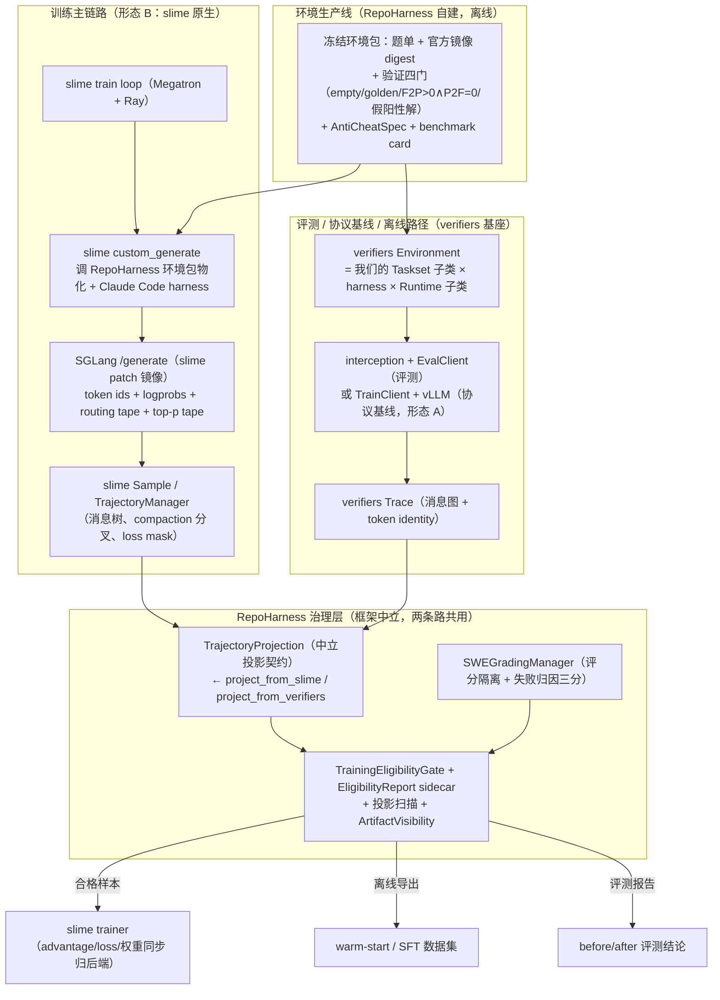

# 02 — S0 结论汇总与当前 RL Infra 架构说明

本文有两个目的：把 S0 阶段散落在各 evidence 文件里的结论收拢成一页可读的总结；回答一个关键理解问题——**"形态 B（slime 原生）定为训练主形态"之后，verifiers v1 还依赖不依赖、依赖到什么程度**。写给项目所有者，不是给机器的 evidence（机器可读账本仍是 `s0/s0_acceptance_summary.json`）。

---

## 1. 先直接回答你的问题

你的疑问是：初版主链路"不走 verifiers TrainClient、走 slime Claude Code harness + SGLang `/generate`"，是不是意味着**完全不需要 verifiers 了**，只剩 slime + RepoHarness 自己的一堆契约？

**答案：两个极端都不对，真实结论在中间。**

```text
错误理解 A："verifiers 被扔掉了，现在是纯 slime + RepoHarness 契约。"
错误理解 B："所有训练 rollout 都必须穿过 verifiers 的 TrainClient/interception。"

正确理解：verifiers 从"训练 rollout 的必经通道"退位，
         但保留了三个角色，一个都没丢：

  角色 1【对象模型与环境基座】（永久，最重要）
    Taskset / Harness / Runtime / Environment / Rollout / Episode 这套
    可组合对象模型仍是 RepoHarness 环境层的地基。证据就在 S0-7：
    我们的 SweSmokeTaskset 就是 verifiers Taskset 的子类，跑在 verifiers
    DockerRuntime 上；S2 的 SWE-SEE 安全 Runtime 也是子类化 verifiers
    DockerRuntime。这条依赖与"训练 rollout 走哪条路"无关。

  角色 2【评测与离线路径的运行时】（长期）
    "评测 = 同一 Environment + EvalClient"的故事完全建立在 verifiers 上
    （S0-3 玩具闭环、S0-7 八题 smoke 都是这条路跑的）。训练前后的
    before/after 评测、离线数据导出的一部分来源，都走 verifiers 运行时。

  角色 3【协议基线】（保留不删）
    形态 A（verifiers TrainClient + vLLM token 端点）在 S0-5 已验证全链
    可用。它降级为"协议基线与 dense/评测路径"：当形态 B 出现 token 不一致
    的疑问时，形态 A 是对照组；小 dense 模型的 token 级实验也走它。
```

一句话：**训练时的"生成引擎驱动权"交给了 slime；环境的"定义权"和评测的"运行权"仍在 verifiers 基座上；治理的"裁判权"从来都在 RepoHarness 自己手里，且刻意做成不认框架。**

---

## 2. 为什么形态 B 是训练主形态（S0 的证据链）

这个决策不是偏好，是三条实测证据推出来的（详见 `s0/topology_ab_report.md`）：

```text
证据 1：top-p tape 是分水岭（S0-6 探针）。
  stock SGLang 0.5.9 对 top-p tape 请求静默忽略（200 返回但 meta_info
  无字段）；slime 有现成的 929 行 sglang patch + 打好 patch 的官方镜像。
  而形态 A 这边，vLLM 0.24 / verifiers wire / prime-rl 三处都没有
  top-p 等价物——走 A 要自己改三个仓库，走 B 是拉一个现成镜像。
  （实验设计 E2 若定 rollout top_p=1.0 可暂时解耦这条硬依赖，但偏离
  全部前沿配方，见 s0_8 审读的用户决策 2。）

证据 2：MoE routing 两边都通，但 B 更顺（S0-5/6）。
  形态 A：vLLM 能返回 routing payload，但 wire 形状（base64 .npy）与
  verifiers 期望不符，需要薄 shim（已验证可行，[21,48,8] token identity
  保持）。形态 B：SGLang 原生 enable_return_routed_experts，slime 的
  Sample 直接解码（[20,48,8]）。
  训练目标是 MoE（Qwen3-30B-A3B），routing replay 是硬前提（M1 定案）。

证据 3：slime 官方已有端到端参照（examples/coding_agent_rl）。
  形态 B 不是我们发明的路，是 GLM-5.2 生产同款路，风险最低。
```

**形态 B 的硬性实施要求**（topology 报告附带，S1 落实）：pin slime 镜像、启动时探针断言（routing/top-p 字段真的在返回里，防静默降级）、tape 解码只在 projection 层实现一次。另有 U-H 残留：slime patch 镜像在 Blackwell sm_120 上的可用性 S1 首先验证。

---

## 3. 当前定案架构（简图）

核心图：**一套环境包，两条消费路径，一个治理漏斗。**



读图要点：

```text
1. 环境包是唯一的"产品"，两条路径都消费它——训练走 slime 绑定，
   评测走 verifiers Taskset 绑定。环境的语义（任务、镜像、评分判据、
   反作弊规格）只定义一次。
2. 治理层（右下）刻意不认框架：它只消费 TrajectoryProjection 这个
   中立契约。slime Sample 和 verifiers Trace 各有一个投影 adapter，
   投影完之后治理层看不出样本来自哪条路。这就是"多后端解耦"落地的
   物理形态——也是这个项目相对 slime/verifiers 的差异化价值所在。
3. verifiers 的 TrainClient/interception 只出现在左下角的评测/基线路径，
   不在训练主链路上——这就是你引的那句话的准确含义。
```

---

## 4. 你列的契约清单：全部属于 RepoHarness 治理层，与路径选择无关

你列的名字和实际规划的对应关系（实施计划总纲 §2 的 `contracts/` 目录）：

| 你列的名字 | 实际契约落位 | 说明 |
| --- | --- | --- |
| TrajectoryProjection | `contracts/trajectory.py` | 中立投影：BranchProjection / CompactedSubTraceLineage / TokenSpan / LossMaskSpan / LogprobProvenance / RoutingTensorRef / SamplingMaskRef |
| EligibilityReport | `contracts/eligibility.py` | typed sidecar，三档资格 + fail-closed |
| RewardFacts | `contracts/trajectory.py` 内 | reward_scope / components / group 信号 |
| FailureCategory | `contracts/grading.py` | infra_failure / patch_apply_failed / tests_failed 三分 |
| SandboxSpec | 设计文档 2 §5.1（S2 落 runtime/ 配置） | 安全分档参数 |
| GradingSpec | `contracts/grading.py` + `grading/manager.py` | clean checkout / patch replay / 隐藏资产挂载策略 |
| AntiCheatSpec | `contracts/findings.py` + `anticheat/` | 四类作弊 + 在线拦截语义（block+dummy+继续） |
| ArtifactVisibility | `governance/projection.py` | 五类可见性 + forbidden marker 扫描（继承 L4/L5） |
| TrainingExportRecord | `adapters/offline_export/` 的输出契约 | 对接 warm-start 过滤 |

**这些契约不管训练走形态 A 还是 B 都一模一样**——这正是把它们设计成中立契约的原因。你的清单没有理解错，错的只是"要契约就不要 verifiers"这个隐含推论：契约是裁判规则，verifiers 是其中一个赛场（评测场），slime 是另一个赛场（训练场），赛场可以换，规则不换。

---

## 5. verifiers 依赖的具体形式（逐条列清）

| 依赖形式 | 具体内容 | 什么时候在场 |
| --- | --- | --- |
| **pip 依赖 + 子类化**（运行时） | `SweSmokeTaskset(Taskset)`、S2 的 `SweSeeDockerRuntime(DockerRuntime)`、未来白盒 harness 子类 | 评测、环境生产验证、S1 离线导出的 verifiers 来源部分 |
| **契约测试守护**（开发时） | `rh2/tests/contract_verifiers/` 17 用例钉住我们依赖的行为，升级 verifiers 先过这套 | 永久 |
| **形态 A 保留路径**（运行时，低频） | TrainClient + vLLM token 端点 + 薄 routing shim | 协议对照、dense 小模型 token 实验 |
| **设计借鉴**（无运行时依赖） | Trace 图的 token identity 思想被 slime TrajectoryManager 印证；我们的投影契约字段设计参照两家 | 永久 |
| **不依赖的部分** | 训练主链路的 rollout 生成、EnvServer 服务化（现阶段）、prime runtime | —— |

---

## 6. S0 结论总表（浓缩版，出处均在 `s0/` evidence）

**四个验证项全过：**

| 验证项 | 结论 | 关键事实 |
| --- | --- | --- |
| V1 依赖可用性 | ✅ | prime 生态依赖 macOS 一次装通（import 惰性）；docker 使用层远程/本机双验 |
| V2 renderer 覆盖 | ✅ | Qwen3-30B-A3B 在 MODEL_RENDERER_MAP 精确注册；12/12 渲染一致 + 12/12 bridge；**U-G：本地路径加载会静默降级 DefaultRenderer，必须启动断言** |
| V3 token 协议 | ✅ | TrainClient 全链绿（4B+30B）；Blackwell 稳定参数固化（--enforce-eager / 关 FLASHINFER sampler / --moe-backend triton） |
| V4 MoE 穿透 | ✅ | routing 两形态都通；top-p 只有 slime patch 路线有 → **形态 B 定为训练主形态** |

**九项任务全部完成**：文档切换、rh2 工程（pin `5885ab9c` 全 hash）、17 用例契约测试、玩具闭环（含真实 deepseek 4/4 + docker）、renderer 核实、协议链路、MoE 探针、SWE smoke（**8/8 跑通、7/8 解出、均值 53.4s**）、实验设计收口（10 处修订）。

**改变后续计划的关键发现：**

```text
1. deepseek-chat 背过 SWE-bench 题（S0-7）——评测/自产数据要防污染，
   直接影响实验决策 1 的数据选择。
2. /testbed 物化契约是"血缘判据"（HEAD^==base_commit，叠加提交可非空）
   ——S1 taskset 物化校验按此写。
3. verifiers loader 本地插件 id 必须单段——S1 所有 taskset 命名约定。
4. SWE 官方镜像实占 8.13GB/8 题（预算高估 6 倍）——磁盘不再是约束。
5. vLLM routing wire 需要薄 shim、tape 解码只准在 projection 层做一次
   ——S1 中立投影层的实现要求。
```

**未关闭项**：U-C（8 卡训练侧显存/PCIe 通信，S4 前专项预实验）、U-H（slime patch 镜像 on sm_120，S1 第一个验证项）；**等你拍板**：SWE 8 题题单冻结、实验层决策 1~6（见 `s0/s0_8_expdesign_review.md`）。

---

## 7. 对 S1 计划的一个显式影响（提前说明，避免又一次困惑）

S0 之前的实施计划总纲写过"S1 只实现 verifiers Trace → 中立投影这一个 adapter，slime 原生投影等形态 B 启用再写"。**形态 B 现在定为主形态，这句话过时了**：S1 计划编写时会把 `project_from_slime`（slime Sample → TrajectoryProjection）提升为训练主线交付物，`project_from_verifiers` 服务于评测与离线导出路径——两个 adapter 都要，只是主次对调。这是 S0 结论对 S1 的最大结构性输入，会写进 S1 执行计划并同步回总纲。

---

## 8. 训练链路逐步走查（2026-07-08 追问澄清）

针对"训练路径是否使用 verifiers 对象"的追问，把形态 B 下一条轨迹的生命周期逐步列出（[]内为组件归属）：

```text
1. slime 触发 custom_generate(args, sample, ...)
2. [RepoHarness 库]   环境包物化：起沙箱、按血缘契约校验 /testbed
                      （HEAD^==base_commit，S0-7 发现 2）
3. [slime 现成组件]   Claude Code harness 在沙箱内运行（直接复用，不重写）
4. [slime 现成组件]   Anthropic adapter → SGLang /generate
                      （token ids + logprobs + routing tape + top-p tape，
                       slime patch 镜像，启动探针断言字段在场）
5. [slime 现成组件]   TrajectoryManager：消息树 → loss-masked Sample(s)
                      （compaction 分叉各成一条可训练轨迹）
6. [RepoHarness 库]   GradingManager：fresh 评分沙箱重放 cleaned patch
                      → RewardFacts + 失败归因三分（在 custom_generate
                      编排之内，不是"返回后再打分"）
7. [RepoHarness]      project_from_slime：Sample → TrajectoryProjection
                      （tape 解码只在此层做一次）
8. [RepoHarness]      EligibilityGate：provenance/评分/反作弊/可见性合取
                      → 三档资格 + EligibilityReport sidecar + artifact 旁路
9. 合格 → Sample 进 slime 训练 batch（advantage/loss/权重同步归 slime）；
   降级 → 组修复信号及时浮给后端；样本转离线导出或 audit
```

**两条精确化结论**（修正常见误读）：

1. **训练路径运行时不实例化任何 verifiers 对象。** verifiers 对象模型对训练链路的贡献是"分层纪律"（ownership 划分决定 RepoHarness 库代码的组织方式）；其运行时实例只出现在评测/基线路径——同一套环境包库代码由 verifiers `Taskset` 子类包一层绑定（S0-7 的 `SweSmokeTaskset` 即此绑定）。即：**环境包库代码写一次，slime 绑定（训练）与 verifiers 绑定（评测）各包一层。**
2. **三个消费者的归属**：slime trainer 与 SFT/离线导出挂在训练路径 gate 之后；**评测报告主要由 verifiers 评测路径产出**（同一环境包 + EvalClient），不经过训练链路。
