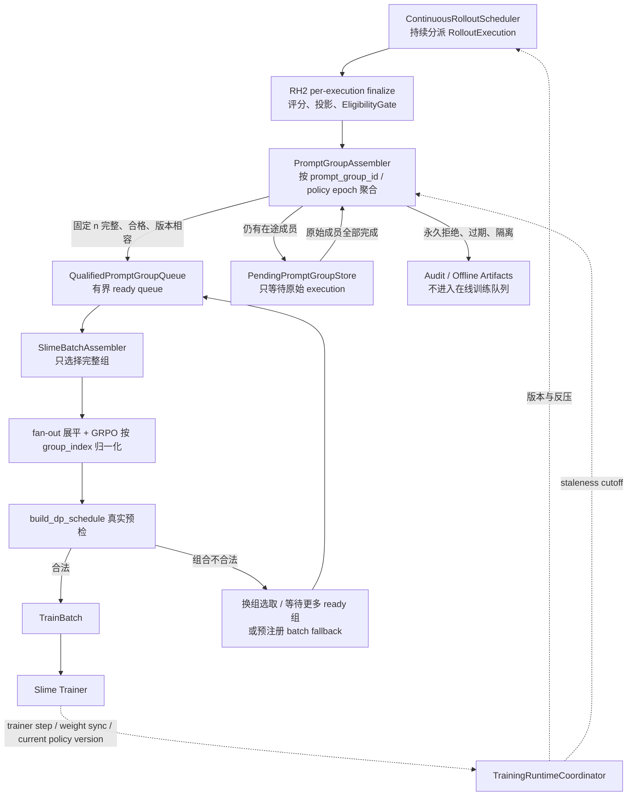

# RepoHarness fully async rollout 与训练消费管线改造讨论稿

> 日期：2026-07-12
> 代码基线：RepoHarness `6f01c1db`；slime `e848052a`。
> 状态：实施细节讨论稿；主方向已经定案，但尚未实现或验收。
> 范围：讨论持续 rollout worker、RH2 单轨迹 finalize、PromptGroup 组装、合格组队列、fan-out/GRPO 语义、BatchAdmission、`build_dp_schedule` 和 trainer 消费的完整异步链路。PromptGroup 缺员只是其中一个输入状态，不再是文档中心。
>
> **2026-07-12 定案**：P3 已实测 `wait_time_ratio=0.82`、rollout 尾部空闲 26%～28%，超过预注册的 25% fully async 升级阈值。正式训练链直接选择 **version-aware fully async + faithful DIS**：真实记录逐轮 rollout logprob 与 weight version，使用 current/rollout ratio 校正并拒绝过度陈旧 token。session-pinned policy 与 bounded async/update barrier 不再作为候选路线。
>
> **首版明确不做成员补采**：允许具体幂等操作的有限重试，也允许对冻结轨迹重新评分或重写 artifact；凡是必须重新创建 sandbox、重新运行黑盒 harness 和重新调用模型的恢复，都不在首版执行。缺员 PromptGroup 不进入在线 ready queue，系统继续采样新的 PromptGroup；已有可信成员只保留为审计或未来离线资产。
>
> **工作流边界**：本文的 FA-0～FA-5 是独立的 fully async 训练链工作流，不属于 S2 SWE-Safety/数据 ingestion 阶段，也不应改名成 S2 的第一项。建议后续单独编写 FA 执行计划与 acceptance summary；S2 保持自己的安全与数据闸门。

## 1. 结论先行

上一轮提出的四层表示：

```text
FailureFact
  -> MemberDispositionReport
  -> RecoveryDecision
  -> PromptGroupAdmissionReport
```

在概念上有助于拆清责任，但如果把四层全部实现成独立、持久化、带 schema 的报告，确实过度设计。当前更合适的是：

```text
现有 EligibilityReport                         轨迹能否进入哪档训练，继续作为唯一权威
        +
RolloutAttemptOutcome                         每次执行结束后的事实与处置类别
        +
PromptGroupState                              运行时异步状态机，不必成为重型公共契约
        -> PromptGroupAdmissionReport          组结束时唯一持久化的组级决定
        -> BatchAdmissionReport                完整组进入训练后端前的装箱与并行调度决定
```

其中 `RecoveryDecision` 不单独落一份报告，而是由版本化的 `RetryPolicy` 纯函数根据 `RolloutAttemptOutcome` 计算。只有实际采取的动作、次数和结果写回组状态及最终报告。

结合 P3 的新定案，执行顺序必须是：

```text
continuous rollout workers
  -> RH2 per-execution finalize
  -> PromptGroupAssembler
  -> QualifiedPromptGroupQueue
  -> SlimeBatchAssembler + build_dp_schedule preflight
  -> trainer batch
```

`BatchAdmission` 不能制造缺失 rollout；它在 fully async 架构中的职责，是从已经完整且合格的 PromptGroup ready queue 中选择一个满足训练并行约束的组合。缺员发现、轨迹治理和 PromptGroup 完整性必须在它之前完成。

推荐的首版策略是：

1. 可证明幂等、不会改变模型行为的局部操作先做有限指数退避重试。
2. 评分和 artifact 落盘等后处理故障，复用同一条冻结轨迹重做，不重新运行 harness。
3. 必须重跑环境和 harness 才能恢复的故障，结束当前 execution 并让所属 PromptGroup 保持缺员；不安排同 prompt 成员补采。
4. rollout 侧按容量额外创建少量新的 PromptGroup，使训练端优先消费已经完整的组，不必被单个长尾成员阻塞。
5. 组内 policy version span 和 token-level staleness 必须满足 faithful DIS 与准入规则；过度陈旧或事实不完整的组不进入 ready queue。
6. 永久安全拒绝、环境身份矛盾和契约矛盾使该组不能进入在线训练，并按严重度触发 task quarantine 或 run halt。
7. 被放弃组中的可信轨迹不删除，仍可进入审计、离线分析或未来 warm-start 候选池；只是不能伪装成完整 GRPO 组进入本次在线更新。

这套方案的核心不是增加很多对象，而是增加一个真正理解 PromptGroup 的异步协调器，并把“局部重试”和“重新采样”严格区分。

## 2. 先纠正三个容易混淆的概念

### 2.1 可信负样本不是缺员

当前 `GradingReport` 已经把下列情况表示为可信负样本：

```text
patch_apply_failed  -> outcome=unresolved, reward=0.0
tests_failed        -> outcome=unresolved, reward=0.0
```

对应实现位于：

- `rh2/src/repoharness2/contracts/grading.py:205-256`
- `rh2/src/repoharness2/grading/manager.py:687-729`
- `rh2/src/repoharness2/adapters/slime/generate.py:1726-1737`

这些轨迹评分可信、token 与 logprob 事实完整、没有安全泄漏时，就是 PromptGroup 的正常成员。它们对 GRPO 尤其重要，因为一个组全是成功样本或全是失败样本都可能没有有效的组内相对信号。

因此不应使用 `valid_negative` 作为一种 `missing_member_reason`。更准确的表示是：

```text
member_presence = present
task_outcome = unresolved
reward = 0.0
```

### 2.2 操作重试不等于重新采样

操作重试的目标是完成同一个确定动作。例如对同一冻结 patch 重新启动评分容器，输入和模型轨迹都没有变化。

重新采样则会重新创建环境、运行 harness 并重新调用模型。它产生的是一条新的随机轨迹，必须有新的 `rollout_execution_id`，不能冒充原执行的“第二次函数调用”。首版 fully async 管线不做这种同 prompt 成员补采：当前组保持缺员，调度器从任务源继续创建新的 PromptGroup。

### 2.3 固定 n GRPO 中，丢弃残组不是说已有轨迹毫无价值

固定 n 的 PromptGroup 是优势归一化单位。少一个成员后直接把剩余 `n-1` 条当成可变 n 组，会改变：

- 组内均值和标准差；
- 每条轨迹的 advantage；
- 不同 prompt 对训练 batch 的相对权重；
- branch fan-out 后的 loss denominator。

所以“残组不能进入当前 GRPO”是算法正确性约束，不等于“残组中的所有 artifact 都必须删除”。已有可信轨迹可以保留到其他消费面，但不能偷偷改变算法后继续训练。

## 3. slime 当前到底如何调度 PromptGroup

### 3.1 默认同步 rollout 路径

`RolloutDataSource.get_samples()` 为每个 prompt 一次创建 `n_samples_per_prompt` 个成员：

```text
同一 group_index
不同 sample.index
```

代码：`reference/slime/slime/rollout/data_source.py:90-118`。

一个 PromptGroup 被提交给 `generate_and_rm_group()` 后，组内成员通过 `asyncio.create_task()` 并发执行，最后由 `asyncio.gather()` 等待全部成员：

```text
reference/slime/slime/rollout/sglang_rollout.py:294-333
```

外层 `generate_rollout_async()` 又会同时提交多个 PromptGroup，并用 `FIRST_COMPLETED` 持续收割先完成的组：

```text
reference/slime/slime/rollout/sglang_rollout.py:375-450
```

因此，单个长尾成员会阻止它所在的组完成，但不会让所有 SGLang 推理资源完全空闲；其他组仍在并发生成。真正的阻塞发生在：训练需要收满 `rollout_batch_size` 个完整组，而可用完整组数量不足时。

默认路径的 `dynamic_filter + over_sampling` 能够丢弃一个完整组并继续拉取新组，但它不理解“组内只坏了一个成员”，也不会保存其余有效成员做成员级修复。

### 3.2 slime fully async 路径

`AsyncRolloutWorker` 在后台线程中维持固定数量的 PromptGroup 任务，跨 rollout 调用持续运行：

```text
reference/slime/slime/rollout/fully_async_rollout.py:76-167
```

完成的组进入 `output_queue`；每次训练 rollout 调用从队列收满 `rollout_batch_size` 个完整组即返回，不等待当前所有在途组：

```text
reference/slime/slime/rollout/fully_async_rollout.py:194-248
```

这确实能缓解长尾，因为慢组可以留在后台，训练先消费其他已经完成的组。但 stock 实现有三项与 RepoHarness 不匹配的限制：

1. 任何组员为 `ABORTED`，整组原样放回 data buffer，无法只补一个成员：`fully_async_rollout.py:169-189`。
2. data buffer 强制每个元素长度等于 `n_samples_per_prompt`，不能保存显式残组：`data_source.py:198-211`。
3. task 抛异常时只记录日志后返回，样本既不入完成队列也不回 buffer，存在静默泄漏：`fully_async_rollout.py:169-175`。

所以 slime fully async 提供了“持续并发和完成组队列”的骨架，但没有提供 RepoHarness 所需的单轨迹 finalize、合格组组装、永久拒绝处理和训练 batch 选择。首版不建设成员级补采状态机。

### 3.3 权重更新与策略一致性

普通 `train_async.py` 是双缓冲：训练当前数据时生成下一批；更新权重前会先等待已经启动的下一批 rollout 返回，避免在普通路径中途更新权重：

```text
reference/slime/train_async.py:31-69
```

fully async worker 会跨 rollout 边界持续运行。权重更新实现会调用 SGLang 的 `pause_generation`，刷新缓存、更新权重后再继续生成：

```text
reference/slime/slime/backends/megatron_utils/update_weight/update_weight_from_tensor.py:148-191
```

SGLang 返回的 `meta_info.weight_version` 会被 slime 写入 `Sample.weight_versions`：

```text
reference/slime/slime/utils/types.py:371-390
```

但 RH2 当前默认路径仍由静态 `SlimeBindingConfig.policy_version="step_0"` 回填，并在握手中默认写 `staleness_steps=0`：

```text
rh2/src/repoharness2/adapters/slime/generate.py:930-931
rh2/src/repoharness2/adapters/slime/generate.py:1583-1607
```

虽然 `backfill_leaf_sample()` 注释要求真实值来自引擎 `meta_info.weight_version`，当前函数参数实际上仍由配置值传入：

```text
rh2/src/repoharness2/adapters/slime/generate.py:636-750
```

因此，在实现跨波次异步补员之前，必须先把每次真实模型调用捕获到的 weight version 写入 turn tape、Sample 和 BackendHandshake。否则系统无法证明组员来自同一行为策略。

### 3.4 P3 两个断言在 fully async 架构中的正确解释

P3 formal J4 名义配置是 8 个 prompt × 每题 4 次采样，共 32 个 `RolloutExecution`。RH2 每条执行已经在 custom generate 返回前完成评分、投影和 EligibilityGate；所以不能简单说“Gate 本身执行得太晚”。真正的问题是**治理结论对 slime 的采样计数边界暴露得太晚**：

```text
slime 先按名义 PromptGroup 收满 32 次执行
  -> RH2 返回的 aborted/remove_sample 占位也被算进名义完成数
  -> fan-out 展平
  -> train converter 才过滤 remove_sample
  -> 只剩 19 个唯一有效 rollout_id
  -> build_dp_schedule 发现 19 < global_batch_size 32
```

P3 converter 的过滤点位于 `rh2/experiments/p3_preflight/rh2_convert.py:64-80`。因此正确修复不是把评分或 Gate 粗暴前移到模型执行之前，而是改变交付拓扑：每条执行 finalize 后先由 PromptGroupAssembler 判断组员是否 `present`；只有完整、合格且版本相容的组才进入 ready queue，并被后端计入候选 batch。

第二个断言是独立问题。J5 gbs16 已经拥有足够训练数据，却因动态装箱只能产生 23 个 microbatch、训练拓扑要求 24 个而失败。它不能靠补采某一条固定样本直接解决，因为 microbatch 数由所有候选 rollout 的 token 长度、DP/CP/VPP 和动态装箱共同决定。

所以 fully async 之后仍需要两个不同层次：

```text
PromptGroupAssembler
  解决“哪些 rollout 构成完整可信的固定 n GRPO 组”。

SlimeBatchAssembler / BatchAdmission
  解决“从哪些完整组中选出一个能被 build_dp_schedule 合法装箱的训练 batch”。
```

前者不能看到 trainer 并行装箱细节；后者不能伪造 rollout、拆散 PromptGroup 或修改 eligibility。

## 4. 哪些地方适合指数退避重试

不能在 `RolloutOrchestrator.generate()` 外面简单包一个“失败就把整个函数重跑三次”的装饰器。这样会把容器、harness、模型采样、评分和 artifact 写入混成一个重试事务，既浪费资源，也可能重复产生模型调用而不留下 lineage。

正确做法是给具体操作建立白名单式重试表。默认不在表中的操作不自动重试。

| 操作 | 是否可局部重试 | 原因和要求 |
| --- | --- | --- |
| Docker image inspect / pull | 可以 | 输入确定；拉取应使用 digest pin；失败后重新检查本地状态 |
| 创建 rollout 容器 | 有条件 | 必须使用唯一名称或幂等键；失败后确认旧容器不存在或清理完成 |
| 删除容器、释放租约 | 可以 | 设计为幂等；`not found` 应视为已经完成 |
| artifact 原子写入 | 可以 | 使用临时文件、digest 和原子 rename；同 artifact id 内容必须一致 |
| clean grading checkout、patch replay、官方测试 | 可以有限重试 | 输入是冻结 patch、冻结镜像和冻结测试；新建独立评分容器；不能复用可能污染的评分容器 |
| 官方日志 parser | 只在进程异常时重试 | 同一坏日志重复解析没有意义；确定性解析失败应隔离环境或 parser 版本 |
| 黑盒 harness 安装 | 不应成为 rollout 热路径 | 应在镜像生产期预装；临时下载失败不应让每个 rollout 都重复付费 |
| 模型 HTTP 请求在发送前失败 | 可以 | 尚未提交生成，不会产生隐藏的第二条轨迹 |
| 模型请求发送后连接断开 | 默认不透明重试 | 无法证明服务端没有生成 token；除非服务端支持 request id 去重并能返回同一结果 |
| 已经产生 token 后继续生成失败 | 不能作为同一次操作重试 | 新请求会产生新轨迹；应结束当前 attempt 并决定是否新建成员执行 |
| 整个环境 + harness | 不重试 | 这会产生新的随机轨迹；首版让当前组缺员并继续创建新 PromptGroup |

故障分类不能只看异常类型，还要看“失败发生在哪个阶段、是否已经形成可信策略行为、冻结事实是否仍然完整”。建议使用下面的首训分类矩阵：

| 事实 | PromptGroup 视角 | 默认动作 |
| --- | --- | --- |
| 测试未通过、patch 无法应用、空 patch | `present` 的可信负样本 | 保留，`reward=0` |
| agent 达到最大轮次或任务时间预算，但 capture、workspace、评分仍完整 | `present` 的可信负样本 | 保留；这是策略没有在预算内完成任务，不是基础设施缺员 |
| Docker pull 瞬时失败、artifact store 暂时不可用 | 可局部重试 | 同操作指数退避；不重新运行 harness |
| 评分容器死亡、评分 worker 超时、日志持久化失败 | 可阶段重试 | 使用同一冻结 patch 新建评分容器或重写 artifact |
| rollout sandbox 在执行中异常死亡、harness 进程因平台故障崩溃 | 当前 execution 缺失 | 当前组不完整；保留故障事实并继续生成新 PromptGroup |
| 模型服务在请求已接受后丢失响应、capture session 中途损坏 | 当前 execution 缺失 | 记录失败前 token/墙钟位置；不重跑该成员 |
| `no_capture_records`、routing/top-p tape 缺失 | 系统故障 | 当前组不完整；短窗口重复出现则 run halt，不能靠重新采样掩盖协议错误 |
| executed 泄漏、测试篡改、hidden asset 访问 | 永久拒绝 | 当前固定 n 组不能入在线训练 |
| image digest、base commit、bundle lineage 不符 | task/environment quarantine | 隔离任务或环境包 |
| schema、身份、reward、artifact 对账矛盾 | run halt | 这是实现或接线错误，不是数据自然缺员 |

这里还有一个不能忽略的统计风险：基础设施失败可能与轨迹长度相关。长轨迹更容易遇到容器超时、代理连接断开或权重更新边界；如果系统不断重采直到成功，训练数据会系统性偏向短轨迹。为监测这种选择偏差，每次被替换的 attempt 必须保留：

```text
elapsed_seconds_before_failure
captured_turn_count
captured_token_count
failure_phase
replacement_succeeded
```

如果失败率随长度明显上升，需要修复运行时、使用经过验证的 partial rollout，或把“达到正常任务预算”保留为负样本。短窗口内系统性故障应触发熔断，而不是通过不断创建替代轨迹把问题藏起来。

建议的局部重试参数只作为初始值，后续由实测故障率调整：

```text
max_attempts = 3                 # 首次 + 2 次重试
base_delay_seconds = 0.5
max_delay_seconds = 8
backoff = exponential_full_jitter
```

评分阶段由于一次测试可能持续数分钟，建议默认只允许一次完整阶段重试；连续失败后应升级为环境或基础设施故障，而不是继续烧时间。

每次局部重试至少记录：

```text
operation
attempt_number
started_at / duration
error_category
idempotency_key
backoff_seconds
final_result
```

这些记录可以继续放在现有 `RolloutAudit` 时间线中，不需要为每次重试新增公共 schema。

## 5. 最小对象模型

### 5.1 RolloutAttemptOutcome：每次执行只产出一份结果

现有 `RolloutFailureRecord` 只有 `stage / error_type / detail`，且所有错误默认映射为 `infra_failure`：

```text
rh2/src/repoharness2/adapters/slime/generate.py:958-964
```

建议把它升级或替换为一个更完整但仍然单一的执行结果：

```text
RolloutAttemptOutcome
  prompt_group_id
  member_slot
  rollout_execution_id
  attempt_number

  completion_class:
    present_trainable
    missing_after_local_retry
    permanent_rejection

  task_outcome:
    resolved
    unresolved
    unknown

  failure_category | None
  failed_component | None
  recovery_scope:
    none
    local_stage_retry
    task_quarantine
    run_halt

  behavior_policy_version
  weight_versions_seen
  eligibility_report_ref | None
  evidence_refs
```

`present_trainable + task_outcome=unresolved + reward=0` 就是可信负样本。无需再造一个单独的 `MemberDispositionReport`。

### 5.2 PromptGroupState：轻量运行时状态机

PromptGroupState 只为异步协调服务。它可以先作为进程内 dataclass，定期写轻量 checkpoint；不必立即注册成对外公共 artifact。

```text
PromptGroupState
  prompt_group_id
  task_id
  expected_group_size
  behavior_policy_version
  sampling_recipe_digest
  environment_digest
  created_at / deadline

  slots[0..n-1]:
    pending
    present
    missing
    permanently_rejected

  local_retry_count
  terminal_status:
    open
    ready
    expired
    quarantined
    consumed
```

### 5.3 PromptGroupAdmissionReport：只在组终结时落盘

最终报告记录：

```text
admission = admitted | rejected | quarantined
reason
member_execution_ids
missing_member_slots
all_members_same_policy_version
staleness_at_admission
retry_counts
group_wait_seconds
artifact_reuse_count
```

`BatchAdmissionReport` 从原 S2-0b 设想迁入独立 FA 工作流：只回答完整组能否满足 `global_batch_size`、动态 microbatch 和 DP/VPP 对齐，不参与决定某条轨迹是否可信，也不负责重试环境。

## 6. 推荐的异步 PromptGroup 协调器

这里的 fully async 需要精确定义：**rollout worker 持续运行、完成的轨迹和组通过队列解耦，不再按某一训练 batch 同步启动和收齐；trainer 仍然按合法 TrainBatch 执行 optimizer step。** 它不是“每完成一条轨迹就立刻做一次 optimizer step”。

修订后的目标拓扑是：



`QualifiedPromptGroupQueue` 中应保存完整的 raw group facts、token 长度和身份，不提前把某个训练 step 的 DIS mask 或其他算法临时张量固化成环境事实。组内 GRPO reward normalization 可以在组完整后确定，但最终训练张量仍由 adapter 在 batch 选定时构造。

### 6.1 缺员组不阻塞持续生成

调度器维护新组工作队列，PromptGroupAssembler 维护原始组状态：

```text
new_group_queue       新 prompt 的首次采样
pending_group_store   等待该组已经启动的原始成员完成
qualified_group_queue 已完整且合格的组
```

执行资源按全局并发池调度，而不是为每个 PromptGroup 独占一个 worker。一个组等待原始慢成员时，其他组继续生成；某成员经过局部重试后仍失败，该组最终过期或拒绝，不创建 repair slot。

stock `generate_and_rm_group()` 把一个组包在 `asyncio.gather()` 中，组级 task 只有全部成员结束才返回。为了让单条 execution finalize 后立即进入 RH2 组状态，建议实现 RH2 自己的 `rollout-function-path` / PromptGroupCoordinator，在内部以成员为工作单元，最终只向 slime 暴露完整组。不要在 slime 的 dynamic filter、fully async `_key`、data buffer 等多个位置各打一块补丁。

### 6.2 用少量过采样避免训练端等最慢组

如果训练一步需要 B 个完整 PromptGroup，不应只创建恰好 B 个组然后等待所有组完成。推荐创建：

```text
target_complete_groups = B
initial_groups = B + reserve_groups
```

`reserve_groups` 初始可取 B 的 10%~20%，再根据历史完整组通过率动态调整。

训练消费规则：

1. ready queue 已有足够满足资格和版本条件的完整组时，由 BatchAssembler 选择候选并通过 batch schedule 预检后立即交付。
2. 仍在等待原始成员的组继续留在后台，不阻塞这一步。
3. 如果它们之后完整，可以进入下一个消费窗口，但必须重新做 staleness 检查。
4. 如果组最终缺员、永久拒绝或超过 TTL，则组过期，不进入 ready queue。

这样做会有少量过采样成本，但换来稳定墙钟时间。与“所有组都同步等最慢成员”相比，它更适合 600~900 秒、30~50 步的 coding-agent rollout。

### 6.3 首版明确不做成员补采

成员补采需要重新创建 sandbox、重跑黑盒 harness 和重新调用模型。它既昂贵，又引入新的采样选择偏差、policy version 对齐和 lineage 复杂度。fully async ready queue 已经解决了“trainer 被一个残组同步阻塞”的核心问题，所以首版没有必要同时实现成员级 repair queue。

首版固定规则：

```text
局部幂等重试成功       -> 原 execution 继续
冻结轨迹后处理重试成功 -> 原 execution 继续
必须重跑 harness       -> 该 member 记 missing，当前组不能 ready
组缺员                 -> 保留已有 artifact，组最终 expired/rejected
持续吞吐               -> scheduler 从任务源创建新的 PromptGroup
```

未来只有在实测发现 `group_not_admitted` 浪费显著、而且大多数残组稳定为 `n-1` 个可信成员时，才另立工作流评估成员补采。它不是 FA-0～FA-5 的组成部分。

### 6.4 组在什么情况下终结

以下情况使 PromptGroup 终结为 expired、rejected 或 quarantined：

1. 任一成员经过允许的局部重试后仍缺失，且其他原始成员已经结束。
2. 组 deadline 到期。
3. executed 级泄漏、测试篡改、hidden asset 访问已经发生。
4. 镜像 digest、base commit、task lineage 或 public/private bundle 身份矛盾。
5. schema / renderer / token provenance 出现系统性矛盾。
6. 同一故障在短窗口内超过熔断阈值。

其中第 3 类要特别注意：不能通过不断创建替代轨迹，直到模型“碰巧没有作弊”为止。这会删除策略真实产生的坏行为，形成训练选择偏差。当前 RH2 已经区分：

```text
attempted_blocked  拦截成功，内容未泄漏，轨迹仍可训练
executed           泄漏或篡改已经发生，资格降为 audit_only_or_rejected
```

代码：`rh2/src/repoharness2/governance/gate.py:376-415` 和 `contracts/findings.py:1-99`。

executed 轨迹在未来若要进入某种显式过程惩罚算法，需要单独设计安全的 reward 与 token attribution 契约；在该契约存在之前，固定 n 首训中应拒绝整个 PromptGroup。

### 6.5 SlimeBatchAssembler 如何处理动态装箱失败

BatchAssembler 的输入不是任意单条轨迹，而是 ready queue 中的完整 PromptGroup。它需要进行事务式候选选择：

1. `peek` 若干完整组，不立即从队列删除。
2. 按唯一 `rollout_execution_id` 计算候选 global batch size；fan-out branches 不增加 rollout 数。
3. 对候选组内 raw rewards 按 `group_index` 计算 GRPO advantage，再广播到各自 branches。
4. 用所有 branches 的真实 token 长度调用与 slime `build_dp_schedule` 相同的预检。
5. 如果装箱合法，原子地把这些组标记为 consumed 并生成 TrainBatch。
6. 如果 microbatch 对齐失败，从更大的 ready 候选池换入不同长度的完整组，重新预检。
7. 如果当前没有合法组合，等待更多 ready 组；只有命中预注册的 batch-size fallback 时才允许改变目标 batch，且必须记录 denominator 和 optimizer-step 语义变化。

它不得采取以下“修复”：

- 从 PromptGroup 中拆出个别 rollout；
- 复制同一 rollout 冒充缺失成员；
- 把 branch 数当成 rollout 数；
- 修改 EligibilityReport 让样本“变合格”；
- 因装箱失败重新运行 harness。

候选组合搜索不必一开始就做通用最优装箱。首版可以使用“按 token 长度分桶 + 有界换组搜索”，并用 P3 的 23/24 microbatch 反例与 slime 真 `build_dp_schedule` 做差分测试。搜索超过时间预算时等待更多组，比人工碰运气修改 `global_batch_size` 更安全。

## 7. 策略版本与 staleness 的硬规则

需要同时区分两个判断：

```text
组内一致性：一个 PromptGroup 的所有成员是否来自同一 behavior policy version
训练新鲜度：这个完整组相对 trainer 当前版本是否仍在 staleness 阈值内
```

正式链路直接采用 version-aware fully async + faithful DIS，规则如下：

1. 每次模型调用必须记录真实 rollout token logprobs、`meta_info.weight_version`、turn 边界和 policy step；静态 `step_0` 不得进入正式链。
2. trainer 计算 current/rollout ratio，区间内按 faithful DIS 权重参与梯度，区间外 token 的 algorithmic mask 为 0；不得改写 provenance loss mask。
3. 单条 rollout 和 PromptGroup 都有明确的 policy-version span、最大 staleness 与 DIS reject ratio 上限；超过任一阈值即不进入 ready queue 或 TrainBatch。
4. PromptGroup 成员不要求伪装成完全同一版本，但版本跨度必须在预注册上限内。DIS 修正 token 梯度的 off-policy，不代表任意跨度的 reward group baseline 都可靠。
5. 当前 `SlimeBindingConfig.staleness_threshold=4` 只是 S1 bring-up 默认值，正式阈值必须由 FA 实验重新定案；初始建议最大 policy lag 为 1 个 optimizer step。
6. 组进入 ready queue 后仍需在 batch 消费时用 trainer 当前版本重新计算 staleness 和 DIS 有效 token 比例，因为排队等待会继续增加 lag。

fully async-first 使这个问题从“后续优化”升级为正式训练前置。长周期 Claude Code rollout 会进行多次模型调用；trainer 更新推理权重后，同一尚未结束的 harness session 下一轮可能看到新版本。仅仅在 SGLang 更新时 `pause_generation`，不能保证整个 agent episode 固定在旧版本，因为 pause 只覆盖当前模型服务请求，不能冻结后续尚未发出的 turn。

本项目已经定案直接采用这条链路，不再评估 session-pinned policy 或 bounded async/update barrier。bring-up 也应运行同一条 version-aware + faithful DIS 代码路径，只缩小模型、任务数、并发和 optimizer step，不通过替换协调语义来简化测试。论文忠实的 DIS 与 slime IcePop-style 近似仍必须分开命名和验收。

## 8. 放弃组后如何减少有效轨迹浪费

可采用“算法消费面分离”，而不是强迫残组进入 GRPO：

| 轨迹情况 | 在线固定 n GRPO | 离线 / 其他用途 |
| --- | --- | --- |
| 完整可信正样本 | 完整组内可用 | 可作为成功轨迹候选 |
| 完整可信负样本 | 完整组内可用 | 可用于行为诊断或偏好数据候选 |
| 组被放弃但单条轨迹自身可信 | 不进入本次 GRPO | 保留 artifact；按 EligibilityReport 决定是否可进入 SFT/RFT 候选 |
| infra 失败、capture 不完整 | 不可用 | 只作故障分析 |
| executed 安全泄漏 | 不可用 | 仅 runtime-private 审计，禁止进入训练数据 |

这不会完全消除计算浪费，但能避免把算法正确性换成表面上的样本利用率。

还可以从源头降低重跑成本：

- 把 Claude Code/Codex 和依赖预装进版本固定的 rollout 镜像；
- 使用只读基础快照 + copy-on-write workspace，而不是每次重新下载仓库；
- 缓存镜像和 task bundle，但每次独立 execution 仍创建新的可写层；
- 评分复用冻结 patch，绝不因评分 infra 失败重跑 harness；
- 对环境物化和 harness 启动分别计时，针对真正的长耗时阶段优化。

## 9. 推荐状态机

```text
NEW
  -> RUNNING
      -> PRESENT                         可信正样本或可信 reward=0 负样本
      -> LOCAL_RETRY                     幂等操作有限重试
           -> RUNNING / PRESENT
           -> MISSING
      -> MISSING                         当前组最终不能 ready，不重新采样该成员
      -> PERMANENT_REJECTED

PromptGroup:
  OPEN
    -> READY                             n 个 PRESENT，版本一致，资格合格
    -> EXPIRED                           缺员 / deadline / staleness 超限
    -> QUARANTINED                       环境或任务身份矛盾

READY
  -> BatchAdmission preflight
      -> ADMITTED
      -> WAITING_FOR_BATCH_ALIGNMENT
      -> BACKEND_REJECTED
```

注意：`WAITING_FOR_BATCH_ALIGNMENT` 是完整组在训练装箱层等待，不应倒写轨迹 eligibility，也不应重新运行 harness。

## 10. 独立 FA 工作流的实施顺序

P3 已经满足升级触发条件，所以原来的“S2-0b 独立预检先做、fully async 以后再做”不再是正确依赖顺序。BatchAdmission 仍然重要，但它必须位于 ready queue 消费端；在持续异步 worker 和 PromptGroupAssembler 尚不存在时，单独实现只能提前报错，不能改变 trainer 收到 19 个有效 rollout 的事实。

下面的 FA-0～FA-5 构成独立工作流。后续应另建 fully async 执行计划，例如 `05-fully-async-execution-plan.md`，而不是把它们插入 `04-s2-execution-plan.md`。现有 S2 计划中的 S2-0b 所含 fan-out、层次化 GRPO 和 BatchAdmission 工作，应迁移到 FA，不再作为 S2 第一项。

### 10.1 FA-0：身份、版本和执行结果契约

1. 固化 PromptGroup / RolloutExecution / Branch 三层身份。
2. 扩充 `RolloutFailureRecord` 或新增单一 `RolloutAttemptOutcome`，区分 present、missing after local retry、permanent rejection、task quarantine 和 run halt。
3. 把真实 `meta_info.weight_version` 接进 RH2 turn tape、Sample、TrajectoryProjection 和 BackendHandshake；静态 `step_0` 只允许测试。
4. 明确 provenance loss mask 与 DIS/TIS algorithmic mask 分离。
5. version-aware GRPO 链注入 `DISABLE_COMPACT=1`，并由 inspector 验证黑盒 harness 子进程真实收到。

### 10.2 FA-1：持续 RolloutExecution worker 与有界队列

1. 基于 slime fully async 骨架实现 RH2 自己的 `rollout-function-path`，持续分派独立执行。
2. 修复 stock worker 的 task 异常静默泄漏、阻塞式 output queue 反压和 ABORTED 整组无差别回队。
3. 交付边界 fan-out aware：内部保留三层身份，worker 输出不让 `list[list[Sample]]` 打崩 dynamic filter 或 `_key`。
4. 新组、pending group、qualified group 和失败 artifact 都有有界容量、计数和 backpressure。
5. 局部幂等操作使用白名单重试；整个 sandbox+harness 不包透明重试。

### 10.3 FA-2：RH2 finalize 后的 PromptGroupAssembler

1. 每条执行完成评分、投影和 Gate 后，才把 `RolloutAttemptOutcome` 提交给 assembler。
2. 可信 `reward=0` 是 present 成员；infra、永久拒绝和 staleness 分开处理。
3. 只有固定 n 完整、eligibility 合格且 policy span 满足规则的组进入 `QualifiedPromptGroupQueue`。
4. 残组不占 SGLang GPU；已完成成员保留在 artifact store / 轻量状态中。
5. 首版在线采用“额外创建少量新 PromptGroup + 残组过期”，不实现成员级补采状态机。

### 10.4 FA-3：QualifiedPromptGroupQueue 与 SlimeBatchAssembler

1. BatchAssembler 只从完整组 ready queue 取候选。
2. 按 `group_index` 做 GRPO 归一化，按 `rollout_execution_id` 做 loss denominator，fan-out branch 只广播 advantage。
3. 用 slime 真 `build_dp_schedule` 预检候选组合。
4. 23/24 microbatch 失败时换入不同 token 长度的完整组或等待更多组，不回滚到 harness。
5. 候选合法后再事务式出队；失败候选不能被误标 consumed。
6. 仍然保留 `BatchAdmissionReport`，记录选择、换组、等待、fallback 和最终 schedule。

### 10.5 FA-4：权重同步与 off-policy 正确性

1. bring-up 与正式预算都走 version-aware fully async + faithful DIS 同一代码路径，只缩小模型、任务数、并发和 optimizer step。
2. 真实捕获每轮 current/rollout 所需的 rollout logprob、weight version 和 turn 边界；不能依赖静态 policy version。
3. slime IcePop-style 近似只作实现对照，论文 faithful DIS 是正式目标；算法 mask 不改 TrajectoryProjection。
4. PromptGroup 除 token-level correction 外仍设置 group policy span、最大 staleness 和有效 token 比例上限。
5. 记录 staleness、DIS reject ratio、有效 token 数、全零梯度风险和长度相关选择偏差。

### 10.6 FA-5：本地故障注入与短租 GPU 验收

本地先覆盖 task crash、queue full、永久拒绝、残组过期、fan-out、多版本、23/24 microbatch 和事务出队失败。GPU 短租至少验证：

```text
持续 worker 在 trainer step 期间保持运行；
ready queue 能跨 batch 保温且无重复消费；
trainer 不等待某个指定慢组，只等待足够可装箱的完整组；
两次 optimizer step 与权重同步后，版本/staleness/DIS 账目可解释；
无 task 静默泄漏、无永久 ABORTED 无限回队、无全零有效 token step；
fan-out 的 group advantage 与 rollout denominator 语义正确。
```

FA 与 S2 使用独立计划、独立 acceptance summary 和独立闸门。建议新增类似 `rh2_fully_async_training_path_verified` 的 FA 闸门（最终字段名在执行计划定案）；现有 `rh2_s2_signal_trusted` 只表达 SWE-Safety、数据与信号治理完成。`rh2_formal_training_allowed` 必须同时依赖两者，但任何一方不应被写成另一方的子任务。

## 11. 必须覆盖的验收场景

```text
1. n=4：3 个 resolved + 1 个 tests_failed
   -> 4 个 PRESENT，完整组准入，不补采。

2. n=4：评分容器第一次启动失败，第二次成功
   -> 同一 rollout_execution_id；只重做评分；harness_run_count 仍为 1。

3. n=4：模型服务在首 token 前明确拒绝请求
   -> 局部有限重试；最终成功时不新建 rollout execution。

4. n=4：已经产生 token 后连接断开
   -> 原 attempt 失败，当前组缺员；不重新运行该成员，worker 继续创建新组。

5. n=4：executed test tampering
   -> 不补采；整组拒绝在线 GRPO；其他可信成员 artifact 保留但不入本组。

6. n=4：attempted_blocked 违规命令
   -> 轨迹可继续并正常评分；安全 finding 留痕；不能误判为缺员。

7. 缺员组尚未结束时引擎从 policy v10 更新到 v11
   -> 不创建替代成员；原组按 missing/TTL 终结，新的 PromptGroup 使用当前版本事实。

8. 一个完整 v10 组在 v11 训练窗口到达
   -> 组内一致性通过；是否准入只由 staleness 阈值决定。

9. ready queue 已经有足够完整组，另一个组仍在等待原始慢成员
   -> 当前训练步立即交付，不等待该慢组。

10. 同一 infra failure 连续超过熔断阈值
    -> 停止继续分派受影响任务并产生 run_halt / task_quarantine，不得靠新组无限掩盖。

11. PromptGroup 完整但 build_dp_schedule 不对齐
    -> 进入 BatchAdmission repair；不得重新 rollout，不得修改 EligibilityReport。

12. fan-out 的一个 RolloutExecution 产生多个 Branch
    -> 仍只占一个 member slot；branch 数不能被误算为补齐了多个组员。

13. 名义启动 32 个 rollout，其中 13 个 finalize 后不可训练
    -> 不得等 converter 才得到 19<32；assembler 只把完整合格组放进 ready queue，
       worker 自动继续生成新组。

14. ready queue 有多组不同 token 长度候选，第一种组合产生 23/24 microbatch
    -> BatchAssembler 换组后重新调用真 build_dp_schedule；不得修改 global batch 碰运气。

15. trainer 正在训练 batch k，后台有慢组和新组同时执行
    -> worker 持续推进；batch k+1 可以消费先完成的其他组，不等待指定慢组。

16. output queue 满、trainer 暂停消费
    -> 有界反压生效；worker 不在阻塞式 put 中静默停止 reap/top-up。

17. fully async task 抛 Python 异常
    -> 对应 execution 进入失败账目或 pending/quarantine；不能既不回队也不留 evidence。

18. 同一长 rollout 的不同 turn 分别由 policy v10/v11 生成
    -> faithful DIS 逐 turn/token 使用真实 rollout logprob，并同时执行 group policy-span、
       最大 staleness 和有效 token 比例检查；不提供无 DIS 旁路。
```

## 12. 需要一起定案的问题

以下问题目前适合在实现前由用户与执行线程共同定案：

以下两项已经定案，不再列为开放问题：正式链采用 version-aware fully async + faithful DIS；首版不做成员级补采。

1. **`reserve_groups` 初始比例**：建议从目标完整组数的 10% 开始，根据 `qualified_group_rate` 自动调整；不能只看 raw rollout 完成率。
2. **PromptGroup policy span、最大 staleness 和 DIS 有效 token 下限**：建议初始最大 policy lag 为 1 个 optimizer step，其余阈值通过 FA-5 预实验定案，不直接继承 S1 默认值 4。
3. **BatchAssembler fallback**：建议先只允许换组和等待；是否允许预注册的较小 global batch，需要和学习率、梯度累积及 optimizer-step 定义一起定案，不能作为静默应急路径。
4. **组 deadline 与 queue TTL**：建议按任务 time budget、历史 p95 和当前 ready queue 水位动态推导。ready queue 足够时不为当前 step 等待残组；queue 中完整旧组仍受 staleness TTL 限制。
5. **放弃组中可信轨迹的去向**：建议保留并标注 `group_not_admitted`，不自动进入 offline/SFT candidate 池，等离线导出器和 heuristic filter 完成后再消费。
6. **FA 独立闸门字段名**：建议使用 `rh2_fully_async_training_path_verified`，但应在独立 FA 执行计划中最终定案并注册，不写进 S2 acceptance。

## 13. 最终建议

对于当前阶段，最稳妥且不过度设计的路线是：

```text
局部幂等重试
  -> RolloutAttemptOutcome
  -> continuous worker 持续生成
  -> PromptGroupState 异步聚合与资格/版本检查
  -> PromptGroupAdmissionReport
  -> QualifiedPromptGroupQueue
  -> SlimeBatchAssembler 选择完整组
  -> group-index GRPO + fan-out denominator
  -> build_dp_schedule preflight
  -> BatchAdmissionReport / TrainBatch
  -> slime trainer
```

不要把整个环境和 harness 放进通用指数退避重试，也不要把缺员残组直接按可变 n 送进 GRPO。已有有效成员不需要删除，但它们是否能进入在线训练，必须服从完整组、版本跨度、faithful DIS 和 staleness 约束。首版通过持续生成并额外创建少量新 PromptGroup 保持 trainer 不断流，不做成员补采。

这一设计复用 slime 的 SGLang 并发、Ray 资源、训练 batch、Megatron trainer 和权重同步能力，但不能原样复用 stock fully async 的“含 ABORTED 就整组回队”语义。PromptGroup 缺员、成员 lineage、eligibility、qualified queue 和 artifact 治理仍由 RepoHarness adapter 层拥有；BatchAssembler 负责把 ready groups 变成 slime 能训练的合法 batch。

因此，用户给出的总体流程方向正确。需要补上的两块是：`TrainingRuntimeCoordinator` 对真实 policy version/weight sync/faithful DIS 的协调，以及 BatchAssembler 在 dequeue 前进行事务式换组和真 `build_dp_schedule` 验证。当前 `04-s2-execution-plan.md` 中的 S2-0b 应拆出并迁入独立 FA 计划，而不是继续作为 S2 第一项。
