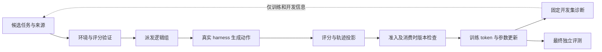

# 项目一设计建议：把真实 Coding Agent 后训练做成有证据的闭环

日期：2026-09-07。性质：设计建议，不是实施批准，不替换 06 计划或 C 包。本轮扩大讨论到环境、数据和评测，但没有修改实现、配置或既有决策，也没有新增训练结果。

阅读依据：用户提供的五份 Pro 对话、当前简报、现有环境生产设计、前两轮独立代码审查。主审通读项目设计对话；三个独立子任务分别全文阅读设计、方向调查与模型调查，交叉检查建议。外部事实只核验影响本方案的部分原始来源，没有复核所有模型发布和排行榜数字。

## 1. 判断：同意先做项目一，但必须定义有限的完成边界

**同意暂停项目二，集中完成项目一。** 当前的主要缺口是：已有实现还没有在当前正式路径上形成可信环境、正确训练消费、端到端效率和独立学习收益的共同证据。项目二会新增能力定义、环境生成、奖励和泛化假设，很容易把当前未闭合问题带进另一项研究。

我赞同外部 Pro 的三点：复用上游应诚实归因；环境有效性、当前学习机会、实际学习收益是不同层次；只跑通几步训练不足以成为项目最终成果。

**但不完全赞同它最后把“诊断驱动任务供给”预选为主成果。** [设计对话](tmp/项目设计外部pro.md)第 705、762–780、881 行的窄路线——当前链资格验证、一项可归属改进、独立学习结果——更符合现状。第 1042、1313–1347 行新增供给更新、三臂训练、跨仓库/来源/harness 的组合很有价值，但应由瓶颈决定，不应成为默认最低要求。

旧 CaRR/verl 项目已有异步训练经历，只说明“又接了一套异步框架”不能重复成为卖点；不说明必须改做 curriculum 才有进阶。进阶可以来自真实黑盒 harness 的复杂行为、环境与评分责任、静默训练错误的定位，以及更扎实的受控结果。复杂度本身不是进阶。

建议项目定位：

> **RepoHarness：面向真实 Coding Agent 的可靠、高效后训练系统。基于 miles/SGLang，把可执行任务、真实 harness、可信评分和训练消费连接起来，并以受控实验验证一项自身改进怎样降低学习成本。**

第一版采用：一个目标训练模型、一个主 harness、一条主 RL 配方；SWE 为深入完成的主任务，terminal 优先复用现成资产作小规模迁移探针；需要主张跨任务族或联合训练时，再扩成第二训练面。至少完成一项可归属的效率或可靠性改进，并给出独立任务上的学习结果。数据生成、反馈蒸馏、多 harness 混训不全部纳入完成条件。

## 2. 个人贡献应如何划分

| 层面 | 归属与项目应证明的东西 |
|---|---|
| fully async、训练内核、推理引擎、通用权重同步、TITO/R3/OPD 基础能力 | 上游能力；项目证明正确使用、适配和调优，不写成原创 |
| 环境来源、构建与验证、评分材料和候选工件边界 | 自己负责的应用层设计；用有效率、审计结果和成本证明价值 |
| 黑盒 harness 的上下文变化、分支、身份、mask、组统计、版本和训练消费 | 自己负责的跨层集成与语义验证；区分上游问题、集成误用和特定需求 |
| 真实任务上的性能诊断、最小改进、学习与成本对照 | 最应补齐的结果层贡献；不能用代码行数、patch 数或测试数量代替 |

[miles 官方当前说明](https://github.com/radixark/miles)已经覆盖上述多项通用能力，其 [TITO 文档](https://miles.radixark.com/docs/user-guide/agentic-rollout)还专门描述保留实际推理 token 的 session 路径。它们不等于本仓库当前 vendored adapter 已经正确走上相同路径。修 REALIGN 等问题前，应先核验能否窄接入现有上游机制，而不是默认再造一个轨迹系统，也不因此立即升级整个 fork。

“维护真实 coding RL 的环境、数据生命周期和静默失败边界”确实对应研究工程职责。例如 [Anthropic Code RL 官方岗位](https://job-boards.greenhouse.io/anthropic/jobs/5370690008)明确覆盖这些工作。这里只借它说明工作内容有价值，不据此推断个人项目满足该职级；旧对话的中国岗位链接本轮未成功取得完整正文，不重复宣称当前招聘状态。

## 3. 环境和数据：做一条窄而可重复的生产链

### 3.1 SWE 与 terminal 的分工

| 任务族 | 首版范围建议 | 应如何评分 | 它提供的额外证据 |
|---|---|---|---|
| SWE | 仓库内 bug 修复为主，包含不同 bug 机制、文件跨度、测试框架和资源成本 | 在可信初始状态上重放候选代码，以目标测试和回归测试评分 | 定位、修改、测试及长多轮执行能形成真实学习 |
| terminal | 先选本地可复现的代码/构建调试、CLI 数据处理、文件工件任务 | 检查最终文件、数据或可冻结状态，包含应满足及不应破坏的条件 | 训练和环境抽象没有被写死为“提取 patch 后跑 pytest” |

两者共享任务版本、公开输入、隔离执行、终态、工件与评分结果的现有接口；任务解释、材料冻结和 verifier 各自实现。不为了第二任务族先造通用环境平台。需要长期在线服务、外部账号、GPU 科学计算的 terminal 题先排除在首版范围外。

实施顺序是 SWE 先闭环；terminal 在现成资产和预算允许时，用小批验证接口和评分，决定只作评测还是加入少量训练。它是贴合用户 coding 范围的优先补充，不要求为此从零建设第二条生产线。若只评测，就写“迁移评测”；若声称 SWE/terminal 联合后训练，就必须有 terminal 实际进 learner 的证据。两域结果单列，不用未经定义的混合平均分掩盖一域退化。

### 3.2 现有 216 题是候选资产，不是必须保住的目标数字

当前简报明确其为可信 ingestion 产物，T2-d/e、真实评分、环境资格和 held-out 尚未闭合。先抽取覆盖不同 repo/parser/资源条件的小批，例如 10–20 题，走真实目标 Linux 环境的完整流程，再估计批量成本。

若这条来源能低成本闭合，就扩大；若兼容和环境重建成本明显失控，可以换用维护更好的现成来源，复用已有消费契约。不要因为已经清洗了 216 题而接受错误评分，也不要在还未证明缺任务时先建设大规模合成器。

### 3.3 每个环境应证明什么

| 要证明的事实 | 最小证据 | 容易犯的错误 |
|---|---|---|
| 可以复现 | 固定源码、依赖、镜像和 CPU/内存/存储/网络预算，在目标执行环境运行 | 本机可启动就算训练环境通过 |
| 评分有区分力 | SWE 的应失败基线、参考修复、F2P/P2P；terminal 的空操作与参考完成状态 | 只检查 golden 能过；或所有任务都机械要求 no-op 为 0 |
| 评分与需求一致 | 风险抽样检查不完整修复、合法替代解、描述遗漏和额外隐含限制 | 把测试通过直接当作业务需求已被完整定义 |
| 评分稳定且边界有效 | fresh reset 下重复；针对实际 parser、插件、配置、输出伪造和测试控制文件做小型正反例 | fresh grader 等于完整防作弊；一次确定性运行等于零噪声 |
| 失败可解释 | 区分可归责模型的失败、预算终止、基础设施瞬态故障、配置或内部错误 | 错误都给 0，或模型失败都按 infra 丢掉 |
| 来源可追溯 | repo/base/PR/派生关系和许可信息；公开输入与评分/参考材料分离 | 同一个 bug 换 prompt 后跨越 train/test |

其中“误奖励率”需要人工或独立审计标签。只有设计的几个攻击样例时，应报告这些样例内的结果，不能宣称整个任务集误奖励率为零。

沿用[现有环境生产骨架](../../harness_improve/environment_production_and_quality_pipeline_design.md)，但其中旧 command-filter 等内容已被后续决策替换，不能因重读旧设计而恢复。离线构建与验证可以充分；运行时只保留真实身份、材料和评分边界所需的检查，不携带一整套逐轨迹资格证书。

### 3.4 数据多样性和扩容

先按 repo、PR/bug 派生关系和任务生成族切分，再生成或筛选。分别准备训练池、可反复使用的开发集、最终测试集。跨 repo 测泛化，同 repo 不同问题测范围内提升；两种口径都可以报告，但不能互相冒充。时间更新有助降低已知泄漏，不保证基座预训练无污染。

多样性先看 bug 类型、工程子系统、依赖关系、修改跨度、测试机制、交互长度与成本，而不是只数语言和题数。一个仓库的一千个相似变异，不能当作一千份独立工程经验。

建议来源顺序：现成任务基线 → 按实际缺口做仓库复用式合成 → 少量真实 PR 补充。合成探针可以从 3–5 个仓库、两种生成方式、100–300 个候选开始；这些只是建议规模，不是必须完成的产量。记录候选存活率、人工/API/CPU 成本、去重后机制覆盖，以及进入训练后的收益。

[SWE-smith 官方实现](https://github.com/SWE-bench/SWE-smith)支持把可运行仓库与多种任务生产方式分开，是摊薄环境成本的合适参照；原论文主要训练成果为 SFT，当前代码也链接 RL 使用。不能从“可复用”推出产物无需在本项目实际 harness/grader 下验证。

### 3.5 把有效性、难度和学习收益分开

无效环境需要修复或隔离；可信但当前难解的任务不应因此获得“无训练资格”的永久标签。固定目标模型、harness 和预算后，测通过率、失败机制、时间与 token，作为采样依据。

在独立同策略二元采样的简化下，n=8 组出现成败混合的概率为 `1-p^8-(1-p)^8`。这只描述 reward 对比出现的机会，不证明中间难度的任务迁移收益最大；实际异步跨版本采样也不必满足同一个 p。`0/8`、`8/8` 都应保留不确定性，用软分层、少量探索和周期复测，避免永久剔除长题和困难题。

如需更新供给，第一版用一次或少数几次离线更新即可：分析训练/dev 失败 → 决定补什么 → 验证并冻结下一批 → 继续训练。最终测试不能参与选择下一批任务。

## 4. Infra：优先解决实际训练消费与无效成本

### 4.1 首训之前必须关掉的缺口

依据[两轮交叉审查](miles_spike/external_infra_review_crosscheck_20260906.md)，优先事项是：

1. **生成动作到训练 token 的覆盖**：REALIGN、rewrite、FORK 后哪些旧响应保留、如何计权；共享前缀不能重复强化。真实 Claude Code 请求和合成边界均需覆盖。不能靠 `clear_thinking=False` 假定已修。
2. **轨迹、组和概率语义**：member reward、fan-out、execution 分母、sampling support、behavior logprob、weight spans 与 R3 来源；固定样本参考计算及目标 GPU 的实际消费验证。
3. **预算与失败归因**：25 次请求上限的终止出口、限流等待越过 deadline、截断处置生产注入；内部装配错误不能靠无限补采隐藏，模型失败也不能随意洗成 infra。
4. **真实评分与作业生命周期**：所选任务的 parser/控制面、receipt 失败清理、当前 W8 eval、C/W7 配置、最小恢复与有界退出。只承诺已经实际验证的支持范围。

这些是正确性底线，不能拿有已知错误的版本做长时间训练，当成容易打败的性能基线。修复前后的问题，用最小反例和少量真实消费证明即可。

### 4.2 一项最值得展示的系统成果

目前最有事实基础的正确性主题是：**黑盒 harness 改写上下文后，训练覆盖和权重语义如何保持明确。** 这比再增加身份字段更能展示算法与系统边界理解，但仍要查上游现状和真实发生率，不先宣称新算法。

性能主改进则由测量选中一项：R3 捕获的同步解码与双份表示、环境准备与重复权限操作、额外 actor forward、评分排队或不合理资源占用。不要预先宣称这些一起能加速几倍。优化 actor forward 时要保留必要的同权重对拍；缓存环境准备只复用不可变部分，每次执行和评分状态仍需正确隔离。

第一轮 trace 至少能分解环境准备、排队、prefill/decode、工具执行、评分、buffer 等待、learner、权重发布及中断重算。总吞吐不能由各段百分比简单相加解释：异步阶段重叠，优化是否改变关键等待路径需实测。

[MiniMax Forge 的官方技术说明](https://huggingface.co/blog/MiniMax-AI/forge-scalable-agent-rl-framework-and-algorithm)强调先完成先消费与长尾等待之间的分布取舍。它支持检查本项目的调度偏差，不代表必须照搬 Windowed FIFO 或另写 scheduler。

### 4.3 最小可观测性：回答问题，不建监控平台

上图回流不包含最终测试答案或模型在最终测试上的逐题反馈。

使用已有事件和一份离线分析脚本，按逻辑组、execution、生成动作和训练 token 分别计数。报告派发→完成→可评分→准入→实际消费的数量及所耗成本；按任务族、长度、时间和原因看丢弃分布。分叉多出 leaf 不是多采了一次独立经验。

`accepted`、非零 reward 方差、非 singleton support 都是诊断量，不是“确定产生有效学习”的证明。不要为每组另算昂贵全参数梯度来凑一个万能指标。实际消费组/GPU-hour、生成/训练 token 覆盖、DIS 接受比例、支持集分布和参数更新事实分别报告，最终用 held-out 学习结果判断收益。

## 5. 训练设计：一条主配方，一个主要对照

先冻结目标模型的准确 checkpoint/tokenizer，避免把 Qwen3-30B-A3B 与名称相似的 Coder checkpoint 混为一谈。小模型可调试接线，但不能替代目标 MoE 的 R3、显存和并行验证。

基线建议从当前 GRPO n=8、faithful DIS 候选出发，由 C 包完成 loss、预算、staleness 和 harness 支持面的最终选择。第一版以可执行终局结果为主要 reward，不同时加入 rubric、过程奖励、长度惩罚和多个 auxiliary loss。SWE 与 terminal 都应先有清楚的任务完成定义。

组内固定任务版本、harness 和预算；不同任务族先在组间混合。先量基础模型是否会正常用工具、是否已具备可利用的解题能力；需要时做高质量完整轨迹 SFT。SFT 不仅能学工具语法，也可能承担大部分能力提升。若主张 RL 的增量，必须与其直接初始化 checkpoint 比，而不是将 SFT+RL 的全部收益归到 RL。

| 实验 | 固定什么，改变什么 | 应得到的证据 |
|---|---|---|
| 正确性资格 | 冻结请求/轨迹/权重，比较投影与独立计算、合法打包或分片 | 目标语义正确；不是训练收益结论 |
| 正确基线 B0 | 经过验证的静态任务池、主 harness、固定训练配方 | 能实际学习，以及主要成本分布 |
| 主改进 B1 | 相同基座和初始化，只改变选定的一项系统或数据机制 | 相对合理基线的自身贡献 |
| 最终评测 | 对 B0/B1 和初始化使用相同任务、harness、评分和推理预算 | 学习是否改善，成本/退化和不确定性是什么 |

纯系统优化先做固定工作量或轨迹实验，再做有限在线验证。异步线上很难同时固定完成顺序、消费量、版本和墙钟时间，应分别解释：相同工作量是否更快；固定总预算是否得到更好模型。不能只看相同步数。

若供给确实是瓶颈，再替换主增量为静态分层 vs 诊断重配，或普通扩容 vs 诊断扩容。不同扩容策略要给相同生成/校准预算和相同 learner 预算的视角；任务数相同不等于 token 和成本相同。不默认把系统优化、三臂数据研究、多 harness 和蒸馏做成全组合。

至少为关键比较保留一次独立训练重复；预算允许再扩大。评测随机种子只能估计固定 checkpoint 的采样波动，不能替代独立训练重复。没有重复时，应明确结论只是单次运行观察。

## 6. 多 harness、OPD/OPSD/SDPO 应怎样加入

**第二 harness 先用于评测。** 在主路径学到东西以后，用相对简单的 coding harness 运行相同 checkpoint，先排除 adapter、工具协议和预算差异。工具格式变化、上下文/执行方式变化、信息或能力变化分别解释；不能把多了子代理或更强宏工具称为纯接口变化。

固定 harness 下只更换 checkpoint，已经能证明该条件下的权重提升。第二 harness 增加迁移证据，不是让前一项结果变得合法的条件。若迁移差距明显且值得解决，再做多 harness 训练，组内仍保持一致；第三 harness 留给确实要主张未见接口泛化的实验。

**蒸馏先回答它修什么瓶颈。** 对 train/dev 的同一批失败，比较等预算普通再尝试与加入合法执行反馈后的修复。如果反馈能明显救回，再比较完整修复轨迹 SFT 和反馈蒸馏。

[SDPO](https://arxiv.org/abs/2601.20802)将反馈条件下的自身预测变成监督；[OPSD](https://arxiv.org/abs/2601.18734)使用特权上下文形成自教师，其原文主要证据在数学推理。它们都不是“把失败日志加入 prompt”就等于完成训练实现，也不能从已有结果直接推断长程 SWE 上必有效。

若做 token 级 OPD，要取得学生所采 token 的教师概率，确认 tokenizer/支持集、教师版本、反馈可见性和额外 forward 的成本；仅有外部模型生成 API 不一定满足。全零 reward 组可能对蒸馏仍有信号，不能被 GRPO 专用方差过滤提前全部丢弃；应窄接目标相关消费，不伪造 reward、不绕过真实数据资格。

不把自博弈出题模型、多专家 MOPD、训练压缩策略、新过程信用算法作为项目一第一版要求。

## 7. 评测：足够独立、成本可控、结论与范围匹配

### 7.1 三层即可

| 层 | 内容 | 用途 |
|---|---|---|
| 工程正确性与诊断 | 小型真实轨迹、正常失败、截断、分支、评分异常、退出/恢复 | 证明系统是否执行声明的训练；不能代替能力评测 |
| 内部任务评测 | 开发集用于选配置；冻结 final held-out 测 SWE，并独立列 terminal | 学习曲线、跨 repo/任务族表现、失败机制、成本和能力保持 |
| 外部公共坐标 | 优先一个可复现 SWE 集；预算允许再加一个 terminal 集，固定版本和协议 | 让外部读者校准结果；不是所有新 benchmark 都要跑 |

公共集合选当前可运行、对目标模型有区分力且预算允许的版本。旧 benchmark 在最强模型上饱和，不说明对当前 30B 模型无用；但污染和任务质量问题仍须交代。新的 benchmark 也不自动更适合作为训练内循环。

[DeepSWE 官方运行入口](https://deepswe.datacurve.ai/run)与 [Terminal-Bench 官方版本说明](https://www.tbench.ai/news/terminal-bench-4-0)可作候选来源。后者当前 4.0 将 agent timeout 统一为 8 小时，明显不能不经估算就成为八卡首轮硬要求。缩小子集或预算可以做自有实验，但必须标明版本、子集及限制，不与官方完整榜单分数直接混比。源码公开或任务较新都不构成本项目“零污染”的证明。

不要根据 final test 上基础模型成功与否筛掉难题。预算与难度在 dev 上确定；若发现 test 环境无效，按与模型成绩无关的统一规则处理，对所有 checkpoint 一致，并公开排除数量与理由。

### 7.2 最少报告什么

- 相同推理预算下的任务成功率、任务级配对变化；SWE/terminal、来源和主要任务族分列。
- 成功和失败尝试都计入的生成 token、模型请求/工具次数、墙钟及总成本；不要只报告成功案例耗时。
- 环境无效、模型失败、预算终止、系统错误的分布。真实 infra 故障采用预先统一的有界重跑规则，原始尝试与成本保留，不选择性重试某个 checkpoint。
- 简短代码生成/工具协议和原任务能力保持探针，观察专项训练是否明显退化；不用同时跑全部通用榜单。
- 任务级或有充分族数时的分层 bootstrap/配对区间。重复 seed 不充当新增独立题，少数 repo 的众多变异也不当作独立泛化样本。

样本量建议以期望可辨别的差异和成本决定。粗略举例，独立二元任务、成功率接近 50% 时，100 题单个比例的 95% 正态近似区间半宽约 9.8 个百分点，200 题约 6.9；这不是配对增益的最终区间，也没计入 repo 相关性。几十题上提高几个点只能是探索信号。

优先增加独立任务覆盖，再选事先冻结的 30–50 题做多次采样估计稳定性。`pass^3/pass^20` 可以辅助描述重复可靠性，但不应成为项目一的新硬目标。

评测记录保持简洁：checkpoint、task/split、harness/template、工具与上下文策略、采样和预算、镜像与 grader 版本、资源配置、seed、结果与排除规则。它用于复现，不做 owner 授权 manifest。

## 8. 怎样突出亮点，以及何时可以收口

建议最终只集中展示三张图：

1. **任务与训练消费漏斗**：候选环境到实际训练的数量、成本和丢失原因；按长度/任务族展示是否偏删。
2. **一项改进的效率—质量对照**：正确基线上端到端吞吐、资源和无效成本的前后变化，附训练语义/分布检查。
3. **固定 held-out 学习曲线**：初始化、合理基线、主改进，横轴至少有实际消耗 GPU 小时；补充包含环境/教师/API 的成本口径及不确定性。

GPU 成本计入分配给 rollout 和 learner 的全部时间，冷启动、失败和最终 drain 不能从总账消失；CPU、存储、环境生产、教师调用另列并汇总。有 teacher/data 策略的比较同时给 learner 预算与全流程预算，不把某一个代理吞吐称为学习收益。

当前总租卡预算、API 预算和投递时间未定，不给拍脑袋总 step 或天数。先完成目标模型/任务的短资格和基线测量，再为正式基线、主改进、必要重复与最终评测保留预算；不要把钱先花在大规模制题和全因子消融上。

建议执行顺序：

| 顺序 | 完成后的可见成果 | 此时不扩大什么 |
|---|---|---|
| 1 | 选定首版范围；代表性 SWE 环境真实评分、train/dev/test 划分、已知覆盖与归因缺口明确修复 | 不先做 PR 大采集和新 curriculum |
| 2 | 当前 W8、C、W7 与真实数据线闭合；目标 GPU 正确性和真实基线完成 | 不用旧 P3 或本地绿灯代替 |
| 3 | profile 选择一项主要改进；若采用 terminal 补充，小集合完成独立评分和接口验证 | 不同时加多个 loss、harness 和任务生成器 |
| 4 | 正确基线与主改进的受控训练/评测；视目标与预算决定 terminal 混训和第二 harness 验证 | 不在看到 test 后改主假设 |
| 5 | 最小复现、公开结果、成本与失败分析、简历材料 | 不为了多一个名词推迟交付 |

“第一版做好”的标准是：声明的执行面确实可靠；有可重复环境资产和清楚的评分边界；至少一项自身改进有可复核结果；有独立学习证据和诚实限制；外部读者无需读内部阶段账本即可复现主要结论。若没有学习提升，应定位原因并缩小声明，不能用 loss 有限来替代；也不必为了追求某个预设增益继续无限扩系统。

简历建议写三种成果，而不是功能清单：

> **训练正确性**：基于 miles/SGLang 和现有 adapter，解决［具体黑盒上下文/轨迹消费问题］，以［真实请求、参考计算和 GPU 对照］验证声明范围内的训练语义。
>
> **效率与可靠性**：在［硬件、模型、harness、任务范围］上，通过［自身改进］将［实际消费吞吐或无效成本］从 A 改善到 B，说明任务分布与质量变化。
>
> **环境与学习**：建设［来源与范围］的可重复任务验证流程，在［冻结评测、预算］下实现［结果与区间］，公开成本、失败归因和复现入口。

方括号和数字必须由完成后的证据填写。若没有跨 harness 实验，就不写跨 harness 泛化；若没有多机结果，就不写大规模可扩展性。项目二不应成为投递前置。

旧 DeepSearch 项目可简写方法迁移、rubric、多轮搜索训练及实际诊断；新项目突出真实 coding 执行、评分、消费和受控结果。若两者仍高度重复，压缩旧项目篇幅比给新项目加一套研究任务更合理。对 agent 生成的代码，用户本人应能解释关键路径、一个故障根因及一项实验取舍；这比介绍由多少 agent 写了多少代码更能证明独立能力。

## 9. 外部调查中应保留与修正的结论

| 建议 | 本轮判断 |
|---|---|
| 环境有效性、当前学习机会、实际收益分开 | 采纳，是数据与训练设计的主线 |
| 静态池不够时，有限轮离线更新 | 采纳为条件扩展，不提前建设在线共演系统 |
| 动态供给天然应成为项目一主成果 | 不采纳为既定结论，先看真实瓶颈 |
| SFT 只负责基本语法 | 不成立；需要把完整轨迹 SFT 当有竞争力的学习基线 |
| 必须未见第三 harness 才能证明模型提升 | 不成立；它决定泛化范围，不否定固定系统下的权重提升 |
| 某同量级模型论文证明本项目八卡可低成本复现 | 不成立；上下文、训练时长、教师、硬件和方法必须分别核对 |
| 在已知错误评分基线上完整训练，以证明资格层价值 | 没必要；错误用审计与最小复现，性能/学习比较使用正确基线 |
| 每个数据资产配完整资格证书、每轨迹再验证一遍 | 不默认采用，沿用现有边界，避免恢复已删除的治理复杂度 |
| 认知控制、主动试验、长时记忆、影子部署都纳入评测 | 属于项目二的大部分动机，当前不纳入 |

两篇特别容易误读的环境论文也已核对：[CalibForge](https://arxiv.org/html/2608.06352v1)的主要受控结果是匹配任务数的 SFT，保留轨迹数并不完全相同，训练使用 64×H20；不能当作动态 RL 或八卡成本证明。[Envs-FORGE](https://arxiv.org/html/2608.14312v1)确有 GRPO，但原文承认尚未隔离完整供给策略中各组件的作用。它们支持尝试任务校准，不支持预先认定更复杂的选择器必优于静态分层。

本轮最重要的取舍是：**把项目一做成范围有限、结论可靠的后训练项目；系统、数据或反馈的主创新由实验选中。当前先完成已有真实链路，是方向收敛，不是降低技术标准。**
