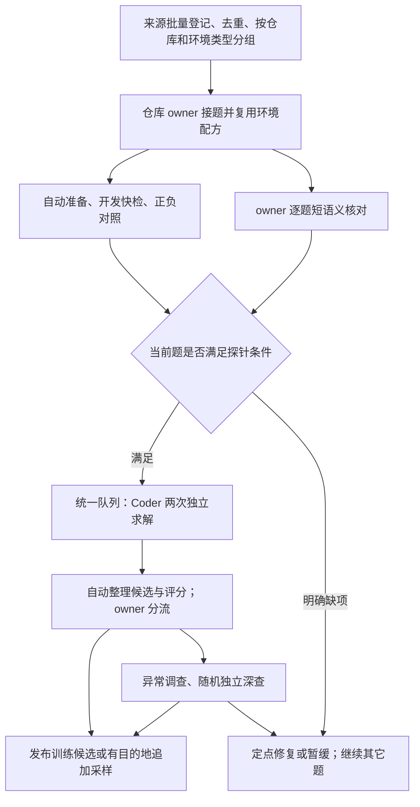

# 一批题目怎样处理：仓库分工、有限审查与滚动探针

2026-10-05，流程设计稿。本文回答一批现有或新增公开题目如何经过处理，持续产出可信的 Coder 探针结果和训练候选。Coder 为主，3.6 为对照。本文不绑定首批题数、具体题单或机器预算，也不表示下述流程调整已经实施。

**执行单位是“仓库＋环境类型”，交付单位仍是单题。** 同仓 agent 持续负责环境经验、题目判断和结果分析；脚本完成重复执行与材料对账；题目满足最小条件即进入模型队列。深审由具体疑点和随机抽查触发。

准确性依靠三层证据：**探针前确认核心目标与执行基础；探针后用真实候选检查评分；独立抽查寻找前两层的盲区。** 允许有限未查范围，已确认的核心误奖、误拒和答案泄漏必须处理。

## 1. 谁负责什么，避免怎样的重复工作

| 角色 | 接到的输入 | 负责的动作与交付 | 工作边界 |
| --- | --- | --- | --- |
| 来源与发布负责人 | 数据集固定版本、完整字段、现有 consumer | 一次性处理来源身份、正式批次加载、封包和部署；给出可复用入口 | 不替仓库 owner 重审每题题义；普通题不经管理线程再次终审 |
| 仓库 owner agent | 同仓的一批题、旧审查和运行证据、环境配方 | 分环境类型；组织自动检查；短审题义；提交探针；分析结果；决定窄修、追加或暂缓 | 对本仓题级结论负责；不逐题重建通用环境，不手工管理每次 GPU 启停 |
| CPU 执行与事实汇总脚本 | 固定材料、命令配方、镜像和已有证据 | 批量运行检查、保存原件、生成差异与缺项摘要 | 输出执行事实和风险线索，不能自动断言题意与测试正确 |
| GPU 执行方与队列 | 已就绪的固定请求、统一模型配置 | 核身份、展开所需求解次数、执行、评分并回传结果 | 不重复题级语义验收；执行回执不等于训练资格 |
| 独立 reviewer | 一个明确问题，或预先抽定的任务；相关固定证据 | 检查共享模板、实质修订、争议或随机样本；给出有依据的结论 | 不给每题默认开三场完整审查；不自行扩展题目目标 |
| 模型 solver | 实际公开题面、公开工作区和开发说明 | 在干净初态中独立解题 | 不接触 owner 的私有检查、gold、隐藏测试或前次答案 |

同仓跨数据来源尽量由同一 owner 处理；评分机制不同的部分引用各自来源模板。大仓可按模块或环境类型拆给辅助 agent，必须划清任务与文件归属，不能多个 agent 同时修一题。

owner 领取的是一批题，连续处理；无需每题创建新会话。上下文接近容量时，交接环境配方、当前缺项和原件链接即可，不重读全部历史。独立 reviewer 仅在表中的触发条件出现时安排。这里的角色可以由现有线程承担，不要求再建一层管理组织。

## 2. 接到一批题，先批量整理材料

### 2.1 自动登记，保留处理分母

来源负责人把完整数据行转换成统一可读的任务索引。脚本对整批完成：

1. 固定来源版本、完整任务 ID、仓库、真实初态、题面、评分材料与镜像引用；缺字段明确列缺项。
2. 排除既有留出仓库，检查与已有任务的重复、派生和共享修复关系。相同仓库或 base 不足以证明任务重复。
3. 关联旧环境、正负对照、语义结论、修订和模型候选。先判断哪些证据仍适用，再生成新增工作。
4. 按仓库分配 owner，再按依赖版本、构建方式、实际加载路径和评分机制分组。
5. 给每题标出下一动作：补材料、建立环境、自动检查、短审、补评旧候选、直接接续采样或暂缓。

未取得镜像、缺正对照、被排除和暂缓的题都保留记录。统计来源产出时，不能只保留最终成功的题。对很大的公开数据集，先全量完成这层低成本登记，再按组滚动处理完整环境；无需一开始拉取所有镜像。

旧证据适用范围先由 owner 确认，脚本比对材料、环境及命令等绑定字段并列出变化。脚本不能仅因版本字符串相同，就自动推断两道题或两个镜像在行为上等价。

### 2.2 只维护三类产物

| 产物 | 内容 | 如何减少重复 |
| --- | --- | --- |
| 环境与评分配方 | 适用条件、准备方式、公开开发命令、评分入口、已验证的共同问题 | 同组共用；逐题引用配方并记录差异 |
| 逐题短记录 | 核心要求、决定性评分位置、适用证据、未解问题、当前用途与下一动作 | 复用现有题卡／总账，不另外生成多篇结论相同的报告 |
| 自动运行原件及摘要 | 身份、日志、候选补丁、评分结果、耗时和请求回执 | 原件自动归档，摘要链接原件；哈希与运行状态不靠 agent 手抄 |

下文的“待查、就绪、暂缓”等是处理语义，不要求新建一套公共状态枚举。现有仓库总账维护题级进度，GPU 账维护作业事实，导航页由它们生成。

## 3. 环境按组建立，题级差异由脚本检查

### 3.1 owner 先把共同问题解决一次

owner 根据真实环境和评分机制选代表题，核清解释器、依赖、安装／构建方式、目标代码实际加载位置、私有评分入口及补丁交付路径。已有适用证据直接继承。

可提前完成的依赖安装、基线编译、固定资产下载、Git 清理、`chown` 和权限设置放在镜像构建阶段。保留必要兼容改动；清理后的工作树就是记录的初态。正对照求解或评分生成的答案、二进制和缓存不得混入 solver 镜像。模型改源码后，相关构建产物必须能够正确更新。

新评分机制或新构建类型，安排一次聚焦的独立核查：确认准备、候选交付、实际加载与判分链成立，并用具体反控检查已知共同漏洞。核查结果要写适用条件，不能仅凭“同仓”推广。

**共享的是配方与已验证机制。每题的 base、镜像、目标模块和测试仍分别绑定。** 某题新增原生扩展、换依赖分支或使用不同测试入口，就作为差异处理；不能拿另一题的环境成功代替它。

### 3.2 对每题自动执行的最小检查

| 检查 | 脚本具体做什么 | agent 何时介入 |
| --- | --- | --- |
| 材料完整性 | 核身份、文件、补丁可应用性、评分键与命令；扫描题面直接答案、残留历史及已知危险控制面线索 | 缺项、冲突或风险命中；扫描无命中不等于语义已合格 |
| 实际开发路径 | 用实际 actor 身份和 profile 执行对应公开路径，确认能操作并加载目标工作区代码；记录真正执行的测试 | 模板无法覆盖本题、加载路径错误或发生未解释失败 |
| 空补丁负对照 | 在当前评分版本下确认未修复状态不能得到成功奖励，并保存完整执行事实 | 未执行、解析异常、空补丁通过或不符合预期 |
| 可信正对照 | 在当前环境与评分版本下运行 gold 或已独立核实的替代解 | 正对照失败、缺失，或正对照本身疑似不满足公开目标 |
| 配方差异 | 比较实际依赖、构建／加载路径、初态与模板适用条件 | 出现会改变目标行为或评分的差异 |

开发快检中的原始 bug 可以按预期复现；不能把所有非零退出都判为环境坏。仅 import 成功也不代表开发可用。复杂的“改源码→构建→导出→fresh grader 加载”验证按机制复用，逐题补自己的差异；本题实际目标路径的证据仍需存在。

正负对照遵循来源的既定评分语义。SWE 与 R2E 的参考键、历史状态含义不同，不能统一改成“测试全部 PASSED”。已有正负对照只在相关材料与环境仍适用时复用，不能跨题替代。gold 通过只提供可行解与执行证据，不能用它的偶然实现反过来定义题目要求。

新题默认补一次有效负对照和一次有效正对照。重复稳定性检查优先用于新环境代表题、时序／随机性风险、可疑结果及预先抽定样本；不默认每题机械重复 gold。波动出现后，固定同一候选重评分，查清是环境还是 grader，不重新生成不同答案来掩盖波动。

这些作业可以与下一节的语义短审并行。owner 阅读题目时，脚本处理已经具备配方的其它题；遇到执行缺项只回传具体摘要。

## 4. 每题进探针前，agent 究竟审什么

### 4.1 一次短审，回答三个问题

owner 先读 solver 实际可见的题面、必要公开代码和开发说明，写出核心要求；再看隐藏测试的相关断言与参考解，核对是否一致。普通题在同一会话分阶段完成。它不等于全新上下文的独立盲审；实质题面修订和独立抽查另用干净公开读者。

交给 solver 的开发说明和命令必须有独立公开依据。因私有测试才知道的路径、输入或断言只用于私有检查，不回填公开说明。

| 必答问题 | 需要看的材料 | 需要留下的结论 |
| --- | --- | --- |
| 这道题要求修好什么？ | 公开题面、必要的公开 API／源码／复现信息 | 核心可观察行为及公开依据；多项核心要求分别列出 |
| 评分是否检查了这些要求？ | 相关测试、关键断言、评分选集；必要时参考解 | 核心要求对应到具体断言；指出明显漏检或无依据的限制 |
| 现有证据是否足够进入求解？ | 自动检查摘要、模板适用条件、历史问题与修订 | 可以进探针、先做哪项窄修，或暂缓的具体原因 |

不用每题通读仓库、重新分析全部测试、生成全面风险清单。沿核心调用链读到足以回答上述问题即停止。不能用“未发现问题”替代依据，也不要求为每个可能的边缘输入增加测试。

**普通题的停止条件：核心目标可解释、决定性评分有对应依据、没有已确认核心缺陷、必要执行证据有效。** 满足后就提交探针。进一步寻找新反例的工作交给真实候选和抽查。

### 4.2 疑点怎样处理，避免短审重新变成深审

| 短审发现 | 具体处置 |
| --- | --- |
| 核心目标未被检查、合理实现被无依据限制拒绝、题面含直接答案 | 属于已确认问题。按已有授权窄修或暂缓，不能作为普通探针题放行 |
| 只测示例值、P2P 较少、使用 mock 等风险线索，但尚无具体核心失效证据 | 记录对应机制，必要时做一项定点检查；可满足最小条件后带问题进入探针，优先看真实候选 |
| 需要补一段代码或日志才能判断 | 围绕该疑问做一轮会改变处置的定点读取／检查；能裁定即停止，仍不能形成核心结论就保留未知、暂缓，不继续扩成开放式研究 |
| 某个明确疑问需要真实解答才能调查 | 若执行、正负对照和公开私有边界已成立，可单列诊断探针，并写清该疑问；结果暂不用于难度统计或训练资格，解答也不能替代规格依据 |
| 未发现具体核心问题，只存在未穷尽的边缘场景 | 登记范围，继续供题；不因无法证明完美覆盖而停止 |

不要求每题先人工制造一个错误补丁。只有已知机制漏洞、实际候选异常或独立抽查需要时，才追加针对公开要求的反控。普通题不等待第三人再次做同样的全文审查。

## 5. 满足什么条件立即提交，怎样安排重复采样

### 5.1 题主提交的是完整请求，不是“请试一下这道题”

普通探针的提交条件为：

- 当前公开材料、初态、actor 与 grader 身份明确，正式入口能够消费。
- 短语义核对完成，已知会影响合理求解或核心判分的问题已经处理。
- 实际开发路径及正负对照有适用版本的有效证据。
- 本题确需的修订／独立核查已完成；随机后审不成为其它题的共同等待条件。

脚本依据题记录生成固定请求：任务与材料版本、actor／grader 证据、模型配置、所需求解次数、已有 attempt 及仍缺的次数。请求还必须写明普通或诊断用途；诊断请求附具体疑问和未满足的普通条件，并在结果短卡中保留。这可以放在已有请求说明中，不要求新增公共状态枚举。只有需要新正式身份或共享消费能力时才先请求发布。一个题就绪就提交，owner 随即继续同仓其它题。

沿用现有“题主→发布／GPU→原题主”的直接交接；同批通知可以合并。执行方按请求核身份和缺项，不再重新审题。请求回执到达后，题主核收并更新下一步；不能把回执状态当作题目合格状态。

### 5.2 同一 Coder 两次起步，追加必须有目的

两次使用同一 checkpoint、harness、采样参数、公开材料、环境、评分与预算，独立会话、干净初态，不互相提供答案。若已存在完全适用的历史求解，接续未覆盖次数即可；不同材料的旧答案不能直接凑成这一组。

两次在同一探针请求中登记，执行方展开为独立 job；无需等 owner 为第一次写完报告才申请第二次。若先返回的证据已证明材料存在核心缺陷，则按受影响版本停止尚未派发的相关作业，保留已发生结果，修复后接续。

| 初始两次有效结果 | 默认动作 | 何时继续采样 |
| --- | --- | --- |
| 一成一败 | 核候选与判分可信后，标为已观察到同模型成败差异，优先供训练选题 | 有具体诊断问题，或属于预先固定测量样本时再追加 |
| 两次成功 | 保留质量资格，标“尚未观察到失败” | 从不同仓库／类型中分层选一部分追加两次；可用于检验高通过题的变化和后续 rubric |
| 两次失败 | 核正常失败与执行有效性，标“尚未观察到成功” | 选一部分追加两次，尤其是需要分清稳定困难与偶然失败的任务；不据 0/2 永久排除 |
| 无有效评分或材料中途改变 | 从能力结果中单列，先处理缺项 | 求解已完成且补丁可复用时只补评分；缺有效求解才按恢复决定补调用 |

除定向追加外，预先抽取一部分“固定测量题”：Coder 固定完成四次，不因前两次混合而提前停止。3.6 在其中的分层子集上各做两次对照，避免只挑 Coder 失败题。固定测量用于观察来源分布和初筛漏掉的变化；定向追加用于选题与归因，两者分开统计。

追加到四次仍同分，就记录现象并进入后续轮换，不自动无限追加。两次／四次无法精确估计单题成功概率；旧的总体通过率也不能预测多少题会出现混合。具体抽样比例与计算预算是作业参数，不改变这里的处理规则。

统一执行方负责已有服务和队列的消费。数据 owner 不各自启动一套模型服务；并发、评分异步和 Prime 后端的实现由性能线程处理。

## 6. 探针回来以后，怎样用低成本检查真实候选

### 6.1 自动汇总，让 agent 从差异开始读

每次结果自动整理：原请求用途及待答问题、实际配置与版本、求解和评分是否完整、冻结候选补丁、逐项失败位置、关键异常、耗时与原件链接。不同层的事实分开：模型未解决、候选破坏环境、评分未执行、运输失败不能全记成 reward 0。

同题相同补丁可以复用语义判断；它们仍分别保留各自求解记录。摘要中对候选未改动的背景引用模板，不重复塞入全部安装日志和完整轨迹。原件保留，便于有疑点时回看。

### 6.2 owner 看每题候选，深度按问题分配

owner 阅读首轮候选的完整补丁和评分摘要，判断它是否在处理公开目标，以及失败／成功是否有合理解释。不能仅凭 0/1 自动签成训练候选。补丁过大、生成文件过多或行为无法解释时，明确记为待查；不能只看摘要就默认为正确。

诊断结果先回到请求中的具体疑问。未满足的普通条件解除、相应证据补齐后，才讨论用途；候选正确或两次混合不能自动把诊断题转成训练候选。同一公开材料下可复用的原求解保留，是否补评或重跑按下一节的变化范围判断。

| 观察 | 追加检查与去向 |
| --- | --- |
| 候选确实修复核心目标，相关断言通过，无具体反例 | 写短结论，保留已核范围，可发布训练候选 |
| 候选确实遗漏需求或实现错误，评分有效地拒绝 | 正常能力失败，可保留训练候选资格；不因此修数据或要求它成功 |
| 评分通过，但 diff 显示绕过目标、硬编码或潜在真实回归 | 指出违反的公开要求，用一个相关行为对照验证；确认后修评分或暂缓 |
| 评分失败，但候选看起来是合理替代实现 | 检查失败断言的公开依据；必要时同输入对照 base／可信正解／候选，区分误拒与真错 |
| 候选操作触及环境、测试控制面，或完成声明与执行证据矛盾 | 展开相关轨迹片段；若局部证据不足，再读完整轨迹 |
| 正对照、环境或 grader 自身不稳定 | 固定同一补丁复验；修对应层，不用重新求解替代诊断 |

“更宽测试”只在有具体相关行为需要验证时使用，并区分原有失败、环境失败和候选回归。不给每个通过候选自动跑一遍全仓测试，也不把 gold 的任意行为当作规范。

owner 的结论可直接进入逐题记录：本次候选做了什么、评分为何可信或可疑、用途与下一步。完整轨迹分析是按需工具，不是所有题共同的必写报告。

### 6.3 独立抽查检查短流程的盲区

在模型结果出现前，按仓库和环境类型抽定质量深查样本，保留抽样规则。reviewer 独立检查题义与测试、实际候选的成功和失败两侧；必要时构造一个强反控。检查的重点是“短审漏掉了什么决定性问题”，不追求列举全部可能风险。

抽中题完成相应核查后发布；其余题按普通流程继续。未就绪的抽中题保留原状态，补充抽样单独记录。风险触发深查与随机深查分开计数，不能混成全池缺陷率。审查零发现也不能证明没有噪声。

若查出共同根因，owner 与发布方先判断受影响条件，回查符合条件的题，暂停相应缺陷版本的消费。没有同一机制证据时，不把局部问题推成整个仓库停工。

## 7. 修复如何收敛，已有工作如何复用

### 7.1 一次明确修订，一次聚焦复核

修复请求必须写清：违反哪条公开要求、哪份证据已证明问题、受影响题和材料、准备改哪里，以及怎样证明原问题已解决。

题主沿已授权 R-a 至 R-f 处理；一次修订可以合并本题已发现、同属目标范围的问题。修后验证正负对照、触发误判的候选、已知相关错误候选及受影响开发路径。独立 reviewer 只核本次变更及影响，未变且有效的证据直接继承。

一次聚焦复核后仍有实质分歧、修订继续扩张或缺乏便宜辨别实验，就暂缓该题，写明重新进入的条件。共同问题另开一个明确的模板修复，由一处实现并按差异扩到相关题；不让每位题主重复修同一依赖或评分机制。

共同配方也有停止点：一轮修订和一次聚焦复核后仍不收敛，就暂停适用条件内的题，保存已完成证据及重入条件，owner 转处理其它环境类型。确有覆盖价值的进一步攻关单列范围和负责人，不继续占用普通供题工作。

题面实质变化需要干净公开读者。不得把隐藏测试细节写进题面来提高通过率；改变任务目标或通用评分语义仍按既有决策边界处理。暂缓一题不占住 owner，owner 继续处理其余题。

### 7.2 按变化决定重做什么

| 发生的变化 | 复用什么 | 需要补什么 |
| --- | --- | --- |
| 材料与环境均未变 | 有效 CPU 对照、语义判断、已有求解 | 缺失次数、必要抽查或本次新问题 |
| 仅私有测试／评分材料改变 | 原公开题面、旧求解和 FrozenPatch | 新正负对照、相关旧候选补评、受影响独立复核；旧分数保留 |
| 公开题面改变 | 未受影响的环境机制和历史诊断 | 新公开读者、版本发布；需要测新材料能力时重新求解 |
| actor 初态、依赖或构建路径改变 | 未受影响的题义及其它环境证据 | 实际开发路径、受影响评分验证；旧求解不当作新环境样本 |
| 评分／运输故障，模型已有完整候选 | 该候选及原求解记录 | 修复后重放评分；不默认重跑模型 |
| 候选删除兼容层导致无法执行 | 原事实与轨迹 | 区分候选行为责任和现有 reward 契约；保留原 null，不手工伪造正式 0 |

历史通过、修订后补评通过、当前能被训练消费是不同事实。数据记录要能同时保留它们，不能用新的结果覆盖旧证据。

## 8. 用一组题演示实际工作如何流动

下面是假设同仓 owner 同时处理的一组题，用于说明分工和停止点，不是待执行题单。

| 题的情况 | 自动化在做什么 | owner 做什么 | 何时接触探针／后续怎样走 |
| --- | --- | --- | --- |
| A：与已验配方一致，题意与核心测试直接对应 | 补本题材料检查、开发快检和正负对照 | 短审写要求→断言对应，确认无已知阻断 | 检查齐备立即入队；无需等 B–F |
| B：缺同组可供应的公开依赖 | 给出安装／加载失败与依赖差异 | 复用配方补缺，验证原失败路径 | 补齐后入队；不重新研究整个环境 |
| C：测试明确漏了题面要求的一个核心分支 | 输出测试位置与执行事实 | 窄修该分支并复验，安排一次聚焦复核；不易修就暂缓 | 核心问题处理前不进入普通探针；其它题继续 |
| D：已有同材料 Coder 解答，但评分运输失败 | 定位可重放的原补丁，重新评分 | 核补评分并接续缺失的独立求解 | 避免把已完成的第一次求解再跑一遍 |
| E：两次 Coder 均通过 | 整理两个 diff、评分和同异点 | 核真实候选，记录已查范围 | 保留训练候选；按固定测量或定向策略决定是否补两次 |
| F：两次都是相同位置失败 | 确认不是环境故障，展示失败断言和源码差异 | 判断正常能力失败还是误拒；有疑点才追加定点实验 | 正常失败保留；误拒修订并优先补评旧补丁 |

owner 等待 B 的 CPU 检查时审 A、C；A 已进入 GPU 队列时继续处理 D；E 的 reviewer 做抽查时，owner 继续处理 F。等待发生在相关题和作业上，整个工作包无需齐步前进。

## 9. 仓库已有哪部分，真正需要补什么

本设计复用现有职责与工具，不重新建立一套管理链。以下区分已存在的能力与待实现的批量连接，避免把“文档写了”当成已经自动运行。

| 工作 | 已有基础 | 扩量需要补齐的部分 |
| --- | --- | --- |
| owner、发布、GPU 直接协作 | [现行协作流程](../category2_repair_20260929/coordination_workflow_20261003.md)；[总账工具](../../../../../rh2/scripts/category2_task_board.py)已有进度、请求、回执与核收 | 当前正式账覆盖已有工作包；工具没有通用新增题／工作包命令，需明确登记新批次的入口。复用职责、锁和请求语义，导航快照不另作调度账 |
| 批量材料与环境检查 | 正式 ingest／prepared、SWE与R2E已有开发检查和 replay 入口 | 以题单驱动现有入口，生成差异、跳过有效旧证据、保存失败与缺项；按环境类型参数化命令，不能把历史个例脚本当通用器 |
| 执行事实汇总 | [screening_facts.py](../../../../../rh2/scripts/screening_facts.py)能汇总已有账本、日志和冻结工件，注明事实来源 | 补接新批次原件、生成面向 owner 的简明摘要。该工具本身不启动检查，也不完成语义验收 |
| 探针执行 | [普通探针入口](../../../../../rh2/experiments/ordinary_gpu_probe_20261002/entry.py)、[串行队列](../../../../../rh2/experiments/ordinary_gpu_probe_20261002/serial_dispatch.py)已有身份校验、去重与回执 | 从已就绪题生成多次求解请求、只补未覆盖部分、按版本汇总结果；当前队列仍是串行且异常会停队，不能声称并发／故障隔离已经实现 |
| 池外正式接入 | 正式来源目前为Lite／R2E，可信加载全集绑定216／48题；运行时可消费其子集 | 新增版本化批次输入；Full来源身份贯穿bundle／view／入口，并显式继承正确SWE基线策略，避免未知来源回退v1；检查actor与fresh grader一致 |
| 候选后的检查 | 已有冻结补丁、评分日志、逐仓定点分析和重放能力 | 批量聚合候选 diff、失败位置、重复候选与抽查名单；个别题的postcheck不能宣称覆盖新任务，语义结论仍由owner／reviewer给出 |

优先补的是这些“题单→现有入口→原件→摘要→下一请求”的连接。它们让 agent 只处理差异、判断和异常；不要求先完成一套新平台再开始供题。

数据侧负责公开依赖、环境配方、预构建镜像、初态与任务材料，按实际actor身份验证。通用评分运输、并发、缓存消费和Prime后端由“评分性能与 Prime Sandbox 验证 (2)”负责；本流程不接管其实现，也不把其全部优化完成作为所有题的前置条件。

## 10. 怎样判断这套流程既快又准确

**训练候选与采样优先级分开。** 题义、评分和环境质量满足要求，真实候选短审及该题必要复核完成，即可发布当前版本的训练候选。Coder已见一成一败的优先供训练选题；全成、全败保留观察标签，不自动变成坏题或永久无价值题。仅诊断、材料有缺陷或未解核心争议的继续单列。

训练候选交付须附正式材料入口、actor／grader身份、质量证据、探针记录和未查范围。探针专用的诊断入口与正式训练消费缺口要显式列出，不能把“probe能跑”写成“训练已经接通”。在线RL沿现有链路重新采样，不拼接历史探针作为训练组，也不在此改奖励或组准入。

每个仓库／环境类型只需汇总几项结果：

- 登记、就绪、实际探针、质量合格、暂缓各有多少题，暂缓原因是什么。
- 首次结果等待多久；新增环境工作、agent审查、CPU和模型各花多少投入。
- Coder同材料重复采样观察到多少混合、全成、全败和无效结果。
- 随机复核新发现多少核心误奖／误拒，是否集中于同一机制；与风险检查分开报。

根据这些结果调整各组供题份额，同时保留对新仓库和暂缓类型的探索。速度提高应体现为更少重复环境研究、重复审查、无目的模型重跑和人工交接，以及更多可信的首次模型覆盖。不能用文档数量、脚本退出0或未经质量区分的任务总数衡量完成。

**本方案明确建议调整现行逐题审查强度：**将每题三个新会话角色改为普通题owner分阶段短审，将每题必造退化补丁改为风险与随机触发，将每次完整轨迹审阅改为候选短审加按需追踪；并将现行§4第2步／D1“仅示例覆盖直接列S1”调整为风险触发，依据具体核心失效证据决定修订或暂缓。实质修订、共同机制与争议仍保留独立核查。这些是本次流程提案，尚未直接改写[现行标准](../task_screening_standard_v1_20260925.md)或运行工具。留出边界、公开私有分离和已确认核心缺陷必须处理的要求继续保留。

## 11. 给 agent 的工作说明怎样写

下面两段是派工模板。填入实际范围、入口和本轮已确认规则后使用；不包含题量配额，也不要求 owner 先完成整包报告。

**给仓库 owner：**

> 负责〔仓库／环境类型／任务范围〕，只维护已分配题目和配方。先读取本仓当前记录、未解问题和可复用证据，按材料差异安排工作。组织脚本执行本题缺失的检查，同时逐题写清公开核心要求、决定性评分位置和阻断结论。满足探针条件即登记固定请求，接续同材料 Coder 两次独立求解，等待时处理其它题。结果回来后核候选补丁和有效评分，给出训练候选、定向追加、窄修或暂缓的结论。只有明确问题才展开完整轨迹或新增反控。共同问题合并处理；一轮修订及一次聚焦复核仍不收敛就暂缓相关题。交付更新后的短记录、请求及证据链接，无需逐题长报告。接续已有请求前，先核实际作业和回执，避免重复运行。

**给独立 reviewer：**

> 核查〔任务／模板〕在〔固定版本〕上的〔具体问题或随机抽查范围〕。输入为公开依据、相关代码与断言、对照结果、实际候选及本次变更。修订复核只覆盖变更及影响；随机深查独立核核心题义与评分，必要时构造一个有明确公开反例的错误候选。意见必须说明具体违反的要求、证据和后果；不能仅凭“还可能存在边界情况”要求扩大目标。给出通过及适用范围、需要的具体修正，或暂缓及缺失证据。实质题面修订的公开读者另用未看私有材料的上下文。

研究依据另见[本地证据](local_evidence.md)、[外部来源](external_sources.md)、[筛选与采样研究](screening_sampling.md)。旧[调查附录](investigation_and_rationale.md)用于追溯事实和论证，其中的首批配额与阶段数量不作为本文的处理流程。
