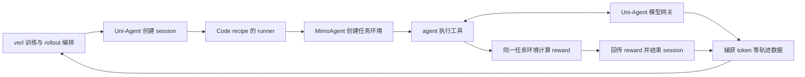

# 外部 Agentic RL 环境与沙箱调查

2026-10-04，Codex。范围：官方报告、公开代码、固定版本的关键调用链，以及与 RH2 当前入口的初步对照。**这是设计调查，不是外部系统运行验收，也不是整条 RH2 训练链已经审查完成。**

后续讨论：[外部沙箱与环境提前准备建议](pipeline_proposal.md)回应用户关于 CPU 容量、GPU 等待和长短任务混合的新目标，并给出优先级调整与真机前验证范围；本页保留资料调查结果。

**建议先用 MiMo 的三个配套仓库对照训练接入，用 AgentENV 对照环境服务，用 DeepSeek DSec 对照状态所有权和环境分层。现有证据支持把重复准备前移、把执行后端与评分语义分开；尚不足以支持整体更换训练框架或恢复同容器评分为默认。**

已下载五个源码快照并核对提交，未安装依赖、启动 Docker、下载任务镜像/模型或使用付费服务；本轮不需要 API 或用户决策。原 `reference/verl`、`reference/AgentEnv` 等目录保留。源码和报告原件在 [调查目录](../../../../../runs/external_rl_infra_survey_20261004/)，版本与 SHA-256 在 [manifest.json](../../../../../runs/external_rl_infra_survey_20261004/manifest.json)。

## 云端阅读副本

[云端 Pro 阅读入口](cloud_reading.md)汇总最新进度、Claude 与 Codex 的建议、可直接浏览的固定版本源码及统计材料。下文的 `runs/` 路径仍指原始本地调查目录；云端请使用该入口中的已提交副本。

## 1. 哪些资料最值得读，哪些代码确实公开

| 优先级与来源 | 公开到哪一层 | 本次取得与用途 |
| --- | --- | --- |
| **第一：MiMo V2.6 报告＋用户指定的 verl 分支** | RL recipe、agent harness、环境后端、评分桥接、模型网关和轨迹运输 | 三仓库均已下载；最接近我们“真实 coding agent 接入 RL”的问题。先读 Code 路径，不从五种领域全部展开。 |
| **第一：Kimi K3＋AgentENV** | AgentENV 环境平台，包括模板、生命周期、快照、存储与分布式控制面 | 已下载新版 AgentENV。适合检查 Docker 镜像如何变成可复用环境、如何冷启动和暂停恢复；不等于公开了 K3 完整 RL trainer 与评分材料。 |
| **第一：DeepSeek DSec 报告** | 整体平台架构；明确公开部分存储组件 | 已下载报告，存储代码随 AgentENV 一并取得。截至本次检索，未找到完整 DSec 控制面/SDK 的公开仓库。不能给出一个“拉下来即可跑 DSec”的地址。 |
| **第二：DeepSeek Harness** | agent 执行框架、工具和执行能力接口 | 已下载；适合看进程、文件、远端执行的一致接口。不是 DSec，也不是 RL 训练框架。 |

对应的一手入口：[MiMo 报告](https://huggingface.co/XiaomiMiMo/MiMo-V2.6-Pro-RL/blob/73875d00b30a89ef8cc353a0b60b0e9f9561952d/MiMo_V2_6_technical_report.pdf)、[指定 recipes](https://github.com/XiaomiMiMo/verl/tree/e2b9fc03c6e01247f5d93c44201b068ea320b7de/recipes)、[Kimi K3 v2](https://arxiv.org/abs/2607.24653v2)、[AgentENV](https://github.com/kvcache-ai/AgentENV)、[DSec v1](https://arxiv.org/abs/2609.22978v1)、[DeepSeek Harness](https://github.com/deepseek-ai/deepseek-harness)。

### 五个已下载快照

以下目录均位于 `runs/external_rl_infra_survey_20261004/sources/`，是供阅读的独立浅克隆。MiMo 两个配套仓库严格对应用户指定 verl 提交里的 gitlink，其他子模块未递归下载，因此不把这些目录称为“已配置可运行环境”。许可证仅核仓库根文件，不覆盖模型、数据及全部第三方依赖。

| 仓库与本地目录 | 固定提交 | 根许可证 | 优先阅读入口 |
| --- | --- | --- | --- |
| [XiaomiMiMo/verl](https://github.com/XiaomiMiMo/verl)，`XiaomiMiMo__verl` | `e2b9fc03c6e01247f5d93c44201b068ea320b7de` | Apache-2.0 | `recipes/code/mimoagent_runner.py`、`recipes/code/config/train.yaml`、`scripts/code/train.sh` |
| [XiaomiMiMo/mimoagent](https://github.com/XiaomiMiMo/mimoagent)，`XiaomiMiMo__mimoagent` | `467f0a19016f0ac4d63b8d17a1f0da9ba07f232c` | MIT | `src/mimoagent/environments/utils.py`、`datasets/opensource_code.py`、`kubernetes.py`、`modal.py` |
| [XiaomiMiMo/uni-agent](https://github.com/XiaomiMiMo/uni-agent)，`XiaomiMiMo__uni-agent` | `c63e0b01c375ebede95e01fe92bc367df24e5bf3` | Apache-2.0 | `uni_agent/framework/framework.py`、`gateway/session/session.py`、`gateway/manager.py` |
| [kvcache-ai/AgentENV](https://github.com/kvcache-ai/AgentENV)，`kvcache-ai__AgentENV` | `5843159b1eaf235a45a08a5329fc6647c6e5bc31` | MIT | `src/template/`、`src/api/impls/image_build/`、`src/orchestrator/`、`src/snapshot/`、`storage/` |
| [deepseek-ai/deepseek-harness](https://github.com/deepseek-ai/deepseek-harness)，`deepseek-ai__deepseek-harness` | `5badb15009ae1756c3afe0ae0cef1faafc290ccc` | MIT | `docs/architecture.md`、`docs/subsystems/sandbox.md`、`packages/ssh/`、`python/sdk/` |

另有可下载、但本轮只核官方介绍的仓库：

- [DeepSeek 3FS](https://github.com/deepseek-ai/3FS)：分布式文件系统，适合研究大规模镜像/数据存储。它面向 SSD、RDMA 集群；当前单机重复 Git 清理和编译没有必要先用它解决。
- [DeepSeek open-infra-index](https://github.com/deepseek-ai/open-infra-index)：DeepEP、DeepGEMM、DualPipe、FlashMLA 等组件的导航。主要是通信、训练调度和算子，不是沙箱平台。
- [Kimi Mooncake](https://github.com/kvcache-ai/Mooncake)：KV cache 与数据传输、模型服务基础设施。后续发现推理缓存/网络瓶颈时再读，不替代环境准备。
- [DeepSeek recipe](https://github.com/deepseek-ai/deepseek-recipe)：模型协议转换、请求编码与输出解析库；名字中的 recipe 不代表 RL 配方。适合网关兼容性专题，不应误列为完整 RL infra。

## 2. MiMo：最有价值的是实际调用链，以及与我们的差异

### Code 路径分工

这张图只描述此次固定提交的 Code 集成。`verl` 负责训练编排；`uni-agent` 负责 session、模型网关和训练轨迹运输；`mimoagent` 负责 harness、任务环境和 grader。不是三套沙箱叠在一起。该 Code 桥接实际调用的是 MimoAgent 环境，不是看到 Uni-Agent 自带 `sandbox/` 就认定两套都启用了。依据：[runner](https://github.com/XiaomiMiMo/verl/blob/e2b9fc03c6e01247f5d93c44201b068ea320b7de/recipes/code/mimoagent_runner.py)、[framework](https://github.com/XiaomiMiMo/uni-agent/blob/c63e0b01c375ebede95e01fe92bc367df24e5bf3/uni_agent/framework/framework.py)。

| 核到的做法 | 证据与对 RH2 的含义 |
| --- | --- |
| **镜像承担稳定准备工作** | `OpenSourceCodeEnvironment` 要求镜像已有任务工作树、工具链，Git 历史截断属于构建时属性；运行时做轻量核对，需要时可选 `strip`。这直接支持预清理，但不证明其检查等同我们的完整 baseline 摘要。见 [任务环境](https://github.com/XiaomiMiMo/mimoagent/blob/467f0a19016f0ac4d63b8d17a1f0da9ba07f232c/src/mimoagent/environments/datasets/opensource_code.py)。 |
| **执行后端独立于题目数据** | 同一任务行带 `docker_image`、`cwd` 等字段，环境工厂再选后端。公开 Code 配置使用 Kubernetes；MimoAgent 另有 Docker、Modal、Cube 等实现。可学后端接口，不必为了兼容接口立即部署 Kubernetes。见 [工厂](https://github.com/XiaomiMiMo/mimoagent/blob/467f0a19016f0ac4d63b8d17a1f0da9ba07f232c/src/mimoagent/environments/utils.py)与 [环境目录](https://github.com/XiaomiMiMo/mimoagent/tree/467f0a19016f0ac4d63b8d17a1f0da9ba07f232c/src/mimoagent/environments)。 |
| **固定 harness 安装可预制** | 黑盒 CLI 支持先打 payload，再在启动时解包并检查版本，减少每轮公共网络下载。RH2 的 `_install_native_cli` 已有离线上传原生包和版本核对；应比较是否值得把反复上传/解包前移到模板，不重复开发离线安装。见 [payload 说明](https://github.com/XiaomiMiMo/mimoagent/blob/467f0a19016f0ac4d63b8d17a1f0da9ba07f232c/scripts/harness_payloads/README.md)、[RH2 bringup](../../../../../rh2/src/repoharness2/adapters/slime/bringup.py)。 |
| **Code 在原环境评分** | runner 执行 `agent.run()` 后直接调用同一个 `environment.calculate_reward()`；测试及 verifier 到 reward 阶段才注入，恢复测试路径后执行命令。这减少环境周转，但不提供“只接受 FrozenPatch、从可信基线重建”的同等保证。不能据此撤销我们已有边界。 |
| **session 的异常收口值得对照** | runner 在 `finally` 清环境；网关区分 finalize 和 abort，abort 轨迹仅供观察。值得对照 RH2 的取消、工件落盘、评分入队和训练交付，不能从 `finally` 存在就断言无远端残留。见 [session](https://github.com/XiaomiMiMo/uni-agent/blob/c63e0b01c375ebede95e01fe92bc367df24e5bf3/uni_agent/gateway/session/session.py)。 |

**两个容易读错的地方：**

1. 默认四路配置里的 `cc-agent` 是原生实现的工具式 agent；它不是 `claude-code` 黑盒 CLI。仓库同时支持真实 CLI，但不能把默认 recipe 的测量当作与我们相同的 Claude Code 链。见 [默认混合配置](https://github.com/XiaomiMiMo/verl/blob/e2b9fc03c6e01247f5d93c44201b068ea320b7de/config/agent/code/mix-four-whitebox.yaml)、[cc-agent 配置](https://github.com/XiaomiMiMo/verl/blob/e2b9fc03c6e01247f5d93c44201b068ea320b7de/config/agent/code/mini-claude-code.yaml)。
2. 报告 §6 描述长期驻留的多租户 host actors；公开 Code 配置选择 `dispatch_mode: ray_task`，framework 为 runner 创建 Ray task。二者不能当作同一份实现。报告的大模型训练系统、开源 9B 配方与我们固定版本的运行路径分别处理，不把论文规模当容量配置。

本轮重新下载了官方 MiMo PDF，其 SHA-256 与项目原精读所用 PDF 完全相同，因而复用[既有精读](../../../../harness_improve/external_paper_references/reading_notes/mimo_v2_6_technical_report.md)的报告分析；新增部分是上述源码核对。尚未核验公开任务镜像内容、完成镜像构建或跑训练复现。

## 3. Kimi / AgentENV：复用环境状态，但要分清复制了什么

AgentENV 公开的是可自建的环境平台。固定版本文档提供两条准备入口：导入 OCI 镜像，或在临时 microVM 中用 BuildKit 构建 Dockerfile，再发布模板。BuildKit 缓存使用不可变种子和每次构建私有可写分支；缓存发布失败不应推翻已成功的模板构建。已对照 `image_build/worker.rs` 的 builder 复用、取消和期限入口，未做部署测试。依据：[构建说明](https://github.com/kvcache-ai/AgentENV/blob/5843159b1eaf235a45a08a5329fc6647c6e5bc31/docs/src/concepts/templates/creating.md)、[缓存与恢复设计](https://github.com/kvcache-ai/AgentENV/blob/5843159b1eaf235a45a08a5329fc6647c6e5bc31/docs/src/internals/buildkit-template-builds.md)、[worker 源码](https://github.com/kvcache-ai/AgentENV/blob/5843159b1eaf235a45a08a5329fc6647c6e5bc31/src/api/impls/image_build/worker.rs)。

运行时通过 OverlayBD 按需加载镜像块，提供 pause/resume、snapshot 和 fork。这里有三个不同用途：

- **可信准备快照**：从尚未交给候选的初态创建许多独立任务，减少重复启动与准备。
- **actor 中途快照**：保存文件、进程和内存，便于长程任务续跑。
- **actor 结束后 fork**：保留 actor 的全部既有状态，将后续评分副作用放到分支；它不会自动清除 actor 已改过的控制文件、环境变量或编译产物。

前两种可作为设计参照；第三种不能直接替代 RH2 的 fresh grader。共享只读下层与私有写层有助于节约存储，但缓存命中、源码正确编译和评分可信仍是各自的验证任务。依据：[架构](https://github.com/kvcache-ai/AgentENV/blob/5843159b1eaf235a45a08a5329fc6647c6e5bc31/docs/src/internals/architecture.md)、[快照继承范围](https://github.com/kvcache-ai/AgentENV/blob/5843159b1eaf235a45a08a5329fc6647c6e5bc31/docs/src/concepts/snapshots/create.md)、[卷的 fork 规则](https://github.com/kvcache-ai/AgentENV/blob/5843159b1eaf235a45a08a5329fc6647c6e5bc31/docs/src/concepts/volumes/sandbox-forks-and-snapshots.md)。

**采用成本不能省略：** AgentENV 仍需我们维护宿主、存储、调度和服务。标准路径有 Linux/KVM 等宿主要求；没有标准 KVM 时有实验性 PVM 路径，但需更换宿主内核并重启，并非改一个 API 地址即可。文档的 E2B API 兼容也不等于与 Prime 或现有 Docker 调用语义完全相同。依据：[README](https://github.com/kvcache-ai/AgentENV/blob/5843159b1eaf235a45a08a5329fc6647c6e5bc31/README.md)、[PVM 部署条件](https://github.com/kvcache-ai/AgentENV/blob/5843159b1eaf235a45a08a5329fc6647c6e5bc31/docs/src/deployment/pvm.md)。

[K3 报告](https://arxiv.org/abs/2607.24653v2)适合补充 partial rollout 与环境状态保留的关系；我们已有[独立审过的全文精读](../../../../harness_improve/external_paper_references/reading_notes/R13_kimi_k3.md)。沙箱恢复不会自动恢复训练组、行为 logprob、权重版本或 learner 消费回执；本轮也未找到 K3 全套生产训练系统的公开实现。

## 4. DeepSeek：DSec 架构与公开代码分开看

[DSec v1](https://arxiv.org/html/2609.22978v1)是本次最直接相关的新资料。报告把多种执行后端放在统一接口后，将基础环境、工作区、工具分层；用 `pack_diff` 保存环境，并在构建与运行间隔离账号、清除答案残留。其 V4.1 方案把 worker 与 agent sandbox 放到可被抢占的 GPU 池之外，保留 rollout 状态，训练作业恢复后重连。§7 明确开源的是 Rust OverlayBD/ublk 存储组件，链接到 AgentENV；未据此确认完整 DSec 开源。

对我们的设计启发是：**CPU 环境可以先于模型请求准备，并与 GPU 作业分别管理生存期；但这要求明确谁持有会话状态、谁负责恢复和最终回收。** 这是待对照建议，不是本轮决定部署常驻 worker 服务或改变当前超时规则。

DeepSeek Harness 是另一个层次。当前固定提交的 sandbox 接口主要表达进程的文件访问策略；远端执行要求文件、进程、sandbox 能力在同一个执行环境中配套替换。它值得用来核查“只把 Bash 改成远端，文件读写仍在本机”这类接口不一致。源码仍标 developer preview，本轮不将其引入主链，也不沿用搜索索引中的旧 `examples/headless-agent` 路径；当前 SDK 示例在 `python/sdk/examples/`。依据：[执行能力分工](https://github.com/deepseek-ai/deepseek-harness/blob/5badb15009ae1756c3afe0ae0cef1faafc290ccc/docs/architecture.md)、[sandbox 的实际范围](https://github.com/deepseek-ai/deepseek-harness/blob/5badb15009ae1756c3afe0ae0cef1faafc290ccc/docs/subsystems/sandbox.md)。

## 5. 对我们有什么收益，下一轮应检查哪里

先区分三件事：**预构建减少重复工作；镜像分发和缓存减少搬运；外部沙箱提供可调度的执行资源。** 它们可以组合。仅把现有慢启动搬到 Prime，不会自动消除 Git 全量压缩或候选编译；自己部署 AgentENV 也不会自动减少我们的运维责任。

| 现有成本 | 外部设计可借鉴的机制 | 本项目判断与验证要求 |
| --- | --- | --- |
| 每次准备 Git、权限、工具和稳定依赖 | MiMo 的预制任务镜像/CLI payload；AgentENV 模板 | 优先。已有 L1 证据，先整合正式 grader，再单独核 actor 镜像资格；动态候选依赖不能一律提前固化。 |
| 候选 C/C++ 扩展重复编译 | 编译器内容缓存，与环境快照分工 | 继续利用已验 L2。镜像热启动或保留 `.so` 不保证官方安装命令会使用它。缓存错失应真编译，不能把构建缓存当依赖供应闭环。 |
| 冷节点拉取与解压重镜像 | AgentENV 按需读取、分层和缓存 | 先量拉取/解压耗时及镜像复用率。它们不直接消除候选执行时的编译。 |
| 模型等待期间保留 CPU/内存 | pause/resume、独立环境生命周期 | 先测等待占比、恢复代价和服务计费语义。暂停不自动等于停止计费，也不自动节约 GPU。 |
| 并发峰值和容量运维 | 托管沙箱或自建多节点调度 | Prime 更接近托管选择；AgentENV 是自建选择。以有效完成量、尾延迟、资源费用与运维时间比较，不能据服务商峰值宣称一台 CPU 足够。 |
| GPU 作业中断导致长程任务丢失 | DSec 的状态与资源分离思路 | 下一轮检查 state owner、重复命令与取消收尾。若要改变训练恢复语义，先形成具体设计再走既有决策流程。 |

Prime 的服务定位参见[官方 Overview](https://docs.primeintellect.ai/sandboxes/overview)；本轮未测试其暂停、模板或撤网语义。托管可以转移宿主资源管理，但题目镜像配方、环境资格、评分材料和结果审计仍需我们负责。上述收益是机制判断，除既有 L1/L2 数据外不填估计倍数，也不把外部报告的容量数字作为我们的性能承诺。

### 当前实现基线必须先收齐

据[最新 A 线状态](../a_line_status.md)与本轮源码抽查，共享实现、探针 `frozen_v9` 和评分性能 `next_v2` 尚未统一。`next_v2` 已审查通过，但模板尚未接入生产默认；Prime 实验资格也不是正式训练入口资格。整条链的检查不能只读共享 HEAD，再把实验能力算成已上线。

本轮在共享代码核到：`generate.py::_prepare_workspace` 创建环境后生成 baseline；正式收口持久化 FrozenPatch，再交干净 grader 重建；`manager.py::_verify_baseline_rebuild` / `_apply_frozen_delta` 负责基线与候选重放。相关入口：[generate.py](../../../../../rh2/src/repoharness2/adapters/slime/generate.py)、[manager.py](../../../../../rh2/src/repoharness2/grading/manager.py)、[既有性能复核](../grading_performance_next_20261004/codex_fix_review_20261004.md)。本轮没有改这些文件。

### 下一轮完整链路检查的六个交付项

这是推荐检查顺序，不是本轮已经完成的实施清单。

1. **统一版本与身份。** 列共享树、实际运行版、next_v2 各文件来源；串起题目材料、镜像、模板、harness、编译器/缓存、FrozenPatch 和评分版本。确认每个入口实际消费哪份配置。
2. **画出真实准备流水线。** 从题包到镜像构建、发布、拉取、创建、Git/权限初始化、CLI 安装与 baseline，标出哪些只该在构建时做、哪些每个 attempt 必须核验；据日志分清一次性和重复成本。
3. **检查 actor 与模型网关。** 文件/命令/进程接口是否在同一环境，模型如何反连；排队、请求超时、运行超时、取消由谁负责。把环境副本生命周期与 GPU 模型请求并发分别记录。
4. **检查冻结与评分交接。** 保留 FrozenPatch 唯一输入和完整 baseline 比较；对照 fresh 模板、缓存命中/错失/故障、编译失败与回退，明确每条路径的评分与 deadline。MiMo 的同容器路线作为差异分析，不直接改成我们的默认。
5. **检查训练消费与恢复。** 从原始请求到 token/logprob、组装配、learner 消费回执逐段核对；环境快照、轨迹持久化、模型缓存和权重版本各由谁恢复，避免把其中一种等同完整训练恢复。
6. **检查清理与容量。** 故障/取消/进程被杀后，谁对账并回收容器、sandbox、磁盘与账本占额；再设计目标并发验证。实际需要几台 CPU、是否值得 E5 远端 actor，依据这一层数据，不从论文数字推断。

首个可实施切片仍建议落在**版本整合＋可信模板的正式消费**。actor 预清理可作为下一片；引入新的自建沙箱平台、远端 actor 和 partial rollout 应分别论证，避免一次改动同时改变环境身份、评分输入与训练时序。

## 6. 调查边界与交接

- 已核：官方入口可访问；五仓库固定提交及根许可证；MiMo Code 的配置、环境工厂、执行/评分顺序与网关收口；AgentENV 模板/快照设计及构建 worker 关键入口；DeepSeek Harness 执行接口；DSec 环境与 RL 协同章节及开源范围。
- 复用：MiMo V2.6 与 Kimi K3 的既有精读。MiMo 官方 PDF 与旧精读来源字节一致；K3 arXiv 当前为 v2，具体版本差异沿既有精读记录，不把当前 AgentENV 代码等同论文发表时实现。
- 未验证：外部系统部署、源码构建、任务镜像内容、吞吐、成本、全仓正确性；没有把研究性静态阅读写成独立工程验收。DeepSeek 完整 DSec、Kimi 完整生产 RL 栈“未找到公开仓库”只限本次官方仓库和报告检索。
- 变更范围：新增本调查文档与本地源码/报告快照，A 线留言板追加入口；不改共享实现、不改现有决定、不触碰远端机器和凭据、不提交。下一位实现者先读本页第 5 节和 A 线当前状态，避免重复修已关闭的问题。
