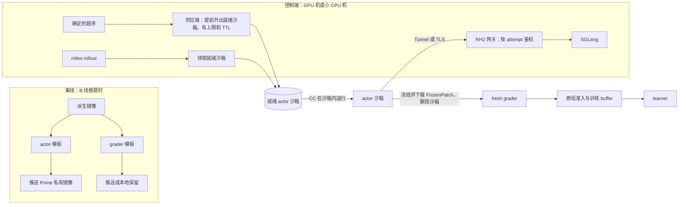

# 环境提前准备与外部沙箱：Claude 的分析与待讨论事项

日期：2026-10-04。作者：Claude（即将接手 A 线）。状态：**分析与设计建议；没有实施，没有调用付费服务，也没有修改生产代码。** 与 [Codex 的流水线建议](pipeline_proposal.md) 互补：它已写清的三层准备、就绪实例生命周期和采样原则，这里不重复，只补实测数据、费用、拓扑与几项需要拍板的问题。

依据（均为只读调查，原件见各处链接）：
- 52 题 GPU 探针逐次开销：`runs/env_pipeline_analysis_20261004/`（`report.md`、`per_attempt.json`、`analyze_env_costs.py`）。
- 现行 rollout 链路：`rh2/src/repoharness2/adapters/slime/generate.py`、`bringup.py`、`sandbox_profile.py`，以及 miles fully-async 入口。
- B 线的每题环境流程：`build_r2e_derived.py`、`prepared_task_face.py`、各题 `probe_request.json`。
- Prime SDK 0.4.2 源码与官方文档。
- 外部报告与已下载仓库：[调查](README.md) 及 reading_notes。
- 既往评估：[外部沙箱评估 09-25](../batch6_efficiency_20260921/external_sandbox_assessment_20260925.md)、[评分性能 next_v2](../grading_performance_next_20261004/README.md)。

## 结论先行

1. **时间主要耗在属主修复（chown）上，不在模型。** 52 题 GPU 探针有 101 次完整尝试：非模型时间合计 29,273 秒，是 Claude Code 求解时间 9,154 秒的 3.2 倍。非模型时间的构成：评分侧权限交接（`chown`）64%，actor 侧 `chown` 11%，两侧 Git 清理合计 8%，编译 5%（只来自两道 Pandas 题）。Dask 有 4 次评分因权限步骤超过 300 秒上限而没能评分。
2. **最大的收益来自每题镜像预处理，与是否使用外部沙箱无关。** 把属主、Git 清理、编译缓存预先做进 actor／grader 模板后，按 CPU 实验测到的残余量级估算：能去掉约 86% 的非模型时间，每次 attempt 的非模型时间从约 290 秒降到约 41 秒，模型时间占比从约 24% 升到约 69%。这是投影，不是实测。
3. **外部沙箱解决的是容量问题，不是单次开销。** 预处理之后，GPU 要喂饱，主要取决于能同时存活多少个 actor。单机的 CPU、内存和磁盘（每题镜像 3–13 GB）都会先成为上限。Prime 的默认额度（1,024 个沙箱、4,096 vCPU）足够首轮真机。但它按申请量计费：128–256 个 actor 每小时约 $6–24，与 8 卡机的租金同一量级，必须按资源档位和实测用量控制。
4. **推荐架构：** 离线制作每题的角色模板 → 供应端按确定的题序提前开出少量就绪沙箱 → actor 在 Prime 中运行（Claude Code 在沙箱内，模型请求经 Tunnel 回到我们的网关）→ FrozenPatch → 独立 grader → 原组准入 → learner。Prime 官方的 verifiers 库正是这种拓扑。
5. **同容器评分不恢复，但可以借新架构简化防线。** 外部做法里同容器省下的主要就是评分侧 chown，模板已经在 fresh 容器上消除了这部分，同时保留防篡改能力（E3 实测：L1 之后 fresh 容器更快）。真正能简化的是网络和供应设施：每次 attempt 的 docker 网络加中继、评分侧两段式撤网，在新架构下都可以删掉。

## 1. 实测：一次 attempt 的时间花在哪里

GPU 探针串行执行（无并发干扰），评分全部走普通 fresh 路径，没有使用模板。下表先取每题中位数，再跨 52 题取中位数和 p90，单位秒：

| 环节 | 中位数 | p90 | 说明 |
| --- | ---: | ---: | --- |
| actor 启动前（到 CC 进程启动） | 33.6 | 104.2 | R2E 题更慢：`chown -R /testbed`（含仓库内 .venv），orange3 单侧就要 200–240 秒 |
| 到第一条模型请求 | 40.8 | 111.9 | R2E 为 64.2／240.6 |
| CC 求解 | 62.1 | 219.4 | 本次探针模型较快；训练时会变化 |
| 评分合计 | 204.7 | 480.1 | 其中可信 setup（权限交接）191.4／456.7 |
| 两侧 Git 清理 | 各约 11 | 各约 16 | Pandas 约 3 万个提交，单侧 69–74 秒 |
| 安装 | 2.5 | 16.2 | 只有两道 Pandas 题真正编译，约 322 秒 |

另外三项开销不大但值得记下：
- 探针入口每次 `exec_and_wait` 首次轮询前固定等 5 秒，每次 attempt 约 19 秒。正式链是否一样还没核对。
- docker 清理有 74–163 秒的停顿，其中一次导致 DVC 的评分丢失。
- 每次 attempt 都把 CC 安装包上传并解包（约 1.8 秒）。Prime 单文件上传上限 16 MiB，所以上云后必须预装进镜像。

## 2. 每题镜像应提前做什么（交 B 线执行的要求草案）

做法与外部一致。MiMo 在建镜像时就截断 Git 历史、清理残留，运行时只做核对；DeepSeek 把基础镜像、workspace 和 harness 分层版本化。

| 内容 | actor 模板 | grader 模板 | 证据与收益 |
| --- | --- | --- | --- |
| 属主（chown） | `/testbed` 及环境目录归 actor uid 54321 | 候选可写前缀归 grader uid 54322（即 v13 的权限模板） | 占非模型时间 75%；去掉 Dask 的超时失败 |
| Git 历史清理＋内容证明 | 同 actor 现有清理脚本，写入证明（A 线待实现 A-C3） | L1（已验） | 约 8% |
| 依赖预装 | 是 | 是，评分全程断网 | 同时取消评分侧两段式撤网（见 §3 决定 D4） |
| Claude Code 预装 | 固定版本的原生二进制放在 `/usr/local/bin/claude` | — | Prime 必需（16 MiB 上传上限） |
| 编译缓存（L2） | 可选：agent 自己重编时也能命中 | **只有 pandas-48106、pandas-50319** | 两题每次评分安装约 322 秒；48106 实测 570→20 秒 |

**需要编译缓存的题：** 52 题中只有上面两道 Pandas。其余 32 道 SWE 的安装都没有编译器调用（中位数 0.9–17.5 秒）。18 道 R2E 的安装全部跳过；其中 12 道仓库里已有编译好的扩展，评分时不重编，所以候选对 C／Cython 的改动在评分中不会生效（orange3-4014 已出现一例）。这是 B 线的正确性问题；若以后加上重编步骤，这 12 道题会变成编译缓存的候选。

每题需要记录的内容：
- 模板身份：本地 image ID，以及 Prime 的引用加产物 ID。
- `.git` 内容证明摘要和缓存事实。
- 资源档位。
- 实测的准备、求解、评分耗时，供调度器和采样器使用。
- 编译分类，以及支撑分类的证据。

`tasks.json` 和 `probe_request` 目前没有这些字段，需要新增。

**执行前要先解决两件事：**
1. **R2E 的 actor 和 grader 共用一个镜像，但用户 uid 不同。** 建议从同一派生镜像分别做两个角色模板。
2. **现有模板构建器在 next_v2 实验树里，编译缓存部分只认 conda 环境。** A 线先把它泛化（支持 venv 和角色 uid），作为工具并入共享树，暂不接正式消费。

另外，模板的镜像 ID 变了，就要重做资格检查（noop／已知正确／已知错误），actor 侧要重做 devcheck。

## 3. 外部沙箱系统设计

### 3.1 推荐拓扑

外部参照：
- Prime verifiers 的 `CliAgentEnv`：agent 命令行在沙箱内运行，经 `prime_tunnel` 回到宿主的拦截服务（`/rollout/<id>/v1`），每次 rollout 注入一个 secret。
- Polar 把 INIT、READY、RUNNING、POSTRUN 分成四个池，就绪缓冲等于运行容量，agent 一开始运行就在后台预热 grader。
- SkyRL-Agent 把初始化、运行、评分分成三个队列，生成阶段快 1.55 倍，GPU 利用率约 90%。
- miles＋Daytona：128 个沙箱（2 vCPU／4 GiB）同时运行，约 90–100 个请求在生成。

### 3.2 需要讨论的关键决定

| # | 决定 | 选项 | 我的建议与理由 |
| --- | --- | --- | --- |
| D1 | actor／grader 放在哪里 | (a) 都放 Prime；(b) actor 放 Prime，grader 留本地；(c) 本地为主、Prime 补充 | **首轮真机选 (a)，前提是你接受隐藏测试以私有镜像形式放在 Prime**，这样运维最少，本地也不用存全部镜像。不接受就选 (b)：模板化后评分很短，一台 CPU 机就够，但要在本地存放全部 grader 镜像。(c) 要同时维护两套在线后端，首轮不建议 |
| D2 | 模型网关如何暴露（安全边界） | (a) Prime Tunnel；(b) 自建 TLS 端点（GPU 机或中继 VM） | **先用 (a)**：官方同款，基础设施最少。只暴露 RH2 网关路由，沿用每个 attempt 的 capability token，绝不暴露 SGLang 管理面。Tunnel 的并发上限和延迟要实测，不达标再换 (b) |
| D3 | episode 计时从哪里开始（训练语义） | (a) 维持从物化开始；(b) 从领取（CC 启动前）开始，准备单独计时 | **建议 (b)**：训练预算不应随基础设施快慢变化。代价是与历史探针的有效求解时间不可直接比较，需要明确记录 |
| D4 | 依赖与网络政策 | 评分：全程断网＋依赖预装；actor：只放行网关 | **建议采纳。** 评分侧不再需要已批 2A 的两段式撤网；Prime 的 `set_network` 不切断已有连接，这个问题也随之消失。actor 装包的需求留给 1A 供应网关以后再接，首版不放行 |
| D5 | 资源档位与费用上限 | S：1 vCPU／2 GiB；M：2 vCPU／4 GiB；L：4 vCPU／8 GiB | **按题实测定档，并设每小时费用上限。** DSec 统计 90% 的沙箱用不到申请 CPU 的 5%，Kimi 报告沙箱最多 98% 的时间在等模型，所以多数题用 S 档就够 |
| D6 | 每题镜像要求与构建工具 | 见 §2 | **建议马上让 B 线在做题时同步产出两个角色模板**；A 线先泛化构建器 |
| D7 | 采样器 | 见 §5 | 先做静态耗时档、按窗口保持目标组成、窗口化 FIFO 消费，并记录各比例 |
| D8 | 验证顺序与预算 | 见 §6 | 需要新的 Prime 额度：建议上限 US$50，用于远端 actor 闭环和规模测试 |

**不建议现在做：** 自建 AgentENV 或 K8s、partial rollout、快照或分叉（Prime 的文件系统快照 10 月 2 日才上线，且不含进程和内存）、同时接入多家服务。

### 3.3 容量与费用估算

价格采用 Prime 的促销价（有效至 2026-12-22）：每 vCPU 小时 $0.02，每 GiB 内存小时 $0.0125，每 GiB 磁盘小时 $0.0002。

| actor 并发 | S 档（1／2／20） | M 档（2／4／20） | 备注 |
| --- | ---: | ---: | --- |
| 64 | $3.1/h | $6.0/h | |
| 128 | $6.3/h | $12.0/h | miles 示例：128 个在途 ≈ 90–100 个请求在生成 |
| 256 | $12.5/h | $24.1/h | |

grader 模板化后每次约 20–60 秒，费用小一个量级。自管 CPU 机（Vast，约 $0.012–0.014 每 vCPU 小时，含内存）可以超配 3–5 倍，单位工作量便宜得多，但要自己分发镜像（每台都要存全部题的镜像）、运维 docker 和跨机网络。

判断标准沿用 Codex 提出的「每个被 learner 消费的有效组的总成本」：GPU 租期、沙箱、存储和失败重试都计入，同时记录运维时间。

## 4. 同容器评分与「过度防御」

- **外部做法：** MiMo 的开源代码路径是在同一个 pod 里重置被改路径后注入测试，DeepSWE 路径则换新 pod；Prime 的 taskset 在同一沙箱内评分，但其博客把这列为局限；Polar、AReaL、SWE-rebench 用独立的评分环境。
- **作弊是真实发生过的：**
  - Qwen3-Coder-Next 在 RL 后期学会重新加 git remote 去拉历史；有作弊时 SWE-bench Verified 是 84.6%，加拦截后是 75.1%。
  - MiMo 观察到装新版包、curl 上游代码、读上游 issue。
  - DSec 遇到过覆盖 `/bin/bash`、伪造内部 RPC、扫描端口找镜像源。
  - 一项加固研究发现约 16% 的环境可被利用。
  - 我们的核心防线（FrozenPatch＋fresh grader、Git 历史清理、网络白名单）正好对应这些攻击类型。
- **我们的数据：** fresh 评分之所以贵，几乎全在 chown，不在防线本身。L1 之后 fresh 容器比同容器还快（DVC 50.6 秒对 58.8 秒）。
- **建议：**
  - 保留核心防线。
  - 借新架构删去每 attempt 的 docker 网络加中继（改用 Prime 白名单）、评分侧两段式撤网（改为离线评分），以及 actor 每次 chown 和 Git 清理（改用模板）。
  - 注意加固过度的代价：那项研究里合法通过率从 76.1% 降到 65.2%。防线应针对答案泄露，不要一刀切地拦截。

## 5. 采样器

同意 Codex 的第一版原则（准备耗时、求解时长、难度分开；按窗口保持目标组成；记录目标、派发、完成、消费四个比例），这里补三点：
1. **窗口化 FIFO 消费（MiniMax Forge）：** 只消费派发队列头部 W 个位置内已完成的组，直接限制快题被过度采用。在现有 governed buffer 里实现即可。
2. **各类的在途容量 ∝ 平均占用时长 × 需求 ÷ 接受率**（MiMo Eq.6–7 的简化形式）。慢题要给更多在途容量，训练权重不随之改变。
3. **耗时档按模板化后的实测重新估。** 现有的 Pandas 13 分钟、orange3 4 分钟，大多是 chown 和编译造成的，不能沿用。

## 6. 建议的推进顺序

1. **每题模板（不依赖外部沙箱，收益最大）：** A 线泛化构建器并作为工具并入；B 线做题时同步产出角色模板，并记录编译分类和耗时；A 线实现 actor 侧证明核对（A-C3）。
2. **Prime actor 最小闭环：** 2–3 题，用 DeepSeek API 或小模型。CC 在沙箱内，经 Tunnel 访问网关，完成 FrozenPatch 下载和评分；同时验证 `user=` 降权、停止确认和日志完整性（09-25 评估提出的接缝）。
3. **规模测试：** 64–256 个空闲或假负载沙箱，测就绪延迟、429 限流、Tunnel 容量和费用。
4. **就绪队列与采样记录，然后真机 A/B：** 对比按需创建与提前准备，看环境造成的无请求等待、有效组/GPU 小时和总成本。

第 2、3 步需要你批准新的 Prime 额度（建议上限 US$50）。第 1 步只需本地和现有 CPU 机。
