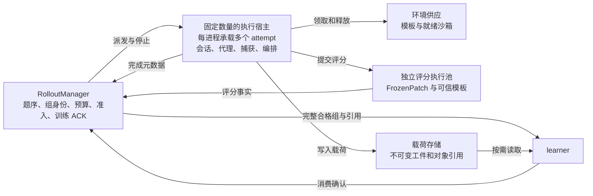

# Rollout manager 架构与闭包内存修复复核

日期：2026-10-05。作者：Codex。对象：[Claude 对照页](rl_infra_mimo_vs_rh2.html)、[讨论记录](../tmp/链路优化.md)、`PerRolloutAdapter` 未提交修复。依据是本次工作树，不把旧启动器默认值当成正式训练定案。

**结论：闭包修复通过本轮独立审查，没有发现由该改动引入的阻塞问题。架构优化值得做，但理由应改为“同步重活阻塞事件循环，重数据和生命周期集中”，不能简化成“只有一个进程，所以只能用一个核”。推荐保留一个轻量调度者，逐步接入固定数量的执行宿主，并同时建立按字节计量的反压。**

Claude 找到的模板化、远程环境、代理容量、路由载荷与闭环缺口都有依据。需要纠正并发计数、GIL 归因、MiMo 增量处理的适用条件，以及“所有路由优化都属于 I18”的说法。最大的遗漏是：已完成但仍等待同组成员的载荷、整批 debug dump 和重复摘要、分片后的全局限额与关停所有权。

本轮没有修改生产源码、Claude 的 HTML 或讨论原文；没有启动 CPU 租赁、沙箱、模型 API 或 GPU 作业。下面的升级方案属于建议，不表示已实施或已批准。按仓库审查标准分别进行了生产路径追踪和反证核查，关键引用释放与调度反例由主审再次验证。

## 1 当前进程真正承担什么

| 执行位置 | 当前工作 | 依据 |
| --- | --- | --- |
| RolloutManager 的 Ray actor 事件循环 | 接收 learner 请求；整批 debug 输出、证据摘要、训练字段转换、写入 object store | `miles/ray/rollout/rollout_manager.py:206–233, 285–295` |
| 同一进程的 miles 后台事件循环 | 数据源、组派发、RH2 attempt 编排、容器操作的异步等待、评分队列、收尾和交付 | `rollout_manager.py:418–431` → `utils/async_utils.py` → `fully_async_rollout.py:230–261` |
| 同一进程的 HTTP 代理线程与事件循环 | 请求渲染、tokenization、鉴权和预算、引擎请求、响应解析、捕获与路由带处理 | `bringup.py:1259–1465, 1707–1715`；`capture_wire.py` |
| 其他进程或容器 | Router、SGLang、Docker CLI、Claude Code、编译和测试 | `router_manager.py:74`；`docker_sandbox.py:49` |

所以问题不是 asyncio 同时等待很多会话，而是某个循环同步解析、计算或写盘时，不能服务同循环中的其他请求、取消和收尾。`num_cpus=1` 是 Ray 逻辑资源申请，不是操作系统绑核；容器编译也不受 Python GIL 约束。[Ray 资源说明](https://docs.ray.io/en/latest/ray-core/scheduling/resources.html)

MiMo 报告 §6.2 的参考点是**固定数量的常驻宿主，每个宿主承载多个会话**，阻塞工作放后台线程，控制面只处理轻量元数据。不是每个 attempt 单独开一个 Python/Ray 进程。其公开 code recipe 是另一套可运行实现：framework、gateway actors、每会话 runner task；`scripts/code/train.sh:68` 的八个 gateway 是该脚本默认值，配置文件默认值并不相同，不能直接作为我们八卡的推荐数量。

## 2 需要修正的分析与补充项

### R1 代理确实饱和，但并非全部被 GIL 限制

**等级：P2，分析修正；生产可达的同步热点，容量数字来自替身压测。**

- 当前表述：讨论记录第 2、5、9 行把主要限制概括为 GIL，HTML 的 RH2 编排节点也据此解释单核限制。
- 不成立之处：大块 `hashlib` 运算会释放 GIL，但同步调用仍占着当前事件循环。[Python 官方说明](https://docs.python.org/3/library/hashlib.html) 给出的条件是单次输入超过 2047 字节。`generate.py:746,842` 正是大块摘要路径。
- 独立反证：当前 `_canonical_meta_digest` 对约 42 MiB 元数据运行 48 次，双线程约 2.02 倍加速、约 1.89 个有效 CPU 核；同样条件的 base64 解码没有线程加速。这是本机微基准，不是整条代理吞吐收益。证据见下方探针。
- 影响与建议：把“有界线程卸载纯计算与 I/O”纳入最小方案，不必先拆整个 manager。Python JSON、base64 等仍可能需要进程分片，不能反过来推断线程池一定够用。
- 验收：摘要字节与捕获顺序保持一致，分别量代理循环延迟、编排循环延迟和 CPU。不能将整个会修改 `hook`、registry、计数器的调用随意扔进线程池。

### R2 并发槽不是驻留内存上限

**等级：扩容设计前必须补齐；当前规则 production_reachable，局部 CPU 反例已复现。**

- 当前表述：HTML RH2 图写“8 组 × 8 = 64”“每完成一个样本补位一个”。
- 实际规则：`SampleBackfillSubmission` 每完成一个成员释放一槽，**累计空出八槽后才派发一个完整新组**；容量判断不把未结束组数量作为上限。已完成成员仍被组内 `asyncio.gather` 持有。见 `submission_scheduler.py:31–52`、`inference_rollout_common.py:161–174`。
- 最小反例：原八组各完成七个、各留下一个慢成员，真实调度类允许再派七组。结果为 **64 个未完成成员、15 个未完成组、120 个组内成员**。这证明图中的“固定八组”不成立，不是一次真实 GPU 压测。
- 另有驻留：完整组 buffer、已取出的训练批、捕获暂存和 debug 序列化副本。`fully_async_data_buffer.py:210–217,268–276` 的容量按组数，没有按字节预算。
- 影响与建议：仅按“64 × 每个活跃 hook 大小”估内存会漏项；只拆进程也不会减少总字节。增加未完成组、待评分、完成组和载荷字节的观测及反压；容量不足时停止新派发，已有样本按原规则完成，不新增“长样本太大就丢”的策略。
- 验收：重放组内长尾、评分变慢和 learner 暂停，所有驻留类别可解释，内存/磁盘及队列有界，取消后无未登记任务。探针：`runs/rollout_manager_review_20261005/scheduler_probe.json`。

### R3 路由运输优化与 I18 应分开

**等级：P2，方案分类修正；前向选择改变仍须按 T0 决定。**

- 当前表述：讨论记录与 HTML 第 10 项把路由增量、结束时取回直接等同于修改 I18。
- 当前事实：`generate.py:1545–1555` 确实使用最后一轮完整路由；捕获层还保留各轮记录和工件。将每轮“新 token 的路由”直接拼起来，可能换掉既有前向事实，不能机械采用。
- 但有等价空间：保留同一轮完整字节的无损编码、按内容分块存储、纯摘要计算卸载、可重建原完整数据的差分运输，都不必然改变训练路由来源。结束时取回也不必然改变训练语义，但需要保存分叉、重试、版本、原始记录与失败时取证；可能涉及公共协议或生命周期变更，仍要单独评审。
- 影响与建议：先研究等价路径，I18 单列。不要将 SHA-256 换成较弱校验，或删除逐轮摘要后宣称只是提速；它们是当前工件契约的一部分。也不能套用 MiMo 公开 recipe 的“只留最长链”来减少 RH2 样本。
- 验收：普通续接、重试、分叉、context rewrite 和跨权重版本回放下，token、logprob、mask、路由字节、capture 回链、样本集合与原路径一致；有任何变化就明确列为语义或契约变化。

### R4 代理基准不能直接给出正式 GPU 容量

**等级：P2，结论范围修正。**

- `runs/proxy_capacity_20261004/RESULTS.md` 足以支持长上下文路由处理是该 fixture 的大头：同档路由/无路由 CPU 约 0.62/0.10 秒，每轮差约 83%。
- fixture 使用假引擎、固定生成/工具节奏、消除分叉的 tokenizer 包装；`model_call` 放宽至 4096，未含 Docker、评分、普查、正式交付和 miles buffer。两个对照的平均上下文也并非完全一样。83% 包含运输、解析、解码和摘要，不是 SHA 本身占 83%。
- “生产 5–7 轮/秒”没有目标机器端到端实测。64 个 attempt 包含准备、工具和评分，不能直接当作 64 个持续按假定频率发模型请求的会话。GPU 吞吐、KV、批量和响应长度仍未知。
- 验收：保留原实测数字和条件，把“会先卡住 GPU”降为待测假设。下一次已有真机实验同时记录代理排队、引擎在途请求、生成吞吐、KV/前缀命中和 GPU 等待原因；不为接受本次内存修复另开 GPU。

### R5 数据面的小改动应提前，完整分布式系统可以递延

**等级：扩容前优先测量和处理；静态 production_reachable，尚无全链路时间占比。**

- 已提到的热点：`generate.py:5810–5858` 在编排循环同步写整段 tape。讨论记录“写几百 MB 并 fsync”需拆开：这里是 `Path.write_bytes`，没有显式 fsync；fsync 位于其他 finalization/audit 路径，不能把二者计成一次操作。
- 漏项：旧 launcher `launch.sh:447` 开启整批 debug dump；`rollout_manager.py:217` → `debug_data.py:110–117` 同步写轨迹、parquet、`torch.save`；`rollout_manager.py:295` 又 `arr.tobytes()` 后计算路由摘要。它们发生在 manager actor 循环，与代理循环不同。
- 影响与建议：在引入完整 TransferQueue 之前，就可检查重复序列化、全量副本、同步写盘和摘要复用。保留必要审计，区分可选 debug 与必需工件；先让大载荷离开控制循环，并建立有界保存队列。
- 验收：重载荷不再阻塞取消/调度；写失败仍按原规则上报，不能异步“发出去就算成功”。评估磁盘与网络吞吐，不能只报告单进程 CPU。40 MB/轮在 5 轮/秒时就是约 200 MB/秒原始流量，尚未计额外副本；这是算术示例，不是生产实测。

### 对 14 个优化点的逐项裁定

| 原编号 | 复核意见 |
| --- | --- |
| 1 镜像预制 | 同意。接入 L1/L2 和 actor 模板；actor 模板资格与 grader 分别验证。 |
| 2 外部沙箱 | 同意作为环境扩容方向。它不会自动消除中心代理的 CPU、网络和内存瓶颈。 |
| 3 提前准备 | 同意。有界就绪队列与真实派发接线，预读不要提前消耗数据游标；预算起点单列。 |
| 4 评分不卡槽不卡组 | 应改为“释放物理/执行容量，评分异步继续”。完整组入训仍须等既定成员和评分齐全，不能为提速绕过组准入。当前已有 sample backfill，不是尚未实现“评完后补位”。 |
| 5 拆分执行宿主 | 同意中期方向；先量有界线程卸载，再以 1/2/4 个常驻宿主比较。不要照搬 MiMo 八个网关的数值。 |
| 6 放开推理并发 | 不能无条件采纳。32 是待校准上限，不是已证明错误。一个引擎时没有跨引擎会话漂移；多引擎再比较会话粘性/负载感知和缓存收益。 |
| 7 按来源和耗时调度 | 原则同意。窗口化 FIFO 是可选策略，不是保证无偏的证明；要测 learner 实际消费组成、陈旧度、长尾等待与有效组率。 |
| 8 KV 缓存与卸载 | 先量前缀命中、KV 压力和工具空档，再决定；当前一引擎也能有 radix 命中，不能因为无粘性就推断缓存差。 |
| 9 投机解码 | 递延。MiMo 的 31.3% 是接受长度改善，不是我们可获得的端到端吞吐增幅；还需真实 logprob、支持集和路由捕获兼容性。 |
| 10 每轮新增量 | 按 R3 拆成等价运输/存储优化与 I18。MiMo 公开代码只有可匹配链才增量 tokenize，无匹配则全量，且每轮仍重算消息前缀哈希。“约 1 ms”是单项微基准，不是 MiMo 网关实测。 |
| 11 数据面分离 | 有界载荷与小范围 I/O 卸载提前；完整分布式 packer 递延。不能把全部内存问题留到并发扩大之后。 |
| 12 训练闭环 | 同意，属于正确性前置。正式启动器、已批准陈旧度、发布频率与真实 learner 消费必须一致。 |
| 13 删除冗余设施 | 逐项判定。网络中继和撤网流程承载安全边界，只有新后端证明等效行为或相关政策正式改变后才替换；不按“历史代码”批量删除。 |
| 14 闭包滞留 | 本轮修复通过，见第 4 节。它不降低活跃会话本身的路由载荷。 |

MiMo 的“最终一次取回路由”来自报告 §6.4。公开 `uni-agent/.../session.py:302–308` 在收到路由时覆盖为本轮完整值；`verl/workers/config/rollout.py:270` 默认关闭 routing replay。两者应继续分开标注。公开代码增量路径在 `session.py:450–543`，包含全量回退，不能写成每轮必然只处理后缀。

## 3 建议的升级设计

**保留单个 RolloutManager 作为控制入口，逐步把会话执行和重载荷移出它。** 单个轻量调度者不必先做高可用或分布式共识。



这张图是目标边界，第一片不要求全部实现。执行宿主是长期存在的 CPU 进程；远端沙箱是每题环境，两者数量与生命周期不同。

**先做最小卸载。** 把确定不修改共享状态的哈希、不可变字节处理和 I/O 放入有界 executor；结果返回原 owner 循环提交。Python CPU 段是否换进程由基准决定。取消 await 不代表后台线程停止，必须跟踪已提交工作，在 drain/关闭前完成或按既有失败规则报告；不能留下关闭后仍写工件的后台任务。

**然后做固定宿主池。** 推荐先比较同机 1/2/4 个宿主，每个宿主承载多会话。整段 session 状态和捕获 owner 一起迁移，比只把 HTTP 壳拆出去、每轮再向中心传回几十 MB 更有价值。不要在带活跃线程的进程中直接 fork 后继续共用 registry；新进程独立初始化，旧 owner 排空后切换。

具体接入点是 `Rh2MilesGenerateFn`：它最终成为派发适配层，将稳定的 attempt/组身份、任务引用、配置和预算交给宿主。宿主运行当前 RH2 语义并产出结果引用。组准入与 governed buffer 的 learner ACK 继续由控制端管理。正式改接口前需要定义序列化、错误传播和同一产物的唯一写入者，不靠序列化整个 `BringupService` 实例实现分布式。

### 拆分时不可遗漏的约束

| 边界 | 最小设计 |
| --- | --- |
| 会话身份 | 一个 `physical_attempt_id` 在生命周期内固定归属一个宿主；鉴权、registry、树、hook、poison 与捕获提交保持同一 owner。 |
| 全局容量 | 分开计量就绪环境、活跃 actor、模型请求、待评分、未完成组、完成组与载荷字节。宿主增加时，全局模型调用上限不能从 32 悄悄变成每宿主 32。先可固定分配额度，避免每轮向中心申请造成新热点。 |
| 评分解耦 | FrozenPatch 和必要事实保存成功后释放 actor 执行容量；保留有界待评分容量及独立评分期限。不是提前把样本记作完成，也不是允许缺少组成员入训。 |
| 载荷生命周期 | 控制端尽量只持有身份、奖励、长度、版本和引用。活跃捕获、待评分、等同组、buffer、已发 learner 各阶段都须可计量；按最终消费/拒绝/关停规则释放。Ray 对象引用不是持久化恢复证据。 |
| 版本和关停 | 发布、eval、停止和 drain 要覆盖所有宿主；每轮继续记录真实权重版本。控制消息不能被无界数据保存工作饿死。 |
| 故障 | 初版保留现有 run-fatal 语义，不因分进程就承诺“一个宿主死了，其余继续训”。资源创建前登记身份，未知创建结果可对账；宿主崩溃仍由控制端/资源回收者确认远端资源。 |
| 跨机期限 | 不能直接比较两台主机的 monotonic 数值。先同机验证；跨机前定义剩余预算、传输耗时和超时结算，避免重置期限。 |

### 三个方案的选择

| 方案 | 优点 | 代价与结论 |
| --- | --- | --- |
| 保留单进程，做有界线程卸载和表示优化 | 最小改动，可先验证哈希/I/O 对循环阻塞的贡献 | 不能消除所有 Python CPU 瓶颈或总内存集中；推荐作为第一片。 |
| 轻量 manager 加固定执行宿主池 | 可扩 CPU 处理能力，分散会话状态，和外部沙箱正交 | 需要明确全局额度、版本、关停和引用协议；推荐中期目标。 |
| 每 attempt 一个独立进程或直接重建完整分布式平台 | 隔离更细，组件独立 | 重复初始化、RPC、FD 和运维成本高；MiMo 报告也明确避免按实例扩张 actor 数量。当前不推荐。 |

长期架构与跨组件 owner 迁移属于 T0，需要用户对具体方案决定；纯等价卸载和本次闭包修复不等同于新的训练语义决定。I18、episode 起点、远端网关安全边界单独列项，避免用一个“同意多进程”包办所有变化。本轮只提出方案，不要求用户现在追加预算或提供 API。

T0 扫描：已确认的是跨组件 owner 迁移；方案尚缺全局额度和资源回收 owner 的具体归属。把字节等价的纯计算卸载直接归为 I18，是误报。I18、计时起点和外部网关边界可留到对应切片决定；线程池是否足够、宿主数量和跨机带宽属于先实验再定的项目。

## 4 闭包内存修复验收

审查代码为 `bringup.py:1041–1163`，工作树 SHA-256 与旧版 SHA 记在输入清单。HEAD 为 `41d19edfbe6d1c271250838a7761b445358219fb`；共享树另有未提交工作，不把此次通过扩展为整个工作树通过。

原局部类经类对象循环、方法闭包继续持有 hook。新类提到模块级，依赖存为实例字段，消除了这条循环。逐方法 AST 对比在去掉新增依赖别名赋值后完全相同：open 回滚、finish 身份导出、revoke、drop 的 finally 均保持。resolver 仍只捕获 registry/sid。

真实生产工厂是 `BringupService._adapter_factory`；attempt 的 finally 调 `drop_session`，其 finally 执行 `registry.unregister`。**释放点是登记引用和调用者引用都结束之后，不是调用 finish_session 就立刻释放。** 活跃 attempt、仍在评分的 attempt、外部保留的 Task/异常引用仍可能合法持有对象，本修复没有承诺消除这些。

| 独立验证 | 结果 |
| --- | --- |
| 原四方法 AST 等价 | 4/4 一致。 |
| 真实 registry/hook，关闭循环 GC：drop 成功、finish 后 drop、open 失败、drop 失败、drop 取消 | 旧/新共 10 项；旧版五项均仍存活，新版五项均释放；显式 GC 后旧版也释放。活动登记期间确认 hook 没有过早释放。 |
| 原局部测试及身份纵链，指定实际 miles integration fork | **24 passed，0 skipped，0 failed**，2.91 秒。 |
| 默认 base pin 的首次检查 | 23 passed、1 skipped；skip 是 sampling-mask 能力用例要求 integration fork，随后已用正确 fork 补齐，不保留为验收缺口。 |
| ruff check 受审的两个文件 | 通过。 |

测试使用本机 Python 3.12，未重跑作者四分钟 RSS 基准、Linux 或真实 learner。作者的 9.1→1.1 GB 是其压测证据，本轮不冒称重新测得。源码引用机制、旧新反例与正常身份路径验证已足以接受局部修复；不必为了它重启 cpu-c。可以在下一次既定 Linux 链路实验顺带确认 RSS 回落。

非阻塞文案修正：“只能等第 2 代 GC”过于绝对，应改为“依赖循环 GC，长生命周期对象可能已晋升至第 2 代”。不要用每轮强制 `gc.collect()` 替代根因修复。

作者报告的其他八个评分失败和 lane 失败，本轮未全量复跑，不为其整个工作树背书；本轮只接受明确隔离出的类移动修复。

## 5 建议实施与实验次序

1. 收入闭包修复，修正分析文案，统一正式入口版本和参数。给代理、编排、manager actor 三个循环分别加必要观测，避免混报延迟。
2. CPU 对照当前实现、有界线程卸载、1/2/4 个宿主。保持**相同全局并发、相同输入轨迹和相同捕获要求**，覆盖长短上下文、分叉、重试、评分变慢、buffer 满与取消；不以关闭路由捕获作为优化版。
3. 将代理请求等待、解码/摘要、工件保存、组等待、训练转换分别计时；报告每轮处理字节、各阶段驻留字节、循环 p95/p99、CPU 和有效完成率。加入周期性长尾，避免高并发档因为上下文推进更慢而看起来吞吐提高。
4. 选出最小满足目标容量的方案后，与模板、外部沙箱和就绪队列接线。验证宿主退出、创建回包丢失、磁盘写失败、迟到完成和关停；沿用原失败与组准入规则。
5. 下一次短时真实 GPU 链路比较相同任务组成和预算下的有效组/GPU 小时、learner 实际消费组成与总成本。只有这一步能确认对 GPU 的收益，不能把 CPU 微基准倍率当整链倍率。

无需先做完整 TransferQueue、KV 卸载、投机解码、自动恢复或每 attempt 进程隔离。也不因本次修复已通过就宣称 learner 闭环已通过。

## 6 证据与审查覆盖

运行证据目录：[`runs/rollout_manager_review_20261005/`](../../../../../runs/rollout_manager_review_20261005/)。输入清单保存代码与被审文档 SHA；关键文件：

- `input_manifest.json`：工作树身份、四方法 AST 对照。
- `memory_lifecycle_probe.py`、`memory_lifecycle_result.json`：主审五种生命周期旧新对照。
- `scheduler_probe.py`、`scheduler_probe.json`：实际调度类的长尾反例。
- `targeted_integration_pytest.log`、`ruff.log`：指定实际 fork 的验收结果。
- `falsifier/probe.py`、`falsifier/probe.json`：独立引用释放、hash/base64 线程对照。

复现：

```bash
cd rh2
.venv/bin/python ../runs/rollout_manager_review_20261005/memory_lifecycle_probe.py
RH2_MILES_PATH=../reference/miles-rh2-integration .venv/bin/python -m pytest -q -rs tests/adapters/test_glue_factories.py tests/adapters_miles/test_f1_turn_identity.py tests/adapters_miles/test_f1_e2e_identity_chain.py
.venv/bin/ruff check src/repoharness2/adapters/slime/bringup.py tests/adapters/test_glue_factories.py
```

外部依据：[MiMo 报告固定版本](https://huggingface.co/XiaomiMiMo/MiMo-V2.6-Pro-RL/blob/73875d00b30a89ef8cc353a0b60b0e9f9561952d/MiMo_V2_6_technical_report.pdf)，重点 §6.1–6.4；公开源码仍使用 [调查 README](README.md) 中的固定 snapshots，未更新或运行 MiMo 代码。

| 维度 | 本轮覆盖与限制 |
| --- | --- |
| A 正确性/并发/失败；D 所有权；G 生产路径 | 追踪三循环与生产工厂；验证 open/drop 失败和取消；架构迁移未实施，不能宣称分布式故障验收。 |
| B 训练分布；F 既定决定；H 唯一来源 | 本修复不改组、reward、预算、mask、版本或拒绝；提出池化时单列 I18、计时与 owner 迁移，不混作优化授权。 |
| C 挡板；I 分期 | 无新增/撤销挡板；内存修复通过，架构提案和 Linux/GPU 证据明确分开。 |
| E 测试；J 可读性 | 旧代码失败、新代码通过的独立引用探针；四方法 AST 一致；指出 GC 代际文案过强。 |
| K 演进成本；L 容量/反压；M 观测 | 比较线程卸载、固定宿主与每 attempt 进程；复现残组驻留，识别字节反压、重复写盘与控制消息活性需求。 |
| N 依赖与兼容 | 固定 MiMo sources；核实际 miles fork；本机 Python 3.12，未把远端/大规模表现推作已验。 |
