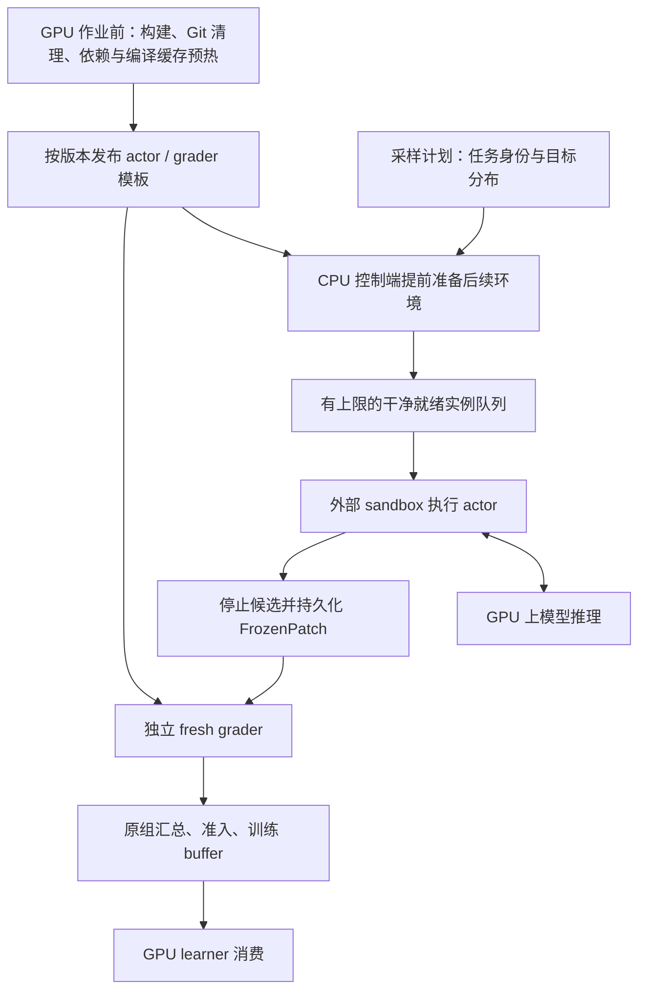

# 外部沙箱与环境提前准备：真机实验前的设计建议

2026-10-04，Codex。承接用户本轮提出的目标：减少 GPU 等环境的时间，通过托管沙箱扩大并发，并避免快题挤占训练数据。本文是建议及源码事实核对，尚未实施、启用新服务或安排付费实验；不覆盖[上一轮调查](README.md)与历史决定。

**建议把“外部沙箱＋环境提前准备”提升为下一轮链路工作的主线。优先在现有 miles/RH2 上补齐准备、领取和回收流程，Prime 作为首个托管后端候选；完整组、FrozenPatch 和 fresh grader 的既定语义继续保留。** 真机实验前应有目标并发的 CPU 侧验证；不需要先自建 AgentENV/Kubernetes 或重写全部历史链路。

## 1. 用户判断成立，但有三处需要精确化

1. **32 vCPU / 每容器 2 vCPU，算术上是 16 个容器。** 若同时给 8 个 actor 和 8 个 grader 各预留 2 vCPU，才接近 8 对；两类不必一一常驻。实际容量取决于可用内存、磁盘、I/O、编译负荷及宿主预留。Docker CPU 配额是上限，不是独占物理核；等待模型多时可有更多存活环境，但不能以此保证重编译阶段的吞吐。
2. **容器数、题目组数、模型请求并发不是一个数。** 例如每题采样 8 次，16 个 actor 容器仅相当于同时容纳两题的完整采样组；其中还会有容器在执行工具、等待测试，没有向 GPU 请求生成。需要分别度量，不能直接把沙箱开到与 GPU 数量相同。
3. **当前不是没有异步链路，而是缺少正式的环境预备环节。** 已有异步 rollout、样本补位、评分队列、治理 buffer；模板/编译缓存也已有实验交付。重复准备仍在 actor attempt 的关键路径，正式入口还未消费 next_v2。这是要补的具体缺口。

### 本轮核到的源码事实

| 位置 | 当前行为 | 实施含义 |
| --- | --- | --- |
| [generate.py](../../../../../rh2/src/repoharness2/adapters/slime/generate.py) `_generate_attempt`、`_prepare_workspace`、`_materialize_rollout_sandbox` | attempt 内建立 episode deadline，再创建 Docker 网络/容器、可信初始化与 baseline，之后启动 harness。镜像必须已可 inspect。 | 未见正式 actor 从“已就绪实例队列”领取环境；静态镜像可先备，但每次运行初始化仍在关键路径。 |
| [bringup.py](../../../../../rh2/src/repoharness2/adapters/slime/bringup.py) | `PreparedTaskFace` 消费预制题包/材料；正式评分构造 Docker `SWEGradingManager`。原生 Claude Code 已离线上传并核版本。 | `prepared` 题包不等于容器已 ready；不能再把离线 CLI 安装当全新功能。 |
| [grading/queue.py](../../../../../rh2/src/repoharness2/grading/queue.py) | 有界评分队列与反压，默认 4 worker、8 等待位；评分期限含排队。 | 复用现有入口，新增后端不能绕过期限、归因、清理与反压。 |
| [fully_async_rollout.py](../../../../../reference/miles-rh2-integration/miles/rollout/fully_async_rollout.py)、[submission_scheduler.py](../../../../../reference/miles-rh2-integration/miles/rollout/submission_scheduler.py) | 后台派发完整组；支持 sample-level backfill，释放样本容量可触发派发。 | 不需要另造一套通用 rollout 调度器；先设计如何在派发前预取任务环境，实际 launcher 配置另核。 |
| [inference_rollout_common.py](../../../../../reference/miles-rh2-integration/miles/rollout/inference_rollout/inference_rollout_common.py) `generate_and_rm` 与 RH2 `_finalize` | `generate_fn_semaphore` 包住整个自定义 generate 调用；RH2 在其中准备、做题，并等待评分终态。sample 补位通知也是任务完成后触发。 | 环境已经回收不代表逻辑生成名额已释放。需对照实际并发设置，检查准备/评分是否挤占向 GPU 供给请求的容量；不能只增加 sandbox 数量。 |
| [governed_buffer.py](../../../../../rh2/src/repoharness2/adapters/miles/governed_buffer.py) | 包装 miles 的容量、过滤、staleness 和训练消费回执。 | 环境 ready 队列与训练结果 buffer 不可混成一套状态；预备环境尚未产生行为策略数据。 |

版本整合沿[当前 A 线状态](../a_line_status.md)：共享树、frozen_v9、next_v2 尚未统一，不能从干净 HEAD 搬一份过时链路来改。

## 2. 建议流水线：提前做三层准备

### 第一层：一次性环境工件，在 GPU 作业前完成

准备基础系统、工具链、稳定依赖、任务工作树、权限与 Git 历史、固定 harness 版本，以及已证明可用的编译器缓存。建立可追溯的 actor/grader 模板身份和资格记录。构建可在便宜 CPU 或构建 sandbox 中进行，不要求一律在运行实例里现做；构建环境与运行环境须匹配架构、编译器和依赖。

对 C/C++/Cython 题，提前做的是**可信基线的缓存预热**。收到候选后仍运行官方安装/编译，变更的编译单元必须重新编译；不能复用旧 `.so` 来跳过验证，也不能把 candidate 编译结果写回跨候选共享的可信缓存。只读缓存种子＋每个 attempt 的私有可写目录，沿用已验 next_v2。不同题的编译工具链不应共用一个未绑定身份的缓存。

已有 Pandas 加速是代表样本证据，不保证所有编译题同样收益；R2E 不编译候选 C/Cython 修改的问题及 Pandas 安装失败归因仍归 B 的材料审计，不能靠预热掩盖。

### 第二层：供应商冷准备，在首批 GPU 请求前完成

上传并核对最终镜像、完成首次转换、检查镜像身份及环境启动。准备期只运行可信初始化和探针，不绑定训练权重，不发模型请求，不注入候选和隐藏评分材料。

Prime 当前官方文档特别说明：新镜像首次作为 VM 启动会经历转换，可能花几分钟；checkpoint 保存的是文件系统，**不包括运行进程或内存**。这支持将镜像转换前移，但不支持直接把 Kimi 的整机暂停恢复语义移植到 Prime。[官方说明](https://docs.primeintellect.ai/sandboxes/overview)

### 第三层：运行中的小批提前准备，覆盖下一轮消耗

CPU 控制端根据已选任务和预计领取速度，提前创建有限数量的干净实例。当前 actor 做题时准备后续 actor；收到 FrozenPatch 后把评分交给独立 grader 容量，及时回收 actor 资源。RH2 正式冻结路径已经在工件持久化后、评分前调用 `_release_rollout_container`；此处要保留并迁移到新后端，不重复开发。模板库存可以覆盖整份题单，**活着等待领取的实例应只保留小窗口**，并有数量、总 vCPU/内存/磁盘、费用和 TTL 上限。

初始就绪量可依据“环境领取速率 × 创建/初始化 p95 时间＋余量”估算，再受资源和预算封顶；这是调度估算，不是验收承诺。不能固定为无限预热，也不能不看任务复用就每题常驻一个容器。

建议至少分开管理准备、actor、grader 三类资源槽，并在总配额下协调；另将模型请求并发与尚未完成的逻辑样本数分别计量。不能为了释放 actor 槽，提前把未评分样本标为完成或绕过组准入。grader 积压应反压新任务，避免所有容量都被准备和 actor 占满后，没有资源完成评分。任务按实际资格选择资源档；2 vCPU/4 GiB 只能作为一种档位，不是全题默认事实。

## 3. 领取与回收边界：这是新链路最需要设计清楚的部分

候选前实例可采用 `PREPARING → READY → CLAIMED → ACTIVE → RELEASED` 的内部生命周期。这里是建议状态划分，不是已批准的新公共 schema。

- 预备实例有独立 preparation lease；领取时原子绑定到唯一 attempt，明确回收 owner。只允许未被 actor 使用过的实例进入 READY，不回收脏容器供下一题使用。
- 领取时核模板版本、任务材料、运行身份和必要健康事实；不是把所有重检查原样搬到领取阶段，使“预备”失去收益。哪些检查可用可信模板证明替代，须逐项设计。
- 模板/材料更新、就绪超时或作业取消时，未领取实例也有明确回收路径；API 创建超时但服务端结果未知时先对账，不盲目重试造资源。
- 控制进程、远端资源和训练结果 buffer 分别持有哪份状态须明确；持久化的 lease/账本在崩溃后可对账。不能仅靠 `finally` 或内存列表保证回收。
- 远端 actor 的文件、命令、进程、停止确认与 FrozenPatch 导出要成套适配；同时验模型网关的可达性、会话鉴权和断连行为。只替换 `docker run` 不够。

**预算要显式处理。** 当前 episode 时间包含准备，评分期限包含排队。将准备移到领取之前可能增加同一墙钟额度下的有效做题时间，这是实际语义差异。第一片模板接线继续原计时；引入 READY 领取时，必须在设计中明确准备/就绪等待/episode 各自起点、总作业成本和取消规则，不能通过代码移动悄悄改变。正式对照同时记录模型调用/turn 限额和工具执行预算，区分速度收益与多给做题时间的收益。

## 4. 采样器需要，但先把“学什么”和“先准备什么”分开

**准备慢不等于任务难，生成长也不等于编译重。** 最少区分准备耗时、工具/测试耗时、模型 tokens、评分耗时和难度/通过率。前三类用于资源调度，内容来源与目标能力决定训练分布；不要只建立“简单/困难”两个桶。

### 第一版建议

1. 在现有 data source 上为 prompt group 制定可复现的任务计划，保留原组成员数和身份。目标分布先沿已选题单定义；没有已定比例时先显式提出比例，不按完成速度临时替代。
2. 在每个训练 batch 可容纳的分辨率内，或明确的多 batch 窗口内，保留目标内容/来源组成；每次补位按这些目标的缺口派发，而不是只消耗最快准备好的题。对同一来源也观察耗时分布，来源配额本身不能消除来源内部的快题偏置。
3. 对预期慢环境提前准备、给予更多在途容量；同样保留快题的就绪资源。资源安排可不同，训练目标权重不因“这题占 CPU 久”而随之改变。
4. 保留完整组准入、staleness 和消费回执。慢组不拆散到其他题，提前完成的组也不无限堆到过期；缺口持续补不上时产生显式原因和有界等待，不能悄悄换成快题。
5. 记录目标比例、派发比例、完成比例、最终 learner 实际消费比例，并按超时/环境故障/过滤/stale 分解差异。只记录“采样器抽得均匀”不足以证明训练没有偏。

初期不用上完整自适应课程、按 reward 改权重或跨 checkpoint partial rollout。可先用现有诊断时间建立静态耗时档，记录预测偏差；优化后时间需重新估计，不能继续用 Pandas 未缓存时的 13 分钟给它分配长期资源。

### 外部报告支持哪些做法

| 来源 | 可借鉴 | 不应顺手引入 |
| --- | --- | --- |
| [MiMo V2.6 精读 §12.4–12.6](../../../../harness_improve/external_paper_references/reading_notes/mimo_v2_6_technical_report.md) | Sample Mixer 将目标组数、有效组接受率、耗时与在途容量分别考虑；慢来源需要更多容量才可能维持消费占比。 | 接受率不是 pass@1；其混合调度对比是有条件仿真，不是我们的吞吐保证。无需立即照搬 oversampling、启动 replay 或过滤规则。 |
| [DSec §6](https://arxiv.org/html/2609.22978v1#S6)与[DeepSeek V4.1 精读 §7](../../../../harness_improve/external_paper_references/reading_notes/R6c_deepseek_v41_flash.md) | 环境/worker 生命周期独立于 GPU；按释放容量补位，并关注快返回样本造成的偏差。miles 已有样本补位基础。 | 补位不等于混合不同题的 GRPO 组；不照搬丢短样本、跨版本继续生成和 stale token mask。V4.1 细节依据项目已存上传报告。 |
| [Qwen3-Coder-Next §2.2](https://arxiv.org/html/2603.00729v1#S2.SS2) | rollout、独立 evaluation、post-processing 分阶段，执行环境和 agent 配套编排。 | 该段没给预热池、长度均衡或异步训练参数，不能替作者补全；也不要求我们部署 Argo。 |
| [Kimi K3 精读 §6](../../../../harness_improve/external_paper_references/reading_notes/R13_kimi_k3.md) | 环境持久状态与模型/训练状态分别管理，承认长尾是训练系统问题。 | partial rollout 改变权重版本和恢复时序，不属于第一片环境预热的附带优化；Prime 文件快照不等同 AgentENV 内存快照。 |

对资源估算，可先用 `某类所需在途容量 ∝ 目标有效供给速率 × 平均占用时长 / 有效接受率` 理解方向；若按容器而非组计量，还要计组成员数和 actor/grader 各自服务时间。接受率很低时必须封顶并报告原因，不能无限扩大并发。

## 5. 为什么先选托管沙箱，如何判断确实省钱

从当前资源和团队规模看，**建议托管后端优先，Prime 优先资格验证**：已有镜像/评分实验基础，新增节点、磁盘回收与跨机调度不再都由我们实现。保留现有 Docker 后端用于本地开发和对照，不为了切换服务同时更换训练框架。CPU 控制进程仍要有稳定运行位置，但无需把所有做题容器装进这一台主机。

外部服务仍有账号配额、实例资源上限、创建速率、镜像冷启动和模型网络延迟；不能当无限资源。Prime 当前文档允许自定义镜像，但实例运行时计费，因此大规模常驻 READY 实例会把 GPU 等待成本转成沙箱空等成本。账号实配额及后端各项能力需实测，不把公开默认值作为本账号承诺。[服务说明](https://docs.primeintellect.ai/sandboxes/overview)

比较指标应是：

`每个实际送入 learner 的有效完整组成本 =（GPU 租期成本＋准备/actor/grader 沙箱费用＋存储/传输＋失败重试成本）/ 实际消费组数`

同时报告运维时间。不是只看每 vCPU 单价，也不能将“容器准备段缩短”直接当作同量 GPU 租期节省：只有它原先确实让推理/learner 无可做工作，移走它才缩短关键路径。GPU 共置训练时，环境准备可以在 CPU 继续，但首版不提前用未知的下一版策略生成候选。

## 6. 真机实验前建议完成的切片

| 顺序 | 交付 | 验证重点 |
| --- | --- | --- |
| 1 | 版本归属表＋next_v2 正式消费＋actor 模板 | 保留已验修复、B 材料接口与身份；用代表题原工件核正式入口，不重做整个历史矩阵。 |
| 2 | Prime actor/grader 接口与准备 lease 的窄设计、实现 | 当前材料/最终镜像下的执行、冻结、评分、网络、取消和删除证据；先脚本/固定输入，随后小型真实模型链。复用账本和现有实验 adapter，不重新从零写。 |
| 3 | 有界 READY 队列＋采样计划的耗时标签/组成记录 | CPU 侧跑两波到达、冷缺失、准备失败、容量不足和中断收尾；目标档至少覆盖计划的 GPU 喂给量，并有一档能体现超过单台 CPU 的容量。档位和付费上限由具体方案确定。 |
| 4 | 短真机 A/B | 相同题目组成、预算、组规模和资源口径，对比按需准备与提前准备；记录冷启动和稳态。判定依据为环境导致的无请求等待、就绪命中、排队、有效组/GPU 小时、消费分布与总成本。 |

具体收益阈值在真机方案里定，不先承诺吞吐翻倍。对照既有 E7 只能证明 CPU actor→Prime grader 的有限链路，**不能代替 Prime actor 的验证**。此前暂停的 E5/E6 应按用户本轮新目标重新排优先级：建议远端 actor 最小闭环和目标并发验证进入本轮设计，全面扫档仍可后置；不是自动续用已耗尽的 A 阶段费用额度。

环境流水线、模型网关拓扑和计时起点形成可审查设计后再进入对应实施；采样目标变化单列训练设计。当前讨论无需补 API，本轮未运行远端/模型、创建资源或修改生产代码。
