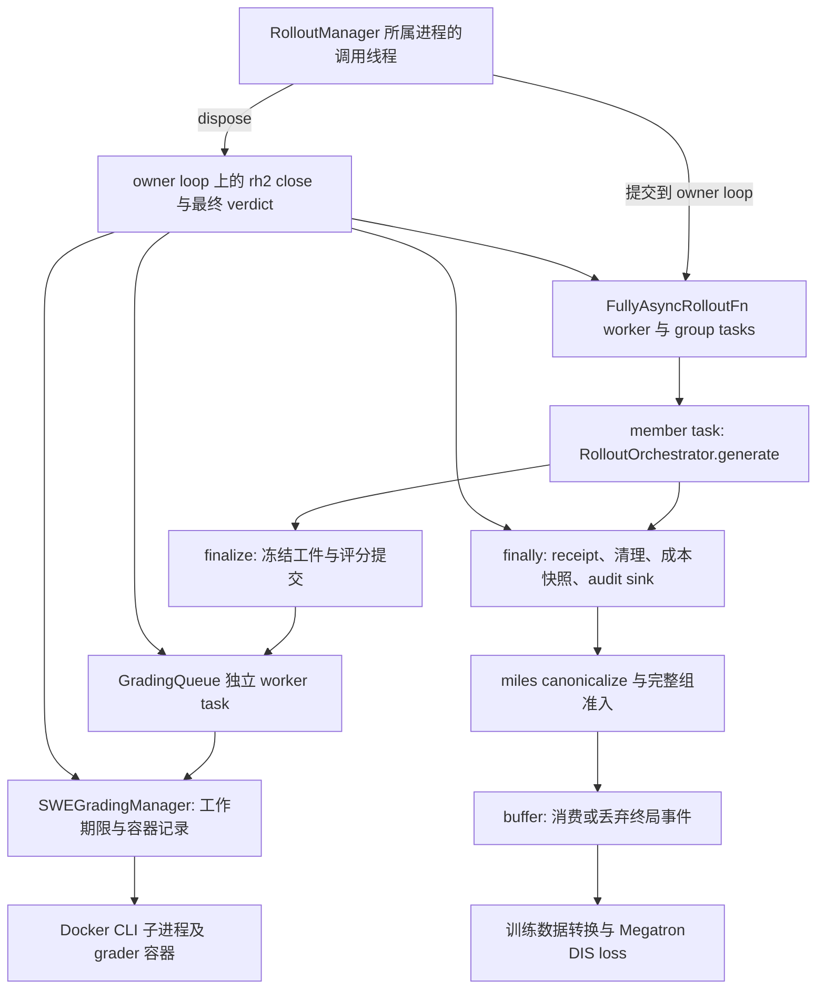

# 第 2 组剩余 N1–N4：实施集成审查

日期：2026-09-10。审查者：Codex。结论：**本轮审查完成；实现暂不收口。3 项 P1 需要修复，4 项 P2 登记后续。没有发现需要重新交给 owner 决定的训练语义。**

审查基线：根仓库 `92d165aa` → `06dd7c06`；涵盖 N1 `2fbe423e`、N2a `9c08d558`、N2b `93f854e6`、N3 `c77e8d05` / `afaed0a7`、N4 `421e0709` / `04d7a36f`。fork 当前 `4c04f997b`，树 `79e8ef65`。依据为 [Brief v2.1](../README.md)、[计划审查](../review_20260909/README.md) 与既有第 2 组决策；本次没有修改生产代码、维护测试、训练配置或 Git 提交。

## 1. 结论与修复顺序

| 编号 | 级别 | 切片 | 当前问题 | 本轮处置建议 |
|---|---|---|---|---|
| R1 | P1 | N2a/N2b | 创建请求已发出，但第二次失败或期限取消会跳过容器登记与收口 | 容器所有权与“是否重试”分开处理 |
| R2 | P1 | N2a | 正式评分的若干等待没有消费共同期限，到期后甚至继续等待可选观测 | 补齐工作期限，保留独立清理预算 |
| R3 | P1 | N3 | 必要执行审计根本没写，也可能解消等待失败、成功退出 | 必须有记录完成的正向事实；缺失则维持旧非零结果 |
| R4 | P2 | N2b | run-fatal 后、queue 排空期间仍可追加评分 | 重试前读取实际停止状态 |
| R5 | P2 | N1 | 未指定 `--run-id` 时会跨 run 错连同名组 | 连接键包含 run 身份 |
| R6 | P2 | N1 | 根因只有计数，缺少按根因与 task 的成本分布；缺失成员口径也不完整 | 补离线汇总，不建新平台 |
| R7 | P2 | N4 | 每个 microbatch 新增 11 次设备标量读取 | 直接返回设备上的计数张量 |

建议 Claude 将 **R1/R2 作为同一个评分工作范围的窄修复**，再独立处理 R3。R1 的所有权遗漏会影响 R2 到期取消后的清理，不能只给遗漏的 await 套 timeout。R3 只约束本次新增的成功改判，不要求修完旧的二次取消 backlog。P2 可以另作小提交，不阻塞主线进入下一切片；修复前三项后只进行针对性复核。

## 2. R1 / P1：不能把容器清理放在“允许再试一次”的分支内

**位置：** `rh2/src/repoharness2/grading/manager.py:1485–1502、1578–1591`；外层清理为 `1387–1395`，GC 从 `1405` 遍历既有记录。

**当前行为与原因：** `_start_container()` 等 `docker run` 成功返回后才把名字放进 `_records`。第一次可重试错误会在 `_ready_image_and_start_container()` 中补登记；但第二次错误先走 `first_failure is not None` 的 raise，根本到不了补登记。创建期间期限耗尽，则 `_await_within_grading_deadline()` 抛出的错误不带创建名字/操作事实，也绕过该分支。此时 `grade()` 的局部 `record` 仍是 None，finally 不收口，后续 GC 也看不到这个名字。

**具体例子：** Docker 已接收按名创建的请求，CLI 在收返回值时断连。第一次错误会按名清理并重试；第二次同样断连时，评分返回 `failed_to_grade`，manager 关闭报告却是 `containers_open=[]`，第二个容器对象可能仍存在。不是“没有收到成功，所以一定没有创建”。另一个反例是在第一次 `docker run` 等待期间到达评分期限：一条容器记录都没有。

**证据与可达性：** [评分探针](n2_production_probe.py) 的 `two_run_reply_losses`、`run_deadline_reply_loss`，结果见 [JSON](n2_production_probe_result.json)。真实 `GradingQueue → SWEGradingManager`，`workspace=None`、冻结 delta、正式 grader profile、正式 digest 分支；只替换 Docker I/O。两个独立角色交叉复跑，主审查者也重跑确认。判定为 `production_reachable`，发生频率未知。探针注入的是“请求可能已创建对象、回包丢失”；**没有证明候选测试仍在运行**。

**影响、分期与代价：** 当前 run 会漏账并延迟回收，重复发生可积累容器资源；新增 N3 又会信任这个空列表。首训脚本的 run-label 清扫可以在作业结束时兜底，但不能替代当前评分的及时收口。属于本轮 P1，不是 P0。复用现有 record、scope 收口与 fatal 通道即可，不需要新的资源平台。

**推荐与验收：** 在可能创建资源的 await 之前确定并交付清理所有权；无论是否还有重试机会，都收口该次已发出创建请求的名字。第二次失败、首次/第二次创建到期、外层取消都不能绕过；不存在或确认停止走既有规则，仍运行/无法确认保持既有 `GradingScopeTerminationError`。探针应看到两个名字都被处理；队列结束时资源已收口，或者明确报告 fatal 且仍可继续清理。不要仅把“临时记录”复制到几个 except 分支中。

## 3. R2 / P1：共同评分期限尚未覆盖完整工作路径

**位置：** `manager.py:1610–1620`（profile 初始化/探针）、`1806/1811`（实际镜像 digest 查询）、`2347–2358`（峰值内存查询）；特别是 `1362–1367` 的到期异常处理。提交方兜底在 `generate.py:5252–5269`。

**当前行为与原因：** 期限被放进 ContextVar 并传到了若干 Docker 操作，但以上操作仍直接 await，或者只用自身完整的分段 timeout。最直接的反例是：准备阶段已经抛出 `grading_deadline_exhausted`，except 为了填内存观测又调用 `_read_peak_memory_mb()`；这个查询不返回，后面的容器清理便不开始。

**证据与可达性：** [评分探针](n2_production_probe.py) 的 `digest_inspect_hang`、`profile_init_hang`、`peak_read_after_deadline`。工作预算 0.1 秒，在阻塞点进入后等 0.25 秒，真实 queue worker 仍占槽，清理尚未开始；最后由探针显式关 queue 回收。正式 profile 与 digest 路径均在场，不是只在 legacy workspace 路径构造的例子。两个角色与主审查者复跑一致，`production_reachable`。

**准确影响：** 越过共享工作期限、延迟资源释放，并可能让原本应返回局部 `failed_to_grade` 的到期变成提交方兜底触发的 run-fatal。profile 自带分段 timeout；编排外层还有“工作期限 + 清理预算 + 60 秒”的最终等待，**因此不描述为整个作业永久无人监管**。提交者取消不立即取消 worker 是既有分工，本轮没有单独将它列错；要求的是 worker 在共同期限内停止工作并进入清理。

**推荐、分期与验收：** 本轮补齐实际工作范围，保证每个正式工作等待受 `min(剩余工作时间, 原分段上限)` 约束。期限耗尽后跳过可选内存查询，或者让它在有剩余时间时才执行；不能让观测阻挡清理。清理继续用独立预算，不能因工作时间为零而跳过。超时归因仍是工作期限，不能被 profile 的异常包装改成配置错误。三个阻塞探针都应无需释放测试 barrier 就开始收口，正常对照保持原结果。与 R1 一起验证 prelaunch 被取消时已创建容器仍归现有 owner 清理。

## 4. R3 / P1：没有“写失败”不等于“已经写完”

**位置：** `bringup.py:2302–2335` 的 `_execution_closure_facts()`；来源为 `generate.py:4402、4488–4515、5654–5659`，task 清除在 `shutdown/chain.py:229–236`。

**当前行为与原因：** 新 `execution_closure.complete` 只检查 `finalization_receipt_write_failed` 与 `audit_sink_failed_secondary` 不存在，没有确认必要 audit sink 曾成功返回。真实清理顺序是“容器移除 → `lease_released=True` → await 私网清理 → 写执行审计”。如果第二次取消在私网清理的 await 上到达，成员 task 结束，audit sink 根本不执行，也就没有“写失败”记录。后续关停步骤又能扫净网络，于是其余条件全绿。

**具体例子与证据：** [双 loop 探针](n3_final_closure_probe.py) 使用真实 miles worker、buffer、原 `generate_and_rm_group()` 函数、formal 编排 finally、BringupService 与最终 verdict；没有用吞取消的 stubborn task。首次取消等待为 0.2 秒、RH2 grace 为 0.05 秒：

| 条件 | 审计文件 | receipt | 资源收净 | 当前 verdict |
|---|---|---|---|---|
| 网络清理等待 0.22 秒，在 grace 内完成 | 已写 | 1 | 是 | `ok=true`，合理 |
| 网络清理等待 0.8 秒，被真实第二次取消打断 | **未写** | 1 | 是 | **仍 `ok=true`**，不合理 |

[结果](n3_final_closure_probe_result.json) 中反例同时有 `record_write_failures=0`、`execution_closure.complete=true`、`wait_resolved=true`、`execution_audit_file_exists=false`。Production Tracer 还补上了 service 的真实 owner-loop 绑定后交叉复跑，结论不变；落盘探针保留这一绑定。主审查者独立重跑确认。

**可达性、影响与分期：** `production_reachable`；缩时仅加快已有两次取消的交错。默认时序也有同型窗口，例如容器删除耗 40 秒，之后网络操作耗 55 秒，在 miles 的 60 秒等待加 RH2 的 30 秒 grace 后被第二次取消。频率未知。它违反的是本次新增的“执行、资源、必要记录完成才改判成功”，未证明发生训练污染或资源仍运行。N3 启用前应修，属于 P1。

**最小推荐与验收：** 在既有 audit 内记录必要 sink 成功返回的事实；receipt 复用已有持久化成功事实。没有这些事实就不解消原等待失败，仍保留诊断并非零退出。**N1 的可选成本事件不因此变成必要证据。** 反例改为 `ok=false` / 未解消，对照仍成功；晚到异常、资源残留与原 fatal 的既有否定例继续成立。可以只缩小成功分支，不必重写旧取消机制、不新增 owner 或状态机；代价是证据未完成的作业仍沿用原非零退出，不改变进入 loss 的样本。

## 5. 四项 P2：登记后续，不扩大本轮阻塞范围

### R4：run-fatal 后仍可能追加评分

`manager.py:1492` 只读取 `_closed`。实际 `bringup.py:1967–1981` 先排空 queue，再关闭 manager；排空期间 `_closed` 和 queue `_closing` 都可能仍为 False。探针 `fatal_while_pull` 通过真实 `dispatch_run_fatal()` 进入这一窗口：`fatal_seen=1`、`accepting=false`、`grading_open=false` 时，仍进行第二次 pull 并创建 grader。

这不符合已批的“停止后不启动追加尝试”，但原 fatal 没被吞，最终仍非零，所以只列 P2。后续在追加前读取实际 lifecycle 停止事实，并在旧容器收口后再次判断。**不能通过提前关闭 queue 排空来修，否则会重开已关闭的 F1。** 验收是停机对照不启动第二次，普通暂态错误仍至多追加一次。

### R5：多 run 输入会错连同名组

`drop_events.py:292–355` 按裸 `rh2_prompt_group_id` 连接，只有显式传 `run_id` 时才过滤；命令行允许输入多个目录且 `--run-id` 可省略。真实组身份在 `adapters/miles/identity.py:160` 是 `miles_g{group_index}`，跨 run 不唯一。

[观测探针](observation_probe.py) 的两个 run 都有 `miles_g0`：A 消费组耗时 10 秒，B 丢弃组耗时 100 秒。默认汇总把两组各记成 **110 秒**，合计 220 秒；分别过滤 run 后则正确为 10/100 秒。这是当前离线 CLI 可达问题，不影响训练执行。后续让组与 attempt 的连接键都含 run 身份，保留未匹配计数；同一 probe 应得到正确的互不混合分布。修复前每次显式指定 `--run-id` 可规避。

### R6：汇总还不能完成已承诺的分布诊断

`drop_events.py:312–359` 把所有 `put_aborted` 放进 `aborted_member` 桶，真实原因仅输出 `root_cause_reasons` 次数；没有把成本关联到具体原因，也没有新成本结果的 `by_task`。因此“拉镜像失败 10 秒”和“hard wall 900 秒”只留下一个混合耗时分布、两个原因各一次，无法回答“哪种故障主要丢长轨迹”。原来的组事件汇总有 `by_task`，但它没有新成本，不能替代该交叉维度。Brief §2.2 与计划审查 R3 已要求保留这些维度。[观测结果](observation_probe_result.json) 的 `different_reasons_and_tasks` 重现此输出。

缺失口径也需在同一次汇总修正里明确：8 个成员只有 7 份快照时，当前 `groups_with_unknown_members` 仍为零；只有一份 elapsed=null 的快照时，组成本分布输出数值零并同时记 unknown=1。已知成员耗时之和本来就是下界，算出部分和没有错，但不能让未知或不完整的组看起来是完整成本。新生产快照通常有 elapsed；全未知例主要约束旧格式/缺失输入，不据此升级严重度。

后续补按任务、具体原因或原因集合的成本分布，保留消费组对照与已有分段事实。多原因组不得重复累加后称为无重叠总量；缺失成员和全未知值显式标明，必要时把已知部分和单独命名。只改离线汇总与口径，不新增训练门槛。验收加入“不同 task / 不同原因 / 明显不同长度”及 7/8 快照例即可。

### R7：纯观测仍新增每 microbatch 11 次设备标量读取

`faithful_dis_loss.py:862–863` 的 `_count()` 每次执行 `flags.sum().item()`，再在 device 上新建标量张量；6 项计数加 5 个桶总共调用 11 次。[观测探针](observation_probe.py) 调用真实指标函数、CSR 对象与 CP 切分，在 CPU 上记录到 11 次调用者均为 `_count` 的 `.item()`。GPU 上这种主机读取需要等待设备上的归约结果，和“不做同步”的注释不符；**本机没有量过它增加多少毫秒或降低多少吞吐**。

推荐直接返回设备上的浮点计数，例如 `flags.sum(dtype=torch.float32)`，交给既有 metrics 汇合与 `aggregate_train_losses()` 统一读取。已有函数在 `miles/backends/training_utils/log_utils.py:466–492` 汇合后统一 `tolist()`，无需每个指标先往返一次。修复后现有手算、CP 分片、loss 与梯度对拍保持不变，观测辅助函数不再为计数读取主机标量。无需为此添加 actor forward、分布式服务或专门 GPU 实验。

顺便澄清口径：本函数返回本 rank 的线性计数；当前 trainer 最终还会按 `num_rollouts` 除，日志是每 execution 的均值。文档不宜将最终日志数值直接称为整 step 的原始 token 总数。候选信号不等于实际梯度的命名是正确的。

## 6. 已验证的部分与审查覆盖

| 范围 | 本轮证据与结论 |
|---|---|
| N1 快照生产 | 阅读 finally 的真实发射位置与唯一 capture 输出计数；已有真实 formal 用例覆盖发射失败、随后 audit sink 失败、4 个输出 token 与 response_length=104 的区别；未把快照认作终态，也未改变交付 |
| N2 评分语义 | 同一冻结工件、同一队列槽位、总计最多两次；只在早期 pull/start 分类，候选测试不在重试范围；正常评分控制例输出 resolved 并清空容器 |
| N2 否定例 | 队列到期检查、镜像锁期限、首次 unknown 收口的 fatal 通道已有覆盖；未发现当前正式输入下能够证实的“确定配置错误被重试”反例，不因字符串看起来宽泛就另造 finding |
| N3 成功/失败合成 | 真双 loop 探针与既有测试覆盖晚到异常、driver/worker 首因、未释放 lease、证据失败等；主要遗漏是 R3 的“从未执行必要写入”，而非已有写失败用例没判断 |
| N4 算术与 CP | 手算支持集、候选/单例/零优势接受、两侧拒绝计数正确；CP=2 分片汇合与 CP=1 逐位梯度及全部新增线性计数对拍通过，未发现 loss/分母/skip/fuse 语义被改变 |
| fork/依赖 | 0017 仅两处 shutdown 文件；当前树干净，patch/manifest/pin 前置校验通过；lane A 清理残留 `RH2_MILES_PATH` 的修正正确；vendored slime 无本轮改动 |

A–N 适用性扫描：A 并发/失败由 R1–R3；B 训练分布核对同工件早期重试与既有 loss/组语义，未发现新增 reward 取优；C 无新临时挡板；D/H 所有权与单一事实源由 R1/R3/R4/R5；E 用真实控制流反例补足测试缺口；F 对照已批合同、无新增 T0；G 正式 profile、冻结工件与双 loop 生产路径均有探针；I 按下述停止条件收敛；J/K 优先修现有 owner/谓词/归约，不建新机制；L 期限与热路径由 R2/R7；M 成本与完成事实由 R3/R5/R6；N 核对 fork 补丁与两种依赖树。外部论文结论、数据选择与 GPU 能力结果不属于本批变更，本轮没有重新精读或作相应结论。

作者的几项偏离可以接受：默认评分时间和最终复查时间仍是运行参数；容器完成证据复用 lease 记账可行，前提是 R1 不能漏掉应登记对象；改 0.2/0.3 秒双 loop 用例本身合理。`regrade_attempts` 不进 audit 可以作为实现选择，但“给内部 audit 增一键必定违反公共 schema”不是必须再请 owner 批准的理由，前一版计划已允许该记录。另有一个小口径：manager 仅保留最近 256 条 `regrade_events`，`close()` 却把列表长度注释成“本 run 追加次数”（`manager.py:1045/1509`）；应称保留条数或另用累积整数，不把截断列表长度当总量。

### 6.1 本批调用链与状态所有权



同一 owner loop 上，评分 worker 与提交方是不同 task，所以只取消提交方不会替代 worker 自身的期限。容器名字由 manager 掌握，Docker CLI 被取消也不能当作远端对象不存在的证据。adapter 自己的线程/loop 与 model proxy 仍沿预算闭环的既有所有权，本批没有修改该边界。N3 最终 verdict 在 owner loop 读 task 完成事实，并依赖 rh2 提供必要记录/资源完成事实；R3 表明后者的记录证据不充分。

### 6.2 跨切片不变量、故障覆盖与账目重建

| 跨切片合同 | 证据与当前判定 |
|---|---|
| N2a 到期取消 → N2b 创建对象 → D-2 收口 | R1/R2 失败：工作期限必须和所有权一起闭合 |
| N2b 重试 → N3 grader 无残留 | R1 失败：第二次创建失败不在清理记录中，空列表不足以证明无对象 |
| 编排 finally → N3 必要记录完成 | R3 失败：task 完成与 lease 释放不证明 audit 已写 |
| N1 快照 → buffer 终局 → 成本汇总 | 快照/终局分工正确；R5/R6 的离线连接与维度仍需补齐 |
| N4 观测 → CP/DP 汇合 → 原 loss | 计数与梯度对拍通过；R7 是执行开销问题 |

故障注入覆盖：worker/driver 异常和晚到异常见 `test_w5a_miles_dispose_chain.py` 的真实双 loop 用例；取消/超时/重试见本目录两个生命周期探针；必要 sink 写失败见现有 shutdown 用例，**sink 未执行**见 R3；queue full 与排空见 `test_queue_full_emits_backpressure_event`、`test_close_with_drain_keeps_consuming_the_backlog`；冷恢复见 `test_w5b_cold_recovery.py::test_full_cold_recovery_continues_version_from_saved_point` 及状态文件 roundtrip。上述维护测试包含在本轮通过的非 Docker 全量中；冷恢复是本机替身级验证，不声称重启了 GPU 作业。

本轮可重建的守恒事实：N2 正常对照创建 1 / 移除 1 / 剩余 0；第二次回包丢失为创建请求 2 / 移除 1 / 模拟对象剩余 1，但关停记录剩余 0；启动到期为创建请求 1 / 移除 0 / 模拟对象剩余 1 / manager 记录 0。N3 两案各进入 1 个执行、各写 1 份 receipt、task 均结束，审计成功数分别为 1 与 0，当前 verdict 却均成功。N1 10+100 秒的两 run 输入在默认连接后变成 110+110 秒。没有把这几组小探针外推为真实训练的损耗比例。

本批挡板/定案状态：没有新增临时挡板；600 秒 episode / 25 次请求 / 停止合同 A、turn KEEP 与 hard wall DROP、完整组规则、FIFO 与 staleness、DIS loss / skip / 8 步熔断保持既有实现。新评分工作期限默认 3600 秒仍未完整生效（R2）；最多两次的上限有效，停止后不追加尚有 R4；新退出成功分支的证据条件待 R3。未解决实现项的 owner 为 Claude；R1–R3 的收口检查在本报告 §8，P2 属后续修正，不另建 gate。

审查方法复盘：通过数量未覆盖“第二次创建失败”“已到期后的可选 I/O”“必要 sink 从未执行”这三个接缝。已有否定测试多检查显式 failure record，N3 新用例又用手造 lease 事实，未覆盖真实 finally 的取消顺序；这正是 A/D/E/G/M 维度需要完整控制流探针的原因。N1 只测试显式 run 过滤，未测试默认多 run 输入；N4 测到了数值，却没有检查设备同步开销。修复时保留这些具体反例即可，无需扩大为海量排列组合测试。

## 7. 独立验证与证据清单

主审查者本轮新跑结果（不是复述 Claude 的 2230）：

- 集成树非 Docker 标记全量：**2190 passed，40 deselected，117.45 秒**。
- 默认 pin 的 `tests/adapters_miles/`：**401 passed，315 skipped，38.12 秒**。
- `ruff check src tests`：通过。
- `miles_integration_lanes.sh --checks-only`：通过。本轮没有把这称为完整双 lane 脚本执行；集成树测试包含在上述全量中。
- 三个独立探针：N2 七案、N3 两案、N1/N4 观测例均完成。本目录脚本及 JSON 是可复跑证据；出现错误结果是复现 finding，不表示实现通过验收。

完整命令、HEAD 和范围见 [verification.json](verification.json)。没有调用真实 Docker daemon、SWE 镜像、Claude Code、模型 API 或 GPU；CPU 替身探针证明控制流与交错，不给出故障频率或吞吐损失数字。

从仓库的 `rh2` 目录复跑（探针导入当前维护夹具，修复后需按新预期更新断言）：

```bash
uv run --no-sync python ../docs/agentic_RL/repo_harness_rh2_workstreams/project1_execution/failures_remainder_impl_20260909/combined_review_20260910/n2_production_probe.py
uv run --no-sync python ../docs/agentic_RL/repo_harness_rh2_workstreams/project1_execution/failures_remainder_impl_20260909/combined_review_20260910/n3_final_closure_probe.py
uv run --no-sync python ../docs/agentic_RL/repo_harness_rh2_workstreams/project1_execution/failures_remainder_impl_20260909/combined_review_20260910/observation_probe.py
```

Production Tracer 独立检查 N2，Falsifier 独立检查 N3，再交换反例证伪；主审查者重跑、读源码并去重后保留以上结论。双方都主动收窄了严重度：R1 不声称候选测试仍运行；R2 不声称没有外层监督；R3 不声称训练污染；R4 不升级为 P1。主审查者另行检查 N1/N4 纯函数、生产接线与性能开销。

## 8. 下一步与停止条件

Claude 可直接按现有定案修 R1/R2/R3，不必再次询问 turn/hard wall、完整组、reward、零梯度或路由来源。保留未改变的第三组语义。响应每项时按协议说明接受、反证、递延或保留风险；本批不新增审批文件或训练闸门。

**收口条件：** R1 每个可能创建的容器名字均能收口或明确 fatal；R2 到期停止全部工作且独立清理开始；R3 没有必要记录完成证据时不成功改判；各自正向对照与已有核心测试保持通过。达到这三条即可结束该批针对性复核，P2 登记后续。不因还能构造新的低优先级反例而继续扩大 shutdown/评分重构。
