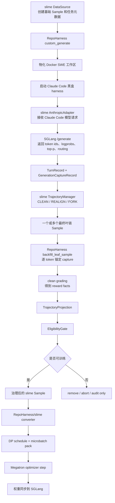
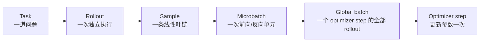

# RepoHarness rh2 当前训练链路、轨迹保真与批调度基础教程

更新时间：2026-07-11。

本文用于系统整理以下几类容易互相混淆的问题：

1. RepoHarness rh2 当前做到哪里，S0、S1、P1、P3 分别证明了什么。
2. 长期设计中的 verifiers v1 基座，与 S1/P3 实际跑通的 slime 在线训练链路是什么关系。
3. Claude Code 黑盒 harness 的每轮模型调用如何变成 token-faithful 训练轨迹。
4. slime 的 `CLEAN`、`REALIGN`、`FORK` 分别在解决什么问题。
5. 为什么在线强化学习可以训练，而当前离线 SFT 导出器会因 `token_reconstruction_mismatch` 拒绝真实 thinking 模型轨迹。
6. 一个 rollout 为什么可能产生多个 Sample，消息树、叶链和 fan-out 分别是什么。
7. Task、rollout、Sample、microbatch、global batch、optimizer step 分别是什么。
8. TP、PP、CP、DP、VPP、`mb_group`、梯度累计和 `align_to` 的基础知识。
9. P3 中 `19 < 32`、`23 mbs; need 24` 和 `gbs20` 成功分别意味着什么。
10. 下一步为什么必须实现 batch admission preflight/repair，以及它应当如何工作。

本文是教学文档，不替代机器可校验的阶段账本。项目实时状态仍以
`docs/agentic_RL/repo_harness_rh2_workstreams/00-project-status.md`、各阶段 acceptance summary、
最新执行计划和 `git log` 为准。

---

## 1. 阅读路线

如果只想快速恢复上下文，按以下顺序阅读：

1. 第 2 节：项目目前处于什么位置。
2. 第 4 节：当前真实在线训练链路全图。
3. 第 6、7 节：`REALIGN` 和真实任务例子。
4. 第 8 节：为什么在线强化学习能训练，离线导出暂时不能。
5. 第 10～15 节：batch 和并行训练基础，以及 P3 失败原因。
6. 第 16、17 节：下一步系统设计和实施顺序。

如果第一次学习这些概念，建议从头阅读，不要直接从 P3 错误日志开始。

---

## 2. 项目定位与当前状态

### 2.1 RepoHarness rh2 的定位

RepoHarness rh2 不是新的大模型训练内核，也不是重新实现 vLLM、SGLang、slime 或 verl。
当前定位是：

```text
RepoHarness rh2 =
    verifiers v1 风格的环境组合与轨迹抽象基座
  + SWE 环境生产和质量门槛
  + 安全 Runtime、评分隔离、反作弊、权限治理
  + token / artifact / reward / eligibility 的训练治理
  + slime、verl、离线导出等训练后端 adapter
```

它重点解决训练框架通常不负责的问题：

- 任务环境能否可信地复现。
- hidden verifier 是否与 agent 隔离。
- 评分是否在 clean checkout 中进行。
- agent 是否能通过 git 历史、网络或测试篡改作弊。
- 哪些 token 真的是当时策略采样出来的。
- 哪些 token 能进入 loss。
- reward 是任务失败还是基础设施失败。
- 一条轨迹是否有资格进入在线强化学习、离线 SFT 或只能用于审计。
- fan-out、治理过滤和异步训练后，batch 是否仍满足训练后端约束。

旧的 `src/repo_harness/` 是“自研白盒 harness + verl 桥接”的 legacy 实现，已经冻结。
当前主实现位于 `rh2/src/repoharness2/`。

### 2.2 当前已经完成的阶段

截至本文日期：

| 阶段 | 状态 | 核心结论 |
| --- | --- | --- |
| S0 可行性验证 | 已完成 | verifiers pin、renderer、协议和 MoE 张量链路方向可行 |
| S1 最小闭环 | 已完成，项目账本仍保留检查点确认注记 | task、环境、黑盒 harness、capture、clean grading、projection、eligibility、slime debug training step 已闭环 |
| P1 数据冻结 | 已完成 | 正式首训数据候选完成 revision pin、hints 剥离和静态门筛选 |
| P3 八卡预实验 | 已完成 | 30B MoE 训练内核、routing/top-p replay、权重同步、T3 分离放置和 fully async 可启动性均已验证 |
| S2 SWE-Safety 加固 | 尚未开工 | 需要补安全 Runtime、反作弊、数据四门、离线导出器重建和 batch admission |

当前闸门含义：

```text
rh2_s0_complete             = true
rh2_s1_closed_loop          = true，账本保留 checkpoint-2 confirmation 注记
rh2_s2_signal_trusted       = false
rh2_formal_training_allowed = false
```

因此，项目已经证明“链路能够跑通”，但还没有进入正式训练。

### 2.3 两个最重要的剩余技术问题

第一项是 S1 留下的离线导出问题：

```text
token_reconstruction_mismatch
```

它阻塞 thinking 模型轨迹的 token-faithful SFT / warm-start 导出，不阻塞当前 slime 在线强化学习主链。

第二项是 P3 发现的 batch schedule 准入问题：

```text
治理过滤和 fan-out 后，训练后端实际看到的 rollout/Sample/microbatch 形状
可能不满足 global_batch_size 和 dp_size × mb_group 约束。
```

它是正式在线训练的直接前置阻塞，比离线导出器更应优先处理。

---

## 3. 三种“基座/链路”不要混为一谈

### 3.1 verifiers v1 是长期架构基座和权威参考

长期目标采用 verifiers v1 的核心思想：

- Taskset 定义模型尝试什么。
- Harness 定义模型或 agent 如何尝试。
- Runtime 定义执行发生在哪里。
- Environment 把 Taskset、Harness、Runtime 和评分组合起来。
- Trace 用消息图和 branch 表达线性、多轮、compaction、subagent 和 token drift。
- interception 捕获模型边界。
- EnvServer/EnvClient 形成训练框架无关的服务边界。

但 S1/P3 当前实测主链并不是“verifiers EnvServer 直接连接 slime trainer”。

### 3.2 S1/P3 实际跑通的是 slime 形态 B

实际链路是：

```text
slime RolloutManager
  -> 调用 RepoHarness custom_generate
  -> RepoHarness 物化 SWE 环境并启动 Claude Code
  -> Claude Code 通过 slime AnthropicAdapter 调用 SGLang
  -> slime TrajectoryManager 形成最终 Sample
  -> RepoHarness 做 capture 锚定、评分、投影和资格治理
  -> 合格 Sample 返回 slime
  -> slime 转成 Megatron train_data
  -> optimizer step
```

这是当前已经由真实 GPU 实验验证的第一训练后端路径。

### 3.3 离线导出是 RepoHarness 自己的另一条消费路径

RepoHarness 的离线导出器位于：

```text
rh2/src/repoharness2/adapters/offline_export/exporter.py
```

它不是 slime 的在线训练必经路径，也不是 verifiers 自带导出器。

它的用途是：

- 将治理通过的轨迹导出为 warm-start / SFT 候选数据。
- 为直接强化学习效果不佳时提供行为回锚预案。
- 产出可审计、token-faithful 的离线训练记录。

因此，“当前离线导出器失败”不能等价理解成“当前在线强化学习无法训练”。

---

## 4. 当前在线强化学习主链全图

### 4.1 总体流程



### 4.2 第一步：slime 创建任务级基础 Sample

slime 的 DataSource 从 prompt data 读取：

- 任务 prompt。
- task metadata。
- group/index 信息。
- `n_samples_per_prompt` 指定的独立采样数量。

这里的基础 Sample 还不是最终训练样本，它只是一次 rollout 的任务载体。

### 4.3 第二步：slime 调用 RepoHarness `custom_generate`

入口位于：

```text
rh2/src/repoharness2/adapters/slime/generate.py::SlimeRepoHarnessAdapter.generate
```

约在 `generate.py:1169`。

RepoHarness 在这里接管一次完整 SWE rollout：

1. 读取 task metadata。
2. 物化干净工作区。
3. 启动容器和 Claude Code harness。
4. 建立 capture hook。
5. 等待 agent 完成修改。
6. 收集最终 patch 和模型调用记录。

### 4.4 第三步：Claude Code 调用模型

Claude Code 是外部黑盒 harness。它并不知道自己正在接受强化学习训练，只知道自己在调用 Anthropic 风格模型 API。

slime 的 `AnthropicAdapter` 接收这些请求，将消息渲染成模型 token，并调用 SGLang：

```text
reference/slime/slime/agent/adapters/anthropic.py
reference/slime/slime/agent/adapters/common.py
```

每一次模型请求会产生两类记录：

1. slime `TurnRecord`：供 `TrajectoryManager` 构建最终训练 Sample。
2. RepoHarness `GenerationCaptureRecord`：作为 token、logprob、top-p tape、routing tape 和权重版本的审计凭据。

### 4.5 第四步：slime 形成最终叶链 Sample

一次 Claude Code session 可能有很多轮模型调用：

```text
t0：初始问题 -> 模型输出分析和工具调用
t1：工具结果加入上下文 -> 模型继续输出
t2：新的工具结果 -> 模型继续输出
...
```

slime 的 `TrajectoryManager` 不只是简单拼接这些轮次。它会比较下一轮真实 prompt token 与当前已构建 token，执行：

- `CLEAN`
- `REALIGN`
- `FORK`

最终返回一个或多个叶链 `Sample`，每个 Sample 至少包含：

```text
tokens
loss_mask
rollout_log_probs
rollout_id/index
status
```

### 4.6 第五步：RepoHarness 对最终叶链做 token 锚定

RepoHarness 不重新发明 slime 的最终叶链，而是检查：

> slime 声称可以训练的每一个 `loss_mask=1` token 区间，能否在真实模型调用 capture 中找到逐 token 相同的采样凭据。

相关代码：

```text
rh2/src/repoharness2/adapters/slime/generate.py::_match_turns_to_runs
rh2/src/repoharness2/adapters/slime/generate.py::backfill_leaf_sample
```

约在 `generate.py:562` 和 `generate.py:636`。

成功匹配后，RepoHarness 只使用真正支撑入训区间的轮次：

- 回填这些轮次的 rollout logprobs。
- 合并这些轮次的 top-p tape。
- 对齐这些轮次的 routing tape。
- 记录这些轮次对应的权重版本。
- 将 capture refs 缩减为实际入训轮次。

### 4.7 第六步：clean grading 和 reward

在线强化学习也必须评分，否则没有 reward。

RepoHarness 在独立、干净的评分环境中应用 agent patch，再运行公开/隐藏测试和安全检查，产生：

```text
GradingReport
RewardFacts
```

关键原则：

- agent 执行环境不能直接看到 hidden verifier。
- 评分环境必须从干净基线应用 patch，不能直接复用被 agent 污染的工作区。
- 基础设施错误必须表示为 `reward=None`，不能伪装成任务失败的 `reward=0`。
- RepoHarness 记录原始 reward facts；GRPO advantage 和归一化由训练后端负责。

### 4.8 第七步：中立投影和资格治理

RepoHarness 将 Sample、capture 和评分事实投影为：

```text
TrajectoryProjection
EligibilityReport
GroupRepairSignal
```

统一 finalize 入口位于：

```text
rh2/src/repoharness2/governance/wrapper.py::finalize_rollout
```

资格门检查：

- token provenance 是否完整。
- logprob 是否逐 token 对齐。
- top-p/routing tape 是否满足当前训练配置。
- reward 是否可信。
- 安全扫描是否通过。
- artifact 是否只暴露允许字段。
- 是否发生基础设施故障。

### 4.9 第八步：返回 slime trainer

合格轨迹不会被转换成另一个完全独立的训练载体，而是：

```text
原始 slime Sample
+ RepoHarness 治理后的 reward
+ 必要的中立投影引用
+ capture/tape 对齐结果
```

再由 converter 转成 slime/Megatron 的 `train_data`。

因此当前结构可以记成：

```text
训练数据载体：治理后的 slime Sample
治理事实权威：RepoHarness 持久化 sidecars
```

---

## 5. 在线强化学习、能力评测和离线 SFT 导出的区别

### 5.1 在线强化学习

```text
执行 agent
-> 捕获 token/logprob/tape
-> clean grading 得到 reward
-> eligibility gate
-> trainer 计算 advantage/loss
-> optimizer 更新策略
```

在线强化学习既需要轨迹，也需要评分。

### 5.2 主能力评测

```text
执行同一个 agent
-> 生成 patch
-> clean grading
-> 汇总 resolved、F2P、P2P 等指标
-> 不更新模型参数
```

评测和训练可以复用同一个 Environment 和 grader，但消费方式不同。

### 5.3 离线 SFT / warm-start 导出

```text
读取已完成且治理通过的轨迹
-> 形成 token-faithful TrainingExportRecord
-> 离线过滤
-> 交给 SFT/RFT 数据消费端
```

它不参与当前在线 rollout 的实时训练 step，因此导出器问题不等于在线训练问题。

---

## 6. `CLEAN`、`REALIGN` 和 `FORK`

### 6.1 为什么不能简单追加每轮输出

理想的多轮对话看起来是：

```text
P0 + R0 = 下一轮 prompt P1 的精确前缀
P1 + R1 = 下一轮 prompt P2 的精确前缀
```

但黑盒 harness 可能在下一轮请求中：

- 删除历史 thinking 块。
- 压缩早期上下文。
- 重新渲染工具消息。
- 改写 system/tool schema。
- 创建 subagent 分支。

因此：

```text
上一轮记录的 token
```

不一定逐 token 等于：

```text
下一轮请求实际发送给模型的 prompt token
```

如果仍强行拼接，会把模型没有看到的上下文或错位 token 放进训练。

### 6.2 `CLEAN`

如果当前已构建 token 是新 prompt 的精确前缀：

```text
current_tokens == new_prompt[:len(current_tokens)]
```

则：

1. 把新 prompt 多出来的工具/环境 token 追加为 `loss_mask=0`。
2. 把本轮新采样 response 追加为 `loss_mask=1`。

### 6.3 `REALIGN`

`REALIGN` 是 token 历史重新对齐，不是强化学习里的 policy alignment。

当差异发生在最近一次 response 区域，并且可以由下一轮真实 prompt 局部修复时，slime：

1. 用下一轮 prompt 中实际存在的 token 覆盖最近 response 区域。
2. 将覆盖后的区域改成 `loss_mask=0`。
3. 再追加本轮新 response，并设置 `loss_mask=1`。

相关代码：

```text
reference/slime/slime/agent/trajectory.py
```

漂移分类约在 `trajectory.py:169`，REALIGN 实现约在 `trajectory.py:216`。

这个策略是保守的：上一轮虽然确实由模型生成，但已经无法在最终连续叶链中保持精确 token 身份，因此不再训练这一轮。

### 6.4 `FORK`

如果差异无法通过最近 response 的局部覆盖修复，slime 不会强行拼成一条线，而是产生新 builder/branch。

最终消息图可能有多个 root-to-leaf 路径，每条路径可以形成一个训练 Sample。

### 6.5 REALIGN 是否会导致只能训练最后一轮

理论上，如果每轮都发生 REALIGN，前面每轮都可能被降为 `loss_mask=0`，最后只剩最后一轮可训练。

但这不是 S1 实测结果。真实 run8 例子中只有 t0 被降级，t1～t5 都保留为可训练 token。

---

## 7. 真实任务例子：`django__django-16139`

### 7.1 证据位置

轨迹 ID：

```text
4a25c5a4-f07f-422b-a6a4-acaab80af12f
```

本地证据目录：

```text
docs/agentic_RL/repo_harness_rh2_workstreams/s1/7a_artifacts/
  artifacts_run8/rollouts/4a25c5a4-f07f-422b-a6a4-/
```

其中包括：

```text
capture_records.json
trajectory_projection.json
grading_report.json
eligibility_report.json
group_repair_signal.json
tapes/*.bin
```

### 7.2 六次真实模型调用

```text
t0 prompt 18508 token，output 624 token
t1 prompt 19169 token，output 606 token
t2 prompt 19811 token，output 191 token
t3 prompt 20260 token，output 648 token
t4 prompt 25535 token，output 317 token
t5 prompt 25897 token，output 386 token
```

生成输出总量：

```text
624 + 606 + 191 + 648 + 317 + 386 = 2772 token
```

这里要区分三个计数：

```text
2772：六次模型调用真实采样输出的 token 总量
7775：最终 branch 在初始 prompt 之后的全部 token，包含工具/环境上下文和采样输出
2148：最终 loss_mask=1、真正进入策略损失的 token 总量
```

因此 `trajectory_projection.json` 中的 `response_token_count=7775` 不是“模型生成了
7775 个 token”，而是“相对初始 prompt，最终叶链后半段共有 7775 个 token”。其中大量
token 是工具结果、环境消息和 REALIGN 后的非训练上下文。

### 7.3 t0 到 t1 发生 REALIGN

t0 完成时，理论连续序列长度为：

```text
18508 + 624 = 19132
```

但 t1 的真实 prompt 长度是：

```text
19169
```

并且二者并非简单的 37 token 尾部增量。逐 token 比较显示，差异落在最近 response 区域。

slime 因此将 t0 对应的连续 response 区域替换为 t1 prompt 中实际存在的 661 token 上下文，并设置 `loss_mask=0`。

### 7.4 最终叶链

最终投影是：

```text
0～18508         初始 prompt，非训练上下文

18508～19169     661 token，mask=0，REALIGN 后工具/环境上下文
19169～19775     606 token，mask=1，对应 t1

19775～19811      36 token，mask=0
19811～20002     191 token，mask=1，对应 t2

20002～20260     258 token，mask=0
20260～20908     648 token，mask=1，对应 t3

20908～25535    4627 token，mask=0
25535～25852     317 token，mask=1，对应 t4

25852～25897      45 token，mask=0
25897～26283     386 token，mask=1，对应 t5
```

最终进入 loss 的 token 数：

```text
606 + 191 + 648 + 317 + 386 = 2148
```

占全部真实模型输出的比例约为：

```text
2148 / 2772 ≈ 77.5%
```

因此真实结果是：

```text
6 轮模型调用中，5 轮仍进入训练；只有 t0 被保守降级。
```

### 7.5 RepoHarness 如何匹配 capture

RepoHarness 扫描最终叶链中的第一个 `mask=1` 区间，长度是 606：

```text
检查 t0 output：624 token，长度和内容都不匹配 -> 跳过
检查 t1 output：606 token，逐 token 相同 -> 匹配
```

后续依次匹配：

```text
191 -> t2
648 -> t3
317 -> t4
386 -> t5
```

最终：

```text
used_turns = [t1, t2, t3, t4, t5]
```

所以 `trajectory_projection.json` 的 `capture_record_refs` 只有 t1～t5，没有 t0。

---

## 8. 为什么在线强化学习能训练，离线导出却失败

### 8.1 在线训练以 slime 最终叶链为权威

slime 已经交付：

```text
Sample.tokens
Sample.loss_mask
Sample.rollout_log_probs
```

RepoHarness 不需要从 t0～t5 的 prompt/output 重新拼出完整叶链，只需验证所有 `loss_mask=1` 区间都有真实 capture 支撑。

上一节已经证明：t1～t5 可以逐 token 锚定，所以在线训练合法。

### 8.2 当前离线导出器采用线性重建假设

S1 当前导出器位于：

```text
rh2/src/repoharness2/adapters/offline_export/exporter.py
```

其假设近似为：

```text
第一条 capture prompt
+ 后续每轮新增 prompt 尾部
+ 每轮 output
= 最终完整训练序列
```

并要求：

```text
branch 的第一轮 == capture_record_refs[0] 对应的轮次
```

真实 run8 叶链的初始 prompt 是 t0 的 18508 token，但治理后的 capture refs 从 t1 开始，而 t1 prompt 是 19169 token。

所以导出器无法通过线性追加重建同一个叶链，正确地 fail-closed：

```text
reason_code = token_reconstruction_mismatch
```

### 8.3 影响范围

受影响：

- thinking 模型真实多轮轨迹的 SFT 导出。
- warm-start 回退预案。
- 依赖 TrainingExportRecord 的离线过滤链。

不受影响：

- 当前 slime 在线强化学习。
- clean grading。
- resolved/F2P/P2P 能力评测。
- RepoHarness 中立投影和 eligibility gate。

### 8.4 S2 的正确修复方向

不要继续尝试从 capture 重建全序列。应该改成：

```text
叶链 Sample.tokens + loss_mask 是权威序列
capture records 只负责逐 token 锚定 mask=1 区间
mask=0 区间保留明确原因码，但不要求由生成 capture 重建
```

这与在线训练中已经验证通过的 `_match_turns_to_runs` 算法一致。

验收应覆盖：

- run8/run9 真实 Claude Code 轨迹。
- t0 被 REALIGN 降级的形态。
- fan-out 多叶形态。
- compaction/FORK 形态。
- 导出 token 与训练 rollout dump 逐位一致。

---

## 9. 一个 rollout 为什么可能产生多个 Sample

### 9.1 四个对象的区别

```text
Task：一道 SWE 问题
Rollout：针对该问题的一次独立 agent 执行/session
Sample：一条可以交给 trainer 的线性 token 叶链
Branch：消息图中的一条 root-to-leaf 路径
```

通常：

```text
一个 rollout -> 一个 Sample
```

但有 subagent、compaction 或无法局部修复的 token drift 时：

```text
一个 rollout -> 多个 branch -> 多个 Sample
```

### 9.2 消息树例子

```text
                           root
                             |
                         主 agent t0
                             |
                    +--------+--------+
                    |                 |
               subagent A        subagent B
                    |                 |
                 leaf A            leaf B
```

对应训练样本：

```text
Sample A = root -> 主 agent t0 -> subagent A -> leaf A
Sample B = root -> 主 agent t0 -> subagent B -> leaf B
```

它们来自同一次环境尝试，所以必须共享同一个 `rollout_id`，但有不同 `branch_id`。

如果错误地给两个分支不同 rollout_id，trainer 会把一次环境尝试误计成两次独立 rollout，破坏 reward 和 loss denominator 语义。

### 9.3 fan-out 对 batch 的影响

假设名义上生成 4 个 rollout：

```text
R0 -> 1 个 Sample
R1 -> 3 个 Sample
R2 -> 1 个 Sample
R3 -> 2 个 Sample
```

则：

```text
rollout 数 = 4
Sample 数  = 7
```

`global_batch_size` 在当前 slime 调度器里数的是唯一 rollout，而动态 microbatch pack 处理的是 Sample 行和 token 长度。这正是后续 batch 形状复杂的根源。

---

## 10. Batch 层级基础

### 10.1 从任务到参数更新



### 10.2 `n_samples_per_prompt`

例如：

```text
题 A 设置 n=4
```

意味着针对同一道题做四次独立 rollout：

```text
A0、A1、A2、A3
```

GRPO 使用同题多个 rollout 的 reward 形成组内相对优势。

### 10.3 `global_batch_size`

当前 slime `build_dp_schedule` 中，`global_batch_size` 表示：

> 一个 optimizer step 消费多少个唯一 rollout，而不是多少条 Sample。

如果有 32 个有效 rollout：

```text
gbs=32 -> 一个 optimizer step
gbs=16 -> 两个 optimizer step
```

改变 GBS 会影响：

- 每次梯度更新使用多少独立经验。
- 梯度估计方差。
- optimizer step 数量。
- 学习率调度进度。
- 尾部 rollout 是否被丢弃或缓冲。
- 是否可能切断完整 GRPO 题目组。

它不是为了让断言通过而随意调整的数字。

### 10.4 Microbatch

一个 global batch 通常太大，不能一次放入显存，因此拆成多个 microbatch：

```text
microbatch 0 -> forward/backward -> 累积梯度
microbatch 1 -> forward/backward -> 累积梯度
...
最后 optimizer.step()
```

在 agentic RL 中 Sample 长度差异很大，slime 可以按 token 上限动态打包，而不是固定每个 microbatch 放相同 Sample 数。

---

## 11. 分布式训练基础：TP、PP、CP、DP、EP、VPP

### 11.1 TP：Tensor Parallel

把同一层内部的大矩阵拆到多张 GPU。

```text
TP=2：两张 GPU 共同完成一份模型副本的一层计算
```

### 11.2 PP：Pipeline Parallel

把不同模型层拆到不同流水线阶段。

例如 24 层模型：

```text
PP=2
stage 0：第 1～12 层
stage 1：第 13～24 层
```

多个 microbatch 在 stage 间流水执行，减少单卡模型内存，但会产生通信和流水线空泡。

### 11.3 CP：Context Parallel

把长序列的上下文维度拆给多张 GPU，主要解决长上下文激活和注意力计算压力。

在 slime 当前动态 pack 中，`cp_size` 还会放大一个 microbatch 的全局 token 容量：

```text
max_per_bin = max_tokens_per_gpu × cp_size
```

### 11.4 DP：Data Parallel

多个逻辑模型副本处理不同数据，然后同步梯度。

稠密模型的简化公式：

```text
DP ≈ 总训练 GPU 数 / (TP × PP × CP)
```

复杂 MoE 配置还涉及 EP/ETP，实际值应以 Megatron 的并行组为准，不应只靠手算。

P3 T3 训练侧：

```text
训练 GPU = 4
TP = 2
PP = 1
CP = 1
DP = 2
```

所以：

```text
DP rank 0 = GPU 0 + GPU 1
DP rank 1 = GPU 2 + GPU 3
```

### 11.5 EP/ETP：MoE 专家并行

`EP` 将不同专家分到不同设备；`ETP` 再对单个专家内部做张量并行。它们影响 MoE 参数布局、all-to-all 通信和 routing replay，但不是本文 batch 对齐公式的直接输入。

### 11.6 VPP：Virtual Pipeline Parallel

VPP 将一个物理 pipeline stage 再拆成多个虚拟模型块，通过交错调度减少空泡。

只有启用 VPP 时，`microbatch_group_size_per_vp_stage` 才成为额外调度约束。

---

## 12. 动态 microbatch 和梯度累计

### 12.1 传统固定模式

传统训练常满足：

```text
global batch size
= micro batch size
× data parallel size
× gradient accumulation steps
```

例如：

```text
micro_batch_size = 2
dp_size = 4
gradient_accumulation_steps = 8
global_batch_size = 64
```

此时梯度累计次数是预先配置的重要输入。

### 12.2 slime 动态模式

P3 启用了：

```text
--use-dynamic-batch-size
--max-tokens-per-gpu 32768
```

流程变成：

```text
先选择一个 step 的唯一 rollout
-> fan-out 成 Sample
-> 按 Sample 真实 token 长度动态打包
-> 得到 K 个 microbatch
-> 将 K 对齐到并行拓扑要求
-> 每个 DP rank 执行 K / dp_size 个 microbatch
-> optimizer.step()
```

因此动态模式下：

```text
每个 rank 的实际梯度累计 microbatch 次数
= K / dp_size
```

它是当前 step 数据形状的结果，不是一个固定输入。

### 12.3 `--micro-batch-size 1` 的含义

P3 同时保留了：

```text
--micro-batch-size 1
```

但在动态路径中，真正决定装箱的是 `max_tokens_per_gpu`。固定 `micro_batch_size` 主要用于 Megatron 基础参数和静态回退路径。

动态代码位于：

```text
reference/slime/slime/utils/dp_schedule.py::_pack_step_into_mbs
```

---

## 13. `mb_group` 和 `align_to`

### 13.1 `mb_group` 不是什么

`mb_group` 不是：

- GRPO rollout group。
- 一个 microbatch 中的 Sample 数。
- global batch size。
- 固定梯度累计次数。

它的完整字段是：

```text
microbatch_group_size_per_vp_stage
```

含义是：

> 启用虚拟流水线时，每个 DP rank 在一个虚拟 pipeline stage 上需要按多少个 microbatch 组成完整调度组。

### 13.2 为什么总 microbatch 数要乘 `dp_size × mb_group`

设：

```text
K = 一个训练 step 的全局 microbatch 总数
D = dp_size
M = mb_group
```

第一层约束：平均分给 DP rank。

```text
每个 rank 获得 K / D 个 microbatch
```

所以 K 必须能被 D 整除。

第二层约束：启用 VPP 后，每个 rank 获得的数量还要按 M 个组成完整调度组。

```text
(K / D) 必须能被 M 整除
```

等价于：

```text
K = D × M × 某个整数
```

因此：

```text
align_to = dp_size × mb_group
```

### 13.3 为什么不能只取最小公倍数

假设：

```text
D=2，M=2，K=2
```

K 同时能被 2 和 2 整除，但平均分给两个 rank 后：

```text
每个 rank 只有 1 个 microbatch
```

无法组成大小为 2 的 VPP 调度组。因此约束不是“全局 K 分别能被 D 和 M 整除”，而是“分给每个 rank 后仍能按 M 分组”，必须使用乘积。

### 13.4 slime 的实际公式

```python
align_to = dp_size * (mb_group if vpp_size > 1 else 1)
```

见 `reference/slime/slime/utils/dp_schedule.py:125`。

P3 没有启用 VPP：

```text
vpp_size = 1
effective mb_group = 1
dp_size = 2
align_to = 2
```

所以 P3 的奇偶错误只来自两个 DP rank 无法平均分配，不是复杂 VPP 问题。

### 13.5 哪些因素影响初始 K，哪些影响 `align_to`

影响初始动态 pack 数量 K：

- Sample 数。
- 每条 Sample 的 token 长度。
- fan-out 分支数。
- 治理过滤结果。
- `max_tokens_per_gpu`。
- `cp_size`。
- 是否按 FLOPs 平衡。

直接影响 `align_to`：

- `dp_size`。
- 是否启用 VPP。
- VPP 的 `mb_group`。

TP、PP、CP、总 GPU 数可以通过改变 `dp_size` 间接影响 `align_to`。

---

## 14. P3 三个关键结果

### 14.1 formal J4：`19 < 32`

名义配置：

```text
8 道题 × 每题 4 个 rollout = 32 个 rollout
global_batch_size = 32
```

fan-out 和治理过滤后：

```text
31 条可见 Sample
但只属于 19 个唯一 rollout_id
```

slime 的 `global_batch_size` 数唯一 rollout，不数 Sample 行，所以：

```text
19 < 32
```

无法形成一个 optimizer step：

```text
num_rollouts (19) < global_batch_size (32)
```

### 14.2 J5 gbs16：`23 mbs; need 24`

这是一次新的随机 rollout，不是 formal J4 原数据简单改参数。

当前 step 选中的 16 个唯一 rollout 展开后形成 23 个不可继续拆分的 microbatch：

```text
K = 23
dp_size = 2
align_to = 2
```

下一个合法值是 24。但 23 个 bin 已全部是单 Sample，不能再拆一个新 bin，因此：

```text
could only produce 23 mbs; need 24
```

### 14.3 J5 gbs20：诊断成功，不是正式参数答案

另一轮新随机数据中：

```text
20 个唯一 rollout
-> 26 个 microbatch
26 % 2 = 0
```

因此完成真实 optimizer step、routing/top-p replay 和权重同步。

它证明：

```text
只要 batch 形状合法，Megatron 训练内核和 tape 消费链没有问题。
```

它没有证明：

```text
global_batch_size=20 永远合法。
```

下一轮 20 个 rollout 仍可能产生 25 或 27 个不可拆 microbatch。

---

## 15. 为什么不能靠不断调整 GBS 碰运气

GBS 是训练算法配置，不是修补调度断言的填充数。

假设每题 `n=4`：

```text
题 A：[A0, A1, A2, A3]
题 B：[B0, B1, B2, B3]
题 C：[C0, C1, C2, C3]
```

`gbs=8` 可以自然装两个完整题组。

`gbs=6` 如果简单按 rollout 顺序切分，可能得到：

```text
step 0：[A0,A1,A2,A3,B0,B1]
step 1：[B2,B3,C0,C1,C2,C3]
```

题 B 被跨 step 切开。某些训练实现可以在切分前完成组内 advantage，但是否允许必须由算法契约明确规定，不能由数组边界偶然决定。

另外，改变 GBS 会改变：

- 一次 optimizer step 平均多少 rollout。
- 梯度噪声尺度。
- 总 optimizer step 数。
- 学习率调度进度。
- 尾部 rollout 数量。
- 完整题组的选择方式。

因此 `gbs20` 只能作为定位根因的诊断对照。

---

## 16. 正式 batch admission 应该怎样工作

### 16.1 一个完整例子

假设有三道题，每题四个 rollout：

```text
题 A：A0 A1 A2 A3
题 B：B0 B1 B2 B3
题 C：C0 C1 C2 C3
```

fan-out 后：

```text
A0 -> 1 Sample
A1 -> 2 Sample
A2 -> 1 Sample
A3 -> 1 Sample

B0 -> 1 Sample
B1 -> 1 Sample
B2 -> 1 Sample
B3 -> 1 Sample

C0 -> 2 Sample
C1 -> 1 Sample
C2 -> 1 Sample
C3 -> 2 Sample
```

合计：

```text
12 个 rollout
15 个 Sample
```

如果 B2 因安全违规被全部拒绝，题 B 只剩三个 rollout。严格完整组策略下，题 B 整组不能进入本 step。

保留题 A 和题 C：

```text
8 个 rollout
11 个 Sample
```

若 `gbs=8`，rollout 数满足要求。接着按 token 长度动态打包，假设得到 5 个 bin：

```text
K=5
align_to=2
target_K=6
```

如果某个 bin 含多个 Sample，可以拆成 6，合法分给两个 DP rank。

如果 11 条 Sample 都很长、每条独占一个 bin：

```text
K=11
target_K=12
```

已经没有可拆 bin，preflight 必须在 trainer 启动前判定非法。

### 16.2 推荐处理顺序

```text
1. 收集 custom_generate 返回的所有嵌套 Sample
2. 在 RepoHarness adapter 边界统一展平 fan-out
3. 保留 rollout_id、group_id、parent_rollout_id、branch_id
4. 应用 eligibility/remove_sample 结果
5. 确认每个 rollout 是否仍有至少一个有效 Sample
6. 按预注册策略检查 GRPO 题目组完整性
7. 统计唯一 rollout 数
8. 选择一个完整 global batch
9. 使用真实 Sample token 长度执行与 slime 一致的动态 pack
10. 根据 dp/cp/vpp/mb_group 计算 K 和 align_to
11. 在 trainer 前预测 build_dp_schedule 是否会失败
12. 产生 BatchAdmissionReport
```

### 16.3 合法 repair 策略

- 延迟当前 batch，等待更多 rollout。
- 为不完整题目组补采样。
- 从缓冲区选择另一个完整题目组组合。
- 在预注册允许的 GBS 配置集合中选择合法档位。
- 选择能够形成合法 schedule 的完整 rollout 子集。
- 无法修复时 fail-closed，并记录拒绝原因。

### 16.4 不合法策略

- 复制 Sample 凑偶数。
- 随意丢一个 fan-out branch。
- 静默拆散 GRPO 组。
- 每次训练前人工试不同 GBS。
- 等昂贵 rollout 全部结束后才让 Megatron 断言暴露问题。

---

## 17. Batch admission 与 fully async 的关系

两者解决不同问题。

### 17.1 Batch admission 解决什么

```text
当前已经收集到的治理后数据
能否组成算法语义正确、训练调度合法的一个 batch？
```

它检查：

- rollout 数。
- 题目组完整性。
- fan-out 形状。
- microbatch pack。
- DP/VPP 对齐。

### 17.2 Fully async 解决什么

```text
rollout 很慢且有长尾时，如何让 trainer、推理和环境执行重叠，减少 GPU 空闲？
```

P3 实测：

```text
step 墙钟约 1387 秒
train 等 rollout 的比例约 0.82
纯训练约 252 秒
尾部空闲 26%～28%
```

因此 fully async 很有价值，但它不会自动把 23 个 microbatch 变成合法的 24 个，也不会自动修复不完整 GRPO 组。

正确关系：

```text
fully async rollout pool
-> 持续产生候选 rollout/Sample
-> RepoHarness batch admission 从池中选择合法 batch
-> trainer 消费
```

---

## 18. 下一步建议顺序

### 第一优先级：batch schedule admission/preflight/repair

理由：

- 它是 formal J4 严格绿灯的直接阻塞。
- 它影响正式在线强化学习主链。
- 可以用 P3 已下载的真实 rollout dump 在本地验证，不需要立即租 GPU。
- 修复后下次租卡不再用 20 分钟 rollout 暴露纯 Python 调度错误。

### 第二优先级：S2 数据 ingestion 与安全主线

包括：

- 环境四门。
- 安全 Runtime。
- 断网和命令拦截。
- git 历史清洗。
- hidden verifier 隔离。
- clean grading 加固。
- 红队环境包。

这决定 `rh2_s2_signal_trusted` 能否翻转。

### 第三优先级：离线导出器的叶链锚定重建

它很重要，但主要阻塞 warm-start/SFT 回退预案，不是当前在线 RL 主链最先遇到的阻塞。

### 第四优先级：fully async 正式升级

P3 已证明有明显吞吐收益空间，也发现了 fan-out 嵌套形状与 slime 标准路径的兼容缺口。应在 batch admission 之后实施，并加入：

- fan-out aware 展平和排序。
- staleness 记录与过滤。
- ABORTED 重入注入测试。
- backpressure 和 buffer 策略。

### 第五优先级：下一次 GPU 验证

本地完成前置修复后，再用较短窗口验证：

1. formal J4 batch admission 绿灯。
2. online intercept/anti-cheat 实机链路。
3. fully async fan-out 和 ABORTED 重入。
4. 正式首训前的 30B 配置回归。

---

## 19. 常见误解速查

### 误解 1：verifiers 是当前 S1/P3 真实 trainer

不是。verifiers v1 是长期架构基座和参考实现；S1/P3 真实在线后端是 slime。

### 误解 2：离线导出失败表示在线强化学习不能训练

不是。在线训练直接消费 slime 最终叶链；离线导出器当前在尝试重新构建叶链时失败。

### 误解 3：REALIGN 后只能训练最后一轮

不一定。真实 run8 保留了 t1～t5，共 2148 个入训 token，仅 t0 被降级。

### 误解 4：一个 rollout 永远等于一个 Sample

不是。消息树 fan-out、subagent、compaction 和 FORK 都可能让一个 rollout 产生多个 Sample。

### 误解 5：GBS 数的是 Sample 行

当前 slime `build_dp_schedule` 中，GBS 数唯一 rollout。一个 rollout 可以对应多个 Sample。

### 误解 6：microbatch 数由固定梯度累计参数决定

静态模式通常如此；P3 动态模式中，microbatch 数由真实 token 长度动态 pack 后产生，实际梯度累计次数是结果。

### 误解 7：`mb_group` 是 GRPO group

不是。它是 VPP 的 microbatch 调度组大小。

### 误解 8：`gbs20` 是正式修复

不是。它只是证明 batch 形状合法时训练后段能工作。

### 误解 9：fully async 会自动修复 batch 对齐

不会。fully async 解决计算重叠和长尾；batch admission 解决数据和调度合法性。

---

## 20. 关键代码和证据索引

### 项目状态

```text
docs/agentic_RL/repo_harness_rh2_workstreams/00-project-status.md
docs/agentic_RL/repo_harness_rh2_workstreams/s1/s1_acceptance_summary.json
docs/agentic_RL/repo_harness_rh2_workstreams/preflight/preflight_report.md
```

### S1 离线导出 blocker

```text
docs/agentic_RL/repo_harness_rh2_workstreams/s1/s2_blockers.md
rh2/src/repoharness2/adapters/offline_export/exporter.py
```

### slime 轨迹构建

```text
reference/slime/slime/agent/adapters/common.py
reference/slime/slime/agent/adapters/anthropic.py
reference/slime/slime/agent/trajectory.py
```

### RepoHarness slime adapter

```text
rh2/src/repoharness2/adapters/slime/generate.py
rh2/src/repoharness2/adapters/slime/projection.py
rh2/src/repoharness2/governance/wrapper.py
```

### slime converter 和批调度

```text
rh2/experiments/p3_preflight/rh2_convert.py
reference/slime/slime/ray/rollout.py
reference/slime/slime/utils/dp_schedule.py
reference/slime/slime/backends/megatron_utils/actor.py
reference/slime/slime/backends/megatron_utils/model.py
```

### P3 实验

```text
docs/agentic_RL/repo_harness_rh2_workstreams/preflight/8gpu_preflight_protocol.md
docs/agentic_RL/repo_harness_rh2_workstreams/preflight/p3_remote_experiment_handoff_20260708.md
docs/agentic_RL/repo_harness_rh2_workstreams/preflight/preflight_report.md
docs/agentic_RL/repo_harness_rh2_workstreams/preflight/slime_fully_async_upgrade_design.md
```

### run8 真实轨迹

```text
docs/agentic_RL/repo_harness_rh2_workstreams/s1/7a_artifacts/
  artifacts_run8/rollouts/4a25c5a4-f07f-422b-a6a4-/
```

---

## 21. 一页式总结

```text
当前真实在线主链：

slime 调度 rollout
-> RepoHarness 运行 SWE 环境和 Claude Code
-> slime AnthropicAdapter / SGLang 产生逐轮 token
-> slime TrajectoryManager 构建最终叶链 Sample
-> RepoHarness 锚定 capture、回填 logprob/top-p/routing
-> clean grading 产生 reward
-> TrajectoryProjection + EligibilityGate
-> 合格 Sample 返回 slime
-> dynamic microbatch schedule
-> Megatron optimizer step
-> 权重同步

S1 blocker：
在线训练可用；RepoHarness 当前离线 SFT 导出器因线性重建假设不支持
REALIGN/分叉形态，对 thinking 模型轨迹 fail-closed。

P3 blocker：
fan-out + 治理过滤后，唯一 rollout 数和动态 microbatch 数可能不满足
global_batch_size 与 dp_size × mb_group 约束。

下一步：
先实现 batch admission/preflight/repair，再推进 S2 安全主线；随后修复
离线导出器，并将 fully async 与 fan-out/staleness 治理正式接入。
```
