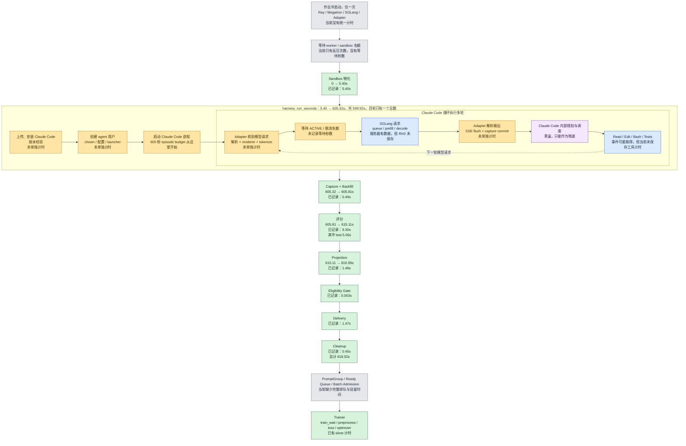

# codex 复核意见存档（S2 前）

> 背景：codex 的复核意见原先写在 `tmp/codx_adv.md`，但 `tmp/` 被 `.gitignore` 忽略（`.gitignore:16`），新 clone 中不存在、引用不可复现。本文件将两轮意见全文迁入版本控制；S2 计划与状态文档的引用一律指向本文件。原 tmp 文件此后只作草稿箱。

---

## 轮次 1（2026-07-10：P3 收口后全面复核 → 已消化为 S2 计划 G6~G10 + S2-0b）

### 需要纠正的地方

- P3 应称为"训练后端与架构决策完成"，不能称为"严格端到端全部绿灯"。formal J4 最后仍失败于 `num_rollouts (19) < global_batch_size (32)`；J5 gbs16 失败于 23 个 microbatch 无法对齐 24。J5 gbs20 成功证明了根因，但 gbs20 只是诊断对照，不是正式方案。
- 本地没有 P3 的 rollout_0.pt。远程同步时排除了大型 .pt 张量文件，因此不能"直接重放真实 dump"。不过保存了完整的 J4 事件元数据：44 个原始样本、31 个保留样本、19 个有效 rollout，以及每个 rollout 的 fan-out、长度和剔除状态。这足以构造真实形状回归夹具，但不能原样重跑 slime tensor converter。
- S2 计划还没有吸收 batch schedule 准入任务。当前计划仍从 S2-6 导出器起步。P3 之后，batch admission 和 fan-out 规范化才是训练主线第一阻塞项。
- fan-out 目前仍是实验级兼容。RepoHarness 返回的 `list[list[Sample]]` 已经打崩 slime 的 dynamic_filter 和 fully async `_key` 两处。正式方案应在 RepoHarness→slime 交付边界统一展平，同时保留 rollout_id、branch、group 和 reward 分摊语义，不应继续给 slime 各处打零散补丁。
- S2 的资格解封规则存在矛盾。计划一处说本机 S2-7 后可以产生 `online_policy_loss_eligible`，另一处又规定 `rh2_s2_signal_trusted = local AND gpu_verified`。两者必须统一。建议：本机验收只能解除"实现阶段封顶"，黑盒正式在线训练仍必须等待 GPU 侧真实拦截验证通过。
- `--network none` 不能直接作为黑盒 rollout 的最终网络方案。Claude Code 必须访问模型代理，容器里的 localhost 也不是宿主机。合理方案：依赖预装 + 隔离 Docker 网络 + 只允许访问模型代理/必要内部服务 + 公网默认拒绝。`--network none` 适合评分容器、纯本地白盒任务和安全单测。
- 导出器的原验收规模无法从现有本地资产重放。run8/run9 的 60+65 条原始 .pt 不在本地。保存了一条真实的多轮、t0 被剥离、包含完整 token artifact 的 run8 轨迹，正好可以验证锚定式重建。正式验收应改为：一条真实 t0 掉落轨迹 + 多轮/REALIGN/fan-out 合成回归夹具 + 下次短租时采集少量完整真实轨迹复验。
- S1 账本轻微不同步：deferred_risks 已把 S1-7b 改为 closed_by_p3_20260708，但 tasks.S1-7b 仍写 deferred_to_s4_pre_8card。【已修复：commit 0867f64a】
- 数据资产边界：数据冻结包本身可靠（四个 HF revision 固定、24 项 digest 一致、仓库级互斥通过），但 216 题只是静态存活集，还要过 golden/empty/假阳性/确定性四道环境门 + 目标模型 pass-rate 预筛才成为训练题单。

### 建议推进顺序

1. 确认 S1 检查点 2，修正账本状态表述。【已完成】
2. 新增 S2 前置任务：batch admission preflight/repair + fan-out 正规化。【已完成：S2-0b】
3. 使用 P3 真实事件元数据复现 44→31→19 和 23/24 两种失败。
4. 实现分叉感知离线导出器，使用保存的真实 t0 掉落轨迹验收。
5. 并行推进 SWE-Gym ingestion、环境四门和安全 Runtime。
6. 完成 Git sanitizer、CommandFilter、红队环境包和 S2 inspector。
7. 最后短租一次 GPU，合并验证 strict J4、真实在线拦截和少量完整轨迹留存。
8. fully async 暂不作为当前主线改造；首训先用 P3 已定案的 T3 分离 + train_async 双缓冲。

### 用户疑问（随轮次 1 提出）

分叉感知导出器是不是源自 final_review 的"双消费者 parity 证明"？对 SFT/warm-start 来说，同一个 Qwen MoE 模型的拒绝采样/RL 保留轨迹，和强 teacher 生成的轨迹，后续 SFT 输入是否都要 token 级轨迹重新分词？【解答已写入 S2 计划 S2-6 的"依赖关系澄清"：同 tokenizer/renderer 契约的自产轨迹直接用 token ids + loss mask，不重分词；异构 teacher 轨迹必须走结构化语义导出 + 学生 renderer 重渲染分词（SemanticSFT，G9 新缺口）】

### codex 对导出器的两点修正 + SemanticSFT 建议

- 分叉感知重建方向正确（叶链 tokens 为权威、capture records 只锚定 mask=1 区间），但它只阻塞：同策略 thinking rollout 的精确 token 回收、在线/离线 parity、同模型 warm-start/RFT——不阻塞所有 SFT。
- 原验收"60+65 条全部导出"不可执行（.pt 不在本地），改为真实 t0 掉落轨迹 + 合成回归 + 下次短租复验。
- SemanticSFT exporter 是新设计缺口：当前只有 token-faithful 出口，没有结构化消息/tool call/tool result/target/来源模型形态的通用 SFT 导出。建议 S2 至少完成 SemanticSFTRecord 契约和最小导出闭环，批量 teacher 数据生产放 S3，避免架构被 token-only 出口锁死。
- S2 最后应有一次短 GPU 验收（strict J4 + 真实在线拦截 + 代表性轨迹留存），不是重做 P3。

---

## 轮次 2（2026-07-11：对 commit 0867f64a / 53d1403a 的审查 → S2-0b 开工前必须补齐）

### 结论

两个提交整体方向正确，不需要回退。但 S2-0b 尚不能直接开工：存在两个影响 GRPO 算法正确性的严重遗漏，以及几处文档一致性问题。

### 严重问题 1：S2-0b 没有区分三层身份

正确层次：

```text
PromptGroup       同一任务 prompt 的 n 次采样（group_index / parent_rollout_id）
                  —— GRPO reward/advantage 归一化的单位
RolloutExecution  一次独立 harness 执行（Sample.index / rollout_id）
                  —— slime build_dp_schedule 按它计 global_batch_size
Branch            一次执行因 compaction/subagent 产生的叶链
                  —— 多 branch 共享 rollout_id，loss 按 rollout 聚合
```

P3 反例（本地事件元数据可复核）：J4 formal 中 group_index=5 只有一次有效 harness 执行 index=22，却 fan-out 出 8 个 branch——不能把这 8 个 branch 当成 8 次独立 GRPO 采样，也不能用它们凑 global_batch_size。

### 严重问题 2：P3 converter 在治理过滤 + fan-out 后会错误计算 GRPO reward normalization

`rh2/experiments/p3_preflight/rh2_convert.py` 的 `_post_process_rewards`（镜像 slime stock `slime/ray/rollout.py` 的 reshape-by-shape 逻辑）：保留样本数 == `rollout_batch_size × n_samples_per_prompt` 时按组 reshape；否则 `view(-1, total)` 把**全部样本折叠成一个大组**做均值中心化。J5 gbs20 实际保留 36 个样本 ≠ 名义 32，走了第二条路径，且 J5 日志确认 `rewards_normalization=True`。slime 自己的测试辅助文件（`reference/slime/slime/rollout/_fanout_test_helpers.py` 的 `grpo_normalize_by_group_index`）已明确指出该问题并给出 group_index 键控分组的原型。

含义：P3 仍然证明了 30B、top-p/routing replay、反向传播、权重同步能工作；**P3 的有限 loss 不能证明 GRPO 组归一化语义正确**。S2-0b 必须新增问题 E（层次化优势归一化），验收不变量：

1. 同一 prompt group 内，先按唯一 rollout execution 计算 reward/advantage；
2. 一个 rollout 的 fan-out branch 数变化，不得改变其他 rollout 的 advantage；
3. 同一 rollout 的 advantage 可广播给它的 branches；
4. branch 对 loss 的总贡献按 rollout 级分母聚合，不能随 branch 数放大；
5. 缺员 prompt group 首训默认整组补采或整组拒绝，不做隐式可变 n 的 GRPO。

### 一般问题

- **"统一展平为 list[Sample]"边界不精确**：slime rollout 层原生就是 `list[list[Sample]]`（外层 = prompt group），train converter 才消费平铺。过早全局展平丢 prompt group 边界；不处理 branch 列表又成三层嵌套。应明确三个视图：RepoHarness 内部权威结构（PromptGroup → RolloutExecution → Branch）；slime rollout/filter 视图（保留 PromptGroup，组内展开 execution/branch + 显式身份 sidecar）；slime train converter 视图（平铺 + group_index/rollout_id/branch_id 无损回链）。若坚持不改 slime 源码，需要自己的 rollout-function-path 或统一 fan-out adapter——仅改 custom_generate 返回值覆盖不了 stock rollout 的 `len(group)==n_samples_per_prompt` 假设。
- **batch admission 结果不应写进 TrajectoryProjection 或 EligibilityReport**：`backend_rejection_reason` 属于 `BackendHandshake`（`contracts/handshake.py`），且契约注释明言"可训练性唯一权威是 EligibilityReport，accepted 不构成资格背书"。一条轨迹可能语义完全合格、只是当前批次装箱失败，不应因此改 eligibility。建议新增批次级 `BatchAdmissionReport`，各条 BackendHandshake 引用它；rejection reason 扩充：insufficient_rollout_count / microbatch_alignment_failed / prompt_group_incomplete / capacity_backpressure。
- **修复策略顺序要改写**：不能先 fail-closed（先拒绝就没有 repair 了）。正确顺序：预检 → 按配置尝试（延迟聚合 / 同 prompt 补采 / 完整组选择）→ 重新预检 → 仍不合法才 fail-closed。另外组级子集选择不能解决 A 类（19<32）——它只能减样本；A 类只能靠跨波次等待、降到预注册的更小 batch 目标、或补采完整 prompt group。
- **离线测试应加与 slime 真 `build_dp_schedule` 的差分验证**：同一输入同时喂 RepoHarness 预测器和 slime 的真实纯 Python 函数，要求成功/失败类别、step 数、microbatch 数一致。

### 文档问题

- S2-6 正文仍保留不可执行的旧验收（60+65 条），与 G8 冲突——开工版本不应同时保留两套标准。
- S2 计划引用了被 .gitignore 忽略的 `tmp/codx_adv.md`，新 clone 不可复现。【本文件即修复】
- AGENTS.md 阶段一览仍有一处"待检查点 2 确认"；状态文档快照日期未更新；状态文档末尾多空行。

### 验证结果（codex 本机复跑）

```text
inspect-rh2-s1                         PASS
inspect-rh2-s1 --run-contract-tests    303 passed
uv run pytest -q                       647 passed
```


---

## 轮次 3（2026-07-12：对 05-fully-async-execution-plan.md 的开工前审查 → 12 条全部采纳，编号 codex #1~#12）

> 原文全文转录如下（tmp/codex_adv_async.md，gitignore 不入库故迁此）。处置：#1~#4（proxy 内部重生成 / TrainingRuntimeCoordinator 跨进程协议 / DIS 准入分层 / batch lease+ACK）已写回 05 计划 D-FA-3、FA-0 3b/3c、FA-1、FA-3、FA-4；#5~#11（多版本 schema、present+eligibility 引用、DIS 对拍清单+ε 区间、训练进度权威、双 TTL+资源分类限额、训后周期 checkpoint 评测、microcompact 警示）逐条落对应任务；#12 账目残留当轮修复。

**总判定**

整体方向正确，我同意继续采用：

- `version-aware fully async + faithful DIS`
- 首版不做成员补采
- 权重更新 abort 采用 proxy 级 turn 重生成
- 训练期间不评测，只做 before/after
- FA 与 S2 独立并行

但当前计划还不适合不加修改地全面开工。至少有四个正确性问题应先写回 FA-0/FA-1，否则容易实现出“看似完全异步、实际无法可靠恢复或准入”的链路。

**执行前阻塞问题**

1. **Proxy 重生成不应依赖 Claude Code 自己重试**

计划一边规定 proxy 是唯一重试执行点，一边写成“proxy 返回错误 → Claude Code 原生重试”，两者矛盾，见 [05-fully-async-execution-plan.md:17](/Users/roger/Desktop/claude-code-verl-stage0h/docs/agentic_RL/repo_harness_rh2_workstreams/05-fully-async-execution-plan.md:17) 和 [同文档:50](/Users/roger/Desktop/claude-code-verl-stage0h/docs/agentic_RL/repo_harness_rh2_workstreams/05-fully-async-execution-plan.md:50)。

当前 slime adapter 会等待 `/generate` 返回完整 JSON 后，才向 Claude Code 伪装成 SSE 流发送结果，见 [common.py:344](/Users/roger/Desktop/claude-code-verl-stage0h/reference/slime/slime/agent/adapters/common.py:344) 和 [anthropic.py:211](/Users/roger/Desktop/claude-code-verl-stage0h/reference/slime/slime/agent/adapters/anthropic.py:211)。所以 non-delivered 保证来自“完整响应缓冲”，不是“逐 token 捕获”。

建议定为：

```text
同一个 Claude Code HTTP 请求
  -> proxy 发起 model_call_attempt_1
  -> 识别更新窗口 abort，丢弃未交付 attempt
  -> 等待引擎 ACTIVE 且版本前进
  -> proxy 内部发起 model_call_attempt_2
  -> 只把最终成功响应交付 Claude Code
```

这样不依赖黑盒 SDK 重试，也不会重复消耗当前在生成前递增的 turn cap。必须新增 `logical_turn_id / model_call_attempt_id / delivery_status`，并处理 SGLang 以正常 JSON 返回 `finish_reason=abort` 的情况，而不只是网络异常。

2. **`TrainingRuntimeCoordinator` 目前只有名字，没有跨进程协议**

计划说 proxy 与协调器“共享更新窗口开始/结束事件即可”，见 [执行计划:62](/Users/roger/Desktop/claude-code-verl-stage0h/docs/agentic_RL/repo_harness_rh2_workstreams/05-fully-async-execution-plan.md:62)。但权重更新、RolloutManager、proxy 和 trainer 位于不同 Ray actor/线程，不能依赖普通内存事件。

FA-0 应定义显式协议：

```text
update_epoch
phase = ACTIVE / PAUSING / UPDATING / RESUMING
old_version / target_version / active_version
window_started_at / window_completed_at
fencing_token
```

Proxy 只有在失败与已知更新窗口重叠、响应未交付、恢复后版本满足预期时，才能内部重生成。否则必须按不可归因故障处理。

3. **DIS 有效 token 比例无法在 ready queue 阶段计算**

计划要求 DIS 有效 token 比例超限时“不进 ready queue / TrainBatch”，见 [执行计划:95](/Users/roger/Desktop/claude-code-verl-stage0h/docs/agentic_RL/repo_harness_rh2_workstreams/05-fully-async-execution-plan.md:95)。但 DIS ratio 需要当前训练模型的 logprob，通常到 trainer forward 才能得到。BatchAssembler 此时只有 rollout logprob、token 和版本事实。

建议首版明确分层：

```text
ready queue 准入：
  provenance、完整组、版本跨度、current-version staleness

trainer forward：
  计算 current logprob、faithful DIS ratio、token mask

训练决定：
  正常反向传播，或在全局有效 token 为 0 时跳过整个 optimizer step
```

`90%` 首版应作为监控和黄灯阈值，不应直接成为 ready queue 硬门。若以后坚持按它换 batch，需要新增“两阶段 logprob 预检”或“forward 后取消并重新取 batch”的 trainer 协议，复杂度明显更高。

4. **Batch 消费缺少 lease 和 trainer acknowledgement**

计划只写 `peek → preflight → consume`，见 [执行计划:83](/Users/roger/Desktop/claude-code-verl-stage0h/docs/agentic_RL/repo_harness_rh2_workstreams/05-fully-async-execution-plan.md:83)。这无法处理 trainer 崩溃：

- 提交前删除会丢 batch。
- 训练完成后删除又可能在重启后重复训练。
- Ray future 成功不等于 checkpoint 与队列状态已经原子提交。

至少需要：

```text
READY
  -> RESERVED(batch_lease_id, expires_at)
  -> SUBMITTED(optimizer_step_id)
  -> TRAINED
  -> ACKED / RELEASED
```

恢复语义也要定案：建议采用 at-least-once 提交，加 `batch_id + optimizer_step_id` 去重；不要声称实现严格 exactly-once，除非队列账本与 trainer checkpoint 能原子提交。

**其他重要修正**

5. `RolloutAttemptOutcome.behavior_policy_version` 不能是单值。一个 execution 可以跨多个版本。应保存逐 turn 引用或版本序列，并分别派生：

```text
intra_execution_version_span
current_version_at_finalize
current_version_at_consume
worst_token_lag
```

现有 `BackendHandshake.policy_version` 也是单值，见 [handshake.py:96](/Users/roger/Desktop/claude-code-verl-stage0h/rh2/src/repoharness2/contracts/handshake.py:96)，FA-0 应升级 schema，不能把多版本事实压回单值。

6. `present_trainable` 会复制 `EligibilityReport` 的权威结论。Outcome 应记录 `present`，并引用 `eligibility_report_id`；在线训练资格仍只能由 EligibilityReport 决定。

7. Faithful DIS 验收不能只对拍 forward loss。还要固定：

- loss 正负号；
- importance ratio 是否 `detach`；
- 越界 token 的梯度是否精确为零；
- denominator 是否包含被拒 token；
- top-p replay 是否参与 current logprob；
- DP/CP/VPP 下归约是否一致；
- 每个 token 的梯度与手算结果是否一致。

论文 coding-agent 参数是 `epsilon_low=0.8`、`epsilon_high=3.0`，不是模糊的“论文默认”。计划应写明初始区间及来源。

8. 完全异步后，slime 的名义 epoch 和学习率调度会漂移。当前 `train_iters` 按名义 rollout 数推导，而数据源会为 reserve/rejected groups 继续推进。应以已确认 optimizer step、已消费 RolloutExecution 或有效 token 为训练进度权威，同时分别记录 attempted/trained prompt coverage。

9. `ready queue TTL` 不能只按版本。若 trainer 停住且权重不更新，版本 TTL 永远不会过期。应同时有：

```text
policy_version_ttl
wall_clock_ttl
```

并分别限制 active sandbox、模型调用、评分容器、pending groups 和 ready groups，不能只设一个全局并发池。

10. 同意“训中不评”，但建议训练结束后依次评测保留的周期 checkpoint，而不只是最终 checkpoint。否则无法判断中途能力峰值或后期退化。

11. `DISABLE_COMPACT=1` 主要关闭 auto/manual compact；Claude Code 的 microcompact/context-collapse 是其他路径。计划已有“上下文收缩即拒绝”的兜底，这条必须保留，不能只凭环境变量宣布 compaction 已关闭。

12. 文档声称 reward/K 已全仓清理，但正式实验设计仍有旧表述；[repoharness_validation_experiment_design.md:469](/Users/roger/Desktop/claude-code-verl-stage0h/docs/agentic_RL/training_design/repoharness_validation_experiment_design.md:469) 尚未修正。项目状态文档也还有一处把遗留任务写成 S2-0b，属于低风险账目问题。

**可以保持不变的部分**

FA/S2 分离、完整 PromptGroup 才进 ready queue、branch 不计作 rollout、reward 整体广播配 rollout 级分母、`build_dp_schedule` 差分验证、禁用 `--release-train`、不做成员补采、FA-5 与 S2 共用租卡窗口，这些设计都合理。

我的建议是先让 Claude 把前四项写回计划，再开 FA-0。FA-3 的纯 Python schedule 差分测试可以提前并行；FA-4 可以先做公式和梯度级小张量测试，但在 DIS 时序与 denominator 定案前，不应开始最终 custom loss 接线。本轮我只做了审阅，没有修改文件。


---

## 轮次 4（2026-07-12：FA-0 实现审查 → 12 项全部采纳，follow-up 随 commit 落地）

> 原文全文转录（tmp/FA-0_codex.md，gitignore 不入库故迁此）。处置见 `fa/implementation-notes.md` 的 "FA-0 follow-up" 节：严重 1（staleness clamp 掩盖矛盾 → fail-closed + provider 注入点）、严重 2（session 级收缩误杀子 agent → 叶链级硬拒绝 + session 级 audit-only）、严重 3（RuntimeFailureCategory 13 值独立枚举）+ 一般/测试项逐条修复；测试 684 → 692。

**结论**

FA-0 的总体设计正确，不需要推翻；三层身份和逐 turn 版本事实值得保留。但目前还不能把它视为正式链契约已经完全闭合。存在 3 个进入 FA-1 前应修复的问题，以及若干契约和测试缺口。

FA-3 离线调度预检、FA-4 合成张量对拍可以继续并行；FA-1 真实异步接线最好等下面前三项修完。

**严重问题**

1. **finalize 当前版本仍是静态配置，不是真实运行时版本**

[generate.py:1258](/Users/roger/Desktop/claude-code-verl-stage0h/rh2/src/repoharness2/adapters/slime/generate.py:1258) 只检查 `config.policy_version` 是数字；[generate.py:1737](/Users/roger/Desktop/claude-code-verl-stage0h/rh2/src/repoharness2/adapters/slime/generate.py:1737) 又直接拿它计算 staleness，没有在 finalize 调用 `engine.get_weight_version`。

我构造了反例：

```text
config current version = 3
turn weight_versions = [5]
结果 staleness_steps = 0
staleness_within_threshold = true
```

这实际上是事实矛盾，却被判定为健康。修复建议：

- 注入 `CurrentPolicyVersionProvider`，在 finalize/消费时读取真实版本。
- `seen_version > current_version` 必须 fail-closed，不能 `max(..., 0)`。
- 区分 `current_version_at_finalize` 和 FA-3 的 `current_version_at_consume`。
- 在实时 provider 接入前，不应把当前 handshake 称为“真实 staleness”。

2. **上下文收缩检测会误杀 Claude Code 子 agent 或合法分叉**

[generate.py:591](/Users/roger/Desktop/claude-code-verl-stage0h/rh2/src/repoharness2/adapters/slime/generate.py:591) 把同一 session 的所有 turn 按序排列，和全局最大 prompt 长度比较。

但 Claude Code 的所有请求共享同一个 `ANTHROPIC_AUTH_TOKEN=session_id`，见 [claude_code.py:62](/Users/roger/Desktop/claude-code-verl-stage0h/reference/slime/slime/agent/harness/claude_code.py:62)；Anthropic adapter 又直接用该 token 作为 session id，见 [anthropic.py:192](/Users/roger/Desktop/claude-code-verl-stage0h/reference/slime/slime/agent/adapters/anthropic.py:192)。因此子 agent 启动较短上下文时，很可能被误判为 compaction。

建议：

- 检测必须按逻辑会话 lineage/消息图分支执行，不能跨 branch 比较。
- 在没有 lineage 信息前，token 数骤降只能作为 audit 信号，不宜作为正式硬拒绝。
- 真正的硬规则先依赖 `DISABLE_COMPACT=1` 验真和明确 compaction hook/event。
- 增加“主 agent 长上下文后启动短上下文子 agent，不得拒绝”的负测试。

3. **执行故障错误复用了评分故障枚举**

[fa_runtime.py:133](/Users/roger/Desktop/claude-code-verl-stage0h/rh2/src/repoharness2/contracts/fa_runtime.py:133) 使用 `GradingFailureCategory`，但它只有四种评分结果，见 [grading.py:36](/Users/roger/Desktop/claude-code-verl-stage0h/rh2/src/repoharness2/contracts/grading.py:36)。

它无法表达：

- model proxy 或 inference 服务失败
- sandbox/harness/worker 崩溃
- capture、token alignment、staleness 失败
- security、anti-cheat、身份冲突

这会让 FA-2 的组终结、重试和熔断无法可靠决策。应新增独立的 `RuntimeFailureCategory`，评分失败作为其中一个来源或 evidence ref，而不是让评分枚举统治整个 rollout 生命周期。

**一般问题**

- `present` 没有强制 `current_version_at_finalize`，与字段说明冲突，见 [fa_runtime.py:178](/Users/roger/Desktop/claude-code-verl-stage0h/rh2/src/repoharness2/contracts/fa_runtime.py:178)。
- `TrainingRuntimeWindow` 允许 `old_version == target_version` 后宣布 `ACTIVE`，并未真正保证版本前进，见 [fa_runtime.py:250](/Users/roger/Desktop/claude-code-verl-stage0h/rh2/src/repoharness2/contracts/fa_runtime.py:250)。
- `ModelCallAttempt(delivered)` 没有强制 `weight_version`，见 [fa_runtime.py:309](/Users/roger/Desktop/claude-code-verl-stage0h/rh2/src/repoharness2/contracts/fa_runtime.py:309)。
- abort attempt 只记录 `update_epoch`，没有回链具体窗口或 `fencing_token`，不足以证明它确实与最新更新窗口重叠。
- `context_shrink_ratio` 没有范围和有限数校验；`0` 会彻底关闭检测，`>1` 会误报正常等长 prompt。
- `require_real_weight_versions=True` 并不会强制 `reject_context_shrink=True`，所谓“正式配置必须开启”目前只是注释。
- 非正式路径确实允许真实版本与 fallback 混合，例如 `["3", "wv_fallback"]`；这与代码注释和 commit 中“不拼混合序列”的表述不一致。

**测试问题**

[test_fully_async_surface.py:21](/Users/roger/Desktop/claude-code-verl-stage0h/rh2/tests/contract_slime_async/test_fully_async_surface.py:21) 在 `reference/slime` 不存在时整文件跳过。该仓库目前未被父仓库追踪，干净 clone 中这 7 条关键 pin 很可能全部 skip，而且没有检查 HEAD 必须为 `e848052a`。

建议未来 `inspect-rh2-fa`：

- 缺少 slime 源码时 fail，而不是 skip。
- 验证精确 commit/digest。
- 源码正则只作为补充，FA-5 再做真实行为测试。

此外，[test_slime_generate.py:1528](/Users/roger/Desktop/claude-code-verl-stage0h/rh2/tests/adapters/test_slime_generate.py:1528) 名称声称测试“轨迹收口为 abort”，实际只直接调用了检测函数，没有运行 orchestrator，也没有断言 `remove_sample=True`。

**可以保持不变**

三层身份、eligibility 单一权威、消费时版本事实不回写 finalize 记录、non-delivered attempt 不进入 capture 训练面、逐 turn `weight_version` 透传、`routed_experts_start_len` 非零 fail-closed，这些设计都合理。

验证结果：

```text
聚焦测试：81 passed
全套测试：684 passed
inspect-rh2-s1：PASS
```

因此 S1 没有回归。建议把上述问题做成一个很小的 `FA-0 follow-up`，修完再进入 FA-1；FA-3 离线部分与 FA-4 数学对拍不必等待。没有修改任何文件。


---

## 轮次 4（2026-07-12：对 s2/s2_1_data_ingestion_execution_plan.md 的开工前审查 → 全部采纳）

> 用户转达，原文要点转录。处置：4 个硬阻塞全部核实成立并修入执行文档（§1/§2/§3.0/§3.1/§4）；四门规格修正（硬门=empty/golden/determinism，假阳性降为 probe 层四态结果）；执行完整性 8 项全部采纳；O-1 改判不并入、O-2 改判 50/216 同实例、O-3 N=3 双门、O-4 probe 化。

### 硬阻塞（4 项，均经源码核实）

1. **冻结元数据缺四门所需字段**：`meta/swe_gym_lite.jsonl` 只有 8 列（instance_id/repo/base_commit/version/problem_statement/hints_text/F2P/P2P），缺 patch/test_patch/created_at——既不能构造 BundlePair 也不能跑 golden 门。改为：按冻结 revision 重抓完整 11 列 → 不可变 raw archive + digest → 全字段 strip_spec fail-closed；裁剪版 meta 不作字段覆盖验证依据。
2. **镜像清单无法提供稳定身份**：`image_refs_swegym.txt` 是 Full 2438 条无键 `:latest` 列表、无 manifest digest，而 `PublicTaskBundle` 强制 `image_manifest_digest`。改为：生成键控解析清单（instance_id/source_image_ref/resolved_manifest_digest/resolved_at/platform/registry_evidence_ref），运行期按 digest 拉取比对；`_s_` 规则只作映射校验。
3. **validation_only 与 grader_only 归属冲突**：`PrivateGradingBundle.v1` 强制含 `golden_patch`（bundles.py:152），违反 strip_spec:24 的 validation_only 归属。改为 v2 三分体系（PublicTaskBundle 复用 / PrivateGradingBundleV2 无 golden / ValidationOnlyBundle 持 golden+mutation fixtures / EnvironmentPackage digest 关联）；冻结 v1 不改，"只加构造器不改 schema"的原表述不成立。
4. **grader 缺受控 patch 入口**：`grade()` 只从 agent workspace 导出 patch（manager.py:356 WorkspaceRunner）。新增 `grade_controlled_patch(patch_bytes, patch_origin, patch_digest, validation_run_id)` 与原入口共用 image check/clean checkout/apply/eval/parser；不为四门伪造 workspace。

### 四门修正

- empty 门前提 = 测试真实运行且 parser 成功解析 + ≥1 F2P 失败；infra_failure/patch_apply_failed 不算门正确失败。
- golden 门 = 全部 F2P 通过 ∧ P2P 零失败（RESOLVED_FULL），不只是 F2P>0。
- 3a 的 /tmp 文件不构成 repo patch → 改仓库内可 clean-apply 的无关文件变更。
- 3b 删末 hunk 不保证是错误解（可能是冗余清理）→ 改名 mutation probe，四态（rejected/suspicious_pass/fixture_invalid/infra_failure），suspicious_pass 人工复核不自动剔题。
- 8 题基线只硬要求 empty/golden/determinism；probe 验证 runner 诚实分类。
- 确定性 = empty 与 golden 各 N=3、全新容器、比较语义 verdict + F2P/P2P 集合（不比日志文本）。

### 执行完整性（全部采纳）

50 题按 repo/golden hunk 数/F2P、P2P 规模分层 + 固定 seed（不取前 50）；幂等键 (instance_id, gate, fixture_digest, image_digest, validator_config_digest, attempt)；原子写 + 断点续跑；只重试 infra failure；日志 digest 必须对应留存 artifact；EnvValidationReport 用五态枚举非布尔；provenance 全量（source revision/三 bundle digest/image digest/swebench+parser 版本/runtime fingerprint/validator config digest）；新建 s2_1 manifest 回链 v0.1（不向冻结 manifest 追加）；新 schema 注册 EXTRA_SCHEMA_REGISTRY 扩展面（S1 核心 15 契约冻结不动）。

### O-1~O-4 定案

- O-1 **不并入** held-out（542 中 450 题是 R2E：需另一套 ingestion、parent 断言实战、scaleswe grader；并入 = 216→758 题 / 4500+ 次评分，成本失效）。S2-1 只保证 runner 可复用；静态门打标（无 docker）任意线程可先行。
- O-2 T0~T3 本机；**T4 50 题与 T5 216 同一 x86 实例**（不得 ARM 校准后换 x86 判题）。
- O-3 N=3，empty/golden 各 3 次。
- O-4 3a 保留为控制探针，3b 非强制 mutation probe + 人工复核。

### 保持项

T0 冻结账本自检、D5 代码级重验、leakage_watch 透传、先 8 题再 50 题再全量、逐题报告与漏斗账、S2/FA 文件边界。


---

## 轮次 5（2026-07-12：FA-3 离线 / FA-4 对拍实现审查 → 12 项全部采纳）

> 原文全文转录（tmp/FA3/4_codex.md）。处置见 `fa/implementation-notes.md` "FA-3/FA-4 follow-up" 节。最重要裁决：DIS 信任区间按论文式 3 原文核实为 (1−ε_ℓ, 1+ε_h) 开区间 = (0.2, 4.0)——轮次 3 的"直接 ratio 边界"读法与我方闭区间实现均错误，已修正。codex 附加验证：5000 例随机调度差分全部一致。

**结论**

两个提交的核心方向正确，但目前更准确的状态应是：

- FA-3：**调度镜像原型完成，正式队列接线前仍需加固**
- FA-4：**标量 DIS 参考原型完成，尚未达到论文忠实和分布式训练验收**

没有必要推翻实现。FA-1 的 worker/proxy 工作可以继续，但不要直接把当前 FA-3 接入 lease/ACK，也不要基于当前 FA-4 开始正式 custom loss 接线。

**严重问题**

1. **FA-4 的 DIS 阈值与论文原文不一致**

[faithful_dis.py:12](/Users/roger/Desktop/claude-code-verl-stage0h/rh2/src/repoharness2/training/faithful_dis.py:12) 实现 `[0.8, 3.0]` 闭区间。

但 SAO 论文公式 3 是：

```text
1 - eps_low < ratio < 1 + eps_high
```

coding 配置给出 `eps_low=0.8, eps_high=3.0`，按字面应为 `(0.2, 4.0)` 开区间。当前测试还把闭区间钉成正确行为，见 [test_faithful_dis.py:171](/Users/roger/Desktop/claude-code-verl-stage0h/rh2/tests/training/test_faithful_dis.py:171)。

必须在接线前定案：

- 按论文原文实现 `(0.2, 4.0)`；或
- 若有作者代码证明参数是直接 ratio bounds，则保留 `[0.8,3.0]`，但明确称 RH2 变体，暂时不能叫 faithful DIS。

2. **FA-3 `ok` 没有说明实际选择和延后了哪些 execution**

[batch_admission.py:189](/Users/roger/Desktop/claude-code-verl-stage0h/rh2/src/repoharness2/adapters/slime/batch_admission.py:189) 整除得到 step 数，尾部 execution 被忽略。比如 25 个 execution、`gbs=20` 返回 `ok`，但结果没有说明后 5 个未训练。

这不能支撑异步队列的 lease/ACK。建议：

- 首版一个 lease 严格只取一个完整 step；或
- 返回 `selected_execution_ids`、`deferred_execution_ids` 及对应 sample positions。
- ACK 只确认 selected，deferred 必须回到 READY，不能记成丢弃。

3. **FA-3 没有使用 FA-0 的稳定 PromptGroup 身份**

[BranchDelivery](/Users/roger/Desktop/claude-code-verl-stage0h/rh2/src/repoharness2/adapters/slime/batch_admission.py:267) 只有 `group_index`，没有 `prompt_group_id`；归一化也按整数 `group_index` 分组。

多个 worker、数据源重启或回放时，`group_index` 可能复用。应携带完整 `ExecutionIdentity`，以 `prompt_group_id` 为 GRPO 权威键，`group_index` 只作为 slime 本批次编号。同时拒绝重复的 `(prompt_group_id, rollout_execution_id, branch_id)`。

4. **FA-4 没有实现 execution 级归约层次**

[faithful_dis_loss](/Users/roger/Desktop/claude-code-verl-stage0h/rh2/src/repoharness2/training/faithful_dis.py:78) 把传入 token 全部除以单一分母，没有 execution/branch 身份，也不消费 FA-3 产生的 rollout denominator。

因此尚未证明：

```text
branch numerator
-> RolloutExecution 共享 denominator
-> batch execution mean
-> DP/CP/microbatch 归约
```

需要补 branch split、fan-out 数量变化、DP partition invariance 测试，并让参考层显式接收 execution 分区或 `rollout_mask_sums`。

5. **torch 对拍的全零路径会产生 NaN**

[test_faithful_dis.py:125](/Users/roger/Desktop/claude-code-verl-stage0h/rh2/tests/training/test_faithful_dis.py:125) 直接除以 `mask.sum()`。我实测全 mask=0 时 loss 和梯度均为 NaN；现有“无 NaN”测试只测 Python 标量实现。

正式实现必须全局归约 numerator/denominator，只有全局有效 token 为零才跳 step；局部空 CP rank 仍需返回连接 logits 的可微零，避免 collective/backward 死锁。

**重要遗漏**

- top-p replay 没有进入对拍；测试从预先给定的 `logp_current` 开始。
- 没有跨版本双 turn 场景。
- 没有 DP/CP/VPP 归约测试。
- 没有“正式配置禁用 DIS 必须启动失败”的负测试。
- FA-3 真 slime 差分在 `reference/slime` 不存在时全部 skip，而且该目录未被父仓库追踪。正式 FA inspector 必须验证源码存在及 HEAD/digest。
- 随机差分只验证“两边都失败”，没有真正比较失败类别；也没有比较 selected/deferred sample 集合。
- P3 分母回归使用 `response_lengths`，正式分母应来自 `loss_mask` 中的 1 数量。

**输入校验**

边界探针确认当前会接受：

- `NaN reward`，产生 NaN advantage；
- `NaN advantage`，产生 NaN DIS loss；
- 重复 branch，重复累计 denominator；
- execution 总 trainable token 为 0；
- 负 `max_tokens_per_gpu`；
- 非法并行配置可能直接 `ZeroDivisionError`。

另外，有限 logprob 差也可能让 `math.exp` 溢出。应在 log-ratio 空间先判断阈值，只对已确认在区间内的值执行 `exp`。

**可保留的优点**

FA-3 的调度镜像本身质量很好：我额外做了 **5000 组随机受支持参数差分**，与真实 `build_dp_schedule` 的准入和 microbatch 数全部一致。execution 级 reward 广播与 branch 共享分母方向也正确。

FA-4 的 loss 符号、detach 后解析梯度、越界 token 零梯度、provenance mask 不变等标量语义是自洽的。只是 detach 应记录为明确算法决策，因为论文没有显式写 stop-gradient。

验证结果：

```text
聚焦测试：32 passed
全套测试：724 passed
inspect-rh2-s1：PASS
5000 例额外调度差分：全部一致
```

建议先做两个小型 follow-up：`FA-3 hardening` 与 `FA-4 formula/reducer correction`。FA-1 可以并行推进，但 FA-2/FA-3 队列接线必须等前者，custom loss 接线必须等后者。没有修改文件。


---

## 轮次 5（2026-07-12：T0 验收审查 → T0 可验收、T1 解锁；一个实质遗漏 + 三条证据工程建议）

- **实质遗漏（已在 T1a 修复为正式断言）**：`assert_repo_disjoint.py` 先 `train_pool = (swe_gym | r2e) - heldout` 再查 `train_pool ∩ heldout`，数学上必空——不构成"216 survivor 不含 held-out 题"的证明。codex 独立补跑真实关联检查（216 唯一、join 全中、held-out 命中 0，PASS）；正式机器断言 = survivors → join Lite by instance_id → repo ∩ {hydra,bokeh,tornado,pyramid} == ∅，已实现于 `rh2/experiments/s2_1_ingestion/fetch_raw_lite.py` 第 4 步，T0 报告已补注。
- **证据工程建议（登记 S2-8/T2）**：① inspector 只读重算，不原地重写被检 evidence；② T0 收编为机器可重算项（manifest 自 digest / 24 项通过数 / 脚本 digest / survivor 级 D5 / 报告前后 digest）；③ 正式数据身份用规范化完整 repo identity，不用 basename。
- **codex 独立验证**：脚本运行前后 digest 24/24 PASS、报告前后 digest 一致、216 survivor 真实 D5 PASS、inspect-rh2-s1 PASS（22 evidence + 55 code）。结论：T0 结果可信，遗漏并入 T1/T2 正式 checker，不阻塞 T1。


---

## 轮次 6（2026-07-13：T1 验收审查 → 数据产物可信，但 T1 不应完全验收；三个严重问题 + 计划要求未完成）

- **严重 1 续跑 fail-open**：resolver 只按 instance_id 跳过，不校验旧条目；codex 反例（digest 改 "bad" → ALL PASS 216/216；塞 unexpected_extra → ALL PASS 217/216）。【v2 修复：加载即逐条严格校验 + 完成断言 set(entries)==set(survivors)】
- **严重 2 重跑非幂等**：完整文件上重跑把 platform_sample 覆盖为空列表（codex 复现 resume_byte_idempotent=false）。【v2 修复：header 由事实重建含 schema_id，幂等】
- **严重 3 非原子写**：直接覆盖 JSON，中途死亡留损坏文件。【v2 修复：temp+fsync+os.replace】
- **计划要求未交付**：真实 platform（原口径仅命名约定）与 registry_evidence_ref（0/216）。【followup 补齐：manifest GET + config blob 断言 linux/amd64 + evidence jsonl 回链；183/216 后限额停车可续跑】
- **一般**：pyproject 缺 data 依赖声明【已加 data group】；缺 schema_id【v2 已加】；raw archive 覆盖不设防【immutable 守卫 + 原子写】；"当前 sha == pin"未在脚本内实现【已加信息性核对】；(repo,base_commit,F2P) 仍不宜作自动去重主键，应 task_id + duplicate cluster 人工/规则判定【T2 落实，plan 与 notes 已记】。
- **codex 独立确认正确**：raw 230/11 列/一致性、216 映射唯一覆盖、digest 全合法、214 唯一 + 两对共享（题面/F2P/test_patch/gold 均异）、父 manifest 四项 digest 匹配、pytest 749、inspect-rh2-s1 PASS。


---

## 轮次 6（2026-07-13：FA-1 实现审查 → 全项采纳，follow-up 随 commit 落地）

> 原文全文转录（tmp/FA1_codex.md）。处置见 `fa/implementation-notes.md` "FA-1 follow-up" 节：严重 1~6（生产接线薄壳 / sink durable fallback+halt / 生命周期收口 / attempt 全局身份 / capture 两阶段事务 / target_version 校验）+ 遗漏项与测试缺口逐条修复；场景 21 的落点从 orchestrator 修正到 FA 入口（S1 eval 面是 E10 正式定案，不得破坏）。测试 749 → 768。

**结论**

FA-1 的组件设计方向合理，但当前不能判定为“FA-1 完成”。更准确的状态是：

```text
FA-1 本地运行时组件原型完成
FA-1 生产链接线与生命周期闭环未完成
```

建议先做一个 `FA-1 follow-up`。FA-2 可以并行设计纯状态机，但不要冻结 worker→assembler 接口，也不要进入实际接线。

**严重问题**

1. **FA-1 组件目前完全没有进入生产路径**

仓库检索表明 [async_worker.py](/Users/roger/Desktop/claude-code-verl-stage0h/rh2/src/repoharness2/adapters/slime/async_worker.py) 只被测试引用。当前 glue 没有使用：

- `ContinuousExecutionWorker`
- `ModelCallProxy`
- `ResourceLimits`
- `BoundedDeliveryQueue`
- FA fully-async `rollout-function-path`

[glue.py:404](/Users/roger/Desktop/claude-code-verl-stage0h/rh2/experiments/s1_7a_bringup/glue.py:404) 仍然构造原来的 `RolloutOrchestrator`，只接了 compaction 和两个布尔开关。这与计划 [FA-1 第 1 条](/Users/roger/Desktop/claude-code-verl-stage0h/docs/agentic_RL/repo_harness_rh2_workstreams/05-fully-async-execution-plan.md:51) 不一致。

将整个 slime 薄壳推迟到 FA-5 风险太高：FA-5 应验证真实 GPU 行为，不应第一次发现接口根本没有接通。

2. **worker 的“失败必有账”实际上不成立**

[async_worker.py:539](/Users/roger/Desktop/claude-code-verl-stage0h/rh2/src/repoharness2/adapters/slime/async_worker.py:539) 先增加 `failed`，然后调用 `failure_sink`；sink 失败后异常被直接吞掉。

结果是：

```text
ledger_balanced() == true
但没有 RolloutAttemptOutcome 或任何持久化失败记录
```

这仍然属于 N1 的“任务静默消失”，只是从 task 层转移到了 failure sink 层。必须有内部 durable fallback；fallback 也失败时应 `run_halt`，不能继续训练。

3. **worker 对取消、task source 故障没有收口**

最小探针已复现：

- 被取消的 execution 使 [task.exception()](/Users/roger/Desktop/claude-code-verl-stage0h/rh2/src/repoharness2/adapters/slime/async_worker.py:537) 抛 `CancelledError`，worker 本体退出。
- `task_source()` 抛异常会直接终止 worker。
- worker 自身被取消时，没有 `finally` 取消并 await 所有 in-flight task。
- 消费者死亡且交付队列满时，stop 后也会永久等待。

需要明确 shutdown protocol：停止 top-up、给在途任务 deadline、持久化 pending、取消并 drain、最终对账。

4. **ModelCallProxy 的 attempt 身份会跨 rollout 冲突**

[async_worker.py:326](/Users/roger/Desktop/claude-code-verl-stage0h/rh2/src/repoharness2/adapters/slime/async_worker.py:326) 只用：

```text
logical_turn_id + attempt_number
```

多个并发 rollout 通常都从 `turn_0` 开始。我并发调用两次后得到：

```text
turn_0_a1
turn_0_a1
```

这会覆盖 `audit_artifacts`，也无法唯一回链 capture。attempt id 至少必须包含 `rollout_execution_id/session_id`。

5. **capture 引用不是事务性的，已经出现悬空 evidence**

响应缺 `weight_version` 时，[async_worker.py:342](/Users/roger/Desktop/claude-code-verl-stage0h/rh2/src/repoharness2/adapters/slime/async_worker.py:342) 生成：

```text
evidence_refs = ["audit:turn_x_a1"]
```

但 `audit_artifacts` 中没有该对象。`capture_record_ref()` 自身抛错时，ledger 和 audit 也都为空。

更根本的问题是：proxy 在真实 capture 成功前就写入 `capture_record_ref`。如果后续 capture 失败，会留下“声称存在但实际不存在”的引用。建议：

```text
proxy 返回 delivered attempt draft
-> capture 持久化成功
-> finalize ModelCallAttempt
```

6. **恢复条件没有验证 abort 窗口的目标版本**

[async_worker.py:441](/Users/roger/Desktop/claude-code-verl-stage0h/rh2/src/repoharness2/adapters/slime/async_worker.py:441) 只要求恢复版本大于调用开始版本，没有要求达到 `abort_window.target_version`。

我构造了：

```text
调用前 active=3
abort window target=5
恢复窗口 active=4
```

proxy 错误放行并交付版本 4。应验证：

```text
same epoch:
  active_version == abort_window.target_version
later epoch:
  active_version >= abort_window.target_version
  且 epoch/fencing 单调一致
```

**重要遗漏**

- `attempts_ledger` 和 `audit_artifacts` 永久保存在内存，后者还保存完整半截输出。长训练会持续增长。应写 artifact store，只在内存保留引用和有界指标。
- `ResourceLimits` 没有接入 worker、proxy、sandbox 或评分生命周期；目前只是独立 semaphore 类，不能声称五类限额已经生效。
- `max_pending_out` 使用 `>` 而不是 `>=`，且不校验负值，实际积压可超过命名上限。
- `retry_local_operation` 只按操作名重试，不区分异常是否可重试。认证失败、契约冲突、digest mismatch 等永久错误也会重试。需要 `retry_if(exception)` 或 typed retryable error。
- `RetrySpec` 没有校验次数和 delay；`max_attempts=0` 最终得到 `AssertionError("unreachable")`。
- `ModelCallProxy` 没有每 attempt timeout，模型请求永久挂起会长期占用资源。
- glue 对布尔环境变量只认字符串 `"1"`；拼错或写 `"true"` 会静默关闭正式防线，应严格解析并拒绝未知值。
- glue 没有给 `RolloutOrchestrator` 注入 `current_policy_version_provider`。权重更新后仍以启动探针版本作为 current，正式多 step 链会错误拒绝或计算错误 staleness。
- 全局验收场景 21“eval 进入 FA 路径必须 fail-fast”尚未实现。

**测试缺口**

当前 17 条测试没有覆盖：

- execution task cancellation；
- task source / failure sink 持久化失败；
- worker 被取消后的 in-flight 清理；
- 消费者死亡与 shutdown deadline；
- 重复 `logical_turn_id` 的并发调用；
- capture callback 失败与 evidence 存在性；
- coordinator 快照回退、非数值恢复版本、目标版本未达到；
- raw audit 内存上限；
- 五类 `ResourceLimits` 的真实生命周期接线；
- 正式 env 配置解析；
- worker→Outcome→FA-2 assembler 的端到端交付；
- `evaluation=True` fail-fast；
- 真实 slime `_key` 和 rollout-function-path。

**可以保留**

以下实现基础不错：

- 非阻塞 `try_put` + pending 列表的反压方向；
- execution 并发上限；
- abort 响应不交付旧 token；
- 更新风暴重生成上限；
- retry 默认不在白名单就只运行一次；
- S1 行为保持不变。

验证结果：

```text
FA-1 专项：17 passed
rh2 全套：749 passed
inspect-rh2-s1：PASS
```

建议下一步先补 `FA-1 follow-up`，至少关闭生产接线、durable failure ledger、取消/退出语义、全局 attempt identity、capture 事务和窗口 target 校验。FA-2 可同时编写状态机与报告 schema，但暂时不要绑定当前 worker 输出形状。没有修改文件。


---

## 轮次 7（2026-07-13：T1-followup 复审 → 三修复确认正确；新严重缺口 = manifest↔evidence 引用完整性；T1 保持 OPEN 正确）

- **严重 1 引用完整性缺失**：is_enriched 只查非空 ref 字符串；codex 反例——evidence 文件缺失 → ALL PASS 且自动写出空 evidence；digest 全改错 → ALL PASS 保留错误 evidence。真实 183 条经其独立交叉核对为 0 mismatch，漏洞影响续跑/恢复/防篡改。【v3 修复：enriched = 形状 ∧ evidence 存在 ∧ 逐字段交叉 ∧ 无多余/重复】
- **严重 2 双文件非事务**：先 manifest 后 evidence，两次 replace 之间死亡 → "声称 enriched 但 evidence 未写"且会被接受。【v3 修复：evidence 先写 → digest+行数入 header → manifest 最后为提交记录；load 重算 evidence digest；崩溃唯一方向（evidence 超前）按提交记录恢复】
- **严重 3 evidence_ref 路径错**：写 `image_registry_evidence.jsonl#id` 但文件在 `raw/` 下。【v3 修复：`raw/image_registry_evidence.jsonl#imgev-<id>` + 稳定 evidence_id】
- **应补测试**：七类无网络场景。【已补：tests/taskset/test_image_manifest_store.py，13 项】
- **一般**：报告顶行"全 PASS"与 OPEN 矛盾【已改"T1a PASS；T1b 184/216，T1 未验收"】；config blob 内容哈希未验【v3 下载原始字节重算 == config_digest 并入 evidence】；evidence 加 schema/version + evidence_id【已加】。
- **codex 独立确认**：三个旧修复正确、183 条 entry/evidence 零 mismatch、草稿账本 5 项 digest 正确、768 passed、inspect-rh2-s1 PASS。


---

## 轮次 7（2026-07-13：FA-1 第二轮审查（生产接线与 CC HTTP 边界）→ 五 P0 全部采纳）

> 原文全文转录（tmp/FA1_codex.md 第二版）。处置见 `fa/implementation-notes.md` "FA-1 follow-up 2"：同步入口 + 真 call_rollout_fn 契约测试 / glue ensure_fa_started + sampling params / 持久化 service 零丢失 / proxy 接入 capture wire + SessionPoisonRegistry + episode deadline + 发前 ACTIVE 等待 / provider 权威化（engine /get_weight_version + registry 交叉检查）。含 codex 本机 CC 2.1.205 重试实测数据（留档供 FA-5 复测）。测试 768 → 797。

**结论**

当前不能把 FA-1 判定为真正完成。基础组件质量已经明显改善，但生产入口和 Claude Code HTTP 边界仍有四个阻塞问题。其中两个会让 FA-5 真机启动直接失败，另一个会导致预取 rollout 静默丢失。

**严重问题**

1. **P0：rollout 入口与 slime 的同步接口不兼容。**

新入口是 `async def`：[rollout_entry.py:305](/Users/roger/Desktop/claude-code-verl-stage0h/rh2/experiments/fa_bringup/rollout_entry.py:305)，但 slime 的 `call_rollout_fn()` 是同步调用，不会 `await`：[base_types.py:19](/Users/roger/Desktop/claude-code-verl-stage0h/reference/slime/slime/rollout/base_types.py:19)。

我用 slime 真实 `call_rollout_fn` 做了探针，结果是：

```text
rollout_fn_samples_type=coroutine
is_coro=True
```

需要提供同步外壳，例如：

```python
def generate_rollout(...):
    return run(_generate_rollout_async(...))
```

并使用 slime 真实 `call_rollout_fn` 写接口契约测试。

2. **P0：新入口启动时拿不到 orchestrator 和 sampling params。**

`_build_service()` 要求 `args.rh2_orchestrator` 和 `args.rh2_sampling_params` 已存在：[rollout_entry.py:268](/Users/roger/Desktop/claude-code-verl-stage0h/rh2/experiments/fa_bringup/rollout_entry.py:268)。

但 orchestrator 目前只在旧 `custom_generate` 第一次执行时才挂载：[glue.py:693](/Users/roger/Desktop/claude-code-verl-stage0h/rh2/experiments/s1_7a_bringup/glue.py:693)，而新入口绕过了这一步。仓库中也没有任何代码写入 `rh2_sampling_params`。因此修完同步接口后，真实启动仍会立即 fail-fast。

3. **P0：当前生产薄壳并不 fully async，而且会丢预取结果。**

`collect_batch()` 每次调用都新建 worker、queue 和 collector，收够当前 batch 后立即停止 worker：[rollout_entry.py:194](/Users/roger/Desktop/claude-code-verl-stage0h/rh2/experiments/fa_bringup/rollout_entry.py:194)。它没有跨 optimizer step 保温。

更严重的是，worker 已经投进局部 queue、但尚未被当前 batch 消费的结果会随函数返回而消失。我构造了 `rollout_batch_size=1, concurrency=8` 的探针：

```text
returned_groups=1
executed_members=16
source_remaining=4
```

即返回 1 个组，却已经执行 16 个成员，其余结果没有进入下一批，也没有 abandoned 账目。

正确形态是让 worker、delivery queue、PromptGroupAssembler 和 ready queue 都由持久 `FaRolloutService` 拥有；`collect_batch()` 只从 ready queue 取批次，不停止 worker。这个修复适合与 FA-2 一起完成。

4. **P0：ModelCallProxy 仍未接入真实 Claude Code HTTP 请求链。**

`ModelCallProxy` 目前只有单元测试引用。真实 capture wire 仍直接调用 SGLang：[capture_wire.py:102](/Users/roger/Desktop/claude-code-verl-stage0h/rh2/experiments/s1_7a_bringup/capture_wire.py:102)。

因此以下能力当前都没有在生产路径生效：

- 同一个 Claude Code HTTP 请求内透明重生成。
- 不可归因故障后终止 execution。
- session poison 和后续请求拒绝。
- episode 剩余 deadline 传播。
- 发送前等待 coordinator 回到 `ACTIVE`。
- cancellation 与 `RolloutAttemptOutcome` 的完整对账。

`ModelCallProxy.call()` 现在会在读取窗口后立即发送请求，即使窗口处于 `UPDATING`：[async_worker.py:454](/Users/roger/Desktop/claude-code-verl-stage0h/rh2/src/repoharness2/adapters/slime/async_worker.py:454)。等待更新又使用独立固定 60 秒 deadline：[async_worker.py:579](/Users/roger/Desktop/claude-code-verl-stage0h/rh2/src/repoharness2/adapters/slime/async_worker.py:579)。

5. **P0：`current_policy_version_provider` 不是 current version。**

当前实现取“历史 capture 响应报告过的最大版本”：[glue.py:427](/Users/roger/Desktop/claude-code-verl-stage0h/rh2/experiments/s1_7a_bringup/glue.py:427)。

如果 trainer 已更新到版本 8，但更新后还没有成功响应，registry 最大值仍可能是 7。系统就会把陈旧轨迹错误计算成 `lag=0`。正式链必须使用 TrainingRuntimeCoordinator 或 `engine.get_weight_version()` 的权威版本，capture 最大值只能做交叉检查。

**一般问题**

- Audit FIFO 淘汰会制造悬空 `evidence_refs`：[async_worker.py:429](/Users/roger/Desktop/claude-code-verl-stage0h/rh2/src/repoharness2/adapters/slime/async_worker.py:429)。我的探针确认第一条 `audit:` 引用在下一条失败后已经不可解析。外部 artifact sink 成功时应直接返回持久引用，不能继续引用会被淘汰的内存键。
- `unfinalized_deliveries` 没有 abandon/fail 接口。响应 flush、capture commit 或客户端连接中断时，需要显式关闭 draft。
- 失败的 interim group 没有从 `_buckets` 删除：[rollout_entry.py:99](/Users/roger/Desktop/claude-code-verl-stage0h/rh2/experiments/fa_bringup/rollout_entry.py:99)。探针创建 1000 个失败组后，`open_group_count` 仍为 1000。
- “dead consumer” 测试在 worker 启动前就设置了 stop，实际 `dispatched=0`，属于空验证：[test_async_worker.py:593](/Users/roger/Desktop/claude-code-verl-stage0h/rh2/tests/adapters/test_async_worker.py:593)。
- `ResourceLimits` 虽已接入类，但生产 `_build_service()` 没有构造或传入 limits，真实路径仍不生效。

**Claude Code 重试**

另一个线程的分析是正确的，而且当前尚未处理完成。

Claude Code 自己有重试机制并不意味着无法控制，因为我们控制它访问的 adapter endpoint。首版最稳妥的设计是：

```text
可归因的更新窗口 abort
-> proxy 在同一个 HTTP handler 内部重生成
-> Claude Code 只收到一次成功响应

不可归因故障
-> 原子地把 session 标为 POISONED
-> 通知 orchestrator 终止当前 execution
-> 后续所有 Claude Code 自动重试均被拒绝
-> 当前 execution 记为 missing_after_local_retry
```

仅做 `logical_turn_id` 去重不够，因为 Claude Code 重试时可能轻微修改请求。execution 已经判为缺员后，直接 poison 整个 session 更清楚。

现有底层取消链有一部分是正确的：aiohttp 开启了 `handler_cancellation=True`，capture wire 捕获 `CancelledError` 后会调用 SGLang `/abort_request`。但还需要把取消写入 attempt/outcome 账目，并触发 session poison 和 execution 停止。

FA-5 应负责测量真实 Claude Code 的重试次数、退避和超时，不应负责第一次发现这些防线还没有实现。

先在本地测了一次claude code cli:
codex:
会。**如果 proxy 在同一个 HTTP 请求内等待或重生成时间过长，Claude Code 最终可能先触发客户端超时，取消当前请求，然后按自己的策略重试或退出进程。**所以“同一 HTTP 请求内透明重生成”并不意味着可以无限等待。

**本地实测**

本机 Claude Code 版本是 `2.1.205`。我让它连接本地 fake Anthropic endpoint，全程不访问真实 API。

延迟成功测试：

```text
server 建立连接后等待 12 秒
Claude Code 请求数：1
没有并行重试
12 秒后收到合法 SSE
Claude Code exit code：0
总耗时：13.33 秒
```

这说明连接保持正常时，Claude Code 至少能等待 12 秒，不会因为短暂无响应立即重试。

连续返回 `500` 时：

```text
请求时间：0.93s, 1.51s, 2.67s, 4.75s, 9.55s, 17.75s
退避间隔：0.58s, 1.17s, 2.08s, 4.80s, 8.20s
20 秒内请求 6 次，仍未自行放弃
```

它确实有指数退避式重试。因此如果 proxy 抛出 `5xx` 而 session 仍然开放，Claude Code 会重新提交 HTTP 请求，当前实现无法安全处理这种情况。

**对 Proxy 的影响**

当前设计中一次 turn 的最坏时间不是只有 `wait_timeout_seconds=60`：

```text
attempt_1 生成时间
+ 等权重更新最多 60 秒
+ attempt_2 生成时间
+ 可能再次等待和生成
```

SGLang 单次读取超时又是 900 秒。这个组合可能超过：

- Claude Code 自己的 HTTP timeout；
- 整个 episode 的 600～900 秒预算；
- slime harness 的外层运行预算。

因此必须把 deadline 从 episode 传到 HTTP session 和 proxy：

```text
remaining = episode_deadline - now

attempt_timeout =
  min(configured_attempt_timeout, remaining)

update_wait_timeout =
  min(configured_update_wait_timeout, remaining)

没有足够时间完成下一次重生成
-> 不再尝试
-> poison session
-> execution 进入缺员
```

还应在发送 attempt 前等待 coordinator 进入 `ACTIVE`，避免明知正在更新还启动一个大概率被 abort 的请求。

**Claude Code 超时后的处理**

如果 Claude Code 先取消请求，正确链路应是：

```text
Claude Code 取消 HTTP 请求
-> aiohttp handler 收到 CancelledError
-> 取消当前 proxy wait/send
-> 调用 SGLang /abort_request
-> 不 commit capture
-> 不产生 delivered ModelCallAttempt
-> poison 当前 session
-> 终止当前 RolloutExecution
```

现有 capture wire 已经实现了 cancellation 后调用 `/abort_request` 的底层部分，但 proxy 尚未接入真实 HTTP handler，也没有 session poison 和 execution 终止。

**本地可以测什么**

完全可以在本地用同一个 Claude Code CLI 和 fake endpoint 系统测试：

- 延迟 30/60/120/300 秒时的客户端超时阈值。
- `500`、`429 + Retry-After` 的重试次数和退避。
- 建连后立即断开。
- 返回一半 SSE 后断开。
- 请求期间一直不发送响应头。
- 每次重试的 request body 是否完全一致。
- 重试是否增加 adapter turn count。
- 失败后是否启动新的 HTTP 请求。
- proxy 内部成功重生成时是否始终只有一个 Claude Code 请求。

不过结果必须按 Claude Code 版本记录。正式 FA-5 使用的容器二进制若不是本机 `2.1.205`，需要用相同 tarball 再跑一遍。

最终边界应是：**本地测试用于确定 timeout/retry 参数；session poison 和 episode deadline 是代码层必备防线；FA-5 只验证真实环境行为，不能依赖 Claude Code “通常会等足够久”。**


**建议顺序**

先暂停“FA-1 已完成”的判定。立即修复同步入口、BringupService 初始化、sampling params 来源和 proxy HTTP 接线；持久 worker、ready queue 与无丢失交付则和 FA-2 一起完成。完成本地 HTTP 故障注入后再进入 FA-5 真机验证。

验证方面，现有测试本身全绿：定向测试 `36 passed`，全套 `768 passed`，`inspect-rh2-s1` 通过。但上述反例说明当前测试没有覆盖真实 slime 调用契约和跨 batch 生命周期。未修改任何文件。


---

## 轮次 8（2026-07-13：v3 复审 → 大部分修复正确；1 严重 + 2 一般 + 1 补强）

- **严重：evidence_file_sha256 不真正约束已提交行**——恢复路径只查 id 集合与多余行，删除后不重序列化回验 SHA；反例 = 改已提交行 fetched_at（不在 cross_check 内）保留旧 SHA → 接受且 recovered_drop=0。【v3.1：已提交集合规范化重序列化回验 SHA，不符即拒；新增"已提交行被修改"回归测试】
- **一般 1：manifest 重复 instance_id 静默覆盖**。【v3.1 显式拒绝】
- **一般 2：header 机器账目（count/enriched_count/evidence_line_count）不对账**——全改 999 仍加载成功。【v3.1 对账；enriched_count 严格检查以 reverify_count 标记区分 v3.0 旧口径一次性迁移】
- **补强：manifest 原始字节 sha256 == Docker-Content-Digest**。【v3.1 实证并入 evidence（manifest_blob_sha256_verified）；旧 184 条归 reverify 通道，本轮限额窗口重置后全部补验，零漂移；185/216 fully-verified】
- codex 独立验证：13 定向 + 781 全套通过、inspect-rh2-s1 PASS、184 条内部交叉核对通过；T1 保持 OPEN、T2 可并行的判定与我方一致。


---

## 轮次 9（2026-07-13：v3.1 复审 → 四项修复正确；1 严重 = 严格性可被删字段降级绕过）

- **严重：v3.1 可伪装成旧 v3**——严格对账挂在可选字段（reverify_count 等）上；四个反例（删 evidence_file_sha256 / 删 reverify_count+改 enriched_count=999 / 删 source_refs_file_sha256 / 改 evidence_file 路径）均被接受，组合反例（删提交 SHA + 改已提交 evidence）也被接受。【v4 修复：显式新 schema，header 十字段必填必验；v2/v3 直接加载拒绝；migrate_v3_manifest 仅接受 sha256 pin 命中的已知产物并立即重写 v4；+14 回归测试（33 项全绿）；真实产物已 pin 迁移，185 条无损，现 186/216】
- 其余确认正确：已提交行 SHA 回验 / 重复 id 拒绝 / header 计数（标记在场时）/ manifest 字节哈希；真实产物 216/185/零 legacy/零恢复丢弃、6 项 digest 匹配、19+797 通过、inspect-rh2-s1 PASS。
- 小问题：s2_1_manifest 的"13 项无网络单测"过时。【已更新为 33 项】
- 建议"最后 31 条拉取前先升版，避免收口后再迁移整份账本"——已照做（本轮先迁移后续富化）。


---

## 轮次 10（2026-07-13：v4 复审 → 降级绕过修复确认；1 严重 + 2 一般，均已修复；T1b 随后收满）

- **严重：无归属 evidence 静默丢弃**——digest-only entry 名下的 evidence 行被 v4 加载接受但不消费，下次 flush 静默删除（codex 用公开 API 复现：561 bytes → load 返回 0 条 → 再 flush 0 bytes）。【v4.1：flush 写盘前逐条归属+交叉校验；严格加载要求 evidence 全量被消费；丢弃仅限显式迁移路径且计数】
- **一般 2：迁移只 pin manifest**——旧产物无内嵌提交 SHA 时 evidence 可在 pin 后被替换（codex 复现 fetched_at 替换后迁移成功）。【v4.1：双 pin + 旧 header 内嵌 SHA 与 pin 互检】
- **一般 3：计数字段无严格类型**——216.0/True/False 均被 == 接受。【v4.1：type(v) is int ∧ >=0 + 计数链 enriched+reverify <= evidence <= count】
- 回归 +10，store 43 项全绿；本轮限额窗口重置，剩余 30 条收满——**T1b 216/216 fully-verified，ALL PASS**。


---

## 轮次 8（2026-07-13：FA-1 第三轮审查 + 源码引导 CC 实验 → 6 P0 全部采纳）

> 原文全文转录（tmp/FA1_codex.md 第三版）。处置见 `fa/implementation-notes.md` "FA-1 follow-up 3"：finalize 移到 commit / poison+非零 exit 强制缺员 / 统一 poison + episode deadline / 逐 attempt rid / worker 崩溃不静默重启 / capture FIFO 去覆盖 / CC 四变量训练守卫 + 不返 404 + 版本固定。CC 2.1.205 行为证据（两份报告 + 探针套件 + 34 JSON）随本轮入库，是版本画像/漂移检测器。测试 797 → 831。

**结论**

`6b5d0354` 确实修复了上一轮指出的主要问题，`797` 项测试和 S1 inspector 均通过。但“5 个 P0 全部闭合”这个结论仍然过早：我确认还有 **6 个会影响真实 fully async 链路正确性的 P0**。目前不建议直接进入 FA-2 后就租卡，应该先补一轮本地接线修复与集成测试。

**P0 阻塞问题**

1. **模型结果在真正交付给 Claude Code 前就被标记为 delivered**

[capture_wire.py:232](/Users/roger/Desktop/claude-code-verl-stage0h/rh2/experiments/s1_7a_bringup/capture_wire.py:232) 在 `registry.stage()` 后立刻调用 `finalize_delivered()`；但真正写 HTTP/SSE 响应发生在 [common.py:359](/Users/roger/Desktop/claude-code-verl-stage0h/reference/slime/slime/agent/adapters/common.py:359)。

客户端若在两者之间断开，会出现：

```text
ModelCallAttempt = delivered
但 Claude Code 没收到响应
Trace 也没有 commit 这一轮
```

而且成功 attempt 的引用形如 `staged:{session}:t1`，同一 session 的多个正常 turn 会重复使用该引用。

建议把 `ProxyCallResult` 放进 `PendingTurn`，只在 `_respond()` 成功且 `record_turn/registry.commit` 完成后 finalize；取消、断连和 unregister 路径必须调用 `abandon_delivered()`。capture ref 应使用真实 request/turn/capture record ID。

2. **session poison 没有真正终止 harness execution**

`SessionPoisonRegistry` 当前只是字典和请求入口检查，[async_worker.py:274](/Users/roger/Desktop/claude-code-verl-stage0h/rh2/src/repoharness2/adapters/slime/async_worker.py:274) 没有向 execution owner 发取消信号。

更危险的是 [generate.py:1410](/Users/roger/Desktop/claude-code-verl-stage0h/rh2/src/repoharness2/adapters/slime/generate.py:1410) 记录了非零 harness exit code，却没有据此强制拒绝轨迹。若先产生几个有效 turn，之后 session 中毒并导致 Claude Code 失败退出，已有部分轨迹仍可能进入评分和训练。

需要建立：

```text
poison session
-> 原子标记 execution failed
-> 取消 Claude Code / sandbox execution
-> harness 返回后再次检查 poison
-> 强制该 execution 缺员
```

不能依赖 HTTP 状态码让 Claude Code 自行退出。

3. **并非所有不可归因错误都会 poison，且恢复等待无视 episode deadline**

发前等待 ACTIVE 超时、版本恢复超时、fencing 不符、版本回退等分支会抛 `UnattributableModelCallError`，但不会统一 poison。

我构造的探针结果是：

```text
presend deadline exceeded -> poisoned=False
episode deadline=5s，但版本恢复等待跑到 60s -> poisoned=False
```

应在 `ModelCallProxy.call()` 外层统一捕获所有不可归因终止，执行 poison + attempt 落账；`_wait_version_advance()` 必须接收同一个绝对 episode deadline，而不是独立使用固定 60 秒。

4. **内部重生成重复使用同一个 SGLang request ID**

[capture_wire.py:172](/Users/roger/Desktop/claude-code-verl-stage0h/rh2/experiments/s1_7a_bringup/capture_wire.py:172) 在 `_send_once()` 外构造一次 payload/rid，后续 attempt 忽略 `attempt_number`，因此 attempt 1 和 attempt 2 使用相同 rid。

每个 proxy attempt 必须生成独立 rid，并让 `/abort_request` 精确指向对应 attempt。当前没有真实 wire 测试覆盖这一点。

5. **worker 在两个 batch 之间崩溃会被静默重启**

[rollout_entry.py:219](/Users/roger/Desktop/claude-code-verl-stage0h/rh2/experiments/fa_bringup/rollout_entry.py:219) 发现旧 worker task 已完成时直接覆盖，没有读取 `.result()`。

我复现到：

```text
batch1 正常
worker 随后以 WorkerHalted 崩溃
batch2 自动启动新 worker 并继续训练
```

这违反“sink/task source 故障后训练不得继续”。如果旧 task 已结束，必须先传播其异常；只能通过显式、可审计的 recovery API 重启。

6. **同一 session 的并发模型请求仍会破坏 capture 对账**

`CaptureRegistry.pending` 以 `session_id` 为唯一 key。Claude Code subagent 或并发请求共享 session 时，第二个请求会覆盖第一个 pending turn，导致第一个 `record_turn()` 提交错误数据。

应以 `request_id/logical_turn_id` 为 key，并从 HTTP handler 一直传递到 `record_turn()`。单独增加 `turn_seq` 不能解决覆盖问题。

**P1 问题**

- [glue.py:454](/Users/roger/Desktop/claude-code-verl-stage0h/rh2/experiments/s1_7a_bringup/glue.py:454) 在 asyncio 请求路径里同步执行 `requests.get(..., timeout=5)`，可能阻塞整个 adapter。并且它查询的是 router URL，尚未证明等价于所有 SGLang engine 已完成权重同步。长期应由 coordinator 发布所有 engine ACK 后的 consensus version。
- audit tombstone、`weight_versions`、`session_deadlines`、`turn_seq`、poison registry 和 dropped group 记录仍会无限增长。测试中 `max_audit_artifacts=1` 写入 100 项后字典仍有 100 个 key。
- `FaRolloutService.shutdown()` 目前只有测试调用，没有接到 trainer/eval 切换或进程退出生命周期。
- 当前没有 production-level `capture_wire` 集成测试，因此 797 项测试全绿并不能覆盖响应提交、断连、rid、真实 poison 和版本端点。

**Claude Code 本地补测**

我使用 Claude Code `2.1.205` 和本地 fake Anthropic endpoint 补测，结果如下：

- 完全不发送响应头，延迟 `30/60/120` 秒后返回成功：均只有 1 个请求且正常退出。因此客户端 timeout **大于 120 秒**，精确边界仍未知。
- 连续 HTTP 500：20 秒内 6 次请求，约按 `0.60/1.05/2.32/4.51/9.21s` 退避，请求 body 相同。
- HTTP 429 + `Retry-After: 2`：至少 5 次请求，前两次约等待 2 秒。
- 响应头前断连：会自动重试，请求 body 相同。
- 发送部分 SSE 后断连：约 7ms 后重试，但第二次请求发生了 `stream=true -> false` 等 body 变化。因此不能仅靠 body hash 去重。
- 挂起请求期间终止 Claude Code：server 能观察到客户端关闭，只有 1 个请求。

这进一步证明：

```text
proxy 内部重生成期间不能提前发送响应头或 SSE heartbeat
不可归因错误必须 poison + 终止 execution
不能依赖 body 相同进行重试去重
cancellation 必须 abort SGLang attempt 且不 commit capture
```

详细报告在 [claude_code_http_retry_local_baseline.md](/Users/roger/Desktop/claude-code-verl-stage0h/docs/agentic_RL/repo_harness_rh2_workstreams/fa/claude_code_http_retry_local_baseline.md)。这些探针和证据当前尚未提交。

**建议顺序**

先修上述 P0，并补一个本地 adapter 集成测试，至少覆盖：

```text
proxy attempt1 abort -> attempt2 新 rid -> 单次 HTTP 成功
响应提交前客户端取消 -> abandon、不 finalize
不可归因错误 -> poison -> harness 被取消 -> execution 缺员
同 session 两个并发请求不串账
worker 跨 batch 崩溃不得静默重启
```

完成后再进入 FA-2。FA-5 只需复测容器内实际 Claude Code tarball 行为，而不应再承担发现这些本地可验证接线错误的职责。


补充的claude code cli实验和结论：
**结论**

源码引导的补测完成。它进一步证明 `6b5d0354` 仍不能视为 FA-1 P0 全部关闭，除了上一轮发现的生产接线问题，还缺少 Claude Code 客户端重试 ownership 的正式控制。

下面这段可以直接发给 Claude。

---

## 给 Claude 的复核结论

### 一、源码与黑盒实验的新结论

基于 `reference/claude-code-typescript-src` 和固定 Claude Code `2.1.205` 的本地测试，确认正式训练子进程必须强制注入：

```json
{
  "DISABLE_COMPACT": "1",
  "CLAUDE_CODE_MAX_RETRIES": "0",
  "CLAUDE_CODE_DISABLE_NONSTREAMING_FALLBACK": "1",
  "CLAUDE_CODE_UNATTENDED_RETRY": "0"
}
```

当前 RH2 只在 [generate.py:581](/Users/roger/Desktop/claude-code-verl-stage0h/rh2/src/repoharness2/adapters/slime/generate.py:581) 强制注入 `DISABLE_COMPACT=1`，其余三项尚未进入生产子进程环境，因此“proxy 是唯一模型调用重试 owner”目前还不是运行时硬事实。

`2.1.205` 的实际实验结果：

| 场景 | 上述防线启用后请求数 |
|---|---:|
| HTTP 500 | 1 |
| HTTP 429 | 1 |
| 响应头前断连 | 1 |
| 部分 SSE 后断连 | 1 |
| 延迟后成功 | 1 |
| HTTP 404 | **2**，先 stream，随后 non-stream |

`404` 是重要例外。即使：

```text
CLAUDE_CODE_MAX_RETRIES=0
CLAUDE_CODE_DISABLE_NONSTREAMING_FALLBACK=1
```

Claude Code 仍会立即发起第二个非流式请求。源码 [claude.ts:2607](/Users/roger/Desktop/claude-code-verl-stage0h/reference/claude-code-typescript-src/services/api/claude.ts:2607) 的 404 fallback 分支确实没有检查禁用变量。

因此 adapter 所有错误路径都不得返回 404。若必须返回 HTTP 错误，应使用非 404 状态并附 `x-should-retry:false`；但真正的边界仍是 poison session 并主动终止 execution。

### 二、超时结论

`API_TIMEOUT_MS=1000` 对“尚未收到响应头”有效：约一秒后客户端取消，且 `MAX_RETRIES=0` 时只有一次请求。

但收到部分 SSE 后 body 永久停止时，`API_TIMEOUT_MS` 不生效。源码中的 stream watchdog 虽然在二进制中存在：

```text
CLAUDE_ENABLE_STREAM_WATCHDOG=1
CLAUDE_STREAM_IDLE_TIMEOUT_MS=1000
```

实际 `2.1.205` 在 3 至 5 秒窗口内仍未终止。探针已使用 HTTP/1.1 chunked framing 排除普通 body 缓冲问题。

这只能登记为“源码意图与黑盒行为不一致”，不能把 watchdog 当成正式正确性依赖。必须保持：

```text
proxy_deadline < Claude API timeout < harness hard-kill deadline
```

动态 episode deadline、handler cancellation、SGLang abort 和 capture rollback 都仍需 RH2 自己实现。

### 三、仍未关闭的 P0

1. [capture_wire.py:232](/Users/roger/Desktop/claude-code-verl-stage0h/rh2/experiments/s1_7a_bringup/capture_wire.py:232) 在真正向 Claude Code flush SSE 前就 `finalize_delivered()`。客户端在 flush 前断开会形成虚假 delivered。应在 `_respond()` 成功和 capture commit 后 finalize，失败路径调用 `abandon_delivered()`。

2. `SessionPoisonRegistry` 没有通知 execution owner 终止 Claude Code/sandbox。非零 harness exit 也没有强制现有 partial trace 缺员。poison 必须触发 execution cancellation，并在 harness 返回后再次检查。

3. 发前 ACTIVE 超时、版本恢复超时、fencing 错误等不可归因分支没有统一 poison；版本恢复等待也没有受 episode 绝对 deadline 限制。

4. proxy 内部重生成重复使用同一个 SGLang rid。每个 attempt 必须生成独立 rid，并让 `/abort_request` 指向对应 attempt。

5. persistent worker 在两个 batch 之间以 `WorkerHalted` 崩溃后会被静默替换。启动下一 worker 前必须读取旧 task `.result()` 并传播错误，禁止无审计自动恢复。

6. `CaptureRegistry.pending` 只按 `session_id` 索引。同 session 的并发 subagent 请求会互相覆盖，必须改为 request/logical-turn 级身份。

7. 正式 Claude Code 子进程环境没有强制关闭客户端 retry/fallback，也没有 inspector 验证真实子进程收到这些值。

8. 当前 [host_launch.sh:23](/Users/roger/Desktop/claude-code-verl-stage0h/rh2/experiments/s1_7a_bringup/host_launch.sh:23) 仍下载 npm `latest`。FA-5 必须固定版本和 digest。

### 四、版本冻结建议

建议 FA-5 固定：

```text
Claude Code version = 2.1.205
Linux x64 tarball sha256 =
d3dadfa9cde294ac82c755eb6d889291228849180bac5d677ad1a4027aca1bc4
```

容器启动时必须检查：

```text
tarball sha256
bootstrap/platform 版本一致
claude --version == 2.1.205
训练守卫环境变量进入真实子进程
```

任一不符都应 fail-fast。

---

完整分析在 [claude_code_retry_timeout_source_guided_validation.md](/Users/roger/Desktop/claude-code-verl-stage0h/docs/agentic_RL/repo_harness_rh2_workstreams/fa/claude_code_retry_timeout_source_guided_validation.md)。

新增了可重复套件 [claude_code_http_probe_suite.py](/Users/roger/Desktop/claude-code-verl-stage0h/rh2/experiments/fa_bringup/claude_code_http_probe_suite.py)，固定版本下执行 10 个场景，结果 `hard_pass=true`，证据安全扫描零命中。`py_compile` 通过；当前环境未安装 `ruff`，因此没有运行 ruff。所有新增实验、报告和证据尚未提交。


---

## 轮次 11（2026-07-13：v4.1 复审 → 数据资产达标确认；1 运行错误 + 1 对称性问题，修复后 T1 代码面同步达标）

- **严重：迁移 CLI 与双 pin API 脱节**——CLI 单 pin 调用双 pin 函数，触发即 TypeError；报告表述与代码不符。【处置：CLI 迁移入口移除（codex 首选方案）；函数留 store 审计化使用；报告修正】
- **一般：writer/loader 不对称**——enriched entry 缺 evidence 可写出、loader 必拒（计数链不成立）。【修复：flush 对称守卫 set(evidence)==owned_ids 双向拒绝 + 新测试；store 44 项全绿】
- codex 最终资产核验：216/216/216 三集合相等、双哈希标志全 True、214 唯一 digest（两对共享符合预期）、6 项 digest 匹配、inspect-rh2-s1 PASS；指出上轮提交信息 822 为过时口径（实际 831，账本一致）。
- 判定：**T1 数据交付达标**；本轮代码修复后 T1 可正式关闭评审。


---

## 轮次 9（2026-07-13：FA-1 第四轮审查 → 2 确定性 P0 + 4 接线缺口，全部采纳）

> 原文全文转录（tmp/FA1_codex.md 第四版）。处置见 `fa/implementation-notes.md` "FA-1 follow-up 4"。本轮最重要教训：轮次 8 的 deadline 修复**静默失败**（无 assert 文本替换）且配套测试**假阳性**（在目标分支前就退出）——修复必须配"真进目标分支"的断言。FIFO 串账改 overlap fail-closed（request 级归属 = FA-2 第一验收项）；formal 链强制拒绝非零 exit（纠正轮次 8 的错误理由：任务失败负样本 = exit 0 + reward 0）；poison 主动取消 harness task；404 middleware 真接线；host_launch 每次校验 + 原子 mv；StaticActiveCoordinator TTL 缓存；poison/tombstone/weight_versions 有界。测试 831 → 835。

**结论**

`d3319573` 修复了 rid、worker 异常传播和 CC 环境守卫等真实问题，但“六个 P0 全部闭合”仍不成立。我复现出 **2 个确定性 P0**，另外有 **4 个生产接线缺口**。建议先补完这些，再把 FA-1 标为完成；FA-2 可以同步设计，但 request 级 capture 归属必须成为 FA-2 第一项。

以下内容可以直接返回给 Claude。

---

## P0-1：episode deadline 仍未传进版本恢复等待

[async_worker.py:751](/Users/roger/Desktop/claude-code-verl-stage0h/rh2/src/repoharness2/adapters/slime/async_worker.py:751) 调用：

```python
await self._wait_version_advance(
    attempts, scoped, attempt_number, window_now
)
```

漏传了 `deadline_monotonic`。虽然函数签名新增了该参数，但真实调用仍使用默认 `None`，继续独立等待 `wait_timeout_seconds=60`。

确定性探针结果：

```text
episode deadline = 3s
wait_timeout = 50s
实际失败时 fake clock = 50s
预期 = 3s
```

现有 `test_recovery_wait_respects_episode_deadline` 是假阳性：它设置 deadline=3，但默认 `min_attempt_budget_seconds=5`，调用在第一次发送前就以预算不足退出，根本没有进入版本恢复等待；测试又只断言任意 `UnattributableModelCallError`，所以仍然通过。

修复要求：

```python
await self._wait_version_advance(
    attempts,
    scoped,
    attempt_number,
    window_now,
    deadline_monotonic,
)
```

测试必须额外断言：

```text
send 被调用一次
reason_code == version_did_not_advance
clock_at_failure <= episode deadline
```

## P0-2：FIFO 仍会在并发完成乱序时静默串账

[capture_wire.py:130](/Users/roger/Desktop/claude-code-verl-stage0h/rh2/experiments/s1_7a_bringup/capture_wire.py:130) 的 `commit(sid)` 没有请求身份，只能弹出最早 stage 的记录。

真实 slime [common.py:318](/Users/roger/Desktop/claude-code-verl-stage0h/reference/slime/slime/agent/adapters/common.py:318) 会把同 session 请求作为独立 asyncio task 放进 `inflight`，没有 per-session 串行锁。因此合法顺序可能是：

```text
A stage
B stage
B 先完成 SSE flush
record_turn(B) -> commit(sid) -> FIFO 弹出 A
```

确定性探针已经复现：

```text
B completion 实际 commit = request_A_slow
预期 = request_B_fast
silent_misattribution = true
```

这比覆盖丢失更危险，因为它会生成结构合法但 token、logprob、weight version 属于另一请求的训练轨迹。

FA-2 必须首先改成 request 级归属。可选方案：

- 给 `record_turn` 传播 `request_id`；
- 使用 `ContextVar` 在每个 asyncio request task 中保存 rid；
- 以 `TurnRecord` 对象身份建立 pending 映射。

在精确归属完成前，检测到 pending overlap 应 fail-closed，不应使用 FIFO 猜测。

## P0-3：formal 链没有启用非零 harness exit 拒绝

虽然新增了 `reject_on_nonzero_harness_exit`，但默认值是 `False`，而 [glue.py:364](/Users/roger/Desktop/claude-code-verl-stage0h/rh2/experiments/s1_7a_bringup/glue.py:364) 构造 formal config 时没有设置它。因此即使 `RH2_REQUIRE_REAL_WEIGHT_VERSIONS=1`，非零退出仍不会拒绝。

“非零 exit 可能是合法任务失败负样本”这个理由不准确：

```text
任务没有解决 -> Claude Code 正常 exit 0，grader 给 reward=0
Claude Code exit 非零 -> harness/API/进程执行失败
```

除非存在经过验证的特定非零业务退出码，否则首版 formal baseline 应全部拒绝。建议在 `require_real_weight_versions=True` 时启动断言要求该开关同时为真。

## P0-4：poison 仍没有主动终止 execution

当前新增的是：

```text
await harness_driver.run(...)
-> harness 返回
-> session_poison_check
-> partial trace 作废
```

这保护了训练准入，但没有实现：

```text
proxy poison
-> 立即取消 Claude Code
-> 终止 sandbox execution
```

若 Claude Code 没有快速退出，worker 仍会一直等到 episode hard timeout。`MAX_RETRIES=0` 降低了概率，但 404 fallback 和未来版本漂移证明不能依赖客户端自退。

这可以留到 FA-5 真机验收，但执行 owner cancellation 的代码必须在 FA-5 前实现，FA-5 应验证它，而不是现场才开始写。

## 一般问题

1. `assert_adapter_status_not_404()` 全仓只有测试调用，没有生产调用点。它目前是未接线 helper，不能支持“adapter 任何错误路径不得返回 404”的结论。建议用 aiohttp middleware 转换 404，或做路由级集成测试并确保未知模型路径返回 503 + `x-should-retry:false`。

2. [host_launch.sh:28](/Users/roger/Desktop/claude-code-verl-stage0h/rh2/experiments/s1_7a_bringup/host_launch.sh:28) 只在 tarball 不存在时校验 SHA。volume 中已有错误、旧版或中断下载留下的非空文件会完全绕过校验。应每次都校验，下载采用临时文件，验证成功后原子 `mv`，并核对 tarball 内 `package.json` 和容器内 `claude --version`。

3. `_latest_engine_version()` 仍在同步执行 `requests.get(timeout=5)`。注释称会经线程池，但代码没有 `asyncio.to_thread`；而 `StaticActiveCoordinator.current_window()` 在 proxy 热路径会反复调用它。32 路并发下可能串行阻塞 adapter event loop。FA-4 应以 coordinator 发布的 engine consensus version 取代这里的同步轮询。

4. `SessionPoisonRegistry._poisoned` 没有清理接口，`CaptureRegistry.unregister()` 也没有删除 poison。长训练中每个失败 session 都永久留在内存。audit tombstone 同样仍然随 attempt 总数增长。

## 验证结果

我实际执行了：

```text
完整 pytest：831 passed
inspect-rh2-s1：PASS
Claude Code 2.1.205 行为套件：hard_pass=true，10 cases
py_compile：PASS
host_launch.sh bash -n：PASS
```

测试全绿没有抓到上述问题的原因很明确：

- deadline 测试在进入恢复等待前就提前失败；
- FIFO 测试只覆盖 stage 与 commit 同序；
- 404 测试只测试未接线 helper；
- 没有 formal config 的非零 exit 端到端测试；
- 没有 cached tarball 反例测试。

**建议顺序**

1. 立即修 deadline 参数漏传和假阳性测试。
2. formal config 强制拒绝非零 exit。
3. 把 request 级 capture 归属设为 FA-2 第一验收项；完成前 overlap 必须拒绝。
4. 接通 404 middleware/路由守卫和缓存 tarball 校验。
5. FA-2 其余 assembler 工作继续。
6. FA-5 前实现 execution-owner cancellation，再用真实 Linux Claude Code 和 SGLang 验证。


---

## 轮次 10（2026-07-13：FA-1 第五轮审查 → 双线程拓扑 4 P0 全部采纳）

> 原文全文转录（tmp/FA1_codex.md 第五版）。处置见 `fa/implementation-notes.md` "FA-1 follow-up 5"。主题：既有测试全在单事件循环，生产是 Ray actor loop + aiohttp adapter 线程——跨线程取消（call_soon_threadsafe）、middleware 生产序直挂、registry 锁原子化、active poison 不淘汰 + release 归档。glue 持久 artifact_sink、容器内版本精确比较随本轮落地。测试 835 → 852。

**结论**

`60c6b3fd` 正确修复了 deadline 传参、formal 非零 exit、FIFO 猜测和 tarball 缓存校验。但 FA-1 仍不能关闭：我确认有 **2 个生产路径 P0**，以及 poison registry 的并发与淘汰设计问题。现有测试都在单事件循环中运行，没有覆盖真实的“Ray actor loop + aiohttp adapter thread”拓扑。

以下可直接返回给 Claude。

---

## P0-1：主动取消在真实双线程拓扑中不生效

真实架构在 [glue.py:298](/Users/roger/Desktop/claude-code-verl-stage0h/rh2/experiments/s1_7a_bringup/glue.py:298) 明确把 adapter 放在独立线程：

```text
Ray actor event loop：harness_task
aiohttp adapter thread：proxy / poison()
```

但 [generate.py:1495](/Users/roger/Desktop/claude-code-verl-stage0h/rh2/src/repoharness2/adapters/slime/generate.py:1495) 注册的回调直接执行：

```python
lambda _sid, _reason: harness_task.cancel()
```

`asyncio.Task.cancel()` 不是跨线程安全 API。生产中 poison 从 adapter 线程调用该回调，不能直接取消 actor loop 中的 task。

确定性双线程探针结果：

```text
task_done = false
task_cancelled = false
cancel_handler_seen = false
subscriber_removed = true
```

更严重的是 [async_worker.py:327](/Users/roger/Desktop/claude-code-verl-stage0h/rh2/src/repoharness2/adapters/slime/async_worker.py:327) 吞掉 callback 异常，因此账面显示 subscriber 已处理，实际 harness 仍在运行。

当前 e2e 测试是假拓扑：poison 和 harness task 在同一个 pytest event loop，无法覆盖生产问题。

正确实现：

```python
owner_loop = asyncio.get_running_loop()

def cancel_from_any_thread(_sid, _reason):
    owner_loop.call_soon_threadsafe(harness_task.cancel)
```

测试必须从真实 `threading.Thread` 调用 `registry.poison()`，并断言 actor loop 中的 harness 收到 `CancelledError`。

## P0-2：404 middleware 没装到首个生产 adapter

[glue.py:290](/Users/roger/Desktop/claude-code-verl-stage0h/rh2/experiments/s1_7a_bringup/glue.py:290) 的顺序是：

```python
self.adapter = AnthropicAdapter(...)
install_capture_wire(self.registry)
```

但 `install_capture_wire()` 只是 monkeypatch 未来的 `BaseAdapter.__init__`。已经构造好的 `self.adapter` 不会获得 middleware。

确定性探针：

```text
adapter_created_before_install_has_guard = false
adapter_created_after_install_has_guard = true
```

而生产中只有这一个先创建的 adapter。因此当前正式 adapter 仍会暴露 aiohttp 默认 404，Claude Code 仍可能绕过 fallback 开关再发一次请求。

建议不要靠构造器 monkeypatch。直接：

```python
self.adapter = AnthropicAdapter(...)
self.adapter.app.middlewares.append(rh2_no_404_middleware)
```

并在 `run_app_in_thread()` 前断言 middleware 在场。测试应使用与生产相同的“先构造 adapter，再 install”顺序，而不是手工创建已经带 middleware 的测试 app。

## P0-3：SessionPoisonRegistry 跨线程存在丢通知竞态

`subscribe()` 和 `poison()` 会从不同线程调用，但内部 dict 没有锁：

```text
actor thread：检查 sid 尚未 poisoned
adapter thread：写入 poisoned，发现没有 subscriber
actor thread：随后写入 subscriber
```

此时 poison 已发生，但 callback 永远不会执行。

需要使用 `threading.Lock` 将以下操作原子化：

```text
检查 poisoned + 注册 subscriber
首次 poison + 提取 subscriber
unsubscribe
is_poisoned / reason
```

callback 应复制出来后在锁外调用，避免死锁。

## P0-4：poison FIFO 会淘汰仍活跃的安全事实

[async_worker.py:318](/Users/roger/Desktop/claude-code-verl-stage0h/rh2/src/repoharness2/adapters/slime/async_worker.py:318) 达到 `max_entries` 后无条件删除最旧 poison，并假设其 execution 已终止，但代码没有 termination ACK。

最小反例：

```text
max_entries = 1
poison active session A
poison session B
A_still_poisoned = false
```

如果 A 的主动取消失败或仍在清理，后续请求会重新通过 `check()`，orchestrator post-check 也可能看不到 poison。

不要淘汰 active poison。建议：

```text
active poison：保留直到 execution cleanup ACK / unregister
archived poison：只保存有界摘要
```

active 数量自然受 rollout concurrency 限制，不需要 FIFO 猜测生命周期。

## 一般问题

1. **audit 引用会变悬空。**  
   tombstone 超过 `8 × max_artifacts` 后直接删除，但 glue 构造 `ModelCallProxy` 时没有配置 `artifact_sink`。探针中 `audit:a0` 已无法解析。formal 链应强制配置持久 artifact sink，不能让 `ModelCallAttempt.evidence_refs` 指向已删除对象。

2. **容器内版本检查仍未实现。**  
   host tarball SHA 每次校验已修好，但 [glue.py:121](/Users/roger/Desktop/claude-code-verl-stage0h/rh2/experiments/s1_7a_bringup/glue.py:121) 只运行 `claude --version`，没有比较结果。`host_launch.sh` 自己也写明这仍待 container 侧完成。应比较精确版本 `2.1.205` 并把结果写入启动 evidence。

3. **TTL 只减少同步阻塞，没有消除它。**  
   `StaticActiveCoordinator` 每次 TTL 到期仍会在 adapter event loop 中同步执行最长 5 秒的 `requests.get`。FA-4 的真实 coordinator 必须彻底替换这条轮询，且版本应是全部推理 engine ACK 后的 consensus version。

4. **request 级 capture 归属仍是 FA-2 硬前置。**  
   当前 overlap fail-closed 本身是合理临时方案；两条 draft 确实都会 abandon，队列不会继续 commit。但修复跨线程 poison 前，它不能保证主动终止 harness。

## 已确认修好的部分

- `deadline_monotonic` 已真实传入 `_wait_version_advance()`。
- 新 deadline 测试已进入 abort→恢复分支，不再是假阳性。
- formal 链启动断言已要求 `reject_on_nonzero_harness_exit=True`。
- overlap 不再使用 FIFO 猜测，改为 fail-closed。
- cached tarball 每次校验、临时下载和原子替换已实现。

## 验证

```text
FA 定向测试：108 passed
当前完整工作树：847 passed
inspect-rh2-s1：PASS
py_compile：PASS
host_launch.sh bash -n：PASS
```

完整测试数高于 commit 声明的 835，是因为当前工作树还有并行 S2 变更；FA 文件本身没有未提交修改。

**建议顺序**

先修跨线程 cancellation、poison registry 原子性和 middleware 安装顺序，再关闭 FA-1。FA-2 可以并行开始设计，但 request 级 capture 归属必须保持第一验收项。artifact sink 和容器版本断言应在 FA-5 租卡前完成，而不是留到真机现场编写。


---

## 轮次 12（2026-07-13：T2-a/b 复审 → vendor 与 T1 关闭正确；2 关键 + 2 一般，T2-c 开工前修复）

- **严重 1：包构造缺身份交叉核对**——public.repo/base_commit 与 grading 不一致仍组包成功（反例 evil/other 仓库）。【修复：逐字相等断言 + 负测试；T2-c 登记 resolved-package validator（对 T1 键控清单核 image 身份）与消费期重验义务】
- **严重 2：vendor 路径与 eval_cmd 自声明**——spec_vendor_file 接受 /tmp/attacker.py；报告计划 importlib 按路径加载 = 注入入口。【修复：spec_vendor_id 封闭枚举 + 固定注册表；构建期提取 JSON、运行期只读（永不 exec vendored Python）；eval_cmd 注册表派生 + 互检】
- **一般 3：provenance**——source_url 指 main 会漂移；2000 行 MIT 代码只留一句注记。【修复：immutable commit URL + LICENSE 全文入库 + digest 登记】
- **一般 4：报告数字无机器复算**——vendor 33/808、216/216、官方 0/216 只在文字里。【修复：test_vendor_specs.py 7 项复算断言 + 3 个 CLI marker 测试】
- codex 确认正确：T1 关闭记账、vendor 逐字节一致（三方 sha 同值）、大小写投影、golden/grading 结构分离、8 项 digest 匹配、28+847 通过。


---

## 轮次 11（2026-07-13：FA-1 第六轮审查 → 2 正式链阻塞 + 2 身份/生命周期项，全部采纳）

> 原文全文转录（tmp/FA1_codex.md 第六版）。处置见 `fa/implementation-notes.md` "FA-1 follow-up 6"。启动探针 list 形状崩溃（single_pending_turn 形状权威）；正式链 sink fail-closed（ArtifactSinkWriteError + sha256 文件名 + 原子落盘 + 启动探针）；SID 复用兜底（subscribe 查归档、register 拒毒）；release 移到容器清理后（真 ACK）。FA-2 第一项硬验收更新为 execution 唯一身份 + request 级 capture 归属。测试 852 → 870。

**结论**

`4976ea70` 的四项跨线程修复基本正确，但 **FA-1 仍不能宣告闭合**。我确认有两个正式链阻塞问题、两个需要在 FA-2 首项解决的问题。

**严重问题**

1. **启动探针必然触发 `AttributeError`**

[glue.py:604](/Users/roger/Desktop/claude-code-verl-stage0h/rh2/experiments/s1_7a_bringup/glue.py:604) 仍把 `registry.pending[sid]` 当成单个 `PendingTurn`：

```python
pending = self.registry.pending.get(probe_sid)
data = pending.raw_response
```

但当前结构已经是 `list[PendingTurn]`。真实启动进入 `_run_startup_checks()` 后会在 GPU 训练前直接崩溃。

应改为：

```python
pending = self.registry.pending.get(probe_sid)
if not pending or len(pending) != 1:
    raise RuntimeError(...)
turn = pending[0]
data = turn.raw_response
probe_params = turn.capture_params
```

必须补一条调用真实 `_run_startup_checks` 数据形状的本地测试。当前 852/866 条测试没有覆盖这个入口。

2. **正式链的持久 artifact sink 仍然 fail-open**

[async_worker.py:599](/Users/roger/Desktop/claude-code-verl-stage0h/rh2/src/repoharness2/adapters/slime/async_worker.py:599) 会吞掉 sink 的磁盘错误，退回内存 `audit:` 引用；正式链在 [glue.py:471](/Users/roger/Desktop/claude-code-verl-stage0h/rh2/experiments/s1_7a_bringup/glue.py:471) 只检查“配置了 sink”，不检查它能否成功写入。

确定性探针结果：

```text
sink_failure_raised = false
returned_ref = audit:a0
first_ref_resolvable = false
```

也就是说，磁盘满、权限错误或路径冲突时训练继续，稍后 evidence 引用会悬空。

正式链应：

- sink 写失败立即 fail-closed，并 poison 当前 execution；
- 启动时执行一次 write/read/delete 探针；
- 使用临时文件、`fsync`、原子 `rename`；
- 文件名加入完整 `attempt_id` 的 SHA256，避免清洗和截断碰撞；
- 文件保存完整 payload digest，而不只是 `repr(payload)[:4096]`；
- 返回 opaque artifact ID，不返回本机绝对路径。

**身份与生命周期问题**

3. **session ID 会复用，与 poison 归档语义冲突**

[_session_id()](/Users/roger/Desktop/claude-code-verl-stage0h/rh2/src/repoharness2/adapters/slime/generate.py:2156) 在存在 `index/group_index` 时产生稳定 ID：

```text
rh2-{task_id}-{index}-{group_index}
```

因此同一题下一次补采、下一批或下一 epoch 可能复用旧 SID。但：

- `subscribe()` 只检查 active poison，不检查 archived poison；
- archived poison 达到容量后又会被淘汰；
- `register()` 不拒绝复用 SID。

探针已经复现：

```text
archived_is_poisoned = true
resubscribe_fired = false
subscriber_retained = true
```

结果可能是：复用后 harness 先启动，直到第一次模型调用才被拒绝；归档被淘汰后，旧 poisoned SID 又可能“复活”。

建议将 SID 绑定到唯一的 `RolloutExecutionIdentity + attempt_number/nonce`，禁止跨 execution 复用。poison 也应以 execution identity 为键。这个应成为 **FA-2 的第一项硬验收**，不能只修 `subscribe()`。

4. **`release()` 并不是真正的 execution cleanup ACK**

[capture_wire.py:141](/Users/roger/Desktop/claude-code-verl-stage0h/rh2/experiments/s1_7a_bringup/capture_wire.py:141) 在 `drop_session` 时归档 poison，但容器清理发生在之后的 [generate.py:1680](/Users/roger/Desktop/claude-code-verl-stage0h/rh2/src/repoharness2/adapters/slime/generate.py:1680)。

若要称为 execution cleanup ACK，应在 harness 已终止、adapter 已撤销、容器清理完成后释放。否则应改名为 `adapter_session_closed`，避免把它当成完整 execution 生命周期确认。

**一般问题**

- [glue.py:131](/Users/roger/Desktop/claude-code-verl-stage0h/rh2/experiments/s1_7a_bringup/glue.py:131) 使用子串判断版本，`12.1.205-malicious` 也能通过期望 `2.1.205`。应解析版本 token 后精确比较。
- `cc_version_observed` 实际没有写入 `startup_evidence.json`；当前注释和完成报告所说的“结果进 startup evidence”不成立。
- `notify_failures += 1` 没有受锁保护，也没有向控制面发出 halt/failure fact。它目前只是内部计数，不能保证取消通知失败后及时终止 execution。
- `StaticActiveCoordinator` 的同步 TTL 轮询和多引擎 consensus 仍是 FA-4 接线事项，这一项如实递延即可。

**确认有效的修复**

这轮以下修复确实成立：

- `call_soon_threadsafe(task.cancel)` 正确处理 adapter 线程到 actor loop 的取消；
- 404 middleware 已挂到现有生产 adapter，而不再只依赖构造器 monkeypatch；
- poison 的检查、订阅、写入已在同一把锁下原子化；
- active poison 不再被容量策略淘汰。

验证结果：

```text
相关定向测试：101 passed
当前全套测试：866 passed
inspect-rh2-s1：PASS
py_compile / bash -n：PASS
```

全套数量高于报告中的 852，是因为当前 HEAD 还包含之后的 S2 提交。没有修改任何文件。建议先修前两个阻塞问题，再进入 FA-2；FA-2 首项同时完成 execution 唯一身份和 request 级 capture 归属。


---

## 轮次 13（2026-07-13：轮次 12 修复复审 → 大体正确；2 关键 + 2 一般，T2-c 前修复）

- **严重 1：eval_cmd 互检是可选调用**——builder 只调 vendor_pin 不调 verify_grading_eval_cmd，恶意 eval_cmd（rm -rf / #）仍组包成功。【修复：builder 强制互检 + build_private_grading_bundle 派生构造器 + 恶意命令不能组包负测试；消费期两道防线义务保持登记】
- **严重 2：运行期 JSON 不进 wheel**——parents[4] 推算仓库根，codex 实构 wheel 验证 contains_vendor_json=False。【修复：JSON 移入 envpack/data/ 包内数据 + importlib.resources；本地 wheel 重建实证 True；资源存在性测试】
- **一般 3：缺"重提取 == JSON"机器验证**（codex 独立重算相等）。【修复：re-extraction 逐字节等价测试（exec 仅测试/构建期）】
- **一般 4：provenance 旧措辞**。【已更新】
- codex 确认正确：身份错配拒绝、路径注入拒绝、immutable URL、LICENSE、覆盖复算、10 项 digest、42 定向 + 866 全套、隔离快照 inspect-rh2-s1 通过；工作区单个失败来自 FA 线程未提交文件（与 T2 无关）。


---

## 轮次 12（2026-07-13：FA-1 第七轮审查 → abandon 绕过 fail-closed P0 + 重复注册守卫，全部采纳）

> 原文全文转录（tmp/FA1_codex.md 第七版）。处置见 `fa/implementation-notes.md` "FA-1 follow-up 7"。三层防线：评分前 assert_session_clean 边界断言 / unregister 先 poison 再 abandon / abandon 事务化（先关账再抛）。DuplicateActiveSessionError 临时挡板；cleanup 异常隔离队列 + 未确认不 release；版本 evidence 原子化；canonical digest 统一 + 禁静默覆盖（digest-only evidence 契约定名）。测试 870 → 878。

**结论**

上一轮两个正式链阻塞已正确修复，但又发现一个新的 **P0 fail-closed 缺口**。FA-1 暂时仍不应宣告完全闭合；可以开始 FA-2，但应先修下面的 P0，并把 SID 唯一化作为 FA-2 第一个提交。

**P0：abandon 路径绕过 sink fail-closed**

[sync_worker.py:489](/Users/roger/Desktop/claude-code-verl-stage0h/rh2/src/repoharness2/adapters/slime/async_worker.py:489) 的 `abandon_delivered()` 在 `ModelCallProxy.call()` 已经返回后才调用 `_store_artifact()`。

因此 sink 失败虽然抛出 `ArtifactSinkWriteError`，却不会经过 `call()` 外层的统一 poison 逻辑：

```text
proxy.call() 成功返回 DeliveredDraft
-> capture flush / session commit 失败
-> abandon_delivered()
-> artifact sink 磁盘错误
-> ArtifactSinkWriteError
-> session 没有 poison
-> draft 仍处于 pending
```

确定性探针结果：

```text
raised = ArtifactSinkWriteError
session_poisoned = false
draft_still_pending = true
ledger_count = 0
```

更危险的是，[capture_wire.py:127](/Users/roger/Desktop/claude-code-verl-stage0h/rh2/experiments/s1_7a_bringup/capture_wire.py:127) 会在 `unregister()` 调用 abandon，而 [generate.py:1670](/Users/roger/Desktop/claude-code-verl-stage0h/rh2/src/repoharness2/adapters/slime/generate.py:1670) 会把该异常当普通 cleanup failure 吞下。已经构造好的训练样本可能继续返回。

建议同时做三层防线：

1. `finish_session()` 返回后、进入评分和 Gate 前，强制断言该 SID 没有 pending/unfinalized draft；否则先 poison，再将 execution 判为缺员。
2. `CaptureRegistry.unregister()` 发现 leftover draft 时，应在尝试持久化 abandon evidence **之前** poison SID。
3. `abandon_delivered()` 应持有 failure callback 或由 proxy 提供事务式 `abandon(...)`，确保 sink 失败也会关闭 draft、poison execution，并留下最小 FailureFact。

必须补“成功响应后 capture flush 失败 + sink 同时失败”的组合测试。当前新增测试只覆盖 `call()` 内部写 sink 失败。

**FA-2 硬阻塞：健康 SID 也能并发覆盖**

[CaptureRegistry.register()](/Users/roger/Desktop/claude-code-verl-stage0h/rh2/experiments/s1_7a_bringup/capture_wire.py:96) 只拒绝 poisoned SID，不拒绝已经注册的健康 SID。探针结果：

```text
duplicate_register_rejected = false
hook_overwritten = true
```

完全异步执行时，同一稳定 SID 并发出现会静默覆盖：

- capture hook；
- pending 队列归属；
- weight version 记录；
- model-call artifact。

建议立即加临时守卫：

```python
if sid in self.hooks:
    raise DuplicateActiveSessionError(...)
```

然后 FA-2 用 `RolloutExecutionIdentity + attempt_number/nonce` 生成全局唯一 SID。验收还应包含：

- 两个相同 prompt/group 的并发 execution 不共享 SID；
- `model_call_attempt_id` 全局唯一；
- artifact 文件禁止静默覆盖；
- poison 只影响对应 execution。

**一般问题**

1. **cleanup 异常没有结构化收口**

[_cleanup_container()](/Users/roger/Desktop/claude-code-verl-stage0h/rh2/src/repoharness2/adapters/slime/generate.py:2133) 只处理 timeout 和非零退出。Docker socket 抛 `OSError` 时，探针结果为：

```text
raised = OSError
released = []
cleanup_failures = 0
```

不 release poison 是正确的，因为清理并未确认成功；但必须写入 `CleanupFailureRecord`，把 execution/container 放入 quarantine/cleanup-retry 队列，不能无账地让异常覆盖 rollout 结果。

2. **版本 evidence 仍是 fail-open 且存在并发写竞争**

[glue.py:141](/Users/roger/Desktop/claude-code-verl-stage0h/rh2/experiments/s1_7a_bringup/glue.py:141) 对 `cc_version_observed.json` 使用共享文件、非原子 `write_text()`，并吞掉所有异常。多个 rollout 会并发写同一个文件。

版本校验本身已经修好，但 evidence 应改成：

- 启动期只写一次并原子落盘，或按 execution 单独记录；
- 正式链写失败不应静默；
- inspector 校验 observed version、预期版本及 tarball SHA256 的一致性。

3. **artifact digest 口径不一致且会覆盖**

内存 `_artifact_record()` 使用排序 JSON 计算 digest，外部 sink 使用 `repr(payload)`；二者不是同一字节口径。外部文件又只保存 digest 和预览，并未保存 `_artifact_record()` 注释所称的完整 payload。

此外，同一个 `attempt_id` 会被 `os.replace()` 静默覆盖。FA-2 唯一身份能解决大部分碰撞，但 sink 本身仍应采用：

- 单一 canonical serialization；
- `O_EXCL` 或“已存在则 digest 必须相同”；
- 明确选择保存完整 private payload，或把契约名称改为 digest-only evidence，不能两种语义混用。

**确认修复有效**

- `single_pending_turn()` 已正确修复启动探针的列表形状。
- `sink_required=True` 下，`call()` 内部 sink 失败会 poison。
- archived poison 的订阅和注册兜底已生效。
- release 已从 `unregister()` 移至 cleanup 之后。
- Claude Code 版本已改为 token 精确比较。

验证结果：

```text
相关定向测试：105 passed
当前全套测试：874 passed
```

`inspect-rh2-s1` 当前失败是并行 S2 工作树修改了 `bundles_v2.py/spec_vendor.py`，导致两个 digest 漂移，不是本次 FA commit 回归。没有修改任何文件。


---

## 轮次 13（2026-07-13：FA-1 完整代码审计（全链路，非增量）→ 第一批 closure 全部落地）

> 原文全文转录（tmp/FA1_codex.md 第八版——完整审计报告）。处置见 `fa/implementation-notes.md` "FA-1 closure"。五 P0（未知 SID 旁路 fail-closed + 会话守卫 middleware / drain 先行 / capture 锁+事务化 commit / limiter 真接线 / execution audit sink + drain_attempts）+ open_session rollback 随本轮落地；F2-1~6 定为 FA-2 第一批（身份基座），P1×8+P2×4 递延登记进 05 计划 §6.1，FA-5 验收增 10 项。测试 878 → 895。

# FA-1 完整代码审计

日期：2026-07-13  
审计对象：FA-1 持续 rollout worker、model proxy、capture 事务、slime 入口及其与 S1 编排链的完整接线  
FA-1 最新实现提交：`9969f050`  
审计时仓库 HEAD：`e48f26a6`（包含并行 S2 提交；本审计不评价 S2）

## 1. 总结论

FA-1 的总体方向正确，不需要推翻重写。以下能力已经形成了有价值的实现基础：

- `ContinuousExecutionWorker` 已把 task 异常、队列反压、取消、drain 和账目守恒显式化；
- proxy 内部重生成的状态机、版本恢复守卫、episode deadline 和逐 attempt RID 已有较完整的纯逻辑测试；
- poison 主动取消 harness、404 防线、Claude Code 重试守卫、artifact sink fail-closed 等此前发现的问题已经逐项修复；
- FA 入口已经使用 slime 的真实同步 `rollout-function-path` 契约，不再返回未 await 的 coroutine；
- 启动探针、top-p/routing tape、token provenance 和评分/Gate 仍沿用 S1 已验证链路。

但是，**当前实现还不能作为正式 fully async 训练链进入 FA-5**。完整审计发现四类必须先处理的问题：

1. 模型边界仍存在未知 SID 直连 SGLang 的安全旁路；
2. capture 的 drain、检查、commit 和跨线程所有权尚未形成真正的事务；
3. FA 声明的模型调用资源限额没有接入生产 proxy；
4. execution identity、attempt ledger、outcome、预取恢复状态和长期审计仍只存在于进程内，必须由 FA-2 第一批工作闭合。

建议结论：

- 可以继续 FA-2，但 **FA-2 不应先写 PromptGroupAssembler 的普通状态机**；
- 先做一组 `FA-1 closure / FA-2 identity foundation` 提交，关闭本文 P0；
- 然后再做 PromptGroupAssembler、QualifiedPromptGroupQueue 和 batch admission；
- FA-4 真 coordinator 接通之前，不能宣称“权重更新 abort 已在生产链透明重生成”；当前 `StaticActiveCoordinator` 只会保守拒绝；
- FA-5 必须增加多线程、未知 SID、长运行内存、checkpoint 恢复和真实 shutdown 验收。

## 2. 审计范围与方法

本轮不是审查最新 diff，而是从 slime 调用入口完整走了一遍：

```text
slime RolloutManager.generate
  -> call_rollout_fn
  -> fa_bringup.rollout_entry.generate_rollout
  -> slime.utils.async_utils.run（持久后台 event loop）
  -> FaRolloutService.collect_batch
  -> ContinuousExecutionWorker
  -> RolloutOrchestrator.generate
  -> sandbox + Claude Code
  -> AnthropicAdapter（独立 aiohttp 线程）
  -> ModelCallProxy
  -> SGLang /generate
  -> CaptureRegistry.stage
  -> Anthropic SSE flush
  -> TrajectoryManager.record_turn
  -> CaptureRegistry.commit
  -> finish_session / trajectory / backfill
  -> grading / projection / EligibilityGate
  -> interim group collector
  -> slime train-data converter
```

阅读和对照的主要文件：

- `rh2/experiments/fa_bringup/rollout_entry.py`
- `rh2/src/repoharness2/adapters/slime/async_worker.py`
- `rh2/experiments/s1_7a_bringup/capture_wire.py`
- `rh2/experiments/s1_7a_bringup/glue.py`
- `rh2/src/repoharness2/adapters/slime/generate.py`
- `rh2/src/repoharness2/contracts/fa_runtime.py`
- `reference/slime/slime/agent/adapters/common.py`
- `reference/slime/slime/agent/adapters/anthropic.py`
- `reference/slime/slime/agent/trajectory.py`
- `reference/slime/slime/ray/rollout.py`
- `reference/slime/slime/rollout/data_source.py`
- `reference/slime/slime/rollout/fully_async_rollout.py`

除现有测试外，本轮还运行了确定性交错、事务中点异常、预取恢复和 collector 非法输入探针。

## 3. 当前真实线程与所有权拓扑

当前至少存在三个执行域：

```text
Ray rollout actor 主线程
  -> 同步调用 generate_rollout

slime AsyncLoopThread
  -> FaRolloutService / worker / orchestrator / sandbox / grading

aiohttp adapter thread
  -> HTTP handler / ModelCallProxy / SGLang / stage / record_turn / commit
```

`SessionPoisonRegistry` 已经使用 `threading.Lock`，但 `CaptureRegistry`、`ModelCallProxy._pending_drafts`、`attempts_ledger` 和部分 evidence 容器仍跨执行域共享。必须通过“单 owner + 消息传递”或明确的锁与快照协议解决，不能依赖 GIL。

## 4. P0：进入 FA-5 前必须关闭

### P0-1：未知 SID 可以绕过 RH2，直接调用 SGLang

位置：

- `capture_wire.py:408-413`
- `reference/slime/slime/agent/adapters/common.py:325-344`
- `glue.py:73-76`

当前 wire 逻辑：

```python
if proxy is None or session_id is None or session_id not in registry.hooks:
    data = await _send_once(1)
```

而 slime `BaseAdapter` 对未知 SID 使用 `store.setdefault(sid, Session())`。这意味着任意能访问 adapter 的客户端，只要带一个从未注册的 bearer token，就能获得一个新 session，并直接调用 SGLang。该请求绕过：

- `ModelCallProxy`；
- poison；
- weight-version 和 staleness；
- episode deadline；
- model-call 并发限制；
- capture 和训练资格治理。

adapter 默认绑定 `0.0.0.0`，因此这不是纯理论分支，而是一个未登记推理代理。

处理建议：

1. 正式服务中，`session_id is None` 或不在 active registry 必须返回非 404 的 fail-closed 响应；
2. 启动探针使用显式 `internal_probe=True` 通道，不复用“未知 SID 直连”旁路；
3. adapter middleware 在进入 `_run_turn` 前验证 active session capability；
4. 增加网络级测试：未知 SID、已关闭 SID、poisoned SID 都不能产生 SGLang 请求；
5. 默认绑定 docker bridge 地址或受控接口，不使用 `0.0.0.0` 作为正式默认值。

### P0-2：capture 边界检查发生在真正的 drain 屏障之前

位置：

- `generate.py:1533-1583`
- `reference/slime/slime/agent/adapters/common.py:225-270`

当前顺序：

```text
harness 退出
-> 检查 poison
-> assert_session_clean
-> 检查 hook.records
-> finish_session（这里才 drain inflight HTTP turn）
```

但 `finish_session()` 内部的 `shutdown_session()` 才会等待或取消该 SID 的全部 in-flight 请求。现有顺序会产生两种错误：

1. false reject：一个正常请求已经 stage、正在完成 SSE/record_turn，边界检查看到 pending 就提前拒绝；
2. false accept：检查时请求尚未 stage，随后在 finish-session drain 期间发生 commit、overlap 或 sink failure；因为没有第二次检查，execution 可能继续进入评分。

`hook.records` 和 session-level shrink 检查也在 drain 之前，读取的是不完整快照。

正确顺序应为：

```text
harness 退出
-> adapter.finish_session：close + drain inflight + 得到 samples
-> 再检查 poison
-> 再检查 pending / unfinalized drafts
-> 再冻结 hook.records / tapes / weight versions 快照
-> backfill
-> grading / projection / Gate
```

需要增加一个真实交错测试：harness 已退出，但 adapter turn 在 drain 期间才完成 `record_turn`。

### P0-3：CaptureRegistry 不是跨线程事务，commit 中点异常会留下永久悬挂 draft

位置：

- `capture_wire.py:109-259`
- `async_worker.py:470-538`

`register / assert_session_clean / unregister` 由 AsyncLoopThread 调用；`stage / commit` 由 aiohttp thread 调用。除 poison 子对象外，以下容器都没有线程同步：

- `hooks`
- `pending`
- `weight_versions`
- `session_deadlines`
- `_turn_seq`
- `ModelCallProxy._pending_drafts`
- `ModelCallProxy.attempts_ledger`

确定性交错已经复现：在 `commit()` 读取 hook/queue 后执行 `unregister()`，随后 `commit()` 继续追加版本，得到：

```text
raised = KeyError('race_sid')
```

另一个事务问题是 `commit()` 先 `pop(0)`，再调用 `hook.on_generate_response()`。如果 capture store/tape 构造抛异常：

```text
pending_count = 0
draft_unfinalized = true
poisoned = false
ledger_count = 0
```

此时边界检查只能看到 proxy 中残留的 attempt id，却已经失去 `ProxyCallResult` 对象，无法调用 `abandon_delivered()`，形成永久悬挂状态。

处理建议：

1. 为 CaptureRegistry 定义唯一 owner；优先让 adapter thread 拥有全部 capture 状态，orchestrator 通过线程安全命令/快照接口操作；
2. 如果暂时使用锁，使用短临界区：只移动对象所有权，不在锁内执行磁盘写、hook、callback；
3. `commit()` 改成显式事务：`PENDING -> COMMITTING -> COMMITTED/ABANDONED`；
4. hook/finalize 失败时必须 poison，并确保 draft 被关闭、最小 FailureFact 入账；
5. 不要无条件吞 `finalize_delivered()` 的 `ValueError`。重复 finalize 是契约违规，不等于普通幂等成功；
6. 增加真实双线程压力测试，而不是只测试 `SessionPoisonRegistry`。

### P0-4：模型调用资源限额配置没有接入生产 proxy

位置：

- `rollout_entry.py:372-390`
- `glue.py:521-528`
- `async_worker.py:701-715`

FA 入口创建 `ResourceLimits`，并传给 worker：

```python
ContinuousExecutionWorker(... execution_limits=limits)
```

因此 `sandbox` 类限额有效。但 `ModelCallProxy` 在更早的 glue 路径独立构造，没有传入 `limits`：

```python
ModelCallProxy(... artifact_sink=..., sink_required=...)
```

所以 `rh2_fa_limit_model_call` 当前是没有生产消费者的配置。现有测试只证明“手工给 proxy 传 `ResourceLimits` 时 semaphore 有效”，没有测试 `_build_service -> BringupService -> ModelCallProxy` 的真实接线。

评分并发由 `GradingQueueConfig` 独立管理，`rh2_fa_limit_grading` 也没有改变它。

处理建议：

1. 将资源配置定义为跨组件配置对象，而不是在 FA 入口临时创建；
2. adapter loop 拥有 model-call limiter；AsyncLoopThread 拥有 sandbox limiter；不要无说明地跨 loop 共享 `asyncio.Semaphore`；
3. `rh2_fa_limit_grading` 要么真正构造 `GradingQueueConfig(concurrency=...)`，要么删除该假配置；
4. 增加生产装配测试，断言 proxy `_limits` 不为空，并测两个真实并发 HTTP turn 的峰值；
5. inspector 输出“配置值、实际 limiter owner、实测峰值”三项。

### P0-5：FA 路径绕过 record_event，关键运行事实只留在无界内存

位置：

- `rollout_entry.py:369-370`
- `glue.py:766-840`
- `glue.py:915-927`

batch-sync 入口 `glue.generate()` 会在 rollout 后调用 `record_event()`。FA 入口则直接调用：

```python
orchestrator.generate(args, member, sampling_params)
```

因此 fully async 路径不会写 `bringup_events.jsonl`。以下信息只留在内存或根本没有 execution 级索引：

- audit timeline 和分段耗时；
- cleanup failure；
- ModelCallAttempt ledger；
- poison/notify failure；
- worker backpressure；
- execution 与 artifact 的关联；
- 完整的失败分类。

这会使 FA-5 无法可靠统计吞吐，也不满足正式训练的可审计要求。

处理建议：

1. 给 orchestrator 注入 execution-level `audit_sink`，在每个 execution 终态写一次；
2. FA 入口传递 `ExecutionTaskSpec`，不要只传 `payload`，使 sink 能写入 `rollout_execution_id / prompt_group_id / member_slot`；
3. ModelCallAttempt 必须按 execution drain 到 artifact/Outcome，然后从 proxy 热内存删除；
4. audit 落盘失败按正式链 fail-closed 或 run-halt 处理，不能像普通日志一样忽略；
5. FA-5 inspector 必须从持久 artifact 重建 attempted/delivered/rejected/abandoned 守恒式。

## 5. FA-2 第一提交必须解决的基础问题

以下问题已经在计划中部分提到，但完整审计确认它们不是普通优化，而是 assembler 的前置条件。

### F2-1：ExecutionTaskSpec 身份没有传入实际 execution

`FaRolloutService` 生成：

```text
rollout_execution_id = fa_gX_mY
prompt_group_id = fa_gX
```

但 `execute()` 只调用 `_execute_member(spec.payload)`，spec 本身被丢弃。orchestrator 又从 `task_id + sample.index + group_index` 重新生成稳定 SID。

结果：

- FA worker identity、capture SID、artifact trajectory id 不是同一权威；
- 同一题下一 epoch 会复用 SID；
- `_write_artifacts()` 会覆盖旧 trajectory 目录；
- attempt id 和 model-call audit 文件可能碰撞；
- poison 无法严格隔离一次 RolloutExecution。

FA-2 第一提交应让 `ExecutionIdentity` 从 task source 一路传到：

```text
worker -> orchestrator -> session -> proxy -> capture -> grading -> artifact -> Outcome
```

### F2-2：身份与 bearer secret 不应是同一个值

当前 SID 同时是：

- public execution identity；
- adapter 路由键；
- `ANTHROPIC_AUTH_TOKEN` bearer secret。

现有 SID 还可由 task/index/group 推导。模型拥有完整 shell，可以读取自己的 token；同一 Docker bridge 上的 execution 也共享 adapter 地址。

建议拆分：

```text
rollout_execution_id：可审计、可持久化的公开身份
session_auth_capability：128-bit 随机、只用于当前 session、禁止写公开 artifact
```

adapter 保存 capability -> execution 的映射。关闭 session 后 capability 永久失效。

### F2-3：request 级 capture 归属必须替代 SID + FIFO

当前对同 SID 并发请求采取 fail-closed，是合理临时策略，但 Claude Code subagent 会真实产生并发模型调用。FA-2 必须把 SGLang RID/HTTP request id 传到 `record_turn`，使用：

```text
(execution_id, request_id) -> PendingTurn
```

不能按完成顺序猜测。

### F2-4：预取状态没有进入 checkpoint，actor 重启会永久跳题

FA worker 会在返回一个 batch 前从 data source 预取更多组。确定性探针：

```text
source_groups_consumed = 8
groups_returned = 1
queue_prefetched = 7
checkpoint_would_skip = 7
```

slime `RolloutDataSource.save()` 保存的是已经前进的 `sample_offset / sample_index / group_index`，但 RH2 queue、in-flight、collector 和 completed backlog 都没有持久化。若在该时刻保存 checkpoint 后 actor 崩溃，7 个已从 data source 移除但尚未训练的组会永久丢失。

FA-2/FA-3 必须选择明确语义：

1. checkpoint 同时保存 task-source cursor 和 RH2 pending/ready 状态；或
2. data source 使用 lease/ACK，只有 group 进入已确认训练状态后才推进 durable cursor；或
3. 允许 at-least-once replay，并通过 execution/batch id 去重。

仅记录 attempted coverage 不能修复训练分布漂移，只能发现漂移。

### F2-5：interim collector 没有完整的组不变量

当前问题：

- 不验证 data source 返回的组长度是否等于 `n_samples_per_prompt`；
- 不验证 member slots 为 `0..n-1` 且不重复；
- 重复 `rollout_execution_id` 会静默覆盖旧 delivery；
- `_member_ok()` 使用 `any(non-remove)`，混合 `[valid branch, remove_sample branch]` 也被接受；
- 排序按字符串 execution id，不按 `member_slot`；
- `_dropped_ids` 和 `dropped_groups` 长训练无界增长。

确定性探针：

```text
duplicate_delivery_rejected = false
bucket_member_count = 1
mixed_branch_member_ok = true
```

PromptGroupAssembler 必须把上述情况视为契约冲突或明确的 branch-level policy，不能交给后续 slime filter 静默改变组大小。

### F2-6：ModelCallAttempt 已生成，但没有进入 Trajectory/Outcome 的持久血缘

`ModelCallProxy.attempts_ledger` 是全局无界 list，仓库中没有生产消费者把它按 execution 写入 artifact。外部 `model_call_audit/*.json` 也只是 digest-only 单件，没有完整 ledger manifest。

必须提供：

- `drain_attempts(execution_id)` 或等价事务接口；
- delivered attempt -> capture record 的双向引用；
- non-delivered attempt -> digest-only evidence 的引用；
- Outcome/TrajectoryArtifact -> attempt ledger manifest；
- drain 后从热内存删除；
- 进程退出前检查不存在无 owner 的 draft/attempt。

## 6. P1：应在 FA-5 前或与 FA-2/FA-4 同步处理

### P1-1：局部重试只有 helper，没有任何生产调用点

`retry_local_operation()` 和白名单已有单测，但除测试外全仓零调用。以下操作仍直接执行：

- image inspect/pull；
- container create/remove；
- artifact atomic write；
- grading stage；
- model request before send。

因此“指数退避和幂等重试已经接入”目前不成立。应逐操作明确幂等键、错误分类和 deadline，再接入；不要一层通用装饰器包住整个 episode。

### P1-2：没有生产 shutdown/close 调用链

`FaRolloutService.shutdown()` 只有测试调用。正式代码没有在训练结束、actor teardown、异常停机或 before/after eval 前调用它。`BringupService` 也没有统一关闭：

- continuous worker；
- GradingQueue workers；
- adapter HTTP thread；
- in-flight sandbox；
- artifact writer。

需要 rollout actor 生命周期 hook，并在退出时验证：

```text
worker ledger balanced
in_flight = 0
pending drafts = 0
open sessions = 0
grading queue drained
cleanup quarantine 已移交
```

### P1-3：单例和 monkeypatch 不支持进程内恢复

`_SERVICE` 和 `BringupService._instance` 都是进程级单例。`install_capture_wire()` 又把第一个 registry 闭包永久写进 monkeypatch，并用 `_rh2_capture_wire_installed` 阻止重绑。

如果尝试在同一进程构造新 BringupService，patched wire 仍可能指向旧 registry。因此当前正确恢复语义应是：

```text
worker/systemic halt -> 整个 rollout actor 退出并重启
```

在实现可重绑 registry holder 前，不应声称支持进程内 recovery。

### P1-4：多处长运行内存无界

至少包括：

- `ModelCallProxy.attempts_ledger`
- `RolloutOrchestrator.audits`
- `FaRolloutService.failure_records`
- `_InterimGroupCollector.dropped_groups`
- `_InterimGroupCollector._dropped_ids`
- `RolloutOrchestrator.cleanup_quarantine`
- `GradingQueue.events`

其中 `GradingQueue.events` 每次 finalize 都复制全量并按 trajectory 过滤，长期会从内存增长演变为 O(N²) 扫描。

所有长期事实应写 durable sink；进程内只保留有界窗口、计数器和待处理状态。

### P1-5：episode deadline 从第一次模型调用开始，晚于真实 episode 起点

`CaptureRegistry.session_deadline()` 第一次被 model proxy 调用时才创建 deadline。CLI 安装、用户创建、workspace 初始化和 Claude Code 启动时间都没有计入 proxy 预算。

应由 orchestrator 在 execution 启动时生成绝对 deadline，并在 `open_session` 时注册。proxy、harness、SGLang attempt、版本等待和 cleanup reserve 共用同一个 deadline。

### P1-6：open_session 不是事务，底层打开失败会泄漏 registry

`PerRolloutAdapter.open_session()` 先 `registry.register()`，再调用 slime adapter。若后者抛异常，`session_open` 尚未置 True，orchestrator finally 不会执行 drop/unregister，健康 SID 会永久占用 registry。

需要 rollback：底层 open 失败时撤销 registry 注册，并留下启动失败事实。

### P1-7：cleanup quarantine 只有 list，没有消费者和持久化

现在 Docker cleanup 异常会进入 `cleanup_quarantine`，比无账丢失正确；但它只是无界内存列表，没有后台重试、TTL、控制面告警或重启恢复。

应实现最小 cleanup reconciler，至少持久化 container/lease/execution/reason/attempts，并在 run-halt 阈值触发后停止继续创建 sandbox。

### P1-8：StaticActiveCoordinator 不是正式 coordinator

当前 production glue 使用 `StaticActiveCoordinator`：

- 永远报告 `ACTIVE`；
- `update_epoch=0`；
- 无法证明一次 abort 与更新窗口重叠；
- 因而正式链不会执行透明重生成，只会保守缺员；
- version provider 使用同步 `requests.get`，在 adapter event loop 内最多阻塞 5 秒；TTL miss 会暂停该线程上的所有 HTTP turn。

这属于 FA-4 已知工作，但必须在 FA-5 前替换为 trainer 发布、全引擎 ACK 的异步快照。FA-1 现在只能声称“proxy 算法和消费接口完成”，不能声称生产透明重生成完成。

### P1-9：SGLang abort_request 失败没有事实记录

客户端取消时会尽力调用 `/abort_request`，但异常全部吞掉。FA-5 需要四方对账：

- HTTP request id；
- SGLang RID；
- abort_request 返回；
- ModelCallAttempt delivery status。

abort 失败意味着 KV/算力可能继续占用，必须计数并可触发引擎健康告警。

## 7. P2：证据与性能问题

### P2-1：FA 的 `rollout_id` 参数完全未使用

这会削弱 step/checkpoint 血缘和确定性调试。应至少写进 batch request、execution identity 和 audit manifest。

### P2-2：record_event 的 `weight_versions_engine` 在正常路径通常为空

`record_event()` 在 orchestrator 返回后执行，而 orchestrator finally 已经 `unregister()` 并删除 `registry.weight_versions[sid]`。样本侧 `weight_versions_sample` 仍存在，但 engine registry 字段不能作为有效证据。

应在 cleanup 前冻结 execution snapshot，再交给 audit sink。

### P2-3：同步 fsync 位于 adapter 热线程

non-delivered artifact 每次写入都在 aiohttp thread 同步执行 JSON、flush 和 fsync。更新窗口集中 abort 时会串行阻塞其他 session。正确性优先可以保留 durable ack，但应使用专用 writer/WAL 或 `to_thread`，并测量 fsync p95。

### P2-4：artifact 原子性还缺目录 fsync

`os.replace()` 保证可见性原子，但进程/主机崩溃后的目录项持久性通常还需要对父目录 fsync。FA-5 如果把 crash recovery 列为验收，应补齐；若只承诺进程级原子性，文档需要明确。

## 8. 已确认正确或可以保持的部分

以下实现经过本轮完整调用链复核，方向可以保留：

1. slime `call_rollout_fn` 确实是同步调用，当前同步外壳正确；
2. slime `run()` 使用持久后台 event loop，因此 worker 可以跨 batch 保温；
3. slime `_respond()` 在 `record_turn()` 之前 await 完整响应写出，选择 `record_turn` 作为“可进入 trajectory”的提交点有上游依据；
4. 每个 proxy regeneration 使用独立 SGLang RID；
5. client cancellation 会尝试 abort 对应 RID；
6. proxy 的版本恢复守卫、fencing、deadline 和最大重生成数逻辑测试较完整；
7. poison 从 adapter thread 经 `call_soon_threadsafe` 取消 owner loop 的 harness task，线程方向正确；
8. active poison 不再因容量被淘汰；
9. sink required 在 `call()` 内部已经 fail-closed；
10. abandon 现在先关闭 draft 和写最小 FailureFact，再上抛 sink error，修复了上一轮中间态；
11. worker 的 `dispatched = delivered + failed + abandoned` 终态不变量合理；
12. 非阻塞 delivery + pending_out 能避免 queue full 时停止 reap；
13. 评分队列本身有界，并能产生反压事实；
14. Claude Code 2.1.205 的版本 pin、retry guard 和 404 防线有源码与黑盒探针依据；
15. Eval 不进入 FA worker，before/after 走标准路径的边界清楚。

## 9. 测试覆盖评价

现有 FA-1 测试的优点：

- proxy 状态机覆盖密度高；
- cancellation、poison、sink failure、deadline、版本恢复都有定向负测试；
- worker 的反压、sink failure、source failure 和账目守恒有故障注入；
- 使用 slime 真 `call_rollout_fn` 检查了同步入口；
- startup pending 形状、重复 active SID、abandon sink 双失败均已有回归测试。

关键缺口：

1. 没有 CaptureRegistry 的真实双线程测试；
2. 没有 `finish_session drain -> boundary freeze` 顺序测试；
3. 没有 unknown SID 不能触发 SGLang 的网络测试；
4. 没有生产装配后的 model-call limiter 测试；
5. 没有 FA 路径 audit artifact 完整性测试；
6. 没有 data-source checkpoint + worker prefetch 恢复测试；
7. 没有 1 小时以上长运行的 heap/state cardinality 断言；
8. 没有 actor teardown/shutdown/重启测试；
9. 没有 open_session 半成功 rollback 测试；
10. 没有 collector 的组长度、slot、重复 delivery 和 mixed branch 属性测试。

## 10. 建议实施顺序

### 第一批：FA-1 closure，先于 assembler

1. 未知 SID/capability fail-closed；
2. 把 finish-session drain 移到 capture freeze 之前，并在 drain 后复检 poison；
3. CaptureRegistry 单 owner/事务化 commit/异常 abandon；
4. open-session rollback；
5. 真正接通 model-call limiter 与 grading 配置；
6. 为 FA execution 增加 audit sink，避免继续只留内存。

### 第二批：FA-2 identity foundation

1. 唯一 `RolloutExecutionIdentity` 贯穿全链；
2. execution id 与 session auth capability 分离；
3. request-id capture map；
4. per-execution ModelCallAttempt manifest；
5. RolloutAttemptOutcome 发射点；
6. data-source lease/checkpoint/replay 语义。

### 第三批：PromptGroupAssembler

在身份、capture 和 outcome 已稳定后，再实现组状态机、TTL、完整 n 准入、永久拒绝和 ready queue。

### 第四批：FA-4 + FA-5

接通真实 TrainingRuntimeCoordinator、consensus version、faithful DIS、consume-time staleness，再进行 GPU 真机测试。

## 11. FA-5 必加验收

除现有计划外，新增：

1. 未知/伪造 SID 请求不能到达 SGLang；
2. 两个真实并发 Claude Code/subagent 请求按 request id 正确归属；
3. capture commit 故障不会留下 pending draft；
4. `rh2_fa_limit_model_call=1` 时真实 SGLang 峰值并发严格为 1；
5. rollout actor kill/restart 后，prefetched groups 不丢、不重复训练；
6. 运行至少一小时，所有热状态 cardinality 有上限；
7. trainer shutdown 后 worker、adapter、grading 和 sandbox 全部归零；
8. update window abort 的 RID、abort ACK、attempt ledger、capture 和最终 sample 五方一致；
9. Claude Code 客户端取消会终止真实 SGLang request 和 sandbox CLI；
10. audit artifact 可重建 attempted/delivered/rejected/abandoned 守恒式。

## 12. 本轮确定性探针结果

### 12.1 CaptureRegistry 事务交错

```text
raised = KeyError('race_sid')
```

### 12.2 capture hook 在 commit 中点失败

```text
raised = RuntimeError
pending_count = 0
draft_unfinalized = true
poisoned = false
ledger_count = 0
```

### 12.3 fully async 预取与 checkpoint 漂移

```text
source_groups_consumed = 8
groups_returned = 1
queue_prefetched = 7
checkpoint_would_skip = 7
```

### 12.4 interim collector 非法输入

```text
duplicate_delivery_rejected = false
bucket_member_count = 1
mixed_branch_member_ok = true
```

这些探针都不修改仓库文件，可转成正式回归测试。

## 13. 最终判定

FA-1 不是失败实现。它已经把 fully async 最难的一批局部机制——worker 账目、反压、proxy regeneration、版本守卫、poison 和 capture 草案——建立起来了。当前问题主要来自把这些局部正确组件接入真实三线程拓扑、长运行状态和安全边界时出现的所有权缺口。

因此正确行动不是回退到 batch-synchronous，也不是推翻 FA 设计，而是：

```text
先关闭 FA-1 的模型边界与 capture 事务 P0
-> 建立 FA-2 唯一身份、request capture、durable outcome 基础
-> 再实现 PromptGroupAssembler
-> 接通 FA-4 coordinator / DIS
-> 最后做 FA-5 真机与恢复验收
```

在本文 P0 和 FA-2 identity foundation 完成前，`rh2_fully_async_training_path_verified` 必须保持 `false`。


---

## 轮次 14（2026-07-13：T2-c 复审 → 数据内容正确；2 严重 + 2 一般，T2-d 前修复）

- **严重 1：运行器不验 T1 封板输入**——现算 SHA 当 provenance，一致性修改会被合法化。【修复：t1_input_pins_v1.json 独立封板记录 + 代码常量锚定 + 运行器 7/7 pins 验证 + 漂移注入测试】
- **严重 2：strict validator 三旁路**——vendor digest/raw+keyed pins 不核、image_store 可选静默跳过、消费期无泄漏扫描。【修复：pins+store 必传无条件全查 + 消费期 scan_public_bundle + 非权威变体显式命名 + 篡改回归测试】
- **一般 3：raw 重复 id 静默覆盖 / 只查选中 216 行字段面 / F2P/P2P 重复与交集未拒**。【全部修复 + 测试】
- **一般 4：五文件输出无事务提交记录**。【修复：原子写 + ingest_manifest_v0.json 提交记录 + load_ingest_outputs strict loader（T2-d/e 唯一入口）+ 回读自检】
- codex 核验正确项：四文件 216 条 ID/顺序一致、关系/镜像/eval/泄漏全过、两簇符合预期、15 项 digest 匹配、确定性复建逐字节相等、36+890 通过；工作区 inspector 红灯来自 FA 在制文件与 T2-c 无关。


---

## 轮次 14（2026-07-20：轮次 13 复查 4 项仍需修正 + "过度防御"评估裁决与设计规则，全部采纳）

> 原文全文转录（tmp/codex_adv_720602.md，双部分：FA-1 复查 + 对 Claude 过度防御评估的裁决）。处置见 `fa/implementation-notes.md` "FA-1 closure 批次 2"。要点：provider 锁内快照；审计 snapshot→写→ack 事务；FatalExecutionInfrastructureError 真 run-halt；审计记录补时间线；glue 装配件提取为可测工厂；require↔非零 exit 硬耦合解除（EXIT_TIME_BUDGET_EXCEEDED=-1 事实纠正）；FA-2A 定序（F2-4 语义先行 + F2-0 提升）；毒绑 session 不绑槽位；fault-domain 熔断六分类；notes 顶部权威状态页。测试 903 → 911。

**结论**

方向正确，`178cbdff` 确实闭合了 unknown SID 旁路、drain 顺序、capture 事务、limiter 接线、审计入口和 `open_session` 回滚等主要问题。可以开始 FA-2，但我不建议把 FA-1 标为“完全闭合”：还有一项并发缺陷和一项审计持久化缺口需要先做短补丁，或者明确纳入 FA-2A 的第一个提交。

**仍需修正**

1. **跨线程锁覆盖仍不完整，已能稳定复现异常。**

[glue.py:588](/Users/roger/Desktop/claude-code-verl-stage0h/rh2/experiments/s1_7a_bringup/glue.py:588) 直接遍历 `registry.weight_versions.values()`，没有使用新加的 registry 锁。并发 `commit/unregister` 时，我的探针复现了：

```text
RuntimeError: dictionary changed size during iteration
```

它发生在版本提供者路径，会变成未归因的 adapter 500，而不是干净的 poison/缺员。应增加 `CaptureRegistry.snapshot_weight_versions()`，在锁内复制后再计算；顺便检查 `session_deadlines`、`_turn_seq`、`stats` 的所有跨线程访问。

2. **execution audit 不是事务式持久化。**

[glue.py:741](/Users/roger/Desktop/claude-code-verl-stage0h/rh2/experiments/s1_7a_bringup/glue.py:741) 先调用 `drain_attempts()`，然后才打开并写 JSONL。我用不可写路径验证：写入报错前 attempt 已经被摘走。因此磁盘满时既拒绝 rollout，又丢失了恢复和审计依据。

建议改成：

```text
snapshot_attempts
-> 持久写入成功
-> ack/remove attempts
```

或者写失败时原子恢复 ledger。

3. **审计写失败并没有真正 run-halt。**

[generate.py:1736](/Users/roger/Desktop/claude-code-verl-stage0h/rh2/src/repoharness2/adapters/slime/generate.py:1736) 虽然正式链会重新抛出异常，但 worker 会把它当普通 execution failure，经正常 `failure_sink` 后继续 top-up。

我的探针连续注入 4 次审计磁盘错误，结果是：

```text
failed=4
halt_reason=None
ledger_balanced=True
```

应引入 `FatalExecutionInfrastructureError` 或 worker 的系统故障分类，让审计存储不可用、账本存储不可用这类错误停止整个 rollout actor。

4. **新审计文件没有保存真正的时间线。**

[glue.py:747](/Users/roger/Desktop/claude-code-verl-stage0h/rh2/experiments/s1_7a_bringup/glue.py:747) 只写了 `steps`，没有写已经存在的 `audit.timeline_dicts()` 和 `audit.timing_summary()`。这会重新丢掉此前专门补充的 rollout 分段耗时证据。还应加入最终 disposition、`delivered_sample_count`、`lease_released` 和 Outcome/Eligibility 引用。

5. **关键新接线缺少对应回归测试。**

现有新增测试覆盖了 registry 竞态和 attempt drain，但没有直接测试：

- `finish_session/drain` 必须发生在 boundary check 前；
- 真实 glue 装配确实把 model-call limiter 传给 proxy；
- 底层 `open_session` 失败后的 registry 回滚；
- execution audit 成功、写失败、run-halt 和 attempt 不丢失。

这些都可以用 fake adapter 本机验证，不必留到 GPU。

**计划重排**

原计划是：

```text
FA-1 worker/proxy
-> FA-2 直接写 PromptGroupAssembler
-> FA-3 batch admission
-> FA-4 DIS
-> FA-5 真机
```

现在合理地改成了：

```text
FA-1 closure
-> FA-2A Runtime Identity & Durability Foundation
   F2-1 身份贯穿
   F2-2 公开身份与私有 capability 分离
   F2-3 request 级 capture 归属
   F2-4 预取崩溃恢复
   F2-5 collector 不变量
   F2-6 attempt/outcome manifest
-> FA-2B PromptGroupAssembler + QualifiedPromptGroupQueue
-> FA-3 batch lease/admission 接线
-> FA-4 coordinator + faithful DIS 接线
-> FA-5 本地故障战役和 GPU 验收
```

这个顺序是对的，但“identity foundation”名称太窄，里面还包含 durability 和 collector 契约。

F2-4 应在 F2-1 编码前先定案，因为 crash replay 是否复用 public execution ID，会直接影响身份格式。我的首版建议是：

```text
slime data-source checkpoint
+ 同 rollout_id 绑定的 RH2 pending-state checkpoint
+ replay-stable public execution ID
+ 每次真实会话重新生成私有 capability
+ 下游按 execution_id/batch_id 幂等去重
```

不建议首版改造 data source 为完整 lease/ACK；而“只做 at-least-once + dedup”也不够，因为没有 cursor 回退就无法重新取得已预取但丢失的组。

**文档问题**

[05 计划:174](/Users/roger/Desktop/claude-code-verl-stage0h/docs/agentic_RL/repo_harness_rh2_workstreams/05-fully-async-execution-plan.md:174) 仍要求“worker 线程重建”，但 [同文档:296](/Users/roger/Desktop/claude-code-verl-stage0h/docs/agentic_RL/repo_harness_rh2_workstreams/05-fully-async-execution-plan.md:296) 已定为 `halt -> 整个 rollout actor 重启`，两处必须统一。顶部“待开工”、FA-2 的 `2~3 人日`估算、FA-4 依赖以及 AGENTS/状态文档中的测试数也都已过时。

**当前准确进度**

可以表述为：

```text
FA-0：完成
FA-1：worker/proxy/同步入口的本机实现基本完成
      尚有一个短 closure patch；真实更新窗口协调仍等 FA-4
FA-2：尚未开始，下一步
FA-3：离线预检与归一化完成，生产接线未完成
FA-4：数值参考与对拍完成，coordinator/custom loss 接线未完成
FA-5：未开始
fully_async 闸门：仍为 false
```

验证结果：FA 定向测试 `150 passed`，全套 `903 passed`，`inspect-rh2-s1` 通过。没有发现需要推翻 fully async 方向的问题。


**结论**

Claude 的总体判断大约八成正确，可以据此修改 05 计划，但不建议原样照搬。绝大多数 Codex P0 都是可复现的正确性、安全性或数据完整性问题，必须修。真正需要警惕的是：

1. 临时 fail-closed 挡板长期残留，造成训练分布偏置。
2. 每发现一个问题就叠一层守卫，状态所有权越来越难推理。
3. 拒绝虽有计数，却还没有形成统一、分类明确的 fail-loud 机制。
4. `implementation-notes.md` 已经是历史流水账，旧结论和后续修正混在一起，开始影响接手效率。

**我同意的部分**

- 并行 subagent 被 `overlap fail-closed` 拒绝，确实会系统性裁掉复杂轨迹。F2-3 必须解除合法并发的误杀。
- 稳定 SID 与 poison 绑定确实有问题，F2 必须拆成公开执行身份和随机私有会话凭证。
- 正式运行前必须有按故障类别统计的拒绝率、长度分桶和熔断。
- 正式链关键逻辑不应继续放在 `experiments/s1_7a_bringup/`。
- 临时挡板应有明确的替代任务、移除条件和正式训练闸门。
- 共享可变状态跨 Ray loop、aiohttp loop 和线程传播，是连续几轮竞态问题的共同根源。最终应收敛到单 owner 串行化状态变更，而不是继续增加零散锁。

**我建议的可执行的设计规则**

1. 稳定 SID 并非“永久拉黑整个 run”

当前 poison archive 有 4096 上限，旧记录会被淘汰。因此实际问题更糟糕一些：同一槽位会被拒绝多久，取决于之后产生了多少无关 poison 记录。它是非确定性隔离，而不是严格永久隔离。

F2 应采用：

```text
稳定 logical execution id
+ 每次实际执行的 attempt id / nonce
+ 随机会话 capability
```

poison 只绑定实际 session/attempt，不绑定任务槽位。

2. 非零 exit 问题不能只留给 FA-5

Claude 举的 `SIGKILL → 137` 不是当前主路径的主要事实。slime 在 episode 时间预算耗尽时返回专门的 `EXIT_TIME_BUDGET_EXCEEDED = -1`，见 [sandbox.py](/Users/roger/Desktop/claude-code-verl-stage0h/reference/slime/slime/agent/sandbox.py:60)；RH2 Docker RPC 自身超时才返回 124，见 [docker_sandbox.py](/Users/roger/Desktop/claude-code-verl-stage0h/rh2/experiments/s1_7a_bringup/docker_sandbox.py:36)。

但当前正式链在 [generate.py](/Users/roger/Desktop/claude-code-verl-stage0h/rh2/src/repoharness2/adapters/slime/generate.py:1561) 对所有非零值一律拒绝，所以正常的 episode horizon timeout 也会被丢弃，长度偏置已经是确定的设计问题。

FA-2 前应先定义结构化终止结果：

```text
completed
episode_time_limit
owner_cancelled
policy_update_abort
harness_crash
api_failure
sandbox_failure
```

`episode_time_limit` 若 capture 已完整闭合、没有半截模型响应且 workspace 可评分，可以作为截断但有效的 rollout 评分，而不应自动视为 infra failure。FA-5 负责实测映射，不能承担首次定义语义。

同时应解除 `require_real_weight_versions` 与“所有非零 exit 都拒绝”的硬耦合。二者不是同一个安全事实。

3. 熔断必须按 fault domain 分类

不能简单写成“某类拒绝率高就 task_quarantine/run_halt”：

- `contract_violation`、audit 持久化失败、身份矛盾：立即 `run_halt`。
- 模型服务、sandbox、capture 基建故障：组件级暂停或 `run_halt`，不能隔离任务。
- 环境包确定性损坏：`task_quarantine`。
- 模型真实失败、reward=0：正常样本，不进故障熔断。
- 模型触发安全策略：拒绝 execution/group，但不能默认隔离任务。
- staleness 偏高：反压或暂停权重更新协调，不应隔离任务。

不需要再新增四层报告。现有 `RolloutAttemptOutcome` 加纯函数式 `RecoveryPolicy`，最终写 `PromptGroupAdmissionReport` 就够了。

4. “测试过度绑定中文文案”略有夸大

目前多数测试断言的是 reason code 或关键子串，并非完整中文句子。方向上仍建议逐步改成：

```python
assert exc.value.reason_code == "..."
```

但这不是当前阻塞，也不值得现在大规模重写 895 个测试。

**还要一起反馈给 Claude 的 FA-1 闭合问题**

这些是我上一轮已经验证、但尚未发给他的内容：

- [glue.py](/Users/roger/Desktop/claude-code-verl-stage0h/rh2/experiments/s1_7a_bringup/glue.py:588) 无锁遍历 `weight_versions`，并发时可触发 `dictionary changed size during iteration`。
- [glue.py](/Users/roger/Desktop/claude-code-verl-stage0h/rh2/experiments/s1_7a_bringup/glue.py:741) 先 `drain_attempts()` 再写 JSONL，落盘失败会同时丢失内存证据。
- audit sink 抛错目前会被 worker 当作普通成员失败；只要 `failure_sink` 成功，worker 仍继续 top-up。审计存储失败应是 typed fatal error 并触发 `WorkerHalted`。
- execution audit 没有写 `timeline_dicts()` 和 `timing_summary()`，丢掉了本轮专门建设的阶段耗时。
- 需要增加 audit 成功、写失败不丢记录、写失败停机、drain 先于边界检查、open rollback 的定向测试。
- 05 计划一处仍写 worker 线程重建，另一处已定案整 actor 重启，两者需统一为后者。

**建议如何修改 05 计划**

在 FA-2 前加一个很小的“FA-1 closure”，先修上面四个代码问题。随后顺序建议调整为：

```text
FA-1 closure
-> 先定 F2-4 崩溃恢复与 replay 身份语义
-> F2-0 正式运行时代码从 experiments 提升到 src
-> F2-1/F2-2 执行身份与私有 capability
-> F2-3 request 级 capture + 单 owner 状态变更
-> F2-4 恢复实现
-> F2-5/F2-6 组不变量与 durable manifest
-> PromptGroupAssembler
-> 分类统计、阈值与熔断
```

另外建议在 [implementation-notes.md](/Users/roger/Desktop/claude-code-verl-stage0h/docs/agentic_RL/repo_harness_rh2_workstreams/fa/implementation-notes.md:568) 顶部增加一页“当前权威状态”，列出当前有效设计、临时挡板和未闭合项。历史轮次继续保留，但标明 `superseded_by`。否则后续 agent 很容易把早期 FIFO、旧 release 时机等已推翻结论重新当成现状。

所以可以让 Claude 修改 05 计划，但应把以上修正连同上一轮 FA-1 反馈一起交给他。当前不是“防御太多所以删守卫”，而是进入了“停止叠补丁，开始收敛身份、所有权和可观测性”的阶段。


---

## 轮次 15（2026-07-13：T2-c 复审 → 四项修复真实生效；2 严重 + 2 一般，T2-c 关闭前收口）

- **严重 1：提交记录无外部锚**——只防半写不防一致性篡改（codex 反例：改题面+自证 digest+包 digest+重封 manifest → 216 包全过；T1 pins 只证输入未漂移，不证输出由输入派生）。【修复：INGEST_MANIFEST_SHA256_PIN 代码常量锚（与 t1_pins 同信任根，重生成产物=审计事件）+ load_trusted_ingest_outputs 唯一正式入口先验锚；monkeypatch pin 失配拒绝测试】
- **严重 2：loader 未绑定封板全集**——裁成 1 条 + package_count=0 + 簇计数造假仍通过。【修复：manifest 顶层/条目严格键集 + 计数严格 int；四方 id 集合 == 可信 survivor 全集；package_count 对账；image store 重跑完成断言；簇由已加载 bundle 重算逐字比对；裁剪/簇篡改反例各有测试】
- **一般 3：F2P/P2P 不变量未进 schema**。【修复：模型 validator 使矛盾评分事实不可表示；python_version 纳入消费期互检】
- **一般 4：writer 仍许 pins=None**。【修复：正式 writer pins 必传；write_ingest_outputs_for_tests 显式命名 test-only】
- codex 确认正确：T1 单字节漂移拒绝、此前旁路全关、真实产物 216 正常载入、44 定向 + 903 全套。


---

## FA-2A 决策包审查（2026-08-03：5 阻塞 + 2 一般 + T0 完整性扫描，全部采纳 → 决策包 v2）

> 原文全文转录（tmp/codex_决策包审查.md）。处置：全部 accepted，决策包重写为 v2（quiescence 三硬条件、checkpoint 顺序不变量与四层身份、恢复承诺如实降级、attempted_blocked 按冻结契约修正、lineage/runtime 矛盾拆分、FaultDomainMonitor owner、termination_kind 单向映射且 policy_update_abort 不是终止类别、05 计划未批语义标 proposal_pending）。四个代码锚点（sandbox.py 无 kill、data_source cursor 先行、eligibility/gate 的 attempted_blocked 契约、fa_runtime identity_conflict 注释）全部独立核实属实。

**审查结论**

决策包总体方向正确，不需要推翻 FA-2A，但**不建议按当前文本直接拍板**。

- 决策 3 可以直接选择 `A`。
- 决策 1、2、4 需要先补齐关键语义，否则拍板后仍会在实施阶段重新触发 T0。
- 不需要增加第五个顶层决策；缺失内容都可以收进现有 D1、D2、D4。

**Findings**

1. **[阻塞] D1 的“episode 超时”目前不是真正的进程终止**

当前 `slime` 超时只停止轮询并返回 `-1`；它通过 `setsid` 启动的 Claude Code 进程仍可能继续运行。[sandbox.py](/Users/roger/Desktop/claude-code-verl-stage0h/reference/slime/slime/agent/sandbox.py:63) 没有 kill/wait，而 RH2 会在容器清理前执行 capture、评分和 Gate，[generate.py](/Users/roger/Desktop/claude-code-verl-stage0h/rh2/src/repoharness2/adapters/slime/generate.py:1541)。

违反的不变量：进入“截断但有效”评分前，workspace 和模型调用面必须已经静止。

影响：Claude Code 可能在评分期间继续改文件或发 API 请求，得到竞态 patch、评分污染和账目漂移。

建议在 D1-A 增加三个硬条件：

```text
主动终止整个 harness process group
-> 等待并确认 quiescence
-> 冻结 workspace/patch snapshot
-> 对冻结快照评分
```

最小探针：让超时后的子进程持续写文件；验收要求超时确认后文件 digest 不再变化、无新增模型请求、评分只读冻结快照。无法确认 quiescence 时必须缺员。

2. **[阻塞] D2 双 checkpoint 没有定义防丢失的提交顺序**

`get_samples()` 会立即推进 `sample_offset`，[data_source.py](/Users/roger/Desktop/claude-code-verl-stage0h/reference/slime/slime/rollout/data_source.py:90)；cursor 之后才由独立的 `torch.save()` 持久化，[data_source.py](/Users/roger/Desktop/claude-code-verl-stage0h/reference/slime/slime/rollout/data_source.py:127)。

当前“两个 checkpoint 的并集”没有回答：

```text
cursor checkpoint 已写成功
RH2 pending checkpoint 尚未写成功
此时 actor 崩溃
```

这时预取组仍会永久丢失。

D2-A 必须定下以下顺序不变量：

```text
pending manifest/WAL durable
-> 才允许发布会跳过这些 execution 的 cursor checkpoint
-> 两者携带同一 checkpoint_generation
-> 恢复时交叉校验，不一致则 fail-closed
```

还需明确首版保障范围是 actor/process restart，还是包含 Ray 调度到另一节点；后者要求 pending store 位于共享持久存储。

验收探针应在 pending 写前、pending 写后、cursor 写前、cursor 写后逐点 crash，重启后证明每个逻辑 execution 都是“恢复或明确去重”，没有静默丢失。

3. **[阻塞] D4 把合法的 `attempted_blocked` 安全事件误判成拒绝**

决策包写的是“模型触发安全策略 → 拒绝 execution/group”，[fa2a_decision_package.md](/Users/roger/Desktop/claude-code-verl-stage0h/docs/agentic_RL/repo_harness_rh2_workstreams/fa/fa2a_decision_package.md:132)。但既有契约明确规定：

- `attempted_blocked`：拦截成功，是合法训练信号。
- `executed`：违规已经发生，拒绝训练。

证据见 [eligibility.py](/Users/roger/Desktop/claude-code-verl-stage0h/rh2/src/repoharness2/contracts/eligibility.py:89) 和 [gate.py](/Users/roger/Desktop/claude-code-verl-stage0h/rh2/src/repoharness2/governance/gate.py:381)。

当前文本会系统性删除“模型尝试危险操作、系统正确拒绝、模型随后恢复”的轨迹，形成安全行为分布偏置。

应改为：

```text
attempted_blocked 且无泄漏/副作用
-> present，继续评分，不触发拒绝熔断

executed / leaked / tampered
-> permanent_rejection，整组不得训练
```

4. **[阻塞] D2 对去重能力表述过强，且缺少物理 attempt 身份**

“去重保证不被训练两次”不成立。[决策包](/Users/roger/Desktop/claude-code-verl-stage0h/docs/agentic_RL/repo_harness_rh2_workstreams/fa/fa2a_decision_package.md:62) 的去重最多保证 artifact/admission/submission 层幂等；如果 trainer 已完成 optimizer step、但在 ACK 或 checkpoint 前崩溃，仍不能证明端到端 exactly-once。

应改成：

```text
rollout actor 恢复语义 = at-least-once
artifact/admission/submission = 可幂等去重
optimizer step exactly-once = 首版不承诺
```

同时身份需要两层：

```text
rollout_execution_id  # 逻辑执行，replay 时稳定
physical_attempt_id   # 每次实际重放都不同
attempt_number
session capability    # 每次会话重新生成
```

否则旧 attempt 的 partial artifact、审计记录和新 replay 会共享同一个事实键。

5. **[阻塞] D4 的 fault-domain 映射仍有歧义且缺少运行期 owner**

“组件级暂停或 run_halt”不是确定动作；纯函数 `RecoveryPolicy` 也无法独自维护跨 execution 的滑动窗口计数。

另一个冲突是：当前 `identity_conflict` 指镜像 digest、base commit、bundle lineage 矛盾，契约注释要求 `task_quarantine`，[fa_runtime.py](/Users/roger/Desktop/claude-code-verl-stage0h/rh2/src/repoharness2/contracts/fa_runtime.py:74)；决策包却把所有“身份矛盾”映射为 `run_halt`。

建议拆分：

```text
environment_lineage_conflict -> task_quarantine
runtime_identity/accounting_conflict -> run_halt
```

并明确一个 actor/service 级 `FaultDomainMonitor` 拥有滚动计数和 breaker 状态。`RecoveryPolicy` 负责单事件分类，`PromptGroupAdmissionReport` 只记录最终动作，不拥有跨组状态。

6. **[一般] D1 新终止枚举必须与现有失败分类建立单向映射**

现有 `RuntimeFailureCategory` 已经描述执行失败，[fa_runtime.py](/Users/roger/Desktop/claude-code-verl-stage0h/rh2/src/repoharness2/contracts/fa_runtime.py:63)。建议新增独立的 `termination_kind` 表示“为什么停止”，再集中映射到：

```text
termination_kind
-> completion_class
-> failure_category
-> reward / eligibility 语义
```

`policy_update_abort` 通常只是 `ModelCallAttempt` 内部被透明重生成的事件，不应成为 episode 终止类别；只有重生成耗尽才形成 episode 失败。

7. **[一般] 05 计划提前把 draft 推荐写成了已采纳事实**

决策包仍是 `status: draft`，但 [05 计划](/Users/roger/Desktop/claude-code-verl-stage0h/docs/agentic_RL/repo_harness_rh2_workstreams/05-fully-async-execution-plan.md:91) 已写“采纳”，并提前固化 D1/D4 语义。

在用户拍板前，这些段落应标记为 `proposal_pending_FA2A_owner_approval`；拍板后再转为权威定案，避免审批沦为追认。

**A~N 适用性**

- 适用：A、B、C、D、F、G、H、I、K、L、M、N。
- E 适用于上述 crash、timeout、双线程和 breaker 验收探针设计。
- J 本轮 N/A：没有实现 diff；命名和事实重复问题已由 H/K 覆盖。
- 额外重点：D2 涉及 checkpoint I/O 与队列活性，D3 单 owner 必须有有界命令队列和反压，D4 必须能聚合拒绝率。

**T0 完整性扫描**

- `confirmed T0`：D1、D2、D3、D4 都确实需要用户决定。
- `missing T0`：超时后的 quiescence；checkpoint 提交顺序和持久化范围；逻辑 execution 与物理 attempt 身份；安全 attempted/executed 映射；breaker 状态 owner。
- `false-positive T0`：D3 选定单 owner 后，具体使用队列还是请求/响应属于 T1。
- `deferred T0`：DIS 分母在 FA-4 前决定；正式 breaker 阈值在 FA-5 校准后预注册，当前递延合理。
- `experiment-required`：真实 CC process-group 终止、超时后无残余请求、冻结快照稳定性；checkpoint crash-point 故障注入；breaker 阈值校准。

补充：

1. D2 的 actor crash 精确定义为 RolloutManager state-owner process
   restart。Claude Code、sandbox、adapter thread、SGLang engine 的单独
   故障属于各自 failure domain；只有升级为整个 RolloutManager 重启时
   才进入 D2。

2. 明确 RH2 pending checkpoint 是 FA-2A 将新增的持久化面，目前不存在。
   现有 model-call attempt audit 的 snapshot/write/ack 只负责审计，
   不是 rollout recovery checkpoint。

3. D2-A 固化：
   pending durable -> cursor durable；
   两者携带 checkpoint_generation；
   pending 落后于 cursor 为不可恢复矛盾，fail-closed。
   决策包只定恢复语义与持久化范围；JSON/SQLite/WAL 等格式留 T1。

4. pending 状态至少表达 RESERVED、DISPATCHED、RUNNING、
   OUTCOME_DURABLE、GROUP_READY、HANDED_OFF、ACKED。
   首版对 DISPATCHED/RUNNING 从干净环境 replay，不承诺 mid-episode resume。

5. 身份明确为：
   rollout_execution_id 跨 replay 稳定；
   physical_attempt_id 每次完整重跑不同；
   model_call_attempt_id 只表示同一 physical attempt 内模型调用重生成；
   session capability 每次 physical attempt 新生成，旧 capability 撤销。

6. 恢复承诺改为：
   rollout execution = at-least-once；
   artifact/admission/submission = 幂等去重；
   optimizer step exactly-once = 首版不承诺。

7. D3 继续推荐 A，不新增 T0。05 计划补充有界命令队列、owner 死亡
   fail-closed、生产路径禁止直接修改 CaptureRegistry 三项验收。

8. D4 按原审查修正：
   attempted_blocked 无副作用时保持 present；
   executed/leaked/tampered 永久拒绝；
   environment_lineage_conflict -> task_quarantine；
   runtime_identity/accounting_conflict -> run_halt；
   FaultDomainMonitor 独占滚动统计和 breaker 状态。

9. fa2a_decision_package.md 继续保持 status: draft；
   05 计划中尚未获 owner 批准的 D1/D2/D4 内容恢复为
   proposal_pending_FA2A_owner_approval。


---

## FA-2A 决策包二审 + 计时调查 + 配方证据矩阵（2026-08-03：4 缺口全采纳 → 决策包 v3，D1 拆两阶段）

> 原文全文转录（tmp/决策包审查2.md，三部分：v2 复审 4 缺口 / 链路计时调查（P3 分阶段分位数、四时钟错位、可救未存清单）/ 外部配方证据与 D1 两阶段建议）。处置：全部 accepted。决策包 v3：D1 拆 D1a（架构契约现在批：三族终止分类含 max_turns、双时钟、Runtime 级静止屏障、三正交 disposition、命名 profile、audit_only 默认）+ D1b（pre-RL 诊断后批 profile 与数值，成本 7~18 GPU 时注记）；D2 补单一 checkpoint owner/ACK=handoff 如实/recovery_epoch 胜出规则/generation 方向修正/manifest 绑定；D3 恢复六要素自包含格式；D4 穷举映射 + 安全三档（边界击穿 = run_halt + artifact quarantine）+ Monitor 重启从 durable 重建否则保持 open。05 计划改纯引用消除事实分叉。关键事实独立复核：trajectory.jsonl 从未保存、meta_info 计时只存 digest、slime 429 turn cap 存在。

**结论**
v2 已修正上一轮主要问题，四项继续推荐 **A**，不需要推翻方向。但我暂不建议现在正式拍板：仍有 **4 个会影响训练语义或安全边界的缺口**。它们不需要新增第五项决策，补入 D1、D2、D4 后形成 v3 即可。

**拍板前必修**
1. **D1 尚未区分“策略耗尽预算”和“基础设施耗掉墙钟”**

当前 slime 用墙钟轮询超时；proxy 等待权重更新、推理阻塞和网络延迟也会消耗 deadline。若这些情况最终被归为 `episode_time_limit` 并给予 reward=0，就会把基础设施故障错误地训练成策略失败。

D1 应明确：

```text
task_budget_exhausted / max_turns_exhausted
  -> 可作为截断有效样本

inference_timeout / sandbox_rpc_timeout / update_wait_timeout
  -> 基础设施缺员，reward=None
```

还应定义预算时钟：至少排除明确的权重更新窗口和系统反压时间，并同时记录 `wall_clock_seconds` 与 `chargeable_execution_seconds`。

另外，slime 的 turn cap 会返回 429，但当前终止枚举没有 `max_turns_exhausted`。它和时间预算一样会造成长度偏置，应在本次一起定案。

2. **D1 的“终止进程组”仍不足以证明 quiescence**

Claude Code 或工具命令可以启动新的 session/background process，单纯 kill 原 process group 不能证明 workspace 已停止变化。

建议改成 Runtime 级静止屏障：

```text
撤销 adapter session，拒绝新模型请求
-> 终止 sandbox execution scope（容器/cgroup/进程命名空间）
-> 等待所有模型调用与文件写入 owner 确认归零
-> 冻结不可变 workspace snapshot
-> 只评分冻结副本
```

digest 连续不变只能作为探针，不能作为唯一静止证明。Runtime 无法确认时必须缺员。

3. **D2 仍缺 checkpoint owner、ACK 语义与 replay 胜出规则**

“pending 先 durable，再允许 cursor durable”是正确的，但必须由一个 owner 同时控制 reservation 和 slime cursor 发布，否则另一个保存路径仍可越过顺序。

还需补清：

- `ACKED` 是“训练后端已接受 submission”，不是“optimizer 已执行”。
- 使用 `recovery_epoch/fencing_token`，只有当前 physical attempt 能提交 canonical outcome；旧 attempt 的迟到结果只能进审计。
- `pending_generation > cursor_generation` 是安全的可重放状态；反向才是不可恢复矛盾。
- manifest 绑定 dataset revision、task/bundle digest、cursor/epoch、sampling 配置，防止同一 cursor 在漂移数据上指向另一任务。
- 若 slime 没有 durable submission ACK，应如实写成“handoff acknowledged”，不能暗示 batch 不会丢失。

4. **D4 的故障映射仍不完整，且安全事件分档还太粗**

当前 `RuntimeFailureCategory` 还包括 `worker_crash`、`grading_infra_failure`、`token_alignment_failure`、`cleanup_failure` 等，但 v2 没有逐项规定动作。应建立穷举映射，并规定未知类别默认 `run_halt`，避免编码时临时决定。

安全事件也应进一步拆开：

```text
attempted_blocked，无泄漏/副作用
  -> present，继续评分；只做安全指标

task-local executed，例如 test tampering
  -> permanent_rejection，整组不训练

hidden verifier/secret 泄漏、sandbox escape、拦截器被绕过
  -> security boundary breach，立即 run_halt + artifact quarantine
```

否则 hidden verifier 已泄漏时系统仍可能只是丢一组数据后继续运行。

`FaultDomainMonitor` 还应说明：它由 RolloutManager state owner 持有；重启后从 durable audit/outcome 重建，无法重建时保持 circuit open，而不是清零计数继续训练。

**一般修正**
- [05 计划](/Users/roger/Desktop/claude-code-verl-stage0h/docs/agentic_RL/repo_harness_rh2_workstreams/05-fully-async-execution-plan.md:91) 仍把旧 D2 写成“采纳”；[同一文件](/Users/roger/Desktop/claude-code-verl-stage0h/docs/agentic_RL/repo_harness_rh2_workstreams/05-fully-async-execution-plan.md:125) 还残留 `policy_update_abort`、旧安全映射和无 quiescence 的 D1。待批准标签没有消除事实分叉。建议暂时只引用决策包，不重复草案正文。
- [D3](/Users/roger/Desktop/claude-code-verl-stage0h/docs/agentic_RL/repo_harness_rh2_workstreams/fa/fa2a_decision_package.md:137) 被压缩成“v1 内容不变”，D4 也没有列出替代方案、长期代价和可逆性，不符合协作协议的六项格式。应恢复成自包含决策。
- K3 证据应标为“方向旁证”。K3 对未完成 rollout 的做法是暂停后续跑，并没有证明 SWE 超时轨迹应直接冻结评分；Reasoning Effort 的 token-budget reward 也不是同一实验条件。

**可以保持不变**
- D1：任务契约预算耗尽可保留为真实失败信号。
- D2：双 checkpoint、四层身份、同节点首版、明确不承诺 optimizer exactly-once。
- D3：选择单 owner 消息传递。
- D4：保留 `attempted_blocked`、区分 lineage/runtime 冲突、引入 `FaultDomainMonitor`。

建议让 Claude 按上述内容出 **v3**，然后你可以直接拍 `D1=A（带预算时钟与 Runtime quiescence 修正）/ D2=A / D3=A / D4=A（带穷举映射与安全边界分档）`。本轮只做审查，没有修改文件。


关于链路耗时相关调查：


**核心结论**

当前计时只能回答“时间主要耗在 `harness_run_seconds` 大桶里”，还不能回答“Claude Code 真正执行策略用了多少、基础设施等待用了多少”。

P3 的 32 条真实 rollout 中：

| 阶段 | 最小 / 中位 / 最大 |
|---|---:|
| 整条 rollout 墙钟 | 302 / 633 / 1116 秒 |
| sandbox 物化 | 1.8 / 5.4 / 8.6 秒 |
| `harness_run_seconds` | 280 / 613 / 1080 秒 |
| capture + backfill | 0.37 / 0.50 / 6.69 秒 |
| grading | 4.1 / 13.1 / 27.3 秒 |
| projection | 1.2 / 1.6 / 6.0 秒 |
| gate | 0.002 / 0.003 / 0.058 秒 |
| delivery | 0.48 / 1.49 / 3.91 秒 |
| cleanup | 0.37 / 0.55 / 6.73 秒 |

所以约 97% 的中位墙钟落在 `harness_run_seconds`，但这个字段混合了多种完全不同的工作。

**完整时间链路**

```text
作业级冷启动
  Ray / Megatron / SGLang / tokenizer / renderer / adapter / 镜像预拉取
    ↓
任务排队、worker slot 等待
    ↓
rollout sandbox 物化
  image inspect → docker run → digest/HEAD 校验
  → 未跟踪文件快照 → public bundle / BASH_ENV 写入
    ↓
harness 准备
  上传并安装 Claude Code → 版本检查
  → 创建 agent 用户 → chown -R → 写配置与 launcher
    ↓
Claude Code episode
  CLI 启动与初始化
  → 请求 adapter
     → 协调器 ACTIVE 等待
     → model-call 限流等待
     → renderer/tokenize
     → SGLang queue / prefill / decode
     → adapter 解析、SSE flush、capture commit
  → Claude Code 内部调度
  → Bash/Edit/Read/测试等工具执行
  → 下一轮模型调用
    ↓
session drain → trajectory/backfill
    ↓
评分队列 → clean grading container → patch/test
    ↓
projection → eligibility gate
    ↓
PromptGroup ready queue → batch admission → converter
    ↓
trainer preprocess → logprob/loss → optimizer → 权重同步
```

**现在最关键的时钟错位**

1. `RolloutAudit` 从 `custom_generate` 开始，记录粗粒度全过程，见 [generate.py](/Users/roger/Desktop/claude-code-verl-stage0h/rh2/src/repoharness2/adapters/slime/generate.py:1174)。

2. `harness_run_seconds` 在调用 `ClaudeCodeDriver.run()` 前开始，因此包含 Claude Code 安装、版本检查、用户创建和 `chown`，[generate.py](/Users/roger/Desktop/claude-code-verl-stage0h/rh2/src/repoharness2/adapters/slime/generate.py:1481)、[glue.py](/Users/roger/Desktop/claude-code-verl-stage0h/rh2/experiments/s1_7a_bringup/glue.py:155)。

3. slime 的 `time_budget_sec` 直到 Claude Code detached 进程已经启动后才开始计时，[sandbox.py](/Users/roger/Desktop/claude-code-verl-stage0h/reference/slime/slime/agent/sandbox.py:63)。它不包含安装、`chown` 和大部分启动准备。

4. timeout 后 slime 只是返回 `-1`，并没有杀掉 `setsid` 启动的进程。这意味着“预算耗尽”不等于“workspace 已停止变化”。

5. RH2 proxy 的 episode deadline 当前从**第一次模型请求**才开始，[capture_wire.py](/Users/roger/Desktop/claude-code-verl-stage0h/rh2/experiments/s1_7a_bringup/capture_wire.py:190)。它比 Claude Code 进程预算晚启动，二者不是同一个 deadline。

P3 中 5 条 `exit=-1` 的轨迹，其 `harness_run_seconds` 比 600 秒预算多出 181～480 秒。这直接证明现有大桶不能拿来判断“策略运行超时”。

**哪些已经能记录**

- sandbox、harness、capture、grading、projection、gate、cleanup 的粗粒度墙钟。
- grading 已经细分到镜像拉取、环境重置、准备、测试、队列等待和峰值内存，[timing.py](/Users/roger/Desktop/claude-code-verl-stage0h/rh2/src/repoharness2/contracts/timing.py:26)。
- slime trainer 已有 `train_wait`、`data_preprocess`、logprob、`actor_train`、`train`、`update_weights` 等计时。
- P3 已测得一步 1387 秒，其中 trainer 等 rollout 1135 秒、训练约 252 秒、权重同步约 11.45 秒，[preflight_report.md](/Users/roger/Desktop/claude-code-verl-stage0h/docs/agentic_RL/repo_harness_rh2_workstreams/preflight/preflight_report.md:40)。

**能记录，但当前没有保存**

- sandbox 物化每个子步骤。
- Claude Code 上传、安装、版本检查、`chown`、配置和真实进程运行时间。
- 每次模型调用的 adapter 排队、ACTIVE 等待、限流等待、render、HTTP、解析、SSE flush、capture commit。
- SGLang 已返回 `queue_time`、`e2e_latency`、decode throughput，以及 PD prefill/decode 子阶段，[trace_utils.py](/Users/roger/Desktop/claude-code-verl-stage0h/reference/slime/slime/utils/trace_utils.py:18)。RH2 当前只保存 `raw_meta_info_digest`，把这些时间事实丢掉了。
- Claude Code 已生成 `.harness/trajectory.jsonl`，但 RH2 在删除 rollout 容器前没有保存或解析它。
- fully async worker 目前只有反压次数等计数，没有 task 排队、worker slot 等待、group ready queue 驻留和 trainer ack 时长。

**无法可靠精确拆分的部分**

- Claude Code 黑盒内部的规划、消息整理、调度和内部 bookkeeping。
- continuous batching 下，某一请求“独占了多少 GPU 时间”。可以得到服务器报告的 queue/prefill/decode 延迟，但不能把共享 kernel 时间精确分摊。
- 并行工具/subagent 的时间不能简单相加，否则会超过 episode 墙钟。
- Bash 工具结束后遗留的后台子进程，不等于工具已经真正静止。
- 不同进程的 monotonic timestamp 不能直接相减；跨进程只能使用关联 ID，或各自在 owner 进程记录 duration。
- 已经结束且未保存 `trajectory.jsonl` 的历史 rollout，无法事后恢复准确工具时间。

`--include-hook-events` 也不会自动给出所有工具的准确耗时。后续可以通过 `tool_use_id` 关联 `PreToolUse/PostToolUse`、stream-json timestamp 和 adapter turn，但必须保存经过脱敏的事件账本。

**建议的计时模型**

下一步应同时保留五层记录：

- `RunTiming`：模型、Ray、SGLang、adapter 和镜像冷启动。
- `ExecutionTiming`：排队、物化、harness 准备、真实 agent 进程、drain、评分与清理。
- `ModelCallTiming`：协调等待、限流等待、render、SGLang queue/prefill/decode、SSE 和 capture。
- `ToolTiming`：`tool_use_id`、工具名、开始/结束、父 subagent、是否后台化。
- `GroupBatchTiming`：member ready、group ready、ready queue、batch admission、trainer handoff/ack。

每个时间还应带 `measurement_source`：`owner_measured`、`server_reported`、`correlated` 或 `residual_estimate`。

因此现在不应该直接把超时归为“策略耗尽预算”或“基础设施耗尽墙钟”。先补齐上述分段，尤其是 `harness_prepare_seconds`、`agent_process_wall_seconds`、逐模型调用时间和工具时间，再决定 D1 的超时与截断语义。此次只做了调查，没有修改文件。


codex调查了现有技术报告以及工作，生成了相关文档：
已完成这轮扩展调查，并将结果固化到项目资料库。

**主要产物**

- 新增统一入口：[agentic_rl_training_recipe_evidence_matrix.md](/Users/roger/Desktop/claude-code-verl-stage0h/docs/harness_improve/external_paper_references/agentic_rl_training_recipe_evidence_matrix.md)
- 更新报告与代码索引：[README.md](/Users/roger/Desktop/claude-code-verl-stage0h/docs/harness_improve/external_paper_references/README.md)
- 更新报告哈希账本：[manifest.json](/Users/roger/Desktop/claude-code-verl-stage0h/docs/harness_improve/external_paper_references/manifest.json)
- 修正 K3 / AgentENV 分析：[k3_agentenv_relevance_notes.md](/Users/roger/Desktop/claude-code-verl-stage0h/docs/harness_improve/external_paper_references/k3_agentenv_relevance_notes.md)
- 修正 ROLL 生态历史状态：[roll_ecosystem_reference_intake_analysis.md](/Users/roger/Desktop/claude-code-verl-stage0h/docs/harness_improve/external_paper_references/roll_ecosystem_reference_intake_analysis.md)

调查覆盖 19 份本地报告，以及 SA-SWE、DeepSWE、R2E-Gym、SWE-Gym、Scale-SWE、SETA、Endless Terminals、AgentRL、OpenClaw-RL 等近期公开工作，并结合 ROLL、slime、AgentENV 等代码核验。

**关键结论**

1. 没有任何公开工作给出一套可以直接照抄的“Qwen3-Coder-30B-A3B + Claude Code 黑盒 harness + SWE-Gym + token-faithful fully async GRPO/DIS”完整配方。RH2 是有证据支持的组合设计，不是某篇论文的复现。

2. 超时语义必须拆成三个正交决定：

   ```text
   group_membership
   reward_disposition
   gradient_disposition
   ```

   [SA-SWE](https://arxiv.org/abs/2511.16108)明确支持 horizon 轨迹保留 reward/advantage、只屏蔽自身梯度；DeepSWE 只公开了 loss masking，是否保留组统计仍是未知，文档已避免外推。

3. 公开实现普遍保持固定 `n/K`，没有支持“缺一条后静默按 `n-1` 继续 GRPO”的可靠依据。但这不等于所有超限结果都是真缺员：可信的策略 horizon、模型真实失败、基础设施丢失需要分开处理。

4. [K3](https://arxiv.org/abs/2607.24653)采用固定 `K` 的暂停与跨迭代恢复，直到成员完成后才提交组；它不是 wall-clock 截断后立即评分。K3 更支持未来 `true_resume`，不能替当前 episode timeout 决策直接背书。

5. [AgentENV](https://github.com/kvcache-ai/AgentENV)可作为 pause/resume、snapshot、fork 的 Runtime 候选，但 fork 只是 grader-side 隔离组件，不自动等于 clean grading；hidden verifier、可信快照、digest/reset 和权限隔离仍归 RepoHarness。

6. [CompactionRL](https://arxiv.org/abs/2607.05378)与 [SAO](https://arxiv.org/abs/2607.07508)适合作为未来算法演进参考，不应在首训前和当前 GRPO + DIS 一次性混入。

独立审查没有发现 P0，发现的 4 项 P1 和 3 项 P2 已全部修正。`manifest.json` 合法，19 个报告路径、ID 和 SHA-256 全部验证通过；本轮没有修改 RH2 源码，也没有提交 git。


codex 建议：
**结论**

你的思路基本正确：**不必现在拍死首训的 timeout 数值和训练处置策略，可以先完成链路、计时和可配置契约，再用 pre-RL 诊断定案。**

但有一个结构性问题必须现在修正：当前决策包把 `episode_time_limit` 近似视为一种统一结果，并在“全部拒绝”和“截断后评分”之间二选一。外部证据表明这个问题拆得还不够细，建议先把 D1 改成“两阶段决策”。

## 调查改变了什么

### 1. 超时不是一种结果

至少应区分：

```text
turn_limit
context_limit
generation_length_limit
policy_token_budget
hard_wall_timeout
tool_timeout
grading_timeout
model_service_timeout
sandbox_timeout
```

其中：

- turn/context/token limit 是相对稳定的策略 horizon；
- raw wall-clock 会受 GPU 排队、模型服务负载、容器启动和测试速度影响；
- grader/container/model service 超时通常是基础设施事实；
- 测试因为模型 patch 陷入死循环，则可能是模型真实失败。

因此，当前单一的 `episode_time_limit` 太粗。

### 2. “是否属于组”和“是否产生梯度”必须解耦

[SA-SWE](https://arxiv.org/abs/2511.16108)明确采用：

```text
达到 context/turn horizon
-> reward 和 advantage 仍参与同题统计
-> 该 execution 自身 token 不产生梯度
```

这说明一条轨迹可以同时满足：

```text
group_membership = included
reward_disposition = included
gradient_disposition = masked
```

它不是缺员，固定 `n=8` 仍然完整。

当前 FA-2 计划里“只有 eligibility 合格的完整成员才能组装”需要调整，否则会把 horizon member 错当成 missing member。

### 3. 整组拒绝只适合“真正缺员”

以下情况才应视为真正缺员：

- 模型响应只生成一半；
- capture/logprob/version 账目不完整；
- workspace 无法静止；
- grader、sandbox 或模型服务基础设施失败且重试耗尽；
- 安全泄漏、身份矛盾或 artifact 污染；
- staleness 超限到不能进入本次更新。

这类成员不能静默按 `n-1` 计算，首版仍应整组不进入在线更新。

但如果只是可信的 turn/context horizon，把它也当缺员并整组拒绝，会系统性偏向短任务和简单任务。假设每个成员只有 5% 缺失率，`n=8` 的完整组存活率也只有：

```text
0.95^8 = 66.34%
```

因此错误分类会造成很大的数据浪费和训练分布偏移。

### 4. raw wall-clock 暂时不应直接成为策略目标

不同公开系统对 timeout 的处理明显冲突：

- SA-SWE：保留组统计，屏蔽自身梯度；
- Nemotron：多类未完成轨迹屏蔽 loss；
- Composer 2：没有观察到 overlong masking 的收益；
- K3：使用 token budget 惩罚，并暂停恢复未完成轨迹；
- Endless Terminals：wall timeout 和 turn exhaustion 甚至采用不同评分流程。

所以没有统一“最佳做法”。

我的建议是首训优先使用 turn、context、生成 token 作为可复现的策略 horizon；wall-clock 首先作为较宽的安全 watchdog，而不是直接 reward 信号。速度奖励以后单独消融。

### 5. K3 不支持当前直接采用 true-resume

[K3](https://arxiv.org/abs/2607.24653)支持固定 `K`、暂停慢轨迹、跨迭代恢复，直到组完整。这证明 `true_resume` 是长期可行方向，但依赖可恢复 sandbox、KV 和组状态，当前不应阻塞 FA 首版。

## 建议如何修改 D1

不要现在选择原来的 A 或 B，而是改成：

### D1a：现在拍板架构契约

现在确定：

```text
RolloutAttemptOutcome
  - termination_kind
  - termination_phase
  - quiescence_status
  - frozen_snapshot_ref
  - capture_completeness

PromptGroupAdmissionReport
  - group_membership
  - reward_disposition
  - gradient_disposition
  - termination_policy_profile
```

不需要再新增四层报告对象。环境层记录事实，训练策略通过一个纯映射产生三种 disposition，最终写进现有 admission report 即可。

同时保留硬规则：

```text
终止进程组
-> 确认无写入、无新模型请求
-> 冻结 workspace
-> 只评分冻结快照
```

无法完成静止序列时，不能因为配置开关而强行评分。

### D1b：pre-RL 后拍板训练策略

建议预留三个命名 profile，禁止任意布尔开关自由组合：

```text
strict_missing_v1
  所有 timeout 都视为缺员

scored_horizon_masked_v1
  可评分的策略 horizon 保留组统计，自身梯度屏蔽

true_resume_v1
  暂停并恢复到完成，未来实现
```

FA 开发与诊断阶段使用 `audit_only`，正式训练必须显式选择 profile 并记录配置 digest，不允许依赖默认值。

## Pre-RL 应收集什么

建议跑 50～100 题、每题 `n=8`，记录原始时间区间而不是只记录派生总数：

```text
environment_materialize
sandbox_start
harness_install_and_start
model_queue
model_generation
tool_execution
sandbox_idle_while_model
quiescence_and_snapshot
grading_queue
grading_prepare
grading_tests
projection_and_gate
prompt_group_wait
batch_admission_wait
```

还要记录：

```text
turn_count
generated_tokens
model_call_count
termination_kind
success/reward
group_survival
ready_queue_depth
trainer_wait_ratio
policy_version_lag
```

注意 fully async 中多个阶段会重叠，不能简单把各项 duration 相加；应保存 monotonic start/end timestamp 和 execution/request ID。

诊断结束后再决定：

- 32K / 50 turns 是否适合当前模型和题集；
- wall watchdog 取成功轨迹 P90、P95 还是分难度桶；
- horizon 是否采用 `scored_horizon_masked_v1`；
- timeout 对完整组存活率和难度分布的影响；
- reserve groups 和队列水位需要多少。

**最终建议**

FA-2A 的身份、capture、持久性、quiescence 和计时可以继续推进，不需要等待训练配方。需要先改的是契约表达能力，不能把所有 timeout 都压成同一个 eligibility 结果。

正式训练处置与数值阈值延后到 pre-RL 诊断，这是合理且更稳妥的安排；但 `rh2_formal_training_allowed` 必须保持关闭，直到 profile、阈值和组语义完成预注册。详细外部证据已经集中在[训练配方证据矩阵](/Users/roger/Desktop/claude-code-verl-stage0h/docs/harness_improve/external_paper_references/agentic_rl_training_recipe_evidence_matrix.md)。


---

## FA-2A 决策包三审 + true_resume/K3 语义澄清（2026-08-04：13 条全采纳 → 决策包 v3.1）

> 原文全文转录（tmp/决策包审查3.md）。处置：全部 accepted。v3.1 要点：member 级 disposition 契约 + GroupOutcomeView/TrainableBranchView 派生视图（单一事实来源）；provenance_loss_mask（事实）与 horizon_gradient_mask（算法决定）严格分离——**不放宽零 token 守卫**（纠正 v3 实质错误）；推导关系改多事实合成（termination fact + capture/quiescence/grading facts → class → profile → disposition）；owner_cancelled 出正常族；max_regenerations_exceeded → model_proxy_failure；audit_only 改 enforcement mode；hard_wall 恒非策略结果；评分超时拆 infra/test 两类；missing / present_but_not_admissible / permanent_rejection 三态（staleness 是消费时刻准入决定）；profile 穷举映射缺项拒启动；**true_resume 从 profile 拆出为 rollout_continuation_mode 独立维度**（K3 = 同步框架 λ 比例触发的 checkpoint_resume_across_iterations，非"到限恢复"；rh2 = continuous_live + turn 重生成——用户抓的混淆，两代 codex 与 Claude v3 都不准确）；双时钟改区间并集口径；成本单位修正（4.4~17.6 实例墙钟时 ≈ 35~141 GPU-hours）；D2 自包含 + HANDED_OFF/SUBMISSION_ACKED/TRAINED 三态（无 durable ACK 不得记 ACKED）；D4 worker_crash 先 fence+recovery_in_progress、staleness 单条走 BatchAdmission 排除、映射表集合相等测试、结构化 security_impact；05 计划 F2-4 残留"采纳"段去重。


**综合判断**

另一个 Codex 的建议与我的审查高度一致，可以合并为一份 v3.1 修改清单。方向仍是 `A/A/A/A`，但应先修文档再正式拍板。

有一点需要特别收紧：`GroupOutcomeView / TrainableBranchView` 应是从同一权威报告派生的运行期视图，不要新增两套独立账本，否则会再次出现事实分叉。

**建议反馈给 Claude**

1. **处置必须按 member 记录**

`PromptGroupAdmissionReport` 应包含：

```text
termination_policy_profile
member_dispositions:
  - rollout_execution_id
    outcome_id
    group_membership
    reward_disposition
    gradient_disposition
    reason_codes
```

`termination_policy_profile` 是组或 run 级配置，三项 disposition 是 member 级结果。

2. **组统计与训练 branch 分离，但保持单一事实来源**

```text
PromptGroupAdmissionReport.member_dispositions
  -> 派生 GroupOutcomeView：固定 n 个成员及 reward，用于 advantage
  -> 派生 TrainableBranchView：只给 trainer 提供可构造训练张量的 branches
```

这两个是派生视图，不单独维护权威事实。

3. **不得放宽零 provenance-token 拒绝**

horizon member 应保留真实 `provenance_loss_mask` 和非零 provenance token；在 trainer 侧额外使用 step-local `horizon_gradient_mask=0`。

```text
provenance_loss_mask：不可变历史事实
horizon_gradient_mask：本次训练的算法决定
```

没有任何可归因采样 token 的 execution 仍是真缺员。不要伪造零 token branch，也不要放宽 `zero_trainable_tokens_execution` 守卫。

4. **D1a 不提前决定 FA-4 算法**

D1a 只保证 reward-only member 可表达。以下内容继续留给 D1b/FA-4：

- 使用 GRPO mean 还是 leave-one-out；
- 是否做标准差归一化；
- masked member 是否进入 loss 的 execution 平均分母；
- masked member 是否占 optimizer `global_batch_size`；
- BatchAssembler 是否需补充其他 gradient-bearing execution。

正式闸门在这些语义预注册前保持关闭。

5. **修正终止分类推导关系**

不要再写：

```text
termination_kind -> completion_class -> failure_category -> disposition
```

改成：

```text
termination fact
+ capture / quiescence / grading facts
-> completion_class + optional failure_category
-> selected profile
-> member disposition
```

同时：

- `owner_cancelled` 移出正常族，归控制面取消，默认不产生 reward。
- 为 `max_regenerations_exceeded` 指定确切 termination kind 和 `model_proxy_failure` 映射。
- `audit_only` 是 enforcement mode，不是 termination profile。
- `hard_wall_timeout` 首版始终按非策略结果处理，不能被 profile 意外评分。

6. **拆开评分超时**

```text
grading_infra_timeout
  -> reward=None，missing

test_execution_timeout
  -> 只有在 clean grader 已正常启动、
     使用确定性测试预算、
     且超时可归因于 agent patch 时，才 reward=0
  -> 无法归因时仍按 infra，reward=None
```

7. **区分 missing、当前不可准入和永久拒绝**

```text
missing
  execution 事实未完整产生

present_but_not_admissible
  事实完整，但 staleness 等条件使其不能进入当前 batch

permanent_rejection
  事实完整，但安全或契约禁止训练
```

staleness 是消费时刻的 admission 决定，不应倒写成 rollout 没有产生。

8. **每个 profile 必须穷举所有 termination kinds**

至少覆盖 policy horizon、hard watchdog、owner cancellation、各类 infra/test timeout 和无法静止。`true_resume_v1` 标记为 `unsupported_until_capability_gate`，不能被正式配置启用。

9. **双时钟以区间并集计算**

保存：

```text
wall_start / wall_end
non_chargeable_intervals:
  start / end / reason / measurement_source
```

`chargeable_execution_seconds` 由同一 owner 对区间做并集后派生，避免重叠暂停被重复扣除。首版只明确扣除权重更新暂停和系统反压；其他阶段先观测。

10. **修正成本单位**

改成约 `4.4～17.6 个实例墙钟小时`，或在 8 GPU 实例上约 `35～141 GPU-hours`。标为初步估计，D1b 再批准真实租机预算。

11. **D2 恢复为自包含决策**

v3 必须完整写回：

- pending/cursor 持久化顺序；
- 全部状态；
- 四层身份；
- replay 与 fencing 规则；
- 恢复承诺；
- crash-point 验收；
- B/C 方案与代价。

并严格区分：

```text
HANDED_OFF
SUBMISSION_ACKED
TRAINED
```

没有 durable backend ACK 时不得写 `ACKED`，也不承诺 optimizer exactly-once。

12. **D4 收紧运行期动作**

- `worker_crash`：先 fence 旧 owner、进入 `recovery_in_progress`、暂停消费；恢复检查失败才 terminal `run_halt`。
- staleness 单条超限由 BatchAdmission 排除；短窗比例升高时，由 `TrainingRuntimeCoordinator` 执行反压或暂停更新，不由 Monitor 直接操作 trainer。
- 映射表逐字覆盖全部 `RuntimeFailureCategory`，加集合相等测试。
- 增加结构化 `security_impact`，使 task-local tampering 与 hidden-verifier/sandbox boundary breach 可确定性分档。

13. **拍板后清理 05 计划重复语义**

删除仍提前“采纳”的旧 D2 段，并同步修正 group eligibility、GBS 计数和 ACK 状态机，不再复制决策包正文。

**v3.1 验收条件**

- 只读 v3.1 就能完成四项决策，不依赖 v2 或 git 历史。
- “7 条正常 + 1 条 horizon-masked”可由 member 级契约完整表达。
- provenance mask、algorithmic mask 和 batch cardinality 不混用。
- 所有 termination/failure/security 类别都有唯一动作。
- D2 状态中不存在 handoff、ACK、trained 含义重叠。
- 05 计划不再维护第二份决策事实。


不需要增加 D5，也不需要再扩大外部调研范围。

关于k3相关的你说的：true_resume_v1
达到限制后暂停 sandbox，以后从原状态继续运行，而不是从头重跑。
这是 K3/AgentEnv 更接近的长期方向，但当前 Runtime 尚不具备完整能力。
这里你和之前的codex对这一点理解的都不够准确，这里的 K3是同步RL，而我们这里没有恢复的
codex:

你的理解基本正确。**当前文档把 K3 partial rollout、RH2 的 turn 重生成和未来 sandbox resume 混在了一起。** `true_resume_v1` 那句“达到限制后暂停 sandbox”确实不准确。

**K3 实际做什么**

K3 报告原文描述的是：

```text
每轮对 N 个 prompt 各采 K 条轨迹
-> 保持 N×K 条 active rollout
-> 本轮有 λ×N×K 条轨迹完成后，不再等待所有长尾
-> 暂停剩余未完成轨迹
-> 使用已经完整的 PromptGroup 进行本轮训练
-> 下一训练迭代优先恢复暂停的 rollout
-> 同一 prompt 的 K 条全部完成后，才提交该组
```

所以暂停的触发条件是：

```text
当前训练迭代已经收集到足够多完成轨迹
```

不是：

```text
某条轨迹达到 turn/context/wall-clock 上限
```

K3 是在同步、按 iteration 组织的 RL 框架中，用 partial rollout 避免每轮被长尾轨迹卡住。它同时保留：

- AgentENV 中的 sandbox/进程状态；
- 外部 KV cache 中的模型上下文状态；
- rollout 和 PromptGroup 状态。

轨迹可能跨多个训练 iteration，因此内部 token 可能来自多个 policy version；K3 用 per-token regularization 处理这种陈旧性。

**RH2 当前做的不是这个**

RH2 的 fully async 没有“等本轮所有 rollout 完成再训练”的全局屏障：

```text
worker 持续生成 rollout
-> 完整 PromptGroup 进入 ready queue
-> trainer 持续取 ready group 训练
-> 慢 rollout 继续执行
```

因此，trainer 做一步更新时，其他长 rollout 通常不需要被整体暂停和保存。它们可以继续执行，只是后续不同 turn 可能使用更新后的权重。

当前 D-FA-3 处理的是更小的范围：

```text
Claude Code 正在等待当前模型请求
-> SGLang 因权重更新 abort 这个请求
-> proxy 丢弃这次尚未交付的部分 token
-> 等新权重 ACTIVE
-> 用相同 prompt 重新生成当前 turn
-> 只把新生成的完整响应交给 Claude Code
```

这里：

- 不重启整个任务；
- 不重跑之前的工具调用；
- workspace 和 Claude Code 进程仍然活着；
- 只从头重采当前模型 response；
- 已生成但未交付的旧 token 被丢弃；
- 不是从旧 partial token 继续 decode；
- 不需要 AgentENV snapshot/resume。

所以你说的“不是从头执行任务，而是当前 turn 重新生成”是准确的。

**四种机制不要混称**

| 机制 | 触发原因 | 保存什么 | RH2 状态 |
|---|---|---|---|
| Fully async continuous rollout | trainer 和 rollout 独立推进 | live sandbox、历史 turn、逐 turn version | 当前目标架构 |
| Proxy turn regeneration | 当前模型请求被权重更新 abort | 之前 turn 和 workspace；丢弃当前未交付 token | 已设计和实现主体，待 FA-4/FA-5 真协调器验收 |
| Token-level response resume | 模型请求中断后，从已生成 token 继续 decode | input/output ids、KV、routing tape | slime 标准路径部分支持；RH2 `custom_generate` 尚不支持 |
| K3 partial rollout resume | 同步 iteration 已收够 λ 比例，暂停长尾 | sandbox + KV + rollout/group 状态 | 未来能力，当前不需要 |
| Timeout 后 checkpoint/resume | 超过某个时间片后延后继续 | 完整 Runtime 状态 | 当前未实现，也不是 K3 原始语义 |

**决策包应该如何修正**

我建议把 `true_resume_v1` 从 D1 的“终止处置 profile”里移除。

因为一旦决定以后继续，它就不是 termination，而是：

```text
execution_state = deferred
continuation_mode = checkpoint_resume
```

并且不同限制不能统一 resume：

- `max_turns_exhausted`：这是定义好的任务 horizon，恢复会违反上限；
- `context_limit_reached`：继续前需要 compaction、分段或新上下文，不是简单 resume；
- `hard_wall_timeout`：如果以后继续，这实际上应叫 `timeslice_expired`，而不是 episode timeout；
- 基础设施故障：只有 checkpoint 完整可信时才可能恢复。

建议 D1 只保留：

```text
strict_missing_v1
scored_horizon_masked_v1
```

另设一个独立的未来维度：

```text
rollout_continuation_mode:
  continuous_live_v1
  checkpoint_resume_across_iterations_v1
  token_level_response_resume_v1
```

其中当前正式方向是：

```text
continuous_live_v1
+ model_call_regeneration_on_weight_update
```

K3 对应的则是：

```text
checkpoint_resume_across_iterations_v1
```

**一个需要注意的当前状态**

RH2 的 proxy turn 重生成状态机已经实现了主体，但正式链现在仍使用 `StaticActiveCoordinator`。也就是说，本地测试证明了状态机逻辑，**真实 trainer 发布更新窗口、所有推理引擎确认新版本、proxy 再透明重生成的生产闭环还要等 FA-4/FA-5 验证**。

因此最终结论是：

- 你的理解正确；
- K3 不是“达到 episode 限制后恢复”；
- RH2 当前已经设计的是 live execution 跨训练步继续，以及必要时当前 turn 重生成；
- K3 式 sandbox/KV checkpoint resume 是另一种用于同步迭代长尾的未来能力；
- `true_resume_v1` 当前放在 timeout profile 里会误导实现，应该拆出去。


---

## FA-2A 决策包四审（2026-08-04：3 决策级歧义 → v3.2，codex 判定修完可直接拍 A/A/A/A）

> 原文全文转录（tmp/决策包审查4.md，审查收尾轮）。处置：全部 accepted。v3.2：missing/present_but_not_admissible/permanent_rejection 三态精确归类（安全泄漏/身份矛盾/artifact 污染从"真缺员"改正为 permanent_rejection——completion fact 不被训练策略改写）；strict_missing_v1 更名 strict_horizon_excluded_v1；三 disposition 精确枚举；audit_only 双候选 profile 并行计算（candidate_dispositions_by_profile）；test_execution_timeout 落 GradingFailureCategory（outcome=unresolved/reward=0，三条件归因守卫）；model_proxy_failure 双重角色拆三层（termination_kind=model_call_regeneration_exhausted / failure_category=model_proxy_failure / reason_code=max_regenerations_exceeded）；D4 改三张枚举字面值映射表（RuntimeFailureCategory 13 值逐字 / GradingFailureCategory / SecurityImpact 载体=AntiCheatFinding）+ 集合相等测试；05 计划旧 SUBMITTED→TRAINED→ACKED 与 GBS 表述登记为拍板后计划回写必修项（不塞回决策包）。

**结论**

v3.1 已经非常接近可拍板，但仍有 **3 个决策级歧义**。它们不改变 `A/A/A/A` 方向，只需最后一次小范围文档修订。D2、D3 已可确认；D1、D4 建议修完再签字。

**阻塞 1：事实与策略处置仍有一处自相矛盾**

文档先正确区分了：

- `missing`
- `present_but_not_admissible`
- `permanent_rejection`

见 [fa2a_decision_package.md:124](/Users/roger/Desktop/claude-code-verl-stage0h/docs/agentic_RL/repo_harness_rh2_workstreams/fa/fa2a_decision_package.md:124)。

但后面又把安全泄漏、身份矛盾、artifact 污染称为“真缺员”，见 [第 176 行](/Users/roger/Desktop/claude-code-verl-stage0h/docs/agentic_RL/repo_harness_rh2_workstreams/fa/fa2a_decision_package.md:176)。这会让 completion fact 再次被训练策略改写。

同时 `strict_missing_v1` 这个名字也不准确：完整产生、可评分但被严格 profile 排除的 horizon 轨迹并没有“missing”。

建议：

```text
strict_missing_v1
-> strict_horizon_excluded_v1
```

并定义确切枚举：

```text
group_membership:
  included | excluded_by_profile | unavailable

reward_disposition:
  included_in_advantage | excluded_from_advantage | unavailable

gradient_disposition:
  train | masked | excluded
```

分别列清：

```text
真正 missing：
  半截响应、capture 不完整、无法静止、infra 重试耗尽

present_but_not_admissible：
  staleness 超限、严格 profile 排除的完整 horizon

permanent_rejection：
  executed 安全事件、身份/契约矛盾、artifact 污染
```

`audit_only` 在 D1b 尚未选 profile 时，也不能只记录一份 disposition。应同时计算两个候选 profile 的结果：

```text
candidate_dispositions_by_profile:
  strict_horizon_excluded_v1: ...
  scored_horizon_masked_v1: ...
```

这样 pre-RL 才能比较两种策略。

**阻塞 2：两个新失败事实还没有明确契约载体**

`test_execution_timeout` 已写入语义和 D4 表，但：

- 没在 termination kind 清单中；
- 现有 `GradingFailureCategory` 也没有这个值；
- 当前 `GradingReport` 只能表达 `infra_failure / test_log_parse_failed / patch_apply_failed / tests_failed`。

应明确：

```text
GradingFailureCategory 新增 test_execution_timeout
outcome = unresolved
reward = 0
```

但只有可归因条件成立才允许构造；否则仍是：

```text
failure_category = infra_failure
outcome = failed_to_grade
reward = None
```

另一个问题是 `model_proxy_failure` 同时被当作 termination kind 和 `RuntimeFailureCategory`。建议分开：

```text
termination_kind = model_call_regeneration_exhausted
failure_category = model_proxy_failure
reason_code = max_regenerations_exceeded
```

这能继续维持“停止事实、故障域、具体原因”三层分离。

**阻塞 3：D4 还不是机器可穷举的映射**

[D4 表](/Users/roger/Desktop/claude-code-verl-stage0h/docs/agentic_RL/repo_harness_rh2_workstreams/fa/fa2a_decision_package.md:323)说会逐字覆盖全部 `RuntimeFailureCategory`，但仍使用：

```text
proxy / inference_service / sandbox / harness 基建故障
security
```

而不是实际枚举：

```text
model_proxy_failure
inference_service_failure
sandbox_crash
harness_crash
security_violation
```

这无法直接做它承诺的集合相等测试。应把 D4 拆成三个精确映射表：

```text
RuntimeFailureCategory -> RecoveryAction
GradingFailureCategory -> Reward/RecoveryAction
SecurityImpact -> SecurityAction
```

`security_impact` 也需确定载体和枚举，例如放进 `AntiCheatFinding`：

```text
attempted_blocked_no_effect
task_local_executed
boundary_breach
```

否则 hidden-verifier 泄漏与 test tampering 仍只能共用一个 `security_violation`，实现时无法确定性分档。

**不阻塞决策，但下一步计划审查必须修**

[05 计划](/Users/roger/Desktop/claude-code-verl-stage0h/docs/agentic_RL/repo_harness_rh2_workstreams/05-fully-async-execution-plan.md:139)仍保留旧状态机：

```text
SUBMITTED -> TRAINED -> ACKED
```

与 v3.1 的：

```text
HANDED_OFF / SUBMISSION_ACKED / TRAINED
```

不一致；[第 148 行](/Users/roger/Desktop/claude-code-verl-stage0h/docs/agentic_RL/repo_harness_rh2_workstreams/05-fully-async-execution-plan.md:148)也仍提前规定所有 execution 都计入 GBS，而该问题已经递延 D1b/FA-4。它们可以在用户拍板后的“05 计划回写 + 计划审查”中修，不必再塞回决策包，但文档不应声称 05 已完全去重。

**已经通过**

- D2 已恢复为自包含决策，checkpoint 顺序、四层身份、fencing、ACK 语义和 crash 探针完整。
- D3 单 owner 方案完整，可以直接选 A。
- `true_resume` 从 termination profile 拆成 continuation mode 是正确修正。
- 双时钟区间并集、成本单位和 provenance/algorithmic mask 分离均已正确。
- `worker_crash` 恢复与 staleness controller 的责任边界已经合理。

**最终建议**

让 Claude 做一次非常有限的 v3.2：

1. 修正 missing/rejection 术语并补 profile 矩阵。
2. 明确两个 timeout/proxy 事实的契约载体。
3. 将 D4 改成精确枚举映射并定义 `security_impact`。

完成后无需再扩大审查，可直接拍：

```text
D1=A，D1b 延后
D2=A
D3=A
D4=A
```

本轮只审查了文档；`git diff --check` 通过，没有修改文件。


---

## FA-2A 决策包五审 + 调查文档收缩（2026-08-07：7 项修改全采纳 → 决策包 v4；同日用户拍板 D1=A 带修订/D2=A/D3=A/D4=A）

> 原文全文转录（tmp/决策包和调查文档审查5.md）。处置：全部 accepted。核心修正：三类内容分离（运行事实 / 工程 watchdog / 训练语义）——FA-2A 只做 Observability V0；hard_wall 撤回"恒 missing"预决改为 termination trigger + 事实推导 completion（present_truncated 入 completion class 枚举）；audit_only 收紧（不放宽守卫、不产正式 batch）；不定义 chargeable_policy_seconds（是否存在留 D1b）；L4 不导出 trajectory.jsonl；05 计划状态机改 HANDED_OFF/SUBMISSION_ACKED/TRAINED + GBS 预决删除；digest=integrity fingerprint、LOO/mean 仅理想代数等价、faithful_dis.py=数值参考三处措辞收紧。用户随后正式拍板（决策包 v4 header 全文记录批准范围与延后清单）。

# FA-2A 决策包与调查文档第五轮审查意见

```text
status: review_feedback_only
owner_decision: not_made
scope: 修正决策包、计时调查与 05 执行计划的事实/语义冲突
important: 本文不代表项目所有者已批准 D1/D2/D3/D4，也不得据此打开正式训练闸门
```

## 1. 总体结论

决策包 v3.2 和两个调查线程的主方向没有需要推翻 FA 架构的新问题。
但当前文档仍把三类内容混在一起：

1. 为排障和优化吞吐量而记录的运行时事实；
2. 用于防止系统无限卡住的工程 watchdog；
3. 将时间/截断解释成 reward、advantage 或 gradient 的训练语义。

FA-2A 现在只需完成第 1 类的 Observability V0，并为第 2、3 类保留
可表达的事实契约。不应在没有 pre-RL 数据时就让新计时结果改变
termination、reward、PromptGroup admission 或梯度。

## 2. 需要修正的问题

### 2.1 FA-2A 只记录时间事实，不切换预算判定时钟

决策包一处写“预算判定使用 `chargeable` 时钟”，计时调查又建议到
D1b 才切换，两者冲突。应统一为：

```text
FA-2A:
  记录原始时间事实
  生成诊断派生值
  不用新派生值改变 termination/reward/admission/gradient

D1b / pre-RL 之后:
  再决定是否存在 chargeable policy time
  再决定哪些区间可以扣除及数值阈值
```

开发/诊断期保持 `audit_only`，正式训练闸门保持关闭。

### 2.2 不要在首版生成名不副实的 `chargeable_policy_seconds`

如果一个派生值从 execution 启动一直算到 cleanup，并包含评分、投影、
Gate 等阶段，它不是“策略执行时间”。首版只保留：

```text
workflow_wall_seconds
agent_episode_wall_seconds
per_stage_durations
```

可以记录候选 `non_chargeable_intervals`，但不得在 D1b 前把它们扣除成具有
训练含义的最终数值。

### 2.3 收紧 `audit_only` 的语义

`audit_only` 只表示：

- 同时计算并记录不同 timeout/horizon profile 的候选 disposition；
- 不用候选 profile 改变当前运行结果；
- 不产出可进入正式在线训练的 batch。

`audit_only` **不表示**关闭 security、identity、token provenance、capture 完整性、
hidden verifier 隔离等守卫。这些已定的安全/事实规则仍然 fail-closed。

### 2.4 Observability V0 不做 L4 工具级伪精确计时

当前 Claude Code hook 数据不足以稳定产出每个工具的可信开始/结束时间：

- `--include-hook-events` 只输出实际配置并运行的 hooks；
- 当前没有可依赖的 Pre/PostToolUse timing hook 配置与时间戳契约；
- `trajectory.jsonl` 含高敏感完整内容，导出它会新增脱敏、可见性和持久化面。

因此首版：

```text
不导出 trajectory.jsonl
不新增工具级脱敏 artifact
不声称拥有每个工具的精确耗时
将模型调用与可观测阶段之外的 CC 时间记为 residual_estimate
```

未来若真正配置稳定 hook 并完成隐私/安全决策，再升级 L4。

### 2.5 05 执行计划不得预决状态机和 GBS 语义

决策包拍板后回写 05 计划时，必须：

1. 替换旧的 `SUBMITTED -> TRAINED -> ACKED` 状态机，与 D2 最终批准的
   handoff/ack/recovery 语义一致；
2. 删除“全部 execution 必然计入 optimizer GBS”的预决。reward-only/masked member
   是否占 GBS 属于 D1b/FA-4 算法决策。

在所有者拍板前，05 计划只能引用 draft，不得写成“已采纳”。

### 2.6 两个措辞/算法证据修正

1. digest 只能称为 integrity/lineage fingerprint，可用于检测内容是否变化和关联
   lineage，不能单独“验证真伪”。
2. leave-one-out 与 group-mean advantage 即使在理想代数上只差常数，在 Adam、
   gradient clipping、动态 batch 与有限精度下也不得宣称训练完全等价。
   `faithful_dis.py` 是数值参考/对拍实现，尚不是已验证的生产 reducer。

## 3. Observability V0 建议

无需现在建五套计时公共契约、独立时序服务或数据库。扩展现有
`RolloutAudit.timeline` 即可。事件持久化原始 monotonic timestamp，成对事件在同一
clock domain 内派生 duration。

### 3.1 服务启动

```text
service_init_started
tokenizer_ready
adapter_ready
task_catalog_ready
grading_manager_ready
service_ready
```

### 3.2 单条 rollout

```text
execution_received
materialize_started / materialize_completed
harness_install_started / harness_install_completed
agent_user_prepare_started / agent_user_prepare_completed
cc_process_spawned
harness_exit_observed
quiescence_started / quiescence_confirmed
capture_finalize_started / capture_finalize_completed
grading_started / grading_completed
projection_started / projection_completed
gate_started / gate_completed
cleanup_started / cleanup_completed
```

### 3.3 模型调用

```text
active_wait_started / active_wait_completed
limiter_wait_started / limiter_wait_completed
model_send_started / model_send_completed
weight_update_wait_started / weight_update_wait_completed
sglang_queue_time
sglang_e2e_latency
```

SGLang 内部 latency 是对 `model_send` 的解释维度，不得与外层 duration 重复相加。

### 3.4 组与训练 batch

```text
member_received
group_ready
ready_queue_dequeued
admission_decided
trainer_handoff
trainer_handoff_acknowledged
```

### 3.5 每个事件最小额外字段

```text
clock_domain_id
owner_role
physical_attempt_id
```

事件本身还应有现有的 event name、monotonic timestamp、execution/group 关联键。
缺少结束事件自然表示 crash/incomplete，首版无需为每一段再设计复杂的 nullable
interval 状态机。只有相同 `clock_domain_id` 的 monotonic timestamp 允许相减。

这一 V0 已足够回答：

- 慢在镜像物化、Claude Code 安装还是用户/chown 准备；
- 慢在模型排队、生成还是 CC 内部 residual；
- 慢在评分、group ready queue、admission 还是 trainer 等待；
- 预烤用户、Node 和 Claude Code 到镜像后实际节省多少时间。

## 4. timeout/watchdog 的层次与暂不拍板的语义

### 4.1 三层时间上限

```text
组件局部 timeout
  Docker RPC、模型请求、评分测试、工具命令分别防止局部操作永久卡住

agent episode watchdog
  关注 cc_process_spawned 到 quiescence 的整体 episode
  目的是防止黑盒 harness/后台进程无限运行

workflow watchdog
  关注 execution_received 到 cleanup_completed 的完整编排
  目的是防止整个 runtime 永久卡住
```

本地 Claude Code TypeScript 快照显示 Bash 有自身默认/最大 timeout，但后台命令可能越过
单个工具调用继续运行。因此 RH2 的 Runtime quiescence 与外层 watchdog 仍然是
必需的，不得依赖 Claude Code 内部 timeout 作为安全边界。

### 4.2 修正：`hard_wall_timeout` 的处置现在不拍板

撤回先前“两个 watchdog 在首版都固定是
`missing -> reward=None`”的建议。这会把“谁触发了停止”与“execution 是否形成了
完整可信的事实”错误地绑定。

决策包当前的：

```text
hard_wall_timeout
  -> 首版恒 missing
  -> reward=None
  -> 任何 profile 不得评分
```

应改为：

```text
hard_wall_timeout 仅是 termination trigger，不直接决定 completion 或 member disposition。

termination trigger
  + capture closure facts
  + Runtime quiescence facts
  + frozen snapshot facts
  + grading facts
  -> completion class
  -> （D1b 后）group/reward/gradient disposition
```

在事实层可以区分：

```text
若 capture 完整、Runtime quiescence 已确认、冻结 snapshot 可评分：
  completion candidate = present_truncated
  不得仅因 hard wall 触发就把它改写为 missing

若存在半截模型响应、capture/logprob/version 不完整、
无法 drain 在飞请求、无法确认 workspace 静止或无法冻结：
  completion = missing
```

但对 `present_truncated` 的下列问题，**本轮仍不拍板**：

```text
group_membership 是 included 还是 excluded_by_profile
reward 是否进入 advantage 统计
gradient 是 train、masked 还是 excluded
是否占 optimizer global_batch_size
如何与 GRPO / DIS 的分母和组统计交互
```

这些属于 D1b/FA-4，等 pre-RL 诊断和算法决策后再定。目前
`audit_only` 可以记录候选结果，但不得将它发往正式在线训练。

### 4.3 hard wall 终止逻辑的 ownership

全局 episode/workflow watchdog 应由 `RolloutExecution` 的 Runtime owner 拥有，不由
trainer、PromptGroupAssembler 或 ModelProxy 单独决定训练处置：

```text
Runtime watchdog 触发
  -> 撤销 adapter session，禁止新模型请求
  -> ModelProxy drain/abort 当前请求
  -> HarnessRunner 终止 sandbox execution scope（容器/cgroup 级）
  -> Capture owner 关闭交付账目
  -> Runtime 确认 quiescence
  -> 冻结 snapshot
  -> 根据完整性事实分类
  -> 后续 profile 再导出训练处置
```

为尽可能把 wall cutoff 收口在已提交 turn 边界，可在实施上预留
quiescence/cleanup reserve，停止开启新 turn，再以 absolute hard kill 作最后安全上限。
这是减少 missing 的正确方向；不应为了保住固定 n 而把不完整 execution
重标成 present。

## 5. 给 Claude 的本轮修改清单

1. 修改 `fa2a_decision_package.md`：删除 `hard_wall_timeout -> 恒 missing/reward=None`
   的预决，改成第 4.2 节的事实推导；组/reward/gradient 处置显式留 D1b。
2. 消除“FA-2A 立即切换 chargeable 预算判定”的冲突；新计时只记录、不改行为。
3. 将计时提案收缩为 Observability V0：扩展现有 timeline，不建新服务/数据库、
   不导出 L4 `trajectory.jsonl`、不伪称工具级精确计时。
4. 在决策包里写清 `audit_only` 不放宽安全/事实守卫，且不产出正式训练 batch。
5. 回写 05 计划时修正旧 handoff/ack 状态机和 GBS 预决，但在所有者拍板前
   不得标为 accepted/approved。
6. 收紧 digest、LOO/group mean 与 `faithful_dis.py` 的证据措辞。
7. 返回修改时，单独列出“只改可表达能力/观测”与“仍待所有者拍板”的清单，
   防止 draft 建议被写成已定案语义。

## 6. 本轮明确未做的决策

```text
D1: not approved
D2: not approved
D3: not approved
D4: not approved

hard_wall_timeout training disposition: deferred
timeout/horizon profile selection: deferred to D1b
timeout thresholds: deferred to pre-RL diagnostics
reward-only/masked member GRPO/DIS semantics: deferred to FA-4
chargeable policy time: not defined; may ultimately be unnecessary
```

本文的目的是先让决策包和调查文档可以在不预决算法语义的前提下支持
FA-2A 实现，不是替代项目所有者完成四项 T0 拍板。

