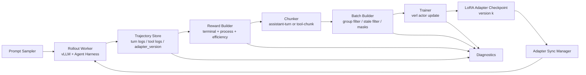
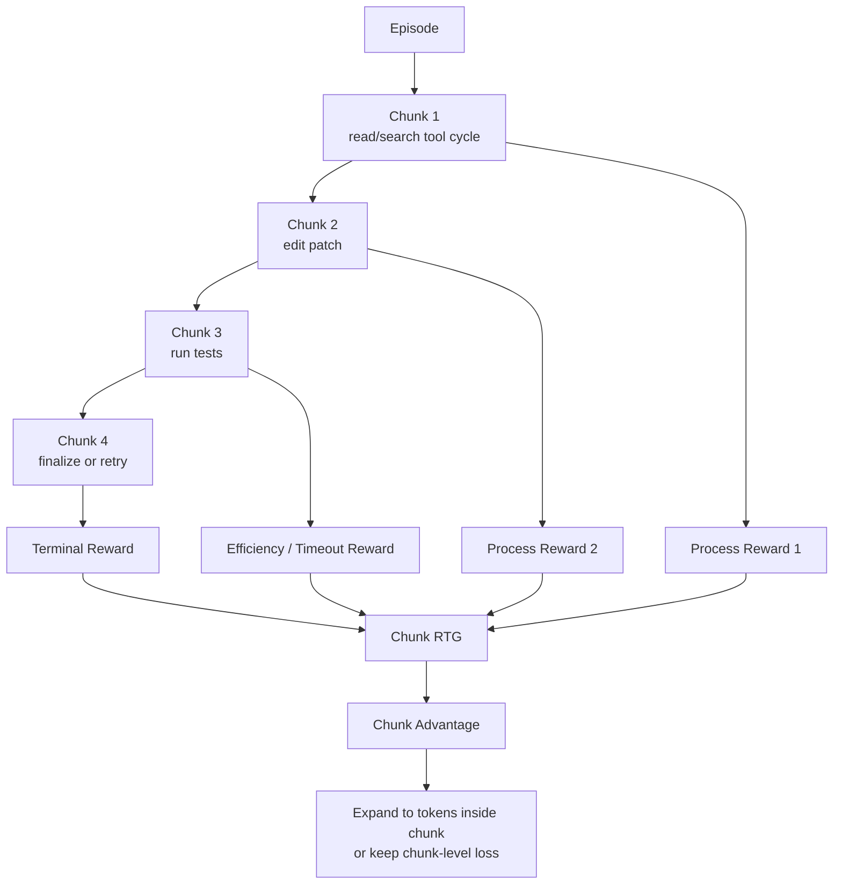

# 长链路 SWE Agent RL 在 verl 异步 Harness 中的落地研究

## 执行摘要

如果你的重点是把 **harness + verl async rollout/training 这条 agentic RL infra 链路做扎实**，而不是一开始就把算法做得极重，我的最终建议是：先把 **verl fully async / one-step-off async + DAPO 风格数据过滤与长度控制 + assistant-turn 或 tool-chunk 级 reward-to-go** 跑稳，再逐步加入 **轻量 process / efficiency reward**，最后再考虑 **GSPO 风格的序列级 off-policy 修正** 或 **完整的 chunk-level RL**。原因很直接：verl 已经原生支持 fully async、partial rollout、多轮 tool calling、rollout log-prob 直连训练、LoRA RL、以及 rollout correction；这些能力正好覆盖你现在最核心的工程问题——异步陈旧样本、长尾 rollout、工具调用中断恢复、LoRA 权重同步与长链路 credit assignment。[^1]

从“算法收益 / 工程成本”比来看，你最值得优先实现的不是 RLOO，也不是一上来就做完整 CISPO，而是三件事的组合：第一，**DAPO 式 group filtering + overlong shaping**，因为这在 verl 中几乎开箱即用，而且能直接处理 all-0/all-1 无梯度 prompt 组与长度膨胀；第二，**chunk 或至少 turn 级 reward-to-go / advantage**，因为 token 级广播在长链路 SWE 里 credit 太粗；第三，**轻量 process + time/efficiency reward**，因为 SWE 的 terminal reward 极稀疏，而 MiniMax、SWE-TRACE 与 SWE-PRM 这条线都显示中间过程监督和效率信号能显著改善长链路任务的学习信号与推理效率。[^2]

对你的 verl 异步 harness 来说，**chunk-level RL 的“最小可行形态”** 应该这样定义：把一个 chunk 设为“从一次 assistant 生成开始，到工具调用结束或最终提交 patch 为止”的语义动作段；对 chunk 而不是 token 计算 return-to-go、重要性比和 mask；如果环境还不支持中途 checkpoint / rollback，就先不做 IPA 里的 sequential rollback，只做 **chunked return + chunked advantage + chunk-aware reward logging**。这样你已经抓住了 arXiv:2512.24873v3 里最有价值、也最适合你当前工程重点的部分，而不会被最难的中途恢复与轨迹重采样拖住。[^3]

正式实验上，我建议把路线压缩成三段：**smoke** 阶段用 7B/8B dense instruct/coder 暖启模型，只验证 async 数据流与 reward 回填；**mid** 阶段在 7B/8B 上做 DAPO async baseline 与 process/efficiency reward；**final** 阶段换到 14B dense 模型，在 8×96GB 上做“token-level baseline vs chunk/turn-level credit”主结果，再加一个“是否启用 sequence-level off-policy correction”小消融。这样实验数不多，但每一步都直接映射到你要展示的 infra 贡献。R2E-Gym 提供了大规模可执行 SWE 环境，SWE-Gym 提供真实 GitHub issue 风格训练环境，而轻量 warm-start 则有充分依据：verl 的 fully async 多轮工具训练明确要求先做 tool-format SFT，另一篇多轮 SWE RL 工作也先做 rejection fine-tuning 再上 DAPO。[^4]

## 假设与判断标准

我在下面的建议里默认几件事：你的 harness 已经能导出 **逐 turn 的消息、工具调用、环境观测、patch/test 结果、episode 终止原因**；训练侧使用 **verl fully_async_policy 或 one-step-off async**；rollout 引擎优先是 **vLLM**；模型以 **dense instruct/coder warm start + LoRA** 为主；环境至少能做到 **deterministic replay 到某个 turn**，即便还不能做严格 checkpoint restore。若其中任何一条不成立，优先级会相应变化，尤其是 chunk-level rollback 与 LoRA runtime sync 两块。这个前提与 verl 当前的 async、多轮 tool calling、LoRA RL 支持是对齐的。[^5]

这里的“适用性”不是只看算法 paper 是否在别的 benchmark 上有效，而是看它是否同时满足四个标准：是否能改善 **长链路 sparse reward**；是否能容忍 **async policy staleness**；是否能融入 **verl 当前的 actor/rollout/ref/log-prob 逻辑**；以及是否能在你现在的资源规模下，以 **少量但可复现** 的实验交付结果。长链路 agent RL 的最近综述型工作也强调，reward shaping、算法选择、数据规模和环境稳定性共同决定成败，其中环境稳定性和奖励设计在长链路任务里尤其关键。[^6]

还有一个判断标准非常重要：你当前不是在做“纯算法论文复现”，而是在做 **agentic RL infra research**。因此，优先实现那些同时能解释“为什么异步能稳定训练长链路 SWE agent”的技术，而不是只在单轮数学题上有效的 loss trick。就这个维度而言，**windowed scheduling / stale-sample control / rollout correction / chunk-aware credit assignment** 这些系统-算法共设计，比纯换一个损失名词更有展示价值。MiniMax Forge、AReaL、verl fully async 文档和 GAC 都在不同层面指向了同一个事实：异步系统的关键不只是“更快”，而是要控制采样分布漂移与 stale-aligned update。[^7]

## 技术评估与优先级

下表给出你点名技术的**核心思想、对长链路 SWE 的价值、主要风险，以及与 verl async 的兼容度**。我把“兼容度”分成高 / 中 / 低，指的是在你当前 harness + verl 体系里，是否可以在不大改框架的前提下落地。

| 技术 / 论文 | 核心思想 | 为什么对长链路 SWE 有帮助 | 主要风险 | 与 verl async 兼容度 |
|---|---|---|---|---|
| **IPA / Chunk-level RL / arXiv:2512.24873v3** | 把多轮 agent 任务建模为 **Chunked MDP**，在 chunk 级别做 discounted return、importance sampling、masking，并提出从关键 chunk 回滚的 sequential rollback。[^3] | SWE 的真正决策单位通常不是 token，而是一次“读文件 / 搜索 / 编辑 / 跑测”的语义段。chunk 级别 discount 能避免 token 级折扣在长序列下信号衰减，并更接近真实 credit assignment。[^8] | chunk 边界定义不稳会导致 credit 泄漏；sequential rollback 需要环境 replay/checkpoint，工程复杂。[^8] | **高**，如果先做 chunked return / advantage；**中**，如果要做回滚重采样。[^9] |
| **Process reward** | 对中间行为给密集反馈。MiniMax 直接把中间错误行为纳入 process reward；SWE-TRACE 用 rubric PRM；SWE-PRM 在推理时做 course correction。[^10] | 终局测试通过/失败太稀疏时，process reward 能帮助模型学到“少绕路、少无效工具调用、少格式错误、少循环”。这对长链路 SWE 比对单轮问答更关键。[^10] | 最常见问题是 reward hacking：模型为了拿中间分而牺牲最终解题率；LLM-as-judge 还会带来漂移和风格偏置。[^11] | **高**。可以完全在 harness 侧异步计算并写回 trajectory。[^12] |
| **Efficiency / timeout reward** | 用任务完成时间、工具延迟、轨迹时长给相对效率奖励。MiniMax 明确把 completion time 纳入 reward。[^13] | 长链路 SWE 常见坏行为不是“不会修”，而是“会修但极慢、极绕、极长”。效率奖励可以直接抑制 token 膨胀和无用搜索。[^14] | 过早加大效率权重会把模型推成“短但是草率”，出现 premature stop。[^13] | **高**。你的 harness 最清楚 wall-clock、tool latency、timeout。[^15] |
| **Reward-to-go** | 用从当前位置到轨迹结尾的累计回报，而不是全轨迹同一标量；MiniMax把它用于 variance reduction，verl 里也直接按 reverse cumsum 实现。[^16] | 在长链路任务里，它是最基础、最划算的 variance reduction；如果再配合 chunk/turn 边界，就能显著改善前段动作的 credit。[^16] | 仅做 token-level RTG 仍然太细；若 reward 仍只在终局出现，纯 token RTG 改善有限。[^17] | **非常高**。你几乎只需改 advantage builder。[^18] |
| **MiniMax Forge 系统思路** | Forge 提供 agent-native 接口、**windowed FIFO** 约束异步训练分布漂移、prefix tree merging 去冗余前缀。[^19] | 对你的 harness 最有价值的不是他们的闭源规模，而是这两个可迁移的思想：限制“先完成的短样本”过度进入训练；减少多轮轨迹共有前缀重复计算。[^20] | prefix tree merging 对训练栈侵入较深；window 过小会回退到近同步，过大又会漂移。[^20] | **高**（windowed scheduling）；**中低**（prefix merging）。[^20] |
| **CISPO** | 不裁剪 token update，而是裁剪 importance sampling weight，尽量让所有 token 保持梯度，同时稳定 MoE RL。[^21] | 对有 stale/off-policy 问题的长轨迹、尤其是 MoE 大模型，CISPO 的思路很有吸引力。[^21] | 它本质上引入偏差来换稳定性；在 dense 7B–14B、小规模实验里，工程实现成本通常高于直接做 DAPO/GSPO 风格序列修正。[^22] | **中**。可自定义 loss，但不是 verl 现成主线。[^23] |
| **DAPO** | decoupled clip、dynamic sampling / group filtering、token-level loss、overlong reward shaping。verl 原生 recipe 支持。[^24] | 它是你最现实的起点：能先把无效 prompt 组、长度膨胀和基础 RL 稳定性处理好，再往上叠 turn/chunk credit。[^25] | 主要问题是仍以 token-level 为主，不天然解决多轮 credit；如果只停在 DAPO，会更像“async RL 工程复现”而不是“长链路 SWE RL”。[^26] | **非常高**。verl 文档、async recipe、group filtering、overlong shaping 都已就位。[^27] |
| **DrGRPO** | 修正 GRPO 的 length bias，用全局常数归一化，减少错误轨迹被“拉长”的现象。verl 里直接有配置。[^28] | 对长链路 SWE，长度偏置本来就是大问题；你如果短期仍保留 token-level GRPO/DAPO 风格优化，DrGRPO 很值得开。[^28] | 它解决的是“长度偏置”，不是“长链路 credit 粒度”；没有 turn/chunk reward 时收益会被稀疏 reward 限制。[^29] | **高**。几乎只是配置问题。[^30] |
| **GSPO** | 用**序列似然**定义 importance ratio，做 sequence-level clipping、rewarding 与优化；Qwen 明确指出它更稳定、更适合 MoE，并且更适合 disaggregated / partial rollout / multi-turn RL。[^31] | 它对 async harness 非常有吸引力，因为 sequence-level ratio 对训练/推理引擎差异更宽容，还可能直接复用 rollout engine 的 likelihood，减少 old_log_prob 重算。[^31] | 对极长、多分支 SWE 轨迹，纯 sequence-level 仍然偏粗；若不配合 turn/chunk decomposition，容易“全段同奖同罚”。[^32] | **高到中高**。如果你愿意改 loss，是很好的第二阶段升级。[^33] |
| **RLOO** | 用 leave-one-out baseline 的 REINFORCE，简单、低内存、sequence-level reward/advantage。[^34] | 适合 smoke baseline：结构简单、没有 critic、便于验证 reward 回填与 async 训练链路。[^35] | 对长链路 SWE 过于粗糙；SALT 之类后续工作正是通过给 RLOO/GRPO 加 step-level advantage 来修这个问题。[^36] | **高**，但更适合“基线 / 对照”，不适合做主线。[^35] |

在优先级上，我建议如下。

| 级别 | 建议实现项 | 简短理由 |
|---|---|---|
| **必须做** | **DAPO 式 baseline**、**reward-to-go 改到 turn/chunk 级**、**轻量 process + efficiency reward**、**rollout log-prob 由 rollout 产生并带版本号入库** | 这四项共同覆盖了“有梯度、梯度不歪、长链路 credit 更合理、异步不至于乱”。它们都能直接嵌进 verl 当前 async 体系。[^37] |
| **应该做** | **windowed FIFO / bounded queue visibility**、**sequence-level RS / IS**、**DrGRPO** | 这些能把 async 漂移、easy-sample drift、长度膨胀进一步压下来；工程代价也比完整 GSPO/CISPO 小。[^38] |
| **可以做** | **GSPO 风格 sequence loss**、**IPA 的 chunk-level mask / IS**、**学习型 PRM**、**GAC** | 这是第二阶段“把算法做漂亮”的部分；对论文味道更强，但不该阻塞主线交付。[^39] |
| **初期避免** | **把 RLOO 当主算法**、**一上来完整 CISPO**、**立即上 HCAPO/重 hindsight critic** | 这些要么粒度太粗，要么更偏大规模/高陈旧/大模型场景，要么会明显加重系统复杂度。[^40] |

## verl 异步落地方案

下面给出**你最应该在 verl async 里实现的数据流和训练逻辑**。我刻意把方案设计成“先可跑，再可发表”的顺序。



**数据流与陈旧控制。** 在 verl fully async 里，优先使用 rollout 侧生成的 old log-prob，而不是训练侧重算，因为文档明确指出 async 下 old log-prob 必须和 rollout 参数版本、token 一一对应；同时，`bypass_mode=true` 是当前 fully async 的默认建议路径。先从 **metrics-only 或 PPO-clip + rejection sampling** 开始，监控 off-policy gap；只有当 sequence-level outlier 仍严重时，再切到显式 IS 的 REINFORCE / 自定义 sequence-level loss。这样做的好处是：你可以先把 async 链路跑通，再逐步增强 correction，而不是一开始把 loss 和系统两边都搞复杂。[^41]

**LoRA 同步。** verl 已经支持在 FSDP/FSDP2 后端下使用 PEFT LoRA，并兼容 vLLM/sglang rollout；vLLM 也支持运行时动态加载 / 卸载 LoRA adapter。对你的 async harness，我建议把每一批 rollout 都打上 `adapter_version`，训练器只消费“未超过 K 个版本陈旧”的样本；版本跨越过大就直接丢弃或只用于 diagnostics。这样比“盲目同步最新 adapter”更稳，也更容易解释 stale sample 的来源。运行时 LoRA 更新功能有安全告警，因此只建议在受信开发环境里使用。[^42]

**Group filtering。** DAPO 的 `filter_groups.enable` 很适合先原样复用，但不建议只用 `acc`。对于 SWE，你更应该把过滤指标改成 `seq_final_reward` 或 `resolved_or_timeout_filtered_reward`，否则极容易把“全 0 但包含有价值中间行为”的 prompt 过滤掉。最稳妥的做法是：早期 smoke 用 `acc`；中期开始切成“终局 reward + process reward 的混合指标”，并保留少量 all-0 prompt 作 replay diagnostics。verl 文档已经说明 group filtering 的机制与 batch 对齐方式。[^43]

**Chunking 策略。** 先不要做最细粒度 token chunk。第一版建议把一个 chunk 定义成：从一次 assistant 输出开始，到一个工具调用完成、或 agent 给出最终 patch / final answer 为止。这样 chunk 边界天然对应“一个高层子目标”。如果你的日志还不够规范，就退一步先做 **assistant-turn 级**；因为 turn-level reward design、SALT 和 HCAPO 都说明，哪怕只从 trajectory-level 广播切到 turn/step-level，稳定性和效果都会更好。等日志稳定后，再把 assistant-turn 切成“思考文本 chunk + 工具调用 chunk + 工具返回后决策 chunk”。[^44]



**Turn-level 还是 chunk-level advantage。** 如果你的目标是“最快做出稳定结果”，我建议第一版上 **turn-level advantage**；如果你的目标是“更像一篇长链路 agent RL 论文”，第二版上 **chunk-level advantage**。前者实现便宜，只要在日志里把每个 assistant turn 的过程奖励和终局 reward-to-go 聚合起来即可；后者更符合 IPA 对语义决策单位的定义，也更适合 SWE 这种一个 turn 里可能跨越多个文件与工具交互的环境。我的判断是：**turn-level 适合作为 first success，chunk-level 适合作为主结果**。[^45]

**Reward shaping schedule。** 小模型和早期训练更依赖 dense reward；更大模型与后期训练则应该让 sparse terminal reward 占主导。这与长链路 agent RL 的系统性研究一致：小模型更吃 staged/curriculum reward，而大模型往往更适合较简单、但稳定的 reward 设计。同时，环境稳定性本身就是训练成败的关键变量，所以你的 harness 里所有 Docker / repo reset / timeout / flaky test 统计都要单独追踪。建议的 schedule 是：前 20% 训练步数，`R = 0.5 terminal + 0.3 process + 0.2 efficiency`；中段降到 `0.7 + 0.2 + 0.1`；最后阶段只保留 `0.9 + 0.1 + small overlong penalty`。如果 solved-rate 开始掉而长度继续下降，说明效率奖励过强。[^46]

**建议的 YAML-like 起始配置** 可以长这样：

```yaml
trainer:
  strategy: fsdp2

actor_rollout_ref:
  rollout:
    name: vllm
    mode: async
    calculate_log_probs: true
    multi_turn:
      enable: true
      max_user_turns: 24
      max_assistant_turns: 24
  actor:
    use_rollout_log_probs: true
    ppo_mini_batch_size: 8
    loss_agg_mode: token-mean
    policy_loss:
      loss_mode: bypass_mode

algorithm:
  filter_groups:
    enable: true
    metric: seq_final_reward
    max_num_gen_batches: 4
  rollout_correction:
    rollout_is: null
    rollout_rs: sequence
    rollout_rs_threshold: 2.0
    bypass_mode: true
    loss_type: ppo_clip

async_training:
  require_batches: 1
  trigger_parameter_sync_step: 2
  staleness_threshold: 0.25
  partial_rollout: true

reward_model:
  overlong_buffer:
    enable: true
    len: 1024
    penalty_factor: 0.2
```

这个配置本质上是“**先稳定 async + 先过滤 outlier + 先限制长度**”，再逐步升级。上面出现的关键开关都直接来自 verl 的 fully async、rollout correction、DAPO、multi-turn partial rollout 文档。[^47]

如果你要做第二阶段的 **sequence / chunk-aware off-policy 版本**，我建议把新增逻辑限定在 `advantage builder + policy loss` 两处，而不是改整个 trainer。思路是：保持 `adapter_version`、`turn_offsets`、`chunk_offsets` 在 batch schema 内；先按 chunk 聚合 reward-to-go，再决定是把 chunk advantage 扩展回 token，还是直接做 sequence/chunk clip。若你决定向 GSPO 靠拢，最大的工程收益在于它对 inference engine likelihood 更宽容，理论上更适合 partial rollout 和 disaggregated async。[^33]

**必须监控的指标** 我建议分成四类。系统类看 `trainer/idle_ratio`、`rollouter/idle_ratio`、`stale_samples_processed`、`partial_ratio`；off-policy 类看 `rollout_corr/kl`、`log_ppl_abs_diff`、`chi2_token`；任务类看 resolved-rate、timeout-rate、平均 turns、平均 tool 次数、平均 wall-clock、平均 tokens per resolved；行为类看 invalid tool rate、重复搜索率、空编辑率、无效测试重跑率。这些指标里前两类大部分已经被 verl async / rollout correction 文档明确推荐。[^48]

## 最小实验与时间线

为了把实验数压到最低，同时又能体现你真正的贡献，我建议只做三组实验家族。数据上，SWE-Gym 提供 **2,438** 个真实 Python SWE 训练任务与 Lite split；R2E-Gym 提供 **8.1K+** 的可执行合成环境，适合作为更大规模训练池；另一个长链路 agent RL 研究显示，数据规模存在“甜点区”，约 **1K** 左右、难度混合合理时可兼顾效果与泛化，这也支持你先做收敛性而不是盲目堆数据。[^49]

| 阶段 | 资源与模型 | 数据 | 关键配置 | 你要看的信号 | 通过标准 |
|---|---|---|---|---|---|
| **Smoke** | **2–4×96GB**；7B/8B dense instruct/coder warm start；LoRA `r=32` | SWE-Gym Lite 100–200 题或其 234 Lite split 的子集。[^50] | `rollout.n=2~4`，`staleness_threshold=0` 或 one-step-off，terminal reward 为主，仅保留格式/非法工具轻罚。 | episode 是否能完整闭环；reward 是否能回填；LoRA 版本是否对齐；async 和 sync 的 resolved-rate / avg turns 是否同量级。 | 无 NaN；>95% episode 正常终止；>98% reset 成功；reward 日志与 patch/test 结果一致；async 吞吐优于 sync。[^51] |
| **Mid** | **4×96GB**；同一 7B/8B 模型；LoRA `r=32~64` | R2E-Gym 400–800 题 + SWE-Gym 150–250 题混合；按“合成大池 + 真实锚点”组织。[^52] | fully async；`rollout.n=4~6`；`trigger_parameter_sync_step=2`；`staleness_threshold=0.25~0.5`；开启 group filtering、overlong shaping、process/efficiency reward。 | reward 曲线是否更平稳；长度/时间是否下降而 solved-rate 不掉；stale 样本比例是否受控。 | 相比 sparse-only baseline，dev resolved-rate 有 **+2~4pt**；avg turns 或 tokens 降 **10%+**；off-policy 指标不爆。[^53] |
| **Final** | **8×96GB**；14B dense instruct/coder；LoRA `r=64` | 主训练池先用 R2E-Gym 1K–1.5K，后半程混入 SWE-Gym 300–500 题；保持 active prompt pool 在 1K 左右，不必一开始追求全量。[^54] | 主对比做两条：A=token-level DAPO async，B=turn/chunk-level RTG + process/efficiency；可选一个小消融：是否加 sequence-level RS / GSPO-like loss。 | 主结果是否来自更好的 credit assignment，而不只是更长训练；效率和 solved-rate 是否同时改善。 | 相比 A，B 在固定 dev split 有 **+3~6pt** resolved-rate 或 pass proxy；timeout 下降；tokens per resolved 下降；训练曲线更稳。[^55] |

如果你想把实验再压缩一层，我建议只保留这三个**必做对比**：**同步 vs 异步**，**稀疏终局奖励 vs 加 process/efficiency**，**token-level credit vs turn/chunk-level credit**。这三组已经足以讲清楚你的故事，而且不会把精力耗散在 RLOO、CISPO、HCAPO 这种更偏“附加算法论文点”的方向上。DeepSWE 的经验也说明，纯 0/1 outcome reward 在足够强的模型和足够稳定的系统上能工作；但你当前资源明显更小，因此更现实的做法是先用 dense shaping 和暖启把优化难度降下来。[^56]

建议的简短时间线如下。这里默认你平时用 **2–4 卡** 做开发，最后切到 **8 卡** 做正式跑数。

| 周期 | 任务重点 | 成果物 |
|---|---|---|
| **第 1 周** | 跑通 smoke：sync / one-step-off / fully async 三种数据流；完成 reward 回填、episode 存储、adapter_version 记录。 | 一份 W&B 面板：吞吐、终止率、reset 成功率、reward 一致性。[^57] |
| **第 2 周** | 在 7B/8B 上加入 DAPO group filtering、overlong shaping、轻量 process/efficiency reward。 | 第一条稳定的 async baseline；能证明“异步不是在乱学”。[^58] |
| **第 3 周** | 实现 turn-level，再升级到 chunk-level RTG / advantage；加入 windowed queue visibility。 | 主创新版本；至少一个 dev split 上出现稳定增益。[^59] |
| **第 4 周** | 8 卡正式实验；跑 token-level baseline vs chunk/turn-level 版本；再做一个 sequence-level correction 小消融。 | 最终图表、表格、case study。[^33] |

## 风险与局限

最大的失败模式通常不是“loss 不对”，而是**系统先把数据分布玩坏了**。异步训练最常见的问题是陈旧样本导致的 off-policy gap 累积，既可能表现为 solved-rate 下降，也可能表现为 reward 看起来还在涨，但行为已经明显变差。AReaL、GAC 与 verl rollout correction 文档都强调，异步必须显式控制陈旧度、监控不匹配指标，并在必要时做 rejection sampling 或更强的 sequence-level correction。你的第一目标不应该是把 `staleness_threshold` 开很大，而是把它稳定压在一个“能换来吞吐，但还不会拉坏分布”的中间区间。经验上，我更倾向于先从 **0.25 或更低** 开始。[^60]

第二个风险是**process / efficiency reward 被 exploit**。一旦模型学会“少调工具、少输出、早点结束”可以拿到不错的过程分，它就可能牺牲真正的 resolved-rate。你的规避方式不是“别加过程奖励”，而是把它做成 curriculum：前期强一些，后期明显降权；并且把所有效率改善都和 resolved-rate 绑定观察。如果平均 tokens、turns 与 wall-clock 在下降，但 pass proxy 也同步下降，那就不是更高效，而是被 reward 误导了。MiniMax 的 completion-time reward 思路和 DAPO 的 overlong shaping 都值得保留，但都不应超过终局 reward。[^61]

第三个风险是**chunk 边界定义不稳**。如果 chunk parser 把一次完整的“搜索→读取→编辑→测试”拆得太碎，credit 会回到 token-level 的高方差老路；如果又拆得太粗，chunk-level 就会退化成 trajectory-level 广播。我的建议是：第一版只用 **assistant-turn 或 tool-cycle**；每个样本都记录 `chunk_offsets`、`chunk_type`、`chunk_terminal_flag`，然后抽样人工审查几十条轨迹。如果连人工看都说不清“某个 chunk 在做什么”，那这个粒度不能进训练。这个问题在 IPA、turn-level reward design、SALT 一类工作里，本质上都是“把 credit 粒度对齐到真实决策单位”。[^62]

第四个风险是**LoRA adapter skew 和 partial rollout 恢复错误**。vLLM 支持动态 LoRA 更新，但它的设计目标是灵活服务，不是替你自动保证 RL 语义正确；而 verl fully async 的 partial rollout 也要求中断与恢复发生在安全状态。如果 rollout worker 继续拿旧 adapter 生成，trainer 却把样本当最新策略数据训练，或者中断点落在工具调用的半状态上，你会得到很难排查的 “训练看似正常、行为持续变差”。因此，adapter_version、tool_state_hash、safe interrupt point 这三个字段必须放进 trajectory schema。[^63]

最后还有两点局限需要明说。其一，**IPA / ROME / Forge / MiniMax-M2.5 这些 2026 年的新工作或技术博客，公开信息已经足够给出清晰方法启发，但并没有像 verl-DAPO 那样提供与你当前栈完全对齐、可直接复现的开源 recipe**；因此我对它们的建议更偏“可迁移思想”，而不是“照抄配置”。其二，**你现在的资源更接近 7B–14B dense 的可控实验区间**；而 DeepSWE、R2E-Gym、长上下文 SWE RL 主结果很多是 32B 或 72B 级别，所以你应该把目标定成“证明异步 infra + 长链路 credit assignment 有效”，而不是短期内追平大规模 SOTA 的绝对分数。[^64]

如果我要把最终建议压缩成一句话，那就是：**先用 verl 原生 async 能力把 DAPO 式 baseline 跑稳，再把你的论文点放在“turn/chunk-level credit assignment + process/efficiency reward + bounded-staleness async scheduling”这条线上；GSPO 可以作为第二阶段增强，CISPO 则更适合你以后转 MoE 或更高陈旧度时再上。** 这条路线最符合你现在的资源约束，也最能体现你的 harness 与 verl async 基础设施价值。[^65]

## 参考链接

[^1]: verl fully async 文档：<https://verl.readthedocs.io/en/latest/advance/fully_async.html>
[^2]: verl DAPO recipe 文档：<https://verl.readthedocs.io/en/latest/algo/dapo.html>
[^3]: IPA / Chunk-level RL（arXiv:2512.24873v3）：<https://arxiv.org/html/2512.24873v3>
[^4]: SWE Agent RL（arXiv:2504.07164）：<https://arxiv.org/abs/2504.07164>
[^5]: verl fully async 文档：<https://verl.readthedocs.io/en/latest/advance/fully_async.html>
[^6]: 长链路 agent RL 综述（arXiv:2603.21972v1）：<https://arxiv.org/html/2603.21972v1>
[^7]: MiniMax Forge 博客：<https://huggingface.co/blog/MiniMax-AI/forge-scalable-agent-rl-framework-and-algorithm>
[^8]: IPA / Chunk-level RL（arXiv:2512.24873v3）：<https://arxiv.org/html/2512.24873v3>
[^9]: verl fully async 文档：<https://verl.readthedocs.io/en/latest/advance/fully_async.html>
[^10]: MiniMax Forge 博客：<https://huggingface.co/blog/MiniMax-AI/forge-scalable-agent-rl-framework-and-algorithm>
[^11]: OpenReview SWE-PRM 相关讨论：<https://openreview.net/forum?id=H9wMe1G76j>
[^12]: verl fully async 文档：<https://verl.readthedocs.io/en/latest/advance/fully_async.html>
[^13]: MiniMax Forge 博客：<https://huggingface.co/blog/MiniMax-AI/forge-scalable-agent-rl-framework-and-algorithm>
[^14]: MiniMax Forge 博客：<https://huggingface.co/blog/MiniMax-AI/forge-scalable-agent-rl-framework-and-algorithm>
[^15]: MiniMax Forge 博客：<https://huggingface.co/blog/MiniMax-AI/forge-scalable-agent-rl-framework-and-algorithm>
[^16]: MiniMax Forge 博客：<https://huggingface.co/blog/MiniMax-AI/forge-scalable-agent-rl-framework-and-algorithm>
[^17]: IPA / Chunk-level RL（arXiv:2512.24873v3）：<https://arxiv.org/html/2512.24873v3>
[^18]: verl core_algos.py：<https://github.com/volcengine/verl/blob/main/verl/trainer/ppo/core_algos.py>
[^19]: MiniMax post-training experience：<https://www.minimax.io/news/post-training-experience-and-insights-for-agent-models>
[^20]: MiniMax Forge 博客：<https://huggingface.co/blog/MiniMax-AI/forge-scalable-agent-rl-framework-and-algorithm>
[^21]: CISPO 论文（arXiv:2506.13585）：<https://arxiv.org/pdf/2506.13585>
[^22]: CISPO 论文（arXiv:2506.13585）：<https://arxiv.org/pdf/2506.13585>
[^23]: CISPO 论文（arXiv:2506.13585）：<https://arxiv.org/pdf/2506.13585>
[^24]: verl DAPO recipe 文档：<https://verl.readthedocs.io/en/latest/algo/dapo.html>
[^25]: verl DAPO recipe 文档：<https://verl.readthedocs.io/en/latest/algo/dapo.html>
[^26]: verl DAPO recipe 文档：<https://verl.readthedocs.io/en/latest/algo/dapo.html>
[^27]: verl DAPO recipe 文档：<https://verl.readthedocs.io/en/latest/algo/dapo.html>
[^28]: verl GRPO / DrGRPO 文档：<https://verl.readthedocs.io/en/latest/algo/grpo.html>
[^29]: verl GRPO / DrGRPO 文档：<https://verl.readthedocs.io/en/latest/algo/grpo.html>
[^30]: verl GRPO / DrGRPO 文档：<https://verl.readthedocs.io/en/latest/algo/grpo.html>
[^31]: GSPO 论文（arXiv:2507.18071）：<https://arxiv.org/pdf/2507.18071>
[^32]: GSPO 论文（arXiv:2507.18071）：<https://arxiv.org/pdf/2507.18071>
[^33]: GSPO 论文（arXiv:2507.18071）：<https://arxiv.org/pdf/2507.18071>
[^34]: RLOO 论文（arXiv:2402.14740）：<https://arxiv.org/pdf/2402.14740>
[^35]: Hugging Face TRL RLOO trainer：<https://huggingface.co/docs/trl/en/rloo_trainer>
[^36]: ACL Anthology 2026 findings-eacl.247：<https://aclanthology.org/2026.findings-eacl.247.pdf>
[^37]: verl fully async 文档：<https://verl.readthedocs.io/en/latest/advance/fully_async.html>
[^38]: MiniMax Forge 博客：<https://huggingface.co/blog/MiniMax-AI/forge-scalable-agent-rl-framework-and-algorithm>
[^39]: GSPO 论文（arXiv:2507.18071）：<https://arxiv.org/pdf/2507.18071>
[^40]: Hugging Face TRL RLOO trainer：<https://huggingface.co/docs/trl/en/rloo_trainer>
[^41]: verl fully async 文档：<https://verl.readthedocs.io/en/latest/advance/fully_async.html>
[^42]: verl PPO LoRA 文档：<https://verl.readthedocs.io/en/latest/advance/ppo_lora.html>
[^43]: verl DAPO recipe 文档：<https://verl.readthedocs.io/en/latest/algo/dapo.html>
[^44]: Turn-level reward design（arXiv:2505.11821）：<https://arxiv.org/abs/2505.11821>
[^45]: Turn-level reward design（arXiv:2505.11821）：<https://arxiv.org/abs/2505.11821>
[^46]: 长链路 agent RL 综述（arXiv:2603.21972v1）：<https://arxiv.org/html/2603.21972v1>
[^47]: verl fully async 文档：<https://verl.readthedocs.io/en/latest/advance/fully_async.html>
[^48]: verl fully async 文档：<https://verl.readthedocs.io/en/latest/advance/fully_async.html>
[^49]: OpenReview 长链路 agent RL 数据规模研究：<https://openreview.net/forum?id=lpFFpTbi9s>
[^50]: SWE-Gym GitHub：<https://github.com/SWE-Gym/SWE-Gym>
[^51]: verl one-step-off async 文档：<https://verl.readthedocs.io/en/latest/advance/one_step_off.html>
[^52]: SWE Agent RL（arXiv:2504.07164 PDF）：<https://arxiv.org/pdf/2504.07164>
[^53]: verl DAPO recipe 文档：<https://verl.readthedocs.io/en/latest/algo/dapo.html>
[^54]: SWE Agent RL（arXiv:2504.07164 PDF）：<https://arxiv.org/pdf/2504.07164>
[^55]: IPA / Chunk-level RL（arXiv:2512.24873v3）：<https://arxiv.org/html/2512.24873v3>
[^56]: DeepSWE 博客：<https://www.together.ai/blog/deepswe>
[^57]: verl one-step-off async 文档：<https://verl.readthedocs.io/en/latest/advance/one_step_off.html>
[^58]: verl DAPO recipe 文档：<https://verl.readthedocs.io/en/latest/algo/dapo.html>
[^59]: IPA / Chunk-level RL（arXiv:2512.24873v3）：<https://arxiv.org/html/2512.24873v3>
[^60]: AReaL / GAC 异步训练（arXiv:2505.24298）：<https://arxiv.org/abs/2505.24298>
[^61]: MiniMax Forge 博客：<https://huggingface.co/blog/MiniMax-AI/forge-scalable-agent-rl-framework-and-algorithm>
[^62]: IPA / Chunk-level RL（arXiv:2512.24873v3）：<https://arxiv.org/html/2512.24873v3>
[^63]: vLLM LoRA 文档：<https://docs.vllm.ai/en/stable/features/lora/>
[^64]: MiniMax-M2.5 README：<https://github.com/MiniMax-AI/MiniMax-M2.5/blob/main/README.md>
[^65]: verl DAPO recipe 文档：<https://verl.readthedocs.io/en/latest/algo/dapo.html>
