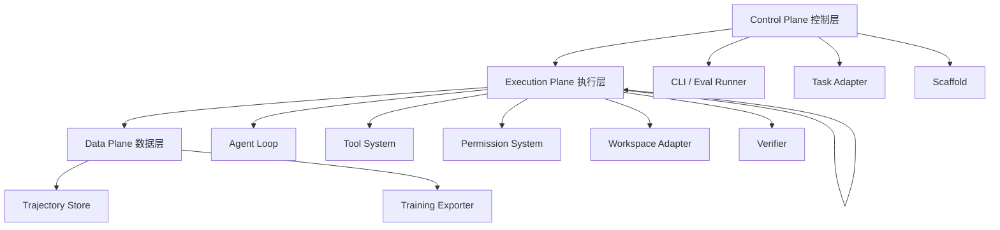
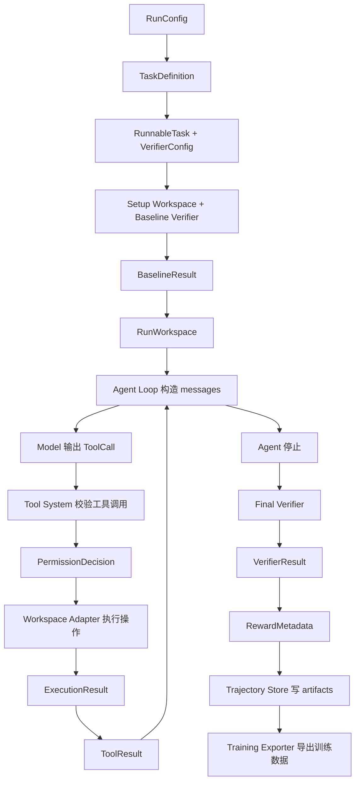

0，[01-agentic-loop.md](docs/build-your-own/01-agentic-loop.md) 
当前这样一层一层读claude code的实现对我来说有点太慢了，有没有什么能够更快开始的方式，例如先读完某些
@docs 中RepoHarness的设计文档后就可以直接开工而不需要慢慢读完全部讲解

可以。更快的方式是：**不要继续按 Claude Code 源码逐层精读，而是把 RepoHarness 设计文档当成实现规格，Claude Code 只作为遇到具体模块时的参考源码。**

我建议你现在采用这个顺序。

**最短开工阅读包**

先读这 6 篇就可以开始写代码：

1. [docs/02-system-architecture.md](/Users/roger/Desktop/claude-code/docs/02-system-architecture.md)  
   看清楚整个系统有哪些模块。

2. [docs/11-object-model-config-and-data-flow.md](/Users/roger/Desktop/claude-code/docs/11-object-model-config-and-data-flow.md)  
   这篇最重要，直接定义后续代码里的核心对象、配置和端到端数据流。

3. [docs/06-task-dataset-and-environment-adapters.md](/Users/roger/Desktop/claude-code/docs/06-task-dataset-and-environment-adapters.md)  
   先实现任务加载、baseline、正式运行工作区边界。

4. [docs/05-workspace-sandbox-and-permissions.md](/Users/roger/Desktop/claude-code/docs/05-workspace-sandbox-and-permissions.md)  
   先做 local process mode、路径边界、timeout、权限模式。

5. [docs/04-tool-system-and-orchestration.md](/Users/roger/Desktop/claude-code/docs/04-tool-system-and-orchestration.md)  
   实现 `list_files`、`read_file`、`search`、`git_diff`，再加 `apply_patch`、`bash`、`run_tests`。

6. [docs/03-agent-loop-and-message-protocol.md](/Users/roger/Desktop/claude-code/docs/03-agent-loop-and-message-protocol.md)  
   最后把模型调用、工具调用、工具结果回灌、停止原因串起来。

读完这 6 篇，你已经可以开工做第一个最小闭环：

```text
task.yaml
  -> create workspace
  -> run baseline verifier
  -> agent loop
  -> tool calls
  -> run_tests feedback
  -> final verifier
  -> final.diff / events.jsonl / metrics.json
```

**可以暂时不读完的部分**

这些可以边做边补，不需要阻塞开工：

- [docs/07-verifier-reward-and-evaluation.md](/Users/roger/Desktop/claude-code/docs/07-verifier-reward-and-evaluation.md)：实现 `run_tests` 和 final verifier 时再细读。
- [docs/08-trajectory-store-and-training-export.md](/Users/roger/Desktop/claude-code/docs/08-trajectory-store-and-training-export.md)：做 recorder 和导出格式时再读。
- [docs/09-agent-scaffolds-and-multi-agent.md](/Users/roger/Desktop/claude-code/docs/09-agent-scaffolds-and-multi-agent.md)：第一版先做 simple ReAct，不急着做 planner-coder-verifier。
- [docs/10-context-session-and-failure-diagnostics.md](/Users/roger/Desktop/claude-code/docs/10-context-session-and-failure-diagnostics.md)：长上下文、resume、失败诊断可以放到第二阶段。
- [docs/12-resume-narrative-and-demo-artifacts.md](/Users/roger/Desktop/claude-code/docs/12-resume-narrative-and-demo-artifacts.md)：项目做出最小演示后再用来包装简历叙事。

**Claude Code 源码怎么读更快**

不要继续从 `query.ts` 一层一层读。改成“实现哪个模块，才查哪个文件”：

- 写 agent loop 时，只查 `reference/claude-code-typescript-src/query.ts`。
- 写工具接口时，只查 `Tool.ts`、`toolExecution.ts`、`toolOrchestration.ts`。
- 写权限时，只查 `utils/permissions/permissions.ts` 和 Bash 相关权限文件。
- 写子 agent 或 scaffold 时，再查 `AgentTool`、`runAgent()`、`LocalAgentTask`。

也就是说，Claude Code 现在不是教材主线，而是**局部设计答案库**。

**我建议的最快实现路线**

第一阶段直接写这些模块：

1. `core objects + config`  
   按 `docs/11` 定义 `TaskDefinition`、`RunConfig`、`ToolResult`、`VerifierResult`、`TrajectoryEvent`。

2. `task loader + fixture task`  
   能从 YAML 读取一个本地 micro-repo 任务。

3. `local workspace adapter`  
   能复制仓库、初始化 Git、执行命令、保存 `final.diff`。

4. `read-only tools`  
   先做 `list_files`、`read_file`、`search`、`git_diff`，不用急着写文件。

5. `trajectory recorder`  
   先写 `events.jsonl` 和 `transcript.jsonl`。

6. `minimal agent loop with fake model`  
   先不用真实模型，用 scripted fake model 跑通工具调用协议。

7. `run_tests + final verifier`  
   把测试反馈和最终评测接上。

这样比继续读完整个 Claude Code 快很多，而且更贴近你的简历目标：你需要展示的是**agentic training harness 的工程闭环**，不是完整复刻 Claude Code。


1，02-system-architecture.md 讲解：
ans:
可以，我们从 [docs/02-system-architecture.md](/Users/roger/Desktop/claude-code/docs/02-system-architecture.md:1) 开始。你可以先把这个项目理解成一句话：

**RepoHarness 不是一个聊天机器人，而是一个“让模型在真实代码仓库里做任务、验证结果、记录全过程、导出训练数据”的软件工程智能体运行框架。**

**一、先建立整体心智模型**

RepoHarness 的完整目标不是“让模型回答一句话”，而是让模型完成这样的闭环：

```text
读取任务
-> 准备一个可执行代码仓库
-> 让模型多轮调用工具修改代码
-> 运行测试验证
-> 保存完整轨迹
-> 计算评测指标和奖励字段
-> 导出成训练数据
```

举个具体例子。假设有一个任务：

```yaml
id: calculator_divide_zero
repo: ./fixtures/buggy_calculator
issue: "修复 divide(1, 0) 没有正确报错的问题"
test_command: "pytest -q"
```

RepoHarness 要做的不是直接问模型“怎么修”，而是：

1. 创建一个干净的任务工作区。
2. 让模型读取 `calculator.py`。
3. 让模型搜索相关测试。
4. 让模型修改代码。
5. 让模型运行 `pytest -q`。
6. 把测试失败或通过的结果回填给模型。
7. 如果模型继续修改，再重复这个过程。
8. 最后强制运行 final verifier。
9. 保存 `final.diff`、`events.jsonl`、`metrics.json`、`verifier.json`。
10. 把这次运行导出为强化学习或者监督微调可以使用的数据。

这就是文档第 5 行说的“可重入的运行时闭环”：它不是一次性流水线，而是模型、工具、测试反馈之间的循环。

**二、三层架构：控制层、执行层、数据层**

文档把系统分成三层：[总体架构](/Users/roger/Desktop/claude-code/docs/02-system-architecture.md:3)。



**Control Plane 控制层**

控制层负责“这次要跑什么、怎么跑、跑多少、输出到哪里”。

它像一个调度台。它读取配置，但不亲自修改文件，也不亲自跑测试。

例如：

```yaml
model: gpt-5.5
tasks:
  - calculator_divide_zero.yaml
permission_mode: auto
execution_mode: local_process
max_turns: 20
output_dir: runs/
```

这里的 CLI / Eval Runner 会说：“我要跑这个任务，用这个模型，最多二十轮，输出到 `runs/`。”但它不应该自己去执行 `pytest`，也不应该自己解析测试结果。

**Execution Plane 执行层**

执行层是真正“干活”的地方。它包含：

- Agent Loop：控制模型一轮一轮行动。
- Tool System：定义模型能用哪些工具。
- Permission System：判断某个工具调用是否允许。
- Workspace Adapter：真正读写文件、执行命令、保存差异。
- Verifier：运行测试并结构化解析结果。

对于初学者，最关键的是理解 Agent Loop：

```text
模型看到任务
-> 模型请求调用工具
-> Harness 执行工具
-> 工具结果回到模型上下文
-> 模型继续下一轮
```

这就是 agent 和普通大模型调用的区别。普通调用是“一问一答”；agent loop 是“模型可以行动、观察结果、再行动”。

**Data Plane 数据层**

数据层负责“把过程完整记录下来，并变成训练数据”。

这层非常符合你的简历方向，因为它连接 agentic training 和 post-training。

它记录的不是一句最终答案，而是完整轨迹：

```json
{"event_type": "tool_requested", "tool_name": "read_file"}
{"event_type": "tool_completed", "tool_name": "read_file"}
{"event_type": "tool_requested", "tool_name": "apply_patch"}
{"event_type": "verifier_completed", "accepted": true}
```

这些数据后续可以导出成：

- SFT 数据：模型应该如何一步步调用工具。
- Reinforcement learning rollout 数据：状态、动作、观察、奖励。
- Preference pair 数据：同一个任务中，成功轨迹优于失败轨迹。

**三、每个核心模块到底负责什么**

文档第 35 行开始列了核心模块职责。你可以这样记：

**CLI / Eval Runner**

它是入口。负责读取配置、任务列表、模型参数、权限模式、输出目录。

它不应该直接执行工具。否则未来你想把本地执行换成 Docker 执行，就会很痛苦。

**Task Adapter**

它负责把不同来源的任务变成统一格式。

例如未来任务可能来自：

- 自己写的小型测试仓库。
- issue-style fixture。
- SWE-Bench Lite。
- GitHub Issue 或 Pull Request。

但 Agent Loop 不应该关心任务原来来自哪里。Agent Loop 只需要看到统一的 `RunnableTask`。

**Workspace / Sandbox Adapter**

它负责“仓库在哪里、命令在哪里执行、最终 diff 怎么保存”。

例如它要做：

```text
复制仓库
-> 初始化 Git
-> 执行命令
-> 捕获 stdout / stderr
-> 保存 final.diff
-> 清理临时环境
```

注意：文档特别强调 sandbox 不能夸大。这里的 Docker execution mode 只能说是“基于 Docker 的可执行仓库环境”，不能说是生产级安全沙箱。

**Agent Loop**

它是 agent 的心脏。

它维护：

```text
messages
turn_count
tool_call_count
last_verifier_result
agent_stop_reason
```

它做的事情是：

```text
call_model(messages, tools)
-> parse tool calls
-> run tools
-> append tool results to messages
-> decide continue or stop
```

**Tool System**

Tool System 不是简单的函数列表。它要定义工具契约。

一个工具至少要说明：

```text
名字是什么
输入 schema 是什么
输出 schema 是什么
是否只读
是否可以并发
是否具有破坏性
如何校验输入
如何截断输出
```

例如 `read_file` 是只读工具，可以并发；`apply_patch` 是写工具，默认不能和其他写工具并发。

**Permission System**

它只回答一个问题：这次工具调用是否允许？

例如模型请求：

```text
bash("rm -rf /")
```

Permission System 应该拒绝。  
但它不负责真正执行命令。真正执行命令的是 Workspace Adapter。

这就是文档第 69 行强调的边界：所有文件写入、patch 应用、进程执行，最终必须经过 Workspace / Sandbox Adapter。

**Verifier / Reward**

Verifier 负责运行测试并给出结构化结果。

例如：

```json
{
  "accepted": true,
  "pass_ratio": 1.0,
  "fail_to_pass": ["tests/test_calculator.py::test_divide_zero"],
  "pass_to_pass": ["tests/test_calculator.py::test_add"]
}
```

Reward 不是新的强化学习算法。它只是把 verifier 结果、成本、patch 大小等信息整理成训练可以使用的 reward metadata。

**Trajectory Store**

它负责保存完整运行产物。

不是只保存最终答案，而是保存：

```text
transcript.jsonl
events.jsonl
final.patch
final.diff
verifier.json
metrics.json
summary.md
```

这对于训练非常关键。没有 trajectory，就没有高质量 post-training 数据。

**Training Exporter**

它负责把一次运行转成训练格式。

例如同一条轨迹可以导出成：

```text
SFT JSONL
RL rollout JSONL
Preference pair JSONL
```

这就是 RepoHarness 和普通 coding agent 项目的核心差异：它从一开始就为训练数据生产设计。

**四、完整任务如何流过系统**

我们用 `calculator_divide_zero` 走一遍。

```text
1. CLI 读取 run_config.yaml
2. Task Adapter 读取 calculator_divide_zero.yaml
3. Workspace Adapter 复制 buggy_calculator 仓库
4. Verifier 跑 baseline tests，确认任务有效
5. Agent Loop 构造 messages
6. 模型请求 read_file("calculator.py")
7. Tool System 校验 read_file 输入
8. Permission System 允许只读工具
9. Workspace Adapter 读取文件
10. ToolResult 回到 messages
11. 模型请求 apply_patch(...)
12. Permission System 判断写入路径是否在 workspace 内
13. Workspace Adapter 应用 patch
14. 模型请求 run_tests
15. Verifier 产生 feedback result
16. 如果测试通过，Agent Loop 停止
17. Final verifier 再跑一次
18. Trajectory Store 保存所有产物
19. Training Exporter 导出训练数据
```

这里最重要的不变量是：**工具结果必须回到模型上下文**。如果模型读了文件，但读文件结果没有进入下一轮 messages，模型就等于“失忆”了。

**五、这篇文档真正想保护你避免什么问题**

它主要是在防止你把项目写成一个大脚本：

```python
load_task()
call_model()
run_bash()
write_file()
run_tests()
save_json()
```

这种写法短期能跑，但很快会崩，因为你无法清楚回答：

- 哪个模块拥有 workspace 边界？
- 哪个模块可以执行命令？
- 哪个模块负责记录 trajectory？
- 哪个模块负责 final verifier？
- 哪个模块可以被替换成 Docker 版本？
- 哪个模块可以被用于批量评测？
- 哪些数据可以导出给训练？

RepoHarness 的架构设计就是为了让这些边界从第一天就清楚。

**六、第一版应该怎么落地**

读完这篇后，不要急着实现所有模块。第一版最小闭环可以这样做：

```text
RunConfig
TaskAdapter
LocalWorkspaceAdapter
ToolSystem
PermissionSystem
AgentLoop
Verifier
TrajectoryRecorder
```

先不做：

```text
Docker execution mode
复杂多代理
远程执行
插件系统
完整训练导出
复杂 reward 公式
```

你的第一版目标应该是：

**让一个 micro-repo task 从 YAML 进入系统，模型通过工具修改代码，测试通过后保存 final.diff、events.jsonl、verifier.json 和 metrics.json。**

做到这个，你的项目就已经具备 agentic training harness 的核心雏形了。


2，11-object-model-config-and-data-flow.md 讲解
ans:  
好的，这篇 [docs/11-object-model-config-and-data-flow.md](/Users/roger/Desktop/claude-code/docs/11-object-model-config-and-data-flow.md:1) 是目前最适合作为**实现入口**的文档。它不是在讲某一个模块，而是在回答一个更基础的问题：

**RepoHarness 未来代码里到底有哪些核心对象？这些对象由哪个模块产生？又会被哪个模块消费？整个任务从配置文件到训练数据导出，中间经过哪些状态？**

你可以把这篇文档理解成 RepoHarness 的“对象模型总图”和“数据流说明书”。

**一、这篇文档为什么重要**

如果没有这篇文档，后续实现很容易变成这样：

```python
task = load_yaml(...)
workspace = copy_repo(...)
result = run_agent(...)
tests = run_pytest(...)
save_json(...)
```

短期看起来能跑，但很快会出现问题：

- `task` 里面到底是原始任务，还是已经准备好的可运行任务？
- `pytest` 结果是 baseline verifier、feedback verifier，还是 final verifier？
- 模型工具调用失败，是 `tool_error`，还是 `invalid_tool_call`？
- `final.diff` 应该从原始仓库算，还是从依赖安装后的 workspace 算？
- 训练导出应该读对话 transcript，还是读 events，还是读 verifier result？

这篇文档的作用就是提前统一这些概念，避免每个模块自己发明一套对象名称。

**二、未来源代码目录怎么理解**

文档第 7 行到第 24 行定义了未来目录结构：

```text
src/repo_harness/
  agent_loop/
  cli/
  evaluation/
  export/
  permissions/
  scaffolds/
  tasks/
  tools/
  trajectory/
  verifier/
  workspace/
```

这不是说现在每个目录都要马上实现完整功能，而是说明未来代码的职责边界。

你可以这样理解：

- `cli/`：用户从命令行启动一次运行。
- `tasks/`：读取任务文件，把任务变成标准对象。
- `workspace/`：准备仓库、执行命令、保存代码差异。
- `agent_loop/`：让模型多轮调用工具。
- `tools/`：定义 `read_file`、`apply_patch`、`run_tests` 等工具。
- `permissions/`：判断工具调用是否允许。
- `verifier/`：运行测试，判断任务是否完成。
- `trajectory/`：记录完整运行过程。
- `export/`：导出成训练数据。
- `scaffolds/`：定义 single-shot、ReAct、planner-coder-verifier 这些智能体运行策略。
- `evaluation/`：批量跑任务，统计成功率和失败原因。

对初学者来说，最重要的是：**这些目录不是按技术类型分的，而是按运行时责任分的。**

**三、RunConfig：一次运行的总控制文件**

文档第 28 行开始定义 `RunConfig`。它是一次单任务运行或者批量评测的总配置。

例如：

```yaml
run_id_prefix: local_eval
tasks:
  - tasks/repo_task_001.yaml
model:
  provider: openai
  model_id: example-model
  temperature: 0.2
  max_output_tokens: 4096
runtime:
  scaffold_id: simple_react
  execution_mode: local_process
  permission_mode: auto
  max_turns: 20
  max_tool_calls: 80
  timeout_sec: 900
workspace:
  output_dir: runs
  keep_workspace: true
  default_command_timeout_sec: 120
  max_tool_output_chars: 12000
```

它回答的是：

```text
跑哪些任务？
用哪个模型？
用哪种 agent scaffold？
工具在哪种执行环境中运行？
权限模式是什么？
最多跑多少轮？
输出保存到哪里？
```

举个例子，如果你想本地调试，可以设置：

```yaml
execution_mode: local_process
permission_mode: auto
keep_workspace: true
```

意思是：在本机工作区运行，允许常规任务内操作，运行结束后保留 workspace 方便你检查。

如果你未来做批量评测，就可能设置：

```yaml
execution_mode: docker
permission_mode: deny
keep_workspace: false
```

意思是：用 Docker-based executable repository environment 执行，非交互拒绝风险操作，运行后只保留 artifacts。

文档第 64 行特别提醒：批量评测默认不应该使用 `ask`，因为 `ask` 会等待人工确认，批量任务会卡住。

**四、核心对象：RepoHarness 的“名词表”**

文档第 66 行到第 84 行是最重要的表。我们不要死记，我把它分成四组。

**第一组：任务输入对象**

`TaskDefinition` 是原始任务定义。

它来自 YAML 或 JSON，例如：

```yaml
id: calculator_divide_zero
repo: ./fixtures/buggy_calculator
issue: "Fix division by zero handling"
test_command: "pytest -q"
timeout_sec: 120
tags: ["python", "unit-test"]
```

这是“用户或数据集给你的任务”。

`RunnableTask` 是经过 Task Adapter 标准化后的可运行任务。

它包含：

```text
task_id
issue_statement
repo_source
setup_command
verifier_config
metadata
```

也就是说，`TaskDefinition` 更像原始输入，`RunnableTask` 更像系统内部真正要执行的任务对象。

`VerifierConfig` 是测试配置。

它告诉 verifier：

```text
运行什么测试命令？
超时时间是多少？
哪些测试属于 fail-to-pass？
哪些测试属于 pass-to-pass？
用什么 parser 解析结果？
```

这里的 fail-to-pass 和 pass-to-pass 很关键：

- fail-to-pass：原本失败，修复后应该通过的测试。
- pass-to-pass：原本通过，修复后也必须继续通过的测试。

这就是软件工程 agent 评测和普通问答评测的区别：不仅要修好目标问题，还不能破坏已有功能。

**第二组：工作区和 baseline 对象**

`BaselineResult` 是正式 agent 运行前的质量门控。

它回答：

```text
依赖安装成功了吗？
测试命令能跑吗？
初始失败测试有哪些？
初始通过测试有哪些？
任务是不是 flaky？
正式 agent 应该从哪个 snapshot 开始？
```

这非常重要。因为如果一个任务一开始依赖就装不上，或者测试本身不稳定，那么 agent 做得再好也无法得到可靠训练信号。

`RunWorkspace` 是正式运行时的工作区对象。

它包含：

```text
run_id
workspace_path
repo_base_commit
execution_mode
artifact_dir
```

你可以把它理解成：“这次任务真正让 agent 操作的代码仓库副本”。

注意：`BaselineResult` 和 `RunWorkspace` 的分离是为了避免把 dependency setup 的副作用算成模型贡献。

举个例子：

```text
setup 阶段安装依赖，生成 .venv/
baseline 阶段运行 pytest，生成 .pytest_cache/
agent 阶段修改 calculator.py
```

最终 `final.diff` 应该只包含 `calculator.py` 的修改，不应该包含 `.venv/`、`.pytest_cache/` 这些环境副作用。

**第三组：agent loop 和工具对象**

`AgentLoopState` 是 agent 当前运行状态。

它包含：

```text
messages
turn_count
tool_call_count
last_verifier_result
agent_stop_reason
final_verifier_status
run_outcome
```

这里有三个字段非常容易混淆：

- `agent_stop_reason`：agent loop 为什么停。
- `final_verifier_status`：最终 verifier 的结果是什么。
- `run_outcome`：这次运行最终算成功、失败、无效，还是不确定。

例如：

```text
agent_stop_reason = feedback_tests_passed
final_verifier_status = failed
run_outcome = failed
```

这表示：agent 中间跑测试时以为通过了，所以停了；但停止后 final verifier 重新跑，发现回归或者环境问题，所以最终失败。

这三个字段拆开，是 RepoHarness 面向训练和评测的关键设计。

`ModelMessage` 是模型消息。

它可以是：

```text
system message
user task message
assistant message
tool result message
```

`ToolCall` 是模型请求执行的工具调用。

例如模型输出：

```json
{
  "tool_call_id": "call_001",
  "tool_name": "read_file",
  "arguments": {"path": "calculator.py"},
  "turn": 1
}
```

`PermissionDecision` 是权限系统的判断结果。

例如：

```json
{
  "decision": "allow",
  "mode": "auto",
  "matched_rule": "workspace_read",
  "reason": "read_file is allowed inside workspace",
  "requires_user_input": false
}
```

如果模型请求写入 workspace 外路径，可能得到：

```json
{
  "decision": "deny",
  "mode": "auto",
  "matched_rule": "outside_workspace",
  "reason": "path resolves outside run workspace",
  "requires_user_input": false
}
```

`ExecutionResult` 是 Workspace Adapter 执行命令或文件操作后的原始结果。

例如执行 `pytest -q` 后：

```json
{
  "exit_code": 1,
  "stdout_preview": "FAILED tests/test_calculator.py::test_divide_zero",
  "stderr_preview": "",
  "output_path": "artifacts/pytest_turn_3.txt",
  "duration_ms": 1830,
  "timeout": false
}
```

`ToolResult` 是 Tool System 把 `ExecutionResult` 包装后，准备回填给模型和 trajectory 的结果。

例如：

```json
{
  "tool_call_id": "call_004",
  "tool_name": "run_tests",
  "status": "failed",
  "content_preview": "1 failed, 5 passed",
  "error_type": "assertion_failure",
  "truncated": false,
  "artifact_paths": ["artifacts/pytest_turn_3.txt"]
}
```

区别是：

- `ExecutionResult` 偏底层，描述命令执行事实。
- `ToolResult` 偏 agent 协议，描述模型下一轮应该看到什么。

**第四组：评测、奖励和导出对象**

`VerifierResult` 是 verifier 的结构化结果。

例如：

```json
{
  "accepted": false,
  "pass_ratio": 0.83,
  "fail_to_pass": {
    "passed": [],
    "failed": ["tests/test_calculator.py::test_divide_zero"]
  },
  "pass_to_pass": {
    "passed": ["tests/test_calculator.py::test_add"],
    "failed": []
  },
  "exit_code": 1,
  "timeout": false,
  "error_type": "assertion_failure"
}
```

`RewardMetadata` 是 reward 相关字段。

它不是新的强化学习算法，而是训练系统可以消费的候选字段：

```json
{
  "reward_version": "repo_harness_reward_v0",
  "final_reward": 0.72,
  "components": {
    "accepted_bonus": 0.0,
    "pass_ratio": 0.83,
    "cost_penalty": 0.04,
    "patch_size_penalty": 0.02
  },
  "sources": ["final_verifier", "events", "final.diff"],
  "invalid_for_training": false
}
```

`TrajectoryEvent` 是事件记录对象。

几乎所有模块都会产生事件，例如：

```json
{"event_type": "tool_requested", "tool_name": "read_file"}
{"event_type": "permission_allowed", "tool_name": "read_file"}
{"event_type": "tool_completed", "tool_name": "read_file"}
{"event_type": "verifier_completed", "accepted": true}
```

`ExportRecord` 是训练导出的最终样本。

例如：

```text
SFT 样本
RL rollout 样本
Preference pair 样本
```

这就是从“agent 运行一次”到“训练数据一条”的最后一步。

**五、端到端数据流：一次任务完整怎么跑**

文档第 86 行到第 105 行给出完整数据流。我们用一个例子串起来。

假设任务是：

```text
修复 calculator.py 中除零错误处理
```

完整流程是：



用自然语言说就是：

1. Eval Runner 读取 `RunConfig`。
2. Task Adapter 读取任务 YAML，得到 `TaskDefinition`。
3. Task Adapter 校验并标准化，生成 `RunnableTask` 和 `VerifierConfig`。
4. Workspace Adapter 创建 setup workspace，安装依赖，跑 baseline verifier。
5. Baseline verifier 生成 `BaselineResult`。
6. 如果任务有效，创建正式 `RunWorkspace`。
7. Agent Loop 根据任务和 scaffold 构造初始 messages。
8. 模型输出工具调用，比如 `read_file`。
9. Tool System 校验工具名和参数。
10. Permission System 判断是否允许。
11. Workspace Adapter 真正执行读取、写入或命令。
12. Tool System 把底层执行结果转成 `ToolResult`。
13. Agent Loop 把 `ToolResult` 加回 messages。
14. 模型看到工具结果后继续下一轮。
15. 如果调用 `run_tests`，会触发 feedback verifier。
16. Agent 停止后，final verifier 强制重新运行。
17. Eval Runner 根据 final verifier 得到最终 `run_outcome`。
18. Reward module 生成 `RewardMetadata`。
19. Trajectory Store 保存 `final.patch`、`final.diff`、`verifier.json`、`metrics.json`、`summary.md`。
20. Training Exporter 导出训练数据。

这条链路就是 RepoHarness 的主干。

**六、错误和终止口径为什么要统一**

文档第 107 行开始定义错误类型。这个部分对训练很重要。

例如：

`invalid_tool_call`：

模型请求了不存在的工具，或者参数格式不对。这通常是模型或协议问题，可以把错误返回给模型，让它重试。

`permission_denied`：

模型想做不允许的操作，比如写到 workspace 外面。是否终止取决于权限模式和工具类型。

`tool_error`：

工具执行失败，例如文件不存在。通常可以返回 observation 给模型继续修。

`test_timeout` 和 `assertion_failure`：

这是测试反馈，不是系统崩溃。模型应该看到这些反馈，然后继续修代码。

`dependency_install_failed`：

这是 baseline 阶段失败，说明任务本身不可运行，默认不产生训练轨迹。

`context_limit`：

上下文过长，压缩失败后才终止。

`regression_detected`：

final verifier 发现模型虽然修了目标测试，但破坏了原本通过的测试。这应该进入 reward penalty 和失败诊断。

统一这些错误类型的好处是：后续你可以非常清楚地统计失败原因。

例如简历里可以写：

```text
Built failure diagnostics for repository-level agent rollouts, tracking invalid tool calls, permission denials, verifier failures, regressions, and context-limit terminations.
```

这就比“我做了一个 coding agent”更像 agentic training / post-training 方向的项目。

**七、这篇文档对第一版实现的直接指导**

如果你现在开工，我建议严格按照这篇文档的对象顺序实现，不要先写 agent loop。

第一步，实现配置和任务对象：

```text
RunConfig
TaskDefinition
RunnableTask
VerifierConfig
```

第二步，实现 workspace 和 baseline 对象：

```text
BaselineResult
RunWorkspace
ExecutionResult
```

第三步，实现 agent 和工具对象：

```text
AgentLoopState
ModelMessage
ToolCall
PermissionDecision
ToolResult
```

第四步，实现评测和记录对象：

```text
VerifierResult
TrajectoryEvent
RewardMetadata
ExportRecord
```

这样做的好处是，你先把“数据怎么长”定义清楚，再写模块逻辑。后续代码会很稳定。

**八、这篇文档的核心结论**

你读完这篇文档后，应该记住三句话：

第一，RepoHarness 的核心不是某个 agent loop，而是一整条：

```text
task -> workspace -> tools -> agent loop -> verifier -> trajectory -> export
```

第二，每个对象都应该有明确来源和消费方。比如 `ToolCall` 来自模型，被 Tool System 和 Permission System 消费；`VerifierResult` 来自 Verifier，被 Eval Runner、Reward 和 Trajectory Store 消费。

第三，训练友好的关键是结构化记录。最终答案不够，必须有 `events`、`transcript`、`final.diff`、`verifier result`、`reward metadata`，这样才能用于评测、诊断和 post-training 数据导出。

这篇文档就是你后续实现 RepoHarness 的“主索引”。后面读 `docs/06`、`docs/05`、`docs/04`、`docs/03` 时，都可以不断回到这篇文档，看每个模块到底产生和消费哪些对象。


3，对于你讲的这一部分设计，能否举个例子详细讲解一下，同时如果模型执行了任何安装依赖等操作也应该算成模型完成的贡献吗？这里只是排除了初始的依赖的影响，最终的判断还是只有verifier决定吗
第二组：工作区和 baseline 对象

BaselineResult 是正式 agent 运行前的质量门控。

它回答：

依赖安装成功了吗？
测试命令能跑吗？
初始失败测试有哪些？
初始通过测试有哪些？
任务是不是 flaky？
正式 agent 应该从哪个 snapshot 开始？
这非常重要。因为如果一个任务一开始依赖就装不上，或者测试本身不稳定，那么 agent 做得再好也无法得到可靠训练信号。

RunWorkspace 是正式运行时的工作区对象。

它包含：

run_id
workspace_path
repo_base_commit
execution_mode
artifact_dir
你可以把它理解成：“这次任务真正让 agent 操作的代码仓库副本”。

注意：BaselineResult 和 RunWorkspace 的分离是为了避免把 dependency setup 的副作用算成模型贡献。

举个例子：

setup 阶段安装依赖，生成 .venv/
baseline 阶段运行 pytest，生成 .pytest_cache/
agent 阶段修改 calculator.py
最终 final.diff 应该只包含 calculator.py 的修改，不应该包含 .venv/、.pytest_cache/ 这些环境副作用。


ans:
可以，这里我们用一个非常具体的例子讲清楚。

假设任务是：

```yaml
id: calculator_divide_zero
repo: ./fixtures/buggy_calculator
issue: "Fix divide(x, 0) so it raises ValueError instead of ZeroDivisionError."
setup_command: "python -m venv .venv && .venv/bin/pip install -e ."
test_command: ".venv/bin/pytest -q"
```

这个任务仓库一开始长这样：

```text
buggy_calculator/
  calculator.py
  pyproject.toml
  tests/
    test_calculator.py
```

`calculator.py` 里有一个错误实现：

```python
def divide(a, b):
    return a / b
```

测试里要求：

```python
def test_divide_zero():
    with pytest.raises(ValueError):
        divide(1, 0)
```

**第一阶段：source checkout**

这是最原始的源码状态。

```text
source checkout
  calculator.py
  pyproject.toml
  tests/test_calculator.py
```

这个阶段还没有安装依赖，也还没有运行测试。它只是任务给你的原始仓库。

**第二阶段：setup workspace**

RepoHarness 会复制一份仓库，专门用于环境准备和 baseline 检查。

在这个 workspace 里执行：

```bash
python -m venv .venv
.venv/bin/pip install -e .
.venv/bin/pytest -q
```

这一步可能产生：

```text
.venv/
.pytest_cache/
__pycache__/
```

然后 baseline verifier 发现：

```text
tests/test_calculator.py::test_divide_zero 失败
tests/test_calculator.py::test_add 通过
tests/test_calculator.py::test_subtract 通过
```

于是得到一个 `BaselineResult`：

```json
{
  "status": "valid",
  "initial_fail_to_pass_tests": [
    "tests/test_calculator.py::test_divide_zero"
  ],
  "initial_pass_to_pass_tests": [
    "tests/test_calculator.py::test_add",
    "tests/test_calculator.py::test_subtract"
  ],
  "dependency_state": {
    "artifact_path": "artifacts/dependency_state/calculator_divide_zero",
    "excluded_diff_paths": [".venv/", ".pytest_cache/", "__pycache__/"]
  },
  "agent_start_snapshot": "snapshots/calculator_divide_zero_agent_start",
  "agent_diff_base": "agent_start_snapshot"
}
```

这里的重点是：**setup workspace 的依赖安装和 baseline 测试，不算模型贡献。**

因为这个阶段模型还没有开始行动。它只是 RepoHarness 为了确认任务有效而做的准备工作。

**第三阶段：agent run workspace**

接下来 RepoHarness 创建正式给模型使用的工作区。

推荐做法是：

```text
从 source checkout 创建正式 workspace
-> 恢复 dependency_state
-> 建立 agent_start_snapshot
-> 从这一刻开始记录 agent trajectory
```

也就是说，模型看到的是一个已经可以执行测试的任务环境。然后模型开始行动：

```text
Turn 1: read_file("calculator.py")
Turn 2: read_file("tests/test_calculator.py")
Turn 3: apply_patch("calculator.py")
Turn 4: run_tests()
```

模型可能把代码改成：

```python
def divide(a, b):
    if b == 0:
        raise ValueError("division by zero")
    return a / b
```

这时最终 `final.diff` 应该只包含：

```diff
diff --git a/calculator.py b/calculator.py
@@
 def divide(a, b):
+    if b == 0:
+        raise ValueError("division by zero")
     return a / b
```

不应该包含：

```text
.venv/
.pytest_cache/
__pycache__/
```

因为那些是环境准备或者测试缓存，不是模型对项目源码的有效修改。

**模型自己安装依赖算不算贡献？**

答案要分情况。

第一种情况：模型在正式 agent run 里执行了安装命令，但没有修改项目声明文件。

例如模型调用：

```bash
pip install pytest
pip install pandas
```

这当然是模型行为，应该进入 trajectory：

```json
{
  "event_type": "tool_completed",
  "tool_name": "bash",
  "command": "pip install pandas",
  "turn": 3
}
```

它也应该计入成本、耗时、工具调用次数。

但是，它通常**不应该进入 `final.diff` 或 `final.patch`**，因为 `pip install` 只是改变了当前执行环境，比如 `.venv/` 或包缓存。它不是对仓库源码的可复现修改。

如果 final verifier 只在这个被模型临时污染过的环境里跑，可能会产生一个坏结果：模型没有修改 `requirements.txt`，只是临时 `pip install pandas`，测试却通过了。这种通过不一定可复现。

所以更严格、更训练友好的判断方式是：

```text
模型临时安装依赖 = 算模型行为，记录到 trajectory 和 metrics
模型没有声明依赖变更 = 不算 final patch 贡献
最终是否接受 = 由 final verifier 在可复现环境中判断
```

第二种情况：模型修改了项目依赖声明文件。

例如模型修改了：

```text
pyproject.toml
requirements.txt
package.json
```

比如：

```diff
 dependencies = [
+  "python-dateutil>=2.8"
 ]
```

这就是模型对项目源码或项目配置的正式修改，应该进入 `final.diff`。

但是它是否是“好的贡献”，仍然要看 final verifier。

如果任务本来只是修一个简单函数，模型却引入一个巨大依赖，测试通过了，final verifier 可能接受，但 reward metadata 仍然可以记录：

```text
patch size 较大
新增依赖
成本较高
```

后续你可以在 reward 或过滤策略里惩罚这种不必要的复杂修改。

第三种情况：模型安装依赖是为了解决缺失环境，而不是解决任务。

例如 baseline 阶段已经确认依赖没问题，但模型又运行：

```bash
pip install -r requirements.txt
```

这也是模型行为，要记录。但大多数情况下它只是冗余操作，不是核心代码贡献。它会增加工具调用数、耗时和成本，但不会进入 final diff，除非它修改了被 Git 跟踪的文件。

**所以可以用一句话总结：**

**模型在正式运行阶段做的所有动作都算模型行为，必须记录；但只有从 `agent_start_snapshot` 到最终 workspace 的可复现仓库改动，才算 final patch 贡献。**

**最终判断是不是只有 verifier 决定？**

要稍微精确一点说。

任务是否“代码层面成功”，主要由 final verifier 决定。

也就是：

```text
final verifier accepted = 代码修改通过最终验收
final verifier failed = 代码修改没有通过最终验收
```

但整个 `run_outcome` 不只看 verifier 一个字段，还要结合任务运行状态。

例如：

```text
baseline invalid -> run_outcome = invalid_task
agent timeout -> run_outcome = interrupted 或 failed
permission denied 后无法继续 -> run_outcome = failed 或 inconclusive
final verifier accepted -> run_outcome = success
final verifier failed with regression -> run_outcome = failed
```

所以更准确的关系是：

```text
BaselineResult 决定任务能不能进入正式 agent run
AgentLoopState 记录 agent 为什么停止
Final VerifierResult 决定最终工作区是否通过验收
RunOutcome 综合上面三者，给出最终评测结论
```

**为什么不能只看 final diff？**

因为 final diff 只能告诉你模型改了什么，不能告诉你改得对不对。

比如模型改了：

```python
def divide(a, b):
    return 0
```

这个 diff 很小，但显然不对。

所以最终正确性必须靠 verifier。

**为什么不能只看模型中间 run_tests？**

因为模型中间看到的测试结果可能不是最终状态。

例如：

```text
Turn 4: run_tests 通过
Turn 5: 模型又修改了别的文件
Turn 6: agent 停止
Final verifier 重新运行，发现回归
```

所以 `run_tests` 是 feedback verifier，给模型提供中间反馈；final verifier 是最终裁判。

**最推荐的严格 final verifier 方式**

为了避免模型通过临时环境污染“投机取巧”，更严格的 final verifier 可以这样设计：

```text
1. 从 source checkout 创建一个新的 verification workspace
2. 恢复合法的 dependency_state
3. 应用 final.patch
4. 如果 final.patch 修改了 requirements.txt / pyproject.toml，则按规则重新安装依赖
5. 运行 final verifier
```

这样，如果模型只是临时执行了：

```bash
pip install pandas
```

但没有修改 `requirements.txt` 或 `pyproject.toml`，那么重新构建的 verification workspace 里不会有这个依赖，final verifier 就可能失败。

这对训练数据质量更好，因为它鼓励模型产出**可复现的仓库修改**，而不是依赖当前 shell 环境里的临时状态。

**这部分设计的核心原则**

你可以记住四条：

1. **setup 阶段的依赖安装不算模型贡献。**  
   因为模型还没开始行动，它只是任务准备。

2. **正式 agent run 阶段的所有模型动作都算模型行为。**  
   包括安装依赖、运行测试、读文件、写文件，都要进入 trajectory。

3. **只有可复现的仓库改动才进入 final diff / final patch。**  
   `.venv/`、`node_modules/`、`.pytest_cache/` 这类环境副作用默认排除。

4. **最终正确性主要由 final verifier 决定，但 run_outcome 还要结合 baseline、终止原因和失败类型。**  
   verifier 是最终代码验收的核心依据，不是整个运行状态的唯一信息来源。


4, scaffolds/         # single-shot, simple ReAct, planner-coder-verifier
在这里代表什么，我没太看懂这个模块的作用和内容，举个例子讲解一下

同时这里你写的任务有效要如何判断
Baseline verifier 生成 BaselineResult。
如果任务有效，创建正式 RunWorkspace。


是的，这两个问题都非常关键。我们分开讲。

**一、scaffolds/ 到底是什么**

`scaffolds/` 这个模块不是工具，不是模型，也不是 workspace。它代表的是：

**同一套 agent loop、同一套工具、同一个任务，在不同“智能体工作策略”下怎么跑。**

换句话说，`agent_loop` 是发动机，`tools` 是手和眼睛，`workspace` 是操作环境，`verifier` 是裁判，而 `scaffold` 是“这个智能体解决问题的套路”。

比如同一个任务：

```text
修复 calculator.py 中 divide(1, 0) 抛错类型不正确的问题。
```

你可以用三种不同方式让模型解决。

**方式一：single-shot patch**

这是最简单的 scaffold。

它的策略是：

```text
只给模型任务描述和必要上下文
-> 让模型一次性输出 patch
-> 不让它多轮读文件、跑测试、修复
-> 应用 patch
-> final verifier 判断结果
```

大概流程是：

```text
User Task:
"修复 divide(1, 0) 的错误处理。"

Model:
"我认为应该这样改：..."

Patch:
calculator.py 中加 if b == 0: raise ValueError
```

它的优点是简单、便宜、快。  
它的缺点是模型没有真实观察过程，不能自己读仓库、不能根据测试失败继续修。

所以它适合作为 baseline。

也就是说，你可以比较：

```text
single-shot patch 成功率：35%
simple ReAct 成功率：58%
planner-coder-verifier 成功率：63%
```

这样你就能证明 harness 的多轮工具反馈确实有价值。

**方式二：simple ReAct**

这是最经典的 agentic scaffold。

ReAct 可以理解成：

```text
Reason + Act + Observe
思考 -> 行动 -> 观察 -> 再思考
```

在 RepoHarness 中，它大概是：

```text
Turn 1:
模型调用 read_file("calculator.py")

Tool Result:
返回 calculator.py 内容

Turn 2:
模型调用 read_file("tests/test_calculator.py")

Tool Result:
返回测试内容

Turn 3:
模型调用 apply_patch(...)

Tool Result:
patch 应用成功

Turn 4:
模型调用 run_tests()

Tool Result:
pytest 失败，提示 ValueError message 不匹配

Turn 5:
模型继续 apply_patch(...)

Turn 6:
模型再次 run_tests()

Tool Result:
测试通过

Agent Loop 停止
Final verifier 重新验收
```

这个 scaffold 的核心特点是：**允许模型通过工具和测试反馈逐步修复问题。**

这就是最小的 agentic training harness 应该支持的能力。

对于第一版 RepoHarness，我最建议先实现这个 scaffold，因为它最能展示你的项目价值。

**方式三：planner-coder-verifier**

这个 scaffold 稍微复杂一点，但它不等于真的启动三个后台 agent。第一版可以只是顺序式多角色。

它的流程可以是：

```text
Planner 阶段：
先让模型读任务、搜索文件、输出修复计划。

Coder 阶段：
根据 planner 的计划修改代码。

Verifier 阶段：
运行测试，分析失败原因。如果失败，把反馈交给 coder 继续修。
```

举个例子。

Planner 输出：

```text
计划：
1. 读取 calculator.py，找到 divide 函数。
2. 读取 tests/test_calculator.py，确认期望异常类型。
3. 修改 divide，在 b == 0 时抛出 ValueError。
4. 运行 pytest -q。
```

Coder 执行：

```text
read_file("calculator.py")
apply_patch("calculator.py", ...)
```

Verifier 执行：

```text
run_tests()
```

如果失败，Verifier 总结：

```text
测试失败原因：异常类型正确，但错误消息不匹配。需要把 message 改成 "division by zero"。
```

然后 Coder 再修。

这里的 `planner`、`coder`、`verifier` 可以共享同一个 workspace、同一套工具、同一个 trajectory store。区别主要是 system prompt 和允许动作不同。

例如：

```text
Planner prompt:
你只负责分析任务和生成计划，不要修改文件。

Coder prompt:
你负责根据计划修改代码，可以使用 read_file、search、apply_patch。

Verifier prompt:
你负责运行测试和总结失败原因，不直接大规模改代码。
```

所以 `scaffolds/` 里未来可能有：

```text
scaffolds/
  base.py
  single_shot.py
  simple_react.py
  planner_coder_verifier.py
```

它们不重新实现工具，也不重新实现 verifier。它们只是决定：

```text
初始 prompt 怎么写？
允许哪些工具？
是否先规划？
测试失败后是否继续修？
最多修几轮？
什么时候停止？
```

**scaffold 和 agent loop 的区别**

这个区别很重要。

`agent_loop` 负责一轮一轮跑：

```python
while turn < max_turns:
    response = call_model(messages, tools)
    tool_results = run_tools(response.tool_calls)
    messages.extend(tool_results)
```

`scaffold` 负责决定这条 loop 怎么被使用：

```text
single-shot:
只跑一次模型，让它输出 patch。

simple ReAct:
模型可以多轮读、写、测，直到完成。

planner-coder-verifier:
先跑 planner loop，再跑 coder loop，再跑 verifier feedback loop。
```

你可以理解成：

```text
agent_loop = 通用执行器
scaffold = 解题策略
```

**为什么 RepoHarness 需要 scaffold**

因为你的项目面向 agentic training 和 post-training，不只是做一个能修代码的 agent。

你会关心：

```text
同一个任务，用不同 agent 策略，成功率有什么差异？
测试反馈是否真的提升了成功率？
planner-coder-verifier 是否比 simple ReAct 更稳定？
更多工具调用是否带来更高成功率，还是只是浪费成本？
```

如果 scaffold 是可替换的，你就可以做对比实验：

```text
任务集：100 个 micro-repo tasks
模型：同一个
工具：同一套
verifier：同一套

对比：
single-shot patch
simple ReAct
planner-coder-verifier
```

然后统计：

```text
success rate
平均工具调用数
平均测试次数
平均 token 成本
超时率
regression 率
invalid tool call 率
```

这就非常贴合 agentic training 简历叙事。

**二、“任务有效”到底如何判断**

你问的这句：

> Baseline verifier 生成 BaselineResult。如果任务有效，创建正式 RunWorkspace。

这里的“任务有效”不是主观判断，而是一组质量门控。

一个任务进入正式 agent run 前，至少要通过这些检查。

**检查一：任务定义本身有效**

比如任务 YAML 必须有：

```yaml
id: calculator_divide_zero
repo: ./fixtures/buggy_calculator
issue: "Fix divide by zero handling."
test_command: "pytest -q"
timeout_sec: 120
```

如果缺少 `repo`、`issue`、`test_command`，那任务无效。

对应：

```json
{
  "status": "invalid",
  "error_type": "task_schema_invalid"
}
```

**检查二：仓库可以准备**

RepoHarness 要能复制或 checkout 仓库。

如果路径不存在：

```text
repo: ./fixtures/not_exist
```

或者 Git commit 找不到：

```text
base_commit: abc123-not-exist
```

那么任务无效。

对应：

```json
{
  "status": "invalid",
  "error_type": "repo_checkout_failed"
}
```

**检查三：依赖安装成功**

如果任务声明了 setup command：

```yaml
setup_command: "pip install -e ."
```

RepoHarness 会在 setup workspace 中执行它。

如果失败：

```text
ERROR: Could not find pyproject.toml
```

或者需要外部网络但当前环境无法访问，任务就不应该进入正式 agent run。

对应：

```json
{
  "status": "invalid",
  "setup_exit_code": 1,
  "dependency_error": "pip install failed"
}
```

原因是：如果依赖一开始就装不上，agent 后面失败可能不是模型能力问题，而是任务环境坏了。这样的数据不能作为可靠训练信号。

**检查四：baseline tests 能运行**

即使依赖安装成功，也要确认测试命令能跑。

例如：

```bash
pytest -q
```

如果输出：

```text
pytest: command not found
```

或者测试命令超时：

```text
timeout after 120 seconds
```

那么任务无效或不稳定。

对应：

```json
{
  "status": "invalid",
  "error_type": "test_command_failed_to_start"
}
```

或者：

```json
{
  "status": "flaky",
  "error_type": "baseline_timeout"
}
```

**检查五：baseline 状态要和任务目标一致**

这是最关键的一条。

假设任务是修 bug，那么 baseline 应该满足：

```text
目标测试在 agent 修复前失败
已有功能测试在 agent 修复前通过
```

例如：

```json
{
  "initial_fail_to_pass_tests": [
    "tests/test_calculator.py::test_divide_zero"
  ],
  "initial_pass_to_pass_tests": [
    "tests/test_calculator.py::test_add",
    "tests/test_calculator.py::test_subtract"
  ]
}
```

这表示：

```text
divide_zero 这个目标测试现在失败，模型修好后应该通过。
add 和 subtract 本来就通过，模型修完后也不能破坏。
```

如果 baseline 一开始所有测试都通过：

```text
10 passed
```

那说明任务可能已经被修好了。对于 bug-fix 任务，它没有训练价值。

对应：

```json
{
  "status": "invalid",
  "error_type": "already_solved"
}
```

如果 baseline 一开始大量无关测试都失败：

```text
30 failed, 2 passed
```

而任务只描述了一个小 bug，那也不适合进入正式 agent run。因为 final verifier 失败时，你无法知道是模型没修好，还是任务环境本来就烂。

对应：

```json
{
  "status": "invalid",
  "error_type": "baseline_state_mismatch"
}
```

**检查六：baseline 不能 flaky**

flaky 指同一个任务、同一个环境、同一个测试命令，重复跑结果不一致。

比如第一次：

```text
1 failed, 9 passed
```

第二次：

```text
10 passed
```

第三次：

```text
2 failed, 8 passed
```

这种任务不能进入默认训练集。否则模型可能什么都没改，final verifier 偶然通过；也可能模型改对了，但测试偶然失败。

对应：

```json
{
  "status": "flaky",
  "flaky_tests": [
    "tests/test_calculator.py::test_network_retry"
  ]
}
```

第一版可以先不重复跑很多次，但至少应该在设计上保留这个状态。实现上可以先跑一次，后续增加重复 baseline 检查。

**检查七：setup 不能产生未声明的源码改动**

假设 setup command 执行后，Git diff 里出现：

```diff
diff --git a/calculator.py b/calculator.py
```

这很危险。因为依赖安装阶段还没轮到模型，如果 setup 已经修改了源码，那么最终 diff 可能把 setup 的修改误算成模型贡献。

所以默认规则是：

```text
setup 修改了被 Git 跟踪的源码文件 -> invalid
```

除非任务 schema 明确声明这种 setup mutation 是合法的，并把它保存成单独的 `setup.patch`。

**一个完整 BaselineResult 示例**

对于有效任务：

```json
{
  "task_id": "calculator_divide_zero",
  "status": "valid",
  "setup_exit_code": 0,
  "baseline_exit_code": 1,
  "initial_fail_to_pass_tests": [
    "tests/test_calculator.py::test_divide_zero"
  ],
  "initial_pass_to_pass_tests": [
    "tests/test_calculator.py::test_add",
    "tests/test_calculator.py::test_subtract"
  ],
  "flaky_tests": [],
  "dependency_error": null,
  "dependency_state": {
    "cache_key": "calculator_divide_zero_py312_lockhash",
    "artifact_path": "artifacts/dependency_state/calculator_divide_zero",
    "excluded_diff_paths": [
      ".venv/",
      ".pytest_cache/",
      "__pycache__/"
    ]
  },
  "agent_start_snapshot": "snapshots/calculator_divide_zero_agent_start",
  "agent_diff_base": "agent_start_snapshot"
}
```

这个结果表示：

```text
任务定义没问题
仓库能准备
依赖安装成功
测试命令能跑
目标测试初始失败
已有功能测试初始通过
没有 flaky 测试
可以进入正式 agent run
```

然后才创建 `RunWorkspace`，让模型开始工作。

**任务有效和 final verifier 的关系**

它们管的是不同阶段。

Baseline verifier 判断：

```text
这个任务本身是否值得让 agent 做？
```

Final verifier 判断：

```text
agent 做完之后，最终 patch 是否真的解决了任务？
```

所以流程是：

```text
BaselineResult.status = valid
    -> 创建正式 RunWorkspace
    -> agent 开始修
    -> 生成 final.patch
    -> final verifier 判断成功失败
```

如果 baseline 是 invalid：

```text
不创建正式 RunWorkspace
不产生训练 trajectory
不把这个任务计入模型失败
```

因为这不是模型失败，而是任务数据质量失败。

**把 scaffold 和 baseline 放在一起看**

完整流程可以这样理解：

```text
Task Adapter:
读取任务

Baseline verifier:
判断任务是否有效

如果任务有效:
创建 RunWorkspace

Scaffold:
决定用哪种策略跑 agent
  - single-shot patch
  - simple ReAct
  - planner-coder-verifier

Agent Loop:
根据 scaffold 多轮调用模型和工具

Final verifier:
判断最终 patch 是否成功
```

一句话总结：

**BaselineResult 是任务入场券，RunWorkspace 是模型正式操作的场地，Scaffold 是模型在场地里采用的解题策略，Final verifier 是最终裁判。**

