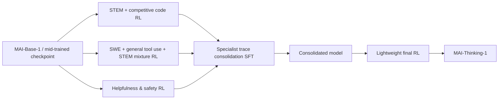

# R1 MAI-Thinking-1: Building a Hill-Climbing Machine：后训练与项目一精读

## 1. 来源、版本与阅读范围

正式标题 **MAI-Thinking-1: Building a Hill-Climbing Machine**；集体作者 **The Microsoft AI Team**，机构 **Microsoft AI**。这是技术报告，模型于 2026-06-02 随[官方发布公告](https://microsoft.ai/news/building-a-hillclimbing-machine-launching-seven-new-mai-models/)公布（该网页标注2026-06-08更新）；PDF 本身没有独立的语义版本号。本篇阅读与项目映射日期为 **2026-09-07**。

本篇以委派的[本地原始 PDF](../../main_20260602_2.pdf)为主版本，记作 **L**。同时实际下载并核对了[官方同名 URL](https://microsoft.ai/wp-content/uploads/2026/06/main_20260602_2.pdf)返回的[2026-09-07 官方快照](sources/R1/main_20260602_2_fetched_20260907.pdf)，记作 **W**。两者均为 109 页，但内容不同，不能只凭文件名判定同版。

| 版本 | SHA-256 | PDF 元数据创建时间（UTC，非正式发布日期） |
| --- | --- | --- |
| L，指定本地原稿 | `7d4f13dd88ff98d0480645e96b751f0abea00fd99122cabf7626598b29bef26f` | 2026-06-02 19:54:27 |
| W，同 URL 当前快照 | `a267d745b1eb3792a8abf58e71e204a6f44f9c18eeb5ad8671320deae71986bd` | 2026-06-06 19:23:18 |

**定位口径：以下未加 W 的页码、章节、附录均指 L。PDF 物理页从 1 起，恰与纸面印刷页码一致；工具零起始 page index 应减 1。** W 的正文节号、主要后训练表图和主要页码沿用，但新增 Appendix A Citation reference（p.82），所以 L 的附录 A–K 在 W 变为 B–L；部分附录内小节跨页也变化。W 新增引用条目给 `urldate=2026-06-02`，引用 URL 为 `https://microsoft.ai/pdf/mai-thinking-1.pdf`；不能把 urldate 当修订日期。

实际对两份 PDF 进行了全文文本差分，后训练主配方和主要结果未发现实质改写。需保留的版本变化是：W §6.1 p.59 新增 RL climb 用 **4.6K GB300s**；W §6.4 pp.60–61 区分 Phoenix 预训练与 Dallas 后训练；W 表7 p.29 的 Down-proj Dim 从 L 的 `4352 / 4352 / 4096 / 3072` 改为 `– / – / 2560 / 3072`；另有 QK normalization 引文、context/sequence parallelism 措辞和排印修订。W 的 4.6K 不等于 §3.6.4 的最大作业 4,864；报告未解释两者是取整、不同运行还是笔误，不据此修正任一数。

阅读方法：先按 L 的目录 pp.3–4 建立下表，再分块读全部后训练正文及附录；§2 纯预训练内容概要阅读，影响 RL 的架构、数据去污染、mid-training、YOLO 与数值部分重点核对。原文公式 pp.31–33、图21 p.58 等以页面渲染核验，未凭失真的文本排版补公式。没有沿引用框架推导作者未公开的训练配置，没有运行训练。

### 原文目录覆盖图

| L 原文位置、标题 | 阅读深度与覆盖 | 本笔记位置 |
| --- | --- | --- |
| §1 Introduction pp.1–2 | 精读模型声明、并行 specialists 与 hill-climbing 含义 | §2–3 |
| §2.1 Model Architecture pp.5–7；§2.2 Model Ablation Methodology pp.7–9 | 概要；重点读 MoE、tokenizer、local attention 对 RL 的约束 | §3.1、§7.3 |
| §2.3 Evaluation Methodology pp.9–12 | 概要；重点读污染与 NLL 指标边界 | §3.1、§8.5 |
| §2.4 Pre-training Data pp.12–16；§2.5 Selecting a Data Mixture pp.16–21 | 概要；重点读去重、来源截止、rank non-invariance、mid-training | §3.1、§8.5 |
| §2.6 Training Recipe pp.21–23；§2.7 Evaluation and Comparison pp.23–24 | 概要；核对阶段 token、上下文与精度，不混入 RL 超参 | §3.1、§9 |
| §2.8 YOLO pp.24–30（System Overview / Determinism / Fault Tolerance / Co-optimizing） | 精读与后训练共享机制；预训练性能只作背景 | §7.3–7.4 |
| §3 The Reinforcement Learning Climb pp.30–31 | 精读 | §2–3 |
| §3.1.1 RL Objective pp.31–33 | 精读公式4–9、图13 | §4.1–4.2 |
| §3.1.2 Reward Design p.33；§3.1.3 Sampling Strategy pp.33–34 | 精读公式10–12与两级筛选 | §4.3–4.4 |
| §3.1.4 Self-Distillation pp.34–36；§3.1.5 Hyperparameters pp.36–37 | 精读，包括负结果与 SFT 稳定性 | §3.2、§4.5 |
| §3.2 STEM Climb pp.37–39（Data Pipeline / Competitive Coding / Deduplication） | 精读全部科学、数学、竞赛代码数据 | §5 |
| §3.3 Agentic Climb pp.39–44（SWE / General Tool Use） | 精读全部 agentic 正文 | §6 |
| §3.4 Helpfulness and Safety pp.44–49（Rewards / IF / Safety / Honesty / Style） | 精读所有奖励与数据，不因非 SWE 略去 | §5.3–5.7 |
| §3.5 Consolidating Capabilities p.49 | 精读 SFT 与最后 RL、表10 | §3.3 |
| §3.6 RL Infrastructure pp.49–53（Controller / Problem Worker / Rollout Worker / Router and Inference / Weight Transfer） | 精读全部 | §7 |
| §4 Evaluations pp.53–56（Benchmark / Human Side-by-Side / Internal Safety） | 精读表11–14、图20–21及所有指标 | §8 |
| §5 Safety Red Teaming pp.56–58（Internal / Independent） | 精读，保留适用范围与未覆盖风险 | §8.4 |
| §6 Cluster Environment pp.59–61（Training / Stability, Determinism, Goodput / Deployment / Sustainability） | 精读计算与成本口径；可持续性作背景 | §7.4、§9 |
| §7 Conclusion p.61 | 精读 future modalities 与当前边界 | §2、§10 |
| References pp.61–81 | 查与版本、机制相关的引文，不把引文内容当本报告配置 | §1、§9 |
| App. A Pre-training Data Pipeline Details pp.82–85（HTML / PDFs / Books / Public GitHub） | 概要全部；重点核 PR loss masking、去污染和第三方辅助模型 | §3.1、§10 |
| App. B Long Context Extension pp.85–88（Data / Evaluation / Progressive Scaling / Adaptation / Final Recipe） | 精读，涉及后训练遗忘及预算冲突 | §3.1、§8.5 |
| App. C Evolution of Reasoning Traces pp.89–94（STEM CoTs / Agentic CoTs） | 精读全部案例，不将例子当定量因果实验 | §8.5 |
| App. D SWE Agent Tool Schema pp.94–96 | 精读两份完整 schema，图23–24 | §6.1 |
| App. E Constraint Taxonomy pp.97–99，表15–16 | 精读 hard/soft 与多轮所有类别 | §5.4 |
| App. F Infrastructure for Building SWE Environments pp.97–98 | 精读构建池、凭据、缓存、吞吐 | §6.4 |
| App. G STEM Evaluations Setup pp.98–101（Math / Science / Competitive Coding） | 精读预算、judge、图25、表17 | §8.1 |
| App. H Agentic Coding Evaluations p.101 | 精读全部 benchmark 与限制 | §8.2 |
| App. I Safety Evaluations pp.101–103（Methodology / Collection & Sampling） | 精读分层、抽样、阈值机制 | §8.4 |
| App. J General Capabilities Evaluations pp.103–106（Knowledge / IF / Long Context / Safety / Honesty / Health / Tool Calling） | 精读全部，包含 MRCR 负结果、表19 | §8.3、§8.5 |
| App. K Cluster Environment Details pp.106–109（Hardware / Certification / Scheduling / Observability） | 精读全部 infra，区分集群机制与 RH2 候选 | §7.4、§11 |

旧稿只作线索：[2_techreport_advice.md](../../2_techreport_advice.md)、[agentic_rl_training_recipe_evidence_matrix.md](../agentic_rl_training_recipe_evidence_matrix.md)。纠错集中在 §10，旧文件未修改或删除。

## 2. 核心问题与结论

作者将模型发展视为可持续迭代的整体系统：预训练的数据和架构选择、可验证问题生产、RL 奖励与算法稳定性、异步训练与评测相互配合，称为 **hill-climbing machine**。这里的 climb 是连续训练改进过程，不是一项特定的在线制题算法，也没有披露“环境生成器与 solver 同时 RL 共演”的配方。报告采用从 mid-trained base 出发的三个并行 specialist，再用轨迹 SFT 合并，最后做轻量 RL；不能改写成三个专家串行训练或 OPD 合并（§1、§3、图12、§3.5）。

最有长期参考价值的事实是：算法稳定性与数据有效性被同等对待。GRPO 使用全局有效 token 归一化、熵控制的非对称 clipping、outer ratio clip、实际 top-p mask 重放与 MoE routing replay；长跑会通过自蒸馏重新承接已学能力。SWE 数据则从 1.02 亿 PR 逐层筛到 265,617 个验证通过问题，仍要处理题意与测试不一致、泄漏、作弊和系统误差（§3.1、§3.3、§3.6）。

结果包括 AIME 2025 97.0%、LCB v6 87.7%、SWE-Bench Pro 52.8%，但预算差异必须随数值保留：STEM 主表允许 256k 输出；SWE/terminal 总上下文 256k；Terminal-Bench 2.0 的 46.0% **忽略了预设 timeout**（表11、§4.1、App. G/H）。报告不是同底座、同数据与算力的逐组件消融汇编，曲线改善不能全部归因给某个单独机制。大作业使用 4,864 GB300，缺少整体 RL 时长与成本，不能据此证明八卡可复制其学习结果。

## 3. 后训练全流程与模型关系

### 3.1 Base 与 mid-training：影响后训练的前提

MAI-Base-1 对外称 35B active / 1T total，表1精确配置为 **34.7B active / 962B total**，78 层，8/512 experts；不能把同表 L78 的 35.6B/1015B 当最终模型。采用 `o200k_base`、词表 200,019；5 个 local attention 层配 1 个 global attention 层，local window 512；交替 dense/LatentMoE、dropless routing。这解释了长单轮生成可逐出 sliding-window KV，而多轮严格前缀适于缓存（§2.1、表1、§3.6.4）。

表6（p.21）给：30T tokens 预训练，context 16,384，8,192 GB200；3.4T mid-training 1，context 65,536，8,192 GB200；150B mid-training 2，context 262,144，4,096 GB200。**App. B.5 p.87 却写最终 extension 用 140B**；两版本均保留此差异，无法确定是否 token 统计口径不同。本文不把 140B/150B 静默合并。

mid-training 沿用预训练语料，不新增合成来源；mix 约 code 55%、STEM/math 35%、background 10%。增强技术正确性、分析深度、code 文件与仓库双格式，并按记忆程度限制来源重复（§2.5.4）。App. B 对长文重加权没有观察到有意义收益，最终沿用 mix 重新 packing；小规模实验支持短上下文 mid-training 后短程 extension，多数 NLL 改善在 extension 的前 1–10% iterations，但最终保守选择 64K→256K，因其与 post-training 的交互尚未充分刻画。不能把小模型 NLL 消融当最终 RL 的训练预算证明。

预训练数据来源截止分别为 HTML 2025-09、PDF 2025-12、GitHub 2025-06、书刊 2026-03（表4）；这不是后训练 SWE PR 的已披露截止日期。去污染包括移除 Hugging Face 及镜像来源、20-gram fuzzy matching / 80% 阈值，作者承认仍不完美（§2.3.1）。App. A.4 的 GitHub PR 数据明确排除 SWE-bench Verified PR；commit 的 pre-state 作为 loss-masked prefix，patch 才训练；PR 的 pre-state 也 mask，其他元数据和 patches 可训练。**这是预训练序列定义，不能移植成 agentic RL mask 证据。**

### 3.2 三个并行 climb 与反复自蒸馏

图12给出以上依赖。报告明确初始RL从尚未接触reasoning traces的checkpoint开始（§3 pp.30–31），并未给一条先由第三方CoT做reasoning SFT的冷启动路径。每个 climb 可经历自蒸馏：收集 RL rollout，对 **mid-trained checkpoint 做 SFT**，再继续 RL。它不是从坏 checkpoint 原地继续，不是 teacher 对 student 当前采样进行在线 KL 指导。用途包括从手写 reasoning prompt（图14）迁到 native chat 格式、从已埋藏数值不稳定性的失败 run 恢复、转接新 base/mid-trained 版本、过滤 reward hacking（§3.1.4，图15）。

作者报告的自蒸馏经验（pp.35–37）如下；除图15外多为定性陈述，未给完整对照表、误差或各次预算。

- **O(1M) reasoning traces** 足以匹配 teacher，同时保留 SFT 稳定性；更大数据边际收益递减，并可能压窄策略分布、伤害恢复 RL 后探索。这不是 SFT 总量的精确披露。
- 混入错误最终答案的轨迹与只用成功轨迹表现相近；因为成功轨迹足够，实际选择成功轨迹。不可将“错误轨迹无价值”作为本文结论。
- 使用后期多个较强 checkpoint；太早的轨迹导致退化，只从最后 checkpoint 新采样也使恢复 RL 表现较弱。多 checkpoint 提供多样性是作者解释，不是已隔离因果。
- 固定 token 预算时，扩大 prompt 多样性优于增加同题轨迹；简单随机抽样优于最短轨迹或若干启发式筛选。
- 短轨迹 SFT 会遗忘 mid-training 长上下文能力；length extension 前的自蒸馏混入 mid-training 数据。
- dropout 0.15 帮助维持熵；SFT 的 MoE balancing coefficient 用 `1e-2`，RL 则 `1e-5`。窄域 RL 中过大 balancing coefficient 会伤害稳定爬升，SFT 中的平衡效果能延续到分布近似的 RL。

“without distillation from third-party models”只描述能力/轨迹继承选择。数据处理确实用 Qwen3-Embedding-0.6B、代码类网页候选文档的质量评分用 Qwen3-30B（App. A.1 “Code pages”，p.83），评测使用 GPT-5-mini 等；“没有第三方蒸馏”不能扩大成“整条系统从未用第三方模型”。

### 3.3 最终能力合并不是 OPD

§3.5 p.49：STEM 与 agentic 教师从多个后期 checkpoint 取多条正确 rollout，仅轻滤 degenerate CoT；帮助性/安全教师另用 judge 与启发式过滤 style、structure、known defects。合并继续使用 trace SFT pipeline。

| 能力 | SFT sample weight | SFT token weight |
| --- | ---: | ---: |
| STEM and Coding | 56% | 89% |
| Agentic Capability | 11% | 9% |
| General Helpfulness and Safety | 33% | 2% |

表10强调按**样本比例**平衡，不能把 89/9/2 当采样权重。Consolidation SFT 做 4 epochs，最大 LR `1e-5`，衰减 2×；与一般自蒸馏配置不同。最终 lightweight RL 主要改善安全、过拒和风格，按 helpfulness/safety 配方，最大 sequence 128k，并保留少量 STEM/code；否则复杂推理会慢慢退化。最终 RL 的 mix 比例、steps、整体 token 未给。报告没有 MOPD、full-vocab teacher KL、teacher privileged context 或跨 tokenizer OPD 的配方；离线 trace SFT 不需要这些假定。

## 4. 训练目标、样本语义与超参数

### 4.1 GRPO：组内优势、全局 token 分母

令问题 (q\sim P(Q))，行为策略 (\pi_{old}) 采样同题 (G) 条响应 (y_{1:G})，当前待更新策略为 (\pi_\theta)。每条响应 reward (R_i=R(q,y_i))（式4），优势是

\[
A_i=\frac{R_i-\operatorname{mean}(R_{1:G})}{\operatorname{std}(R_{1:G})},\qquad
r_{i,t}(\theta)=\frac{\pi_\theta(y_{i,t}\mid q,y_{i,<t})}{\pi_{old}(y_{i,t}\mid q,y_{i,<t})}.
\]

原始目标（式5–6，p.31）：

\[
J(\theta)=\mathbb E_{q,y_{1:G}}\left[
\frac{1}{\sum_i|y_i|}\sum_{i=1}^{G}\sum_{t=1}^{|y_i|}
\min\big(r_{i,t}A_i,\operatorname{clip}(r_{i,t},1-\epsilon,1+\epsilon)A_i\big)
\right].
\]

正文明确实际归一化跨 **global training batch 的所有 token、所有 DP ranks**，并非每条轨迹先平均。优势在组内按 reward 标准化，同条响应所有 token 共享。长响应整体可贡献更多 token 权重；不能称每条轨迹等权。报告未定义 std 的有偏/无偏估计、零方差 epsilon 或最终 packed minibatch 与原 group 的对应细节。

agentic 将 (y_i) 扩成多次 policy steps 与环境 observations 的完整轨迹；完成后统一评分，credit assignment 均匀分配到 **所有 policy steps 的全部 token**（§3.3 p.40）。因此 observation 是条件上下文，不是被赋予 policy gradient 的行动 token。这里没有单独的“只训练最后 turn”或“只有答案进 loss”；也未公布细化到 serialization 标记、工具调用封装与 compaction 的 mask 代码。

### 4.2 两处稳定性修正

**Adaptive entropy control**（p.31 未编号表达式、式7–8 p.32）：把 trust-region ratio clip 改为

\[
r^{tr}_{i,t}=\operatorname{clip}\big(r_{i,t},1-\epsilon,(1-\epsilon)^{-1}+k\big),
\]
\[
\widehat H(\pi_\theta)=\frac1{|\mathcal T|}\sum_{(i,t)\in\mathcal T}
[-\log\pi_\theta(y_{i,t}\mid q,y_{i,<t})]\,r_{i,t},\quad
k\leftarrow\operatorname{clip}\{k+\delta\operatorname{sign}(H^\star-\widehat H),0,k_{max}\}.
\]

(\mathcal T) 是当前训练 batch 的响应/token 索引集合；每 step 更新 controller。熵低就扩大上界，熵高则缩小；初始 (k=0)，上下界乘积为 1，因此在 log-ratio 空间对称。作者称显式 entropy bonus 的表现不及此法。超参为 (\epsilon=0.6,k_{max}=2.5,\delta=0.25,H^\star=0.3)（§3.1.5）；因此由公式推得一般 clip 下界 0.4，上界从 2.5 到 5.0。图13演示使用 **kmax=1.0**，不是生产典型配置，不能混淆。

**Outer ratio clip**（式9 p.33）：

\[
r^{out}_{i,t}=\operatorname{clip}(r_{i,t},r_{min},r_{max}),\quad r_{min}=0,\ r_{max}=50.
\]

标准 min surrogate 的两个未受 trust clip 限制分支——负 advantage 且 ratio 上升，或正 advantage 且 ratio 下降——在作者训练中有时出现灾难性 gradient-norm spike，因此对所有分支加 hard outer clip。它不是 reward clipping，不是 trajectory-level IS，也不是简单新增 KL。报告分开写出两个 ratio clip，没有最终合并伪代码；不补造 stop-gradient、token 丢弃布尔逻辑或 clipping 顺序的实现。

### 4.3 通用 reward 分解

式10–12（p.33）：

\[
R(q,y_i)=R_{task}(q,y_i)+w_{lang}R_{lang}(y_i)-w_{len}R_{len}(y_i),
\]
\[
R_{lang}(y_i)=\max(1-\alpha n_{non\text{-}english}(y_i),0),\quad
R_{len}(y_i)=\rho_q\frac{|y_i|}{\ell_{max}}.
\]

(R_{task}) 来自不同域的执行、AI judge 或 learned reward model；(n_{non\text{-}english}) 数的是 **CoT 中非英语 words**，不是 token 数；(\rho_q) 是题目 pass rate，(\ell_{max}) 是最大 rollout 长度。难题 pass rate 低，长度惩罚弱。作者观察混语 CoT 与训推 logprob divergence 峰值相关，不能把自然语言选择本身认定为已证明的数值因果。top-p 也能抑制孤立低概率外语 token。

典型 (w_{lang}=0.5,\alpha=0.005,w_{len}=0.25) 直到 64k；128k 阶段 (w_{len}=0)。长度分母随上限增加使同长响应的惩罚变弱。帮助性与安全里的 context-specific 长度分位范围奖惩（§5.3）是另一种机制，不应与此式混为一项。

### 4.4 问题筛选与支持集重放

§3.1.3–3.1.5：先 (G_{early}=16)，按“positive reward 响应比例”估 early pass rate，仅 `[0.05,0.8]` 内题目继续；完整组筛 `[0.1,0.8]`，减少近全对/全错的低方差组。式样与典型超参均称 (G=128) **total rollouts**。但 §3.6.2 pp.50–51 的执行流程称先 16 条再 **additional 128 requests**。两处原文不能同时无条件解释成“每题恰好 128 次生成”；是否 early 样本复用、144 条中哪些用于 group 统计没有说明。按公式推预算时需标此缺口。也未解释多奖励场景下“positive reward”与 grader 可选 pass/fail 是否同义，不能把语言奖励导致的正分擅自当通过。

rollout 用 `top_p=0.97`。训练重用**当次 rollout 的 nucleus truncation mask**，被排除的词表 logits 置 `-∞` 后再 softmax，防止训练给未参与采样的词表部分反传导致严重 off-policy mismatch。mask 存储与传输有额外成本，p 更大增加探索也增加此开销。它不同于只保留 sampled-token logprob、训练时重算一个新 nucleus 或只给优势乘 IS。作者称不重放可在数个 steps 内发散（p.34）；数值完整复现仍需实际 mask 与 routing 数据，报告没有发布格式。

最大 generation 从 8k 逐次翻倍至 16k、32k、64k、128k，目的是在早期低成功率时减少无用长生成。length curriculum 与 base 的 256K context extension、最终 STEM 256k 输出评测是三个不同口径。

### 4.5 典型训练超参数与未说明项

| 对象 | 已披露典型配置（§3.1.5 pp.36–37） | 口径/限制 |
| --- | --- | --- |
| RL optimizer | AdamW，β1=β2=0.95，optimizer ε=`1e-15`，weight decay=0 | 不是 clipping ε |
| RL LR | constant `1e-6`，无 warmup/decay；长生成时降到 `9e-7` | 作者解释为长尾 staleness 增大；不知具体切换 step |
| RL batch | packed global batch 7,040，unpacked sequences 最多 12,000 | 不是 7,040 prompts 或 groups；未公开每条 packed sequence 的目标长度 |
| 权重更新/陈旧性 | 每 5 个 gradient steps 更新 inference；生成策略超过 8 次 inference updates stale 则丢弃，即 >40 gradient steps | “8”不是 gradient steps；无多 turn 跨版本判定细则 |
| MoE | dropless；global load-balancing coefficient `1e-5` | 完整 learner DP/TP/EP/CP 布局未给 |
| Self-distillation SFT | packed global batch 2,048，sequence 128k；AdamW weight decay 0.001 | 不应套在 consolidation 4 epochs 的全部配置上 |
| Self-distillation LR | cosine，max `1.7e-5`、min `5.2e-6`，warmup ratio 2% | SFT β/optimizer ε未另外明确 |
| Self-distillation regularization | dropout 0.15，MoE coefficient `1e-2` | 作用含提升恢复 RL 后探索与路由平衡 |

式5没有 explicit reference-policy KL 项，也没有 critic；报告未给可独立辨认的 reference policy/KL coefficient。可准确说“披露目标中无 KL 项”，不能据此补出实际系统开关。一般自蒸馏及合并SFT的prompt/response细粒度loss mask、混入mid-training数据的mask定义没有另行展开（已查§3.1.4–5、§3.5），不能照搬App.A的预训练PR mask。5 gradient steps/发布不等于每 batch 做 5 epochs；每批复用次数、minibatch 编排、gradient accumulation、异常样本如何影响 group 分母未披露。工程失败重试与任务失败奖惩分别见 §7.1，不可合并为“失败一律 reward=0”。

## 5. STEM、通用推理、偏好与安全数据和奖励

### 5.1 STEM Mix：从材料到可核验问题

§3.2 pp.37–39：单轮 STEM climb 最长，覆盖数学、物理、化学、竞赛代码等。训练实例是 `(q,a)` 或 `(q,{tests})`；final answer 通过 SymPy、AI judge 或程序测试核验。处理数百万文档形成 **>5M samples**，其中最困难部分 **>550k QA pairs**。图16原始题型 open ended 56.1%、proof 33.3%、MCQ 10.6%；学科 math 58.5%、physics 13.2%、chemistry 10.9%、other 4.3%、electrical engineering 3.4%、CS 2.6%、mechanical engineering 2.6%、biology 1.9%、mechanics of materials 1.0%、civil engineering 0.9%、economics 0.7%。这是原始题型分布，不能误当最终 proof/MCQ 的训练比例。

图17/§3.2.1 的四阶段为：

1. **Hierarchical parsing**：OCR/VLM 或 OCR service，分块、移除非 STEM 页与 boilerplate，构建层次结构，修跨页、编号与交叉引用，再由 LLM 标 QA spans。
2. **QA pairing**：对于章末题目/附录答案，通过结构与语义检索给候选，LLM 多轮选择并验证配对。
3. **Curation**：剔除不可核验、PII、答案直接泄漏，标注题型和学科；将 MCQ/proof 重写为 open-ended。重写做三次再求共识，无法可靠转换则丢弃，仍保留小部分 MCQ 以熟悉格式。proof 在此被转换为可验证答案题，不能说报告训练了完整 proof verifier。
4. **Scoring**：每道题由四档模型各解 k 次，以它们 AIME 2025 能力为分档代理。最强档低 pass-rate 的题，把模型 consensus answer 与 ground truth 随机顺序交 blind judge；judge 偏向 consensus 则作为可疑 GT 丢弃，偏向 GT 则作为真难题保留。没有披露四个 solver/judge 的具体身份、k、阈值或各阶段 retention。

STEM Mix 与竞赛代码分别做 SHA-256 exact question hash、字符 n-gram/MinHash LSH fuzzy、embedding cosine 三层去重，同时对 App. G 公共 benchmark 和内部 Olympiad/graduate-level eval 去污染；后两层阈值、embedding revision 未给（§3.2.3）。

### 5.2 竞赛代码

§3.2.2 p.39：定向来源与 vendor 取得 **160k problems**，每题有 reference solutions，先确认其通过全部 tests；覆盖 divide-and-conquer、DP、graph/tree、search 等，支持 **17 种语言**，包括 Python/C++/C#/Java/JS/Rust/TS，保留 runtime/memory constraints。不是从普通 PDF 凭空补测试。与 >5M STEM Mix 的重叠/是否相加没有清晰定义，不能直接宣布最终训练集 5.16M。竞赛测试的充分性、额外 mutant/no-op 校验和生成次数没有展开。

### 5.3 Helpfulness/safety 的奖励骨架

§3.4.1 pp.44–46：偏好 reward model 是 **post-trained MAI-Base-1** 再用多 vendor 人类 preference 数据训练。给 context c、k 个候选及各自 1–5 分，输入用 `<|im_sep|>` 分隔的 context/responses，SFT 目标为 scores 的文本 token 序列。推断为每题 k 个候选做 k 次循环置换；每次只读取第一 score token 的完整分布，取当前排首候选获得最高档 **score=5 的概率**为 reward。它不是平均 Likert score、不是候选胜率 softmax，也不是用一次串行解码的所有 k 个分数（作者认为后者噪声较高）。reward model 用训练 rollout 的人工评分与 RM 数据 validation split 评估，未披露准确率表。

同时使用可快速改 rubric 的 prompted AI judges 与确定性 verifiers。作者定性报告，可验证奖励相较不可验证奖励更不易 reward hacking、对 multi-epoching（在同一数据上重复训练多个 epoch）较不敏感，并通常帮助稳定训练（§3.4.1 p.45）；该段未给定量消融或可保证的 epoch 上限，不能据此断言 verifier 不会被利用。作者观察 AI rubric 会推高长度和风格元素，故对每个 context 离线估计可接受 response-length 分布，对超出预定义 quantile range 的响应惩罚，避免简单越短越好。quantile 值未给。

不同 reward 的尺度与 context 内方差不同，直接相加可能让大幅值信号支配。两种聚合按 context 选择：**lexicographic** 只在组内所有 rollout 的高优先级分数都相等时激活下一级 reward；**gated** 要先满足主目标的最低标准才计算次目标。前者是组内并列条件，后者是单个响应的安全等门槛，不能写成同一个 weighted sum。

### 5.4 Instruction following 与 steerability

§3.4.2 p.46、App. E pp.97–99：expert-written complex contexts 用于启动能力，synthetic 用于覆盖。手工 constraint taxonomy 与多样 seeds 驱动 instruction/model-spec、scenario、critique/rewrite；包含多语言、长短对话、system/developer/user 层级冲突，跨 **40 多个领域**。筛掉不自足/歧义/约束不对齐 rubric，进行安全与复杂度过滤、rejection sampling、pass-rate 难度校准，保留难但可解题。

确定性约束用规则；LLM judge 对 atomic rubric 独立二元判分，多次取均值；RM 补一般质量，以 IF-specific reward 优先的 lexicographic 聚合。App. E 的 hard 类包括数量、格式、内容、语言、时间顺序、排除性约束；soft 类包括风格、persona、自我呈现、互动/响应策略、结构/推理要求和指令冲突处理。多轮覆盖切话题、指令保留/叠加、上下文事实回忆、自洽和版本回退。这里的 memory & recall 指对话上下文利用，不是单独长期记忆系统。

### 5.5 Safety

§3.4.3 pp.46–47/表8：同时处理 harmful 的 unsafe compliance 和 borderline 的 over-refusal。harmful 来源为 vendor/internal human red teaming，以及模板、PAP、TAP 等自动攻击；borderline 用跨代保留 do-not-refuse slice 和经安全标注的 capability data。允许 full refusal、partial refusal 或 do-not-refuse，不能把“敏感话题”直接等同“必须拒绝”。

judge 分 policy compliance、response engagement、response style 三轴。安全门控下 non-compliant rollout 获 minimum reward，不得靠质量/风格抵消；合规者再用正常 mixture。脚注9的 paired audit 中 expected safety Likert 与 policy-compliance 的 Pearson **0.293**、Spearman **0.344**；**87.8%** non-compliant 响应仍拿到 RM score≥3。这支持作者选择独立 compliance gate，但未给该 audit 的样本数，不能外推成所有 RM 的性质。

### 5.6 Honesty

§3.4.4 pp.47–48：目标平衡事实准确与信息量，防止为减少错答而一味少答。vendor、PII-filtered consumer Copilot logs、synthetic 覆盖普通事实、长尾困难事实、false-premise queries；每个 RL example 离线 retrieval-augmented verification 生成参考。LLM judge 结合 factuality/confidence 分五类：CONFIDENT_CORRECT、UNCONFIDENT_CORRECT、NOT_ATTEMPTED、UNCONFIDENT_INCORRECT、CONFIDENT_INCORRECT。映成 scalar reward：自信正确最高，自信幻觉惩罚最重，abstention neutral，不自信正确降低得分以抑制过度 hedge；具体权重未给。Copilot 日志只来自未 opt out 且符合其用户排除规则的人群，见脚注10；不能写成预训练全面使用该日志。

### 5.7 Style 以及多模态边界

§3.4.5 pp.48–49/表9：训练 warmth without sycophancy、结构可扫读、context-appropriate tone，规则涉及 emoji、markdown、formal tone、preamble、density。数据由 PII-filtered Copilot logs、vendor 静态/互动 contexts 与 Arena conversations 构成，低至中难度，排除复杂 IF、coding、math/STEM，并按 intent 主动采弱项。judge 用 **0/1/2=major/minor/no style issues**，作者认为粗粒度优于过细评分或 prompt-specific rubric；仅在可验证奖励和安全要求满足后施加 style。

报告未提出多模态模型后训练配方：OCR/VLM 是资料处理手段；红队将 multimodal inputs 排除；更多 modalities 是 §7 未来工作。不能把上述文字型 RL 补写成视觉、音频或图文 RL。健康领域有评测，但没有独立 health-specialist climb。

## 6. Coding / SWE / terminal 环境与任务生产

### 6.1 Rollout 环境和工具

§3.3 pp.40–41：每个 RL environment 有 task spec、SEE session、grader；ReAct loop 解析 reasoning/actions，调用工具，追加 observations，所有先前 steps token 保留并构成下个 step 的严格前缀。无 tool call 或超 step/context/time budget 后，rollout 与 SEE 交给 grader。报告没有 compaction、上下文重写、subagent/fork 的已用训练机制；这条 append-only harness 不能证明外部黑盒 harness 的重分词对齐已解决。

SEE 每个 agentic task 新容器，完成即销毁；默认网络隔离，确需联网时走缓存代理和 domain allowlist。作者以此提高复现性、减少外部副作用，仍在后续复验中承认 CPU、内存、egress、timeout 和 test flakiness 会破坏有效性。

SWE image 含固定 commit repo、预装依赖、题目和评分测试，但 **hidden test changes 在 inference 期间隐藏，评分时才应用**；不能因“自包含 image”声称 agent 能看见 gold/hidden tests。模型用 `bash` 与 `str_replace_editor`。App. D：bash 每次新 subshell，cwd/env 修改不自动跨调用保留；文件状态保留。editor 支持 view/create/str_replace/insert/undo_edit；精确替换要求 old_str 唯一，输出可 `<response clipped>`；schema `additionalProperties=false`。这并不是持续交互终端协议。

### 6.2 Organic SWE 漏斗

| 阶段 | 数量与单位 | 操作与排除原因 | 原文 |
| --- | ---: | --- | --- |
| 原始 public GitHub PR | 102,000,000 PR | 起始公开 PR 集合 | §3.3.1 p.42 |
| 筛后 candidate problems | 约 4,870,000 PR/关联题 | merged 到 main、修改<15 files、有 code 与 test changes、关联 issue；支持 GitHub/Jira/Bugzilla/YouTrack/Phabricator/Launchpad/Linear | 同上 |
| 自动环境构建通过 | 2,080,000，42.8% | LLM agent 读取 repo，生成 Dockerfile；测试验证，排除 dependency/environment errors | 同上 |
| reference signal extraction 通过 | 745,452，15.3% | base+test diff 与 base+test+code diff 比较，取 F2P/P2P，没 surviving F2P 丢弃 | 同上 |
| SEE 环境与 grader 验证通过 | 265,617，5.5%；94,044 unique repos | 真实训练 SEE 下多次 empty patch fail、golden patch pass，筛 non-deterministic tests | 同上 |
| 质量过滤、题意 rewriting 后 | **未给最终数** | 检查 clarity、test quality、leakage、feasibility，必要时改写题面 | pp.42–43 |
| 合成问题、实际采样/消费轨迹 | **未给** | 重用可执行但未过质量验证的环境，生成新问题与 tests；没有总消费量 | pp.42–43 |

**42.8%、15.3%、5.5% 的共同分母是约 4.87M candidates**，不是逐阶段通过率或 102M。也没有“265,617 个独立镜像”的去重统计。参考测试代码被 code/test split，F2P 为 issue-resolution 信号，P2P 为 regression 信号；原文没有给完整 SWE scalar reward 组合公式，不能仅凭 F2P/P2P 强行认定全部任务都同一二元 reward。

gold/empty 跨多轮复验，但次数未给。未见 alternate-solution verification、gold patch hints 暴露规则、质量 judge 的模型与打分阈值、rewrite 前后 retention 或 rewrite 成本。pipeline 的核心独立性是“能执行”“能评分”“题目对解题者充分”不同检查，不是“测试过了就可训练”。合成环境复用受 BugPilot、SWE-Smith、SWE-Mirror 启发，但此报告没展开各生成策略数量、mutation 类型与最终消费比例。

### 6.3 评分隔离与反作弊的准确边界

§3.3.1 p.41 明确 **grader 在 agent 使用的同一 container 内执行 tests**；App. H p.101 评测亦如此。SEE 隔离 task 与外部，不等于 fresh grading environment。反作弊（p.43）包括：

- 限网，防止搜索公开 PR/gold；保留必要网络最小集合。
- 清除 base commit 之后的 commits、references、branches，使仓库回到原始时间状态；保留合法 git 能力。没有披露物理 object 清除的完整实现、reflog/fsck 验证，不可用另一报告的机制补齐。
- reset agent 改动的 test files，再应用隐藏 test changes。作者明确承认仍可能通过 monkey-patching test framework、改 equivalence behavior 等作弊；LLM monitor 审 rollout，人工复核 flagged examples，持续强化 test detection/reset 与 anti-tampering heuristics。

因此正文既没有声称测试 reset 足以完全可靠，也没有披露独立 fresh checkout、可信代码投影或评分进程权限模型。当前 RH2 的 fresh grader 只能作为我们基于现状的设计选择，不能以 MAI 已验证为依据。报告的 monitor/human review 也没有误报/漏报率或自动进 loss 的规则。

### 6.4 构建基础设施与单位成本

App. F pp.97–98：two-pool Ray cluster 的整体描述为 **约 30,000 CPU cores**；main pool 分发任务、Lance I/O、跟踪 pipeline 状态；builder pool 用 Ray custom resource 标记隔离 resource-intensive、易 disk-full/OOM/hang 的 builds。builder 不持有 pipeline data storage/internal service 凭据，Kubernetes 重启后重连；这不等于没有任何凭据——init container 用 federated identity 配 registry authentication。

每 builder pod 两个容器：主容器 Ray worker+rootless podman，sidecar rootless BuildKit，通过共享 NVMe 的 OCI tar 和 localhost 控制通道完成 build-load-grade，减少跨机器传大镜像。按 repo 给同一个 persistent Ray actor，复用 BuildKit layers；apt/pip/编译成本无需每题重付。持续 actor 属于**离线 build**，不能据此推为 rollout 粘滞路由或复用有状态任务容器。

性能段另给具体配置：**10,000 CPU cores + 12 million LLM tokens/min capacity**，prompt cache hit **83%**，输出 **约20 grading-passed environments/min**，作者称瓶颈在 LLM token consumption。30k 是前文规模描述，10k 是此吞吐配置，关系没有展开，不能算成“三万核时产出20题/分钟”。12M 是 capacity 而非已计费实际消耗，20/min 的终点也没有证明覆盖后续所有质量重写，因此不能据它计算“每个最终合格任务60万计费 token”或美元成本。

### 6.5 General tool use 不能被 SWE 摘要吞掉

§3.3.2 pp.43–44：mocked API/MCP backends、query、tools schema、initial mutable state、grader；单环境往往 **>50 tools**，覆盖 inventory、scheduling、report、customer support 等。human-curated 与 synthetic 并用。synthetic 三阶段：从 plain-English 环境描述 bootstrapping 工具实现/数据库→采可能调用链、相关 entities 与 user query→执行验证、去近似任务、critique/refine。加入 environment personas 与“给了工具但无需调用”的任务，抑制过度调用。最终 **>150 environments、130,000 tasks**，不是 SWE PR 漏斗的一部分。

奖励包括 final state、tool usage pattern、final answer；synthetic 任务由 LLM 分解 subtasks 独立评分，另有 cross-environment graders 鼓励合理并行、去重复、正确参数类型/取值。未给 reward weights、subtask reward 组合、grader 完整实现及 solver 预算。

agentic climb 实际混入 STEM/competitive coding，作者报告 STEM 稳定训练且对 SWE/tool calling 正迁移；反向 agentic 对 STEM single-pass 未见正/负迁移（p.40）。缺少比例和控制表，不能写成确定提升幅度。§4.1 称没有 targeted terminal-interaction environments，所以 Terminal-Bench 结果是 broader agentic 迁移；不能把 130k general tools 误称 terminal RL 数据。

## 7. Rollout 时序、异步与数值基础设施

### 7.1 Rocket 的责任分工和失败语义

Rocket 是自研异步 RL framework，learner 用 YOLO，inference 用 SGLang/router（§3.6，图19）。controller/problem worker/rollout worker 各为一个 Python process/Ray actor；原文以当时大规模需求解释自建，不能推成今天 miles 同类功能不存在。

1. controller 从 task sets 取任务，发给 problem worker；收到整组 rollout 及 reward/pass-fail/normalized advantage 后筛选、组 batch 给 learner。大运行主要 off-policy；on-policy 留小实验和 debug。
2. problem worker 管一题的 early/full 采样、失败重试和最终优势；自己不跑单条 rollout。
3. rollout worker 生成 prompt，请求 inference，解析工具并执行 SEE、追加 observation，直到 no-tool 或步数/时间等终止。可独立评分的问题在 rollout worker 评分；须多候选比较的 grader 放 problem worker。一个问题可有多个 grades，用 user-defined policy 聚合。
4. learner 消费后更新；每5梯度steps向 inference 发布，陈旧性阈值见 §4.5。图19出现 persistent rollout store/metric store/checkpoint，但没有完整 durability/commit 协议。

报告区分了一些错误，却未穷尽训练处置：build dependency 错误在生产阶段排除；worker/request 故障按需重试；推断 replica 中途失败可换 replica 重试；预算终止的完整轨迹仍送 grader；陈旧 rollout discard。**没有公开 timeout、解析错误、工具错误、grader timeout 各自的 reward、mask、是否纳入 GRPO group、补采上限、drop-single vs drop-group 规则**（已核§3.1、§3.3、§3.6、App. D/F/H）。不能把“does not lose rollouts”的运行层叙述理解为中断前 token 原样保留、exactly-once 或 partial rollout resume。

### 7.2 推理优化、稳定性与权重传输

§3.6.4 pp.51–52：最大 RL job **4,864 GB300 chips = 4,096 inference + 768 learner**，精确比例约5.33:1（作者近似说可到5:1）。这是最大 job，未给三个 specialists 各自分配和时长。

single-turn 短 prompt、最高128k长输出，KV memory 主导：expert parallelism、attention data parallelism 降 footprint；禁 prefix cache，让 sliding-window tokens 完全逐出；MLP data parallelism、DeepEP、EPLB 降通信成本。multi-turn prompt 长、短输出，prefill 主导，依赖 prefix cache，production RL **97–98% hit rate**。这不是端到端吞吐增益，也不是 build 阶段 83% prompt cache 的同一指标。两者均缺缓存命中分母的详细定义。

三层故障处理：SGLang self-watchdog 探 generation endpoint/scheduler memory，异常时自行重启；router circuit breaker、multi-stage probe、rediscovery 和 per-replica flow control；job 监控各 actor class live 数和 step progress，低于阈值或无进展则 fail job clean restart。具体阈值、backpressure queue 容量、重试上限未给。

训推皆用 **bf16**，比试过的较低精度更稳定；再做 MoE routing replay 与 top-p mask replay。预训练 FP8/FP32 混合配方不能套成 RL inference 精度。报告说这些降低 numerics gap，未量化为逐 token 零误差；也没有公布 SGLang fork/commit、replay payload 或固定 routing 的端到端测试。低精度、logprob 不一致的相关失败不能被无条件移植为当前其他模型的必然结论。

§3.6.5 pp.52–53 的 weight transfer plan 在 job start 编译 source/destination tensor shard 的交集，记录 rank、byte extent、dtype/layout transform；直接发重叠 subshards，不 materialize full tensors。pack/transfer/unpack 流水化，transform 放成本较低一侧。规划只针对理想的一个 learner/一个 inference server，运行时扩为对应 live replicas 的 transfer group；用 DP groups 子集各负责一片 fleet。例：36 servers 分4组，4个9-server transfers 并行。未给传输延迟、速度提升或原子发布、多 turn 混版本合同，不能补成当前 RH2 staleness 设计。

### 7.3 YOLO 中与 RL 有关的机制

§2.8 pp.24–30：PyTorch 上自研模型、sharding、optimizer、dataloading、checkpoint；支持 SFT/RL learner，同时覆盖 pre/mid-training。tensor sharding annotation 是描述性的，不自动插通信；可按 tensor 使用不同 TP/DP/ZeRO、parallel folding。提供 dropless MoE variable-size all-to-all、分组 dispatch-compute-collect 流水、static-memory dropless 多轮 capped dispatch（仍处理所有 token）、细粒度 recompute 避免高 imbalance 的 memory spikes；有 routing replay。

activation checkpoint 与 pinned host-memory async offload 组合，服务长 context 和 memory 压力。pre-training 的 EP64/TP1、NVLink 内 all-to-all、跨 rack DP 是明确的预训练实例；RL 完整布局仍未知。determinism 承诺条件为 **固定硬件拓扑、模型配置、软件版本的 pre-training bitwise reproducibility**。手段有固定数据顺序、checkpoint 含 RNG/FP8 scale/data cursor、固定 GPU reduction 顺序、stable routing sort、关闭 NVLink SHARP、固定 NCCL topology。不能升级为“fully async RL bitwise 可重现”。

DCP metadata/serialization 重写，使 CPU memory overhead 与 save time 降 **>10×**；预编译 save plan、异步 host staging+独立 checkpoint process、KV 协调原子提交，最多一个 checkpoint 在途（pp.27–28）。load 时重复状态读一次后 NCCL broadcast；Ray hot standby 的 in-job restart 降 pod 重建成本，重算 steps 对 historical loss 验 determinism。这些是 YOLO 作者报告，非公开可调用 API 或完整 RL exactly-once 恢复证明。

### 7.4 集群、goodput 和成本口径

§6与App. K：GB200/GB300 NVL72、跨 rack InfiniBand；Kubernetes 管 state，Kueue 管 quota/admission/preemption/topology placement，MAI controllers 管 reservations/readiness，Ray 管 job actors。rack 软保留与借用防碎片化。单节点→rack collective→按需跨rack IB certification；故障节点 taint、drain/remediate、vendor maintenance 后重新验证。日志把 device/links、调度、actor、checkpoint、step progress 接到同一诊断视图。这是多千卡运维设计，不能被本项目当必造组件。

goodput 定义为 **ideal training duration / actual wall-clock duration**（§6.2），不同于 GPU busy 或 MFU。§6.2.1 的 **90.0% goodput、51h overhead 属 MAI-Base-1 的8K-GPU预训练**，不是 RL job。原文同时报 recomputation 6.5h、“15% of overhead”；6.5/51≈12.7%，数值内部不一致；non-stepping 14h/27%、MFU-drop18h/35%大致相符。保留差异，不静默修正。图11 final pretrain MFU≈20%；MFU 使用 BF16/FP16 dense spec **2.5e15 FLOPS/GB200** 为分母，FLOP numerator 不计 recompute、RMSNorm 等 memory-bound 操作（§2.8.4），不是混合精度理论峰值总和。

§6.3 的 MAIA-200 比 GB200 **同 rack power budget 下 token generation throughput 高>40%**是部署性能/功耗口径，没有 batch、长度、延迟约束或绝对 tok/s，不能称整体 RL 便宜40%。§6.4 的可再生电力、Phoenix 水基础设施投资和社区计划是机构级可持续性背景，不是单模型碳排、耗水或本次训练美元账单。

## 8. 评测、消融与负结果

### 8.1 STEM 主结果及预算

§4.1 默认 **4 runs 均值、temperature=1、top-p=0.97**，除非附录另说。pass@1 指单个采样的成功概率估计；多次评测取均值不变成 pass@4 或 best-of-4。GPQA 附录明确16 rollouts，是默认4次的例外。

| benchmark | MAI 128k最大输出 | MAI 256k最大输出 | 评测设置与指标定位 |
| --- | ---: | ---: | --- |
| AIME 2025 | 95.0% | 97.0% | boxed answer→regex→SymPy，AI fallback；App. G.1、表17 p.99 |
| AIME 2026 | 93.6% | 94.5% | 同上 |
| HMMT Feb 2026 | 84.3% | 84.9% | MathArena 来源，同上 |
| GPQA Diamond | 84.2% | 84.2% | 198 MCQ，simple-evals prompt/custom regex，pass@1 averaged over16 rollouts；App. G.2 |
| LiveCodeBench v6 | 87.3% | 87.7% | 1,055题，2023-05到2025-04；one-shot code fences→test harness，runtime/memory constraints；App. G.3 |

App. G 图25 p.100 是 STEM judge prompt：默认 GPT-5-mini，区分内容等价与明确格式/单位/精度要求，历史消息加 few-shot 防 judge hacking。外部 judge 用于评测并不违背“不从第三方蒸馏 CoT”。图1/图15 STEM climbing 曲线用 **LCB v6 的 after-Jan-2025 hard subset**、部分曲线取邻近3 checkpoint 平均；不是表17全1055题的逐step曲线。表11/17的其他模型分数来自各自官方 model cards，训练与测试算力未匹配；不能按小分差归因算法优越。

### 8.2 SWE 与 terminal

| benchmark | MAI 成绩 | 题数与测试条件（§4.1、App. H） |
| --- | ---: | --- |
| SWE-bench Verified | 73.5% | 500题；bash + editor；总 context256k、每次最大输出8k、最多1000steps |
| SWE-Bench Pro | 52.8% | 报告写731题，多语言；同上 |
| Terminal-Bench 2.0 | 46.0% | 89题；bash only；总 context256k、每次最大输出32k、最多1000steps；**忽略预设time-outs** |

这些是 always-append ReAct loop 下的模型+tools+budget 成绩，结束后在同 SEE 评分。4 runs 取均值的总规则适用，未公布每题 seed/结果与置信区间；8k/32k 是多轮请求输出上限，不能把总预算写成只8k/32k。报告没有固定完整 eval harness commit、环境 hash、硬件与 wall-clock 成本。外部模型主表来自官方不同运行，因此特别不能将 Terminal-Bench 46.0 与遵守官方 timeout 的分数视为统一协议比较。

### 8.3 全体通用能力评测

表12（p.54）Sonnet 4.6 对照由作者自有 eval suite 实测，使用 max reasoning effort/max sequence；不同于表11抓 official cards。分数虽都以0–100显示，**分母与指标不同**：

| 领域 / benchmark | MAI / Sonnet4.6 | 原文评分要点 |
| --- | ---: | --- |
| MMLU-Pro | 85 / 87 | 扩至10选项，custom regex，对照GT；App. J.1 |
| SimpleQA Verified | 31 / 29 | 去噪/去重复的短事实问答准确率 |
| IFBench | 69 / 50 | 58种可验证约束；App. J.2 |
| AdvancedIF | 85 / 86 | **rubric-level score**，不是整题全满足率 |
| MultiChallenge | 53 / 57 | 多轮，遵官方 Gemini2.5 Pro judge；作者验证对公开模型能复现榜分 |
| GraphWalks ≤128k | 90 / 96 | answer F1；≤128k 按 o200k_base 计输入长度；App. J.3 |
| AIR-Bench | 88 / 88 | category-specific policy judges，安全 engagement |
| CyberSecEval4 Instruct / Autocomplete | 63/62；63/56 | insecure code generation，通过静态分析规则评分；不是攻击成功率 |
| LongFact | 98 / 98 | **claim-level precision**，用简化claim extraction+judge代替原SAFE |
| TruthfulQA | 88 / 88 | 推荐的multiple-choice accuracy，非长文本诚实总分 |
| HealthBench Professional | 35 / 38 | 525医学专业对话、GPT5.4 grader/rubrics，primary metric含长度惩罚；App. J.6 |
| MedXpertQA | 43 / 49 | 2450专家MCQ、10选项；GPT5.4解析答案字母 |
| BFCL v3 | 72 / 76 | AST/execution matching、多函数多轮；**T=0.001,p=0.97**例外；App. J.7 |
| LongBenchV2 | 61 / 66 | input限制256k后408 unique questions；4-way MCQ；表19 p.105 |
| CorpusQA | 82 / 79 | multi-document freeform QA，judge改用GPT5.4(high)，不是默认DeepSeek-v3；表19 |

表19两项最大输出128k、max effort（适用时）、4次独立评估。正文 App. J.3 说“四个 long-context benchmarks”，但标准结果实际给 GraphWalks、LongBenchV2、CorpusQA 三项，并讨论被降优先级的 MRCR；本文不补造第四张标准结果表。

人类 side-by-side（§4.2 pp.54–56，表13–14）：**1276英文tasks，30% multi-turn**，expert-written 与PII-filtered consumer logs；剔除缺context、adversarial、需coding environment/image generation/external tools等 prompts。任务分布含开放QA/brainstorm/advising/content authoring各13–14%，structured problem solving等各6–7%，planning等5%，personal support等3–4%。Surge AI evaluators 对 IF、factuality（可搜索核验）、conciseness/relevance、completeness、style 先逐项判断，再给7点Likert偏好[-1.5,1.5]。MAI对Sonnet win/tie/loss=**49/6/45%**，对Opus=**43/5/52%**；overall preference分别 **0.07±0.06 / -0.07±0.06**。各维度对Sonnet/Opus的delta：IF -0.01/-0.04，factuality -0.02/-0.03，conciseness 0.11/0.07，completeness -0.01/-0.02，style 0.08/0.05（均±0.02）。表14未说明±的统计定义，不能称95%CI；也未给每题标注人数/IAA系数。该偏好结论不覆盖SWE执行任务。

### 8.4 安全评测、红队与选择偏差边界

§4.3/App. I：先对request按 harm/policy、sensitivity、intent、scenario、jailbreak分类，多次judge多数票。检测到攻击包装先抽出底层request，multi-turn用全历史。再由rubric judge指定允许范围/refuse posture/tone；harmless/unclear用确定性默认规则惩罚不必要hedging/refusal。低风险 helpfulness=**1-over-refusal rate**；高敏感 safety pass=judge **1–5 Likert >3**。图20按每题2 generations平均，五个类别出现更好的上/右方向，不能解读为所有安全域全面超过Sonnet。

评测池来自public safety benchmarks、PII-filtered consumer logs、vendors，按五个strata标注，追求coverage、固定预算统计效率、区分能力。内部 informativity-weighted test assembly upweight 不全过/不全错的题；这用于诊断改进机会，不代表自然用户分布。另保留无偏leaderboard set，release candidate要过固定bundle且不倒退；每cycle以safety/over-refusal/quality Pareto frontier的固定分位定门槛，具体分位和阈值未给。这里是作者发布流程，不是本项目新增准入制度。

Jailbreak suite从**2.5K unique seeds扩至约9.5K prompts**，分foundational、compositional、adaptive。图21（p.58，页面核验）MAI ASR分别**4.4/17.6/26.8%**；GPT5.4为7.0/13.9/32.3，Opus4.6为3.0/17.4/25.1，Sonnet4.6为5.7/15.0/26.4。error bars是95%CI，外部模型包含provider-side safety filtering。扩展prompt不是9.5K独立原始意图，也不是tool-use安全证明。

内部红队（§5.1）：15次engagements、**>2170 goal-based scenarios、25 policy categories、每scenario5–10turns**，跨不同开发阶段，逐步加难；主要英文，非英文只有限攻击向量，**agentic tool-use和multimodal out of scope**。六类重复模式是多轮良性借口升级、虚构场景、专业身份借口、递归扩写/格式漂移、年龄线索绕过、权威文件伪造。发现滚动反馈SFT/RL安全mix；作者报优先整改类aggregate attack success下降约22%，jailbreak44%、hate/fairness43%、child safety30%、mental health20%（p.58）。它们是原文百分比降幅，不是百分点；缺逐类分母、统一对照和前后原始ASR，不能换算绝对改善。

独立AIRT/vendors（§5.2）覆盖自动攻击、code/cyber misuse、psychosocial/mental health、多语言；**structured dangerous-capability/uplift evaluation不在release范围**。TAP差距促成从harmful scenario→attack templates→针对当前模型TAP refinement的闭环数据；低资源语种Yoruba/Telugu/Amharic/Burmese/Khmer/Malay触发多语seed/翻译/重定向补强，作者称关闭部分差距，长尾仍未解决。报告没给TAP定向修复前后精确值，不能写成漏洞已经彻底消除。

### 8.5 消融、反例与解释的证据强度

| 观察 | 原文证据 | 能支持 / 不能支持 |
| --- | --- | --- |
| 训练可持续爬升、自蒸馏承接能力 | 图1、图15，§3.1.4 | 真实训练历程；期间base版本、长度、infra/算法均变，不能给单因素因果增益 |
| 熵控制优于显式bonus、outer clip减spike | §3.1.1，图13 | 作者经验与控制轨迹；缺独立稳定性rate/等成本消融 |
| 自蒸馏数据多样性与dropout取舍 | pp.35–37 | O(1M)、后期多checkpoint、random采样经验；无逐配置表和CI |
| STEM→agentic正迁移；反向未见变化 | p.40 | 作者观察，mix/compute控制未给 |
| 最后RL遗忘推理 | §3.5 p.49 | 保留128k与少量STEM/code有必要的作者实验结论；缺幅度 |
| MRCR负结果 | App. J.3 p.105 | MAI **60% avg_similarity@256K**，作者列SOTA95%；小得多MAI-Base家族模型加1000 synthetic in-distribution examples后**90%+**。两种模型不能连成“MAI从60到90”；作者未见通用收益所以降优先级，不证明MRCR毫无价值 |
| 长context extension | App. B/图22 | 小模型主要NLL消融；prefix/suffix各16k，插无关文档测试检索；短程extension可追平长程mid-training。位置校准而非新能力是作者解释。另有内部仓库文档 generative QA：32K训练模型在最高128K上下文仍能答题，作者称最高4×长度外推；超出训练长度后，近期/末端证据反而比远端更难提取，长上下文训练缓解该非对称性（App.B.2 p.86、图22(d/e) p.88）。这是小模型与内部QA观察，不是最终MAI在任意任务上的4×保证 |
| pre-training datamix rank不保序 | §2.5.2/图6 pp.17–18 | 两个23B模型约20T、仅改mix权重，STEM-heavy早期好、code-heavy后期反超；低多样性来源占11.8% vs0.3%是作者解释，不可保证小scale排位迁移 |
| CoT行为演化 | App. C pp.89–94 | STEM案例从猜候选到检验定义域、从错将立方当双射到找mod9不变量、从接受空棋盘到小例检查；SWE从sanity check到运行tests、从编辑细节固着到仓库证据、从外围路径猜测到追source of truth。是挑选的示例，无行为频率/配对控制，部分弱/强例子不同任务，不能当新的reward或机制定案 |

## 9. 成本、开放资产与可复现程度

| 成本类别 | 已知 | 未知或不能外推 |
| --- | --- | --- |
| SWE数据/环境生产 | App. F 的10k CPU、12M tok/min capacity、20 grading-passed env/min | wall time、实际CPU-hour/token/API账单、模型身份、质量重写后总数 |
| STEM/tool/IF等制题与judge | 规模、阶段与若干调用结构已给 | 数据源清单/许可明细、每样本k/阈值、teacher API单价与总调用 |
| 自蒸馏/合并 | O(1M)经验、典型batch/128k、consolidation4epochs | 实际每轮trace/token/steps、每个teacher预算、合并全量样本 |
| RL | 最大4864GB300；4096推理+768学习；典型optimizer/batch/staleness | 三个climb与final各自GPU-hour、steps总量、累计token、失败/重采开销 |
| eval | 上述具体预算/重复、题数与judge | 各次实际消耗token/wall/硬件/API费用 |
| 预训练/部署背景 | 30T+3.55T（extension140/150B差异），90%goodput；MAIA功耗对比 | 不能算成RL总成本或八卡复现成本 |

已直接获取完整L/W报告。报告给出架构、工具schema和部分judge prompt；本次没有查到可直接复现 MAI Rocket/YOLO 训练的正式repo、训练权重、数据集、SEE images或job configs的release入口，**“报告内无发布入口”不等于已证明互联网上任何地方都未公开**。没有指定代码commit可核，因此本篇不附虚构commit或拿SGLang默认值补作者配置。[官方模型页](https://microsoft.ai/models/mai-thinking-1/)在阅读日提供Technical paper、Model card与Foundry public preview入口；API部署入口不等于可下载训练权重或训练代码。官方新闻/model信息用于时间与资产入口核对，不用替代PDF训练事实。真实复现还依赖私有数据、vendor材料、内部judge、环境镜像、核函数/分片布局和每次run日志。

## 10. 证据边界、原文冲突与旧稿更正

### 10.1 影响使用的未知项及已查范围

| 问题 | 已查原文范围 | 当前准确结论 |
| --- | --- | --- |
| early/full究竟128还是16+128 | §3.1.3/3.1.5、§3.6.2，两版本 | 原文矛盾；不确定early的消费与预算归属 |
| generation timeout/parse/tool/grader错误怎么进组/loss | §3.1、§3.3、§3.6、App. D/F/H | 有终止与重试描述，无完整reward/mask/补采规则 |
| SWE最终有效任务、mirror数、synthetic占比、真实消费轨迹 | §3.3.1、App. F | 265617止于verification；后续质量与消费数字缺失 |
| SWE训练时间切分、仓库held-out、dedup阈值与gold可见性细节 | §2.3/2.4/App. A.4、§3.3.1/App. H | 有预训练去污染和隐藏tests，不足以证明SWE后训练所有splits无污染 |
| nativeharness序列化/捕获token/retokenization | §3.3、App. D、§3.6 | 严格append prefix，但无TITO捕获合同或真实payload |
| policy version更新中多turn归属、routing/top-p存储和重放 | §3.1.3/3.1.5、§3.6.4–5 | 机制与stale阈值给出，per-token version/atomic publish未给 |
| reward细节 | §3.2–3.4、App. E/I | STEM可核验、RM与聚合机制明确；SWE/task-specific权重、judge身份/阈值多缺 |
| learner layout、batch复用与完整loss实现 | §3.1.1/3.1.5、§2.8、§3.6 | 不得用pretrain布局、其他GRPO默认值补齐 |
| 预算与版本数值 | 表6 vs App. B.5；§6.2.1；W §6.1 vs§3.6.4 | 140/150B、6.5h/15%、4.6K/4864分别保留，不擅自统一 |

### 10.2 旧稿更正清单

1. **“大量 trainer 超参数未披露”过度概括。** evidence matrix的MAI总览漏掉§3.1.5：RL/SFT optimizer、LR、packed batch、G/early G、top-p、两层clip、length reward、inference update interval、staleness均公开。真正缺的是每run用量、完整batch更新与故障消费语义，不是没有训练配方。
2. **“隔离 agent execution 与评分”易误导。** evidence matrix §9.2 MAI行的表述需要限缩成SEE对外/task隔离；§3.3.1 p.41与App. H p.101明确same container。旧2_techreport_advice §2.5提出clean replay是其项目建议，不能当MAI已实施证据。
3. **先16后128不是无歧义配方。** 旧共读稿§2.8沿用problem-worker段，却未指出§3.1.5的128 total冲突；本篇保留两者，不据它决定RH2 n=8 的采样语义。
4. **“单一SWE harness不够”不是这篇论文结论。** MAI本身是简单append-only ReAct、bash/editor；多harness叙事来自另一资料或旧作者建议，不能合并归因给MAI。
5. **“环境包才是训练单位”需分层。** 数据资产单位是problem/env，调度是task/group，优化是token与group-relative advantage；不能用环境包替代完整训练统计单位。
6. **用户模拟/PermissionSpec不是MAI既定机制。** general tool use的stateful mocked backend和personas不等于permission simulator；未公布相应权限交互reward。旧稿相关设计例子保留为历史建议，不沿用为原文事实。
7. **旧架构映射已经过时。** 旧稿要求自建RepoRolloutService、ProblemWorker、VerlAdapter；截至当前简报已用miles+SGLang+外部harness，应复用上游职责。本篇不把成熟调度/OPD/replay系统列为我方必造。
8. **补齐此前未覆盖域与反例。** 包括STEM数据筛选、偏好RM循环评分、安全门控、IF/诚实/风格、能力合并、MRCR、红队范围和长context遗忘。这些是旧摘要的覆盖缺口，不伪称每一处原摘要都说错。

## 11. 对 RepoHarness 项目一的意义

项目映射依据为[CURRENT-STATE-BRIEF](../../../agentic_RL/repo_harness_rh2_workstreams/CURRENT-STATE-BRIEF.md) **2026-09-05**快照与[project1_design_advice_20260907](../../../agentic_RL/repo_harness_rh2_workstreams/project1_design_advice_20260907.md) **2026-09-07**建议，源主目录声明HEAD `ce2009f879cf38071d7898a1387e01d4e27741d6`且有未提交文档。后者更近，但自称咨询建议、不替换06计划/C包。该建议§4.1援引2026-09-06交叉审查，列出REALIGN/rewrite/FORK后的token覆盖、组/概率语义、预算出口和真实评分等未闭合项；因此不能把09-05简报“链已搭完”解释为这些边界都已验证。本文只沿指定状态资料建立映射，未另行审计被引用的全部实现与09-06审查文件。以下是**设计层候选映射**，不声称检查过所有现有模块实现。

当前基线miles负责fully async训练，SGLang负责推理，外部coding harness负责agent执行；rh2主要处理可信环境/评分、轨迹到训练的边界。简报中首训taskset、timeout/truncation、最终loss/staleness profile仍待C包；本篇不给新语义定案。旧verl/slime自建控制层建议不能越过已有“不造平台、不fork miles核心语义”的边界。

| 候选借鉴 | 原文依据 | 归属与适用边界 | 最小验证/指标 |
| --- | --- | --- | --- |
| 先分清构建有效、grader有效、题意充分 | p.42漏斗和质量rewriting | rh2可有直接增量；优先审现成SWE-Gym小池，不预设自建百万PR采集器 | empty/gold重复验证、无效原因/成本、spec-test盲审、质量过滤后留存 |
| 评分控制面与作弊边界实证 | p.43承认reset tests不够 | 当前fresh grader/可信projection为rh2已有方向；MAI只支持问题重要性，不证明本实现正确 | 代表性test reset/配置/plugin反例的真实评分测试，记录误杀和漏判 |
| 实际采样支持集与跨turntoken/版本消费 | p.34、p.40、p.52 | replay/async通用能力先查miles/SGLang；rh2仅补外部harness边界验证 | 相同请求的实际token、mask、logprob与参考计算；多turn/长尾消费分布 |
| 按成本识别长尾与环境供给浪费 | pp.36、51–52；App.F | profiling由现成系统取数，rh2候选改进必须有自身受控结果 | 总GPU-hour下消费token/任务、失败/重试/陈旧丢弃，按长度/任务族分层 |
| 完整轨迹SFT与有限离线选题作对照 | §3.1.4、§3.3.1 | 有足够成功轨迹且预算允许才验证，不将early128采样搬到n=8首训 | 固定独立held-out、SFT/RL或选择策略等预算对照，计teacher/制题开销 |
| 多千卡Rocket/YOLO、RM/safety专业climbs | §3.4/3.6/6、App.K | 大部分由上游承担或暂不适用；不扩建调度/credential/approval平台 | 只保留可解释的局部问题与观测，不作本项目硬目标 |

最直接的简历叙事是“识别并验证环境评分/训练消费的真实失败边界，再以成本与独立学习结果验证一项自身改进”；不能引用MAI的20 env/min、97–98%cache、90%goodput当自己的效果。SFT、长度上限、筛选和缓存策略都要在本模型/硬件/harness实测。项目二的长期记忆/世界模型没有从这篇报告得到独立必要性证据。

## 12. 快速定位与独立检查记录

- 模型关系/自蒸馏/能力合并：本篇§3；原文图12、§3.1.4–5、§3.5。
- GRPO与clipping/reward/top-p：本篇§4；原文式4–12、pp.31–37。
- STEM/偏好/安全/IF：本篇§5；原文§3.2、§3.4、App.E。
- SWE漏斗/评分边界/build：本篇§6；原文pp.41–44、App.D/F。
- 异步/版本/成本：本篇§7、§9–10；原文§3.6、§6、App.K。
- 评测预算/反例：本篇§8；原文§4–5、App.G–J。
- 关联旧稿见§1；其他来源R2、R3等本篇不预建尚不存在的逐篇链接。

独立审查文件：[01_R1_review.md](reviews/01_R1_review.md)。初稿后由干净上下文的 **GPT-6 Astra / high** 先独立从原文目录/附录建立覆盖，再对照全文；实际审查已收到，未发现P1/P2错误，列出三项P3补充，均已修订：

| 审查ID | 修订与证据 |
| --- | --- |
| R1-F01 | §8.5补内部generative QA的32K→128K、末端证据弱点，并限定小模型/内部任务；App.B.2 p.86、图22(d/e) p.88 |
| R1-F02 | §5.3补verifiable reward较少hacking、对multi-epoching较不敏感与稳定性经验，明确无量化epoch保证；§3.4.1 p.45 |
| R1-F03 | §3.2将Qwen3-30B用途限缩为代码类网页候选评分，未指定其为GitHub/SWE judge；App.A.1 p.83 |

主作者还复核了旧稿§9.2定位、项目资料日期差异、SFT mask未知范围、官方来源入口、公式闭合与交付路径。各项处理及发布核验见审查文件末尾。**后训练正文与附录精读、独立审查及修订已完成**；§10列出的原文矛盾、私有配置和预算缺口仍为未解决的来源边界，不是待补写成确定事实的占位项。
