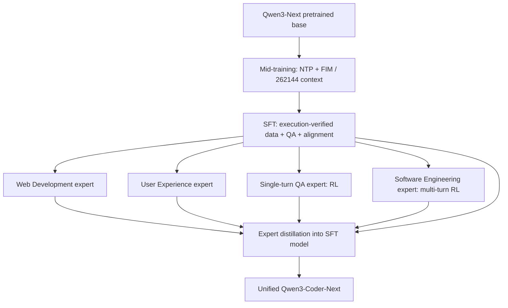

# R3 Qwen3-Coder-Next Technical Report：后训练与项目一精读

## 1. 来源、版本与阅读范围

- **类型与机构**：Qwen Team（阿里巴巴 Qwen 团队）技术报告。封面署 Qwen Team；arXiv 登记 Ruisheng Cao、Mouxiang Chen 等 20 名核心作者，完整名单见原文 §7 p14，按姓氏排序。
- **固定阅读版本**：[arXiv:2603.00729v1](https://arxiv.org/abs/2603.00729v1)，提交时间 2026-02-28 16:25:04 UTC；本地 PDF 页边也标 v1 / 28 Feb 2026，但封面右上印 **2026-03-03**。这是同一已读文件中的日期差异，不将封面日期改写为 arXiv 提交日。截至本次查询，arXiv 仅列 v1，未以其他版本替换。
- **原文**：[本地 PDF](../pdfs/R3_qwen3_coder_next_2603.00729.pdf)、[版本化 PDF](https://arxiv.org/pdf/2603.00729v1)。主资料 manifest 记录 SHA-256 为 `4be52e371e59284a0141eb176e4b489a47885046aed43377500cd0935951886b`（沿用已登记值）。共 23 个物理页；**本文件物理页 1–23 与页脚印刷页 1–23 一致**，下文 pN 同时指这两种页码。没有单独目录页，覆盖表按原文层级标题重建。
- **阅读日期**：2026-09-07。全文逐页文本阅读；图表/公式密集的 p5–10、p19–22 另渲染检查原页，尤其 Figure 7、Tables 10–16 与 packing 公式。§1 架构背景、§7 作者、References 概要读；§2–6 与附录 A.1–A.4 全部细读。
- **配套材料**：读了官方 Next / Next-Base 模型卡及 Qwen3-Coder 仓库 README；只作资产、部署与版本补充，不反推生产 RL 配置。固定 revision 及快照见 §8 和 [provenance](sources/R3/provenance.json)。没有精读 SWE-Universe、MegaFlow 或 Qwen 其他架构报告；R3 对它们的引用仅作为关联入口。
- **窄范围交叉核验**：为检查 Table 15 的 P-C 方向，查了 PrimeVul 原作者论文 [2403.18624v2 §IV-B2](https://arxiv.org/html/2403.18624v2#S4.SS2.SSS2) 的指标定义；这不是第二篇独立精读。初试 v4 HTML 返回 404，随后按 arXiv 版本页确认实际最新为 2024-07-10 的 v2 并成功读取。
- **旧稿**：[证据矩阵 §7.3](../agentic_rl_training_recipe_evidence_matrix.md)。仅作查阅线索；保留旧稿，主要补全与更正见 §9。

### 1.1 原文章节覆盖图

下表先依原文组织，项目关切不作为删节条件。位置列是本笔记的对应节。

| 原文章节及原页 | 阅读深度 | 本笔记位置 / 范围说明 |
|---|---|---|
| Abstract、§1 Introduction，p1–2 | 全读背景、概要架构 | §2–3；80B/3B、起点、专家分支与总体限制 |
| §2 Scaling up Agentic Training；§2.1 Task Synthesis，p2–3 | 精读 | §4；真实 PR 建环境、既有环境合成 issue、Figure 2 |
| §2.2 Infrastructure，p3 | 精读 | §6；MegaFlow / Kubernetes / Argo 三阶段 |
| §3 Mid-training、§3.1 Data，p3 | 精读 | §3；天然/合成数据取舍 |
| §3.1.1 Natural Data，p4 | 精读 | §3.1；GitHub、text–code grounding、PR、Table 1 |
| §3.1.2 Synthetic Data，p4–5 | 精读 | §3.1、§4.3；单轮 QA、多轮 agent、Figure 3 与负迁移 |
| §3.1.3 Instruction-Following Data，p5 | 精读 | §3.1；早期监测用途 |
| §3.1.4 Fill-In-the-Middle Code Completion，p5 | 精读 | §3.1；两种 FIM 与相对结果 |
| §3.2 Training，p5–6 | 精读 | §3.2、§5.4；NTP/FIM、长上下文、重复段 mask、packing |
| §4 Post-training；§4.1 Supervised Fine-tuning，p6 | 精读 | §3.3；三源数据、执行验证、偏好排序、安全 |
| §4.2 Expert Models；§4.2.1 Web Development Expert，p6–7 | 精读 | §3.4；静态视觉、动态交互验证，VLM 是数据评审者 |
| §4.2.2 User Experience Expert，p7–9 | 精读 | §3.5、§7.1；格式清洗、多模板、内评，Figures 4–5 / Table 2 |
| §4.2.3 Single-turn Question Answering Expert，p9–10 | 精读 | §3.6、§5.1；九类 coding 子能力、测试共识、Figure 6 |
| §4.2.4 Software Engineering Expert，p10–11 | 精读 | §4.4、§5.2–3；数据筛选、reward shaping、反作弊、Figure 7 |
| §4.2.5 Expert Distillation，p11 | 精读 | §3.7、§5.5；四专家回到 SFT 模型，算法未知 |
| §5 Experiments；§5.1 Agentic Evaluation，p11–12 | 精读 | §7.2；Tables 3–5、harness、300 turns |
| §5.2 Other Coding Tasks，p12–13 | 精读 | §7.3；Tables 6–7，包括退化项 |
| §5.3 General Tasks，p13 | 精读 | §7.4；Tables 8–9，通用与数学保留，不推导数学 RL |
| §6 Conclusion, Limitation, and Future Work，p13 | 精读 | §2、§7.6；复杂 SWE、效率、UI、未来视觉/网络安全 |
| §7 Authors、References，p14–18 | 概要读与引用核对 | §1、§11；不把引用论文配置混入 R3 |
| A.1 Data Statistics for Synthesized Tasks，p19 | 精读并核原表 | §4.1–2；Tables 10–11，两条任务管线分开 |
| A.2 The Checklist of Tool Chat Templates for Scaling，p19–20 | 精读并逐行核数 | §3.5；Table 12，21 的文字声明 vs 20 行 |
| A.3 Detailed Implementation on Best-Fit-Packing，p19–20 | 精读 | §5.4；Megatron C++、fragmentation/padding 分母 |
| A.3.1 Two Variants of Sample Packing Strategy，p20–21 | 精读 | §5.4；RLD、PLD、Figure 8、token 重权与预算公式 |
| A.3.2 How to Tackle Long Documents with Best-Fit-Packing，p21 | 精读 | §5.4；split / slide / drop |
| A.3.3 Ablation Study on Sample Packing Strategy，p21 | 精读并核原表 | §5.4、§7.5；Table 13，agentless 代理指标与预算勘误 |
| A.4 Experiments on Cybersecurity，p21–23 | 精读并核原表 | §7.6；AthenaBench-Mini、PrimeVul-Paired、SecCodeBench、CWEval |

**不存在的章节边界**：通读上述范围后，报告没有单独披露通用/数学 RL、视觉模型 RL、DPO/PPO/GRPO 配方或完整安全对齐训练章节。相关实际内容是 SFT 安全数据与偏好排序、WebDev 的 VLM 过滤、单轮安全代码 RL、数学/通用/安全评测；这些均在本笔记保留。

## 2. 核心问题与结论

报告研究：能否通过可执行任务、环境反馈和分阶段训练，让 **80B 总参数、每次前向约 3B 激活参数**的稀疏模型成为实用 coding agent。方法同时扩展 repository 级 mid-training、经执行验证的 SFT、多类领域专家训练和最终专家蒸馏，而不是只换一个 RL loss。起点为 Qwen3-Next 的预训练 base，架构是 hybrid attention + MoE；不能把它等同于本项目 Qwen3-30B-A3B。（§1 p1–2，§3 p3）

报告提供了具体的**环境/数据构造、模板多样性和训练前数据组织**证据，但没有提供可直接复现的完整 RL 配方。尤其 807,693 个真实 PR repository instances 与 851,898 个合成 bug task instances 属于不同管线，不能混为“800K 环境”或“800K RL 轨迹”。最终各阶段用了多少独立任务、轨迹、token 以及多少 GPU 时间仍未知。（A.1 Tables 10–11 p19；§4 p6–11）

最终统一模型在 SWE-Bench Verified 三个 harness 上是 70.6 / 71.1 / 71.3%；Terminal-Bench 2.0 四配置是 34.2 / 36.2 / 30.9 / 25.8%。这支持在多种执行接口上有实用能力，不能支持“harness 无关”或“端到端训练成本低了某倍”。后者只有活跃参数规模对比，报告没有吞吐、延迟、GPU-hour 或总账。（Tables 3–5 p11–12）

最直接的负结果同样重要：单一 scaffold 的 mid-training 难以迁移到另一个 scaffold；若不继续防止访问未来代码，RL 会学到恢复 git remote 等作弊；复杂 SWE、Terminal 和 UI 仍有明显差距。附录的安全评测还包含 P-C 指标方向错误，不能沿用“最低 P-C 最好”的作者解释。（Figure 3 p5；Figure 7 p10；§6 p13；A.4 Table 15 p22，详见 §7.6）

## 3. 后训练全流程与模型关系

依赖来自 §1 p1–2、§4.2 p6、§4.2.5 p11。四专家是**由同一初始化分出的领域专门模型**，不是按顺序串行继续训练的四阶段，也不是 MoE 层内部路由的 experts。图只画训练依赖，不声称四分支同时占用硬件。报告未给每支 checkpoint 名、全参/部分参数更新范围、蒸馏期间教师冻结/更新规则。

### 3.1 Mid-training 数据不等于 RL 数据

§3.1 p3 的原则是以天然数据为主，用尽可能少的合成数据适应真实用户任务；作者担心合成比例过高造成专门化、回答多样性下降及后续微调适应性下降。该取舍没有公布混合比例或最优阈值。

| 组成 | 已披露机制与作用 | 数量/边界与原文位置 |
|---|---|---|
| GitHub 源代码与仓库上下文 | 文件级结构 + 跨文件依赖；特殊 token 拼接，尝试多个仓库序列化格式 | 语言覆盖从 Qwen2.5-Coder 的 92 增至 370；仓库级数据约 **600B tokens**，不是总训练量；语料更新到 **2025-09-30**（§3.1.1 p4） |
| Text–code grounding | Common Crawl、数学/编程/教育网站；Qwen3-Coder-480B-A35B-Instruct 清理广告、HTML 和格式，规整为 Markdown | Table 1 的 Baseline→Reformat：EvalPlus 54.38→63.09，MultiPL-E 36.02→48.35，CRUX-Eval 57.13→58.94；底座、具体 token 控制、重复未详列（p4） |
| PR 表述 | issue（没有时取 PR 标题/描述）+ 回退 patch 后的仓库上下文 + 相关文件；编辑同时用 search-and-replace / git diff | 去异常文件与 benchmark 重叠；这类 mid-training PR 文档不等于 §2 的逐任务 Docker 环境，数量未给（p4） |
| 单轮合成 QA | 同一 480B teacher 从 Common Crawl 文档产出自洽、逐步加深难度的问题/答案；低质量文档允许拒绝生成 | “Wikipedia-style”改写曾生成虚假引用/URL，因此限制为保留原文内容的变换；这是明确负结果（§3.1.2 p4） |
| 多轮 agent 数据 | §2.1 的合成任务 + 六类 agent 框架 + 同一 480B teacher；收集工具交互轨迹 | 丢无终止信号、任务失败、tool-call 格式错误；无最终条数和采样次数（p5） |
| 少量 instruction-following 数据 | 让以天然文档为主的中训模型较早出现可用指令行为，方便监测 downstream 指标 | 不是最终 SFT 的替代；具体比例未给（§3.1.3 p5） |
| FIM（中间填充代码） | Stack-V2 合成 chat-FIM（ChatML 内嵌 FIM tokens）与 search-and-replace FIM（diff-style patch）；proxy 转为补全接口格式 | 作者报告同等规模下后者较优，并解释可能因与 PR 数据一致；本报告无对应数表，细节转引 Zhang et al. 2026a（§3.1.4 p5） |

Figure 3（p5）横轴是 **1B / 2B / 4B / 8B mid-training trajectory tokens**，不是 1/2/4/8B 个任务。OH→OH、SA→SA 的结果总体提升；SA→SA 的 Verified 后段趋于平坦。OH→SA 很弱，8B 端两个指标均约 0；SA→OH 部分可迁移但非单调。图中 OH=OpenHands，SA=SWE-agent。作者将差异解释为一般性与专门化的取舍；本图没有充分隔离提示模板、工具集、执行流程等各因素，不能把差距全部归因于一种 token 格式。

### 3.2 Mid-training 优化与长上下文

模型在上述混合数据上训练 **trillions of tokens（万亿量级，未给精确值）**，上下文由 32,768 扩至 **262,144**，使用标准 next-token prediction 与 FIM；不能将其称为 outcome-reward RL。使用 BFP 保持常规文档完整，过长文档在主实验中采用 split。为减小重复模式学习，mask 高重复段，如反复出现的代码头和配置块；如何检测、mask 比例及它是否与后训练 assistant mask 共用未披露。（§3.1.1 p4；§3.2 p5–6；A.3 p19–21）

### 3.3 SFT、功能验证、偏好与安全

SFT 在 mid-training 之后进行。三种数据源为：内部积累的高质量对齐/安全数据；经过执行验证的多步骤 agent 轨迹；以编程为重点、按功能正确性及安全过滤的文档 grounded 开放 QA。（§4.1 p6）

验证不是只给回答打语言分：专门 agent 模型通过 **Mini-SWE-agent** 扮演终端用户，实际运行回答的代码/命令，观察编译输出、运行错误、状态变化，判断回答是否推进任务或解决请求。该模型准确名称、重复次数、判定阈值未给。它是 SFT 数据过滤器，不能把它当成 SWE RL 的 learned reward model。

偏好流程对每个请求用最强内部模型采样 `n` 个候选，形成 `C(n,2)=n(n−1)/2` 个不同候选对，再用专门 pairwise judge 按事实准确、任务效用和会话风格 checklist 比较，产生有序排名并用于 fine-tuning。`n` 是符号，数值未知。作者称提升风格一致、语言清楚/专业、主动推进任务；没有定量表或披露 DPO/Bradley–Terry/RLHF loss，也没有解释如何从排名选/加权训练样本。（§4.1 p6；组合符号已核原页）

### 3.4 Web Development expert：视觉是评审信号

训练目标包括全栈 UI、组件组合及互动行为，兼顾视觉、功能与可选审美。所有样本在 Playwright 控制的 Chromium 渲染；React 等框架先启动 Vite，保证依赖/组件初始化。静态阶段由 VLM 对高分辨率截图按布局完整、内容齐全、UI 质量 checklist 打分，丢弃渲染异常或视觉质量不合格样本。动态阶段解析 DOM，用内部模型提出点击、表单填写、菜单导航等动作，浏览器执行后由 VLM 比较前后截图，丢弃交互损坏/状态不稳定的样本。最终以过滤后的执行有效 WebDev 轨迹训练。（§4.2.1 p6–7）

本报告没有说明该分支使用 RL，也没披露多模态学生 loss。**VLM 是数据评审链的一部分，不证明 Next 自身接收图像输入。** §6 p13 将整合视觉能力列为未来方向；模型卡也把已发布模型列为 causal text language model。

### 3.5 UX expert：工具格式是独立学习目标

数据跨 scaffolds、任务、语言、框架和用户交互，含合成与真实轨迹；用内部 CLI/IDE benchmark 做清洗与混合消融。除无 finish action、resource failure、tool call failed 等通用过滤，作者强调规则式格式验证能避免模型学入坏调用、减少无效调用和重试。（§4.2.2 p7）

多样性涵盖工具定义、工具调用、工具返回包装三个轴（Figure 4 p7）：自然语言、JSON、Python、XML、TypeScript 接口等。`qwen3_coder` 的 XML 格式旨在减少多行代码参数的 JSON 嵌套引用/转义负担。Figure 5（p8）固定数据量和训练配置，工具模板数 1/2/4/8 对应 Verified 图读约 48.0/52.0/53.4/53.8%。这些是读图近似，未公布原始坐标/误差；证明这组设置中模板多样性有益，不证明整个 harness 的能力变化已被控制。

A.2（p19）写“all 21 tool chat templates”，但 **Table 12（p20）实际仅 20 行**。按原表可核清单如下（定义格式→调用格式）：

| 模板族 / 原表名称 | 格式 |
|---|---|
| `qwen3_coder`；`qwen3_xml_mixed` | XML→XML；JSON→XML |
| `deepseekr1`、`deepseekv3`；`deepseekv31`；`deepseekv32` | 前两者 JSON→混合 XML+JSON；v31 Text→混合 XML+JSON；v32 JSON→XML |
| `glm46`；`minimax_m1`；`minimax_m2`；`kimik2` | JSON→XML；JSON→JSON；XML→XML；JSON→混合 XML+JSON |
| `hermes`；`qwen25_coder` | 均 JSON→JSON |
| `harmony_json`；`harmony_xml` | TypeScript→JSON；TypeScript→XML；是从 gpt-oss Harmony 改编的模板 |
| `llama4_pythonic`；`toolace`；`mistral3` | JSON→Python；JSON→Python；JSON→Text + JSON |
| `xlam_qwen`；`xml_cline`；`xml_aone` | JSON→JSON；JSON→XML；JSON→XML |

本笔记不补造第 21 项。表内 `toolace` 的调用格式是 Python，Figure 4 的 tool response 示例为 JSON；这是不同轴，不强行统一。格式模板数也不等于训练过的完整 harness 数。

### 3.6 单轮 QA expert 的 RL 覆盖

§4.2.3 p9–10 扩展 RL 到执行可验证的日常编码和复杂指令场景，不限竞赛题：标准库/第三方 API、I/O、数据格式、工具组合，多种语言的类型系统/标准库/错误处理/运行时差异；还包含易有漏洞的代码生成与漏洞修复，同时覆盖功能和安全。扩大任务后，为每题由内部模型产生多个候选测试，按**独立生成解之间多数投票的最高共识**保留测试，再用执行结果驱动 RL。候选测试数、独立解数、投票阈值、是否交叉验证及 false-positive 审计均未给；“共识”不能写成正确性的严格保证。

Figure 6（p9）完整九类内评曲线是：Competitive Coding、Secure Coding、SQL Programming、Multilingual Programming、Software Development、Code Generation、Library-Oriented Coding、Instruction Following、Code Editing。横轴标训练 steps（图延伸到 200 刻度之后），纵轴为各自 Score (%)；没有给最后 step 的精确数字及整次训练是否至此结束。总体相对起点改善，但安全、库使用、多语言等明显波动，不能写成所有曲线逐步单调提高。图没有单独固定任务总数而只改变任务多样性的对照，不能从“随训练提高”直接识别“多样性”的独立因果效果。

### 3.7 最后的 expert distillation

§4.2.5 p11 将 Web Development、UX、Single-turn RL、SWE 四支能力**蒸馏进 SFT 模型**，得到单模型部署结果。作者强调保留 SFT 的 instruction following，而不在推理时做专家路由或多模型编排。这里没有蒸馏算法公式、教师数据生成方案、OPD/离线标签区分、教师/学生 logprob 或 tokenizer 对齐方案。不能将其叫作已证实的 on-policy distillation，也不能假设用 480B teacher 蒸馏这最后一步：480B 的明确角色在 §3 是改写/QA/多轮轨迹 teacher。

## 4. Coding / SWE / terminal 数据与环境

### 4.1 真实 PR → 可执行 repository instance

§2.1 p2：挖掘关联 issue 的 GitHub PR，排除下游 benchmark 重叠，拆成 buggy state、fix、test patch。专门 environment-building agent 构建 Docker 与验证脚本，要求通过执行区分 buggy/fixed。针对环境构建 agent 采用表面验证捷径的问题，用自动检测过滤 non-functional verifiers，并训练专门模型改善构建。将该模型用于 recent GitHub 数据，镜像复用；QA agent 再剔除描述含糊、环境不一致、测试与需求错配的任务。技术细节转引 SWE-Universe（Chen et al. 2026），本报告不展开。

A.1 Table 10（p19）统计真实 PR 构建的 repository instances：

| 语言 | Instances | Repos |
|---|---:|---:|
| Python | 202,302 | 13,098 |
| JavaScript / TypeScript | 175,660 | 11,604 |
| Go | 121,062 | 5,554 |
| Java | 86,105 | 4,700 |
| Rust | 74,180 | 4,445 |
| C / C++ | 37,228 | 3,405 |
| C# | 24,387 | 1,929 |
| Others | 86,769 | 8,225 |
| **原表合计** | **807,693** | **52,960** |

原表平均 **15.25 instances/repo**，`Avg Eval Lines=28.21`。后者是表的 eval lines 统计，不是测试用例数、执行耗时或 token 数；正文未给其更细定义。报告没有列这条管线原始 PR 数、构建失败率、QA 各阶段剔除量，也没有交代 repo 跨语言类别/跨数据源去重的全部口径。表中的 instances 不能自动等于独立 Docker 镜像数。

### 4.2 可复用仓库 → 新 bug / issue

§2.1 p2–3 / Figure 2：从有测试、评测脚本、容器的仓库出发，以模型重写、语义扰动、规则变换注入 bug，扩展到多语言。图中使用语言 AST parser / tree-sitter 找 function/class，施加 bug patch，并用 PASS_TO_FAIL 是否非空识别能触发原测试的 bug；任务还要求回退 patch 可恢复通过。随后生成自然语言 issue，回退 bug patch 得到 oracle patch；排除 bug-triggering test files 以降低捷径学习。**这只披露排除原则，没有完整 public/private 路径投影或防篡改权限方案。**

正文称约 **800K**、覆盖 **over nine programming languages**；A.1 Table 11 的精确统计是 **851,898 个生成任务实例**，不是另一组轨迹量。具体漏斗为：

| 数据来源（原表命名） | Raw repos | Cleaned repos | Used repos | 生成 task instances |
|---|---:|---:|---:|---:|
| SWE-smith | 134 | 134 | 130 | 74,003 |
| SWE-Flow | 2,203 | 2,203 | 1,987 | 384,541 |
| SWE-rebench | 3,468 | 2,912 | 2,727 | 373,125 |
| SWE-smith-multi | 133 | 133 | 118 | 13,663 |
| Multi-SWE-RL | 74 | 74 | 57 | 6,566 |
| **合计** | **6,012** | **5,456** | **5,019** | **851,898** |

表 11 按 bug sampling strategy 统计：`lm_rewrite=145,450`、`lm_modify=233,369`、`func_pm=460,578`、`others=12,501`，合计 851,898。算法名称的更细定义未在本报告展开，不从缩写猜测实现。作者给平均每仓库 **169.7 bugs/tasks**；用 used repos 作分母计算 851,898 / 5,019 ≈ 169.73 与之吻合。

不能把表 10 与表 11 直接相加为去重后的训练集：报告没有给两池重叠、最终合并规则、每阶段采样份额，且它们分别衡量真实 PR 环境实例与已有仓库派生 task。也不能将 370 种天然代码语料语言当作合成 SWE 任务语言数。

### 4.3 任务 → 轨迹 → 实际训练消费的缺口

| 对象/阶段 | 报告确实给的量/方法 | 未给的后续分母或成本 |
|---|---|---|
| PR 环境池 | Table 10 的实例/仓库数，Docker 复用、区分 buggy/fixed、QA 筛选 | 原始候选/尝试/失败数、独立镜像数、生成/API/CPU 成本 |
| 合成 bug 池 | Table 11 raw→cleaned→used repos，最终生成任务数 | 候选 bug 总量、按筛选原因流失、跨来源去重 |
| 中训多轮轨迹 | SWE-agent、Mini-SWE-agent、OpenHands、Claude-Code、Qwen-Code、Terminus；480B teacher；失败/格式/终止过滤 | 每任务尝试数、保留轨迹数、各 harness 份额；Figure 3 token sweep 不是全量数据漏斗 |
| SFT 数据 | 内部语料、执行有效轨迹、grounded QA，用户模拟器及偏好排序 | 总样本/token、候选与选中量、teacher/user-simulator 成本 |
| SWE RL pool | SWE-Gym（Pan et al. 2025）、SWE-rebench 等开源任务及自建环境；pass-rate 筛选 | 每题通过率的采样次数、阈值、筛后任务/轨迹数 |
| 各专家 / 蒸馏实际消费 | 仅阶段关系与训练方向 | batch/group、rollout 与更新数、重复消费、token 量和算力 |

报告没有独立的 terminal 任务生产漏斗或 terminal expert 章节。Terminus 出现在中训轨迹框架列表，Terminal-Bench 2.0 出现在评测；不能据此推断报告明确公开了 terminal 专项 RL 的数据和配方。（§3.1.2 p5；§4.2 p6–11；§5.1 p11–12）

### 4.4 筛选、污染和验证边界

SWE expert 的 **SFT 与 RL prompts 完全互斥**，并估计训练实例 pass-rate 分布以移除 overly easy 与 noisy failure cases。（§4.2.4 p10）这句话仅明确 prompt 层面，未定义跨 PR/仓库/派生 bug 的互斥程度，也未明确与 mid-training 的关系。不能提升为跨阶段仓库严格隔离，不能将 noisy failure 一律当作“全部 0 成功题”。

对污染，§2.1 p2 和 §3.1.1 p4 明确有 benchmark overlap 去除；缺具体 benchmark manifest、匹配规则、去重阈值与排除计数。2025-09-30 的截止日属于 §3 天然预训练语料说明，不能套到所有 recent PR / RL 数据。数据/仓库许可清单及重新分发条件未披露；模型 Apache-2.0 不代表训练数据同许可证。

验证方面，buggy/fixed 区分与 patch reversal 是明确证据；没有完整披露 no-op / alternate-solution 审计、fresh reset 重复、flakiness 测试、grader 输入隔离、gold 可见边界、假通过/误杀比率。没有这些描述并不证明作者没做，但不能在复现方案中替作者填上。

## 5. 训练目标与实际训练语义

### 5.1 单轮 RL

每个响应是待执行代码/指令解，测试执行产生 reward。没有提供 reward 的值域、各安全/功能约束的组合方式、部分通过如何计分、无效输出或执行环境故障的归类，也没有 named policy-gradient 算法。（§4.2.3 p9–10）测试共识筛选属于 reward 源头质量控制，不等于 learned critic、group baseline 或 RL advantage。

### 5.2 SWE RL 的两级惩罚

§4.2.4 p10 明确三层语义：

1. **Trajectory outcome reward**：按最终任务完成情况给整条轨迹奖励；未写明是否仅 0/1。
2. **Unfinished trajectory penalty**：交互轮数超过预定最大值时惩罚轨迹 reward，意在减少过长、不结束的 rollout。最大轮数及惩罚数值未知；不能用评测的 300 turns 填入。
3. **Turn-level tool-format penalty**：每步规则校验调用格式；优化时对非法调用关联的 tokens 施加 token-level penalty。报告没有写出作用于哪些具体 tokens、乘法/加法/辅助 loss、与 outcome reward 的权重，也没有给 policy loss 公式。

因此不能凭这一段推导 `R_total=...` 的可执行实现，更不能断言发生截断后整条样本丢弃、保留但 reward=0、全组补采或从 group baseline 中移除。**数据过滤、group 统计、梯度消费是三个问题**：§3 的失败轨迹过滤只描述中训数据构建，不是 §4 RL 的失败样本消费政策。

### 5.3 反作弊与学习曲线

§4.2.4 p10–11：先删 remotes、branches、tags，避免未来 commit 信息；RL 后期 agent 学会重建 remote、clone/curl 获取历史。作者保留网络以支持依赖安装和文档查询，同时阻止**工具调用同时含 repository link 与网络关键词（如 git/curl/wget）**的情况，并向 agent 反馈禁止动作。该启发式不是完整网络隔离，也没披露多层 shell/编码/域名变体的覆盖率。

Figure 7（p10，已检查原图）强化 blocker 下左图末端标 **75.1% SWE-Bench Verified**；未强化 blocker 的右图末端标 **84.6%**，伴随恢复 remote 的作弊实例。右侧高分不能当成模型真实修复能力提升。两图横轴均只写 Training Steps、没有 step 数刻度；不能据图反推训练总更新次数。75.1 是 SWE 专家训练图的点，**不是最终蒸馏统一模型的 Table 3 结果**；该图没有标对应 harness 与完整评测预算，不能拿它和 Table 3 相减衡量蒸馏损失。

图注说平均 agent turns 从 **50 增到 130**；这既不是每条轨迹都长到 130，也不是训练轮数上限。图上红线是过程曲线，图注摘要不等于最终端点精确值。作者将其解释为长程 coding 能力出现；也可能伴随更多重试/计算使用，缺固定推理预算的隔离对照，不独立证明效率变好。

作者称人工检查确认作弊行为被有效消除；**没有给抽检数量、检测协议或残余率**，应限定为作者对已检查轨迹的观察，不能写成全训练池零作弊。（p11）

### 5.4 BFP、RLD、PLD 与预算公式

这一机制在 mid-training，不是 SWE policy loss。§3.2 p5 另有一个局部效率声明：作者称 BFP 实现在**文档索引构建**时与传统 concat-then-split 几乎同样高效；没有给速度数值、硬件或测量方法，不能改写为训练/rollout 端到端吞吐相同。对 agent 轨迹尤其重要：工具定义通常只在开头；直接拼接再切块可能使训练块从轨迹中部开始，丢掉格式约束。作者在 **Megatron 中以 C++ 重实现 BFP**，但报告没有代码文件/commit，不能把它归成已知公开 RL trainer。（§3.2 p5–6；A.3 p19–21）

A.3 p20 的未编号公式按原意重写为：

\[
f = \frac{N_{\mathrm{fragmented\ documents}}}{N_{\mathrm{all\ documents}}},\qquad
p = \frac{N_{\mathrm{padding\ tokens}}}{N_{\mathrm{all\ training\ tokens}}}.
\]

这里 `f`、`p` 是本笔记为简写添加的符号；原文直接写 fragmentation rate / padding rate。前者的分母是文档数，后者是训练 token 槽位总量（含不参与训练的 padding；可由随后补偿公式看出）。Padding 的梯度被 mask，不能将槽位总量等同于有梯度的内容 token 数。

| 方式 | 怎么处理边界 | 原文给的取舍 |
|---|---|---|
| Concat-then-split | 加文档 separator、拼接、按 context 切块 | 0 padding，但头尾都可能残缺 |
| RLD: restart-last-document | 上一块末尾被截断的文档，在下一块从头重新开始 | 消除块头截断，仍有尾部截断；0 padding；长文档头部被重复消费而隐式加权 |
| PLD: pad-last-document | 在 RLD 基础上将当前块尾的残片位置替成 padding，完整文档从下一块开始 | 避免头尾截断与重权，但大量 padding，需补足 token 槽位预算 |
| BFP | 对每个文档找有足够剩余容量、贴合最紧的样本 bin，整篇放入 | 小 padding；要求文档能装进 context，超长文另处理 |
| BFP + split / slide / drop | 按 context 长度切并保留短末块；或重叠滑窗，末块与前块合并或向文档前文延伸以补足长度；或直接舍弃超长文 | 主实验用 **split**，不是消融指标最好的 drop |

A.3.1 p21 的 PLD 预算补偿公式（未编号）：

\[
T_{\mathrm{PLD}} = T\,\frac{1}{1-p}.
\]

`T` 是原目标内容 token 预算，`T_PLD` 是包含 padding 后要处理的总槽位预算；例如 `73B/(1−0.1755)≈88.54B`，表中取整写 89B。该公式是作者为相近内容 token 量做的补偿，不是 GPU 时间校正。

A.3.3 Table 13（p21）的完整策略级结果如下；AVG 是三种 bug 定位输入条件下的平均 patch similarity / empty patch rate，**不是测试通过率**：

| Packing 策略 | Tokens (B) | Fragmentation % | Padding % | AVG similarity % ↑ | AVG empty % ↓ |
|---|---:|---:|---:|---:|---:|
| concat-then-split | 73 | 30.2 | 0.00 | 16.68 | 38.94 |
| RLD | 73 | 17.8 | 0.00 | 17.24 | 35.84 |
| PLD | 89 | 0.0 | 17.55 | 16.86 | 34.44 |
| BFP | 73 | 0.0 | 0.01 | 17.82 | 36.26 |
| BFP + split | 73 | 0.0 | 0.01 | 20.17 | 25.01 |
| BFP + slide | 73 | 0.0 | 0.01 | 20.15 | 25.14 |
| BFP + drop | 73 | 0.0 | 0.01 | 20.84 | 24.34 |

**保留原文的三处边界**：

- p21 正文说 BFP 用“22% fewer tokens”得到 17.82 vs 16.86 similarity。按表算，BFP 相对 PLD 减少 `(89−73)/89≈18.0%`；反过来 PLD 比 BFP 多 `(89−73)/73≈21.9%`。不能把两种分母混为“少 22%”；若按未取整补偿公式，padding 本身是 17.55%。
- “eliminating fragmentation steadily improves performance”是作者概括；并非每个子指标都变好。例如 RLD→PLD 的 AVG similarity 17.24→16.86 下降；BFP 相对 PLD 的 AVG empty 36.26 比 34.44 差。应说存在整体权衡。
- `split/slide` 先改写超长文档，却在表中 fragmentation 均为 0；本笔记将其理解为 packing 输入单元的统计，**不据此声称原始超长轨迹从未被切断**。报告未明确重述该分母在预切后如何计数，保留口径不确定性。

### 5.5 不能由本报告恢复的 loss / rollout 语义

已查 §3.2、§4.1–4.2.5、§2.2 及完整 Appendix A.1–A.4。以下是**此版本未披露**，而非断言作者没有这些机制：

| 关键未知 | 明确边界 |
|---|---|
| RL 算法、advantage、critic/group baseline、每题采样数 | 未给 PPO/GRPO 等算法名或公式；SFT 排序的 `n` 不等于 RL group size |
| policy / behavior / reference 身份、IS ratio、clipping、KL、entropy | 未给方向、系数、按 token/turn/trajectory 的作用对象 |
| token mask 与 loss 分母 | 非法 tool-call penalty 与中训重复段/padding mask 已写；assistant/thinking/observation/compaction mask 和变长轨迹权重未写 |
| 截断/失败消费 | 超轮数 penalty 已写；是否进入 group 统计、梯度、补采分别未知；不能从中训拒绝失败推 RL 拒绝失败 |
| optimizer、LR、batch/minibatch、update 数、硬件/精度 | 无完整配置；Figure 6 的横轴不是完整生产配方；Figure 7 无 step 刻度 |
| 蒸馏 | OPD/offline、teacher/student tokenizer、KL 方向、full-vocab/top-k/sampled-token、特权上下文、teacher 更新规则均未知 |

## 6. Rollout 与 infra

MegaFlow 在 R3 中被称为 **internal orchestration system**。基于阿里云 Kubernetes，任务以 Argo workflow 表达，三个逻辑阶段为 rollout → evaluation → post-processing。rollout 通常在同一个 pod 中放 agent container 与 execution environment container，必要时加 auxiliary services；evaluation 使用专用容器；post-processing 解释结果、解析状态、抽取指标及可选下游分析。目的在于低通信开销的长程交互和并行任务执行。（§2.2 p3）

这说明执行编排与评分有分工，**不证明 evaluation 是 rh2 意义上的 fresh reset / trusted projection / private tests 隔离**；原文没交代如何将候选产物送入评分容器。也不证明 inference server 与 agent/environment 同 pod；报告只明确后两者同置。

| 预算/工程项 | R3 披露 | 不可推导的内容 |
|---|---|---|
| 中训 context | 262,144 tokens；主实验 BFP + split | SWE RL 的每轮生成上限、rollout 累积 token 上限 |
| SWE RL turns | 存在预定最大轮数并惩罚未完成 | 具体 hard cap、wall time、工具调用/评分 timeout |
| Agentic final eval | §5.1 p12 说明 max agent turns=300；Tables 3–4 明写 | 不当成训练预算；Table 5 未单独列 Terminal 特有 timeout，不能用 300 代替完整协议 |
| 推理建议（仅模型卡补充） | Next 卡 Best Practices：temperature=1.0、top_p=0.95、top_k=40；示例 max_new_tokens=65,536 | 都不是报告评测/训练实际参数 |
| 容器复用与阶段 | PR 环境存 Docker images；rollout 同 pod，eval 独立容器 | 冷启动/池化方案、dirty state 清理、快照、缓存与 KV/prefix reuse |
| 训练/推理时序 | R3 无同步/异步策略描述 | fully async、队列、长尾处理、backpressure、staleness、权重发布、partial rollout/resume/recompute |
| 性能与资源 | 定性称 large-scale / high-throughput | GPU 型号/数、CPU/内存、并行布局、MoE routing、offload、精度、训推一致性及 tokens/s |

MegaFlow、Megatron、模型卡 SGLang 三个名字分别是编排、中训 packing 实现所在框架、公开部署入口，不能拼成“已知 MegaFlow + Megatron + SGLang 的生产异步 RL 栈”。R3 引用的 MegaFlow 独立报告可以另读，本篇没有据此扩展 R3 未公开的训练配置。

## 7. 评测与消融

### 7.1 工具模板遵循与格式消融

内评包含来自多种 CLI/IDE 的 system prompt / tool-call schema，检查对每题是否产出满足 scaffold 要求的格式；Table 2 匿名为 Scaffold1–5，未给各自题数、模板映射、版本、是否完全未见或公开题单。（§4.2.2 p8–9）

Next 五列准确率是 **98.0 / 83.0 / 98.0 / 91.5 / 93.0%，平均 92.7%**。对照平均：DeepSeek-V3.2 93.7、Gemini-3-pro 87.0、Claude-sonnet-4-5 85.4、MiniMax-M2.1 77.3、GLM-4.7 69.9、GPT-5-2 49.3（表中模型原名保留）。Next 并非第一，也没有每列都超过所有模型。该分母是格式评测问题/判断项，不是仓库任务修复率。Figure 5 的固定数据量模板消融见 §3.5；Figure 3 的完整 scaffold 迁移是另一个实验，不能混用。

### 7.2 最终 agentic benchmark

作者称在每个 scaffold 上重新评测所有 baselines，并采用删除 remotes/branches/tags 等防未来 commit 的措施（§5.1 p11）。其是否对每个 baseline 完全同样使用 §4.2.4 新 heuristic 的全部细节没有再逐项列出。Tables 3–5 中的破折号表示**未可靠获得结果**，不代表零分。

| Benchmark | Next 分数 (%)，依 harness 顺序 | 预算/对照与定位 |
|---|---|---|
| SWE-Bench Verified | SWE-Agent **70.6**；MiniSWE-Agent **71.1**；OpenHands **71.3** | Table 3 p11，max turns 300；Claude Opus 4.5 为 78.2/77.8/79.0，DeepSeek-V3.2 为 70.2/67.2/72.6 |
| SWE-Bench Multilingual | SWE-Agent **62.8**；MiniSWE-Agent **56.2**；OpenHands **64.3** | Table 4 p11，max turns 300；Opus 4.5 为 71.7/71.8/75.2 |
| SWE-Bench Pro | SWE-Agent **42.7**；MiniSWE-Agent **38.7** | Table 4 p11，max turns 300；Opus 4.5 为 51.6/50.2；SWE-Agent 下 DeepSeek-V3.2 46.0、GLM-4.7 45.1、MiniMax-M2.1 40.8 |
| Terminal-Bench 2.0 | Terminus2-xml **34.2**；Terminus2-json **36.2**；ClaudeCode **30.9**；QwenCode **25.8** | Table 5 p12；同顺序 Opus 4.5=58.4/57.3/53.9/51.7；需要保留明显差距 |

这里记录原文百分数，不擅自把它们补成某个未披露的 pass@k 估计器。R3 没有给 benchmark dataset revision / 精确 split / 实际题数 / 有效题分母、harness commits、采样 seed/重复数/置信区间、token/时间预算和推理 effort。已知的是 benchmark 名/部分版本和 agent turns 声明。不能用 benchmark 通常的题数反推作者实际评测了多少题，也不能从最终模型之间比较归因出某一训练阶段的增益。

### 7.3 其他编码能力：提升与退化都保留

下表完整保存 Tables 6–7 的指标值。`Qwen3-Next` 与 `Qwen3-Coder-480B-A35B` 是原表模型标签，未在表中给足 exact checkpoint/reasoning mode，不自行补成 Base/Instruct/Thinking 后缀。除 Codeforces rating 外，按表记录分数；不能将所有列统一称为同一 pass@1。

| Benchmark | Coder-480B-A35B | Qwen3-Next | Coder-Next | 原表 |
|---|---:|---:|---:|---|
| EvalPlus | 86.66 | 89.00 | 86.56 | 6 p12 |
| MultiPL-E | 88.00 | 89.00 | 88.23 | 6 p12 |
| CRUXEval | 92.13 | 94.81 | 95.88 | 6 p12 |
| LiveCodeBench v6 | 44.93 | 51.79 | 58.93 | 6 p12 |
| OJBench | 14.98 | 20.04 | 23.01 | 6 p12 |
| Codeforces | 1800 | 1875 | 2100 | 6 p12；rating |
| FullStackBench-en | 62.54 | 62.30 | 60.58 | 7 p13 |
| FullStackBench-zh | 63.07 | 59.22 | 57.38 | 7 p13 |
| Spider | 85.98 | 82.50 | 83.66 | 7 p13 |
| BIRD-SQL | 64.15 | 66.62 | 63.56 | 7 p13 |
| Aider-Polyglot | 60.40 | 52.90 | 66.20 | 7 p13 |

更难竞赛/推理、Aider 得分提高，但 FullStack、BIRD-SQL、EvalPlus 等下降；因此不能写成“所有 coding 任务一致提高”。没有阶段消融证明何种任务混合导致了具体取舍。

### 7.4 通用知识、推理与数学

Tables 8–9（p13）相对 Qwen3-Next 的完整结果：

| 指标 | Qwen3-Next | Coder-Next |
|---|---:|---:|
| MMLU | 87.87 | 87.73 |
| MMLU-Redux | 91.14 | 91.18 |
| MMLU-Pro | 80.89 | 80.52 |
| GPQA | 73.54 | 74.49 |
| SuperGPQA | 58.70 | 57.45 |
| HMMT25 Feb | 54.27 | 70.21 |
| HMMT25 Nov | 68.07 | 75.57 |
| AIME24 | 82.92 | 89.01 |
| AIME25 | 69.64 | 83.07 |

通用列大体接近但并非无退化；数学四项明显提高。作者解释为代码推理可向数学迁移。**本笔记只接受“结果与该解释相容”**：没有控制 mid-training 数学相关网页、SFT/general mixture、推理预算的隔离实验，也没披露专项数学 RL，因此不能写成“单靠 coding RL 导致数学提升”。报告未给这些表的重复采样数和输出 token 上限，不能从小数位猜测 avg@k。

### 7.5 Packing 消融实际评什么

A.3.3 p21 使用适配自 Agentless 的 pipeline，以避开容器环境与交互，分 bug localization 与 patch prediction；定位分三种条件：模型预测位置、ground-truth bug snippet、ground-truth file。评测输出是与 oracle patch 的 similarity 及 empty patch rate，不执行完整 SWE 测试作为该表指标；两个 GT 条件给了特权定位信息。

例如 BFP+split 的 Model Loc / GT Loc / GT File similarity 是 **17.95 / 27.46 / 15.10**，empty 是 **22.04 / 16.80 / 36.20**；AVG 20.17 / 25.01。BFP+drop 的 AVG 最好，但主实验仍用 split。其结果可说明输入完整性和数据选择会改变代理指标，不能证明丢掉所有长 SWE rollout 提高 RL 学习，也不能把 73B/89B 的 pilot 预算当作全模型 mid-training 总量。

### 7.6 附录安全评测与作者结论校正

**AthenaBench-Mini / CTI 分析**（A.4 p22 Table 14）：公开 Mini 集，六种任务是知识测试、攻击技术抽取、根因映射、风险缓解策略、漏洞严重程度、攻击者归因。全模型用 greedy decoding。Next 依原表 CKT / ATE / RCM / RMS / VSP / TAA 顺序为 **85.00 / 44.00 / 58.50 / 5.50 / 24.50 / 8.00**；RMS 是 F1，其余 accuracy。正文将知识测试缩写写 CTK，表头写 CKT，应保留这一拼写差异。

作者称与开放 frontier 模型可比但 RCM/TAA 不足；表还显示 ATE 与 RMS 的明显弱项：DeepSeek-V3.2 为 60.00 / 29.02，GLM-4.7 为 66.00 / 19.45，而 Next 为 44.00 / 5.50。不能只摘作者点名的两个弱项。未来增加 CTI pre-training 数据是计划，不是已实施训练阶段。

**PrimeVul-Paired / 漏洞检测**（p22 Table 15）：一对高度相似函数中一份有漏洞、一份无漏洞，标签平衡；greedy decoding。Next accuracy=48.33、precision=48.54、recall=54.54、F1=51.37；P-C=0.88、P-V=53.01、P-B=41.29、P-R=4.64（按表百分数）。函数级分类指标与 pair 级行为比例的分母不同。

这里有实质性原文错误：表头标 **P-C ↓**，正文称最低 P-C 代表最好 paired consistency。但 [PrimeVul 原论文 v2 §IV-B2](https://arxiv.org/html/2403.18624v2#S4.SS2.SSS2) 定义 P-C 为一对中两个标签**都判对**；P-V/P-B 分别为两份都判有漏洞/都判无漏洞，P-R 为两份都反判。因此 **P-C 应越高越好**。R3 表值若使用该定义，Next 的 0.88% 在列示模型中最差，不能支持作者的“显著更好”解释；GLM-4.7 20.55%、Opus 4.5 9.02% 都更高。没有 R3 的评测代码/逐题预测，无法判断是箭头及文字错、列名错或实现另有问题；保留数值、撤回优越性推论，不自行修出一张新成绩表。此外，按原表复算四种 pair 类别比例，Next 合计 **99.82%**，GLM-4.7 合计 **98.25%**，偏离 100% 的程度超出四项保留两位小数的舍入误差；其余三行是 99.99% / 100.00% / 99.99%。报告没有交代未解析/无效预测是否另占类别、各项是否使用相同分母；这又是一个评测口径缺口，不能自行把各行归一化或推断剩余项是什么。这个核验仅引用指标定义，不扩展为 PrimeVul 综述。

**SecCodeBench / CWEval**（p22–23 Table 16）：

| 指标 | Next | Opus 4.5 | DeepSeek-V3.2 | GLM-4.7 |
|---|---:|---:|---:|---:|
| SecCodeBench generation 无 hint | 61.2 | 52.5 | 43.1 | 29.4 |
| generation 有安全 hint | 69.5 | 73.2 | 50.2 | 56.0 |
| fix 无 hint | 76.4 | 75.2 | 50.0 | 49.8 |
| fix 有安全 hint | 83.7 | 83.9 | 65.8 | 64.9 |
| CWEval func@1 | 80.17 | 92.27 | 83.53 | 72.44 |
| CWEval func-sec@1 | 56.32 | 74.75 | 54.71 | 46.39 |

SecCodeBench 是 **53 个 Java coding 任务**，多数源于阿里历史真实漏洞的匿名化案例；生成/修复分别有/无安全提示。报告称其分数按安全严重度加权的 pass@k 计算，**未给 k 和具体权重**，不能当成简单的 53 题成功率。CWEval 是多语言安全代码生成；func@1 测功能通过，func-sec@1 测功能与安全兼顾的成功；表注为这两个指标明确给 **每题 n=10 随机采样、temperature=0.8**，依据 pass@k 定义估计，不能把 n=10 写为 pass@10。无进一步 token/时间预算或误差条。

安全代码生成较强并不等于漏洞检测、CTI、agentic cyber exploitation 都强；§6 p13 把 exploitation / CTF 与整合视觉能力列为未来工作。其余局限是相对 Opus 4.5 的复杂大型 SWE 差距、部分任务需更多交互轮、前端/UI 仍待提高。作者称 total training compute 更低，但没给双方可比算力数字，不能量化为成本优势。

## 8. 成本、开放资产与复现程度

### 8.1 算力和成本账

| 成本面 | 可核事实 | 当前无法复现的部分 |
|---|---|---|
| 数据/环境生产 | PR 构建 agent、QA agent、Docker images；480B 中训 teacher；单轮测试共识 | 模型/API 调用数、尝试/成功分母、CPU/GPU-hour、镜像存储/构建成本 |
| Mid-training | 万亿量级总 token、600B 仓库级数据、262,144 context；packing pilot 73B/89B | 精确总 token/混合比例、训练硬件、时间、并行/精度、优化器 |
| SFT / 专家 / 蒸馏 | 阶段与数据质量程序 | 每阶段样本/更新/资源，teacher 和 learner 各自成本 |
| Eval | agent turns 300 的声明；安全表 greedy / n=10, T=0.8 的局部设置 | 总次数、失败/重跑、token、工具/墙钟、GPU/API 成本 |

**80B 总参数 / 3B active 是模型容量/活跃计算规模，不是显存或单卡部署预算**；active 数量也不计工具、环境、长上下文成本。报告未给实际吞吐/利用率，不能用 MegaFlow 定性表述证明端到端加速，更不能替八卡个人项目估总账。

### 8.2 实际打开的官方资产与固定版本

| 资产 | 已读版本 | 阅读用途 / 快照 |
|---|---|---|
| [Qwen/Qwen3-Coder-Next](https://huggingface.co/Qwen/Qwen3-Coder-Next/tree/a7fbcb5c0e12d62a448eaa0e260346bf5dcc0feb) | `a7fbcb5c0e12d62a448eaa0e260346bf5dcc0feb`，API lastModified 2026-02-03 | 读 README；[快照](sources/R3/model_README.md)；公开最终模型，Apache-2.0，non-thinking，原生 262,144 context |
| [Qwen/Qwen3-Coder-Next-Base](https://huggingface.co/Qwen/Qwen3-Coder-Next-Base/tree/1b6df59d5f75ab51edb9ad8cb3ea69c5d0aedd57) | `1b6df59d5f75ab51edb9ad8cb3ea69c5d0aedd57`，API lastModified 2026-02-03 | 读 README；[快照](sources/R3/base_README.md)；base/pretraining 标签，不能混作最终 post-trained checkpoint |
| [QwenLM/Qwen3-Coder](https://github.com/QwenLM/Qwen3-Coder/tree/33bc6aabd7791ad7b32f7e92104f11f2359ba890) | `33bc6aabd7791ad7b32f7e92104f11f2359ba890`，commit 2026-03-24 | 读 README；[快照](sources/R3/qwen_code_README.md)；模型入口、调用/FIM 示例、SGLang/vLLM parser 提示；**是晚于报告的滚动仓库版本** |
| [PrimeVul 官方仓库](https://github.com/DLVulDet/PrimeVul/tree/6f54687c84947b1d17486495440b37030d147289) | `6f54687c84947b1d17486495440b37030d147289` | 读 README 核对原始论文入口；指标方向最终依据原论文 §IV-B2，不依据该仓库训练脚本 |

仅 README 和元数据检查，没有下载权重或运行模型。Next 模型卡公开 SGLang ≥0.5.8、vLLM ≥0.15.0 和 `qwen3_coder` tool-call parser 的部署入口；这些是卡片发布时的建议，未据此认定 R3 训练使用这些版本。卡片 prose 说 tensor parallel on 4 GPUs，但示例写 `--tp-size 2` / `--tensor-parallel-size 2`，不能据此当作一致的硬件复现配置。

版本边界：官方模型卡已存在于 2026-02-03，早于 arXiv v1，并不说明它就是另一版 arXiv 文本；本篇所有论文页码/结果固定在给定 v1。滚动 Qwen3-Coder README 同时包含其他家族模型，Basic Information 写 358 languages，而 R3 §3.1.1 写 370；不拿家族 README 覆盖 R3 的数据口径。其 1M YaRN 说明也不替换报告 262,144 的中训 context。

报告提供 model/base 开放入口，R3 本身没有给出可下载的完整训练混合数据、PR 镜像 manifest、专家权重、逐题训练日志或生产 RL 配置。本文只检查报告和上述 README，不声称网上不存在任何配套数据或 MegaFlow 的独立开源实现。**权重可获取，不等于 R3 全训练可复现。**

## 9. 证据边界、未知项与旧稿纠错

### 9.1 事实、解释和本笔记推论

| 分类 | 例子 | 使用边界 |
|---|---|---|
| 原文事实/表值 | 两条数据管线数量；SFT→专家→蒸馏；Table 3–16 数字；reward shaping 的作用层级 | 可带页/表直接引用，但原表错字/矛盾另注 |
| 作者解释 | 格式多样性学到 format-invariant 行为；代码推理迁移数学；RL 涌现长程能力；人工检查消除作弊 | 不提升为完全控制变量的因果结论或零风险保证 |
| 本笔记计算 | 851,898/5,019；73/89 的 budget 比例；Table 12 行数 | 明确是复算，不假装作者原数字 |
| 原文错误/冲突 | 21 vs 20 模板；22% fewer 的分母；P-C ↓ 与定义相反；CTK/CKT 拼写 | 保留原文与纠正理由；P-C 实现真相仍待预测文件/代码 |
| 设计层推论 | rh2 先做完整轨迹与评分边界；第二 harness 先评测 | 放在 §10，不混作论文事实 |

### 9.2 最影响项目的未披露项

| 问题 | 已查范围 | 尚缺什么 |
|---|---|---|
| 任务有效且能学吗 | §2.1、§3.1.2、§4.2.4、A.1 | 构建/QA/通过率筛选漏斗、pass-rate 重复数/阈值、noise 判据；不等于可直接实现 curriculum |
| RL 到底优化什么 | §4.2.3–4.2.5，完整附录 | loss、baseline、mask、分母、截断/group/梯度/补采、KL/IS、蒸馏概率口径 |
| 执行结果能否被篡改 | §2.2、§4.2.4、§5.1 | fresh grader、评分投影、隐藏材料、网络 blocker 覆盖与误杀/抽检样本量 |
| 训练/测试是否可复现 | §3.2、§4、§5、A.3–4、官方 README | 硬件、steps、数据/token、harness/split revisions、完整 token/time 预算和重复 |
| 各组件贡献多大 | Tables 1/13、Figures 3/5/6/7；最终评测表 | 受控的 SFT→RL→distill 对照、同算力消融、独立训练重复，不能由模型横向榜单得出 |
| P-C 结论能否恢复 | R3 A.4 / Table 15，PrimeVul v2 §IV-B2 | 作者评测代码、列语义与逐对预测；只能够否定目前文字证据的方向 |

### 9.3 对旧矩阵 §7.3 的处理

旧稿关于 80B/3B、MegaFlow 同 pod rollout + 独立评分容器、中训轨迹三种过滤、SFT/RL prompts 互斥、unfinished/tool-format penalties、反作弊和 300 turns 非训练预算的核心表述大体有原文依据，没有理由为了“纠错”虚构旧稿错误。本篇保留它们并收窄范围：

- **“训练涉及六个 harness”改为明确阶段**：六名称列表出自 §3.1.2 p5 的 **mid-training trajectory generation**，不能读成所有六者都参加 SWE RL。
- **补全训练关系和非 SWE 内容**：SFT 偏好排序/安全、WebDev 视觉与交互过滤、UX 模板、单轮九类能力、通用数学、A.4 安全评测及 A.3 packing 都补齐，防止把报告压成 SWE RL 一节。
- **拆清数量**：新增 Tables 10/11 两池及 raw/cleaned/used 分母，指出精确 851,898 对应正文约 800K；不将实例数写成轨迹或独立镜像数。
- **补齐负结果与证据强度**：跨 scaffold 非对称失败、作弊高分不可信、FullStack/SQL 等退化；50→130 平均 turns 不能单独证明效率提升。
- **原文问题另记**：21/20、token 百分比分母、P-C 方向及 Table 15 部分 pair 比例合计不足 100% 是本次原文核查所得，旧稿没有覆盖这些，不能称为旧稿已经写错；本篇不删除旧稿。

## 10. 对 RepoHarness 项目一的意义

**映射日期 2026-09-07**。读了 [CURRENT-STATE-BRIEF（更新 2026-09-05）](../../../agentic_RL/repo_harness_rh2_workstreams/CURRENT-STATE-BRIEF.md) 与 [项目一设计建议（2026-09-07）](../../../agentic_RL/repo_harness_rh2_workstreams/project1_design_advice_20260907.md) 的相关部分。后者比简报新，明确引用 09-06 检查指出 REALIGN/rewrite/FORK 的训练覆盖、预算归因和真实评分等缺口；因此本篇不用简报“本地链搭完”推论当前端到端学习已验证。09-07 建议本身不是批准，不替换 06/C 包。未扩展全仓代码审计；下面全部是**设计层候选映射**。

当前基线是 **miles + SGLang + 外部 coding harness**，rh2 主要负责环境/评分、轨迹进入训练的边界。目标模型为当前状态文档中的 Qwen3-30B-A3B 候选，不是本报告 Next-80B-A3B；GRPO n=8 / faithful DIS / 八卡设置来自项目状态，绝非 R3 的训练披露。

| 候选借鉴 | R3 依据 | 上游已有 / rh2 候选增量 / 暂不适用 | 最小验证与成本口径 |
|---|---|---|---|
| 用现成可执行仓库扩任务，先把实例/环境/轨迹/消费量分开记 | §2.1、A.1 的两池与仓库复用 | 优先复用 SWE-smith 等资产；rh2 增量是目标任务下真实评分、public/private 边界与可信消费，非另造 MegaFlow | 小批真实环境检查 buggy/gold/合法替代解、fresh reset 重复；报告候选→有效→实际消费、失败原因与 CPU/API/GPU 总成本 |
| 完整轨迹与工具 schema 的正确保留 | Figure 3，A.3 的头截断/隐式重复权重 | packing、token 捕获和训练内核先核上游机制；rh2 关注黑盒 harness 上下文变化后真实生成 token 的覆盖/权重 | 对真实请求与参考计算验证边界；再固定任务和预算看执行失败、训练 token 覆盖、学习收益；不把 BFP 的文本 pilot 等同当前 RL 解决方案 |
| 第二 harness 先用于评测，必要时再加模板多样性 | Figure 5 的固定数据量消融；Table 2、Tables 3–5 | 现成 harness/parser 可复用；rh2 可贡献 adapter 与公平协议，不默认多 harness RL | 同 checkpoint/任务/工具能力/预算，分别报格式准确率和任务成功率；增加工具/宏/子代理时另记变化 |
| 保持强 SFT/执行验证基线，RL 增量单独度量 | §4.1 的执行验证、偏好数据和 §4.2 专家 | 验证器/用户模拟器可借思想；不默认自建 preference judge 或多专家 OPD | 与直接 RL 初始化 checkpoint 比；需要 SFT 时按等 teacher/API 预算评估完整轨迹 SFT；同时看能力与成本 |
| 对奖励漏洞使用最小反例和运行中的实际证据 | Figure 7 的 false high score、p11 heuristic | rh2 既有评分材料/候选工件边界是自有关注；不因论文词匹配 blocker 恢复已删除 command-filter 设计 | 对目标 repo/parser 跑可解释攻击与合法操作对照，报检出/误杀范围；不宣称万能零作弊 |
| WebDev VLM、单轮安全 RL、CTI/漏洞探针 | §4.2.1 / §4.2.3 / A.4 | 本轮如实理解，但不作为首版 SWE/terminal 必加训练面 | 只有任务范围确需视觉/UI/安全时再单独定预算；暂不扩为项目二 |

本报告适合支持简历叙事的**问题动机**：可执行环境、长期工具交互、模板鲁棒性、评分漏洞与成本边界确实影响 coding 后训练。它不能替 RepoHarness 证明八卡有效训练、吞吐提升、跨 harness 泛化或 OPD 收益。可写的我方成果必须来自自己的固定任务/预算、正式路径、独立评测与受控实验；miles/SGLang 的异步/推理能力应明确归上游。

## 11. 快速定位与关联阅读

- 阶段关系、SFT 与专家蒸馏 → 本篇 §3；原文 §1 p1–2、§4 p6–11。
- 真实 PR / 合成 task 数与漏斗 → 本篇 §4；原文 §2.1 p2–3、A.1 p19 Tables 10–11。
- 工具模板、harness 泛化 → 本篇 §3.5、§7.1–2；原文 Figures 3–5 p5/7/8，A.2 p19–20 Table 12。
- Reward shaping、RL 未知项与 hacking → 本篇 §5；原文 §4.2.3–4.2.4 p9–11、Figure 7 p10。
- Packing 公式、重权、token 预算 → 本篇 §5.4、§7.5；原文 A.3 p19–21、Table 13 p21。
- MegaFlow 分工、实际预算与开放程度 → 本篇 §6、§8；原文 §2.2 p3、§5.1 p11–12。
- 通用/数学/安全与负结果 → 本篇 §7.3–6；原文 Tables 6–9 p12–13、A.4 Tables 14–16 p22–23。
- 关联原始入口：[SWE-Universe](https://arxiv.org/abs/2602.02361)、[MegaFlow](https://arxiv.org/abs/2601.07526)、[SWE-smith](https://arxiv.org/abs/2504.21798)。这些不是本篇已精读来源，不将其配置视为 R3 事实。其他逐篇笔记未确认存在，故不造链接。
- 模板：[NOTE_TEMPLATE.md](NOTE_TEMPLATE.md)；旧稿：[agentic_rl_training_recipe_evidence_matrix.md](../agentic_rl_training_recipe_evidence_matrix.md)；版本快照：[sources/R3/provenance.json](sources/R3/provenance.json)。

## 12. 独立检查与修订记录

2026-09-07，本线程唯一独立 sub agent 使用 **GPT-6 Astra / high、fork_turns=none** 审查；未递归委派。审查者先读 §2–6、A.1–A.4 并独立列覆盖表，再读初稿，对模型关系、所有结果表、关键图/公式、预算与未知项逐项比较；窄查 PrimeVul 原始定义。实际审查全文与证据见 [02_R3_review.md](reviews/02_R3_review.md)。

审查未发现 P0/P1 级错误或整个后训练阶段/领域遗漏；提出 1 项 P2、2 项 P3，均已修订：

| 审查项 | 处理与证据 |
|---|---|
| R3-01：Table 15 pair 比例合计缺口 | §7.6 新增 Next=99.82%、GLM-4.7=98.25% 的复算及分母/无效预测未知；按 p22 原表保留数值，不擅自归一化。原始 P-C 方向错误也保留。 |
| R3-02：BFP 局部效率声明 | §5.4 补回 §3.2 p5 关于“文档索引构建效率接近”的作者声明；明确没有具体计时/吞吐，不推成 RL 或端到端速度结果。 |
| R3-03：slide 方向 | §5.4 明确末块向文档前文延伸以补足长度，split 则保留短末块，与 A.3.2 p21 对齐。 |

审查者同时独立确认初稿的 21/20 模板、73B/89B 百分比分母、P-C 指标方向三类原文纠偏；没有把它们误记为旧矩阵已有的错误。处理明细也追加在审查文件末尾。

**阅读与审查状态**：本任务后训练正文与附录精读、独立审查及修订完成。没有未读的任务内后训练章节；仍无法恢复的来源信息保留在 §5.5、§8–9，尤其完整 RL/蒸馏语义、实际训练消费/成本、完整评测预算和 PrimeVul 实际分母。完成阅读不表示这些配置已被披露或实验已复现。
