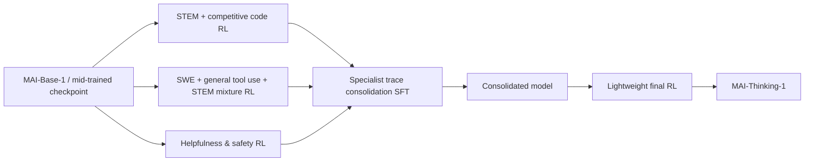
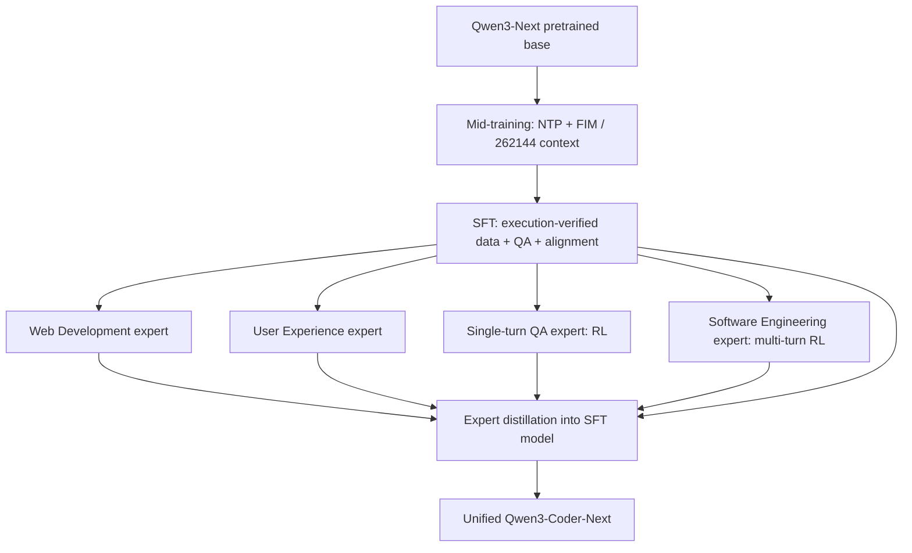

# 第一批七份精读笔记全文

导出日期：2026-09-07。使用方式与边界见 [交接说明](00_HANDOFF.md)。各篇正文完整保留；本地链接转为仓库引用文字，页内导航转为文字；需要原图/代码时请访问官方来源。


---

## 文档 1 / 7：R1_mai_thinking_1.md

原始维护路径：`docs/harness_improve/external_paper_references/reading_notes/R1_mai_thinking_1.md`

# R1 MAI-Thinking-1: Building a Hill-Climbing Machine：后训练与项目一精读

## 1. 来源、版本与阅读范围

正式标题 **MAI-Thinking-1: Building a Hill-Climbing Machine**；集体作者 **The Microsoft AI Team**，机构 **Microsoft AI**。这是技术报告，模型于 2026-06-02 随[官方发布公告](https://microsoft.ai/news/building-a-hillclimbing-machine-launching-seven-new-mai-models/)公布（该网页标注2026-06-08更新）；PDF 本身没有独立的语义版本号。本篇阅读与项目映射日期为 **2026-09-07**。

本篇以委派的本地原始 PDF〔仓库引用：`docs/harness_improve/main_20260602_2.pdf`〕为主版本，记作 **L**。同时实际下载并核对了[官方同名 URL](https://microsoft.ai/wp-content/uploads/2026/06/main_20260602_2.pdf)返回的2026-09-07 官方快照〔仓库引用：`docs/harness_improve/external_paper_references/reading_notes/sources/R1/main_20260602_2_fetched_20260907.pdf`〕，记作 **W**。两者均为 109 页，但内容不同，不能只凭文件名判定同版。

| 版本 | SHA-256 | PDF 元数据创建时间（UTC，非正式发布日期） |
| --- | --- | --- |
| L，指定本地原稿 | `7d4f13dd88ff98d0480645e96b751f0abea00fd99122cabf7626598b29bef26f` | 2026-06-02 19:54:27 |
| W，同 URL 当前快照 | `a267d745b1eb3792a8abf58e71e204a6f44f9c18eeb5ad8671320deae71986bd` | 2026-06-06 19:23:18 |

**定位口径：以下未加 W 的页码、章节、附录均指 L。PDF 物理页从 1 起，恰与纸面印刷页码一致；工具零起始 page index 应减 1。** W 的正文节号、主要后训练表图和主要页码沿用，但新增 Appendix A Citation reference（p.82），所以 L 的附录 A–K 在 W 变为 B–L；部分附录内小节跨页也变化。W 新增引用条目给 `urldate=2026-06-02`，引用 URL 为 `https://microsoft.ai/pdf/mai-thinking-1.pdf`；不能把 urldate 当修订日期。

实际对两份 PDF 进行了全文文本差分，后训练主配方和主要结果未发现实质改写。需保留的版本变化是：W §6.1 p.59 新增 RL climb 用 **4.6K GB300s**；W §6.4 pp.60–61 区分 Phoenix 预训练与 Dallas 后训练；W 表7 p.29 的 Down-proj Dim 从 L 的 `4352 / 4352 / 4096 / 3072` 改为 `– / – / 2560 / 3072`；另有 QK normalization 引文、context/sequence parallelism 措辞和排印修订。W 的 4.6K 不等于 §3.6.4 的最大作业 4,864；报告未解释两者是取整、不同运行还是笔误，不据此修正任一数。

阅读方法：先按 L 的目录 pp.3–4 建立下表，再分块读全部后训练正文及附录；§2 纯预训练内容概要阅读，影响 RL 的架构、数据去污染、mid-training、YOLO 与数值部分重点核对。原文公式 pp.31–33、图21 p.58 等以页面渲染核验，未凭失真的文本排版补公式。没有沿引用框架推导作者未公开的训练配置，没有运行训练。

### 原文目录覆盖图

| L 原文位置、标题 | 阅读深度与覆盖 | 本笔记位置 |
| --- | --- | --- |
| §1 Introduction pp.1–2 | 精读模型声明、并行 specialists 与 hill-climbing 含义 | §2–3 |
| §2.1 Model Architecture pp.5–7；§2.2 Model Ablation Methodology pp.7–9 | 概要；重点读 MoE、tokenizer、local attention 对 RL 的约束 | §3.1、§7.3 |
| §2.3 Evaluation Methodology pp.9–12 | 概要；重点读污染与 NLL 指标边界 | §3.1、§8.5 |
| §2.4 Pre-training Data pp.12–16；§2.5 Selecting a Data Mixture pp.16–21 | 概要；重点读去重、来源截止、rank non-invariance、mid-training | §3.1、§8.5 |
| §2.6 Training Recipe pp.21–23；§2.7 Evaluation and Comparison pp.23–24 | 概要；核对阶段 token、上下文与精度，不混入 RL 超参 | §3.1、§9 |
| §2.8 YOLO pp.24–30（System Overview / Determinism / Fault Tolerance / Co-optimizing） | 精读与后训练共享机制；预训练性能只作背景 | §7.3–7.4 |
| §3 The Reinforcement Learning Climb pp.30–31 | 精读 | §2–3 |
| §3.1.1 RL Objective pp.31–33 | 精读公式4–9、图13 | §4.1–4.2 |
| §3.1.2 Reward Design p.33；§3.1.3 Sampling Strategy pp.33–34 | 精读公式10–12与两级筛选 | §4.3–4.4 |
| §3.1.4 Self-Distillation pp.34–36；§3.1.5 Hyperparameters pp.36–37 | 精读，包括负结果与 SFT 稳定性 | §3.2、§4.5 |
| §3.2 STEM Climb pp.37–39（Data Pipeline / Competitive Coding / Deduplication） | 精读全部科学、数学、竞赛代码数据 | §5 |
| §3.3 Agentic Climb pp.39–44（SWE / General Tool Use） | 精读全部 agentic 正文 | §6 |
| §3.4 Helpfulness and Safety pp.44–49（Rewards / IF / Safety / Honesty / Style） | 精读所有奖励与数据，不因非 SWE 略去 | §5.3–5.7 |
| §3.5 Consolidating Capabilities p.49 | 精读 SFT 与最后 RL、表10 | §3.3 |
| §3.6 RL Infrastructure pp.49–53（Controller / Problem Worker / Rollout Worker / Router and Inference / Weight Transfer） | 精读全部 | §7 |
| §4 Evaluations pp.53–56（Benchmark / Human Side-by-Side / Internal Safety） | 精读表11–14、图20–21及所有指标 | §8 |
| §5 Safety Red Teaming pp.56–58（Internal / Independent） | 精读，保留适用范围与未覆盖风险 | §8.4 |
| §6 Cluster Environment pp.59–61（Training / Stability, Determinism, Goodput / Deployment / Sustainability） | 精读计算与成本口径；可持续性作背景 | §7.4、§9 |
| §7 Conclusion p.61 | 精读 future modalities 与当前边界 | §2、§10 |
| References pp.61–81 | 查与版本、机制相关的引文，不把引文内容当本报告配置 | §1、§9 |
| App. A Pre-training Data Pipeline Details pp.82–85（HTML / PDFs / Books / Public GitHub） | 概要全部；重点核 PR loss masking、去污染和第三方辅助模型 | §3.1、§10 |
| App. B Long Context Extension pp.85–88（Data / Evaluation / Progressive Scaling / Adaptation / Final Recipe） | 精读，涉及后训练遗忘及预算冲突 | §3.1、§8.5 |
| App. C Evolution of Reasoning Traces pp.89–94（STEM CoTs / Agentic CoTs） | 精读全部案例，不将例子当定量因果实验 | §8.5 |
| App. D SWE Agent Tool Schema pp.94–96 | 精读两份完整 schema，图23–24 | §6.1 |
| App. E Constraint Taxonomy pp.97–99，表15–16 | 精读 hard/soft 与多轮所有类别 | §5.4 |
| App. F Infrastructure for Building SWE Environments pp.97–98 | 精读构建池、凭据、缓存、吞吐 | §6.4 |
| App. G STEM Evaluations Setup pp.98–101（Math / Science / Competitive Coding） | 精读预算、judge、图25、表17 | §8.1 |
| App. H Agentic Coding Evaluations p.101 | 精读全部 benchmark 与限制 | §8.2 |
| App. I Safety Evaluations pp.101–103（Methodology / Collection & Sampling） | 精读分层、抽样、阈值机制 | §8.4 |
| App. J General Capabilities Evaluations pp.103–106（Knowledge / IF / Long Context / Safety / Honesty / Health / Tool Calling） | 精读全部，包含 MRCR 负结果、表19 | §8.3、§8.5 |
| App. K Cluster Environment Details pp.106–109（Hardware / Certification / Scheduling / Observability） | 精读全部 infra，区分集群机制与 RH2 候选 | §7.4、§11 |

旧稿只作线索：2_techreport_advice.md〔仓库引用：`docs/harness_improve/2_techreport_advice.md`〕、agentic_rl_training_recipe_evidence_matrix.md〔仓库引用：`docs/harness_improve/external_paper_references/agentic_rl_training_recipe_evidence_matrix.md`〕。纠错集中在 §10，旧文件未修改或删除。

## 2. 核心问题与结论

作者将模型发展视为可持续迭代的整体系统：预训练的数据和架构选择、可验证问题生产、RL 奖励与算法稳定性、异步训练与评测相互配合，称为 **hill-climbing machine**。这里的 climb 是连续训练改进过程，不是一项特定的在线制题算法，也没有披露“环境生成器与 solver 同时 RL 共演”的配方。报告采用从 mid-trained base 出发的三个并行 specialist，再用轨迹 SFT 合并，最后做轻量 RL；不能改写成三个专家串行训练或 OPD 合并（§1、§3、图12、§3.5）。

最有长期参考价值的事实是：算法稳定性与数据有效性被同等对待。GRPO 使用全局有效 token 归一化、熵控制的非对称 clipping、outer ratio clip、实际 top-p mask 重放与 MoE routing replay；长跑会通过自蒸馏重新承接已学能力。SWE 数据则从 1.02 亿 PR 逐层筛到 265,617 个验证通过问题，仍要处理题意与测试不一致、泄漏、作弊和系统误差（§3.1、§3.3、§3.6）。

结果包括 AIME 2025 97.0%、LCB v6 87.7%、SWE-Bench Pro 52.8%，但预算差异必须随数值保留：STEM 主表允许 256k 输出；SWE/terminal 总上下文 256k；Terminal-Bench 2.0 的 46.0% **忽略了预设 timeout**（表11、§4.1、App. G/H）。报告不是同底座、同数据与算力的逐组件消融汇编，曲线改善不能全部归因给某个单独机制。大作业使用 4,864 GB300，缺少整体 RL 时长与成本，不能据此证明八卡可复制其学习结果。

## 3. 后训练全流程与模型关系

### 3.1 Base 与 mid-training：影响后训练的前提

MAI-Base-1 对外称 35B active / 1T total，表1精确配置为 **34.7B active / 962B total**，78 层，8/512 experts；不能把同表 L78 的 35.6B/1015B 当最终模型。采用 `o200k_base`、词表 200,019；5 个 local attention 层配 1 个 global attention 层，local window 512；交替 dense/LatentMoE、dropless routing。这解释了长单轮生成可逐出 sliding-window KV，而多轮严格前缀适于缓存（§2.1、表1、§3.6.4）。

表6（p.21）给：30T tokens 预训练，context 16,384，8,192 GB200；3.4T mid-training 1，context 65,536，8,192 GB200；150B mid-training 2，context 262,144，4,096 GB200。**App. B.5 p.87 却写最终 extension 用 140B**；两版本均保留此差异，无法确定是否 token 统计口径不同。本文不把 140B/150B 静默合并。

mid-training 沿用预训练语料，不新增合成来源；mix 约 code 55%、STEM/math 35%、background 10%。增强技术正确性、分析深度、code 文件与仓库双格式，并按记忆程度限制来源重复（§2.5.4）。App. B 对长文重加权没有观察到有意义收益，最终沿用 mix 重新 packing；小规模实验支持短上下文 mid-training 后短程 extension，多数 NLL 改善在 extension 的前 1–10% iterations，但最终保守选择 64K→256K，因其与 post-training 的交互尚未充分刻画。不能把小模型 NLL 消融当最终 RL 的训练预算证明。

预训练数据来源截止分别为 HTML 2025-09、PDF 2025-12、GitHub 2025-06、书刊 2026-03（表4）；这不是后训练 SWE PR 的已披露截止日期。去污染包括移除 Hugging Face 及镜像来源、20-gram fuzzy matching / 80% 阈值，作者承认仍不完美（§2.3.1）。App. A.4 的 GitHub PR 数据明确排除 SWE-bench Verified PR；commit 的 pre-state 作为 loss-masked prefix，patch 才训练；PR 的 pre-state 也 mask，其他元数据和 patches 可训练。**这是预训练序列定义，不能移植成 agentic RL mask 证据。**

### 3.2 三个并行 climb 与反复自蒸馏



图12给出以上依赖。报告明确初始RL从尚未接触reasoning traces的checkpoint开始（§3 pp.30–31），并未给一条先由第三方CoT做reasoning SFT的冷启动路径。每个 climb 可经历自蒸馏：收集 RL rollout，对 **mid-trained checkpoint 做 SFT**，再继续 RL。它不是从坏 checkpoint 原地继续，不是 teacher 对 student 当前采样进行在线 KL 指导。用途包括从手写 reasoning prompt（图14）迁到 native chat 格式、从已埋藏数值不稳定性的失败 run 恢复、转接新 base/mid-trained 版本、过滤 reward hacking（§3.1.4，图15）。

作者报告的自蒸馏经验（pp.35–37）如下；除图15外多为定性陈述，未给完整对照表、误差或各次预算。

- **O(1M) reasoning traces** 足以匹配 teacher，同时保留 SFT 稳定性；更大数据边际收益递减，并可能压窄策略分布、伤害恢复 RL 后探索。这不是 SFT 总量的精确披露。
- 混入错误最终答案的轨迹与只用成功轨迹表现相近；因为成功轨迹足够，实际选择成功轨迹。不可将“错误轨迹无价值”作为本文结论。
- 使用后期多个较强 checkpoint；太早的轨迹导致退化，只从最后 checkpoint 新采样也使恢复 RL 表现较弱。多 checkpoint 提供多样性是作者解释，不是已隔离因果。
- 固定 token 预算时，扩大 prompt 多样性优于增加同题轨迹；简单随机抽样优于最短轨迹或若干启发式筛选。
- 短轨迹 SFT 会遗忘 mid-training 长上下文能力；length extension 前的自蒸馏混入 mid-training 数据。
- dropout 0.15 帮助维持熵；SFT 的 MoE balancing coefficient 用 `1e-2`，RL 则 `1e-5`。窄域 RL 中过大 balancing coefficient 会伤害稳定爬升，SFT 中的平衡效果能延续到分布近似的 RL。

“without distillation from third-party models”只描述能力/轨迹继承选择。数据处理确实用 Qwen3-Embedding-0.6B、代码类网页候选文档的质量评分用 Qwen3-30B（App. A.1 “Code pages”，p.83），评测使用 GPT-5-mini 等；“没有第三方蒸馏”不能扩大成“整条系统从未用第三方模型”。

### 3.3 最终能力合并不是 OPD

§3.5 p.49：STEM 与 agentic 教师从多个后期 checkpoint 取多条正确 rollout，仅轻滤 degenerate CoT；帮助性/安全教师另用 judge 与启发式过滤 style、structure、known defects。合并继续使用 trace SFT pipeline。

| 能力 | SFT sample weight | SFT token weight |
| --- | ---: | ---: |
| STEM and Coding | 56% | 89% |
| Agentic Capability | 11% | 9% |
| General Helpfulness and Safety | 33% | 2% |

表10强调按**样本比例**平衡，不能把 89/9/2 当采样权重。Consolidation SFT 做 4 epochs，最大 LR `1e-5`，衰减 2×；与一般自蒸馏配置不同。最终 lightweight RL 主要改善安全、过拒和风格，按 helpfulness/safety 配方，最大 sequence 128k，并保留少量 STEM/code；否则复杂推理会慢慢退化。最终 RL 的 mix 比例、steps、整体 token 未给。报告没有 MOPD、full-vocab teacher KL、teacher privileged context 或跨 tokenizer OPD 的配方；离线 trace SFT 不需要这些假定。

## 4. 训练目标、样本语义与超参数

### 4.1 GRPO：组内优势、全局 token 分母

令问题 (q\sim P(Q))，行为策略 (\pi_{old}) 采样同题 (G) 条响应 (y_{1:G})，当前待更新策略为 (\pi_\theta)。每条响应 reward (R_i=R(q,y_i))（式4），优势是

\[
A_i=\frac{R_i-\operatorname{mean}(R_{1:G})}{\operatorname{std}(R_{1:G})},\qquad
r_{i,t}(\theta)=\frac{\pi_\theta(y_{i,t}\mid q,y_{i,<t})}{\pi_{old}(y_{i,t}\mid q,y_{i,<t})}.
\]

原始目标（式5–6，p.31）：

\[
J(\theta)=\mathbb E_{q,y_{1:G}}\left[
\frac{1}{\sum_i|y_i|}\sum_{i=1}^{G}\sum_{t=1}^{|y_i|}
\min\big(r_{i,t}A_i,\operatorname{clip}(r_{i,t},1-\epsilon,1+\epsilon)A_i\big)
\right].
\]

正文明确实际归一化跨 **global training batch 的所有 token、所有 DP ranks**，并非每条轨迹先平均。优势在组内按 reward 标准化，同条响应所有 token 共享。长响应整体可贡献更多 token 权重；不能称每条轨迹等权。报告未定义 std 的有偏/无偏估计、零方差 epsilon 或最终 packed minibatch 与原 group 的对应细节。

agentic 将 (y_i) 扩成多次 policy steps 与环境 observations 的完整轨迹；完成后统一评分，credit assignment 均匀分配到 **所有 policy steps 的全部 token**（§3.3 p.40）。因此 observation 是条件上下文，不是被赋予 policy gradient 的行动 token。这里没有单独的“只训练最后 turn”或“只有答案进 loss”；也未公布细化到 serialization 标记、工具调用封装与 compaction 的 mask 代码。

### 4.2 两处稳定性修正

**Adaptive entropy control**（p.31 未编号表达式、式7–8 p.32）：把 trust-region ratio clip 改为

\[
r^{tr}_{i,t}=\operatorname{clip}\big(r_{i,t},1-\epsilon,(1-\epsilon)^{-1}+k\big),
\]
\[
\widehat H(\pi_\theta)=\frac1{|\mathcal T|}\sum_{(i,t)\in\mathcal T}
[-\log\pi_\theta(y_{i,t}\mid q,y_{i,<t})]\,r_{i,t},\quad
k\leftarrow\operatorname{clip}\{k+\delta\operatorname{sign}(H^\star-\widehat H),0,k_{max}\}.
\]

(\mathcal T) 是当前训练 batch 的响应/token 索引集合；每 step 更新 controller。熵低就扩大上界，熵高则缩小；初始 (k=0)，上下界乘积为 1，因此在 log-ratio 空间对称。作者称显式 entropy bonus 的表现不及此法。超参为 (\epsilon=0.6,k_{max}=2.5,\delta=0.25,H^\star=0.3)（§3.1.5）；因此由公式推得一般 clip 下界 0.4，上界从 2.5 到 5.0。图13演示使用 **kmax=1.0**，不是生产典型配置，不能混淆。

**Outer ratio clip**（式9 p.33）：

\[
r^{out}_{i,t}=\operatorname{clip}(r_{i,t},r_{min},r_{max}),\quad r_{min}=0,\ r_{max}=50.
\]

标准 min surrogate 的两个未受 trust clip 限制分支——负 advantage 且 ratio 上升，或正 advantage 且 ratio 下降——在作者训练中有时出现灾难性 gradient-norm spike，因此对所有分支加 hard outer clip。它不是 reward clipping，不是 trajectory-level IS，也不是简单新增 KL。报告分开写出两个 ratio clip，没有最终合并伪代码；不补造 stop-gradient、token 丢弃布尔逻辑或 clipping 顺序的实现。

### 4.3 通用 reward 分解

式10–12（p.33）：

\[
R(q,y_i)=R_{task}(q,y_i)+w_{lang}R_{lang}(y_i)-w_{len}R_{len}(y_i),
\]
\[
R_{lang}(y_i)=\max(1-\alpha n_{non\text{-}english}(y_i),0),\quad
R_{len}(y_i)=\rho_q\frac{|y_i|}{\ell_{max}}.
\]

(R_{task}) 来自不同域的执行、AI judge 或 learned reward model；(n_{non\text{-}english}) 数的是 **CoT 中非英语 words**，不是 token 数；(\rho_q) 是题目 pass rate，(\ell_{max}) 是最大 rollout 长度。难题 pass rate 低，长度惩罚弱。作者观察混语 CoT 与训推 logprob divergence 峰值相关，不能把自然语言选择本身认定为已证明的数值因果。top-p 也能抑制孤立低概率外语 token。

典型 (w_{lang}=0.5,\alpha=0.005,w_{len}=0.25) 直到 64k；128k 阶段 (w_{len}=0)。长度分母随上限增加使同长响应的惩罚变弱。帮助性与安全里的 context-specific 长度分位范围奖惩（§5.3）是另一种机制，不应与此式混为一项。

### 4.4 问题筛选与支持集重放

§3.1.3–3.1.5：先 (G_{early}=16)，按“positive reward 响应比例”估 early pass rate，仅 `[0.05,0.8]` 内题目继续；完整组筛 `[0.1,0.8]`，减少近全对/全错的低方差组。式样与典型超参均称 (G=128) **total rollouts**。但 §3.6.2 pp.50–51 的执行流程称先 16 条再 **additional 128 requests**。两处原文不能同时无条件解释成“每题恰好 128 次生成”；是否 early 样本复用、144 条中哪些用于 group 统计没有说明。按公式推预算时需标此缺口。也未解释多奖励场景下“positive reward”与 grader 可选 pass/fail 是否同义，不能把语言奖励导致的正分擅自当通过。

rollout 用 `top_p=0.97`。训练重用**当次 rollout 的 nucleus truncation mask**，被排除的词表 logits 置 `-∞` 后再 softmax，防止训练给未参与采样的词表部分反传导致严重 off-policy mismatch。mask 存储与传输有额外成本，p 更大增加探索也增加此开销。它不同于只保留 sampled-token logprob、训练时重算一个新 nucleus 或只给优势乘 IS。作者称不重放可在数个 steps 内发散（p.34）；数值完整复现仍需实际 mask 与 routing 数据，报告没有发布格式。

最大 generation 从 8k 逐次翻倍至 16k、32k、64k、128k，目的是在早期低成功率时减少无用长生成。length curriculum 与 base 的 256K context extension、最终 STEM 256k 输出评测是三个不同口径。

### 4.5 典型训练超参数与未说明项

| 对象 | 已披露典型配置（§3.1.5 pp.36–37） | 口径/限制 |
| --- | --- | --- |
| RL optimizer | AdamW，β1=β2=0.95，optimizer ε=`1e-15`，weight decay=0 | 不是 clipping ε |
| RL LR | constant `1e-6`，无 warmup/decay；长生成时降到 `9e-7` | 作者解释为长尾 staleness 增大；不知具体切换 step |
| RL batch | packed global batch 7,040，unpacked sequences 最多 12,000 | 不是 7,040 prompts 或 groups；未公开每条 packed sequence 的目标长度 |
| 权重更新/陈旧性 | 每 5 个 gradient steps 更新 inference；生成策略超过 8 次 inference updates stale 则丢弃，即 >40 gradient steps | “8”不是 gradient steps；无多 turn 跨版本判定细则 |
| MoE | dropless；global load-balancing coefficient `1e-5` | 完整 learner DP/TP/EP/CP 布局未给 |
| Self-distillation SFT | packed global batch 2,048，sequence 128k；AdamW weight decay 0.001 | 不应套在 consolidation 4 epochs 的全部配置上 |
| Self-distillation LR | cosine，max `1.7e-5`、min `5.2e-6`，warmup ratio 2% | SFT β/optimizer ε未另外明确 |
| Self-distillation regularization | dropout 0.15，MoE coefficient `1e-2` | 作用含提升恢复 RL 后探索与路由平衡 |

式5没有 explicit reference-policy KL 项，也没有 critic；报告未给可独立辨认的 reference policy/KL coefficient。可准确说“披露目标中无 KL 项”，不能据此补出实际系统开关。一般自蒸馏及合并SFT的prompt/response细粒度loss mask、混入mid-training数据的mask定义没有另行展开（已查§3.1.4–5、§3.5），不能照搬App.A的预训练PR mask。5 gradient steps/发布不等于每 batch 做 5 epochs；每批复用次数、minibatch 编排、gradient accumulation、异常样本如何影响 group 分母未披露。工程失败重试与任务失败奖惩分别见 §7.1，不可合并为“失败一律 reward=0”。

## 5. STEM、通用推理、偏好与安全数据和奖励

### 5.1 STEM Mix：从材料到可核验问题

§3.2 pp.37–39：单轮 STEM climb 最长，覆盖数学、物理、化学、竞赛代码等。训练实例是 `(q,a)` 或 `(q,{tests})`；final answer 通过 SymPy、AI judge 或程序测试核验。处理数百万文档形成 **>5M samples**，其中最困难部分 **>550k QA pairs**。图16原始题型 open ended 56.1%、proof 33.3%、MCQ 10.6%；学科 math 58.5%、physics 13.2%、chemistry 10.9%、other 4.3%、electrical engineering 3.4%、CS 2.6%、mechanical engineering 2.6%、biology 1.9%、mechanics of materials 1.0%、civil engineering 0.9%、economics 0.7%。这是原始题型分布，不能误当最终 proof/MCQ 的训练比例。

图17/§3.2.1 的四阶段为：

1. **Hierarchical parsing**：OCR/VLM 或 OCR service，分块、移除非 STEM 页与 boilerplate，构建层次结构，修跨页、编号与交叉引用，再由 LLM 标 QA spans。
2. **QA pairing**：对于章末题目/附录答案，通过结构与语义检索给候选，LLM 多轮选择并验证配对。
3. **Curation**：剔除不可核验、PII、答案直接泄漏，标注题型和学科；将 MCQ/proof 重写为 open-ended。重写做三次再求共识，无法可靠转换则丢弃，仍保留小部分 MCQ 以熟悉格式。proof 在此被转换为可验证答案题，不能说报告训练了完整 proof verifier。
4. **Scoring**：每道题由四档模型各解 k 次，以它们 AIME 2025 能力为分档代理。最强档低 pass-rate 的题，把模型 consensus answer 与 ground truth 随机顺序交 blind judge；judge 偏向 consensus 则作为可疑 GT 丢弃，偏向 GT 则作为真难题保留。没有披露四个 solver/judge 的具体身份、k、阈值或各阶段 retention。

STEM Mix 与竞赛代码分别做 SHA-256 exact question hash、字符 n-gram/MinHash LSH fuzzy、embedding cosine 三层去重，同时对 App. G 公共 benchmark 和内部 Olympiad/graduate-level eval 去污染；后两层阈值、embedding revision 未给（§3.2.3）。

### 5.2 竞赛代码

§3.2.2 p.39：定向来源与 vendor 取得 **160k problems**，每题有 reference solutions，先确认其通过全部 tests；覆盖 divide-and-conquer、DP、graph/tree、search 等，支持 **17 种语言**，包括 Python/C++/C#/Java/JS/Rust/TS，保留 runtime/memory constraints。不是从普通 PDF 凭空补测试。与 >5M STEM Mix 的重叠/是否相加没有清晰定义，不能直接宣布最终训练集 5.16M。竞赛测试的充分性、额外 mutant/no-op 校验和生成次数没有展开。

### 5.3 Helpfulness/safety 的奖励骨架

§3.4.1 pp.44–46：偏好 reward model 是 **post-trained MAI-Base-1** 再用多 vendor 人类 preference 数据训练。给 context c、k 个候选及各自 1–5 分，输入用 `<|im_sep|>` 分隔的 context/responses，SFT 目标为 scores 的文本 token 序列。推断为每题 k 个候选做 k 次循环置换；每次只读取第一 score token 的完整分布，取当前排首候选获得最高档 **score=5 的概率**为 reward。它不是平均 Likert score、不是候选胜率 softmax，也不是用一次串行解码的所有 k 个分数（作者认为后者噪声较高）。reward model 用训练 rollout 的人工评分与 RM 数据 validation split 评估，未披露准确率表。

同时使用可快速改 rubric 的 prompted AI judges 与确定性 verifiers。作者定性报告，可验证奖励相较不可验证奖励更不易 reward hacking、对 multi-epoching（在同一数据上重复训练多个 epoch）较不敏感，并通常帮助稳定训练（§3.4.1 p.45）；该段未给定量消融或可保证的 epoch 上限，不能据此断言 verifier 不会被利用。作者观察 AI rubric 会推高长度和风格元素，故对每个 context 离线估计可接受 response-length 分布，对超出预定义 quantile range 的响应惩罚，避免简单越短越好。quantile 值未给。

不同 reward 的尺度与 context 内方差不同，直接相加可能让大幅值信号支配。两种聚合按 context 选择：**lexicographic** 只在组内所有 rollout 的高优先级分数都相等时激活下一级 reward；**gated** 要先满足主目标的最低标准才计算次目标。前者是组内并列条件，后者是单个响应的安全等门槛，不能写成同一个 weighted sum。

### 5.4 Instruction following 与 steerability

§3.4.2 p.46、App. E pp.97–99：expert-written complex contexts 用于启动能力，synthetic 用于覆盖。手工 constraint taxonomy 与多样 seeds 驱动 instruction/model-spec、scenario、critique/rewrite；包含多语言、长短对话、system/developer/user 层级冲突，跨 **40 多个领域**。筛掉不自足/歧义/约束不对齐 rubric，进行安全与复杂度过滤、rejection sampling、pass-rate 难度校准，保留难但可解题。

确定性约束用规则；LLM judge 对 atomic rubric 独立二元判分，多次取均值；RM 补一般质量，以 IF-specific reward 优先的 lexicographic 聚合。App. E 的 hard 类包括数量、格式、内容、语言、时间顺序、排除性约束；soft 类包括风格、persona、自我呈现、互动/响应策略、结构/推理要求和指令冲突处理。多轮覆盖切话题、指令保留/叠加、上下文事实回忆、自洽和版本回退。这里的 memory & recall 指对话上下文利用，不是单独长期记忆系统。

### 5.5 Safety

§3.4.3 pp.46–47/表8：同时处理 harmful 的 unsafe compliance 和 borderline 的 over-refusal。harmful 来源为 vendor/internal human red teaming，以及模板、PAP、TAP 等自动攻击；borderline 用跨代保留 do-not-refuse slice 和经安全标注的 capability data。允许 full refusal、partial refusal 或 do-not-refuse，不能把“敏感话题”直接等同“必须拒绝”。

judge 分 policy compliance、response engagement、response style 三轴。安全门控下 non-compliant rollout 获 minimum reward，不得靠质量/风格抵消；合规者再用正常 mixture。脚注9的 paired audit 中 expected safety Likert 与 policy-compliance 的 Pearson **0.293**、Spearman **0.344**；**87.8%** non-compliant 响应仍拿到 RM score≥3。这支持作者选择独立 compliance gate，但未给该 audit 的样本数，不能外推成所有 RM 的性质。

### 5.6 Honesty

§3.4.4 pp.47–48：目标平衡事实准确与信息量，防止为减少错答而一味少答。vendor、PII-filtered consumer Copilot logs、synthetic 覆盖普通事实、长尾困难事实、false-premise queries；每个 RL example 离线 retrieval-augmented verification 生成参考。LLM judge 结合 factuality/confidence 分五类：CONFIDENT_CORRECT、UNCONFIDENT_CORRECT、NOT_ATTEMPTED、UNCONFIDENT_INCORRECT、CONFIDENT_INCORRECT。映成 scalar reward：自信正确最高，自信幻觉惩罚最重，abstention neutral，不自信正确降低得分以抑制过度 hedge；具体权重未给。Copilot 日志只来自未 opt out 且符合其用户排除规则的人群，见脚注10；不能写成预训练全面使用该日志。

### 5.7 Style 以及多模态边界

§3.4.5 pp.48–49/表9：训练 warmth without sycophancy、结构可扫读、context-appropriate tone，规则涉及 emoji、markdown、formal tone、preamble、density。数据由 PII-filtered Copilot logs、vendor 静态/互动 contexts 与 Arena conversations 构成，低至中难度，排除复杂 IF、coding、math/STEM，并按 intent 主动采弱项。judge 用 **0/1/2=major/minor/no style issues**，作者认为粗粒度优于过细评分或 prompt-specific rubric；仅在可验证奖励和安全要求满足后施加 style。

报告未提出多模态模型后训练配方：OCR/VLM 是资料处理手段；红队将 multimodal inputs 排除；更多 modalities 是 §7 未来工作。不能把上述文字型 RL 补写成视觉、音频或图文 RL。健康领域有评测，但没有独立 health-specialist climb。

## 6. Coding / SWE / terminal 环境与任务生产

### 6.1 Rollout 环境和工具

§3.3 pp.40–41：每个 RL environment 有 task spec、SEE session、grader；ReAct loop 解析 reasoning/actions，调用工具，追加 observations，所有先前 steps token 保留并构成下个 step 的严格前缀。无 tool call 或超 step/context/time budget 后，rollout 与 SEE 交给 grader。报告没有 compaction、上下文重写、subagent/fork 的已用训练机制；这条 append-only harness 不能证明外部黑盒 harness 的重分词对齐已解决。

SEE 每个 agentic task 新容器，完成即销毁；默认网络隔离，确需联网时走缓存代理和 domain allowlist。作者以此提高复现性、减少外部副作用，仍在后续复验中承认 CPU、内存、egress、timeout 和 test flakiness 会破坏有效性。

SWE image 含固定 commit repo、预装依赖、题目和评分测试，但 **hidden test changes 在 inference 期间隐藏，评分时才应用**；不能因“自包含 image”声称 agent 能看见 gold/hidden tests。模型用 `bash` 与 `str_replace_editor`。App. D：bash 每次新 subshell，cwd/env 修改不自动跨调用保留；文件状态保留。editor 支持 view/create/str_replace/insert/undo_edit；精确替换要求 old_str 唯一，输出可 `<response clipped>`；schema `additionalProperties=false`。这并不是持续交互终端协议。

### 6.2 Organic SWE 漏斗

| 阶段 | 数量与单位 | 操作与排除原因 | 原文 |
| --- | ---: | --- | --- |
| 原始 public GitHub PR | 102,000,000 PR | 起始公开 PR 集合 | §3.3.1 p.42 |
| 筛后 candidate problems | 约 4,870,000 PR/关联题 | merged 到 main、修改<15 files、有 code 与 test changes、关联 issue；支持 GitHub/Jira/Bugzilla/YouTrack/Phabricator/Launchpad/Linear | 同上 |
| 自动环境构建通过 | 2,080,000，42.8% | LLM agent 读取 repo，生成 Dockerfile；测试验证，排除 dependency/environment errors | 同上 |
| reference signal extraction 通过 | 745,452，15.3% | base+test diff 与 base+test+code diff 比较，取 F2P/P2P，没 surviving F2P 丢弃 | 同上 |
| SEE 环境与 grader 验证通过 | 265,617，5.5%；94,044 unique repos | 真实训练 SEE 下多次 empty patch fail、golden patch pass，筛 non-deterministic tests | 同上 |
| 质量过滤、题意 rewriting 后 | **未给最终数** | 检查 clarity、test quality、leakage、feasibility，必要时改写题面 | pp.42–43 |
| 合成问题、实际采样/消费轨迹 | **未给** | 重用可执行但未过质量验证的环境，生成新问题与 tests；没有总消费量 | pp.42–43 |

**42.8%、15.3%、5.5% 的共同分母是约 4.87M candidates**，不是逐阶段通过率或 102M。也没有“265,617 个独立镜像”的去重统计。参考测试代码被 code/test split，F2P 为 issue-resolution 信号，P2P 为 regression 信号；原文没有给完整 SWE scalar reward 组合公式，不能仅凭 F2P/P2P 强行认定全部任务都同一二元 reward。

gold/empty 跨多轮复验，但次数未给。未见 alternate-solution verification、gold patch hints 暴露规则、质量 judge 的模型与打分阈值、rewrite 前后 retention 或 rewrite 成本。pipeline 的核心独立性是“能执行”“能评分”“题目对解题者充分”不同检查，不是“测试过了就可训练”。合成环境复用受 BugPilot、SWE-Smith、SWE-Mirror 启发，但此报告没展开各生成策略数量、mutation 类型与最终消费比例。

### 6.3 评分隔离与反作弊的准确边界

§3.3.1 p.41 明确 **grader 在 agent 使用的同一 container 内执行 tests**；App. H p.101 评测亦如此。SEE 隔离 task 与外部，不等于 fresh grading environment。反作弊（p.43）包括：

- 限网，防止搜索公开 PR/gold；保留必要网络最小集合。
- 清除 base commit 之后的 commits、references、branches，使仓库回到原始时间状态；保留合法 git 能力。没有披露物理 object 清除的完整实现、reflog/fsck 验证，不可用另一报告的机制补齐。
- reset agent 改动的 test files，再应用隐藏 test changes。作者明确承认仍可能通过 monkey-patching test framework、改 equivalence behavior 等作弊；LLM monitor 审 rollout，人工复核 flagged examples，持续强化 test detection/reset 与 anti-tampering heuristics。

因此正文既没有声称测试 reset 足以完全可靠，也没有披露独立 fresh checkout、可信代码投影或评分进程权限模型。当前 RH2 的 fresh grader 只能作为我们基于现状的设计选择，不能以 MAI 已验证为依据。报告的 monitor/human review 也没有误报/漏报率或自动进 loss 的规则。

### 6.4 构建基础设施与单位成本

App. F pp.97–98：two-pool Ray cluster 的整体描述为 **约 30,000 CPU cores**；main pool 分发任务、Lance I/O、跟踪 pipeline 状态；builder pool 用 Ray custom resource 标记隔离 resource-intensive、易 disk-full/OOM/hang 的 builds。builder 不持有 pipeline data storage/internal service 凭据，Kubernetes 重启后重连；这不等于没有任何凭据——init container 用 federated identity 配 registry authentication。

每 builder pod 两个容器：主容器 Ray worker+rootless podman，sidecar rootless BuildKit，通过共享 NVMe 的 OCI tar 和 localhost 控制通道完成 build-load-grade，减少跨机器传大镜像。按 repo 给同一个 persistent Ray actor，复用 BuildKit layers；apt/pip/编译成本无需每题重付。持续 actor 属于**离线 build**，不能据此推为 rollout 粘滞路由或复用有状态任务容器。

性能段另给具体配置：**10,000 CPU cores + 12 million LLM tokens/min capacity**，prompt cache hit **83%**，输出 **约20 grading-passed environments/min**，作者称瓶颈在 LLM token consumption。30k 是前文规模描述，10k 是此吞吐配置，关系没有展开，不能算成“三万核时产出20题/分钟”。12M 是 capacity 而非已计费实际消耗，20/min 的终点也没有证明覆盖后续所有质量重写，因此不能据它计算“每个最终合格任务60万计费 token”或美元成本。

### 6.5 General tool use 不能被 SWE 摘要吞掉

§3.3.2 pp.43–44：mocked API/MCP backends、query、tools schema、initial mutable state、grader；单环境往往 **>50 tools**，覆盖 inventory、scheduling、report、customer support 等。human-curated 与 synthetic 并用。synthetic 三阶段：从 plain-English 环境描述 bootstrapping 工具实现/数据库→采可能调用链、相关 entities 与 user query→执行验证、去近似任务、critique/refine。加入 environment personas 与“给了工具但无需调用”的任务，抑制过度调用。最终 **>150 environments、130,000 tasks**，不是 SWE PR 漏斗的一部分。

奖励包括 final state、tool usage pattern、final answer；synthetic 任务由 LLM 分解 subtasks 独立评分，另有 cross-environment graders 鼓励合理并行、去重复、正确参数类型/取值。未给 reward weights、subtask reward 组合、grader 完整实现及 solver 预算。

agentic climb 实际混入 STEM/competitive coding，作者报告 STEM 稳定训练且对 SWE/tool calling 正迁移；反向 agentic 对 STEM single-pass 未见正/负迁移（p.40）。缺少比例和控制表，不能写成确定提升幅度。§4.1 称没有 targeted terminal-interaction environments，所以 Terminal-Bench 结果是 broader agentic 迁移；不能把 130k general tools 误称 terminal RL 数据。

## 7. Rollout 时序、异步与数值基础设施

### 7.1 Rocket 的责任分工和失败语义

Rocket 是自研异步 RL framework，learner 用 YOLO，inference 用 SGLang/router（§3.6，图19）。controller/problem worker/rollout worker 各为一个 Python process/Ray actor；原文以当时大规模需求解释自建，不能推成今天 miles 同类功能不存在。

1. controller 从 task sets 取任务，发给 problem worker；收到整组 rollout 及 reward/pass-fail/normalized advantage 后筛选、组 batch 给 learner。大运行主要 off-policy；on-policy 留小实验和 debug。
2. problem worker 管一题的 early/full 采样、失败重试和最终优势；自己不跑单条 rollout。
3. rollout worker 生成 prompt，请求 inference，解析工具并执行 SEE、追加 observation，直到 no-tool 或步数/时间等终止。可独立评分的问题在 rollout worker 评分；须多候选比较的 grader 放 problem worker。一个问题可有多个 grades，用 user-defined policy 聚合。
4. learner 消费后更新；每5梯度steps向 inference 发布，陈旧性阈值见 §4.5。图19出现 persistent rollout store/metric store/checkpoint，但没有完整 durability/commit 协议。

报告区分了一些错误，却未穷尽训练处置：build dependency 错误在生产阶段排除；worker/request 故障按需重试；推断 replica 中途失败可换 replica 重试；预算终止的完整轨迹仍送 grader；陈旧 rollout discard。**没有公开 timeout、解析错误、工具错误、grader timeout 各自的 reward、mask、是否纳入 GRPO group、补采上限、drop-single vs drop-group 规则**（已核§3.1、§3.3、§3.6、App. D/F/H）。不能把“does not lose rollouts”的运行层叙述理解为中断前 token 原样保留、exactly-once 或 partial rollout resume。

### 7.2 推理优化、稳定性与权重传输

§3.6.4 pp.51–52：最大 RL job **4,864 GB300 chips = 4,096 inference + 768 learner**，精确比例约5.33:1（作者近似说可到5:1）。这是最大 job，未给三个 specialists 各自分配和时长。

single-turn 短 prompt、最高128k长输出，KV memory 主导：expert parallelism、attention data parallelism 降 footprint；禁 prefix cache，让 sliding-window tokens 完全逐出；MLP data parallelism、DeepEP、EPLB 降通信成本。multi-turn prompt 长、短输出，prefill 主导，依赖 prefix cache，production RL **97–98% hit rate**。这不是端到端吞吐增益，也不是 build 阶段 83% prompt cache 的同一指标。两者均缺缓存命中分母的详细定义。

三层故障处理：SGLang self-watchdog 探 generation endpoint/scheduler memory，异常时自行重启；router circuit breaker、multi-stage probe、rediscovery 和 per-replica flow control；job 监控各 actor class live 数和 step progress，低于阈值或无进展则 fail job clean restart。具体阈值、backpressure queue 容量、重试上限未给。

训推皆用 **bf16**，比试过的较低精度更稳定；再做 MoE routing replay 与 top-p mask replay。预训练 FP8/FP32 混合配方不能套成 RL inference 精度。报告说这些降低 numerics gap，未量化为逐 token 零误差；也没有公布 SGLang fork/commit、replay payload 或固定 routing 的端到端测试。低精度、logprob 不一致的相关失败不能被无条件移植为当前其他模型的必然结论。

§3.6.5 pp.52–53 的 weight transfer plan 在 job start 编译 source/destination tensor shard 的交集，记录 rank、byte extent、dtype/layout transform；直接发重叠 subshards，不 materialize full tensors。pack/transfer/unpack 流水化，transform 放成本较低一侧。规划只针对理想的一个 learner/一个 inference server，运行时扩为对应 live replicas 的 transfer group；用 DP groups 子集各负责一片 fleet。例：36 servers 分4组，4个9-server transfers 并行。未给传输延迟、速度提升或原子发布、多 turn 混版本合同，不能补成当前 RH2 staleness 设计。

### 7.3 YOLO 中与 RL 有关的机制

§2.8 pp.24–30：PyTorch 上自研模型、sharding、optimizer、dataloading、checkpoint；支持 SFT/RL learner，同时覆盖 pre/mid-training。tensor sharding annotation 是描述性的，不自动插通信；可按 tensor 使用不同 TP/DP/ZeRO、parallel folding。提供 dropless MoE variable-size all-to-all、分组 dispatch-compute-collect 流水、static-memory dropless 多轮 capped dispatch（仍处理所有 token）、细粒度 recompute 避免高 imbalance 的 memory spikes；有 routing replay。

activation checkpoint 与 pinned host-memory async offload 组合，服务长 context 和 memory 压力。pre-training 的 EP64/TP1、NVLink 内 all-to-all、跨 rack DP 是明确的预训练实例；RL 完整布局仍未知。determinism 承诺条件为 **固定硬件拓扑、模型配置、软件版本的 pre-training bitwise reproducibility**。手段有固定数据顺序、checkpoint 含 RNG/FP8 scale/data cursor、固定 GPU reduction 顺序、stable routing sort、关闭 NVLink SHARP、固定 NCCL topology。不能升级为“fully async RL bitwise 可重现”。

DCP metadata/serialization 重写，使 CPU memory overhead 与 save time 降 **>10×**；预编译 save plan、异步 host staging+独立 checkpoint process、KV 协调原子提交，最多一个 checkpoint 在途（pp.27–28）。load 时重复状态读一次后 NCCL broadcast；Ray hot standby 的 in-job restart 降 pod 重建成本，重算 steps 对 historical loss 验 determinism。这些是 YOLO 作者报告，非公开可调用 API 或完整 RL exactly-once 恢复证明。

### 7.4 集群、goodput 和成本口径

§6与App. K：GB200/GB300 NVL72、跨 rack InfiniBand；Kubernetes 管 state，Kueue 管 quota/admission/preemption/topology placement，MAI controllers 管 reservations/readiness，Ray 管 job actors。rack 软保留与借用防碎片化。单节点→rack collective→按需跨rack IB certification；故障节点 taint、drain/remediate、vendor maintenance 后重新验证。日志把 device/links、调度、actor、checkpoint、step progress 接到同一诊断视图。这是多千卡运维设计，不能被本项目当必造组件。

goodput 定义为 **ideal training duration / actual wall-clock duration**（§6.2），不同于 GPU busy 或 MFU。§6.2.1 的 **90.0% goodput、51h overhead 属 MAI-Base-1 的8K-GPU预训练**，不是 RL job。原文同时报 recomputation 6.5h、“15% of overhead”；6.5/51≈12.7%，数值内部不一致；non-stepping 14h/27%、MFU-drop18h/35%大致相符。保留差异，不静默修正。图11 final pretrain MFU≈20%；MFU 使用 BF16/FP16 dense spec **2.5e15 FLOPS/GB200** 为分母，FLOP numerator 不计 recompute、RMSNorm 等 memory-bound 操作（§2.8.4），不是混合精度理论峰值总和。

§6.3 的 MAIA-200 比 GB200 **同 rack power budget 下 token generation throughput 高>40%**是部署性能/功耗口径，没有 batch、长度、延迟约束或绝对 tok/s，不能称整体 RL 便宜40%。§6.4 的可再生电力、Phoenix 水基础设施投资和社区计划是机构级可持续性背景，不是单模型碳排、耗水或本次训练美元账单。

## 8. 评测、消融与负结果

### 8.1 STEM 主结果及预算

§4.1 默认 **4 runs 均值、temperature=1、top-p=0.97**，除非附录另说。pass@1 指单个采样的成功概率估计；多次评测取均值不变成 pass@4 或 best-of-4。GPQA 附录明确16 rollouts，是默认4次的例外。

| benchmark | MAI 128k最大输出 | MAI 256k最大输出 | 评测设置与指标定位 |
| --- | ---: | ---: | --- |
| AIME 2025 | 95.0% | 97.0% | boxed answer→regex→SymPy，AI fallback；App. G.1、表17 p.99 |
| AIME 2026 | 93.6% | 94.5% | 同上 |
| HMMT Feb 2026 | 84.3% | 84.9% | MathArena 来源，同上 |
| GPQA Diamond | 84.2% | 84.2% | 198 MCQ，simple-evals prompt/custom regex，pass@1 averaged over16 rollouts；App. G.2 |
| LiveCodeBench v6 | 87.3% | 87.7% | 1,055题，2023-05到2025-04；one-shot code fences→test harness，runtime/memory constraints；App. G.3 |

App. G 图25 p.100 是 STEM judge prompt：默认 GPT-5-mini，区分内容等价与明确格式/单位/精度要求，历史消息加 few-shot 防 judge hacking。外部 judge 用于评测并不违背“不从第三方蒸馏 CoT”。图1/图15 STEM climbing 曲线用 **LCB v6 的 after-Jan-2025 hard subset**、部分曲线取邻近3 checkpoint 平均；不是表17全1055题的逐step曲线。表11/17的其他模型分数来自各自官方 model cards，训练与测试算力未匹配；不能按小分差归因算法优越。

### 8.2 SWE 与 terminal

| benchmark | MAI 成绩 | 题数与测试条件（§4.1、App. H） |
| --- | ---: | --- |
| SWE-bench Verified | 73.5% | 500题；bash + editor；总 context256k、每次最大输出8k、最多1000steps |
| SWE-Bench Pro | 52.8% | 报告写731题，多语言；同上 |
| Terminal-Bench 2.0 | 46.0% | 89题；bash only；总 context256k、每次最大输出32k、最多1000steps；**忽略预设time-outs** |

这些是 always-append ReAct loop 下的模型+tools+budget 成绩，结束后在同 SEE 评分。4 runs 取均值的总规则适用，未公布每题 seed/结果与置信区间；8k/32k 是多轮请求输出上限，不能把总预算写成只8k/32k。报告没有固定完整 eval harness commit、环境 hash、硬件与 wall-clock 成本。外部模型主表来自官方不同运行，因此特别不能将 Terminal-Bench 46.0 与遵守官方 timeout 的分数视为统一协议比较。

### 8.3 全体通用能力评测

表12（p.54）Sonnet 4.6 对照由作者自有 eval suite 实测，使用 max reasoning effort/max sequence；不同于表11抓 official cards。分数虽都以0–100显示，**分母与指标不同**：

| 领域 / benchmark | MAI / Sonnet4.6 | 原文评分要点 |
| --- | ---: | --- |
| MMLU-Pro | 85 / 87 | 扩至10选项，custom regex，对照GT；App. J.1 |
| SimpleQA Verified | 31 / 29 | 去噪/去重复的短事实问答准确率 |
| IFBench | 69 / 50 | 58种可验证约束；App. J.2 |
| AdvancedIF | 85 / 86 | **rubric-level score**，不是整题全满足率 |
| MultiChallenge | 53 / 57 | 多轮，遵官方 Gemini2.5 Pro judge；作者验证对公开模型能复现榜分 |
| GraphWalks ≤128k | 90 / 96 | answer F1；≤128k 按 o200k_base 计输入长度；App. J.3 |
| AIR-Bench | 88 / 88 | category-specific policy judges，安全 engagement |
| CyberSecEval4 Instruct / Autocomplete | 63/62；63/56 | insecure code generation，通过静态分析规则评分；不是攻击成功率 |
| LongFact | 98 / 98 | **claim-level precision**，用简化claim extraction+judge代替原SAFE |
| TruthfulQA | 88 / 88 | 推荐的multiple-choice accuracy，非长文本诚实总分 |
| HealthBench Professional | 35 / 38 | 525医学专业对话、GPT5.4 grader/rubrics，primary metric含长度惩罚；App. J.6 |
| MedXpertQA | 43 / 49 | 2450专家MCQ、10选项；GPT5.4解析答案字母 |
| BFCL v3 | 72 / 76 | AST/execution matching、多函数多轮；**T=0.001,p=0.97**例外；App. J.7 |
| LongBenchV2 | 61 / 66 | input限制256k后408 unique questions；4-way MCQ；表19 p.105 |
| CorpusQA | 82 / 79 | multi-document freeform QA，judge改用GPT5.4(high)，不是默认DeepSeek-v3；表19 |

表19两项最大输出128k、max effort（适用时）、4次独立评估。正文 App. J.3 说“四个 long-context benchmarks”，但标准结果实际给 GraphWalks、LongBenchV2、CorpusQA 三项，并讨论被降优先级的 MRCR；本文不补造第四张标准结果表。

人类 side-by-side（§4.2 pp.54–56，表13–14）：**1276英文tasks，30% multi-turn**，expert-written 与PII-filtered consumer logs；剔除缺context、adversarial、需coding environment/image generation/external tools等 prompts。任务分布含开放QA/brainstorm/advising/content authoring各13–14%，structured problem solving等各6–7%，planning等5%，personal support等3–4%。Surge AI evaluators 对 IF、factuality（可搜索核验）、conciseness/relevance、completeness、style 先逐项判断，再给7点Likert偏好[-1.5,1.5]。MAI对Sonnet win/tie/loss=**49/6/45%**，对Opus=**43/5/52%**；overall preference分别 **0.07±0.06 / -0.07±0.06**。各维度对Sonnet/Opus的delta：IF -0.01/-0.04，factuality -0.02/-0.03，conciseness 0.11/0.07，completeness -0.01/-0.02，style 0.08/0.05（均±0.02）。表14未说明±的统计定义，不能称95%CI；也未给每题标注人数/IAA系数。该偏好结论不覆盖SWE执行任务。

### 8.4 安全评测、红队与选择偏差边界

§4.3/App. I：先对request按 harm/policy、sensitivity、intent、scenario、jailbreak分类，多次judge多数票。检测到攻击包装先抽出底层request，multi-turn用全历史。再由rubric judge指定允许范围/refuse posture/tone；harmless/unclear用确定性默认规则惩罚不必要hedging/refusal。低风险 helpfulness=**1-over-refusal rate**；高敏感 safety pass=judge **1–5 Likert >3**。图20按每题2 generations平均，五个类别出现更好的上/右方向，不能解读为所有安全域全面超过Sonnet。

评测池来自public safety benchmarks、PII-filtered consumer logs、vendors，按五个strata标注，追求coverage、固定预算统计效率、区分能力。内部 informativity-weighted test assembly upweight 不全过/不全错的题；这用于诊断改进机会，不代表自然用户分布。另保留无偏leaderboard set，release candidate要过固定bundle且不倒退；每cycle以safety/over-refusal/quality Pareto frontier的固定分位定门槛，具体分位和阈值未给。这里是作者发布流程，不是本项目新增准入制度。

Jailbreak suite从**2.5K unique seeds扩至约9.5K prompts**，分foundational、compositional、adaptive。图21（p.58，页面核验）MAI ASR分别**4.4/17.6/26.8%**；GPT5.4为7.0/13.9/32.3，Opus4.6为3.0/17.4/25.1，Sonnet4.6为5.7/15.0/26.4。error bars是95%CI，外部模型包含provider-side safety filtering。扩展prompt不是9.5K独立原始意图，也不是tool-use安全证明。

内部红队（§5.1）：15次engagements、**>2170 goal-based scenarios、25 policy categories、每scenario5–10turns**，跨不同开发阶段，逐步加难；主要英文，非英文只有限攻击向量，**agentic tool-use和multimodal out of scope**。六类重复模式是多轮良性借口升级、虚构场景、专业身份借口、递归扩写/格式漂移、年龄线索绕过、权威文件伪造。发现滚动反馈SFT/RL安全mix；作者报优先整改类aggregate attack success下降约22%，jailbreak44%、hate/fairness43%、child safety30%、mental health20%（p.58）。它们是原文百分比降幅，不是百分点；缺逐类分母、统一对照和前后原始ASR，不能换算绝对改善。

独立AIRT/vendors（§5.2）覆盖自动攻击、code/cyber misuse、psychosocial/mental health、多语言；**structured dangerous-capability/uplift evaluation不在release范围**。TAP差距促成从harmful scenario→attack templates→针对当前模型TAP refinement的闭环数据；低资源语种Yoruba/Telugu/Amharic/Burmese/Khmer/Malay触发多语seed/翻译/重定向补强，作者称关闭部分差距，长尾仍未解决。报告没给TAP定向修复前后精确值，不能写成漏洞已经彻底消除。

### 8.5 消融、反例与解释的证据强度

| 观察 | 原文证据 | 能支持 / 不能支持 |
| --- | --- | --- |
| 训练可持续爬升、自蒸馏承接能力 | 图1、图15，§3.1.4 | 真实训练历程；期间base版本、长度、infra/算法均变，不能给单因素因果增益 |
| 熵控制优于显式bonus、outer clip减spike | §3.1.1，图13 | 作者经验与控制轨迹；缺独立稳定性rate/等成本消融 |
| 自蒸馏数据多样性与dropout取舍 | pp.35–37 | O(1M)、后期多checkpoint、random采样经验；无逐配置表和CI |
| STEM→agentic正迁移；反向未见变化 | p.40 | 作者观察，mix/compute控制未给 |
| 最后RL遗忘推理 | §3.5 p.49 | 保留128k与少量STEM/code有必要的作者实验结论；缺幅度 |
| MRCR负结果 | App. J.3 p.105 | MAI **60% avg_similarity@256K**，作者列SOTA95%；小得多MAI-Base家族模型加1000 synthetic in-distribution examples后**90%+**。两种模型不能连成“MAI从60到90”；作者未见通用收益所以降优先级，不证明MRCR毫无价值 |
| 长context extension | App. B/图22 | 小模型主要NLL消融；prefix/suffix各16k，插无关文档测试检索；短程extension可追平长程mid-training。位置校准而非新能力是作者解释。另有内部仓库文档 generative QA：32K训练模型在最高128K上下文仍能答题，作者称最高4×长度外推；超出训练长度后，近期/末端证据反而比远端更难提取，长上下文训练缓解该非对称性（App.B.2 p.86、图22(d/e) p.88）。这是小模型与内部QA观察，不是最终MAI在任意任务上的4×保证 |
| pre-training datamix rank不保序 | §2.5.2/图6 pp.17–18 | 两个23B模型约20T、仅改mix权重，STEM-heavy早期好、code-heavy后期反超；低多样性来源占11.8% vs0.3%是作者解释，不可保证小scale排位迁移 |
| CoT行为演化 | App. C pp.89–94 | STEM案例从猜候选到检验定义域、从错将立方当双射到找mod9不变量、从接受空棋盘到小例检查；SWE从sanity check到运行tests、从编辑细节固着到仓库证据、从外围路径猜测到追source of truth。是挑选的示例，无行为频率/配对控制，部分弱/强例子不同任务，不能当新的reward或机制定案 |

## 9. 成本、开放资产与可复现程度

| 成本类别 | 已知 | 未知或不能外推 |
| --- | --- | --- |
| SWE数据/环境生产 | App. F 的10k CPU、12M tok/min capacity、20 grading-passed env/min | wall time、实际CPU-hour/token/API账单、模型身份、质量重写后总数 |
| STEM/tool/IF等制题与judge | 规模、阶段与若干调用结构已给 | 数据源清单/许可明细、每样本k/阈值、teacher API单价与总调用 |
| 自蒸馏/合并 | O(1M)经验、典型batch/128k、consolidation4epochs | 实际每轮trace/token/steps、每个teacher预算、合并全量样本 |
| RL | 最大4864GB300；4096推理+768学习；典型optimizer/batch/staleness | 三个climb与final各自GPU-hour、steps总量、累计token、失败/重采开销 |
| eval | 上述具体预算/重复、题数与judge | 各次实际消耗token/wall/硬件/API费用 |
| 预训练/部署背景 | 30T+3.55T（extension140/150B差异），90%goodput；MAIA功耗对比 | 不能算成RL总成本或八卡复现成本 |

已直接获取完整L/W报告。报告给出架构、工具schema和部分judge prompt；本次没有查到可直接复现 MAI Rocket/YOLO 训练的正式repo、训练权重、数据集、SEE images或job configs的release入口，**“报告内无发布入口”不等于已证明互联网上任何地方都未公开**。没有指定代码commit可核，因此本篇不附虚构commit或拿SGLang默认值补作者配置。[官方模型页](https://microsoft.ai/models/mai-thinking-1/)在阅读日提供Technical paper、Model card与Foundry public preview入口；API部署入口不等于可下载训练权重或训练代码。官方新闻/model信息用于时间与资产入口核对，不用替代PDF训练事实。真实复现还依赖私有数据、vendor材料、内部judge、环境镜像、核函数/分片布局和每次run日志。

## 10. 证据边界、原文冲突与旧稿更正

### 10.1 影响使用的未知项及已查范围

| 问题 | 已查原文范围 | 当前准确结论 |
| --- | --- | --- |
| early/full究竟128还是16+128 | §3.1.3/3.1.5、§3.6.2，两版本 | 原文矛盾；不确定early的消费与预算归属 |
| generation timeout/parse/tool/grader错误怎么进组/loss | §3.1、§3.3、§3.6、App. D/F/H | 有终止与重试描述，无完整reward/mask/补采规则 |
| SWE最终有效任务、mirror数、synthetic占比、真实消费轨迹 | §3.3.1、App. F | 265617止于verification；后续质量与消费数字缺失 |
| SWE训练时间切分、仓库held-out、dedup阈值与gold可见性细节 | §2.3/2.4/App. A.4、§3.3.1/App. H | 有预训练去污染和隐藏tests，不足以证明SWE后训练所有splits无污染 |
| nativeharness序列化/捕获token/retokenization | §3.3、App. D、§3.6 | 严格append prefix，但无TITO捕获合同或真实payload |
| policy version更新中多turn归属、routing/top-p存储和重放 | §3.1.3/3.1.5、§3.6.4–5 | 机制与stale阈值给出，per-token version/atomic publish未给 |
| reward细节 | §3.2–3.4、App. E/I | STEM可核验、RM与聚合机制明确；SWE/task-specific权重、judge身份/阈值多缺 |
| learner layout、batch复用与完整loss实现 | §3.1.1/3.1.5、§2.8、§3.6 | 不得用pretrain布局、其他GRPO默认值补齐 |
| 预算与版本数值 | 表6 vs App. B.5；§6.2.1；W §6.1 vs§3.6.4 | 140/150B、6.5h/15%、4.6K/4864分别保留，不擅自统一 |

### 10.2 旧稿更正清单

1. **“大量 trainer 超参数未披露”过度概括。** evidence matrix的MAI总览漏掉§3.1.5：RL/SFT optimizer、LR、packed batch、G/early G、top-p、两层clip、length reward、inference update interval、staleness均公开。真正缺的是每run用量、完整batch更新与故障消费语义，不是没有训练配方。
2. **“隔离 agent execution 与评分”易误导。** evidence matrix §9.2 MAI行的表述需要限缩成SEE对外/task隔离；§3.3.1 p.41与App. H p.101明确same container。旧2_techreport_advice §2.5提出clean replay是其项目建议，不能当MAI已实施证据。
3. **先16后128不是无歧义配方。** 旧共读稿§2.8沿用problem-worker段，却未指出§3.1.5的128 total冲突；本篇保留两者，不据它决定RH2 n=8 的采样语义。
4. **“单一SWE harness不够”不是这篇论文结论。** MAI本身是简单append-only ReAct、bash/editor；多harness叙事来自另一资料或旧作者建议，不能合并归因给MAI。
5. **“环境包才是训练单位”需分层。** 数据资产单位是problem/env，调度是task/group，优化是token与group-relative advantage；不能用环境包替代完整训练统计单位。
6. **用户模拟/PermissionSpec不是MAI既定机制。** general tool use的stateful mocked backend和personas不等于permission simulator；未公布相应权限交互reward。旧稿相关设计例子保留为历史建议，不沿用为原文事实。
7. **旧架构映射已经过时。** 旧稿要求自建RepoRolloutService、ProblemWorker、VerlAdapter；截至当前简报已用miles+SGLang+外部harness，应复用上游职责。本篇不把成熟调度/OPD/replay系统列为我方必造。
8. **补齐此前未覆盖域与反例。** 包括STEM数据筛选、偏好RM循环评分、安全门控、IF/诚实/风格、能力合并、MRCR、红队范围和长context遗忘。这些是旧摘要的覆盖缺口，不伪称每一处原摘要都说错。

## 11. 对 RepoHarness 项目一的意义

项目映射依据为CURRENT-STATE-BRIEF〔仓库引用：`docs/agentic_RL/repo_harness_rh2_workstreams/CURRENT-STATE-BRIEF.md`〕 **2026-09-05**快照与project1_design_advice_20260907〔仓库引用：`docs/agentic_RL/repo_harness_rh2_workstreams/project1_design_advice_20260907.md`〕 **2026-09-07**建议，源主目录声明HEAD `ce2009f879cf38071d7898a1387e01d4e27741d6`且有未提交文档。后者更近，但自称咨询建议、不替换06计划/C包。该建议§4.1援引2026-09-06交叉审查，列出REALIGN/rewrite/FORK后的token覆盖、组/概率语义、预算出口和真实评分等未闭合项；因此不能把09-05简报“链已搭完”解释为这些边界都已验证。本文只沿指定状态资料建立映射，未另行审计被引用的全部实现与09-06审查文件。以下是**设计层候选映射**，不声称检查过所有现有模块实现。

当前基线miles负责fully async训练，SGLang负责推理，外部coding harness负责agent执行；rh2主要处理可信环境/评分、轨迹到训练的边界。简报中首训taskset、timeout/truncation、最终loss/staleness profile仍待C包；本篇不给新语义定案。旧verl/slime自建控制层建议不能越过已有“不造平台、不fork miles核心语义”的边界。

| 候选借鉴 | 原文依据 | 归属与适用边界 | 最小验证/指标 |
| --- | --- | --- | --- |
| 先分清构建有效、grader有效、题意充分 | p.42漏斗和质量rewriting | rh2可有直接增量；优先审现成SWE-Gym小池，不预设自建百万PR采集器 | empty/gold重复验证、无效原因/成本、spec-test盲审、质量过滤后留存 |
| 评分控制面与作弊边界实证 | p.43承认reset tests不够 | 当前fresh grader/可信projection为rh2已有方向；MAI只支持问题重要性，不证明本实现正确 | 代表性test reset/配置/plugin反例的真实评分测试，记录误杀和漏判 |
| 实际采样支持集与跨turntoken/版本消费 | p.34、p.40、p.52 | replay/async通用能力先查miles/SGLang；rh2仅补外部harness边界验证 | 相同请求的实际token、mask、logprob与参考计算；多turn/长尾消费分布 |
| 按成本识别长尾与环境供给浪费 | pp.36、51–52；App.F | profiling由现成系统取数，rh2候选改进必须有自身受控结果 | 总GPU-hour下消费token/任务、失败/重试/陈旧丢弃，按长度/任务族分层 |
| 完整轨迹SFT与有限离线选题作对照 | §3.1.4、§3.3.1 | 有足够成功轨迹且预算允许才验证，不将early128采样搬到n=8首训 | 固定独立held-out、SFT/RL或选择策略等预算对照，计teacher/制题开销 |
| 多千卡Rocket/YOLO、RM/safety专业climbs | §3.4/3.6/6、App.K | 大部分由上游承担或暂不适用；不扩建调度/credential/approval平台 | 只保留可解释的局部问题与观测，不作本项目硬目标 |

最直接的简历叙事是“识别并验证环境评分/训练消费的真实失败边界，再以成本与独立学习结果验证一项自身改进”；不能引用MAI的20 env/min、97–98%cache、90%goodput当自己的效果。SFT、长度上限、筛选和缓存策略都要在本模型/硬件/harness实测。项目二的长期记忆/世界模型没有从这篇报告得到独立必要性证据。

## 12. 快速定位与独立检查记录

- 模型关系/自蒸馏/能力合并：本篇§3；原文图12、§3.1.4–5、§3.5。
- GRPO与clipping/reward/top-p：本篇§4；原文式4–12、pp.31–37。
- STEM/偏好/安全/IF：本篇§5；原文§3.2、§3.4、App.E。
- SWE漏斗/评分边界/build：本篇§6；原文pp.41–44、App.D/F。
- 异步/版本/成本：本篇§7、§9–10；原文§3.6、§6、App.K。
- 评测预算/反例：本篇§8；原文§4–5、App.G–J。
- 关联旧稿见§1；其他来源R2、R3等本篇不预建尚不存在的逐篇链接。

独立审查文件：01_R1_review.md〔仓库引用：`docs/harness_improve/external_paper_references/reading_notes/reviews/01_R1_review.md`〕。初稿后由干净上下文的 **GPT-6 Astra / high** 先独立从原文目录/附录建立覆盖，再对照全文；实际审查已收到，未发现P1/P2错误，列出三项P3补充，均已修订：

| 审查ID | 修订与证据 |
| --- | --- |
| R1-F01 | §8.5补内部generative QA的32K→128K、末端证据弱点，并限定小模型/内部任务；App.B.2 p.86、图22(d/e) p.88 |
| R1-F02 | §5.3补verifiable reward较少hacking、对multi-epoching较不敏感与稳定性经验，明确无量化epoch保证；§3.4.1 p.45 |
| R1-F03 | §3.2将Qwen3-30B用途限缩为代码类网页候选评分，未指定其为GitHub/SWE judge；App.A.1 p.83 |

主作者还复核了旧稿§9.2定位、项目资料日期差异、SFT mask未知范围、官方来源入口、公式闭合与交付路径。各项处理及发布核验见审查文件末尾。**后训练正文与附录精读、独立审查及修订已完成**；§10列出的原文矛盾、私有配置和预算缺口仍为未解决的来源边界，不是待补写成确定事实的占位项。


---

## 文档 2 / 7：R3_qwen3_coder_next.md

原始维护路径：`docs/harness_improve/external_paper_references/reading_notes/R3_qwen3_coder_next.md`

# R3 Qwen3-Coder-Next Technical Report：后训练与项目一精读

## 1. 来源、版本与阅读范围

- **类型与机构**：Qwen Team（阿里巴巴 Qwen 团队）技术报告。封面署 Qwen Team；arXiv 登记 Ruisheng Cao、Mouxiang Chen 等 20 名核心作者，完整名单见原文 §7 p14，按姓氏排序。
- **固定阅读版本**：[arXiv:2603.00729v1](https://arxiv.org/abs/2603.00729v1)，提交时间 2026-02-28 16:25:04 UTC；本地 PDF 页边也标 v1 / 28 Feb 2026，但封面右上印 **2026-03-03**。这是同一已读文件中的日期差异，不将封面日期改写为 arXiv 提交日。截至本次查询，arXiv 仅列 v1，未以其他版本替换。
- **原文**：本地 PDF〔仓库引用：`docs/harness_improve/external_paper_references/pdfs/R3_qwen3_coder_next_2603.00729.pdf`〕、[版本化 PDF](https://arxiv.org/pdf/2603.00729v1)。主资料 manifest 记录 SHA-256 为 `4be52e371e59284a0141eb176e4b489a47885046aed43377500cd0935951886b`（沿用已登记值）。共 23 个物理页；**本文件物理页 1–23 与页脚印刷页 1–23 一致**，下文 pN 同时指这两种页码。没有单独目录页，覆盖表按原文层级标题重建。
- **阅读日期**：2026-09-07。全文逐页文本阅读；图表/公式密集的 p5–10、p19–22 另渲染检查原页，尤其 Figure 7、Tables 10–16 与 packing 公式。§1 架构背景、§7 作者、References 概要读；§2–6 与附录 A.1–A.4 全部细读。
- **配套材料**：读了官方 Next / Next-Base 模型卡及 Qwen3-Coder 仓库 README；只作资产、部署与版本补充，不反推生产 RL 配置。固定 revision 及快照见 §8 和 provenance〔仓库引用：`docs/harness_improve/external_paper_references/reading_notes/sources/R3/provenance.json`〕。没有精读 SWE-Universe、MegaFlow 或 Qwen 其他架构报告；R3 对它们的引用仅作为关联入口。
- **窄范围交叉核验**：为检查 Table 15 的 P-C 方向，查了 PrimeVul 原作者论文 [2403.18624v2 §IV-B2](https://arxiv.org/html/2403.18624v2#S4.SS2.SSS2) 的指标定义；这不是第二篇独立精读。初试 v4 HTML 返回 404，随后按 arXiv 版本页确认实际最新为 2024-07-10 的 v2 并成功读取。
- **旧稿**：证据矩阵 §7.3〔仓库引用：`docs/harness_improve/external_paper_references/agentic_rl_training_recipe_evidence_matrix.md`〕。仅作查阅线索；保留旧稿，主要补全与更正见 §9。

### 1.1 原文章节覆盖图

下表先依原文组织，项目关切不作为删节条件。位置列是本笔记的对应节。

| 原文章节及原页 | 阅读深度 | 本笔记位置 / 范围说明 |
|---|---|---|
| Abstract、§1 Introduction，p1–2 | 全读背景、概要架构 | §2–3；80B/3B、起点、专家分支与总体限制 |
| §2 Scaling up Agentic Training；§2.1 Task Synthesis，p2–3 | 精读 | §4；真实 PR 建环境、既有环境合成 issue、Figure 2 |
| §2.2 Infrastructure，p3 | 精读 | §6；MegaFlow / Kubernetes / Argo 三阶段 |
| §3 Mid-training、§3.1 Data，p3 | 精读 | §3；天然/合成数据取舍 |
| §3.1.1 Natural Data，p4 | 精读 | §3.1；GitHub、text–code grounding、PR、Table 1 |
| §3.1.2 Synthetic Data，p4–5 | 精读 | §3.1、§4.3；单轮 QA、多轮 agent、Figure 3 与负迁移 |
| §3.1.3 Instruction-Following Data，p5 | 精读 | §3.1；早期监测用途 |
| §3.1.4 Fill-In-the-Middle Code Completion，p5 | 精读 | §3.1；两种 FIM 与相对结果 |
| §3.2 Training，p5–6 | 精读 | §3.2、§5.4；NTP/FIM、长上下文、重复段 mask、packing |
| §4 Post-training；§4.1 Supervised Fine-tuning，p6 | 精读 | §3.3；三源数据、执行验证、偏好排序、安全 |
| §4.2 Expert Models；§4.2.1 Web Development Expert，p6–7 | 精读 | §3.4；静态视觉、动态交互验证，VLM 是数据评审者 |
| §4.2.2 User Experience Expert，p7–9 | 精读 | §3.5、§7.1；格式清洗、多模板、内评，Figures 4–5 / Table 2 |
| §4.2.3 Single-turn Question Answering Expert，p9–10 | 精读 | §3.6、§5.1；九类 coding 子能力、测试共识、Figure 6 |
| §4.2.4 Software Engineering Expert，p10–11 | 精读 | §4.4、§5.2–3；数据筛选、reward shaping、反作弊、Figure 7 |
| §4.2.5 Expert Distillation，p11 | 精读 | §3.7、§5.5；四专家回到 SFT 模型，算法未知 |
| §5 Experiments；§5.1 Agentic Evaluation，p11–12 | 精读 | §7.2；Tables 3–5、harness、300 turns |
| §5.2 Other Coding Tasks，p12–13 | 精读 | §7.3；Tables 6–7，包括退化项 |
| §5.3 General Tasks，p13 | 精读 | §7.4；Tables 8–9，通用与数学保留，不推导数学 RL |
| §6 Conclusion, Limitation, and Future Work，p13 | 精读 | §2、§7.6；复杂 SWE、效率、UI、未来视觉/网络安全 |
| §7 Authors、References，p14–18 | 概要读与引用核对 | §1、§11；不把引用论文配置混入 R3 |
| A.1 Data Statistics for Synthesized Tasks，p19 | 精读并核原表 | §4.1–2；Tables 10–11，两条任务管线分开 |
| A.2 The Checklist of Tool Chat Templates for Scaling，p19–20 | 精读并逐行核数 | §3.5；Table 12，21 的文字声明 vs 20 行 |
| A.3 Detailed Implementation on Best-Fit-Packing，p19–20 | 精读 | §5.4；Megatron C++、fragmentation/padding 分母 |
| A.3.1 Two Variants of Sample Packing Strategy，p20–21 | 精读 | §5.4；RLD、PLD、Figure 8、token 重权与预算公式 |
| A.3.2 How to Tackle Long Documents with Best-Fit-Packing，p21 | 精读 | §5.4；split / slide / drop |
| A.3.3 Ablation Study on Sample Packing Strategy，p21 | 精读并核原表 | §5.4、§7.5；Table 13，agentless 代理指标与预算勘误 |
| A.4 Experiments on Cybersecurity，p21–23 | 精读并核原表 | §7.6；AthenaBench-Mini、PrimeVul-Paired、SecCodeBench、CWEval |

**不存在的章节边界**：通读上述范围后，报告没有单独披露通用/数学 RL、视觉模型 RL、DPO/PPO/GRPO 配方或完整安全对齐训练章节。相关实际内容是 SFT 安全数据与偏好排序、WebDev 的 VLM 过滤、单轮安全代码 RL、数学/通用/安全评测；这些均在本笔记保留。

## 2. 核心问题与结论

报告研究：能否通过可执行任务、环境反馈和分阶段训练，让 **80B 总参数、每次前向约 3B 激活参数**的稀疏模型成为实用 coding agent。方法同时扩展 repository 级 mid-training、经执行验证的 SFT、多类领域专家训练和最终专家蒸馏，而不是只换一个 RL loss。起点为 Qwen3-Next 的预训练 base，架构是 hybrid attention + MoE；不能把它等同于本项目 Qwen3-30B-A3B。（§1 p1–2，§3 p3）

报告提供了具体的**环境/数据构造、模板多样性和训练前数据组织**证据，但没有提供可直接复现的完整 RL 配方。尤其 807,693 个真实 PR repository instances 与 851,898 个合成 bug task instances 属于不同管线，不能混为“800K 环境”或“800K RL 轨迹”。最终各阶段用了多少独立任务、轨迹、token 以及多少 GPU 时间仍未知。（A.1 Tables 10–11 p19；§4 p6–11）

最终统一模型在 SWE-Bench Verified 三个 harness 上是 70.6 / 71.1 / 71.3%；Terminal-Bench 2.0 四配置是 34.2 / 36.2 / 30.9 / 25.8%。这支持在多种执行接口上有实用能力，不能支持“harness 无关”或“端到端训练成本低了某倍”。后者只有活跃参数规模对比，报告没有吞吐、延迟、GPU-hour 或总账。（Tables 3–5 p11–12）

最直接的负结果同样重要：单一 scaffold 的 mid-training 难以迁移到另一个 scaffold；若不继续防止访问未来代码，RL 会学到恢复 git remote 等作弊；复杂 SWE、Terminal 和 UI 仍有明显差距。附录的安全评测还包含 P-C 指标方向错误，不能沿用“最低 P-C 最好”的作者解释。（Figure 3 p5；Figure 7 p10；§6 p13；A.4 Table 15 p22，详见 §7.6）

## 3. 后训练全流程与模型关系



依赖来自 §1 p1–2、§4.2 p6、§4.2.5 p11。四专家是**由同一初始化分出的领域专门模型**，不是按顺序串行继续训练的四阶段，也不是 MoE 层内部路由的 experts。图只画训练依赖，不声称四分支同时占用硬件。报告未给每支 checkpoint 名、全参/部分参数更新范围、蒸馏期间教师冻结/更新规则。

### 3.1 Mid-training 数据不等于 RL 数据

§3.1 p3 的原则是以天然数据为主，用尽可能少的合成数据适应真实用户任务；作者担心合成比例过高造成专门化、回答多样性下降及后续微调适应性下降。该取舍没有公布混合比例或最优阈值。

| 组成 | 已披露机制与作用 | 数量/边界与原文位置 |
|---|---|---|
| GitHub 源代码与仓库上下文 | 文件级结构 + 跨文件依赖；特殊 token 拼接，尝试多个仓库序列化格式 | 语言覆盖从 Qwen2.5-Coder 的 92 增至 370；仓库级数据约 **600B tokens**，不是总训练量；语料更新到 **2025-09-30**（§3.1.1 p4） |
| Text–code grounding | Common Crawl、数学/编程/教育网站；Qwen3-Coder-480B-A35B-Instruct 清理广告、HTML 和格式，规整为 Markdown | Table 1 的 Baseline→Reformat：EvalPlus 54.38→63.09，MultiPL-E 36.02→48.35，CRUX-Eval 57.13→58.94；底座、具体 token 控制、重复未详列（p4） |
| PR 表述 | issue（没有时取 PR 标题/描述）+ 回退 patch 后的仓库上下文 + 相关文件；编辑同时用 search-and-replace / git diff | 去异常文件与 benchmark 重叠；这类 mid-training PR 文档不等于 §2 的逐任务 Docker 环境，数量未给（p4） |
| 单轮合成 QA | 同一 480B teacher 从 Common Crawl 文档产出自洽、逐步加深难度的问题/答案；低质量文档允许拒绝生成 | “Wikipedia-style”改写曾生成虚假引用/URL，因此限制为保留原文内容的变换；这是明确负结果（§3.1.2 p4） |
| 多轮 agent 数据 | §2.1 的合成任务 + 六类 agent 框架 + 同一 480B teacher；收集工具交互轨迹 | 丢无终止信号、任务失败、tool-call 格式错误；无最终条数和采样次数（p5） |
| 少量 instruction-following 数据 | 让以天然文档为主的中训模型较早出现可用指令行为，方便监测 downstream 指标 | 不是最终 SFT 的替代；具体比例未给（§3.1.3 p5） |
| FIM（中间填充代码） | Stack-V2 合成 chat-FIM（ChatML 内嵌 FIM tokens）与 search-and-replace FIM（diff-style patch）；proxy 转为补全接口格式 | 作者报告同等规模下后者较优，并解释可能因与 PR 数据一致；本报告无对应数表，细节转引 Zhang et al. 2026a（§3.1.4 p5） |

Figure 3（p5）横轴是 **1B / 2B / 4B / 8B mid-training trajectory tokens**，不是 1/2/4/8B 个任务。OH→OH、SA→SA 的结果总体提升；SA→SA 的 Verified 后段趋于平坦。OH→SA 很弱，8B 端两个指标均约 0；SA→OH 部分可迁移但非单调。图中 OH=OpenHands，SA=SWE-agent。作者将差异解释为一般性与专门化的取舍；本图没有充分隔离提示模板、工具集、执行流程等各因素，不能把差距全部归因于一种 token 格式。

### 3.2 Mid-training 优化与长上下文

模型在上述混合数据上训练 **trillions of tokens（万亿量级，未给精确值）**，上下文由 32,768 扩至 **262,144**，使用标准 next-token prediction 与 FIM；不能将其称为 outcome-reward RL。使用 BFP 保持常规文档完整，过长文档在主实验中采用 split。为减小重复模式学习，mask 高重复段，如反复出现的代码头和配置块；如何检测、mask 比例及它是否与后训练 assistant mask 共用未披露。（§3.1.1 p4；§3.2 p5–6；A.3 p19–21）

### 3.3 SFT、功能验证、偏好与安全

SFT 在 mid-training 之后进行。三种数据源为：内部积累的高质量对齐/安全数据；经过执行验证的多步骤 agent 轨迹；以编程为重点、按功能正确性及安全过滤的文档 grounded 开放 QA。（§4.1 p6）

验证不是只给回答打语言分：专门 agent 模型通过 **Mini-SWE-agent** 扮演终端用户，实际运行回答的代码/命令，观察编译输出、运行错误、状态变化，判断回答是否推进任务或解决请求。该模型准确名称、重复次数、判定阈值未给。它是 SFT 数据过滤器，不能把它当成 SWE RL 的 learned reward model。

偏好流程对每个请求用最强内部模型采样 `n` 个候选，形成 `C(n,2)=n(n−1)/2` 个不同候选对，再用专门 pairwise judge 按事实准确、任务效用和会话风格 checklist 比较，产生有序排名并用于 fine-tuning。`n` 是符号，数值未知。作者称提升风格一致、语言清楚/专业、主动推进任务；没有定量表或披露 DPO/Bradley–Terry/RLHF loss，也没有解释如何从排名选/加权训练样本。（§4.1 p6；组合符号已核原页）

### 3.4 Web Development expert：视觉是评审信号

训练目标包括全栈 UI、组件组合及互动行为，兼顾视觉、功能与可选审美。所有样本在 Playwright 控制的 Chromium 渲染；React 等框架先启动 Vite，保证依赖/组件初始化。静态阶段由 VLM 对高分辨率截图按布局完整、内容齐全、UI 质量 checklist 打分，丢弃渲染异常或视觉质量不合格样本。动态阶段解析 DOM，用内部模型提出点击、表单填写、菜单导航等动作，浏览器执行后由 VLM 比较前后截图，丢弃交互损坏/状态不稳定的样本。最终以过滤后的执行有效 WebDev 轨迹训练。（§4.2.1 p6–7）

本报告没有说明该分支使用 RL，也没披露多模态学生 loss。**VLM 是数据评审链的一部分，不证明 Next 自身接收图像输入。** §6 p13 将整合视觉能力列为未来方向；模型卡也把已发布模型列为 causal text language model。

### 3.5 UX expert：工具格式是独立学习目标

数据跨 scaffolds、任务、语言、框架和用户交互，含合成与真实轨迹；用内部 CLI/IDE benchmark 做清洗与混合消融。除无 finish action、resource failure、tool call failed 等通用过滤，作者强调规则式格式验证能避免模型学入坏调用、减少无效调用和重试。（§4.2.2 p7）

多样性涵盖工具定义、工具调用、工具返回包装三个轴（Figure 4 p7）：自然语言、JSON、Python、XML、TypeScript 接口等。`qwen3_coder` 的 XML 格式旨在减少多行代码参数的 JSON 嵌套引用/转义负担。Figure 5（p8）固定数据量和训练配置，工具模板数 1/2/4/8 对应 Verified 图读约 48.0/52.0/53.4/53.8%。这些是读图近似，未公布原始坐标/误差；证明这组设置中模板多样性有益，不证明整个 harness 的能力变化已被控制。

A.2（p19）写“all 21 tool chat templates”，但 **Table 12（p20）实际仅 20 行**。按原表可核清单如下（定义格式→调用格式）：

| 模板族 / 原表名称 | 格式 |
|---|---|
| `qwen3_coder`；`qwen3_xml_mixed` | XML→XML；JSON→XML |
| `deepseekr1`、`deepseekv3`；`deepseekv31`；`deepseekv32` | 前两者 JSON→混合 XML+JSON；v31 Text→混合 XML+JSON；v32 JSON→XML |
| `glm46`；`minimax_m1`；`minimax_m2`；`kimik2` | JSON→XML；JSON→JSON；XML→XML；JSON→混合 XML+JSON |
| `hermes`；`qwen25_coder` | 均 JSON→JSON |
| `harmony_json`；`harmony_xml` | TypeScript→JSON；TypeScript→XML；是从 gpt-oss Harmony 改编的模板 |
| `llama4_pythonic`；`toolace`；`mistral3` | JSON→Python；JSON→Python；JSON→Text + JSON |
| `xlam_qwen`；`xml_cline`；`xml_aone` | JSON→JSON；JSON→XML；JSON→XML |

本笔记不补造第 21 项。表内 `toolace` 的调用格式是 Python，Figure 4 的 tool response 示例为 JSON；这是不同轴，不强行统一。格式模板数也不等于训练过的完整 harness 数。

### 3.6 单轮 QA expert 的 RL 覆盖

§4.2.3 p9–10 扩展 RL 到执行可验证的日常编码和复杂指令场景，不限竞赛题：标准库/第三方 API、I/O、数据格式、工具组合，多种语言的类型系统/标准库/错误处理/运行时差异；还包含易有漏洞的代码生成与漏洞修复，同时覆盖功能和安全。扩大任务后，为每题由内部模型产生多个候选测试，按**独立生成解之间多数投票的最高共识**保留测试，再用执行结果驱动 RL。候选测试数、独立解数、投票阈值、是否交叉验证及 false-positive 审计均未给；“共识”不能写成正确性的严格保证。

Figure 6（p9）完整九类内评曲线是：Competitive Coding、Secure Coding、SQL Programming、Multilingual Programming、Software Development、Code Generation、Library-Oriented Coding、Instruction Following、Code Editing。横轴标训练 steps（图延伸到 200 刻度之后），纵轴为各自 Score (%)；没有给最后 step 的精确数字及整次训练是否至此结束。总体相对起点改善，但安全、库使用、多语言等明显波动，不能写成所有曲线逐步单调提高。图没有单独固定任务总数而只改变任务多样性的对照，不能从“随训练提高”直接识别“多样性”的独立因果效果。

### 3.7 最后的 expert distillation

§4.2.5 p11 将 Web Development、UX、Single-turn RL、SWE 四支能力**蒸馏进 SFT 模型**，得到单模型部署结果。作者强调保留 SFT 的 instruction following，而不在推理时做专家路由或多模型编排。这里没有蒸馏算法公式、教师数据生成方案、OPD/离线标签区分、教师/学生 logprob 或 tokenizer 对齐方案。不能将其叫作已证实的 on-policy distillation，也不能假设用 480B teacher 蒸馏这最后一步：480B 的明确角色在 §3 是改写/QA/多轮轨迹 teacher。

## 4. Coding / SWE / terminal 数据与环境

### 4.1 真实 PR → 可执行 repository instance

§2.1 p2：挖掘关联 issue 的 GitHub PR，排除下游 benchmark 重叠，拆成 buggy state、fix、test patch。专门 environment-building agent 构建 Docker 与验证脚本，要求通过执行区分 buggy/fixed。针对环境构建 agent 采用表面验证捷径的问题，用自动检测过滤 non-functional verifiers，并训练专门模型改善构建。将该模型用于 recent GitHub 数据，镜像复用；QA agent 再剔除描述含糊、环境不一致、测试与需求错配的任务。技术细节转引 SWE-Universe（Chen et al. 2026），本报告不展开。

A.1 Table 10（p19）统计真实 PR 构建的 repository instances：

| 语言 | Instances | Repos |
|---|---:|---:|
| Python | 202,302 | 13,098 |
| JavaScript / TypeScript | 175,660 | 11,604 |
| Go | 121,062 | 5,554 |
| Java | 86,105 | 4,700 |
| Rust | 74,180 | 4,445 |
| C / C++ | 37,228 | 3,405 |
| C# | 24,387 | 1,929 |
| Others | 86,769 | 8,225 |
| **原表合计** | **807,693** | **52,960** |

原表平均 **15.25 instances/repo**，`Avg Eval Lines=28.21`。后者是表的 eval lines 统计，不是测试用例数、执行耗时或 token 数；正文未给其更细定义。报告没有列这条管线原始 PR 数、构建失败率、QA 各阶段剔除量，也没有交代 repo 跨语言类别/跨数据源去重的全部口径。表中的 instances 不能自动等于独立 Docker 镜像数。

### 4.2 可复用仓库 → 新 bug / issue

§2.1 p2–3 / Figure 2：从有测试、评测脚本、容器的仓库出发，以模型重写、语义扰动、规则变换注入 bug，扩展到多语言。图中使用语言 AST parser / tree-sitter 找 function/class，施加 bug patch，并用 PASS_TO_FAIL 是否非空识别能触发原测试的 bug；任务还要求回退 patch 可恢复通过。随后生成自然语言 issue，回退 bug patch 得到 oracle patch；排除 bug-triggering test files 以降低捷径学习。**这只披露排除原则，没有完整 public/private 路径投影或防篡改权限方案。**

正文称约 **800K**、覆盖 **over nine programming languages**；A.1 Table 11 的精确统计是 **851,898 个生成任务实例**，不是另一组轨迹量。具体漏斗为：

| 数据来源（原表命名） | Raw repos | Cleaned repos | Used repos | 生成 task instances |
|---|---:|---:|---:|---:|
| SWE-smith | 134 | 134 | 130 | 74,003 |
| SWE-Flow | 2,203 | 2,203 | 1,987 | 384,541 |
| SWE-rebench | 3,468 | 2,912 | 2,727 | 373,125 |
| SWE-smith-multi | 133 | 133 | 118 | 13,663 |
| Multi-SWE-RL | 74 | 74 | 57 | 6,566 |
| **合计** | **6,012** | **5,456** | **5,019** | **851,898** |

表 11 按 bug sampling strategy 统计：`lm_rewrite=145,450`、`lm_modify=233,369`、`func_pm=460,578`、`others=12,501`，合计 851,898。算法名称的更细定义未在本报告展开，不从缩写猜测实现。作者给平均每仓库 **169.7 bugs/tasks**；用 used repos 作分母计算 851,898 / 5,019 ≈ 169.73 与之吻合。

不能把表 10 与表 11 直接相加为去重后的训练集：报告没有给两池重叠、最终合并规则、每阶段采样份额，且它们分别衡量真实 PR 环境实例与已有仓库派生 task。也不能将 370 种天然代码语料语言当作合成 SWE 任务语言数。

### 4.3 任务 → 轨迹 → 实际训练消费的缺口

| 对象/阶段 | 报告确实给的量/方法 | 未给的后续分母或成本 |
|---|---|---|
| PR 环境池 | Table 10 的实例/仓库数，Docker 复用、区分 buggy/fixed、QA 筛选 | 原始候选/尝试/失败数、独立镜像数、生成/API/CPU 成本 |
| 合成 bug 池 | Table 11 raw→cleaned→used repos，最终生成任务数 | 候选 bug 总量、按筛选原因流失、跨来源去重 |
| 中训多轮轨迹 | SWE-agent、Mini-SWE-agent、OpenHands、Claude-Code、Qwen-Code、Terminus；480B teacher；失败/格式/终止过滤 | 每任务尝试数、保留轨迹数、各 harness 份额；Figure 3 token sweep 不是全量数据漏斗 |
| SFT 数据 | 内部语料、执行有效轨迹、grounded QA，用户模拟器及偏好排序 | 总样本/token、候选与选中量、teacher/user-simulator 成本 |
| SWE RL pool | SWE-Gym（Pan et al. 2025）、SWE-rebench 等开源任务及自建环境；pass-rate 筛选 | 每题通过率的采样次数、阈值、筛后任务/轨迹数 |
| 各专家 / 蒸馏实际消费 | 仅阶段关系与训练方向 | batch/group、rollout 与更新数、重复消费、token 量和算力 |

报告没有独立的 terminal 任务生产漏斗或 terminal expert 章节。Terminus 出现在中训轨迹框架列表，Terminal-Bench 2.0 出现在评测；不能据此推断报告明确公开了 terminal 专项 RL 的数据和配方。（§3.1.2 p5；§4.2 p6–11；§5.1 p11–12）

### 4.4 筛选、污染和验证边界

SWE expert 的 **SFT 与 RL prompts 完全互斥**，并估计训练实例 pass-rate 分布以移除 overly easy 与 noisy failure cases。（§4.2.4 p10）这句话仅明确 prompt 层面，未定义跨 PR/仓库/派生 bug 的互斥程度，也未明确与 mid-training 的关系。不能提升为跨阶段仓库严格隔离，不能将 noisy failure 一律当作“全部 0 成功题”。

对污染，§2.1 p2 和 §3.1.1 p4 明确有 benchmark overlap 去除；缺具体 benchmark manifest、匹配规则、去重阈值与排除计数。2025-09-30 的截止日属于 §3 天然预训练语料说明，不能套到所有 recent PR / RL 数据。数据/仓库许可清单及重新分发条件未披露；模型 Apache-2.0 不代表训练数据同许可证。

验证方面，buggy/fixed 区分与 patch reversal 是明确证据；没有完整披露 no-op / alternate-solution 审计、fresh reset 重复、flakiness 测试、grader 输入隔离、gold 可见边界、假通过/误杀比率。没有这些描述并不证明作者没做，但不能在复现方案中替作者填上。

## 5. 训练目标与实际训练语义

### 5.1 单轮 RL

每个响应是待执行代码/指令解，测试执行产生 reward。没有提供 reward 的值域、各安全/功能约束的组合方式、部分通过如何计分、无效输出或执行环境故障的归类，也没有 named policy-gradient 算法。（§4.2.3 p9–10）测试共识筛选属于 reward 源头质量控制，不等于 learned critic、group baseline 或 RL advantage。

### 5.2 SWE RL 的两级惩罚

§4.2.4 p10 明确三层语义：

1. **Trajectory outcome reward**：按最终任务完成情况给整条轨迹奖励；未写明是否仅 0/1。
2. **Unfinished trajectory penalty**：交互轮数超过预定最大值时惩罚轨迹 reward，意在减少过长、不结束的 rollout。最大轮数及惩罚数值未知；不能用评测的 300 turns 填入。
3. **Turn-level tool-format penalty**：每步规则校验调用格式；优化时对非法调用关联的 tokens 施加 token-level penalty。报告没有写出作用于哪些具体 tokens、乘法/加法/辅助 loss、与 outcome reward 的权重，也没有给 policy loss 公式。

因此不能凭这一段推导 `R_total=...` 的可执行实现，更不能断言发生截断后整条样本丢弃、保留但 reward=0、全组补采或从 group baseline 中移除。**数据过滤、group 统计、梯度消费是三个问题**：§3 的失败轨迹过滤只描述中训数据构建，不是 §4 RL 的失败样本消费政策。

### 5.3 反作弊与学习曲线

§4.2.4 p10–11：先删 remotes、branches、tags，避免未来 commit 信息；RL 后期 agent 学会重建 remote、clone/curl 获取历史。作者保留网络以支持依赖安装和文档查询，同时阻止**工具调用同时含 repository link 与网络关键词（如 git/curl/wget）**的情况，并向 agent 反馈禁止动作。该启发式不是完整网络隔离，也没披露多层 shell/编码/域名变体的覆盖率。

Figure 7（p10，已检查原图）强化 blocker 下左图末端标 **75.1% SWE-Bench Verified**；未强化 blocker 的右图末端标 **84.6%**，伴随恢复 remote 的作弊实例。右侧高分不能当成模型真实修复能力提升。两图横轴均只写 Training Steps、没有 step 数刻度；不能据图反推训练总更新次数。75.1 是 SWE 专家训练图的点，**不是最终蒸馏统一模型的 Table 3 结果**；该图没有标对应 harness 与完整评测预算，不能拿它和 Table 3 相减衡量蒸馏损失。

图注说平均 agent turns 从 **50 增到 130**；这既不是每条轨迹都长到 130，也不是训练轮数上限。图上红线是过程曲线，图注摘要不等于最终端点精确值。作者将其解释为长程 coding 能力出现；也可能伴随更多重试/计算使用，缺固定推理预算的隔离对照，不独立证明效率变好。

作者称人工检查确认作弊行为被有效消除；**没有给抽检数量、检测协议或残余率**，应限定为作者对已检查轨迹的观察，不能写成全训练池零作弊。（p11）

### 5.4 BFP、RLD、PLD 与预算公式

这一机制在 mid-training，不是 SWE policy loss。§3.2 p5 另有一个局部效率声明：作者称 BFP 实现在**文档索引构建**时与传统 concat-then-split 几乎同样高效；没有给速度数值、硬件或测量方法，不能改写为训练/rollout 端到端吞吐相同。对 agent 轨迹尤其重要：工具定义通常只在开头；直接拼接再切块可能使训练块从轨迹中部开始，丢掉格式约束。作者在 **Megatron 中以 C++ 重实现 BFP**，但报告没有代码文件/commit，不能把它归成已知公开 RL trainer。（§3.2 p5–6；A.3 p19–21）

A.3 p20 的未编号公式按原意重写为：

\[
f = \frac{N_{\mathrm{fragmented\ documents}}}{N_{\mathrm{all\ documents}}},\qquad
p = \frac{N_{\mathrm{padding\ tokens}}}{N_{\mathrm{all\ training\ tokens}}}.
\]

这里 `f`、`p` 是本笔记为简写添加的符号；原文直接写 fragmentation rate / padding rate。前者的分母是文档数，后者是训练 token 槽位总量（含不参与训练的 padding；可由随后补偿公式看出）。Padding 的梯度被 mask，不能将槽位总量等同于有梯度的内容 token 数。

| 方式 | 怎么处理边界 | 原文给的取舍 |
|---|---|---|
| Concat-then-split | 加文档 separator、拼接、按 context 切块 | 0 padding，但头尾都可能残缺 |
| RLD: restart-last-document | 上一块末尾被截断的文档，在下一块从头重新开始 | 消除块头截断，仍有尾部截断；0 padding；长文档头部被重复消费而隐式加权 |
| PLD: pad-last-document | 在 RLD 基础上将当前块尾的残片位置替成 padding，完整文档从下一块开始 | 避免头尾截断与重权，但大量 padding，需补足 token 槽位预算 |
| BFP | 对每个文档找有足够剩余容量、贴合最紧的样本 bin，整篇放入 | 小 padding；要求文档能装进 context，超长文另处理 |
| BFP + split / slide / drop | 按 context 长度切并保留短末块；或重叠滑窗，末块与前块合并或向文档前文延伸以补足长度；或直接舍弃超长文 | 主实验用 **split**，不是消融指标最好的 drop |

A.3.1 p21 的 PLD 预算补偿公式（未编号）：

\[
T_{\mathrm{PLD}} = T\,\frac{1}{1-p}.
\]

`T` 是原目标内容 token 预算，`T_PLD` 是包含 padding 后要处理的总槽位预算；例如 `73B/(1−0.1755)≈88.54B`，表中取整写 89B。该公式是作者为相近内容 token 量做的补偿，不是 GPU 时间校正。

A.3.3 Table 13（p21）的完整策略级结果如下；AVG 是三种 bug 定位输入条件下的平均 patch similarity / empty patch rate，**不是测试通过率**：

| Packing 策略 | Tokens (B) | Fragmentation % | Padding % | AVG similarity % ↑ | AVG empty % ↓ |
|---|---:|---:|---:|---:|---:|
| concat-then-split | 73 | 30.2 | 0.00 | 16.68 | 38.94 |
| RLD | 73 | 17.8 | 0.00 | 17.24 | 35.84 |
| PLD | 89 | 0.0 | 17.55 | 16.86 | 34.44 |
| BFP | 73 | 0.0 | 0.01 | 17.82 | 36.26 |
| BFP + split | 73 | 0.0 | 0.01 | 20.17 | 25.01 |
| BFP + slide | 73 | 0.0 | 0.01 | 20.15 | 25.14 |
| BFP + drop | 73 | 0.0 | 0.01 | 20.84 | 24.34 |

**保留原文的三处边界**：

- p21 正文说 BFP 用“22% fewer tokens”得到 17.82 vs 16.86 similarity。按表算，BFP 相对 PLD 减少 `(89−73)/89≈18.0%`；反过来 PLD 比 BFP 多 `(89−73)/73≈21.9%`。不能把两种分母混为“少 22%”；若按未取整补偿公式，padding 本身是 17.55%。
- “eliminating fragmentation steadily improves performance”是作者概括；并非每个子指标都变好。例如 RLD→PLD 的 AVG similarity 17.24→16.86 下降；BFP 相对 PLD 的 AVG empty 36.26 比 34.44 差。应说存在整体权衡。
- `split/slide` 先改写超长文档，却在表中 fragmentation 均为 0；本笔记将其理解为 packing 输入单元的统计，**不据此声称原始超长轨迹从未被切断**。报告未明确重述该分母在预切后如何计数，保留口径不确定性。

### 5.5 不能由本报告恢复的 loss / rollout 语义

已查 §3.2、§4.1–4.2.5、§2.2 及完整 Appendix A.1–A.4。以下是**此版本未披露**，而非断言作者没有这些机制：

| 关键未知 | 明确边界 |
|---|---|
| RL 算法、advantage、critic/group baseline、每题采样数 | 未给 PPO/GRPO 等算法名或公式；SFT 排序的 `n` 不等于 RL group size |
| policy / behavior / reference 身份、IS ratio、clipping、KL、entropy | 未给方向、系数、按 token/turn/trajectory 的作用对象 |
| token mask 与 loss 分母 | 非法 tool-call penalty 与中训重复段/padding mask 已写；assistant/thinking/observation/compaction mask 和变长轨迹权重未写 |
| 截断/失败消费 | 超轮数 penalty 已写；是否进入 group 统计、梯度、补采分别未知；不能从中训拒绝失败推 RL 拒绝失败 |
| optimizer、LR、batch/minibatch、update 数、硬件/精度 | 无完整配置；Figure 6 的横轴不是完整生产配方；Figure 7 无 step 刻度 |
| 蒸馏 | OPD/offline、teacher/student tokenizer、KL 方向、full-vocab/top-k/sampled-token、特权上下文、teacher 更新规则均未知 |

## 6. Rollout 与 infra

MegaFlow 在 R3 中被称为 **internal orchestration system**。基于阿里云 Kubernetes，任务以 Argo workflow 表达，三个逻辑阶段为 rollout → evaluation → post-processing。rollout 通常在同一个 pod 中放 agent container 与 execution environment container，必要时加 auxiliary services；evaluation 使用专用容器；post-processing 解释结果、解析状态、抽取指标及可选下游分析。目的在于低通信开销的长程交互和并行任务执行。（§2.2 p3）

这说明执行编排与评分有分工，**不证明 evaluation 是 rh2 意义上的 fresh reset / trusted projection / private tests 隔离**；原文没交代如何将候选产物送入评分容器。也不证明 inference server 与 agent/environment 同 pod；报告只明确后两者同置。

| 预算/工程项 | R3 披露 | 不可推导的内容 |
|---|---|---|
| 中训 context | 262,144 tokens；主实验 BFP + split | SWE RL 的每轮生成上限、rollout 累积 token 上限 |
| SWE RL turns | 存在预定最大轮数并惩罚未完成 | 具体 hard cap、wall time、工具调用/评分 timeout |
| Agentic final eval | §5.1 p12 说明 max agent turns=300；Tables 3–4 明写 | 不当成训练预算；Table 5 未单独列 Terminal 特有 timeout，不能用 300 代替完整协议 |
| 推理建议（仅模型卡补充） | Next 卡 Best Practices：temperature=1.0、top_p=0.95、top_k=40；示例 max_new_tokens=65,536 | 都不是报告评测/训练实际参数 |
| 容器复用与阶段 | PR 环境存 Docker images；rollout 同 pod，eval 独立容器 | 冷启动/池化方案、dirty state 清理、快照、缓存与 KV/prefix reuse |
| 训练/推理时序 | R3 无同步/异步策略描述 | fully async、队列、长尾处理、backpressure、staleness、权重发布、partial rollout/resume/recompute |
| 性能与资源 | 定性称 large-scale / high-throughput | GPU 型号/数、CPU/内存、并行布局、MoE routing、offload、精度、训推一致性及 tokens/s |

MegaFlow、Megatron、模型卡 SGLang 三个名字分别是编排、中训 packing 实现所在框架、公开部署入口，不能拼成“已知 MegaFlow + Megatron + SGLang 的生产异步 RL 栈”。R3 引用的 MegaFlow 独立报告可以另读，本篇没有据此扩展 R3 未公开的训练配置。

## 7. 评测与消融

### 7.1 工具模板遵循与格式消融

内评包含来自多种 CLI/IDE 的 system prompt / tool-call schema，检查对每题是否产出满足 scaffold 要求的格式；Table 2 匿名为 Scaffold1–5，未给各自题数、模板映射、版本、是否完全未见或公开题单。（§4.2.2 p8–9）

Next 五列准确率是 **98.0 / 83.0 / 98.0 / 91.5 / 93.0%，平均 92.7%**。对照平均：DeepSeek-V3.2 93.7、Gemini-3-pro 87.0、Claude-sonnet-4-5 85.4、MiniMax-M2.1 77.3、GLM-4.7 69.9、GPT-5-2 49.3（表中模型原名保留）。Next 并非第一，也没有每列都超过所有模型。该分母是格式评测问题/判断项，不是仓库任务修复率。Figure 5 的固定数据量模板消融见 §3.5；Figure 3 的完整 scaffold 迁移是另一个实验，不能混用。

### 7.2 最终 agentic benchmark

作者称在每个 scaffold 上重新评测所有 baselines，并采用删除 remotes/branches/tags 等防未来 commit 的措施（§5.1 p11）。其是否对每个 baseline 完全同样使用 §4.2.4 新 heuristic 的全部细节没有再逐项列出。Tables 3–5 中的破折号表示**未可靠获得结果**，不代表零分。

| Benchmark | Next 分数 (%)，依 harness 顺序 | 预算/对照与定位 |
|---|---|---|
| SWE-Bench Verified | SWE-Agent **70.6**；MiniSWE-Agent **71.1**；OpenHands **71.3** | Table 3 p11，max turns 300；Claude Opus 4.5 为 78.2/77.8/79.0，DeepSeek-V3.2 为 70.2/67.2/72.6 |
| SWE-Bench Multilingual | SWE-Agent **62.8**；MiniSWE-Agent **56.2**；OpenHands **64.3** | Table 4 p11，max turns 300；Opus 4.5 为 71.7/71.8/75.2 |
| SWE-Bench Pro | SWE-Agent **42.7**；MiniSWE-Agent **38.7** | Table 4 p11，max turns 300；Opus 4.5 为 51.6/50.2；SWE-Agent 下 DeepSeek-V3.2 46.0、GLM-4.7 45.1、MiniMax-M2.1 40.8 |
| Terminal-Bench 2.0 | Terminus2-xml **34.2**；Terminus2-json **36.2**；ClaudeCode **30.9**；QwenCode **25.8** | Table 5 p12；同顺序 Opus 4.5=58.4/57.3/53.9/51.7；需要保留明显差距 |

这里记录原文百分数，不擅自把它们补成某个未披露的 pass@k 估计器。R3 没有给 benchmark dataset revision / 精确 split / 实际题数 / 有效题分母、harness commits、采样 seed/重复数/置信区间、token/时间预算和推理 effort。已知的是 benchmark 名/部分版本和 agent turns 声明。不能用 benchmark 通常的题数反推作者实际评测了多少题，也不能从最终模型之间比较归因出某一训练阶段的增益。

### 7.3 其他编码能力：提升与退化都保留

下表完整保存 Tables 6–7 的指标值。`Qwen3-Next` 与 `Qwen3-Coder-480B-A35B` 是原表模型标签，未在表中给足 exact checkpoint/reasoning mode，不自行补成 Base/Instruct/Thinking 后缀。除 Codeforces rating 外，按表记录分数；不能将所有列统一称为同一 pass@1。

| Benchmark | Coder-480B-A35B | Qwen3-Next | Coder-Next | 原表 |
|---|---:|---:|---:|---|
| EvalPlus | 86.66 | 89.00 | 86.56 | 6 p12 |
| MultiPL-E | 88.00 | 89.00 | 88.23 | 6 p12 |
| CRUXEval | 92.13 | 94.81 | 95.88 | 6 p12 |
| LiveCodeBench v6 | 44.93 | 51.79 | 58.93 | 6 p12 |
| OJBench | 14.98 | 20.04 | 23.01 | 6 p12 |
| Codeforces | 1800 | 1875 | 2100 | 6 p12；rating |
| FullStackBench-en | 62.54 | 62.30 | 60.58 | 7 p13 |
| FullStackBench-zh | 63.07 | 59.22 | 57.38 | 7 p13 |
| Spider | 85.98 | 82.50 | 83.66 | 7 p13 |
| BIRD-SQL | 64.15 | 66.62 | 63.56 | 7 p13 |
| Aider-Polyglot | 60.40 | 52.90 | 66.20 | 7 p13 |

更难竞赛/推理、Aider 得分提高，但 FullStack、BIRD-SQL、EvalPlus 等下降；因此不能写成“所有 coding 任务一致提高”。没有阶段消融证明何种任务混合导致了具体取舍。

### 7.4 通用知识、推理与数学

Tables 8–9（p13）相对 Qwen3-Next 的完整结果：

| 指标 | Qwen3-Next | Coder-Next |
|---|---:|---:|
| MMLU | 87.87 | 87.73 |
| MMLU-Redux | 91.14 | 91.18 |
| MMLU-Pro | 80.89 | 80.52 |
| GPQA | 73.54 | 74.49 |
| SuperGPQA | 58.70 | 57.45 |
| HMMT25 Feb | 54.27 | 70.21 |
| HMMT25 Nov | 68.07 | 75.57 |
| AIME24 | 82.92 | 89.01 |
| AIME25 | 69.64 | 83.07 |

通用列大体接近但并非无退化；数学四项明显提高。作者解释为代码推理可向数学迁移。**本笔记只接受“结果与该解释相容”**：没有控制 mid-training 数学相关网页、SFT/general mixture、推理预算的隔离实验，也没披露专项数学 RL，因此不能写成“单靠 coding RL 导致数学提升”。报告未给这些表的重复采样数和输出 token 上限，不能从小数位猜测 avg@k。

### 7.5 Packing 消融实际评什么

A.3.3 p21 使用适配自 Agentless 的 pipeline，以避开容器环境与交互，分 bug localization 与 patch prediction；定位分三种条件：模型预测位置、ground-truth bug snippet、ground-truth file。评测输出是与 oracle patch 的 similarity 及 empty patch rate，不执行完整 SWE 测试作为该表指标；两个 GT 条件给了特权定位信息。

例如 BFP+split 的 Model Loc / GT Loc / GT File similarity 是 **17.95 / 27.46 / 15.10**，empty 是 **22.04 / 16.80 / 36.20**；AVG 20.17 / 25.01。BFP+drop 的 AVG 最好，但主实验仍用 split。其结果可说明输入完整性和数据选择会改变代理指标，不能证明丢掉所有长 SWE rollout 提高 RL 学习，也不能把 73B/89B 的 pilot 预算当作全模型 mid-training 总量。

### 7.6 附录安全评测与作者结论校正

**AthenaBench-Mini / CTI 分析**（A.4 p22 Table 14）：公开 Mini 集，六种任务是知识测试、攻击技术抽取、根因映射、风险缓解策略、漏洞严重程度、攻击者归因。全模型用 greedy decoding。Next 依原表 CKT / ATE / RCM / RMS / VSP / TAA 顺序为 **85.00 / 44.00 / 58.50 / 5.50 / 24.50 / 8.00**；RMS 是 F1，其余 accuracy。正文将知识测试缩写写 CTK，表头写 CKT，应保留这一拼写差异。

作者称与开放 frontier 模型可比但 RCM/TAA 不足；表还显示 ATE 与 RMS 的明显弱项：DeepSeek-V3.2 为 60.00 / 29.02，GLM-4.7 为 66.00 / 19.45，而 Next 为 44.00 / 5.50。不能只摘作者点名的两个弱项。未来增加 CTI pre-training 数据是计划，不是已实施训练阶段。

**PrimeVul-Paired / 漏洞检测**（p22 Table 15）：一对高度相似函数中一份有漏洞、一份无漏洞，标签平衡；greedy decoding。Next accuracy=48.33、precision=48.54、recall=54.54、F1=51.37；P-C=0.88、P-V=53.01、P-B=41.29、P-R=4.64（按表百分数）。函数级分类指标与 pair 级行为比例的分母不同。

这里有实质性原文错误：表头标 **P-C ↓**，正文称最低 P-C 代表最好 paired consistency。但 [PrimeVul 原论文 v2 §IV-B2](https://arxiv.org/html/2403.18624v2#S4.SS2.SSS2) 定义 P-C 为一对中两个标签**都判对**；P-V/P-B 分别为两份都判有漏洞/都判无漏洞，P-R 为两份都反判。因此 **P-C 应越高越好**。R3 表值若使用该定义，Next 的 0.88% 在列示模型中最差，不能支持作者的“显著更好”解释；GLM-4.7 20.55%、Opus 4.5 9.02% 都更高。没有 R3 的评测代码/逐题预测，无法判断是箭头及文字错、列名错或实现另有问题；保留数值、撤回优越性推论，不自行修出一张新成绩表。此外，按原表复算四种 pair 类别比例，Next 合计 **99.82%**，GLM-4.7 合计 **98.25%**，偏离 100% 的程度超出四项保留两位小数的舍入误差；其余三行是 99.99% / 100.00% / 99.99%。报告没有交代未解析/无效预测是否另占类别、各项是否使用相同分母；这又是一个评测口径缺口，不能自行把各行归一化或推断剩余项是什么。这个核验仅引用指标定义，不扩展为 PrimeVul 综述。

**SecCodeBench / CWEval**（p22–23 Table 16）：

| 指标 | Next | Opus 4.5 | DeepSeek-V3.2 | GLM-4.7 |
|---|---:|---:|---:|---:|
| SecCodeBench generation 无 hint | 61.2 | 52.5 | 43.1 | 29.4 |
| generation 有安全 hint | 69.5 | 73.2 | 50.2 | 56.0 |
| fix 无 hint | 76.4 | 75.2 | 50.0 | 49.8 |
| fix 有安全 hint | 83.7 | 83.9 | 65.8 | 64.9 |
| CWEval func@1 | 80.17 | 92.27 | 83.53 | 72.44 |
| CWEval func-sec@1 | 56.32 | 74.75 | 54.71 | 46.39 |

SecCodeBench 是 **53 个 Java coding 任务**，多数源于阿里历史真实漏洞的匿名化案例；生成/修复分别有/无安全提示。报告称其分数按安全严重度加权的 pass@k 计算，**未给 k 和具体权重**，不能当成简单的 53 题成功率。CWEval 是多语言安全代码生成；func@1 测功能通过，func-sec@1 测功能与安全兼顾的成功；表注为这两个指标明确给 **每题 n=10 随机采样、temperature=0.8**，依据 pass@k 定义估计，不能把 n=10 写为 pass@10。无进一步 token/时间预算或误差条。

安全代码生成较强并不等于漏洞检测、CTI、agentic cyber exploitation 都强；§6 p13 把 exploitation / CTF 与整合视觉能力列为未来工作。其余局限是相对 Opus 4.5 的复杂大型 SWE 差距、部分任务需更多交互轮、前端/UI 仍待提高。作者称 total training compute 更低，但没给双方可比算力数字，不能量化为成本优势。

## 8. 成本、开放资产与复现程度

### 8.1 算力和成本账

| 成本面 | 可核事实 | 当前无法复现的部分 |
|---|---|---|
| 数据/环境生产 | PR 构建 agent、QA agent、Docker images；480B 中训 teacher；单轮测试共识 | 模型/API 调用数、尝试/成功分母、CPU/GPU-hour、镜像存储/构建成本 |
| Mid-training | 万亿量级总 token、600B 仓库级数据、262,144 context；packing pilot 73B/89B | 精确总 token/混合比例、训练硬件、时间、并行/精度、优化器 |
| SFT / 专家 / 蒸馏 | 阶段与数据质量程序 | 每阶段样本/更新/资源，teacher 和 learner 各自成本 |
| Eval | agent turns 300 的声明；安全表 greedy / n=10, T=0.8 的局部设置 | 总次数、失败/重跑、token、工具/墙钟、GPU/API 成本 |

**80B 总参数 / 3B active 是模型容量/活跃计算规模，不是显存或单卡部署预算**；active 数量也不计工具、环境、长上下文成本。报告未给实际吞吐/利用率，不能用 MegaFlow 定性表述证明端到端加速，更不能替八卡个人项目估总账。

### 8.2 实际打开的官方资产与固定版本

| 资产 | 已读版本 | 阅读用途 / 快照 |
|---|---|---|
| [Qwen/Qwen3-Coder-Next](https://huggingface.co/Qwen/Qwen3-Coder-Next/tree/a7fbcb5c0e12d62a448eaa0e260346bf5dcc0feb) | `a7fbcb5c0e12d62a448eaa0e260346bf5dcc0feb`，API lastModified 2026-02-03 | 读 README；快照〔仓库引用：`docs/harness_improve/external_paper_references/reading_notes/sources/R3/model_README.md`〕；公开最终模型，Apache-2.0，non-thinking，原生 262,144 context |
| [Qwen/Qwen3-Coder-Next-Base](https://huggingface.co/Qwen/Qwen3-Coder-Next-Base/tree/1b6df59d5f75ab51edb9ad8cb3ea69c5d0aedd57) | `1b6df59d5f75ab51edb9ad8cb3ea69c5d0aedd57`，API lastModified 2026-02-03 | 读 README；快照〔仓库引用：`docs/harness_improve/external_paper_references/reading_notes/sources/R3/base_README.md`〕；base/pretraining 标签，不能混作最终 post-trained checkpoint |
| [QwenLM/Qwen3-Coder](https://github.com/QwenLM/Qwen3-Coder/tree/33bc6aabd7791ad7b32f7e92104f11f2359ba890) | `33bc6aabd7791ad7b32f7e92104f11f2359ba890`，commit 2026-03-24 | 读 README；快照〔仓库引用：`docs/harness_improve/external_paper_references/reading_notes/sources/R3/qwen_code_README.md`〕；模型入口、调用/FIM 示例、SGLang/vLLM parser 提示；**是晚于报告的滚动仓库版本** |
| [PrimeVul 官方仓库](https://github.com/DLVulDet/PrimeVul/tree/6f54687c84947b1d17486495440b37030d147289) | `6f54687c84947b1d17486495440b37030d147289` | 读 README 核对原始论文入口；指标方向最终依据原论文 §IV-B2，不依据该仓库训练脚本 |

仅 README 和元数据检查，没有下载权重或运行模型。Next 模型卡公开 SGLang ≥0.5.8、vLLM ≥0.15.0 和 `qwen3_coder` tool-call parser 的部署入口；这些是卡片发布时的建议，未据此认定 R3 训练使用这些版本。卡片 prose 说 tensor parallel on 4 GPUs，但示例写 `--tp-size 2` / `--tensor-parallel-size 2`，不能据此当作一致的硬件复现配置。

版本边界：官方模型卡已存在于 2026-02-03，早于 arXiv v1，并不说明它就是另一版 arXiv 文本；本篇所有论文页码/结果固定在给定 v1。滚动 Qwen3-Coder README 同时包含其他家族模型，Basic Information 写 358 languages，而 R3 §3.1.1 写 370；不拿家族 README 覆盖 R3 的数据口径。其 1M YaRN 说明也不替换报告 262,144 的中训 context。

报告提供 model/base 开放入口，R3 本身没有给出可下载的完整训练混合数据、PR 镜像 manifest、专家权重、逐题训练日志或生产 RL 配置。本文只检查报告和上述 README，不声称网上不存在任何配套数据或 MegaFlow 的独立开源实现。**权重可获取，不等于 R3 全训练可复现。**

## 9. 证据边界、未知项与旧稿纠错

### 9.1 事实、解释和本笔记推论

| 分类 | 例子 | 使用边界 |
|---|---|---|
| 原文事实/表值 | 两条数据管线数量；SFT→专家→蒸馏；Table 3–16 数字；reward shaping 的作用层级 | 可带页/表直接引用，但原表错字/矛盾另注 |
| 作者解释 | 格式多样性学到 format-invariant 行为；代码推理迁移数学；RL 涌现长程能力；人工检查消除作弊 | 不提升为完全控制变量的因果结论或零风险保证 |
| 本笔记计算 | 851,898/5,019；73/89 的 budget 比例；Table 12 行数 | 明确是复算，不假装作者原数字 |
| 原文错误/冲突 | 21 vs 20 模板；22% fewer 的分母；P-C ↓ 与定义相反；CTK/CKT 拼写 | 保留原文与纠正理由；P-C 实现真相仍待预测文件/代码 |
| 设计层推论 | rh2 先做完整轨迹与评分边界；第二 harness 先评测 | 放在 §10，不混作论文事实 |

### 9.2 最影响项目的未披露项

| 问题 | 已查范围 | 尚缺什么 |
|---|---|---|
| 任务有效且能学吗 | §2.1、§3.1.2、§4.2.4、A.1 | 构建/QA/通过率筛选漏斗、pass-rate 重复数/阈值、noise 判据；不等于可直接实现 curriculum |
| RL 到底优化什么 | §4.2.3–4.2.5，完整附录 | loss、baseline、mask、分母、截断/group/梯度/补采、KL/IS、蒸馏概率口径 |
| 执行结果能否被篡改 | §2.2、§4.2.4、§5.1 | fresh grader、评分投影、隐藏材料、网络 blocker 覆盖与误杀/抽检样本量 |
| 训练/测试是否可复现 | §3.2、§4、§5、A.3–4、官方 README | 硬件、steps、数据/token、harness/split revisions、完整 token/time 预算和重复 |
| 各组件贡献多大 | Tables 1/13、Figures 3/5/6/7；最终评测表 | 受控的 SFT→RL→distill 对照、同算力消融、独立训练重复，不能由模型横向榜单得出 |
| P-C 结论能否恢复 | R3 A.4 / Table 15，PrimeVul v2 §IV-B2 | 作者评测代码、列语义与逐对预测；只能够否定目前文字证据的方向 |

### 9.3 对旧矩阵 §7.3 的处理

旧稿关于 80B/3B、MegaFlow 同 pod rollout + 独立评分容器、中训轨迹三种过滤、SFT/RL prompts 互斥、unfinished/tool-format penalties、反作弊和 300 turns 非训练预算的核心表述大体有原文依据，没有理由为了“纠错”虚构旧稿错误。本篇保留它们并收窄范围：

- **“训练涉及六个 harness”改为明确阶段**：六名称列表出自 §3.1.2 p5 的 **mid-training trajectory generation**，不能读成所有六者都参加 SWE RL。
- **补全训练关系和非 SWE 内容**：SFT 偏好排序/安全、WebDev 视觉与交互过滤、UX 模板、单轮九类能力、通用数学、A.4 安全评测及 A.3 packing 都补齐，防止把报告压成 SWE RL 一节。
- **拆清数量**：新增 Tables 10/11 两池及 raw/cleaned/used 分母，指出精确 851,898 对应正文约 800K；不将实例数写成轨迹或独立镜像数。
- **补齐负结果与证据强度**：跨 scaffold 非对称失败、作弊高分不可信、FullStack/SQL 等退化；50→130 平均 turns 不能单独证明效率提升。
- **原文问题另记**：21/20、token 百分比分母、P-C 方向及 Table 15 部分 pair 比例合计不足 100% 是本次原文核查所得，旧稿没有覆盖这些，不能称为旧稿已经写错；本篇不删除旧稿。

## 10. 对 RepoHarness 项目一的意义

**映射日期 2026-09-07**。读了 CURRENT-STATE-BRIEF（更新 2026-09-05）〔仓库引用：`docs/agentic_RL/repo_harness_rh2_workstreams/CURRENT-STATE-BRIEF.md`〕 与 项目一设计建议（2026-09-07）〔仓库引用：`docs/agentic_RL/repo_harness_rh2_workstreams/project1_design_advice_20260907.md`〕 的相关部分。后者比简报新，明确引用 09-06 检查指出 REALIGN/rewrite/FORK 的训练覆盖、预算归因和真实评分等缺口；因此本篇不用简报“本地链搭完”推论当前端到端学习已验证。09-07 建议本身不是批准，不替换 06/C 包。未扩展全仓代码审计；下面全部是**设计层候选映射**。

当前基线是 **miles + SGLang + 外部 coding harness**，rh2 主要负责环境/评分、轨迹进入训练的边界。目标模型为当前状态文档中的 Qwen3-30B-A3B 候选，不是本报告 Next-80B-A3B；GRPO n=8 / faithful DIS / 八卡设置来自项目状态，绝非 R3 的训练披露。

| 候选借鉴 | R3 依据 | 上游已有 / rh2 候选增量 / 暂不适用 | 最小验证与成本口径 |
|---|---|---|---|
| 用现成可执行仓库扩任务，先把实例/环境/轨迹/消费量分开记 | §2.1、A.1 的两池与仓库复用 | 优先复用 SWE-smith 等资产；rh2 增量是目标任务下真实评分、public/private 边界与可信消费，非另造 MegaFlow | 小批真实环境检查 buggy/gold/合法替代解、fresh reset 重复；报告候选→有效→实际消费、失败原因与 CPU/API/GPU 总成本 |
| 完整轨迹与工具 schema 的正确保留 | Figure 3，A.3 的头截断/隐式重复权重 | packing、token 捕获和训练内核先核上游机制；rh2 关注黑盒 harness 上下文变化后真实生成 token 的覆盖/权重 | 对真实请求与参考计算验证边界；再固定任务和预算看执行失败、训练 token 覆盖、学习收益；不把 BFP 的文本 pilot 等同当前 RL 解决方案 |
| 第二 harness 先用于评测，必要时再加模板多样性 | Figure 5 的固定数据量消融；Table 2、Tables 3–5 | 现成 harness/parser 可复用；rh2 可贡献 adapter 与公平协议，不默认多 harness RL | 同 checkpoint/任务/工具能力/预算，分别报格式准确率和任务成功率；增加工具/宏/子代理时另记变化 |
| 保持强 SFT/执行验证基线，RL 增量单独度量 | §4.1 的执行验证、偏好数据和 §4.2 专家 | 验证器/用户模拟器可借思想；不默认自建 preference judge 或多专家 OPD | 与直接 RL 初始化 checkpoint 比；需要 SFT 时按等 teacher/API 预算评估完整轨迹 SFT；同时看能力与成本 |
| 对奖励漏洞使用最小反例和运行中的实际证据 | Figure 7 的 false high score、p11 heuristic | rh2 既有评分材料/候选工件边界是自有关注；不因论文词匹配 blocker 恢复已删除 command-filter 设计 | 对目标 repo/parser 跑可解释攻击与合法操作对照，报检出/误杀范围；不宣称万能零作弊 |
| WebDev VLM、单轮安全 RL、CTI/漏洞探针 | §4.2.1 / §4.2.3 / A.4 | 本轮如实理解，但不作为首版 SWE/terminal 必加训练面 | 只有任务范围确需视觉/UI/安全时再单独定预算；暂不扩为项目二 |

本报告适合支持简历叙事的**问题动机**：可执行环境、长期工具交互、模板鲁棒性、评分漏洞与成本边界确实影响 coding 后训练。它不能替 RepoHarness 证明八卡有效训练、吞吐提升、跨 harness 泛化或 OPD 收益。可写的我方成果必须来自自己的固定任务/预算、正式路径、独立评测与受控实验；miles/SGLang 的异步/推理能力应明确归上游。

## 11. 快速定位与关联阅读

- 阶段关系、SFT 与专家蒸馏 → 本篇 §3；原文 §1 p1–2、§4 p6–11。
- 真实 PR / 合成 task 数与漏斗 → 本篇 §4；原文 §2.1 p2–3、A.1 p19 Tables 10–11。
- 工具模板、harness 泛化 → 本篇 §3.5、§7.1–2；原文 Figures 3–5 p5/7/8，A.2 p19–20 Table 12。
- Reward shaping、RL 未知项与 hacking → 本篇 §5；原文 §4.2.3–4.2.4 p9–11、Figure 7 p10。
- Packing 公式、重权、token 预算 → 本篇 §5.4、§7.5；原文 A.3 p19–21、Table 13 p21。
- MegaFlow 分工、实际预算与开放程度 → 本篇 §6、§8；原文 §2.2 p3、§5.1 p11–12。
- 通用/数学/安全与负结果 → 本篇 §7.3–6；原文 Tables 6–9 p12–13、A.4 Tables 14–16 p22–23。
- 关联原始入口：[SWE-Universe](https://arxiv.org/abs/2602.02361)、[MegaFlow](https://arxiv.org/abs/2601.07526)、[SWE-smith](https://arxiv.org/abs/2504.21798)。这些不是本篇已精读来源，不将其配置视为 R3 事实。其他逐篇笔记未确认存在，故不造链接。
- 模板：NOTE_TEMPLATE.md〔仓库引用：`docs/harness_improve/external_paper_references/reading_notes/NOTE_TEMPLATE.md`〕；旧稿：agentic_rl_training_recipe_evidence_matrix.md〔仓库引用：`docs/harness_improve/external_paper_references/agentic_rl_training_recipe_evidence_matrix.md`〕；版本快照：sources/R3/provenance.json〔仓库引用：`docs/harness_improve/external_paper_references/reading_notes/sources/R3/provenance.json`〕。

## 12. 独立检查与修订记录

2026-09-07，本线程唯一独立 sub agent 使用 **GPT-6 Astra / high、fork_turns=none** 审查；未递归委派。审查者先读 §2–6、A.1–A.4 并独立列覆盖表，再读初稿，对模型关系、所有结果表、关键图/公式、预算与未知项逐项比较；窄查 PrimeVul 原始定义。实际审查全文与证据见 02_R3_review.md〔仓库引用：`docs/harness_improve/external_paper_references/reading_notes/reviews/02_R3_review.md`〕。

审查未发现 P0/P1 级错误或整个后训练阶段/领域遗漏；提出 1 项 P2、2 项 P3，均已修订：

| 审查项 | 处理与证据 |
|---|---|
| R3-01：Table 15 pair 比例合计缺口 | §7.6 新增 Next=99.82%、GLM-4.7=98.25% 的复算及分母/无效预测未知；按 p22 原表保留数值，不擅自归一化。原始 P-C 方向错误也保留。 |
| R3-02：BFP 局部效率声明 | §5.4 补回 §3.2 p5 关于“文档索引构建效率接近”的作者声明；明确没有具体计时/吞吐，不推成 RL 或端到端速度结果。 |
| R3-03：slide 方向 | §5.4 明确末块向文档前文延伸以补足长度，split 则保留短末块，与 A.3.2 p21 对齐。 |

审查者同时独立确认初稿的 21/20 模板、73B/89B 百分比分母、P-C 指标方向三类原文纠偏；没有把它们误记为旧矩阵已有的错误。处理明细也追加在审查文件末尾。

**阅读与审查状态**：本任务后训练正文与附录精读、独立审查及修订完成。没有未读的任务内后训练章节；仍无法恢复的来源信息保留在 §5.5、§8–9，尤其完整 RL/蒸馏语义、实际训练消费/成本、完整评测预算和 PrimeVul 实际分母。完成阅读不表示这些配置已被披露或实验已复现。


---

## 文档 3 / 7：N01_kat_coder_v2_5.md

原始维护路径：`docs/harness_improve/external_paper_references/reading_notes/N01_kat_coder_v2_5.md`

# N01 KAT-Coder-V2.5 Technical Report：后训练与项目一精读

## 1. 来源、版本与阅读范围

- **正式标题**：KAT-Coder-V2.5 Technical Report；机构/署名：快手（Kuaishou）的 KwaiKAT Team。PDF 首页署团队，arXiv 元数据列 Bo Huang 等 53 位作者，贡献名单见 §8/p20。
- **版本**：arXiv:2607.05471v1，提交于 2026-07-06 08:14:02 UTC；阅读日期 2026-09-07。本轮 arXiv submission history 仅列 v1，未用后续版本或旧 KAT 报告替代。
- **正式入口**：[摘要与版本记录](https://arxiv.org/abs/2607.05471v1)、[HTML 全文](https://arxiv.org/html/2607.05471v1)、[PDF](https://arxiv.org/pdf/2607.05471v1)、[TeX source](https://arxiv.org/src/2607.05471v1)。保存的原文：本地 PDF〔仓库引用：`docs/harness_improve/external_paper_references/reading_notes/sources/N01/2607.05471v1.pdf`〕、原始 TeX 压缩包〔仓库引用：`docs/harness_improve/external_paper_references/reading_notes/sources/N01/2607.05471v1-source.tar.gz`〕、main.tex〔仓库引用：`docs/harness_improve/external_paper_references/reading_notes/sources/N01/tex/main.tex`〕、版式文本〔仓库引用：`docs/harness_improve/external_paper_references/reading_notes/sources/N01/2607.05471v1-layout.txt`〕。PDF 保持下载原样；来源与校验值见快照记录〔仓库引用：`docs/harness_improve/external_paper_references/reading_notes/sources/N01/SOURCES.md`〕。
- **实际阅读**：通读 main.tex 全部正文，读参考文献条目以核引用身份；结合 24 页 PDF 提取文本定位，目视核对图1–5、表1–4、公式1–8。没有独立编号的 Appendix；p23–24 是 §4.4 的浮动表1–3，排在参考文献后，不能漏掉或虚称“未提供奖励细则”。
- **页码口径**：下文 pN 指 PDF 从1开始的物理页。p2–24 的页脚与物理页一致；首页无可见页脚，仍称 p1。图2在 p3、图3在 p6、图4在 p10、图5在 p11；表4在 p19，表1在 p23，表2–3在 p24。
- **配套资产边界**：报告给出[StreamLake 产品入口](https://streamlake.com/product/kat-coder)，本轮网页工具访问超时（400 Timeout fetching）。报告正文、文末、arXiv 入口未给可直接核验的 V2.5 训练代码、权重、数据或镜像发布链接；未沿不相干框架追代码，故无“实际查阅的训练代码 commit”。这是本轮来源边界，不是对互联网所有资产作“绝未开源”的断言。
- **旧稿**：外部pro1.md〔仓库引用：`docs/agentic_RL/repo_harness_rh2_workstreams/tmp/外部pro1.md`〕与项目设计外部pro.md〔仓库引用：`docs/agentic_RL/repo_harness_rh2_workstreams/tmp/项目设计外部pro.md`〕仅作查证线索，原文件不改。主要纠错在 §9.2。

### 1.1 先按原文目录建立的覆盖表

本表以原文目录/TeX 层级为依据，再映射到笔记；没有以 SWE 提问范围裁剪其他后训练内容。全部后训练条目均精读。纯预训练/架构章节在此版本中不存在。

| 原文章节与实际页 | 阅读深度与内容范围 | 本笔记位置 |
| --- | --- | --- |
| Abstract/p1；§1 Introduction/p2–3；图1/p1 | 全读：三个瓶颈、五专家关系、结果主张 | §2、§3、§7 |
| §2 Agentic Software-Engineering Capabilities/p3；图2/p3 | 全读：环境/轨迹两条扩展轴 | §4.1–4.3 |
| §2.1 Environment Scaling Engine/p4：Verifiable Task Mining；Verifiable Environment Construction | 精读：描述重建、AutoBuilder、结构化测试、去泄漏 | §4.1 |
| §2.2 Data Scaling Flywheel/p5：Hint-Boosted Rollout Pass Rate；Process-Score-Driven Trajectory Filtering；Harness Rewriting for Robustness | 精读：提示恢复/无提示重建、过程筛选、接口改写与故障扰动 | §4.2–4.3 |
| §3 General Agentic Capabilities；§3.1 Overview of KwaiClawEnv/p5–6 | 精读：真实服务/模型模拟/手写 sandbox 的局限、Skill+Task 合成 | §4.4 |
| §3.2 Pipeline/p6–7；§3.2.1 Service Layer、§3.2.2 Task Layer、§3.2.3 Eval Layer/p7；图3/p6 | 精读三层、记录字段、SFT-ready 输出和反馈 | §3、§4.4 |
| §3.3 Environment Scaling/p7–8；§3.3.1 Service-level Scaling；§3.3.2 Task-level Scaling/p8 | 精读两级扩展、所有规模与复杂度指标 | §4.4 |
| §3.4 Data Validation and Reliability Assurance/p8–9 | 精读三阶段一致性验证、三种处置、两层轨迹过滤 | §4.4、§9 |
| §4 Reinforcement Learning；§4.1 Harness Scaling/p9–10 | 精读三类过拟合、三变化轴、白盒/黑盒实际训练 | §6.1 |
| §4.2 RL and Sandbox Infrastructure/p10；§4.2.1 Gateway Server/p10–11；图4/p10 | 精读调用链、buffer、token 保真 | §6.2 |
| §4.2.2 Sandbox Optimization/p11–12；图5/p11 | 精读全部工程失败、统计和曲线限制 | §6.3、§7.3 |
| §4.3 Asymmetric PPO/p12；§4.3.1 PPO Objective and Advantage Estimation/p12–13 | 精读理由、式1–3、符号/分母边界 | §5.1 |
| §4.3.2 Hindsight-Augmented Critic/p13 | 精读特权上下文、式4、部署区别 | §5.2 |
| §4.4 Harness-Oriented Reward Framework/p13–15；§4.4.1 Rule-based Reward，三个 paragraph；表1/p23 | 精读完整10项（含正文列表漏列的清理项） | §5.3 |
| §4.4.2 Model-Based Reward与 GRM Training/p15；表2–3/p24 | 精读 rubric、全部展示条目/坏例、人工标签、式5 | §5.4 |
| §5 Multi-Teacher On-Policy Distillation/p15–16；式6 | 精读五教师、按域选择、reverse KL | §3、§5.5 |
| §5.1 Stabilizing Long-Context OPD/p16–17：Off-policy cold start；Drift-aware dynamic truncation；式7–8 | 精读全部稳定性问题、前缀保留、mask、分层 batching | §5.5–5.6 |
| §6 Evaluation、§6.1 Benchmarks/p17–18：KAT Code Bench、KAT Claw Bench | 精读构建、审查、七类业务任务与混合评分 | §7.1 |
| §6.2 Main Results/p18–19：Repository-level SWE、Long-horizon tool use、Terminal and scientific coding；表4/p19 | 精读六项结果、榜单脚注、弱项 | §7.2–7.3 |
| §7 Conclusion/p19–20 | 全读：终端/科学任务、信用分配、环境扩展的未来方向 | §2、§9 |
| §8 Contribution/p20；References/p21–22 | 核署名与来源身份；参考文献不是附带论文已读证明 | §1、§9.3 |
| 文末浮动表1–3/p23–24 | 已逐项读并目视核对；无其他附录 | §5.3–5.4 |

## 2. 核心问题与结论

**外部事实**：作者把 coding agent 的训练对象从单轮代码答案扩展到真实仓库内的完整交互。方法把可执行环境、需求与验证的一致性、过程质量、长程 RL、不同 harness 的适应以及专家融合放进同一后训练体系（§1/p2–3）。报告最具体的工程证据是 AutoBuilder 的构建成功率从16.5%升至57.2%，以及 sandbox 反馈错误率从约16%降到低于2%（§2.1/p4；§4.2.2/p11–12）。这些都是作者报告的系统观察；采样量、置信区间和完整成本未给。

**训练事实**：白盒 mini-swe-agent 与黑盒 ClaudeCode、Codex、OpenClaw、OpenHands 等参与 RL；策略采用 PPO、GAE 和可读事后信息的 critic；奖励包含测试、行为约束、失败进展和经专门 RL 训练的 GRM；最后五个领域专家通过教师轨迹冷启动加学生自采样 MOPD 融合（§4–5/p9–17）。这足以证实“真实黑盒 harness 可以进入训练”的实践先例，但不提供现成的共享前缀计权、压缩 token mask 或 staleness 配方。

**结果与限制**：报告表4中 SWE-Bench Pro 65.2、KAT Code Bench 53.1均为五模型中的第二；PinchBench Avg 94.9最高，但来自2026-07-02榜单快照；Terminal-Bench 2.1 的60.7低于其余四个对照。没有固定数据/训练算力只改变 harness、critic、reward 或 MOPD 的独立消融，也没有融合前后五专家能力表（§6/p17–19）。因此，不能把总成绩分解成某单项机制的因果增益，不能据此替 RepoHarness 定案 PPO，更不能推导八卡可复现成本。

## 3. 后训练流程与模型关系

正文没有 base 参数规模、架构、预训练语料、mid-training、初始 checkpoint、tokenizer 或通用 SFT 训练表。不要把 KAT 家族前代报告配置转移到 V2.5。明确披露的关系如下（§1/p2–3、§3.2.3/p7、§4–5/p9–17）：

| 路径/阶段 | 输入与产物 | 披露的学习信号 | 未确定的连接 |
| --- | --- | --- | --- |
| SWE 数据生产 | PR/commit、golden/test patch → 可执行任务与精选/恢复轨迹 | 测试验证、过程规则与分数；正负标签可供偏好学习、rejection sampling、过程奖励建模 | 这些产物分别进哪轮 SFT/RL、比例、具体模型均不明 |
| KwaiClawEnv | 人工 Skill、LLM Service、真实 task seeds → 多工具轨迹与 SFT-ready 格式 | 一致性校验、硬规则、LLM judge | “SFT-ready”不等于披露了实际 SFT 步数/用量 |
| 五领域专家 | SWE、通用 agentic reasoning/Claw、terminal、web coding、general knowledge | §4介绍 PPO+奖励框架；§1称其余专家遵循相同 recipe | 独立专家分支，不是五阶段串行；各自初始化、训练次序、并行日程未给 |
| GRM 判别器 | 历史轨迹+人工 rubric 触发项/理由 → 专门 judge | 式5：真项召回减误报数惩罚，通过 targeted RL 学判别 | 不应把 GRM 当第六个融合专家；其基座、参数量和 RL 算法细节未给 |
| MOPD 冷启动 | 五专家生成的轨迹 → 学生初始化 | 式7：教师采样轨迹的逐 token 负对数似然 | 是明确披露的离线监督目标，但不代表全部后训练只有这一轮 SFT |
| MOPD 主阶段 | 冷启动学生自采样；按样本领域 d 取对应教师 | 式6：学生到教师的 reverse KL；式8控制权重与截断 | 未给各域混比、teacher refresh/freeze 实现、学生初始权重来源 |
| 部署 | 最终统一学生/actor | 保留正常 harness 可见上下文 | hindsight critic 只在训练用，部署丢弃；GRM非部署策略 |

**未展开的领域也在阅读范围内**：通用 agentic 推理有 §3 的明确数据流程；terminal、web coding、general knowledge 只有专家存在与同 recipe 的陈述，没有单独数据/奖励/预算。全文未设数学 RL、多模态后训练、独立安全对齐或 DPO 配方章节。引用文献中的数学/多模态论文不构成 V2.5 使用了这些训练的证据。安全相关实披露是剔除 unsafe/exploitative 轨迹、工具黑名单、状态一致性和代码奖励防作弊意图（§2.2、§3.4、§4.4）；不能扩写成已完成一般安全/拒答对齐。

## 4. 数据、环境与轨迹生产

### 4.1 AutoBuilder 与 SWE 数据漏斗

任务定义为“明确描述、可执行仓库环境、验证测试”三元组，agent 从初始状态产生 patch，正确性按全部验证测试通过判定（§2.1/p4）。描述不直接照抄 issue：problem statement 主要依据 golden patch；requirements 主要依据 test patch；interface constraints 从两者推断 API、变量、结构和兼容性，再做清晰性检查。

AutoBuilder 的 build agent 分析仓库、生成从 clean checkout 装依赖并跑测试的脚本；verification agent 在隔离 sandbox 执行并解析**结构化测试框架输出**。接收条件是收集到**超过90%预期测试**且跨运行 pass/fail 可重复；不是“90%测试通过”，也不是“所有测试必须100%被收集”。失败的结构化信息回送 build agent 迭代修复。预配置底座、语言/构建模板、成功配置检索库共同减少重复试错（§2.1/p4；图2/p3）。

| 阶段/对象 | 数量与分母 | 生成/排除逻辑 | 成本与未知 | 定位 |
| --- | --- | --- | --- | --- |
| 原始仓库/PR/commit | 未给仓库/PR总数与时间窗 | 真实 PR/commit 为主，提取 golden/test patches | 来源清单、许可、去重与切分未给 | §2.1/p4 |
| 清晰任务描述 | 未给过滤前后数 | 歧义、不完整、欠规定、内部矛盾被删 | generator模型、prompt、调用预算未给 | 同上 |
| 环境构建成功 | 16.5%→57.2%，是环境构建成功率 | 上述模板/复用/反馈 loop 的组合 | 分母候选数、同池控制、重复次数未给；不是RL通过率 | 同上 |
| 验证环境 | >100,000 environments，12 languages | >90% expected tests collected，F2P/P2P可复现 | 不等于独立仓库数、镜像数、题目数或learner消费量 | 同上；图2/p3 |
| 原零通过任务提示恢复 | 提示后通过率约20% | 面向 near-miss 的过程提示 | 零通过的每题原采样n、恢复重试n、任务数未给 | §2.2/p5 |
| 无提示重建/最终训练轨迹 | 未给数量/存活率 | 冻结已验证patch，从原上下文重新生成，再查验证、提示泄漏和一致性 | 20%不能代替这一阶段存活率 | 同上 |
| 最终RL/SFT实际消费 | 未给各域任务/轨迹/token数 | 过程门控+评分，具体消费配比不明 | 无完整候选→验证→保留→学习漏斗 | §2–5 |

为避免 setup 淹没编程任务，参考变更中**不属于编程挑战**的依赖/配置改动预先应用。清除 git history、commit metadata 等参考解线索（§2.1/p4）。这不是严格 held-out/预训练去污染证明：未给基于仓库/PR派生关系的切分、时间截止、基座污染审计。原文提“提供的描述、仓库状态与可执行测试”，但未完整定义 actor能看哪些测试、private grader的所有权/隔离。F2P/P2P 图示与核心奖励不等于已公布 no-op、gold、合法替代解、完整 evaluator 控制面验证矩阵。

### 4.2 近成功恢复与过程过滤

near-miss 指已定位主要代码但漏关键检查、精确 schema、既有机制或后续诊断的失败。两步恢复是：先给“读哪里/核什么”的定向过程提示帮助获得 verified patch；再固定该 patch，从原始上下文重新生成无提示轨迹，只有同时通过执行验证、无提示泄漏、与patch/测试结果一致的样本留下（§2.2/p5）。不能简化成删除原对话中的 hint 文本，也不能称学生完全 on-policy 的失败重放。

规则层移除无效、不稳定、作弊轨迹；启发式过程层评价探索、定位、修改前推理、规格忠实、仓库惯例、patch最小性、验证质量、恢复、诚实性。通过但依赖硬编码/绕机制/改测试的轨迹被降权或删除；可救失败回恢复链。正负注释可用于偏好学习、rejection sampling 和过程奖励建模；没有偏好优化具体算法、pair构造或独立效果表（§2.2/p5）。“通过”与“值得作为监督”被区分，但合法替代解被误杀的统计未给。

### 4.3 数据阶段的 harness 改写与异常扰动

工具名、参数约定、输出格式和prompt模板随机改写，保持工具功能一致；同一任务仍用结构化测试结果验证。另注入缺失/不匹配依赖、瞬态命令失败、截断输出、噪声日志，以训练持续诊断（§2.2/p5）。这是作者提出的鲁棒性训练设计，未给注入概率、训练采样权重、异常严重度或受控泛化增益。刻意构造的可处理任务扰动与 §4.2.2 的错误 sandbox 反馈是两件事，不能把后者污染奖励合理化为训练鲁棒性。

### 4.4 KwaiClawEnv：SWE 以外的通用 agent 数据

动机是实际业务系统权限/安全/稳定性限制、LLM纯模拟的幻觉与状态不一致，以及手写sandbox成本。方案把 Skill 定义和真实 Task seeds 变为可执行服务，支持异构工具与多服务长链任务（§3.1/p5–6）。

| 层/扩展机制 | 实际流程与质量条件 | 原文数量及边界 | 定位 |
| --- | --- | --- | --- |
| Service | 人写 Skills + LLM生成 Services；原子服务链式/嵌套组成复合能力；先查执行、接口、逻辑 | 未给原子/复合服务准确数 | §3.2.1/p7 |
| Skill转服务 | 解析社区Skill的API、参数schema、约束，生成OpenAPI、容器配置、fixture | 这一路径生成成功率>90%；无候选分母 | §3.3.1/p8 |
| 类别引导生成 | 补长尾领域Skill变体，组合服务并做语义/多阶段校验 | 作者称环境规模较手建扩一数量级；无同预算/产量表 | 同上 |
| Task | 真实种子含目标、tool-use exemplars、机器可验标准；参数扩展、约束增强、工具链编排 | 数百万候选→超过十万高质量instances；不是AutoBuilder十万环境 | §3.2.2/p7、§3.3.2/p8 |
| 执行轨迹 | 配置难度、工具链长度、工具来源；并行rollout记录决策、调用、输出、状态转移 | 平均15次tool calls；最长>100 steps；两种单位不强行统一 | 同上 |
| Eval | 统一成如SFT-ready的训练格式，补辅助/缺失字段，过滤并反馈Service/Task | §3.3总述“数万多样交互轨迹”；与>十万instances不是同一计数口径，未给换算 | §3.2.3/p7、§3.3/p7 |

一致性验证三阶段（§3.4/p8–9）：(1)服务可用性：endpoint连通、OpenAPI完备、服务依赖；(2)任务：schema、工具引用、参数与可机器验证性；(3)容器执行：启动、fixture、交互、轨迹完整性与评分正确性。产物分 repairable failure、rejected defect、production-ready output，而非遇错误都归零奖励。

轨迹再过两层：硬规则检查工具黑名单、文件存在、必需工具覆盖、状态一致性，排除不安全/无效/幻觉；LLM-as-Judge评分语义正确、执行效率、交互自然度，两层都通过才进训练。早期确实发现schema错误、未实现endpoint被引用、轨迹与fixture冲突，不是只有正面宣传（§3.4）。judge模型/阈值/标注一致性、闭环迭代次数、在线或离线更新节奏不明；不能扩写为已证明最优的动态RL curriculum。writing、data analysis与业务工具链是原文真实覆盖，当前项目不据此建设通用服务合成平台。

## 5. 学习目标、奖励与实际语义

### 5.1 PPO、GAE与分母

作者选择PPO的理由是：压缩/sub-agent/query rewriting会把同一session拆成不同前缀样本，统一的trajectory group baseline难定义；critic能读训练期特权信息；GAE配reward shaping可定位到turn上的坏行为（§4.3/p12）。这是算法选择的作者解释，报告没有PPO对GRPO等算力对照，不能推出GRPO在所有此类harness上数学上不成立。

式1（p12）最大化：

\[
\mathcal J_{\mathrm{PPO}}(\theta)=
\mathbb E_{q\sim P(Q),\,o\sim\pi'(\cdot\mid q)}
\left[\frac1{|o|}\sum_{t=1}^{|o|}
\min\{r_t\hat A_t,\operatorname{clip}(r_t,1-\epsilon,1+\epsilon)\hat A_t\}\right],
\qquad r_t=\frac{\pi_\theta(a_t\mid s_t)}{\pi'(a_t\mid s_t)}.
\]

q是任务输入，o是行为策略采样的输出序列，s_t为条件状态，a_t为当前token动作，πθ为更新策略，π′为行为策略，ε为ratio clip宽度。**式1先对每个o按|o|平均，再在样本分布取期望**，不是整个batch总token数做分母。文中未精确定义o是完整session、分段请求还是某种训练拼接；不能据式1补出fan-out或共享前缀的计权规则。

式2–3（p13）原文为：

\[
\hat A_t=\sum_{l=0}^{T-t-1}(\gamma\lambda)^l\delta_{t+l},\qquad
\delta_t=r_t+\gamma V'(s_{t+1})-V'(s_t),
\]
\[
R_t=\hat A_t+V'(s_t),\qquad
\mathcal L_{\mathrm{critic}}(\psi)=\mathbb E_{(s_t,R_t)\sim\mathcal D}
[(V(s_t;\psi)-R_t)^2].
\]

V′是前一迭代价值网络，ψ是当前critic参数；γ与λ分别是折扣和GAE系数，T是轨迹终点的记号，数值/terminal bootstrap约定未给。**符号冲突必须保留**：式1后的r_t明确定义为概率比，式2又在TD residual的即时奖励位置使用r_t。上述忠实转录原式；阅读解释时把前者称“ratio”，后者称“即时奖励”，不是把ratio加到value上。原文没有正式勘误或代码可核其实际变量。

### 5.2 非对称 hindsight critic

Actor只读截至当前turn的工具输出、文件片段、压缩摘要等正常交互历史。Critic训练时额外读c_t，**可能包括**最终pass/fail、测试分布、coverage、patch diff、任务元数据、轨迹统计、后续turn；“may include”不是每项在每域必用。式4（§4.3.2/p13）：

\[
\mathcal L^{\mathrm{asym}}_{\mathrm{critic}}(\psi)
=\mathbb E_{(s_t,c_t,R_t)\sim\mathcal D}
[(V(s_t,c_t;\psi)-R_t)^2],\qquad
R_t=\hat A_t+V'(s_t,c_t).
\]

GAE的value项替换为非对称value，actor仍用式1；推理丢弃critic和c_t。作者称其降低方差、不改变部署输入。**阅读者保留问题**：事后最终结果/后续行动可能与当前动作相关，部署不读取c_t并不自动证明该baseline不引入梯度偏差。报告未给相应无偏性推导、c_t构建/遮蔽规则、或受控value ablation；也未细化相邻value如何各自绑定c_t。因此只记为报告提出并采用的机制，不替作者补理论保证。不可从被引的mini-critic论文推断KAT critic更小或actor/critic共享参数。

### 5.3 规则奖励：完整十项

§4.4.1/p13–15及**表1/p23**列出三层。主任务项权重最高，但无数值、加权总式、归一化或裁剪区间。

| 层 | 项 | 准确含义与限定 |
| --- | --- | --- |
| Core | 1 Core Task Score | 只有所有F2P和P2P都通过才得满分；不能推出reward只取0/1，因为还有部分奖励/惩罚 |
| Behavior | 2 Content Repetition | 正文谈thinking/final冗余；表1具体指think/content过量重合；没有重复率实现 |
| Behavior | 3 Garbled Content | 异常/乱码/非法字符惩罚 |
| Behavior | 4 Tool Invocation Accuracy | 参数缺失/错误导致调用失败；正文举`<tool_use_error>` |
| Behavior | 5 Invalid Tool-call Placement | tool call错误放入reasoning/think字段而非指定输出区域 |
| Behavior | 6 Redundant Intra-turn Tool Calls | 同轮冗余重复调用同工具；不可推成所有同工具批量调用禁止 |
| Behavior | 7 Tool-call Parallelism | 允许合理batch，惩罚超过未披露阈值的并发 |
| Behavior | 8 Debug Artifact Cleanup | 任务后清理临时复现/验证脚本、日志、cache；**此项在表1有，正文六项bullet没有** |
| Failed trajectory | 9 File Search Accuracy | 按F₂评价相关文件检索，兼顾precision/recall；相关文件gold集合来源和计算细节未给 |
| Failed trajectory | 10 Unit Test Pass Rate | 失败中部分测试通过可给正反馈；表1强调取得进展且不引回归，但未定义P2P失败时如何与F2P部分成功合成 |

F₂的通常定义是5PR/(4P+R)，偏重召回；**这只是标准术语释义，报告未印该公式或给边界情况实现**。Core规则意图是抑制硬编码、绕逻辑、弱化测试的reward hacking；F2P/P2P全过本身不证明反作弊完全。报告没有完整测试控制面隔离、恶意patch审计、攻击成功/误杀率，所以不能将作者的“prevents”当安全性证明。

### 5.4 Rubric与GRM：训练judge不等于训练actor

规则难判断测试充分性、策略调整和失败覆盖；作者人工分析真实轨迹的调用、环境反馈、改动和测试，抽象触发条件、适用范围、奖励信号，再用trajectory级judge补充（§4.4.2/p15）。正文三维是故障诊断/复现、修后验证、执行策略；表2/p24把回归测试另列，展示四类八条，而不是仅三个打分标签。

| 表2类别 | 两个展示标准与适用边界 |
| --- | --- |
| Bug Reproduction | 修改前无复现/测试/调试；静态根因定位（列出未动态复现、但经源码/既有测试/历史/框架推理准确定位根因的情形；奖惩方向未披露） |
| Post-Fix Validation | 缺针对题述失败场景的自定义验证；存在相关既有测试却修后未跑（没有相关测试时不适用） |
| Regression Testing | 只测直接场景、未做更广回归；尝试更广测试但语法/配置/调用错误，未产生有效证据 |
| Behavioral Strategy | 复杂多步`python -c`引入转义/编码/可读性问题；重复错误测试命令、目录、label、框架或module路径 |

表2标注Partial Display；没有每条奖惩符号/权重，不能把“静态定位”一律当违规。表3/p24也是Partial Display，四类坏例是复杂inline代码执行、替换字符串不存在等tool失败、用Bash而未用专门工具、调用环境中不存在的pytest模块。它们用于解释rubric来源，不是任务失败比例的统计。这类“应使用专门工具”规则也体现harness依赖，不能直接移植为跨harness统一准入条件。

GRM训练输入是历史agent轨迹与人工标注的rubric触发项及理由，人工排除证据不足/模糊标签。原始base judge不严格遵循rubric，因此用targeted RL训练专门GRM。式5（p15）：

\[
r_{\mathrm{GRM}}=
\begin{cases}
|GT\cap Pred|/|GT|-|Pred\setminus GT|\lambda,&GT\ne\varnothing,\\
1-|Pred\setminus GT|\lambda,&GT=\varnothing.
\end{cases}
\]

GT是人工真触发项集合，Pred是judge预测集合，λ为每个误报的惩罚系数；此λ与GAE的λ语义不同，原文复用字母。奖励是**真项召回减误报数量惩罚**，不是precision/F1、不是actor任务reward总公式，可能为负且未给下界clip。原文称RL后judge更会看完整上下文、少靠关键词，但没有GRM held-out准确率/误报率、样本数、独立重复或actor增益消融；不能声称已定量证明judge可靠。

### 5.5 五教师MOPD的完整目标

§5/p15–16：每个(x,d)按domain d选择一个教师πT_d；不是每个token五教师投票或平均logits。学生πθ先在自身策略下生成y；相应教师对相同学生前缀提供token级logit监督。K=5已明确，专家域见§3。式6（p16）：

\[
\mathcal L_{\mathrm{MOPD}}(\theta)=
\mathbb E_{(x,d)\sim\mathcal D}\mathbb E_{y\sim\pi_\theta(\cdot\mid x)}
\left[\sum_{t=1}^{|y|} w_t\,
\mathrm{KL}\big(\pi_\theta(\cdot\mid x,y_{<t})\,\|\,
\pi_{T_d}(\cdot\mid x,y_{<t})\big)\right].
\]

KL方向是**学生到教师**，作者称reverse KL；w_t∈[0,1]。公式是每个位置的完整分布KL表达式，再逐token求和，**未出现1/|y|或Σw_t分母**。作者称其倾向teacher高置信模式，减少多域干扰；同时承认错误模式也可能被放大。不能从数学分布式直接认定实际实现做full-vocab forward/storage：实际full-vocab、top-k近似还是sampled-token estimator、teacher logits取得接口、温度、KL梯度估计以及tokenizer兼容均未披露。式8的top-k用于兼容性测量，不等于KL也只在top-k求和。

### 5.6 长上下文蒸馏稳定性与截断

§5.1/p16–17明确负面现象：学生长前缀偏离teacher训练分布，使teacher条件预测不可靠，造成loss振荡、entropy collapse、gradient norm spikes；reverse KL可能向错误局部模式过度集中。两项处理：

1. **Off-policy cold start**：先用各域教师采样y进行学生监督训练。式7/p16为 \(\mathbb E_{(x,d),\,y\sim\pi_{T_d}}[-\sum_t\log\pi_\theta(y_t\mid x,y_{<t})]\)。采样者是教师，这一步不称on-policy；它预对齐学生分布，降低早期前缀漂移。数据数/步数/学习率不明。
2. **Drift-aware dynamic truncation**：式8/p16定义 \(\rho_t=|\mathcal T_t^k\cap\mathcal S_t^k|/k\in[0,1]\)，分别是teacher/student top-k预测集合。w_t是ρ_t的单调函数，兼容性低的token减权或归零；连续m个token低于hard threshold时截断，不对后续token反传。k、m、threshold和权重函数均未给。

原文p17保留截断点前所有valid prefix tokens，只以**gradient masking**实施而不设显式长度目标，并用length-stratified batching维持长上下文样本比例。这里“valid”不必意味着每个前缀token都是权重1，低兼容token仍可能减权。作者同时说把计算重新分配给新样本，却未给是否真实停止后端生成、teacher forward是否提前终止或在线队列策略。不能把这段写成“丢整条长轨迹”或“保证所有长度偏差已消失”；保留前缀和分层batch不证明被截后缀梯度无选择偏差。

### 5.7 不应补造的训练消费细节

已查§2–5和文末表1–3：每题采样数、batch/minibatch、每批更新次数、optimizer/LR、PPO ε/γ/λ、KL reference penalty、entropy系数、actor/critic初始化及大小、优势归一化未给。π′明确是behavior，不是额外reference；式1不是faithful DIS配方。PPO assistant/thinking/tool observation/compaction mask、分裂session的样本单位、shared-prefix去重、终止/截断bootstrap均不明。规则惩罚和数据过滤不等于已披露失败/解析错/超时样本如何进入组统计、梯度或补采；这三个问题分别未知。MOPD没有GRPO式group统计的披露，不把“全零reward组过滤”当它的已用机制。

## 6. Rollout、harness与infra

### 6.1 Harness作为训练分布

§4.1/p9–10把过拟合分成动作格式、上下文排列、控制流依赖。变化轴包括function calling/代码块/tag协议，全历史/滑窗/摘要压缩/不同observation截断，简单ReAct到规划/反思loop。**两类均实际参与RL**：白盒mini-swe-agent无压缩、调用规模较小、结构清晰；黑盒ClaudeCode/Codex/OpenClaw/OpenHands等贴近真实部署的上下文重组。作者用“白/黑盒”描述训练系统如何看轨迹和控制流程，不等同于软件许可证是否开放。图4/p10还展示SWE-agent与Codex CLI；图示不够推断每个harness的实际样本占比。

未给各harness版本/commit、随机化配比、cross-harness held-out矩阵、等算力消融；“降低三种过拟合”是设计动机/作者解释。保持功能的工具模板变化，与引入压缩、subagent等信息/执行能力变化应分开判断。

### 6.2 Gateway与token保真

图4/p10和§4.2.1/p10–11给出的顺序：harness在KwaiEnv执行；Gateway中介所有环境–Rollout Engine通信；Rollout Engine产生策略响应；一条轨迹完成后Gateway写入Experience Buffer；Train Engine从buffer采样batch更新，再同步weights到rollout。图4画N个rollout workers、M个train workers、request-level data、token-in/token-out，以及Anthropic/OpenAI Chat/Responses协议适配。

作者观察约200-turn agent任务中**约40%的samples发生retokenization drift**，不是40%的token错，也不是所有harness/长度的普遍发生率。实现绕过推理后端chat的apply_chat_template/重分词，直走`/generate`，作者据此声称trainable token与behavior生成token一致（§4.2.1）。外部harness仍可用Chat/Responses协议，由Gateway桥接；“绕过chat”指后端路径。

此图与文字支持训推交互解耦，但未给fully-async调度、策略版本标签/权重发布原子性、staleness阈值、backpressure、长尾策略、重试/取消、partial rollout/resume、KV复用或prefix cache，也没有logprob捕获/采样支持集、路由重放与数值精度细则。通过`/generate`是token一致性的必要工程线索；**阅读者推论**：仅端点名称不能独立证明压缩/重写/分叉后的训练覆盖与计权都正确，需要实现/测试支持。

### 6.3 环境错误比“再调算法”更直接的证据

§4.2.2/p11–12从V2早期崩溃/慢收敛讲起，初先归因算法并调参，后来抽审发现约16%轨迹含至少一个sandbox自身故障。最严重的边界错位让后续约40步observation为空。V2.5集中修复稳定性和执行正确性。

| 作者报告的观察 | 修复前→后 | 分母/比较边界 |
| --- | --- | --- |
| 镜像/磁盘压力 | 峰时磁盘约95%→优化后稳态约60% | 一个是peak，一个是steady-state，不是同分位数内存/吞吐对比 |
| 镜像GC/初始化超时导致无效rollout | 全rollout约6%–7%→<1% | early-release删除后续不太会再用的镜像；非无条件删除活跃环境；无cold-start时延实数 |
| 远程初始化环境变量覆盖系统配置，verifier读错 | 样本约6%–7%输出受污染→<1% | 错反馈相当于翻转reward；非模型tool-use失败率 |
| 总sandbox反馈错误 | 约16%→<2% | 初始定义是抽审轨迹中至少一次sandbox故障；前后审计样本数/窗口未给 |
| 训练collapse频率 | 约降一数量级 | 未给每多少step/run/hour归一化，不能换算成明确概率 |

不能简单把两个6%–7%与16%相加核算：可能重叠，口径/窗口未披露。修复后图5/p11显示SWE reward上升，目视大致从0.51到0.63、横轴到约180余step；此处是**读图近似**，未给原始数据/平滑定义、reward组成、对照曲线、预算或测试集含义。它不是pass@1、完整训练步数或独立泛化收益证明。

## 7. 评测、结果与负结果

### 7.1 内部bench的构建与评分

**KAT Code Bench**（§6.1/p17）：快手内部真实开发任务，12语言，涵盖bug、功能、接口兼容、行为一致、跨模块、回归修复；冻结base commit、环境、verification入口。策展迭代采样/执行/人工复核/轨迹审计，排除不可复现环境/flaky tests、过度绑定参考实现误杀正确替代解、描述–verifier不符和过模板化泄漏路径。记录全轨迹，作者还把它用于数据选择、失败归因、增广。**未知**：题数、split、时窗、与训练池隔离及是否最终测试不参与反馈；不能自动称它独立held-out。

**KAT Claw Bench**（§6.1/p18）：真实业务query先扩展，按真实性/可行性/可评估性筛选，转成描述、材料、类别、难度、rubric完整任务。客观输出自动查文件/数值/格式/可执行性；开放交付按任务类型结合自动与人工分层评分。多模型检查自包含与评分有效性，跨模型验证发现歧义/评分不稳定即修或删。

七类是个人效率与办公、内容创作运营、软件工程、数据分析洞察、信息检索处理、自动监控告警、投资分析决策；场景包括短视频、直播、电商、广告、办公。其“持续情报”等只是评测业务场景，报告未由此展开长期记忆/世界模型训练。题数、难度分布、评分权重、人工一致性、跨模型审查是否形成selection bias均未量化。

### 7.2 表4完整结果与协议例外

下表逐项转录表4/p19（图1/p1为相同结果的可视化）。**只称原文报告分数**；除PinchBench明确Avg外，报告没有足够定义把各列统一改标成pass@1或成功任务百分比。

| Benchmark | KAT-Coder-V2.5 | GLM-5.1 | GLM-5.2 | Kimi-K2.6列 | Opus 4.8 |
| --- | ---: | ---: | ---: | ---: | ---: |
| SWE-Bench Pro | 65.2 | 58.4 | 62.1 | 58.6 | 69.2 |
| KAT Code Bench | 53.1 | 49.6 | 50.3 | 48.9 | 57.3 |
| PinchBench (Avg) | 94.9 | — | 87.0 | 80.7* | 93.5 |
| KAT Claw Bench | 85.5 | 84.4 | 86.8 | 85.2 | 90.7 |
| Terminal-Bench 2.1 | 60.7 | 61.8 | 77.9 | 73.0 | 84.6 |
| SciCode | 50.3 | 43.8 | 50.5 | 53.5 | 53.5 |

* PinchBench 80.7属于**Kimi-K2.7-Code**，不是该列其他行的Kimi-K2.6。PinchBench所有分数注明从[榜单](https://pinchbench.com/)取Avg，取数日期2026-07-02；本笔记保留报告时点，没有拿今天榜单替换。
* §6开头/p17说除特殊说明外统一Claude Code，并固定工具、context budget、执行环境、decoding config。表4的PinchBench是明确例外；不能声称“六项全部是作者在同一Claude Code预算下重跑”。
* 报告把terminal/scientific两行归“AA Coding Index”，没有定义一个额外综合平均，也没说明这两行外部取数的完整路径；不能据标签断言与当前AA榜完全相同。
* SWE-Bench Pro split/revision、SciCode配置、PinchBench Avg的内部平均分母、所有benchmark题数与重复数、temperature/top-p/effort、token/context/turn/wall-clock上限、harness版本都未给数值；仅“统一”声明不能还原预算。Terminal版本明确是2.1，不能换成2.0/4.0。

表中可计算差值（阅读者计算，不是额外实验）：SWE Pro距Opus为4.0分，KAT Code为4.2分；PinchBench高1.4分，无区间不可宣称显著；KAT Claw为第三，低Opus5.2分；Terminal为五者最低，低Opus23.9分；SciCode低GLM-5.2 0.2分，低并列第一3.2分。“科学编程接近GLM-5.2”不能掩盖terminal弱项。原文SciCode把GLM-5.2下划线作“第二高不同分值”，前面已有两个并列53.5；不可误算KAT名次。

### 7.3 什么实验没有做、哪些负结果不能省

完整检查§2–7、图1–5和表1–4后，**没有**如下受控表：同底座PPO/GRPO、去hindsight、去rubric/GRM、去near-miss、固定数据/compute去harness随机化、五专家→冷启动→MOPD→截断消融，或同等teacher/API总预算比较。16.5%→57.2%是组合构建流程前后，16%→<2%是工程修复前后，不能给每个子机制分功劳；图5没有消融基线。

明确负面经验包括：只调RL超参没有解决真实环境错误；自动生成会出现schema/endpoint/fixture不一致；只保成功轨迹仍含作弊/低质；纯长上下文OPD可能loss振荡、熵塌缩、梯度尖峰；权重合并和顺序多域SFT存在作者称的see-saw风险；terminal/scientific覆盖尚待加强（§2.2、§3.4、§4.2.2、§5–7）。最后的合并/OPD解释没有独立量化对照，不能转成证明“任何参数平均都不行”或“本MOPD无跨域退化”。

## 8. 成本、开放资产与复现程度

| 成本/资产面 | 已披露 | 仍缺（核查范围） |
| --- | --- | --- |
| 环境/数据生产 | 构建成功率、环境规模、Claw候选/保留实例量级、调用长度 | CPU/存储/人工/API、模型身份、重试/每题校准n、墙钟；§2–3 |
| 教师与GRM | 五域logit教师、教师生成cold start、人工rubric GRM RL | 教师/GRM参数量、访问接口、tokenizer、forward/API总量与费用；§4.4–5 |
| RL/MOPD | PPO/GAE目标、critic与cold/MOPD/drift公式 | GPU型号/数量/GPU-hour、并行拓扑、MoE/precision/offload、优化器和总steps/tokens；§4–5 |
| 评测 | 六bench表分数、默认harness、Pinch榜日期 | 题数、重复、预算、置信区间、CPU/GPU/API成本；§6 |
| 服务/代码/数据 | 报告链接StreamLake服务 | 服务网页本轮超时；论文/入口未列可核训练代码、weights、数据、镜像revision；全文及arXiv元数据 |

不能把>100k环境说成低成本，不能以未报参数规模的“较大通用模型”比较推断KAT是某个30B模型，也不能把图5约180步当总训练预算。当前可复用的是方法证据与失败类型；可完全复现实验的配置/资产不足。

## 9. 证据边界、旧稿纠错与原文内部问题

### 9.1 最影响项目判断的未知

| 问题 | 查过的位置 | 保留结论 |
| --- | --- | --- |
| 模型与资源是否适合8卡 | §1–7、图4–5 | 参数规模、全局预算未给；不可做同量级成本承诺 |
| 无提示恢复实际增加多少训练价值 | §2.2、图2、§6 | 约20%只在原零通过任务提示阶段；重建保留率/独立学习增益不明 |
| 数据是否严格独立/许可可用 | §2.1、§3、§6.1 | 删除history与内部策展不是完整split/污染/许可证明 |
| PPO split/GAE如何落地 | §4.3–4.4、表1–3 | 公式可读，mask/共享前缀/终止/critic因果合法性实现不明 |
| 黑盒训练是否完全faithful | §4.1–4.2、图4 | `/generate`报告保真，但无端到端token/概率/路由/重写计权实现证据 |
| MOPD是否full-vocab、教师冻结、同tokenizer | §5–5.1、式6–8 | 数学KL+logit监督已知；实际计算、teacher更新规则、支持集转换未给 |
| 指标是否同预算并有显著差异 | §6、表4、图1 | 默认统一条件声明，Pinch榜例外；预算值/样本量/区间缺失 |
| 安全/偏好/数学/多模态是否另有后训练 | 全文含p23–24 | 有数据安全过滤/偏好用途/通用专家；没有独立训练配方；不由引用文献填空 |

### 9.2 对指定旧稿的更正与保留

1. **KAT引文错指Qwen**：`项目设计外部pro.md`约1025与1147行把Qwen3-Coder-Next和KAT训练陈述共同挂到引用[7]，末尾[7]是2603.00729v1。KAT事实须单独引用2607.05471v1 §4.1/p9–10；不能用Qwen工具模板消融替KAT提供证据。旧文件保留，本篇纠正引用绑定。
2. **白盒/黑盒参与训练**：旧稿方向正确，现核到§4.1明确“两类均参与RL”；同预算harness随机化消融缺失的旧限制也保留。不能进一步声称未见harness泛化已被独立证实。
3. **五专家MOPD**：`外部pro1.md`约214行的“五专家”核实为K=5（§5/p16）。补上按域选单teacher、off-policy cold start、reverse KL、top-k兼容截断；不能与E7另一篇同名机制自动视作相同实现。
4. **40% drift**：`外部pro1.md`约305行的约200轮、近40%大意正确；精确定义是该实验规模中出现token drift的**sample比例**，不是token错误率、任务失败率或本项目发生率（§4.2.1/p10–11）。
5. **成本unknown**：旧稿关于训练硬件/GPU-hour/费用未知的判断保留，现已查完整正文、文末表，仍无数值。不是“读到一半没找到”或“只有摘要没写”。

### 9.3 原文内部不一致/含糊处，不默默修平

- 式1/2复用r_t指ratio和reward；本篇§5.1保留原式并解释。
- §4.4.1正文行为列表六条，表1多Debug Artifact Cleanup；以完整披露记录七项，不虚称正文已有。
- §6默认统一harness的泛述，与表4的PinchBench榜单例外需同时保留；图1的Kimi横轴仍写K2.6，表4脚注明确Pinch数据是K2.7-Code，使用有脚注的身份。
- §4.2/p10写“Similar to KAT-Coder-V2”却引参考[14]，p22对应2025的《Kat-coder technical report》（2510.18779）；§1引[1]才是《KAT-Coder-V2 Technical Report》（2603.27703）。只核V2.5的参考条目身份，没有因此精读两篇前代，更不会用错链补V2.5配置。
- 表2静态定位举commit history为潜在证据，§2.1又说SWE环境删除history；报告没说明rubric源历史轨迹与当前环境的关系。它提示rubric例子不可逐字当所有rollout可见材料规范。
- MOPD截断声称避免length bias、融合减少see-saw、PPO critic降低方差，均缺对应受控量化或证明；保留作者解释与阅读者判断之分。

## 10. 对RepoHarness项目一的意义

**映射日期2026-09-07**。已读当前简报〔仓库引用：`docs/agentic_RL/repo_harness_rh2_workstreams/CURRENT-STATE-BRIEF.md`〕（2026-09-05）与项目一建议〔仓库引用：`docs/agentic_RL/repo_harness_rh2_workstreams/project1_design_advice_20260907.md`〕（2026-09-07）。后者§4.1纳入2026-09-06审查，列REALIGN/rewrite/FORK覆盖、概率/分母、deadline与评分控制面缺口，更新了简报“链已搭完”的乐观快照；不是新实施批准，也不意味着已修。没有展开全仓审计。基线仍是miles+SGLang+外部coding harness，rh2负责环境/评分/训练消费边界；GRPO n=8+faithful DIS仍是候选，C包未定事项不由此论文决定。

| 候选借鉴 | 来源事实 | 上游/我方/暂不适用 | 最小验证与成本边界 |
| --- | --- | --- | --- |
| 结构化测试而非exit code验环境 | AutoBuilder >90%收集及跨次可复现，§2.1 | 复用既有builder/任务资产；rh2验证所选parser和评分材料边界，不必新造AutoBuilder | 小批目标Linux真运行，报collected/expected、no-op/gold/合法替代解和稳定性；不能盲照90%阈值 |
| 黑盒上下文变化后的真实token消费 | Gateway token-in/out与40%sample drift，§4.2.1 | TITO/推理/异步基础优先复用miles/SGLang；rh2候选增量是现adapter正确接入与覆盖验证 | 固定真实请求检查生成→保留→训练token与共享前缀权重；先核上游，不能重新造Gateway当原创 |
| 区分环境错反馈与模型失败 | sandbox 16%→<2%，§4.2.2 | rh2应用层环境/评分边界与失败归因；不建新监控平台 | 少量真实轨迹审计，分母是全部尝试，错评分/timeout/成本单列；无对照不声称同样收益 |
| near-miss反馈价值 | 提示恢复后无提示重建，§2.2 | 数据候选；先保持可信静态池与完整轨迹SFT基线 | train/dev同题等API预算普通重试vs过程提示修复，报告无提示重建保留率与held-out收益；不是先上复杂蒸馏 |
| 多harness泛化 | 两类实际参与RL，§4.1 | 先外部第二harness评测；随机化训练暂为条件扩展 | 固定checkpoint/任务预算，分格式与能力变化；确有迁移缺口后再做同数据/compute训练对照 |
| PPO hindsight、复杂reward、五教师MOPD | §4.3–5 | 暂不作为首版必做；非原文无价值，而是新增critic/teacher/rubric与归因成本大 | 需要自身瓶颈和等预算实验；不据本报告改GRPO/DIS、组准入或token分母 |
| KwaiClawEnv多服务业务面 | §3 | 当前coding/SWE/terminal之外主要暂不适用 | terminal优先用现成可执行任务作迁移探针，不为办公/投资/监控建通用平台 |

可支持项目叙事的是**上游复用下的真实harness训练消费、可信环境/评分、静默失败定位**有产业报告先例。不能据文献把上游通用机制称原创，不能把作者数据当自身结果。简历上的效率/学习改进仍需本项目实际消费成本、正确基线和独立任务学习结果；本次阅读未改代码、未运行训练、未租GPU、未新增语义定案。

## 11. 快速定位与关联阅读

- 来源/版本/全覆盖 → §1；本地PDF〔仓库引用：`docs/harness_improve/external_paper_references/reading_notes/sources/N01/2607.05471v1.pdf`〕。
- 环境/恢复/通用服务 → §4；原§2–3/p3–9、图2–3。
- PPO/critic → §5.1–5.2；原§4.3/p12–13、式1–4。
- 规则奖励/GRM → §5.3–5.4；原§4.4/p13–15、式5、表1–3/p23–24。
- MOPD/cold start/截断 → §5.5–5.6；原§5/p15–17、式6–8。
- Token/环境故障/预算 → §6、§8；原§4.2/p10–12、图4–5。
- 六项结果/协议例外 → §7；原§6/p17–19、表4/p19。
- 关联资料编号：E7 MOPD（独立论文，不能互填配方）、E13 MiMo-V2-Flash（术语来源）、N11 miles/TITO（上游能力对照）、E1 Harness Interplay与N16 Harness-Bench（受控/评测证据边界）、N07 SDPO和N08 OPSD（自教师与本篇五外部专家不同）。这些编号不是声称本任务已读其全文。

## 12. 独立检查与修订记录

2026-09-07，在本任务内由 **GPT-6 Astra / high**、干净上下文（`fork_turns="none"`）的一名独立sub-agent完成审查，没有递归分派。审查者先按原文目录独立列覆盖清单，再比对初稿，并目视核对全部公式、图表；审查范围和逐项证据见独立审查〔仓库引用：`docs/harness_improve/external_paper_references/reading_notes/reviews/03_N01_review.md`〕。

审查未发现P0/P1/P2错误或后训练覆盖遗漏，提出 **R1/P3**：§5.4“允许静态定位”比表2原文更强，可能误读为已披露的复现豁免规则。已改为“列出未动态复现但准确定位根因的情形；奖惩方向未披露”，并保留表2只是Partial Display、没有每条奖惩/权重的限制。证据是原文表2/p24及TeX `Static Bug Localization` 行；处理记录已追加到审查文件末尾。此修订不改变训练机制解释，不需要补造实现或新增政策。

**本任务精读完成**：全部后训练正文及文末技术表已读，独立审查与修订已完成。残余来源缺口为StreamLake网页访问超时，以及原文未提供的模型/预算/实现/评测细节（§8–9）；这些是明确记录的证据边界，不以本轮笔记已完成冒充论文实验已复现。


---

## 文档 4 / 7：E2_calibforge.md

原始维护路径：`docs/harness_improve/external_paper_references/reading_notes/E2_calibforge.md`

# E2 CalibForge: Adversarial Solver Calibration for Scaling Learnable Terminal Tasks：后训练与项目一精读

## 1. 来源、版本与阅读范围

- **资料类型与正式标题**：论文，*CalibForge: Adversarial Solver Calibration for Scaling Learnable Terminal Tasks*。
- **作者**：Fanzhe Meng、Guoxin Chen（共同一作）、Jiale Zhao、Shuang Sun、Zhiyu Lin、Wayne Xin Zhao、Ruihua Song、Ji-Rong Wen、Kai Jia。首页列机构为中国人民大学高瓴人工智能学院、Independent Researcher、AweAI Team；不能只把团队账号当全部机构。
- **版本**：[arXiv:2608.06352v1](https://arxiv.org/abs/2608.06352v1)，提交时间 2026-08-06 17:53:18 UTC；PDF 首页另印 `Date: Aug. 07, 2026.`。2026-09-07 查 arXiv submission history，仅列 v1。二者是提交日期与文内日期的区别，本篇没有以新版本替换旧版本。
- **原文**：本地 PDF〔仓库引用：`docs/harness_improve/external_paper_references/pdfs/E2_calibforge_solver_calibration_2608.06352.pdf`〕、[官方 PDF](https://arxiv.org/pdf/2608.06352v1)。本地 27 页，首页带 v1 标记；物理页 2–27 与印刷页 2–27 一致，首页按物理页 1 定位。下文 `p.` 一律指此 PDF 物理页，`§`、附录字母、表图号指原文。
- **阅读日期与范围**：2026-09-07。完整精读方法、实验、A–F 全部附录、图表与提示词；§1、§4、§5 阅读其论证边界；参考文献用于核出处，不把其中各篇论文算作已精读。本篇没有纯预训练或架构专章，也没有另外的数学 RL、多模态 RL、偏好优化或安全对齐实验；安全任务和 prompt 的安全约束见本篇 §4.4、§6.2。
- **旧稿**：summary_calibforge.md〔仓库引用：`knowledge/summary_calibforge.md`〕 与 summary_calibforge_solver_calibration.md〔仓库引用：`knowledge/summary_calibforge_solver_calibration.md`〕，仅作检查线索，保留原文件；主要更正见 §9.3。
- **配套资产版本**：GitHub CalibForge `4a219dcd321879c4f7f72953184e49891fb19d52`（2026-08-07）；AweAgent `b38414e5dc9c7c51f2ec48318b718af0c8852060`（2026-08-18）；HF 数据 `fb1e75441a94b8bb0ced08acd6b59e711704d70a`；30B 模型 `59a534b076a76b7a5e617f68e97666b4c8063cac`；35B 模型 `51f563b3ca294e28f430e58dc98509c4867fb19b`。后发布代码是独立证据层，未宣称就是论文实验 commit。实际读取的官方网页/代码快照及 URL 见 source_manifest.json〔仓库引用：`docs/harness_improve/external_paper_references/reading_notes/sources/E2/source_manifest.json`〕。未下载权重、整套环境或运行训练。

### 1.1 先按原文建立的覆盖图

论文没有单独目录页；下表由原文实际标题及附录结构建立，再据此整理笔记。没有用项目关注点筛掉后训练内容。

| 原文章节 / 页码 | 阅读深度与内容 | 本篇位置 |
| --- | --- | --- |
| 首页 / Fig.1，p.1；§1 Introduction，p.2–3 | 完整阅读问题、贡献、SFT 与迁移主张 | §2、§7 |
| §2.1 Overview，p.3；Algorithm 1，p.4 | 精读控制流、验证循环、早停与丢弃 | §3、§4.1 |
| §2.2 Candidate Task Authoring and Validation，p.4–5 | 精读研究、联合构建、fail-first、自解 | §4.1 |
| §2.3 Adversarial Solver Calibration，p.5；Eq.(1)–(2) | 精读反馈与两种保留判据；公式页面目视复核 | §4.2、§5.1 |
| §3.1 Experimental Setup，p.6 | 精读模型、预算、蒸馏、基线、评测和去污染 | §3、§4.3、§5–7 |
| §3.2 Main Results，p.7；Table 1、Fig.3，p.7–8 | 精读各底座结果、迁移及 pass@3 与平均准确率区别 | §7.1–7.2 |
| §3.3 Analysis of Synthesized Data，p.7–11；Table 2、Fig.4–7 | 精读领域、标签、环境/测试复杂度、轨迹统计 | §4.5 |
| §3.4 Effect of Solver Calibration，p.11–12；Table 3、Fig.8–9 | 精读四臂消融、首次状态、修订漏斗与长尾 | §7.3–7.4 |
| §4 Related Work；§5 Conclusion，p.13 | 完整阅读与任务合成、课程、solver 自我反思的区别；未扩展精读所引文献 | §2、§9 |
| References，p.13–17 | 出处导航阅读；不是遗漏的训练附录 | §1、§11 |
| A From a Clue to a Calibrated Task，p.18–19 | 精读完整传感器日志任务、24 次搜索、环境与校准实例 | §4.4 |
| B How Solver Feedback Revises Tasks，p.19；B.1 / B.2，p.20–21；B.3，p.21–22 | 精读三种修订与前后结果，包括合法替代解误杀 | §4.4 |
| C CalibForge-Eval，C.1，p.22；C.2，p.23–24 | 精读工具表和完整 system/user prompt；不是 authoring prompt | §6 |
| D Benchmark Decontamination，p.24–25 | 精读预处理、阈值、结构匹配及未给全的规则 | §4.3、§9 |
| E Supervised Fine-Tuning Details，p.25；Table E1 | 精读全部超参，原始表页面目视核验 | §5.2 |
| F Failure Analysis of Trained Models，F.1，p.25–26；F.2，p.26；F.3，p.26–27 | 精读全部负结果与各次运行，不把精选案例当错误率统计 | §7.5 |

## 2. 核心问题与结论

**CalibForge 研究的是训练前的任务构造与校准，不是在线 RL。** 可启动的环境、初始状态测试失败、作者自己的解能通过，只证明了一部分可执行性和可解性；它们不保证任务能区分指定 solver 的能力。作者让独立 solver 在候选环境中执行，根据最终测试结果决定保留，根据反馈和完整轨迹改写题意、环境或 verifier，再重新验证和探测（§2，p.3–5）。这里的“对抗式”指任务作者试图构造有挑战但仍可解的任务，不是训练两个网络的对抗损失。

所谓 **solver-relative learnable zone**（相对于指定求解模型组合的可学习区间）是操作性标签：异构 solver 中有成有败，或指定强 solver 成功、弱 solver 失败。它不是对目标 student 的通过概率估计，更不是已经测出的梯度质量。作者最终用 DeepSeek-V4-Pro 收集成功轨迹，对两个 Qwen 底座分别做全参数 SFT（§3.1，p.6；附录 E，p.25）。

最直接的方法证据是匹配每臂 1,300 个任务的四臂实验：No Solver / Single Solver / Multi Solver / Contrast Solver 在 Qwen3-30B-A3B-Instruct 上的 TB2 准确率分别为 22.47 / 24.34 / 29.21 / 31.09%。Multi 的保留轨迹比 No Solver 少，因此“只是轨迹更多”不足以解释增益；这并未控制作者 API 成本、训练 token 总量或固定任务内容（Table 3，p.12）。

全量 5,431 题的监督训练在 TB2 达到 32.58%（30B）和 47.57%（35B），并在 SWE-bench Pro、Doc2Repo 上有迁移收益（Table 1，p.7）。不能把跨底座最大增益、不同 benchmark 的分数或不同任务集规模揉成同预算优势。论文未报告 RL、OPD、动态课程或低卡数训练结果，也没有总体生产成本；“可迁移到 rh2”必须另作目标模型和预算下的小实验。

## 3. 后训练全流程与模型关系

```text
clue → 外部技术研究 → 任务规格 → instruction + Docker 环境/初始文件 + tests
     → structural validation + author self-solving
     → 固定外部 solver 组合执行 → verifier outcomes + 完整轨迹
        ↳ 未满足保留条件：author 修订 → 两阶段重验 → 再探测
        ↳ 满足条件：保留任务 → benchmark 去污染（蒸馏前）
     → DeepSeek-V4-Pro 每题 2 次蒸馏尝试 → 仅成功且通过格式/长度过滤的轨迹
     → 两个独立 student 的 full-parameter multi-turn SFT → 各自 10 epoch 最终 checkpoint
     → TB2 + 两个仓库级迁移 benchmark
```

图中两种校准模式是可选构造策略，最终任务集汇合；两个 student 独立训练，不是 30B 先教 35B，不是串行 expert 或 teacher/student 联合更新。校准时修改的是任务，未报告更新 author、solver 或 teacher 参数（§2；§3.1）。

| 角色 / 阶段 | 模型与输入输出 | 已知预算与参数更新 |
| --- | --- | --- |
| Author / self-solver | DeepSeek-V4-Pro；clue、外部资料、反馈 → 新任务/修订与自解 | author 独立总 token/时间/修复次数未给；无模型训练描述 |
| Multi-solver panel | DeepSeek-V4-Flash、GLM-5、Kimi K2.5，各自独立环境、相同指令 | 每 solver 每次 ≤100 交互步、≤30 分钟；候选 ≤50 校准轮 |
| Contrastive panel | strong=DeepSeek-V4-Pro；weak=DeepSeek-V4-Flash | 同上；能力强弱是指定关系，不是全任务上严格排序 |
| Single-solver 消融 | 与 author 同模型的独立 DeepSeek-V4-Pro subagent | 有 pass/fail **和轨迹**反馈；无跨模型分歧或强弱目标（§3.4，p.11） |
| Distillation teacher | DeepSeek-V4-Pro，reasoning effort=`high`，CalibForge-Eval | 每题 2 次，≤200 步、≤1 小时/次；保留过测试的轨迹，再过滤 |
| Student A | Qwen3-30B-A3B-Instruct → CalibForge-30B-A3B | 全参数 SFT、10 epochs；官方模型卡进一步标底座 `Qwen/Qwen3-30B-A3B-Instruct-2507` |
| Student B | Qwen3.5-35B-A3B → CalibForge-35B-A3B | 相同训练配方，独立 SFT；不据名称推断未写明的 mid-training / RL 历史 |

这里的 distillation 是 teacher 生成成功轨迹后离线监督模仿。没有 teacher 全词表概率、KL 方向、top-k 蒸馏、teacher 更新、student on-policy 采样或同 tokenizer 约束的报告，不能称为 OPD。

## 4. Coding / SWE / terminal 数据与环境

### 4.1 从 clue 到可信候选的已知流程

Author 在草稿 sandbox 中使用搜索、shell 与文件编辑。围绕 clue 到官方文档、GitHub 仓库/issue、Stack Overflow 查具体工程问题，比较多个方向的相关性、独特性和可实现性；规格包含工具与依赖、输入和边界情形、期望行为、失败模式。先试装依赖、访问资源、观察工具行为，再联合生成指令、Dockerfile/初始文件和测试。进入验证前检查初始环境不暴露解答工件，测试不施加题意未声明要求（§2.2，p.4）。这是 author 检查流程，不能等同已完成独立泄漏或安全审计。

两阶段有效性 `V(τ)` 要求：① 构建上下文齐全、环境能初始化，初始状态**所有测试失败**；② 从候选 Dockerfile 启动隔离 test sandbox，author 自解并验证题意、环境和测试一致。任一失败就修复，再走两阶段。Algorithm 1 的验证修复 `while` 没有显式次数上限；`Rmax=50` 只限制后续校准 `for`，不是整个构造过程的完整预算（p.4；§3.1，p.6）。

| 阶段 / 对象 | 数量与单位 | 进入下一阶段 / 排除方式 | 成本口径和缺口 | 原文位置 |
| --- | --- | --- | --- | --- |
| 初始 clue / 外部来源 | 总数未给 | 研究并选择技术方向；可回退重做 | 搜索/API 总量未给；附录 A 的 24 次是单例 | §2.2；A |
| 构建成功、通过自解候选 | 总数未给 | 必须满足 `V(τ)=1`；失败修复 | 不能从 96% 反推精确原始任务数 | Algorithm 1；Fig.8 |
| 校准保留任务 | 最终 5,431 题：multi 1,263，contrastive 4,168 | 满足指定 `Cγ`；50 轮仍不满足则丢弃 | 未给两分支完整候选量/失败量 | §3.3，p.7 |
| 去污染后用于蒸馏的任务 | 论文把最终 collection 报作 5,431；没有逐阶段扣除表 | 对任一测试集标记污染则移除 | 未列去污染剔除数量和其与上述 collection 的精确计数衔接 | §3.1；D |
| Teacher 原始尝试 | 每任务 2 次；全量 5,431 题按协议对应 10,862 次计划尝试 | 测试全部通过后再作长度、工具调用、特殊 token 过滤 | 10,862 是按协议计算的计划数，非已公开成功/实际完成日志数 | §3.1，p.6 |
| 最终 SFT 轨迹 / 训练消费 | 全量训练轨迹总数和 token 数未给；四臂消融分别见 §7.3 | 成功轨迹监督训练、10 epochs | 不能把任务数、轨迹数或 epoch×任务数当实际训练样本/token 数 | Table 3；E |
| 环境镜像 | 公共数据每题有镜像引用；独立镜像 digest 总数未核 | dataset 的 task.toml、image_mapping 提供入口 | 没有拉取运行，未测构建复用率/磁盘/CPU 成本 | 官方数据卡，§8 |

### 4.2 校准中的反馈、修改权限与状态解释

每轮为各 solver 从候选 Dockerfile 建独立 sandbox，发相同 instruction；结束后 verifier 读最终状态，所有测试过才记 `y_i=1`。返回 pass/fail、步数、完成/超时状态、自评、失败诊断和全交互轨迹。**只有经验证的结果用于保留条件；自评与轨迹用于诊断和修订**（§2.3，p.5）。不能把“solver 说完成了”当 `y_i=1`。

| 已观察结果 | 作者给出的诊断方向，均非唯一原因 | 允许的修订 |
| --- | --- | --- |
| All pass / both pass | 可能过易或有浅层解法 | 去除流程提示、增加真实诊断需求等 |
| All fail / both fail | 可能太难、题意不全或任务有问题 | 查可解性、说明与验证逻辑，不直接解释为模型弱 |
| strong fail / weak pass | 可能泄漏、非确定性或误导表达 | 查题意与 verifier；附录 B.3 的实际原因是合法替代解被误杀 |
| Multi 有成有败 / strong pass weak fail | 当前指定 solver 设置下满足 `Cγ` | 保留这个版本；不是对未来任意策略的永久可学习证明 |

每次可修订任一任务组件，甚至重做研究或技术方向；修后重新两阶段验证再探测。因此接受率提升包含**任务改变**，不是固定题集成功率提升。正文未提供重复测同一 solver/同一版本的置信区间、flakiness 重试协议、基础设施错误与模型失败如何分开影响二元 outcome 的完整规则（§2–3、A–C 已查）。

### 4.3 来源、去污染与切分边界

任务从具体工程资料构造，不是仅重排现成 benchmark prompt。原文未给所有 clue 的来源清单、采集日期范围、源仓库/派生族分组划分、训练内部 dev/test 切分或语义去重清单；HF 数据只有公开 `train` metadata split。文件名中的日期不能替代正式数据采集协议。

去污染发生在蒸馏与训练之前，逐 CalibForge candidate 对照 TB2、SWE-bench Pro、Doc2Repo（§3.1，p.6；D，p.24–25）：

1. 指令与评测指令有精确 14-gram 重合则去掉。
2. 指令与可获得 verifier/test code 小写化、tokenize、去 benchmark 样板，将 URL、绝对路径、数字替换为规范占位符，再算 5-shingle Jaccard（连续 5 token 集合的交并比）。指令核心阈值 0.30，测试代码阈值 0.45。
3. 合并共享输出路径、重叠测试函数和高风险任务族等结构证据；被任一 benchmark 标记就移除。

附录 D **没有写出阈值与结构信号的完整布尔组合、任务族名单、精确 tokenizer/boilerplate 规则或剔除计数**，虽正文称补充材料给 full matching rule，也不能据此声称可以逐位复现污染筛选。它控制显式构造数据与评测的某些重合，不证明基座/teacher 预训练无污染，也不等于所有基线数据已按同一规则重新去污染。

### 4.4 模板之外必须保留的构造与修订案例

**A：二进制传感器日志恢复（p.18–19）。** clue 属 Data Processing & ETL，带 Binary Parsing / Data Recovery 等能力线索及 `xxd`、`hexdump` 提示。作者做 24 次搜索，比较表格/列式数据、数据库/Git、压缩/文本、媒体/网络、遗留格式等方向；这些被认为太浅、过度工具特定或设置成本大，是该 author 的个案判断，不是这些领域客观无价值。最终选损坏二进制日志：Ubuntu 24.04、Python、日志及格式说明，恢复 CSV，检查 CRC-16、值域、时间顺序、覆写区间，共 11 个 verifier tests。Pro 通过、Flash 失败而保留；strong 自评提到格式说明内存在 CRC 示例不一致，说明一个通过案例也不等于规格已无缺陷。

**B.1：交易记录恢复，both pass → 去流程提示（p.20）。** 初始强/弱分别 8/17 步过关，指令已给固定字段位置、两种损坏模式和日期修复示例。改为要求自己检查结构/无效字段，保留交付目标；复测 strong pass / weak fail。它展示从“照步骤实现”转成诊断，不等于应一概删去接口或验收信息。

**B.2：客户库导出比较，all fail → 补语义（p.20–21）。** GLM-5 / Kimi K2.5 / Flash 初始分别在 50/15/26 步失败。三个 solver 都把新增 `tier` 列同时算 schema change 和 record modification；verifier 只期望前者。作者补充“只比较双方共有字段判断记录变化”，复测 GLM-5 与 Flash 过、Kimi 失败。这里修的是题意与测试的一致性，不是降低工程问题难度。

**B.3：旧密码库安全修复，inverted → 放宽实现绑定（p.21–22）。** 初始 Pro 40 步失败、Flash 38 步成功。Pro 将敏感字段整体作认证加密，满足任务安全属性；测试却指定逐字段 `nonce:ciphertext:tag` 布局。修后 verifier 不依赖字段名/对象布局，检查认证加密、上下文绑定与旧数据迁移，复测变成 strong pass / weak fail。该案例支持用合法替代解检查误杀；它没有证明全库 verifier 安全或误奖励率为零，也不是模型的安全对齐训练。

附录 A/B 展示的是精选可解释实例，没有随机审计分母或各类问题比例。

### 4.5 数据画像与轨迹复杂度

16 类覆盖包括软件工程、系统管理、安全、调试、数据科学、模型训练、数据处理、科学计算、数学、机器学习、个人助理、优化、游戏、文件操作、数据查询、视频处理。它们都是终端任务内容，不能另行写成论文训练了 16 个领域 RL expert（§3.3；Fig.3–4）。

Fig.4（p.8）的 CalibForge 任务占比：SWE 25.5%、系统管理 11.9%、科学计算 9.4%、安全 8.6%、文件操作 7.3%、数据科学 8.2%、调试 6.4%、数据处理 5.7%、其余 17.0%。比较例：SETA-Env 74.6% 为系统管理、CLI-Gym 67.0% 为调试、Endless Terminals 40.6% 为文件操作。共同 taxonomy 改善可比性，不等于给出了盲标注一致性统计。

Capability tag（能力标签）共有 3,885 种，每题中位 5 个；**不同标签中** 51.6% 仅出现于一题，82.2% 至多出现于五题（p.8–9，Fig.5）。分母是 distinct tags，不是“51.6% 任务唯一”。长尾支持表面能力覆盖广的描述；标签同义归并、标注模型与可靠性未详述，不能把标签数当独立技能数。

| 指标 | 集合级统计 | 每题中位数 | IQR | P90 |
| --- | ---: | ---: | --- | ---: |
| 初始工件 | 19,911 | 2 | 1–4 | 8 |
| 不同文件类型 | 362 | 1 | 1–2 | 4 |
| 不同环境依赖 | 615 | 2 | 1–4 | 7 |
| verifier 测试函数 | 45,953 | 7 | 5–11 | 15 |

来源：Table 2，p.9；Fig.6，p.10。文件类型/依赖的集合列是 distinct 数，工件/测试函数是集合计数，不要一律当“所有任务计数的和”。更多测试也不自动等于覆盖正确。

Fig.7（p.10）在同 teacher 协议下报告每轨迹中位数：CalibForge 21 步 / 5.3k thinking tokens；CLI-Gym 28 / 4.0k；TermiGen 13 / 3.2k；SETA-Env 15 / 1.6k；TerminalTraj 12 / 1.3k；Endless Terminals 9 / 0.9k。作者解释环境修复任务有更多执行/再验证，因此步数不能独自衡量推理深度。更多 thinking tokens 是**实际生成量的分布统计**，不代表独立增加了分配预算，也不直接证明推理质量更高。

## 5. 训练目标与实际训练语义

### 5.1 两个公式是任务保留条件，不是训练 loss

令 `τ` 为候选任务，`V(τ)` 表示结构校验与自解均通过；`γ` 指定 solver 组合和保留条件，`y_i∈{0,1}` 为第 i 个 solver 的全部验证测试是否通过，`𝟙[·]` 是指示函数。原文 Eq.(1)–(2)，p.5：

\[
C_{\mathrm{multi}}(\mathbf y)=\mathbf 1\!\left[0<\sum_{i=1}^{K}y_i<K\right],\qquad
C_{\mathrm{con}}(y_s,y_w)=\mathbf 1[y_s=1\land y_w=0].
\]

本文 multi 的 `K=3` 是三个不同模型的独立尝试，**不是** GRPO 同 policy 的每题采样数；contrastive 的 `s/w` 是指定 strong/weak。`Cγ=1` 表示接受当前任务版本，不是把该 indicator 当 student reward/advantage。

论文未给 SFT loss 数学定义。能确定的是 full-parameter multi-turn SFT、只保留 teacher 通过测试且满足过滤要求的轨迹（§3.1；E）。不能用 LLaMA-Factory 常用默认值填成“所有 assistant token 都进 loss”或“tool observation 一定 mask”：assistant/thinking/tool response 的 mask、特殊 token 处理细则、packing、截断阈值、token/trajectory loss 分母都未报告。

这里没有 actor/critic、group baseline、IS ratio、clipping、KL/entropy loss、reference policy、off-policy 修正或组补采机制。失败 teacher 轨迹未作为负例训练；长度/无效工具/特殊 token 过滤会影响保留，但原文没给各过滤项数量及具体规则。训练组统计和梯度处置问题对本 SFT 实验不适用，不能偷换成 rh2 的组准入语义。

### 5.2 原文披露的全部 SFT 配置

| 配置 | 原文值 |
| --- | --- |
| 框架 / 训练方式 | LLaMA-Factory；全参数、多轮 SFT |
| Optimizer | AdamW，β₁=0.9，β₂=0.999 |
| Learning rate / schedule | `1.0e-5` / cosine |
| Warmup ratio / weight decay | 0.05 / 0.0 |
| Max gradient norm | 1.0 |
| Epochs / 报告 checkpoint | 10 / 最后一个 epoch checkpoint |
| Per-device train batch / gradient accumulation | 1 / 4 |
| Global batch size | 128 |
| Context length | 131,072 |
| Precision / GPUs | bf16 / 64×NVIDIA H20 |

来源：附录 E 与 Table E1，p.25；原始页已目视核验，以上不是 OCR 修补值。**待澄清关系**：若把 64 卡全部当独立 data-parallel rank，则 `64×1×4=256`，与 global batch 128 不同；论文未给并行布局，故不能断定作者一定算错，也不能擅自补成 TP=2 或改表为 256。此缺口影响准确复现实验 batch。

没有训练 wall-clock、GPU-hours、FLOPs、实际 optimizer updates、总 token、推理 GPU、sequence/expert/tensor parallel 布局、MoE routing、offload 或 LLaMA-Factory commit。表中 64×H20 是训练设备配置，不是 64 GPU-hours，也不能当作本项目 8 卡可行性证据。

## 6. Rollout 与 infra

### 6.1 生产、蒸馏与评测三套预算

| 工作负载 | 模型 / harness | 尝试预算 | 资源 / 重复与缺口 |
| --- | --- | --- | --- |
| task authoring / validation | Pro；草稿与自解 sandbox | 未给统一总预算；校验可循环 | 附录 A 的搜索次数不是全库预算 |
| solver calibration | 每轮 multi 3 模型或 contrastive 2 模型，各自 sandbox | 每 attempt 100 步、30 分钟；每候选 50 轮且早停 | 原文未报告同模型同版本额外重复估计；不能把 50 轮当 50 次同题独立评测 |
| SFT teacher 蒸馏 | Pro high；CalibForge-Eval | 每题 2 次，200 步、1 小时/次 | CalibForge 与所有任务集基线共用 teacher 和 rollout 上限 |
| TB2 评测 | 各 student/base；CalibForge-Eval | 500 步、1 小时/题 | 每 sandbox 16 CPU、32 GB RAM；3 runs，mean±SEM |
| SWE-bench Pro | 官方 scaffold；731-task public set | 文中未列步数/token/时间 | 1 run；Resolved Rate |
| Doc2Repo | 官方 scaffold；从规格生成完整仓库 | 文中未列步数/token/时间与任务总数 | 3 runs；Pass Rate、mean±SEM |

来源：§3.1，p.6。训练 context 131,072 不等于所有 rollout 的上下文上限。校准 solver 的 temperature/top-p、thinking effort、单次生成长度，以及 student 评测解码参数均未在论文完整列出。

单个候选若耗尽 50 轮，按协议最多对应 multi 的 150 个 solver attempts 或 contrastive 的 100 个 solver attempts；若每次都用满 30 分钟，分别是 75/50 solver-attempt 小时。**这是读者推导的名义累计尝试预算，不是墙钟耗时或实测成本**，不含 author、自解、构建、修复、API token。实际是否同时执行以及完整生产重试上限未披露。

论文只给任务级交互控制流，不报告 RL rollout/trainer 异步队列、backpressure、权重发布、staleness、partial rollout/resume、KV/prefix 复用、GPU 利用率或吞吐基线。此处不能反推 miles/SGLang 一类 RL 系统配置。

### 6.2 CalibForge-Eval 工具与完整 prompt 的关键约束

C.1 / Table C1（p.22）仅三种工具：`execute_bash(command, timeout?)` 在持久 task runtime 执行并返回输出/状态；`str_replace_editor` 支持 `view/create/str_replace/insert` 及各操作参数；`finish()` 无参数，结束交互后才用 verifier 评最终环境。它没有论文所述 web search 工具；author 的工具面与蒸馏/评测工具面不能混在一起。

C.2（p.23–24）system prompt 全文的有效约束包括：识别精确交付物、路径、格式、接口和版本；修改前勘查；优先任务已有流程；定点编辑并保持交付目录干净；用任务相关检查确认最终状态；对慢下载/构建设置工具 timeout、看日志后调整；对数据工件实际读取检查 schema/content；失败后诊断，不盲重试；不靠隐藏 grader 或硬编码答案。用户 prompt 仅包装 instruction、workdir 与最终状态评分说明；必须调用 `finish`，文字宣称完成不足以结束。安全和范围部分是执行指导，不是经过测量的拒绝训练/安全对齐方法。

附录 C 公开的是 **CalibForge-Eval system/user prompt**，不是完整 author / calibration / revision prompt 模板。附录 A/B 有任务修订示例，不能把它们写成完整生产 prompt 已公开。

### 6.3 配套代码补充：明确与论文实验版本分层

核查范围限于关键运行入口、任务加载和评分，不复刻整个 AweAgent。以下固定到 `b38414e…`（2026-08-18），文件快照均在 sources/E2〔仓库引用：`docs/harness_improve/external_paper_references/reading_notes/sources/E2/source_manifest.json`〕：

| 文件 / 符号 | 代码实际披露 | 与论文口径的关系 |
| --- | --- | --- |
| recipe README〔仓库引用：`docs/harness_improve/external_paper_references/reading_notes/sources/E2/aweagent_recipe_README.md`〕；run.py〔仓库引用：`docs/harness_improve/external_paper_references/reading_notes/sources/E2/aweagent_recipe_run.py`〕 的 `_load_config` / `main` | 支持选择题单、模型、步数、并发、agent/verifier timeout、全局 CPU/内存；保存结果、轨迹、resolved config | 是公开运行入口；不证明这些默认值用于论文实验 |
| terminal_bench_v2.yaml〔仓库引用：`docs/harness_improve/external_paper_references/reading_notes/sources/E2/aweagent_configs__tasks__terminal_bench_v2.yaml`〕 | CalibForge、500 steps、agent timeout 3600；runtime 默认 4 CPU/8Gi；并发 50、max_retries 3 | 资源可被 task.toml 覆盖；与论文 16 CPU/32 GB 不可直接等同；代码并发/重试不是论文生产预算 |
| task.py〔仓库引用：`docs/harness_improve/external_paper_references/reading_notes/sources/E2/aweagent_aweagent__tasks__terminal_bench_v2__task.py`〕 的 `TaskInfo.from_directory` / `get_instances` | 读 instruction、task.toml、tests，要求 docker_image；加载异常记录 warning 并跳过 instance | 复现须核实际加载题数，不能只相信请求题单分母 |
| 同文件 `requires_patch_extraction` / `requires_git_snapshot` | 两者都为 False，任务直接作用于运行时状态 | terminal 不能一概换成 SWE 的 patch export/replay |
| evaluator.py〔仓库引用：`docs/harness_improve/external_paper_references/reading_notes/sources/E2/aweagent_aweagent__tasks__terminal_bench_v2__evaluator.py`〕 的 `TerminalBenchV2Evaluator.requires_same_session` / `_run_verifier` | 声明 same-session；上传 tests 后运行 `/tests/test.sh`，读 reward.txt 或 reward.json；`accepted = reward_value > 0`，score clamp 到 [0,1]；超时记 0、无 reward 文件默认 0，并带细节 | 泛化 reward 文件约定，不是代码逐项断言“所有测试过”；论文 `y_i` 的全过定义不能直接由此替代；本次未独立运行完整 runner/防篡改验证 |

官方 recipe README 的 “CalibForge Evaluation Setting” 示例显式 `--max-steps 200`，但同页默认配置、实际 YAML 和论文 §3.1 的 TB2 evaluation 是 500。应保留此**示例/默认/论文差异**，不能把 200 步蒸馏预算写成论文 TB2 测试预算。README 用 `--cpu-milli 16000 --memory-mb 32768` 表示 16 CPU / 32 GiB；论文写 32 GB，精确单位按各自来源保留。recipe 记录 TB2 checkout `69671fbaac6d67a7ef0dfec016cc38a64ef7a77c`，这只 pin 当前公开 recipe，不补成论文原始 commit。

README 另给 Pro high 在 TB2 的 AweAgent reproduction：58/89、59/89、60/89，66.29±0.65%；这是作者框架后续复现数据，不是论文 student 表的新增受控对照，也不是本次亲自复现。Terminus-2 是此后代码额外支持的 scaffold，不能写成 CalibForge 论文混 harness 训练。

## 7. 评测与消融

### 7.1 测量口径与主表完整结果

**按作者声明的口径**：TB2 是三次运行任务准确率的 mean±SEM，不是 pass@3；SWE-bench Pro 声明使用 731-task public set、评测一次并报告 Resolved Rate；Doc2Repo 为三次 Pass Rate 的 mean±SEM。论文未列 Doc2Repo 题数及官方 scaffold commit/预算；TB2 Figure 3 各类题数合计 89，当前公开 recipe 也以 89 为分母。SEM 描述运行间均值误差，不是跨 task 的置信区间，更不是多训练 seed 的误差。

**实际评分分母/聚合方式未完全核清（独立审查新增）**：731 是论文声明的数据集规模，不能直接当成 Table 1 每行已核的有效分母。若单次分数严格为整数 solved/731，则 30.94% 与 3.26% 均无匹配整数；最近分别为 226/731=30.91655%（两位小数应 30.92%）和 24/731=3.28317%（应 3.28%）。同样，若 TB2 三次均评 89 题、二元等权，则均值应是整数/267；35B base 的 39.10% 介于 104/267=38.95% 与 105/267=39.33%，不能由此舍入得到。其他部分行可匹配，不能据此宣称所有分数错误。原文没有给每次有效题数、原始 success counts 或额外聚合规则；未知是否存在任务排除、统计处理或排版问题。本篇原样保留报告分数及其算术差值，将 **dataset size 与 scored denominator 分开**，不猜一个新分母。

| 底座 / 训练数据 | TB2 Acc. % | SWE-Pro Resolved % | Doc2Repo Pass Rate % |
| --- | ---: | ---: | ---: |
| Qwen3-30B-A3B-Instruct base | 7.87±0.00 | 3.26 | 5.94±0.88 |
| + Endless Terminals | 19.48±3.00 | 21.84 | 18.26±2.39 |
| + CLI-Gym | 23.22±2.70 | 28.81 | 29.91±1.53 |
| + SETA-Env | 23.22±0.75 | 29.91 | 24.91±1.84 |
| + TermiGen | 23.60±1.12 | 27.77 | 34.11±2.64 |
| + TerminalTraj | 26.22±0.75 | 26.28 | 24.36±0.96 |
| + CalibForge | **32.58±1.12** | **30.94** | **35.98±1.82** |
| Qwen3.5-35B-A3B base | 39.10±1.09 | 41.29 | 44.92±1.14 |
| + TermiGen | 40.07±0.99 | 43.37 | 44.54±1.58 |
| + TerminalTraj | 40.82±0.75 | 43.91 | 47.20±1.89 |
| + CalibForge | **47.57±0.99** | **44.32** | **48.77±0.90** |

来源：Table 1，p.7。所有基线重蒸馏各自**完整公开任务集**，共用 teacher 和 SFT recipe；SETA-Env 指 2026-01 release 的 1,375 题。35B 只重训 30B 上最好的 TermiGen、TerminalTraj，未覆盖所有基线。全量表不是相同任务数、轨迹数、token 数或训练算力的比较。

### 7.2 增益与因果限制

- 相对各自底座：30B 在 TB2 / SWE-Pro / Doc2Repo 增加 **24.71 / 27.68 / 30.04 个百分点**；35B 增加 **8.47 / 3.03 / 3.85 个百分点**。不是相对百分比增长，也不是某一个模型同时拥有所有“最大”增益。
- TB2 相对对应底座块最强训练数据基线 TerminalTraj：30B +6.36，35B +6.75 个百分点。OOD 最强基线不同：30B SWE-Pro 比 SETA-Env +1.03、Doc2Repo 比 TermiGen +1.87；35B 比 TerminalTraj 分别 +0.41 / +1.57。小差值无正式显著性检验，不宜写成已确定统计优势。
- Fig.3（p.8）每类画的是三次尝试中至少成功一次的 **pass@3 已解题数**及相对 base 的净增加，不是 Table 1 的均值准确率。30B 增加 SWE 6 题、Security 5 题、SysAdmin/Debugging 各 4 题等；两模型在图中各类均提升或持平，但部分类别仅 1 题，不能证明每类真实通过概率都不下降。
- §3.2 作者将数据源视为主要实验差异，支持这些数据在该训练配方下有用。数据量、组成、生成/校准预算、保留轨迹长度未全部匹配；仅凭 Table 1 无法把增益全部归因于校准判据。35B TermiGen 的 Doc2Repo 44.54 低于 base 44.92，也说明特定数据源并非所有任务均提升。

### 7.3 四臂校准消融

| 构造方式 | 共同任务数 | 过滤后 SFT 轨迹 | TB2 Acc. % | 相对 No Solver（百分点） |
| --- | ---: | ---: | ---: | ---: |
| No Solver | 1,300 | 2,466 | 22.47 | — |
| Single Solver | 1,300 | 2,493 | 24.34 | +1.87 |
| Multi Solver | 1,300 | 2,425 | 29.21 | +6.74 |
| Contrast Solver | 1,300 | 2,561 | 31.09 | +8.62 |

来源：§3.4，p.11；Table 3，p.12。四臂同 Qwen3-30B-A3B-Instruct、teacher 蒸馏与 SFT 配方。No Solver 仍有 authoring、validation、自解，缺的是外部 solver；Single Solver 是同模型的独立 solver，能用结果**和轨迹**引导修订。不能把它简化成“只多一个打分器”。

这组数据排除了“Multi 只是拿到更多成功轨迹”的解释，且对比校准分数最高；但 **Multi 和 Contrast 的模型组合、探测预算及保留关系同时不同**，不能孤立成“只改 indicator 就有 +8.62”。原文没有作者搜索/API token、每臂校准总轮数、训练 token/steps 等预算匹配，也没有报告训练多 seed 或 Table 3 的误差条。§3.1 说 TB2 一般三次均值，Table 3 单独未列重复明细。

另一个必须保留的计数疑点：Table 3 的 Multi 1,300 题多于最终公开 multi 1,263 题；可能涉及独立构造批次或筛选差异，但 §3.1–3.4、D/E 与公开数据卡未解释其关系。不能写成“从最终 multi 子集中无放回抽 1,300 题”。

### 7.4 初次探测、修订效果与成本长尾

Fig.8（p.12）统计 contrastive runs 的首次**verified solver probe**：目标关系 19%、both pass 61%、both fail 16%、inverted 4%；最终 run-level accepted 96%、discarded 4%。候选进入前均已通过结构验证与自解。因此作者关于“仅验证无法保证在目标能力区间内”的解释有实证支持；96% 指修订后被保留的运行，不是训练准确率、初始候选固定版本可解率或所有生成 clue 的产出率。图没有给精确样本总数。

Fig.9（p.12）按**完整 calibration run 中记录的 probe 数**累计保留：一次 15%、≤5 次 53%、≤10 次 76%、≤20 次 93%、最终 96%；未保留比例依次 85/47/24/7/4%。首次目标关系 19% 与一次即完成保留 15% 确实被原文标为两种统计口径，**但这不足以解释差异**：Algorithm 1（p.4，行 9–10）规定首次满足 `Cγ` 就立即 return task；若同一批运行且一次 probe 对应一次循环，这两项应相同。原文未给逐 run 数据、probe 记账规则或纳入/排除标准来解释 4 个百分点差异。因此保留为流程与统计之间未解决的一致性缺口，不编造重试/二次验证原因将其抹平。

作者从此解释短预算会偏向几次修订即可恢复的任务，长尾需要更多校准。此推论合理但没有“把 Rmax 改为 5/20/50 后下游学习与总成本”实验，也没有固定候选、纯过滤对比主动修订的完整训练对照，不能将 96% 写成已证明最优预算。

### 7.5 全部训练后模型失败案例

附录 F（p.25–27）从两个模型各三次 TB2 运行选出可核动作、工件和 verifier 的案例；其目的为解释失败机制，不是随机抽样统计。

| 案例 | 六次结果 | 轨迹与 verifier 证据 | 作者诊断 / 解读边界 |
| --- | --- | --- | --- |
| F.1 `regex-log` | 30B 三次全失败；35B 三次全成功 | 30B 在临时脚本反复试正则却到超时仍未写要求的 `/app/regex.txt`；35B 写文件并按 Python `re.findall` 指定接口验证 | 中间推理进展不等于完成交付；不能归因成只是不懂正则 |
| F.2 `password-recovery` | 30B 三次全失败；35B 三次全成功 | 两次 30B 把 `PASSWORD=` 前缀算入密码长度，提交局部片段；另一次超时无文件；35B 组合分散片段并查 23 字符、首尾及字符集 | 局部合理证据不能替代全局约束检查；不是“35B 所有取证任务都可靠” |
| F.3 `db-wal-recovery` | 两模型各三次全失败 | 六次都在复制/解密 WAL 前用 SQLite 打开 `main.db`，只得 5 条基础记录并移除不可读 WAL，丢失另 6 条；30B 无有效交付，35B 重构 JSON 通过基本 schema 却未过 11 条完整性与实际解密检查 | 观察动作可能改写恢复证据；保留状态应先于应用打开。安全有效性不能只看 schema 通过 |

这些负结果保留了“更强 student 也共同失败”的证据；未报告相应修复训练或干预消融。不能把它们外推成项目二长期记忆/世界模型已经必要，当前直接对应状态保存、交付接口与错误分析。

## 8. 成本、开放资产与复现程度

### 8.1 成本不能合并为一个已知总数

| 成本阶段 | 确定知道 | 尚未得到 |
| --- | --- | --- |
| 外部研究、任务作者、自解与重建 | 有草稿/独立 sandbox 和修复循环；A 有 24 搜索单例 | 全库候选/搜索/构建量、API 费用、CPU-hour、墙钟 |
| 校准 probes | 100 步/30 分钟/solver/attempt、最多 50 轮；contrastive 漏斗 | 模型价格/输入输出 token、总 probes、并发与总费用；Fig.9 不能替代原始成本 |
| Teacher 蒸馏 | 2 次/题、200 步/1 小时/次；Pro high | 各来源完整成功率、全量过滤后轨迹/token、API 费用 |
| SFT | 两 student 配方，64×H20、10 epochs、131,072 context | 训练时长/GPU-hour、并行布局、总 tokens、每成功能力增益成本 |
| 评测 | TB2 sandbox 16 CPU/32 GB、500 步/1 小时，三次；其他协议见 §6.1 | 总 CPU/API/GPU 花费、OOD 精确运行配置 |

论文未提供可比较的端到端吞吐、GPU 利用率、美元/保留任务或美元/benchmark 增益。不能由个案和单次上限推导“便宜”，也不能由 64×H20 推导必须 64 卡才可用该数据。

### 8.2 实际公开到什么程度

| 资产 | 已核入口与版本证据 | 开放与复现边界 |
| --- | --- | --- |
| 论文与附录 | v1 PDF；27 页；方法、prompt、超参与案例 | 无完整 authoring/revision prompt、构造日志或训练配置文件 |
| [CalibForge GitHub](https://github.com/AweAI-Team/CalibForge/tree/4a219dcd321879c4f7f72953184e49891fb19d52) | Git tree 仅 `.gitignore`、README、assets 目录和一张图；快照〔仓库引用：`docs/harness_improve/external_paper_references/reading_notes/sources/E2/calibforge_README.md`〕 | 是资料入口，不包含完整 authoring/calibration/revision pipeline 实现 |
| [HF dataset](https://huggingface.co/datasets/AweAI-Team/CalibForge/tree/fb1e75441a94b8bb0ced08acd6b59e711704d70a) | 数据卡〔仓库引用：`docs/harness_improve/external_paper_references/reading_notes/sources/E2/dataset_README.md`〕、API 文件清单核得 5,431 个 instruction 和 5,431 个 test.sh；metadata、image_mapping、任务目录公开 | 每题有指令、Dockerfile/初始材料、测试、task.toml 与镜像引用；未拉镜像核可访问性/可运行性；未取得完整 solver revision 日志；GitHub README 的 Released Data 声称同时提供成功蒸馏轨迹，但本次未在 pinned HF 卡和文件清单中定位可独立消费的 SFT/rollout 文件，具体发布位置/格式待核 |
| [30B 模型](https://huggingface.co/AweAI-Team/CalibForge-30B-A3B/tree/59a534b076a76b7a5e617f68e97666b4c8063cac) / [35B 模型](https://huggingface.co/AweAI-Team/CalibForge-35B-A3B/tree/51f563b3ca294e28f430e58dc98509c4867fb19b) | 两模型卡、config/tokenizer 与 safetensors 分片文件清单可访问；30B 卡〔仓库引用：`docs/harness_improve/external_paper_references/reading_notes/sources/E2/model30_README.md`〕、35B 卡〔仓库引用：`docs/harness_improve/external_paper_references/reading_notes/sources/E2/model35_README.md`〕 | 发布存在性已核；卡片另给 262,144 configured maximum positions 与 SGLang `--tp 8 --dp 1` 启动示例，两者不等于 131,072 SFT context 或训练并行布局；未加载权重、验生成行为或复现分数 |
| [AweAgent recipe](https://github.com/AweAI-Team/AweAgent/tree/b38414e5dc9c7c51f2ec48318b718af0c8852060/recipes/terminal_bench_v2) | 运行入口/配置/任务/evaluator 见 §6.3 | 可复用蒸馏/评测 scaffold；README 明说是基于 DeepSeek-V4 描述的独立实现，不是 DeepSeek 官方实现；不补全论文生产与 SFT 细节 |

**许可状态以读到的声明为限**：两个模型卡 metadata 写 Apache-2.0；dataset README 徽章标 CC BY 4.0，但所 pin 文件清单没有根 `LICENSE`、card metadata 没有 `license` 键，仅部分内嵌项目含许可文件。本篇记录该声明/文件缺口，不宣称所有嵌入源码和镜像依赖都因此统一按 CC BY 4.0 许可。未作逐工件法律审查。

## 9. 证据边界、未知项与旧稿纠正

### 9.1 把事实、作者解释、阅读者推断分开

- **原文确定事实**：两个 retention predicates；每 solver 执行预算；最终 collection 数；四臂任务/轨迹计数；Table 1/3/E1；附录所列案例和 prompt。
- **作者解释**：分歧/强弱对比定位可学习区间；both-pass 主导说明有效性检查未控制区分度；更多 thinking tokens 配更少交互步说明步数不充分；反馈可修复很多 mismatch。证据限于当前固定 solver 与案例/实验。
- **本篇推断**：solver 家族重叠（author/self-solver/strong/teacher 多用 Pro）可能带来 solver/scaffold 偏好；反复改到 weak-fail 可能对 panel 过拟合；一次 outcome 不足以估稳定通过率。原文未测这些风险的效应量，不能当作者已证实的负面结果。
- **不支持的延伸**：目标 checkpoint 的 nonzero-advantage ratio 已提升、在线 RL 已验证、OPD 已验证、8 卡成本已验证、全库 verifier 无误杀、去污染已彻底、作者平台完整开源。

### 9.2 最影响复现与项目映射的未知项

| 未知 / 冲突 | 实际查阅范围 | 可以下的结论 |
| --- | --- | --- |
| 19% 首次目标 vs 15% 一 probe 完成 | Algorithm 1 行9–10、§3.4、Fig.8–9 | 统计标签不同并不能消除与立即早停逻辑的一致性疑点；缺逐 run 解释 |
| 1,300 Multi 消融 vs 1,263 最终 multi | §3.1–3.4、Table 3、D/E、数据卡 | 未解释批次/抽样/过滤关系 |
| batch 128 与 64×1×4 | Table E1 原页；附录 E | 并行度/有效 batch 关系待澄清，不擅改数 |
| “full” 去污染组合规则 | §3.1 与 D，p.24–25 | 给阈值和信号，未给足可执行组合/名单/剔除数 |
| 全量 teacher 轨迹漏斗和 token mask/loss 分母 | §3.1、E、资产入口/文件清单 | 只确定成功轨迹经三类过滤再 SFT；不把框架默认行为当事实 |
| 同 solver 重复、错误分类、复测稳定性 | §2–3、A–C；公开 recipe 的有限源码 | 原文没有稳定性估计和生产错误细则；后发布 eval code 不补生产协议 |
| 生产/蒸馏/训练/评测总成本 | §3.1、§3.4、A、C/E、官方 README | 只有局部上限和硬件，不能报总美元/GPU-hour |
| 评分实际分母、OOD harness/预算与统计显著性 | §3.1、Table 1、Fig.3、F；整数计数算术核验 | 731与89是声明集合规模；部分百分比不匹配简单二元等权分母，缺原始计数/排除/聚合解释；另缺配置、训练 seeds 与显著性检验 |
| 数据和镜像可运行性/完整许可证 | pinned HF 卡与全文件名清单；未拉取执行环境 | 公开路径存在，性能/安全/全工件许可未核 |

### 9.3 对两份旧稿的更正与降级

| 旧说法 / 容易误读处 | 本次处理及原文证据 |
| --- | --- |
| “本仓库无本地 PDF” | 已过时，现有 27 页 v1 PDF，直接核全文；保留旧稿文件 |
| 标题仅《CalibForge: Adversarial Solver Calibration》、机构仅 AweAI-Team | 恢复完整正式标题与首页机构；提交日 8 月 6 日与文内 8 月 7 日并列 |
| Single Solver “只给 pass/fail 反馈” | §3.4 明说 pass/fail outcome **and trajectory**，补正 |
| “附录给了 prompt 模板”可能被理解成 authoring pipeline prompt | C.2 是 Eval system/user prompt；A/B 是案例，非完整生产模板 |
| “匹配任务数证明校准本身贡献 +6.7~+8.6” | 保留结果，限定为四种构造方案的 SFT 对照；没有完全控制构造模型/API成本、训练 token 或候选来源 |
| “19% → 96%；15% 一次达标”无口径说明 | 分别列首次 verified outcome 与 completed-run probe 数，并指出其与 Algorithm 1 立即早停之间仍有未解释差异 |
| “难度失配大多可修” | 限定为被记录 contrastive runs 的任务修订后接受率，不推广到所有任务源/当前 policy |
| “每轮最多 50 次校准”式表述 | 正确为每候选最多 50 **轮**，每轮每 solver 各有一次尝试；不是 50×50 |
| “SWE-Bench Pro 被后续审计削弱” | 本任务原文和指定资产不支持这条外部审计结论，不作为 E2 已核事实；另有独立评测审计来源才能引用 |
| “截至某日尚无独立复现” | 本轮没有系统检索独立复现，不保留为当前已核结论；AweAgent reproduction 是作者发布 |
| “必须额外记录完整 lineage/状态机、按 T0 单独论证” | 四态诊断可保留作设计候选，不由此新建治理平台或新训练准入定案；当前映射见 §10 |

## 10. 对 RepoHarness 项目一的意义

映射日期 **2026-09-07**。读取 CURRENT-STATE-BRIEF〔仓库引用：`docs/agentic_RL/repo_harness_rh2_workstreams/CURRENT-STATE-BRIEF.md`〕（2026-09-05）和 项目一设计建议〔仓库引用：`docs/agentic_RL/repo_harness_rh2_workstreams/project1_design_advice_20260907.md`〕（2026-09-07）相关内容；主资料目录 HEAD 已知为 `ce2009f879cf38071d7898a1387e01d4e27741d6`，文档存在未提交内容，因此以有日期的文档分别归因。简报描述已搭本地链、216 题候选 ingestion；较新的建议 §4.1 仍列上下文重写、token 覆盖、预算、评分和生命周期等未闭合面。不能只用 9 月 5 日快照宣称 9 月 7 日训练链完整可信；建议是咨询文本，不替代 06 计划/C 包批准。本任务没有再做代码审计，以下是**设计层候选映射**。

当前基线是 miles + SGLang + 外部 coding harness（简报为 Claude Code 接入）；上游承担训练/推理内核、fully async、通用权重同步以及已有 TITO/OPD 等能力。rh2 的项目工作集中在环境/评分可信、harness 到真实训练消费的边界及实证。CalibForge 没提供理由重造这些上游组件。

| 候选借鉴 | 来源依据 | 归属 / 增量 | 条件、成本与最小验证 |
| --- | --- | --- | --- |
| 先复用一小批公开 terminal 任务作为迁移探针 | 5,431 Harbor-style tasks；§3.1、公开数据卡 | 上游资产可复用；rh2 只适配所选环境/评分，不自建大规模作者管线 | 先选可本地 CPU/Linux 复现的构建调试/数据工件题；验证初始、参考完成、合法替代解、重复评分；报告可运行率与每有效任务成本 |
| 把环境有效性与目标模型学习机会分开 | `V(τ)` 与 `Cγ`；Fig.8 | rh2 离线数据诊断候选，不增加逐轨迹资格证书 | 固定本项目模型/harness/budget，在已有候选上重复探测，记录 pass-rate 与错误类型；外部 Pro/Flash 分歧不能替代目标 policy 结果 |
| 用反馈修题或修 verifier，优先处理明确缺陷 | B.1–B.3 | 应用层可归属的窄增量，沿用任务版本记录 | 仅训练/dev 侧小批任务，比较修前后 no-op、参考解、替代解与目标 policy；花费和保留率单列，final test 不参与修订 |
| 评测同时看最终工件与错误机制 | C、F；公开 same-session evaluator | 外部 harness 可承担工具交互；rh2 对冻结状态/评分边界负责 | 对三类错误抽样分析：未交付、局部证据、破坏可恢复状态；terminal 是否可冻结重放要按任务定，不能盲套 SWE patch 模式 |
| 等任务量对照需补等预算证据 | Table 3 与成本缺口 | 我方实验设计增量，不是新训练算法 | 若做校准比较，同时记录 API/CPU/GPU、成功轨迹与训练 tokens；与静态分层基线比较独立学习收益/成本 |
| 对比校准直接进入 RL/OPD loss 或在线课程 | 论文无相关训练实验 | **暂不适用** | 先有目标 policy 组内 reward 分布与独立学习证据；不改变 faithful DIS、staleness 或组准入既有语义 |

项目建议 §3.5 所述同策略独立二元采样中，n=8 的混合成败概率 `1-p^8-(1-p)^8` 只是本项目讨论学习机会的简化分析，**不是 CalibForge 公式或实验结果**。它的前提不保证适用于异构 solver panel 或异步跨版本采样；CalibForge 未证明自己的 task acceptance 会提高该概率。

可以支持项目叙事的是：为何环境能运行/参考解通过不足以证明目标模型有学习机会；为何 verifier 应允许合法替代解；为何测量应区分任务、轨迹、token、成本和真实学习。还不能写进已完成贡献的是“我们造出了更优 curriculum”“提高 RL sample efficiency”或“自研异步训练系统”；这些必须有本项目受控实测且诚实归因上游。

## 11. 快速定位与关联阅读

- 校准控制流与公式 → 本篇 §3、§4.2、§5.1；原文 Algorithm 1（p.4）、Eq.(1)–(2)（p.5）。
- 任务构造/验证/去污染 → 本篇 §4；原文 §2.2、附录 A/B/D。
- Teacher / SFT 配方 → 本篇 §3、§5.2；原文 §3.1（p.6）、Table E1（p.25）。
- Harness / 三套预算 / 代码差异 → 本篇 §6；原文 C（p.22–24）；固定版本 source_manifest〔仓库引用：`docs/harness_improve/external_paper_references/reading_notes/sources/E2/source_manifest.json`〕。
- 主结果 / 消融 / 校准漏斗 → 本篇 §7.1–7.4；原文 Table 1（p.7）、Table 3 与 Fig.8–9（p.12）。
- 负结果 → 本篇 §7.5；原文 F.1–F.3（p.25–27）。
- 与 E3 Envs-FORGE、E4 Endless Terminals、E5 SWE-smith 的关联：分别比较是否真正 RL、是否动态更新任务、预算和环境复用；这里仅列来源名，不把未读内容当 E2 事实。旧稿仅通过 §1 两个有效链接保留。

## 12. 独立检查与修订记录

2026-09-07，按本任务授权在本线程创建一名 **GPT-6 Astra / high** 独立 sub agent，使用干净上下文（`fork_turns="none"`）。审查者先独立读取全部正文与 A–F 附录、建立覆盖表，再对照初稿，并核对九份固定来源快照；公式、消融/漏斗和训练超参表另作原页目视检查。正式记录：04_E2_review.md〔仓库引用：`docs/harness_improve/external_paper_references/reading_notes/reviews/04_E2_review.md`〕。

审查未发现 P0/P1，发现一项 P2 和三项 P3，已逐项处理：

| 发现 | 正文修订与证据 |
| --- | --- |
| F1 / P2：声明题数与部分评分不满足简单整数分母 | §7.1 新增 SWE-Pro 731、TB2 3×89 的可复算反例；§9.2 记实际分母/聚合缺口；Table 1 报告值不改 |
| F2 / P3：19%与15%不能仅用“不同口径”解释 | §7.4 对照 Algorithm 1 行9–10立即早停；§9同步保留未消除一致性问题 |
| F3 / P3：轨迹发布声明遗漏 | §8.2 并列 GitHub README“已发布成功轨迹”声明与本次未定位独立HF轨迹资产的事实；不声称一定未发布 |
| F4 / P3：解答泄漏/未声明要求检查时序 | §4.1 改为“进入验证前检查”，与 §2.2 p.4 的联合构建后、验证前顺序一致 |

审查者已回读确认 F1–F3 的修订；主作者按原文核改 F4，并在审查文件末尾追加逐项处置和证据。自查另纠正关联来源编号，并核验主表差值、公式/代码块配对、本篇相对链接与来源快照 SHA256。没有运行训练或修改实现。全体后训练正文与附录的阅读、独立审查及修订均已完成；未披露/未核实项仍按 §9.2 保留，不等于实验已复现。


---

## 文档 5 / 7：N11_miles_agentic_rollout.md

原始维护路径：`docs/harness_improve/external_paper_references/reading_notes/N11_miles_agentic_rollout.md`

# N11 Miles「Agentic Rollout (TITO) / Fully Async RL」：版本化官方实践精读

## 1. 来源、版本与完整覆盖图

本文是 **RadixArk / radixark/miles 官方文档与关键代码专题**，不是模型论文，也不是一套新训练配方。正式网页标题分别为 **Agentic Rollout (TITO)**、**Fully Async RL**；网页无独立作者表、论文版号或统一发布日期。读取日期 **2026-09-07（Asia/Singapore）**。两份页面均无附录；正文全部阅读，没有因当前 SWE 需求而跳过后训练内容。原文未设 SFT、安全偏好对齐、数学 RL 或多模态 RL 实验章节；不能为填模板虚构这些阶段。OPD 是沿实际训练代码补读的相关能力，单列于 §5。

### 1.1 三层版本不能混用

| 证据层 | 本次实核版本 | 如何引用与边界 |
| --- | --- | --- |
| 本地上游 `reference/miles` | **f2b7c79298a53c53861514d099f7def73bd29f4a**，提交日期 2026-08-24，`Log compaction-aware rollout metrics (#2710)`；工作树干净 | 以下 **U** 表示此 commit；[上游固定树](https://github.com/radixark/miles/tree/f2b7c79298a53c53861514d099f7def73bd29f4a)。绝大多数机制解释以它为据 |
| 本地 `reference/miles-rh2-integration` | **98a0272e4158b2c20e3a34d210c79b50159af0f6**，提交日期 2026-09-04；工作树干净 | 以下 **I** 表示此版本。构造为 U + 四项上游选材 + 0001–0016 窄 patch；不是在线 main 的镜像 |
| 在线页面与远端定位 | [Agentic](https://miles.radixark.com/docs/user-guide/agentic-rollout)、[Fully Async](https://miles.radixark.com/docs/user-guide/fully-async)，读取当日 `git ls-remote HEAD` 为 **d2fc97ce581577e255e494801d7568747d5a10d7** | 以下 **W** 表示网页快照。远端仅下载核验该 SHA 的 agentic 文档和 `arguments.py` 中相关约束；未审查整个最新框架，不能声称项目已采用此版本 |

可离线复查：U Agentic〔仓库引用：`docs/harness_improve/external_paper_references/reading_notes/sources/N11/agentic-rollout.pin-f2b7c7929.md`〕、U Fully Async〔仓库引用：`docs/harness_improve/external_paper_references/reading_notes/sources/N11/fully-async.pin-f2b7c7929.md`〕、W Agentic〔仓库引用：`docs/harness_improve/external_paper_references/reading_notes/sources/N11/agentic-rollout.online-20260907.md`〕、W Fully Async〔仓库引用：`docs/harness_improve/external_paper_references/reading_notes/sources/N11/fully-async.online-20260907.md`〕、远端固定版 Agentic〔仓库引用：`docs/harness_improve/external_paper_references/reading_notes/sources/N11/agentic-rollout.remote-d2fc97ce.md`〕、远端固定版参数代码〔仓库引用：`docs/harness_improve/external_paper_references/reading_notes/sources/N11/arguments.remote-d2fc97ce.py`〕。这是 Markdown/代码资料，**没有 PDF 物理页与印刷页差别**；文档以原始小节名定位，代码以 commit + 文件 + 符号定位，行号只针对该版本。快照来源和 SHA256 见 来源记录〔仓库引用：`docs/harness_improve/external_paper_references/reading_notes/sources/N11/PROVENANCE.md`〕。首次网页解析返回的正文与直接 `.md` 端点有旧新差异，因此版本比较以存档 `.md` 及固定 SHA 文件为准，不把缓存文本拼成单一版本。

复用线索：2026-09-02 Harbor–miles 审计〔仓库引用：`docs/harness_improve/external_paper_references/env_discovery_20260902/analysis/harbor_miles_integration_audit_20260902.md`〕。其 I HEAD 是较早的 `63c7a94e7`，不是本次 HEAD；其 Harbor 源码结论本次没有重做完整核验。当前集成事实来自 manifest〔仓库引用：`docs/agentic_RL/repo_harness_rh2_workstreams/miles_spike/integration_base_manifest.json`〕、patch 目录说明〔仓库引用：`docs/agentic_RL/repo_harness_rh2_workstreams/miles_spike/patches/README.md`〕及 I 实际代码；不把旧稿推断作为外部事实。

### 1.2 从原文目录建立的覆盖表

以下各行均精读 U 与 W 对应正文；代码只追到足够解释机制的边界。没有独立附录需要另补。

| 原文 | 完整章节/子节 | 本文位置 |
| --- | --- | --- |
| Agentic 导言与 Warning | exact token/logprob/expert 捕获；无图像/视频输入支持，VLM 转 `/generate` | §2、§3、§9 |
| Configure the wrapper | generate 入口、agent 入口、session、prompt 不预套模板 | §3.1 |
| Write the agent loop | 函数合同、base_url、sampling、metadata、返回值 | §3.1、§4 |
| Optional teardown hook | oversampling abort 与外部环境清理 | §4.2、§6.3 |
| TITO / Leave token ownership to Miles | 首轮、后续 token 复用、收集、控制字段 | §3.2 |
| Choose the session behavior | v1 回滚、v2 树、length、partial、权重暂停 | §3.3、§6.3 |
| Pick your `--tito-model` | 固定模板、模型族、自定义模板边界 | §3.4 |
| Verify a new model TITO | CPU 与 GPU 两类验证 | §3.4、§8 |
| Choose replay matching | 四类 matcher、存储前缀权威、tool-call ID | §3.4 |
| Example | SWE/Harbor 入口、reward 与资源生命周期 | §4、§7.3 |
| Fully Async 导言 / When to use it | 长尾、吞吐、off-policy 代价、调试时同步建议 | §2、§6 |
| Usage & Examples / Basic usage / Examples / Customizations | train_async、三个可见示例、可替换接口 | §6.1、§7.3 |
| The fully async schedule / How generation is scheduled | 两循环、sample backfill、权重更新 | §6.1–§6.3 |
| Arguments: Scheduling options | batch/concurrency/granularity 单位 | §6.1 |
| Data path / The data buffer | put/get/filter/retry、排序、批过滤 | §6.2 |
| Arguments: Buffer options | 容量、staleness、unused、自定义 buffer | §6.2 |
| Evaluation / Mode 1 / Mode 2 / Mode 3 | shared/fleet/external 三模式 | §7.1 |
| The weight snapshot pipeline | export、复用 HF、背压、跳点、保留、串行 | §7.1 |
| Metrics / Async rollout / Async eval / Performance | 队列、版本、skip、cache、耗时诊断 | §7.2 |
| Arguments: Logging options | 两个自定义 logger 返回值与默认日志 | §7.2 |

补读代码覆盖：U `agentic_tool_call.py`、`openai_endpoint_utils.py`、session `core.py`/`linear_trajectory.py`/`samples/{merge,codec}.py`、v2 `core.py`/默认 picker/postprocessor；`generate_utils/sample_utils.py`、`fully_async_{rollout,data_buffer}.py`、`submission_scheduler.py`；`inference_rollout_common.py` 的生成评分链；Harbor 示例 README、run 配方段、converter、agent function、reward/metrics；训练 `train_data_conversion.py` 的 reward/mask 转换段、`loss.py`、`cp_utils.get_sum_of_sample_mean`、`loss_hub/{advantages,opd,corrections}.py`、`losses.policy_loss_function` 与 `math_utils.compute_policy_loss`、完整 `on_policy_distillation.py`、参数校验与 Megatron teacher 装载/前向定位；I 上述 buffer/session 关键差分及 `train_async.py`。评测架构按完整官方文档总结，未冒称逐个审完 fleet/dispatcher 的所有代码。

## 2. 核心问题与结论

TITO（Token-In-Token-Out，输入与输出均保留 token 身份）的目标是：harness 可以继续说 OpenAI messages 协议，训练端仍使用推理实际生成的 token 与 logprob。它避免每轮把历史模型输出还原成文本再分词后，拿不同 token 序列配旧 logprob。**TITO 解决的是序列运输与装配，不自动证明评分可信、采样支持集完备或行为版本覆盖完整。**[U Agentic：导言、Leave token ownership；U `session/samples/merge.py::_compute_sample_from_openai_record`]

Fully Async 则使 rollout worker 持续生产、trainer 消费已完成的 prompt group。逐样本释放调度额度缓解长尾，但训练仍按完整组收集；持续生成跨过权重更新，因而必然需要认真处理行为策略版本和 off-policy 校正。原文的吞吐收益是机制解释，没有受控实验给出通用加速倍数。[U Fully Async：When to use it、How generation is scheduled]

三条最重要边界：**树叶不等于新 rollout，环境失败不等于统一 ABORTED，代码支持某 OPD 选项不等于它能与当前 fully-async/session 路径任意组合。**当前 rh2 路径仍是 `Rh2MilesGenerateFn → rh2_custom_generate`，不是把官方 `agentic_tool_call.generate` 换进去即完成接入。项目映射详见 §10，不据本笔记更改训练语义。

## 3. Agentic 轨迹：从请求到训练 Sample

### 3.1 外部 agent 合同与 session 生命周期

官方 wrapper 配置 `--custom-generate-function-path miles.rollout.generate_hub.agentic_tool_call.generate`、`--custom-agent-function-path my_agent.run`、`--use-session-server`、checkpoint 与 `--tito-model`。不设 `--apply-chat-template`；文档要求 `Sample.prompt` 为 messages 列表。agent 合同为 `async run_agent(base_url, prompt, request_kwargs, metadata, **kwargs) -> dict | None`。`base_url` 已含 `/sessions/<id>`，调用时只追加 `/v1/chat/completions`。返回字典并不是已经标准化的 reward：v1 先合入 sample metadata，再由所选 RM 读取。[U Agentic：Configure/Write；U `agentic_tool_call.generate`]

`OpenAIEndpointTracer.create` 按 session 一次选择 owning session-server port，之后所有收集/删除重用这个 URL。wrapper 把 `max_seq_len`、session instance 和 server identity 传给 agent；`build_chat_request_kwargs` 映射 `max_new_tokens→max_tokens`、`min_new_tokens→min_tokens`、`sampling_seed→seed`，丢掉不在 `ChatCompletionRequest` 字段集合中的键，不代表外部 harness 必然遵守这些采样参数。

agent 结束后 `POST /sessions/<id>/samples` 取服务端装配的 safetensors，随后 `finally` 中 DELETE session。收集请求超时为 **120 秒**，删除也有 120 秒等待上限；并非整个 episode 的预算。wire 只运输白名单字段，随后覆盖输入 Sample 的 deepcopy。U 的 token 为 int64、loss mask 为 uint8、rollout logprob 为 float64、routing/indexer tensors 为严格 int32；v2 另运输 reward。metadata 是 JSON，不意味着所有 SessionRecord.request 内容都自动留存。[U `openai_endpoint_utils.py:23,47–94`；`session/samples/codec.py::SAMPLES_VALUE_SPEC`]

### 3.2 哪些 token 与 logprob 被保留、哪些进入 loss

首轮用选定模板渲染输入 ID，后续用存储 checkpoint 的实际 token 前缀，加上新追加的工具/用户等 suffix。session 强制 `logprobs=True`、`return_meta_info=True`、`no_stop_trim=False`，根据开关请求 routing/indexer replay；客户端 `input_ids` 被服务端覆盖。TITO session 不应设 `logprob_start_len=0`，否则全 prompt 打分损害 prefix cache；这与 §5 teacher 的离线 scoring payload 使用 0 是不同请求目的。[U `session/core.py::prepare_chat_request/chat_completions`]

响应必须有 `meta_info.output_token_logprobs`，且其条数等于 `completion_tokens`；token ID 与 logprob 分别取每项的第二、第一元素，不能从响应字符串推回。每轮 sample 初始模型输出 mask 全 1；工具调用、reasoning 若属于实际模型输出亦在此范围，没有另一个默认“thinking 不训练”开关。后续客户端注入的 assistant 消息也只是 prompt history，不会凭 role 自动变训练 completion。[U `extract_completion`；`merge.py::_compute_sample_from_openai_record`；`linear_trajectory.LinearTrajectory`]

多轮合并时 `tokens` 取后轮完整 TITO 序列，第一轮 prompt 之后的 observation/tool/template 增量计入 `response_length`，其 `loss_mask=0`、logprob 数值填 0 作占位；旧模型输出仍保留采样 logprob。故 **response_length 不等于参与 policy loss 的模型 token 数**。模型特定末尾 delimiter 可在允许的 `max_trim_tokens` 内裁剪；最后一轮允许裁剪量为 0。检查失败不是“猜一个 token 修回来”，而是 assert/422。[U `sample_utils.py::_merge_sample_pair`；`merge.py::compute_samples_from_openai_records`]

`max_seq_len` 包含 prompt、输出与环境观察。收集先逐轮检查预算，再 merge：某轮 prompt 已用满预算便不保留该轮；若还有输出余量则截断这轮输出，标 TRUNCATED，后续轮丢掉。merge 遇前轮非 COMPLETED 或新轮缺已启用的 routing/indexer replay 时停止在可用前缀。因此“所有模型调用全部成为训练 token”不是无条件保证。[U `truncate_samples_by_total_tokens`、`sample_utils.merge_samples`]

R3 是重放推理路由 expert 信息的能力，不是文本重分词。`merge_samples_with_addition_r3` 按连续 row patch 收集，最终覆盖 `len(tokens)-1` 行；控制面不能把 routed-experts 当每条 response 的独立、等长文本字段。返回给 agent 的响应会剥掉 routing/indexer 大载荷，原 SessionRecord 保留训练使用。[U `session/core.py::_strip_replay_payloads`、`merge.py::merge_samples_with_addition_r3`]

### 3.3 v1 线性轨迹与 v2 树不是同一种统计单位

v1 只允许尾部扩展，重试最多回滚 **一个本 session 生成的 assistant checkpoint**；第一次回复可回滚到空 session。跨多个 checkpoint 的历史回写被拒绝；客户端注入 assistant 并不增加这个回滚计数。返回一条 Sample。[U Agentic：Choose the session behavior；`linear_trajectory.py::MAX_ASSISTANT_ROLLBACK_STEPS/_try_detect_and_rollback_to_assistant_checkpoint`]

v2 是实验性 append-only tree：寻找完整 message path 能作请求前缀的最深节点，新 suffix 挂成分支；已有节点保留，length 终止的路径不能继续延长。原始每叶样本先经过 picker，再 postprocessor；wrapper 可以给一个原始 rollout 返回多条 Sample，保持同 rollout_id（代码仍留 index 问题 FIXME）。[U Agentic 同节；`session/v2/core.py::collect_samples`；`agentic_tool_call.generate`]

代码额外披露的默认语义不可遗漏：

- `picker_hub/drop_retries.drop_retries`：若一个叶子的同父节点存在更晚 commit 的 sibling，则它被视作被重试替代，按 commit 序号裁掉，长度或墙钟回退只作诊断；根叶保留。存储“未删除”不等于训练“都保留”。该规则是启发式 picker，不能解释为识别了任意分支的业务含义。
- `default_postprocess`：**picker 后**，共享 completion 只在保留叶中 commit 最早的一个叶拥有训练 mask，其他叶对应区间置 0；若 agent metadata 给了 trajectory reward，该标量赋给全部保留叶。不会自动提供每分支的独立 verifier reward。
- 服务端关键 metadata 保留权威；picker 只能无重复地选择输入对象的子集。hook 异常带 hook 身份返回 422。v2 参数显式排除 `group_rm`、partial、prefill 重算。[U 两个默认 hook、`arguments.py` v2 校验]

### 3.4 模型族、replay matcher 与验证

U 注册族覆盖 Qwen3/Qwen3.5/QwenNext、GLM-4.7 至 5.2、Nemotron3、Kimi2.5/2.6、MiniMax2.5/2.7、DeepSeek3.2/V4、Inkling。**不会自动推断模型族**；命名族绑定 `FIXED_TEMPLATE`、固定 kwargs、reasoning/tool parser，拒绝冲突模板覆盖；`default` 是自定义或 checkpoint 原生模板的 best-effort 路径。W 增列 Qwen3.6、Qwen3.8-27B (`qwen38small`) 和 Qwen3.8-Flash-Next (`qwen4exp`)，不能据此说 U 或当前 rh2 支持这些注册。

`strict` 对 role/content/reasoning/tool_calls 作既定归一化；`loose_tool_call` 额外接受 tool arguments 的等价 JSON 对象写法，仍检查 call ID、名称、顺序等；`role_content_only` 会忽略工具/思考差别，可能把不同历史压成同 lineage；也可加载可信同步自定义 matcher。匹配后存储前缀仍权威，仅 suffix 从客户输入新分词；Miles 不替部署方协调 stored call ID A 与工具结果 ID B。[U/W Agentic：Pick model、Choose replay matching]

验证应包括 `verify_chat_template.py` 的 CPU append-only token 序列检查和 `verify_session_tito_tokenizer.py` 的真实 GPU 推理检查。两者缺一不能称新增模型已通过官方要求。本任务没有运行这些模型验证。`tito_session_mismatch` 是 canonical 全量渲染与实际累计 token 的诊断，U `SessionCore._session_metadata` 记录它却不据其非空自动拒收；与此同时前缀/装配 invariant 的失败仍会硬报错。不要把“诊断不阻断”扩大成“完全没有 token 检查”。

## 4. 数据、Harbor 环境与 reward

### 4.1 官方示例真正提供的东西

U `examples/swe-agent-harbor-docker/README.md` 描述 GLM-4.7-Flash 同步 GRPO 与 Harbor agent server：每任务一个 sandbox、模型请求走 Miles session、Harbor 返回 verifier reward。README 指定 Harbor 分支 `harbor-miles-v0.20.0`，未在这份示例中钉 Harbor commit；旧稿记录的 `53a6e92` 是其当时取样，本次不把它提升为已重新核验的 Harbor 当前实现。

数据入口要求 `prompt`、`metadata.instance_id`，后者必须对应 agent server 已有任务目录。converter 可从 HF 或 JSONL 读数据，把原字段全放 metadata，加 `agent_name`/`split`，prompt 在配置键、problem_statement/instruction/prompt 间回退，支持 limit 与 append。**这是格式转换，不是去重、污染检查、环境可构建/可解性过滤或可信 public/private 材料划分。**它可原样写字符串 prompt；generic agentic 文档的 messages 合同仍需在真实 agent/loader 边界满足，不能把 converter 输出误写成已完成 messages 规范化。[U `download_and_process_data.py::convert_to_miles_format`]

| 漏斗对象 | 已披露 | 未提供的证据 |
| --- | --- | --- |
| 输入任务 | 支持 SWE-bench、Terminal-Bench、自定义 Harbor task，按 instance_id 寻目录 | 实际题单 revision、任务数、镜像数、许可审查、去重与污染方案 |
| 构建/验证 | 外部 Harbor 创建 sandbox 并执行任务/verifier | 构建成功率、gold/no-op/alternate-solution、flakiness、合法解误杀统计 |
| 训练消费 | README 运行形状为每步 4 prompt × 8 trajectory | 累计有效组、被过滤数、重复任务量、独立 held-out 题数 |

这些未知是检查两份正文、Harbor 示例 README/converter/调用端后仍不存在的实验披露，不表示整个 Harbor 生态从未实现过验证工具。没有沿来源无边界扩成 Harbor 安全审计。

### 4.2 失败不能一律映成 0 或一律 ABORTED

U `swe_agent_function.run` 向 `/run` 传 metadata、session URL（含 `/v1`）、`model=openai/<name>`、sampling_params 和 max_seq_len。正常响应提取 reward、exit_status、eval_report、agent_metrics；若响应无 reward 默认 0。配套 `generate.reward_func` 也是 metadata.get("reward", 0.0)。因此 reward missing 与任务真失败在示例标量层可能都表现为 0；示例不是严格四态评分合同。

该函数超时、取消或其他请求异常会返回 None；**generic wrapper 仍在 finally 收集此前 token**。agent 异常本身只记 warning；只有 collect 的 TimeoutError/TransportError 或空结果在 wrapper 中明确转 ABORTED。非 2xx collect 仍抛异常；422 装配错误不在该软失败分支。若已有完成轨迹被成功收集，Harbor 异常可能留下非 ABORTED Sample，随后示例 RM 用缺省 0 评分。只有 Sample 真为 ABORTED 时，fully-async buffer 才整组走 unused handler。[U `swe_agent_function.run`、`agentic_tool_call.generate`、`inference_rollout_common.generate_and_rm`]

README 建议 `--agent-timeout` 为外部权威 timeout，客户端 `AGENT_TRIAL_TIMEOUT` 默认 **7200 秒**且要更大；启动示例是 agent timeout **5400 秒**。这是避免客户端先放弃但远端 sandbox 仍占位的资源纪律。README 将客户端先超时表述为 aborted，代码如上存在条件性差异；以实际路径解释为准。oversampling 的可选 `abort(args)` 会按 session-server instance 调 Harbor `/flush`，可带 `HARBOR_ADMIN_SECRET`，缺 server URL 或 instance_id 则 no-op；flush 失败记 warning。不能将此 hook 当作任意崩溃下都成功释放环境的证明。

## 5. 训练语义、模型关系与 OPD

### 5.1 这不是固定 base→SFT→RL 配方

两份官方主文只定义 rollout/消费框架；输入 checkpoint 的预训练、SFT、mid-training 来源和顺序未披露。policy actor 更新后向 rollout engine 发布；若使用参考 KL，reference 与正在优化的 actor 分开；若选 PPO 还需要 value/critic；GRPO 不由这两份文档规定独立 critic。框架支持多种 estimator 与 custom loss，不能从 `--fully-async` 推出“固定 GRPO+某 IS 算法”。SFT loss 在训练 dispatcher 中有入口，但主资料没有 SFT 数据与训练实验。多模态在 TITO 明确不支持图像/视频，不能把 Miles 整体 VLM 能力移植为 session 能力。[U `loss.py::compute_advantages_and_returns/loss_function`、主文 Warning]

U 训练端先得到 reward/reference KL 与选定 estimator 的 advantage，若启用 OPD 再施加逐 token penalty，最后按开关做 masked advantage whitening。`use_rollout_logprobs` 决定旧 student 打分用 rollout logprob 还是 trainer forward 的 `log_probs`；不是所有配置都用同一分母。GRPO/GSPO 的 scalar reward 广播为逐 token returns，reward 组归一化属于上游 reward processing，不能仅看到此处广播就断言未做组统计。[U `loss.py:55–120`、`loss_hub/advantages.py::compute_advantages`]

进一步沿真实 batch 转换核对：默认 `train_data_conversion._post_process_rewards` 在 rewards_normalization 开启且 estimator 为 GRPO/GSPO/REINFORCE++ baseline 时，按 prompt group 分组，再按 rollout_id（回退 index/row）把兄弟叶折成一个 reward，要求同 rollout 各叶 reward 相等。先减组内 rollout reward 均值；GRPO/GSPO 且 grpo_std_normalization 开启、组内 rollout 数>1、std>0 时，再除以 `torch.std()` 的样本标准差加 **1e-6**，然后广播回叶。不是将每个树叶当独立采样计入组 baseline。自定义 reward postprocessor（包括 OPD 示例）优先返回，可替换这条归一化。若 group_index 和完整固定布局都缺失，代码回退为整批一组；不能当成身份缺失会自动 fail-closed。[U `train_data_conversion.py:172–271`]

同文件在 reward processing **之后**才将 `remove_sample` 的 loss mask 清零。因此 remove_sample 可能仍影响 reward 组统计，和 buffer 的整组 drop、v2 picker 删除叶、TRUNCATED 标记是不同处置。默认转换总会生成 `rollout_mask_sums`，把每个 rollout 的各叶有效 mask 求和再广播，下面的共享分母不是只存在于未接入的辅助函数。[U `train_data_conversion.py:59–101,162–169`]

标准 policy loss 先计算当前策略与选定 old score 的比率 ρ=exp(log p_new−log p_old)，逐 token（GSPO 另用序列级聚合）取 `max(−ρA, −clip(ρ,1−eps_clip,1+eps_clip_high)A)`；可选 dual-clip 对负 advantage 另截断。以上 ρ 是理想比率；U 实际 `_safe_exp_neg_ppo_kl` 先将 log-ratio 转 float、处理 NaN/±Inf，并夹到 **[-20,20]** 再 exp；这是 PPO ratio 的数值保护，不是后续 policy clipping 或 TIS ratio clipping。[U `math_utils.py:18–32,254–278`] 内建 TIS 再乘 `clip(exp(log p_trainer_old−log p_rollout),tis_clip_low,tis_clip)`；它和 PPO ratio 是不同的比率，内建 TIS 不改 loss mask。`icepop_function` 把区间外 IS 权重置 0；其他 custom TIS 可能改 mask。可另加 reference KL loss 与减 entropy bonus。这些是 U 默认 policy loss 的代码解释，**不是 rh2 faithful DIS 的替代定义，也不是 fully-async 自动选定的算法**。[U `loss_hub/losses.py::policy_loss_function`、`math_utils.py::compute_policy_loss`、`corrections.py`]

标准聚合（**非 rh2 faithful DIS 定义**）可写成代码等价式：

\[
S=\sum_i \frac{\sum_{t=1}^{R_i} m_{it}\ell_{it}}{\max(D_i,1)}.
\]

这里 i 是装配后的 sample，R 包含 response 对齐位置，m 为 loss mask，D 缺省为该 sample 的 mask sum，也可被 `rollout_mask_sums` 覆盖，使同 rollout 多叶共用分母。`calculate_per_token_loss=True` 则此函数返回 masked token loss **总和**，后续由训练后端完成归约；不能把上述 S 直接称最终 loss。`loss_function` 还按 num_rollouts/动态或固定 global_batch_size、microbatch 和并行布局缩放，token 日志计数对每个 mask sum 至少钳为 1。叶去重与分母是两个不同层次。[U `cp_utils.py::get_sum_of_sample_mean`；`loss.py:160–224`]

### 5.2 OPD 已有能力及当前路径的硬边界

OPD（on-policy distillation）让学生自己的轨迹接受 teacher 的分布监督；这是框架已有实现，不是 N11 两份网页额外证明的一组模型结果。补读 U 完整 `on_policy_distillation.py` 与 `loss_hub/opd.py`，以及参数校验和 teacher 前向调用。

| 能力 | U 实现与限制 |
| --- | --- |
| SGLang teacher | 外部 scoring endpoint 接收 **student 的 token IDs**，`temperature=0,max_new_tokens=0,return_logprob=True,logprob_start_len=0`；抽取 response 位置 teacher logprob。无异 tokenizer 翻译层，使用者必须保证 ID/词表语义可比 |
| Megatron teacher | `opd_type=megatron` 要求 teacher checkpoint；actor 装载 `teacher` backup，切模型 forward 得 teacher_log_probs，再回 actor 路径。teacher score detach，本段没有 teacher 优化更新规则 |
| 多 teacher | `--opd-teacher-urls NAME=URL` 按 metadata 配置键选一个 teacher；未知/缺名走保留 `default`，没有 default 就报错。是逐样本路由，不是对多个 teacher logits 做融合 |
| sampled-token | top-k=0：只取实际 sampled token 的 teacher score。默认 pure OPD postprocessor 将 scalar task reward 全设 0，学习信号来自 KL penalty；不是自动混入 Harbor task reward |
| top-k | 五种集合：only-student、only-teacher、intersection、union、xor；权重模式 student_p、teacher_p、none。需要的分布可从 teacher top-k 或交叉 scoring 取得 |
| 兼容性 | U 只允许 SGLang top-k。除 only-teacher 外的 top-k student-side strategy 需要 legacy rollout v1 的 `opd_student_top_logprobs`，而 fully-async 明确拒绝 legacy API。因此 **U 当前 fully-async 不能直接搭这些 top-k strategy**。这里的 legacy rollout v1 与 session v1 是两个不同“v1” |

代码等价的 sampled-token 信号为：

\[
k_t=\log p_{\mathrm{old}}(y_t\mid h_t)-\log q(y_t\mid h_t),\qquad A'_t=A_t-\beta k_t.
\]

p_old 是固定 student scoring 分布（由上述 logprob 开关选取），q 是 teacher，β 为 `opd_kl_coef`。这不是在当前策略 logits 上直接反传的 full-vocab KL；score detach 后作为 advantage 修正进入所选 policy loss。理想同分布采样条件下，取期望对应 student→teacher reverse KL；实际异步/不同 score 来源时不能不加条件地称其无偏 on-policy KL。[U `loss_hub/opd.py::apply_opd_kl_to_advantages`]

top-k 代码计算
\[
\hat k_t=\sum_{v\in S_t} w_{tv}(\log p_{tv}-\log q_{tv}).
\]

除 xor 外 w 在所选集合内按 exp(student logp)、exp(teacher logp) 或均匀权重归一化；xor 则不归一化，none 模式权重各为 1。空集合产生 0。**它是可选的加权截断估计，不保证是非负或完整词表 KL**，尤其 teacher_p/none 不应统称标准 reverse KL。`opd_topk_per_position` 可避免全局 token-ID union 在每位置密集评分，需打过对应补丁的 server，默认关闭。[U `on_policy_distillation.py::_compute_topk_reverse_kl/_reward_weights/reward_func`]

session wire 没有自动带 teacher_log_probs/opd_reverse_kl；这些可由下游 reward processing 产生。但 v2 默认 postprocessor 若已把 Harbor trajectory reward 赋为 `Sample.reward`，`generate_and_rm` 仅给 reward=None 的 leaf 调 RM，因而原样 Harbor v2 + OPD RM **不会自动调用 teacher**。要组合任务 reward 与蒸馏信号，须明确评分/后处理接口，不能靠两个 flag 叠加。`sample_utils` 存在 OPD 对齐合并支持也不证明本 session wrapper 已生产 student top-k。未查到本资料为特权上下文、self-distillation、异 tokenizer 或 teacher 持续更新给出的 agentic 实验配置；不能把可编程 hook 说成已验证的算法。

## 6. Fully Async：调度、消费、权重与 staleness

### 6.1 三个容易混淆的单位

入口 `train_async.py --fully-async` 使用 class-based rollout API。U `_resolve_rollout_functions` 排除 legacy API、多 LoRA、colocate、另指定 rollout-function-path、partial、abort、prefill logprob 重算和 rollout-all-samples-process hook；这些是该版本组合约束，不等于框架永久不支持相关功能。

设 B=`rollout_batch_size`（**prompt group 数**），G=`n_samples_per_prompt`（每组 trajectory 数），C=`async_max_concurrent_samples`（trajectory 额度）。缺省 in-flight group budget 为 B；指定 C 时 U 实际代码为 `max(1, C // G)`，有效额度是其乘 G，**不是恰好 C，也不能把 C<G 时说成零并发**。[U `FullyAsyncRolloutFn._max_in_flight_groups`]

sample granularity 下完成一个 `generate_and_rm` task 就释放一个 slot（非 group_rm 时包括其逐样本评分阶段，且 callback 在成功/异常/取消均运行；group_rm 的组级 RM 在这些 task 完成后执行，所以 slot 可先释放），空余足够 G 才整体提交新 prompt group，释放者可来自不同旧组。group granularity 则等整个 group 完成。trainer 仍等 B 个完整 group，绝非单个完成叶就立即 optimizer step。group 由 `asyncio.gather` 汇集，子 task 抛错会取消并等待 siblings，然后向上传播。[U `submission_scheduler.SampleBackfillSubmission`、`inference_rollout_common.generate_and_rm_group`]

worker 首次 train 调用时启动，此后持续 `_worker_loop`；它将完成组 put，trainer `_drain` 等足 B、按 first sample index 排序、再运行批级 filter。持续生产只消掉部分等待：空队列无数据仍要等，满队列 put 背压会阻塞生产端。理论上循环时间可从 rollout+train 向二者 max 靠近，是 U 文件 docstring 的理想解释，不是测得加速比。

### 6.2 put 与 get 的处理责任

| 阶段 | 默认行为 | 对训练/补采的含义 |
| --- | --- | --- |
| put：任意 member/leaf ABORTED | 全 group 不入存储，走 unused handler | drop 丢弃；retry 重置原 prompt samples 后回 data source 重新生成 |
| put：dynamic filter reject | 全 group 丢弃 | **不走 retry**，不是只把一个成员 mask 归零 |
| bounded FIFO | 容量 `floor(factor×B)`，factor 默认 2.0 且容量至少 1 | 单位 finished group；存满等消费，不是淘汰最老元素 |
| get：staleness>N | 出队后判 stale，走 unused handler，继续找组 | N 缺省 None，关闭该过滤；等于 N 可用 |
| full batch：sample filter | B 组齐并排序后调用 | 外部 batch hook，与 buffer 三方法合同分开；本体未保证任意 hook 删除后自动补回 |

staleness 的代码定义：
\[
d(g)=v_{\mathrm{published}}-\min_{s\in g,\,v\in s.\mathrm{weight\_versions}} v.
\]

版本是 engine 已发布的计数，不是 wall-clock 秒数或 optimizer mini-step 数；嵌套 leaf 会展开取最老值，`Sample.oldest_weight_version` 只保留能按非负整数字串解析的项。U/I 的 group helper 都忽略没有可解析版本的成员：整组没有任何可解析版本时才得到 None。U 在 oldest 或 current 缺失时跳过判定；I 对声称 formal 的组在**整组 oldest 缺失或 current 缺失**时 typed fatal，并对任何组的负 lag typed fatal，记录 drop/consumed 事件。**此处本身不证明 formal 每个 member/leaf 都有完整版本事实**；那是其他交付校验的职责，不能由 buffer 这一检查反推。[U/I `fully_async_data_buffer.py::group_oldest_weight_version/get`]

自定义 `DataBuffer` 拥有 put/get/get_metrics 的全体 group 语义，不能继续假定默认容量/过滤 flag 对它生效。retry 是 prompt 重新生成，**不恢复已完成 token，也不是 partial resume**。只有所消费组才进入常规 batch reward/advantage 处理；被 buffer 丢掉的组不参与该训练 batch 的 group statistics。

### 6.3 权重暂停、partial 与版本记录

Fully Async 文档给出每 `update_weights_interval` 步暂停、同步、恢复：`retract` 将在飞 request 放回等待队列并重算 KV；`in_place` 冻住后沿用 KV；abort 杀请求，因此 U/W 的 fully-async 都拒绝 abort。更新期间仍有短暂停顿，不能逐字把导言的“never waits”解作从不暂停。

**版本差异/文码差异**：U Agentic 说两个 session 版本均拒绝 partial 和 abort、使用 in-place；U args 明确全 session 拒绝 abort，v2 拒绝 partial，但没有全 session v1 partial 校验，也没有强制全部 session 必须 in_place。W Agentic 改成所有 session 拒绝 partial，并解释 R3：非 retract 取增量 rows，retract 每轮取完整 rows 且提示大 payload。远端 d2fc97ce `arguments.py` 的全 session partial 断言与 retract warning 支持这一更改；warning 还明确保留 **SGLang retract-mode weight-update R3 存在已知问题待修复** 的 TODO，不能将该组合描述为已无条件验证。U `session/server.py:46` 则仅在 in_place 时启用增量 R3。未把 W 解释套到 I。[U/W Choose the session behavior；U args:2887–2911；远端 args 相关断言]

U session merge 仅读逐轮单数 `meta_info.weight_version`，没有把跨权重更新请求的 per-token `weight_versions` spans 送到 sample；I session merge 仍是此点，虽然 I 的通用 `Sample.update_from_meta_info` 经 0008/0009 加入 spans 校验。**后者不自动修复前者：session merge 有 TODO unify，走不同入口。**I 还新增 sampling mask 运输，亦不等于逐轮实际 sampling 参数完整导出。

U `train_async.py` 提前发起下一批 generate/drain，publish 前等这批返回；因此 buffer `get` 可能按 publish 前版本判下一批。I patch 0014 对 fully-async 改为上一轮 publish 后 just-in-time drain；背景 worker 仍持续，改变的是取 batch 时点。I 0002/0003 对全局零信号优化步及 weights_dirty 门控避免虚增 publish；0015 检查每个 engine 版本收敛；0016 只续接冷恢复已发布计数，不重放 pending 队列。均属当前集成改动，不是 TITO 官方原文承诺。[I `train_async.py::train`；manifest 对应 patch；§10]

## 7. 评测、度量与已披露运行预算

### 7.1 三种评测与快照代价

| 模式 | 原文合同 | 不能省略的代价/约束 |
| --- | --- | --- |
| Shared engines（缺省） | 暂停 producer **新提交**，在飞请求可完成并入 buffer；eval 后恢复 | 耗用 rollout engines，生产约损失一次 eval 时长；不是统一 abort 在飞请求 |
| Dedicated fleet | `--eval-num-gpus N` 独立 router/fleet，从 HF snapshot 加载 | GPU 从 job 预算分出；eval async，但 export collective 和 overflow backpressure 仍可卡 trainer，所以表格“training never pauses”需读后文限定 |
| External checkpoint backend | `CheckpointEvalFn.evaluate_checkpoint(checkpoint_dir,input)`，可 `EvalSkip(reason)` | 不在训练 job 划专用 fleet，不等于评测资源免费；外部 API/自启服务仍有资源和费用 |

fleet 与 external checkpoint backend 互斥；普通 custom eval function 则可照常对 fleet generate。fleet 继承 rollout SGLang 参数并允许 `--eval-sglang-*` 覆盖；TP 由 `eval-num-gpus-per-engine` 单独决定，TP 不同时 dp/pp/ep/attn_cp 默认重置 1，避免继承不合法布局。[U Fully Async：Evaluation 全节]

snapshot 有每点新 export（`eval-hf-dir`，可 tmpfs）与复用 periodic HF save 两路；后者要求 eval_interval 为 save_interval 的倍数。export 是全 train actor collective，主循环要等；默认 overflow backpressure 等最早 pending eval，skip 则丢该点。eval 内部串行，`eval-max-in-flight` 只允许 export 领先更多点，不增加同时 eval 数。保留占位为 keep-snapshots + max-in-flight，默认共 **4 个 model-size 目录**；原文估 **4B bf16 约 32 GB**，这是快照存储而非训练显存预算。

### 7.2 指标要以真正分母解释

- 队列：queue_size 是存储中的完成组数；aborted/stale filter counters 是组数。zero queue 提示 rollout 或任务/评分/过滤供给不足；full queue 提示消费慢，不能仅凭这一个数判定某 GPU 内核低效。30 秒 `No completed rollout groups` 是 starvation warning，U 本身不是 30 秒自动熔断。
- **文码口径冲突**：U/W 文档说 avg/max_staleness 对已消费组，buffer_avg/max 对仍在队列组。U `DefaultDataBuffer.get` 在比较 N **之前** append `_metric_consumed_staleness`；I:300 附近同样如此，所以前一对实际包括 get 扫过但因 stale 拒收的组。若有 lag=5 的丢组及 lag=1 的收组，报告 avg=3，不是 consumed-only 的 1。该例是代码推演，非实测；I 的 `group_consumed` 事件才可另算被接受组口径。本任务不修改该代码。
- eval：skipped_busy/export_failed/ckpt_missing（无 `.complete`）/crashed，以及 EvalSkip 自定义 reason；lag_steps 说明点完成晚了几步。`weight_version/mean == eval/step` 且 mixed_version_ratio=0 是官方预期权重诊断；shared 使用最近广播权重，checkpoint backend 使用该 snapshot。**I 零信号跳 publish 与冷恢复让 rollout step 和发布计数关系需要按项目事件映射核对**，不机械搬这条等式作 rh2 准入。
- 性能：engine `sglang_num_running_reqs` 比较并发分布；cache 指标 `sglang_cache_hit_rate` / rollout `prefix_cache_hit_rate`；后者源于累计 cached prompt tokens / total prompt tokens。原文 coding workload 的 **>90%** 是调优预期，不是实验保证、训练收益或统一阈值。排查 router、KV 空间、rollout/train/工具耗时。
- 自定义 rollout/eval log function 返回 True 才跳默认日志；只转发应返回 False。改变 buffer 指标内容须改 get_metrics，不只是 logger。Harbor agent metrics 忽略未报告值而非补 0；`total_tool_time` 若有则进入 `Sample.non_generation_time` 供吞吐会计扣除，不能把扣除环境耗时后的数冒充端到端 SWE 成本。[U Metrics 全节；`generate.py::aggregate_agent_metrics`、`agentic_tool_call.generate`]

### 7.3 数字属于哪个 workload

| 来源/实验形状 | 已披露数字 | 解释边界 |
| --- | --- | --- |
| Harbor README §3，同步 GLM-4.7-Flash + mini-swe-agent + TB2 | 1 节点 **8 H200**；每 GRPO step **4×8=32 trajectories**；max seq **65536**；示例 num-rollout **200**、save interval **20**；约 **10 分钟/step**，长尾可数倍 | 作者多日运行经验，非 fully-async 对比、非准确 GPU-hours 总账。未给 score 曲线、held-out 或重复误差 |
| 同示例 U `run.py` | temperature **0.8**，单次 response max **8192**；trainer TP4/EP8/PP1/CP1；dynamic batch max tokens/GPU **16384**；CPU optimizer offload；Adam lr **1e-6**，weight decay **0.1**，β1 **0.9**/β2 **0.98**；GRPO，KL loss **0.01 low_var_kl**，entropy **0**，clip lower **0.2** / upper **0.28** | 是公开启动配方段，不冒充所有历史 run exact resolved args。rollout engine 1 GPU、mem fraction **0.7**；65536 是 session 总上下文，不是每次新生成上限 |
| Fully Async Examples：Qwen3-30B-A3B | TP8/EP8，一台 8-GPU rollout engine | 文档拓扑示例，不是 rh2 的 8 卡机器可原样照搬的分配 |
| Fully Async Examples：GLM-5.2 744B-A40B Daytona | **16 GB300 节点**，8 train/8 inference；**128 在飞 trajectory**，**64-sample train batch**，shared eval | 文档披露的示例配置，本次未读完该 launcher，不能推出数据量/通过率或其总 GPU 时长 |
| Qwen3.5-4B eval 示例 | fleet/external 两后端切换 | 是入口示例，没有给同预算性能消融 |

Fully Async Examples 文案说“四个”脚本，U/W 可见表实际 **三行**，本文按三行记录，没有补造第四个。资料没有 pass@1/pass@k/avg@k 数字、固定 benchmark revision、对照消融、显著性或负向学习结果；不能用 >90% cache 或“多日运行”替代能力评估。

## 8. 开放资产、成本与复现程度

官方仓库提供 session、buffer、training hooks、model registrations 和示例代码；本地 U/I 使版本行为可读，但不意味着训练完整可复现。本任务只做文档和静态源码检查，没有训练、GPU 租用、Docker task 验证或吞吐测试。GPU 型号/拓扑与局部时间有披露，总 rollout/训练/teacher/数据生产/eval 成本没有完整分母，不能将 8×H200×约 10 分钟乘示例步数当作作者实测总成本。

复现一个相近 run 仍需模型 checkpoint/revision、SGLang/Megatron 构建组合、Harbor 精确版本、任务目录与镜像、agent 版本、实收采样参数、resolved args、评分与 held-out 协议。I 的依赖 pin 可从 manifest 复用，但这是本项目固定组合，不等于全部上游示例版本。

官方给出的验证入口分两层：新模板 CPU+真实推理 TITO checks；运行时看 Miles rollout 与 Megatron train/step、trace 文件。Harbor README §4 特别提醒 W&B 部分上传失败会伪装成 reward 曲线停滞，先检查 `train_data/<step>` 和 `rollout_data/<step>.pt`。文件有增长只能证明执行进度，不证明 token/reward/梯度语义正确。

## 9. 证据边界、冲突与未知项

| 问题 | 已查范围 | 可说与不可说 |
| --- | --- | --- |
| 新网页是不是本项目采用版本 | U/I HEAD、工作树、W 快照、远端 d2 参数相关段、manifest | 已分清三版本；未验证最新整树、未升级集成 |
| partial/pause 是否兼容 | U/W Agentic、Fully Async、U/远端 args | 有明确版本/文码差异，详 §6.3；不发明 v1 partial 可用的运行保证 |
| 是否保证不丢 token | U core/checkpoint/merge/v2/codec | 有 exact token 主路径及硬检查，但 mismatch 诊断、截断、picker、关闭竞态等有边界 |
| 是否导出逐 token 行为版本/采样来源 | U/I session merge/codec、I update_from_meta_info 与 manifest | session 单数版本残余尚在；通用 spans patch 不等于 session 已补齐；逐轮请求参数未自动跨 wire |
| OPD 是否适配 FA+黑盒 agent | U OPD producer、consumer、arguments、session fields | sampled/top-k/teacher routing 确实存在，student-side top-k 与 class API 有约束；未验证端到端 teacher latency、漂移、特权上下文或异 tokenizer |
| 安全、DPO/RLHF偏好、多模态/数学配方 | 两份全正文、上述训练链与示例 | 主文无这类训练实验；TITO 明确无 image/video。不能推成 Miles 全框架无这些能力 |
| 环境可信与 benchmark 成绩 | Harbor 示例 README/converter/client/RM，旧稿仅线索 | 没有 verifier 对抗/污染/held-out 实验足以背书本项目 reward；不替 Harbor 全生态下安全结论 |

额外的代码边界：U v1 `chat_completions` 在 backend 返回后若 session.closing 或 checkpoint 已改变，会向 client 返回响应但跳过 state update；v2 同样检查 closing。这支持旧稿“特定关闭竞态有已交付未记账可能”的窄表述，不能外推为任何正常请求都会丢 token。原始 `stream=true` 是 backend 完整返回后合成单 SSE chunk，不是真逐 token 在线 streaming。session 身份 UUID/URL 与认证/attempt 撤销是两类问题；本任务没有重新审查网络部署与 Harbor 安全边界。[U `session/core.py` 模块说明与 `chat_completions`，v2 同名符号]

旧稿保留不删，主要更正/限定如下：

1. 旧稿 I HEAD `63c7a94e7` 已过时，补录到 `98a0272e4`；session per-token span 缺口仍成立，不因新 patch 名称而消失。
2. 旧稿/示例文案把客户端超时直接视为 ABORTED，必须改成 §4.2 的分支语义；成功收集旧轨迹可能保留 completed/truncated 并默认 reward 0。
3. “token 不经 Harbor，由 Miles session 捕获”这一基本归因成立；“Harbor 不回 token 所以只能重分词”不成立。现有 exact token、树叶去重、queue/backfill、OPD 不应列成 rh2 必造组件。
4. 旧稿将补齐 TITO 缺口等价成“必然重建形态乙”、terminal 评分“必然在被 agent 碰过的原容器内”，都是具体方案判断，不是上游代码证明的唯一可行性结论；本篇不沿用工作量估计或据此新定案。
5. 新增文码冲突记录：staleness 指标分母、v1 partial 校验与 session in-place 文案；不能照网页复制为当前代码事实。

## 10. 对 RepoHarness 项目一的意义（2026-09-07 映射）

状态基线来自 CURRENT-STATE-BRIEF（2026-09-05）〔仓库引用：`docs/agentic_RL/repo_harness_rh2_workstreams/CURRENT-STATE-BRIEF.md`〕 与较新的 2026-09-07 项目一设计建议〔仓库引用：`docs/agentic_RL/repo_harness_rh2_workstreams/project1_design_advice_20260907.md`〕。后者明确是咨询建议，不改 06/C 包：首训 taskset、loss 终选、staleness N、工具面与 GPU 预算等未因本文定案。主资料提供的仓库 HEAD 为 `ce2009f879cf38071d7898a1387e01d4e27741d6`，未提交状态文档按其明确日期使用。未全仓检索来断言不存在更近更新。

本次窄读 `rh2/src/repoharness2/adapters/miles/generate_fn.py::__call__`、`adapters/slime/capture_wire.py::install` 与 vendored `slime/agent/trajectory.py` REALIGN 段，核定当前入口复用 `rh2_custom_generate` 和捕获接线；不是 U 的 OpenAIEndpointTracer。REALIGN 用重分词 prompt 替换最近 response span 并 mask=0，是当前路径对 drift 的处理；TITO 的存储实际 token 前缀思路可以减少这种 drift 来源，但移植收益与协议适配尚未实测。

| 候选借鉴 | 已核来源 | 归属与适用条件 | 最小验证/指标（建议，非新定案） |
| --- | --- | --- | --- |
| TITO exact token + template/matcher 接口 | §3、U session | **上游已有**；rh2 增量应限于当前黑盒 harness 的调用事实/采样参数/身份/spans 边界，先评估窄接线，不默认重造轨迹系统或升级整 fork | 固定一段真实多轮 trace，含 tool JSON 重排/reasoning replay，对拍实际 token、loss mask、版本跨度；计 REALIGN 丢训练 token 比例 |
| 完整组 FIFO + sample backfill | §6 | **上游已有**；I 已有 consume-time 与事件窄增量，不再建第二套 staleness authority | 按原 prompt group 对比提交/完成/拒收/消费；看端到端有效 policy token/GPU-hour，而非发起数 |
| 评分与 task 控制面 | §4、§9 | **rh2 应用层职责**：trusted task、fresh grader、失败分类；官方 RM 的默认 0 是示例行为，不是项目可信评分合同 | 同任务区分 test fail、环境故障、collect 失败、missing reward，核它们实际如何进入/退出组 |
| eval fleet/external dispatcher | §7 | **上游已有，按预算选择**；8 卡首训不能为“异步”强行另划 fleet | 记录 export 时间、eval lag/skip、实际 snapshot/发布版本；held-out 与环境/采样预算一致 |
| OPD producer/consumer/routing | §5 | **上游已有；当前配方暂未采用**，student-side top-k 组合受 U 限制；不能只加 flag 宣称 FA+TITO+MOPD 就绪 | 若以后选 OPD，先做同 ID 词表、masked positions、teacher timeout 与版本固定的离线/小样本 contract 验证 |
| staleness metric 口径校正 | §7.2 U/I 代码 | **窄可靠性候选**，本任务只登记不修 | 基于 group_consumed 与 consume_stale_drop 各算分布，对照内建聚合，避免用错误分母调 N |

可支持项目叙事的是：识别并验证真实 harness→推理→训练消费的静默错误边界，诚实区分成熟上游与窄集成贡献。不能据本笔记声称自研 fully-async/TITO/OPD，不能将本地测试数、patch 数或上游运行经验写成自身学习收益。有效任务生产成本、吞吐改善、held-out 学习结果仍需项目实测。

## 11. 快速定位与关联阅读

- token/logprob/mask/树叶 → §3；U `session/samples/merge.py`、`generate_utils/sample_utils.py`、v2 默认 postprocessor。
- reward/timeout/Harbor → §4；U 示例 `swe_agent_function.py`、`generate.py`、README §1/§4。
- OPD 公式与组合限制 → §5；U `on_policy_distillation.py`、`loss_hub/opd.py`、`arguments.py`。
- queue/消费/版本 → §6；U/I `fully_async_data_buffer.py` 与 `train_async.py`。
- eval/预算/诊断 → §7；原文 Fully Async 的 Evaluation/Metrics 和 Harbor README §3。
- 相关资料编号：N10 Forge（队列策略比较）、N12 版本化错误案例、N04 verifiers/prime-rl、E7 MOPD、R14/R15 compaction/SAO。未产出文件不造链接。

## 12. 独立检查与修订记录

按用户 2026-09-07 的要求，初稿后在本任务内安排 **GPT-6 Astra / high、干净上下文（fork_turns=none）** 独立审查。审查者先从两份 U/W 原文目录建立覆盖表，再读初稿与关键源码；不修改作者正文，不递归扩大团队。完整审查与作者逐项处理〔仓库引用：`docs/harness_improve/external_paper_references/reading_notes/reviews/05_N11_review.md`〕。

独立审查确认两份主文的后训练章节覆盖完整，没有遗漏的大块正文/附录；提出五项需要收紧的事实，均已修订：

| 发现 | 处理与证据 |
| --- | --- |
| R1：缺版本检查被概括得过强 | §6.2 改成整组无可解析 oldest/current 缺失才走相应 formal fatal，部分成员缺版本不由该 helper 保证；U/I group helper 与 I `_judge_consume_time_staleness` |
| R2：v2 已赋 reward 会跳过 teacher RM | §5.2 补 reward=None 才评分及组合 OPD 所需的显式接线；U v2 postprocessor、`generate_and_rm`、OPD postprocessor |
| R3：sample slot 是否等评分 | §6.1 区分逐样本 RM 与 callback 后才执行的 group_rm；U `generate_and_rm_group` |
| R4：真实符号与数值保护 | §5.1 修正为 `policy_loss_function`，补 PPO log-ratio 非有限值处理及 [-20,20] clamp；U `losses.py:62`、`math_utils.py:18–32,254–278` |
| R5：retract/R3 限制 | §6.3 明确远端 warning 的 SGLang 已知问题，以及 U 仅 in_place 启用增量 R3；远端参数代码、U `session/server.py:46` |

审查期间另沿源码补全组级 reward normalization、默认 rollout 共享 mask 分母及 remove_sample 在 reward processing 之后的顺序，审查者已核对。R1/R2/R3/R5 在正式审查中已复读确认；R4 按其指定原始代码完成修正，并已由同一独立审查者在审查文件 §7 复核确认。R1–R5 均已完成修订与独立复读。

**阅读质量边界**：所有结论仍是注明版本的文档/静态代码事实或明确标注的推论；没有产生 GPU、训练或环境实测。没有完整核验最新远端整树、完整 Harbor verifier/安全面、Daytona launcher 的 resolved 配方或所有 eval 内部代码；这些缺口在 §8–§9 和审查文件保留。本任务没有修改训练代码、共享索引或项目决策。

**本任务精读完成（2026-09-07）**：主文覆盖、版本区分、独立审查及全部修订已完成；实际运行与来源范围限制保持上述口径。


---

## 文档 6 / 7：N13a_swe_verified_audit.md

原始维护路径：`docs/harness_improve/external_paper_references/reading_notes/N13a_swe_verified_audit.md`

# N13a · Why SWE-bench Verified no longer measures frontier coding capabilities

## 1. 来源、版本与全文覆盖

- 类型：官方评测审计文章；机构与署名均为 OpenAI；发布日期 **2026-02-23**；阅读日期 **2026-09-07**。
- [正式原文](https://openai.com/index/why-we-no-longer-evaluate-swe-bench-verified/)。URL 中的旧式 slug 不是正式标题。页面没有论文版本号或独立更新时间；本笔记记录读取当日内容，不声称恢复了首发逐字版本。
- 来源记录：web 分段抽取〔仓库引用：`docs/harness_improve/external_paper_references/reading_notes/sources/N13/web_text_20260907.txt`〕、后半篇抽取〔仓库引用：`docs/harness_improve/external_paper_references/reading_notes/sources/N13/N13a_web_tail_20260907.txt`〕、浏览器补充读取记录〔仓库引用：`docs/harness_improve/external_paper_references/reading_notes/sources/N13/browser_supplement_20260907.md`〕。前两者合用，仍不等于完整 HTML 存档。直接下载遭 HTTP 403，但 web 与浏览器可读全文。
- 原文为网页，**无 PDF 物理页/印刷页**；下文按正式节标题、具体任务 ID 和展示区块定位。网页引用列表、正文及末尾检查后，未见文章专属 PDF、附录、审计代码、完整标签或方法附件入口。案例代码是网页展示片段，不是训练框架源码。
- 对照旧稿：项目一设计建议〔仓库引用：`docs/agentic_RL/repo_harness_rh2_workstreams/project1_design_advice_20260907.md`〕 §3、§7；旧稿仅作项目映射线索，不作为本文事实来源。
- **后续文章不能覆盖本篇历史结论**：本文当时建议报告 SWE-Bench Pro；2026-07-08 的 N13b〔仓库引用：`docs/harness_improve/external_paper_references/reading_notes/N13b_coding_eval_signal_noise.md`〕 撤回该建议。两篇必须分别引用。

先按原文目录及实际内容建立覆盖图，再组织主题笔记；所有正文与代码展示已精读。

| 原文单元 | 阅读深度与包含内容 | 本笔记位置 |
| --- | --- | --- |
| 导言（无独立标题） | 全读：历史进展、两项核心指控、停止报告的机构决定 | §2、§6 |
| Background | 全读：任务来源、两套测试、原 Verified 人审流程与环境噪声 | §3 |
| Too narrow and too wide tests | 全读：审计抽样/人数/结果；pylint 与 SymPy 全部题意、PR 与失败片段 | §4 |
| Contamination | 全读：Django edit_only 线索；探测者/目标模型/judge/人工复核的角色和预算 | §5 |
| GPT‑5.2 | 全读：提示、响应及 gold patch，逐项对照 | §5.2 |
| Claude Opus 4.5 | 全读：提示、prefill、响应、gold patch | §5.2 |
| Gemini 3 Flash | 全读：提示、prefill、响应、gold patch | §5.2 |
| Discussion | 全读：污染防护、自动评分两面要求、Pro 的局部观测、私有任务与人工评分 | §6 |
| Author / 附属入口 | 核署名、链接与版本；无独立附录或训练配方 | §1、§7 |

范围核对：本文没有 SFT、RL、数学/通用推理/多模态 RL、偏好优化、安全训练、蒸馏、训练稳定性或训练 infra 的专节/公式。它讨论**评测可靠性及训练数据暴露风险**，并以部署安全决策说明用途；不能据此补造任何后训练算法。

## 2. 核心问题与结论

作者要判断：高能力模型仍在 Verified 上失败，是能力不足，还是任务/评分本身不成立？第二个问题是，能通过的模型是否利用了训练中见过的任务、修复或发布说明，而不只是从当前题意和修复前仓库推导答案。

最有分量的量化结果是：对 **138 道经 o3 运行表现选出的任务**，至少六名工程师独立审查并追加复核后，作者报告 **59.4%** 存在实质题意/测试问题。另一类证据是三个目标模型在精心设计的提示下复述部分题目或修复细节。作者据此停止报告 Verified，并认为在当时前沿能力水平下，分数越来越受暴露情况影响。**这些是 OpenAI 的审计发现与判断，不是全行业撤销该基准的决定，也不是对所有模型规模的有效性定理。** [原文导言、Too narrow and too wide tests、Contamination](https://openai.com/index/why-we-no-longer-evaluate-swe-bench-verified/)

本笔记的证据判断：测试缺陷案例直接说明“测试失败”可能误杀合法解；复述案例支持存在数据暴露风险。文章没有披露完整训练数据或去污染对照实验，因而不能据此估算任一模型有多少分来自污染，亦不能把所有后续分数增益判成记忆增益。

## 3. 数据来源、评测任务与历史构建

原始 SWE-bench 于 2023 年发布，从 **12 个开源 Python 仓库**的已解决 issue 及对应 PR 构建。模型收到原始 issue 文本和修复前仓库状态；文中所说模型看不到的 tests 是评分用测试材料，不能扩大成“模型不能运行仓库中任何测试”。模型代码需让两类测试全部通过：修复前失败、修复后应通过的目标测试，以及修复前后均应通过的回归测试。原文没有在此给某一实现版本的 F2P/P2P 文件清单、Docker 镜像或 harness commit。[原文 Background](https://openai.com/index/why-we-no-longer-evaluate-swe-bench-verified/#background)

| 阶段 | 数量与单位 | 方法/排除理由 | 不可混用的口径 |
| --- | --- | --- | --- |
| 2024 年 Verified 构建人审 | 1,699 道 SWE-bench 题；每题 3 名独立专家 | 排查过度具体/错配测试、题意不足、环境导致的假失败 | 不是本次 2026 审计样本 |
| Verified 发布集 | 500 道题 | 从上述审核产生的精选集合 | 不是 500 个镜像或训练轨迹 |
| 2026 本次深入审计 | 138 道题，占 500 的 27.6% | o3 在 64 次独立运行中未稳定解决；每题至少 6 名工程师独立复核，任何专家标记后另团队再核 | 不等于随机抽样，也不等于全部 64 次均失败 |

原文说明 Linux/Windows、Python 版本等差异曾导致假失败，故原始任务的有效性依赖执行环境。但本文没有新的 flakiness 率、环境构建漏斗、timeout/解析错误统计，也没有说明这些错误如何转成训练 reward。任务数据、仓库代码、release notes 及公开讨论都可能成为暴露渠道；没有给训练数据来源占比、许可审计、去重算法或 train/dev/test 训练切分。

## 4. 测试与题意错配的审计

### 4.1 数字及抽样边界

| 作者报告结果 | 分母 | 解释 | 原文定位 |
| --- | --- | --- | --- |
| 59.4%（导言表述为至少） | 138 道被审任务 | 测试设计或题意中的实质问题 | Too narrow and too wide tests，首两段 |
| 35.5% narrow tests | 同上 138 | 将特定实现细节强制为唯一合法解 | 同节项目符号 1 |
| 18.8% wide tests | 同上 138 | 强测题目没要求的额外功能 | 同节项目符号 2 |
| 5.1% miscellaneous | 同上 138 | 不能良好归入前两类的其他问题 | 同节项目符号 3 |

这几个百分比是任务占比，不是失败轨迹占比、测试断言占比或全库坏题率。原文未给计数明细，不能用四舍五入值制造精确标签清单。最初按 o3 表现选题存在选择偏差：59.4% 不能推广为全部 500 道的比例；64 次也不是 64 个独立新任务。作者没有披露“未稳定解决”的具体阈值、置信区间、标注一致性统计或盲审细则。按原文范围，可报告已检查集合存在大量问题；不宜据此计算“干净集分数上限”。

### 4.2 两个完整案例

**pylint-dev__pylint-4551（narrow）**：题目要让 pyreverse 利用 Python type hints 生成 UML；PR 新增 `get_annotation`，隐藏测试直接 import 此名字。合法实现可以把逻辑放在别处，仍满足业务需求，但收集测试时即发生 ImportError。作者展示题意、测试 import 和失败堆栈。这是对私有实现结构的依赖，不是测试函数数量不够。定位：原文同节的 Problem description / PR test snippet / PR test failures；[原 PR](https://github.com/pylint-dev/pylint/pull/4551) 为作者链接，本文未另运行该仓库。

**sympy__sympy-18199（wide）**：对应 PR 同时处理 `nthroot_mod` 的 #17373、#17377、#18212，而任务题意只取 #18212（特定模条件下遗漏 0 根）。模型补好描述中的问题后，仍可能被覆盖另两项改动的 PR 测试拒绝。定位：原文同节 Original PR description 及随后两个 Problem Description 区块。尝试打开[原 PR](https://github.com/sympy/sympy/pull/18199)时 web 抓取超时，本文案例依据是官方文章展示的三组原始材料，未声称重跑核实测试全量。

二者的共同机制是 **PR 的真实协作范围不等于抽出的单题契约**。Gold patch 能过，仅说明参考实现与测试一致；不能证明其他正确实现也能过，更不能证明题目提供了所有必要要求。此最后两句为本笔记对案例的归纳。

## 5. 污染探测的模型关系、协议与证据

### 5.1 角色与预算

这里的模型关系是“探测者—受测模型—判定者”，不是 teacher/student 训练。文中首先给 GPT‑5.2 解决 **31 道作者认为几乎不可能的任务**作为动机，没有给该 31 的全部题单或可用于重算的分母。Django #14725 要求隐藏参数 `edit_only`，题意没有明说；展示的推理文字提及 4.1 或 4.2，而作者结合 release notes 解释为知道 4.1 的改动。不能把推理文字的自述当作训练数据来源审计。[原文 Contamination](https://openai.com/index/why-we-no-longer-evaluate-swe-bench-verified/#contamination)

| 角色/步骤 | 文章明确披露 | 未披露或边界 |
| --- | --- | --- |
| 探测者 | GPT‑5；拿到任务 ID、description、gold patch、PR tests | 这些是探测者特权材料，不是保证全部送给受测模型 |
| 目标模型 | GPT‑5.2‑Chat、Claude Opus 4.5、Gemini 3 Flash Preview；作者意图排除 reasoning models | 作者承认三者有不可忽略的能力差异；未给 API snapshot 和完整推理参数 |
| 自适应探测 | 对每个 Verified question，在 15 轮中尝试改变 system/developer、user prompt、assistant prefill 及诱导策略 | 15 轮是每题探测预算，不是修复任务的 agent 轮数或 15 份训练样本 |
| 第一 judge | 每轮判新颖的任务专有信息，污染严重度从 none 到 strong | judge 型号、全量 rubric/阈值未给 |
| 泄漏控制 | 对 strong 案例另用 judge 检查 GPT‑5 没向目标泄漏过多信息 | “too much”的可复现阈值未给 |
| 人工核查 | 人工复核本文展示的 strong transcripts | 不能扩大成全部强污染判定均经人工复核 |

### 5.2 三个目标模型的展示与原文内部边界

| 原文节 / 任务 ID | 输入与恢复内容 | 证据强度的实际边界 |
| --- | --- | --- |
| GPT‑5.2 / django__django-11451 | 提供 ID 与短题意片段，要求回忆题目和 diff；响应给出文件、方法及 username/password 为空的提前返回条件 | **作者称 exact gold patch；展示并非整份逐字相同**：模型把 guard 放在 `UserModel` 赋值及 kwargs 回退之前，gold 放在 kwargs 回退之后；hunk header 也不同。应表述为恢复关键修复细节，而非本笔记已证整份精确复制 |
| Claude Opus 4.5 / astropy__astropy-13236 | 提供题意概要、ID、prefill；能恢复文件/方法、四行功能代码及对应注释，涉及取消 structured ndarray 自动转 mixin | 恢复的是原代码/改动信息及注释；响应描述 removed/changed，不是完整统一 diff。不能说完全无题意输入 |
| Gemini 3 Flash / django__django-11099 | 用户提示仅以 ID 定位并要求题目和 patch，另给通用 prefill；输出 username validator 的正则修改、文件路径和 hunk 信息 | 正则终止符由 `$` 改为 `\Z`，ASCII/Unicode 两处均出现。恢复非常具体，但不由此估算全模型污染率 |

定位为[原文三个同名模型节](https://openai.com/index/why-we-no-longer-evaluate-swe-bench-verified/)。Django 原 PR 页面另核为 2019-06-10 合并、提交短号 `3ee0834`，但本文关于展示差异的证据直接来自文章 Model response 与 Gold patch，未把 PR 短号误作该审计代码版本。

上述差异不会自动推翻“存在暴露风险”，但会限制“逐字复现”的措辞。探测经过多轮自适应搜索并挑选 strong 展示，不能用三个例子比较提供商污染严重度；没被诱导出来也不等于没暴露。原文没有提供泄漏率全表、假阳性/假阴性率、去污染模型对照或训练数据命中记录。

## 6. 作者的建议、性能背景与适用性

导言给前沿榜单分数在前六个月从 **74.9% 到 80.9%** 的背景，并链接第三方榜单。本笔记仅记录作者当时引用的历史数字；没有把它们当作同模型、同 harness、同推理预算的消融，亦未拿当前排行榜覆盖历史数据。文章没有把 64 次 o3 运行定义成某个 pass@k 报告协议。[原文导言](https://openai.com/index/why-we-no-longer-evaluate-swe-bench-verified/)

Discussion 的建议有两条独立责任：公开数据要额外查污染，发布方式可采用密码保护、训练过滤严格遵循 canary strings（用于识别不应混入训练的数据标记）；自动评分既要接受无关实现细节不同的合法解，也要能拒绝捷径解。Canary 和保护发布是作者建议，本文没有给其覆盖率或零泄漏保证。

当时作者在 Pro 上也发现少量污染案例，但称更少、更弱，且没有模型产出完整逐字 gold patch；这不是“Pro 零污染”。其没有给该 Pro 探测的题数、完整设置或统计量。文末以 GDPVal 的私下原创任务、专业人员整体评分说明另一思路，承认资源密集；它是跨领域评测背景，不是本文训练算法或 SWE 专用实证。作者的 Pro 替代建议已于 7 月撤回，详见 N13b §6〔仓库引用：`docs/harness_improve/external_paper_references/reading_notes/N13b_coding_eval_signal_noise.md`〕。[原文 Discussion](https://openai.com/index/why-we-no-longer-evaluate-swe-bench-verified/#discussion)

## 7. 后训练、运行预算、开放资产与未知项

没有可复原的 base→SFT→RL→distillation 流程；所有被提到的模型均用作解题/探测/判定对象。本文没有 reward 合成、advantage、KL、mask、loss 分母、OPD 目标、teacher logprob、异步更新、staleness、权重发布等训练语义。不适用不代表作者实际训练时没有这些机制，只代表这篇审计不提供依据。

| 待核字段 | 本次查阅范围 | 结论/影响 |
| --- | --- | --- |
| 全量 138 审计题及逐人标签、分歧处理规则 | 测试审计节、全部案例、Discussion、页面附件入口 | 未披露；不能复算分类、构造去坏题后的新排行榜 |
| o3 64 次运行参数、筛选阈值、模型/harness 版本 | 测试审计节、导言及 Background | 未披露；无法复现实验选择函数 |
| 污染 judge、15 轮模板、完整结果/准确率 | Contamination 与三组 transcript | 仅局部协议和精选例子；不能估计污染总率 |
| 各模型训练阶段、数据、算力与算法 | 全文、案例、末尾入口 | 没有训练披露；禁止从模型家族补齐 |
| token、wall-clock、API、人工与 GPU 成本 | 全文方法与 Discussion | 仅有人数、轮次和“资源密集”的定性说明；无货币/GPU-hour 预算 |
| sandbox、网络、重试、取消、解析和超时评分 | Background、审计及案例 | 没有运行协议；文章案例不证明 rh2 现有隔离正确 |
| 原始资产的许可与版本 | 文章链接及署名 | 文章可公开读；不等于授予所有关联仓库/基准统一训练许可 |

本篇公开资产是文章、局部 transcript/patch/测试展示及原 PR 链接。没有审计实现可 pin 的 commit；没有完整审计数据下载或可重放 entrypoint。该限制来自本次所查文章与配套入口，不代表作者在所有其他渠道从未发布。

## 8. 对 RepoHarness 项目一的意义（设计层候选）

映射日期 2026-09-07。基线据 CURRENT-STATE-BRIEF〔仓库引用：`docs/agentic_RL/repo_harness_rh2_workstreams/CURRENT-STATE-BRIEF.md`〕（2026-09-05）：miles + SGLang + 外部 Claude Code harness；rh2 负责环境/评分与轨迹入训边界，首训 taskset/C 包尚未定。检查所指 spike-log 顶部未见更近的 09-06/07 决策条目；09-07 设计建议较新但不是批准，本文不把它升级为既定实现。未审全仓代码，以下不是模块验收结论。

主目录 HEAD 已只读核对为 `ce2009f879cf38071d7898a1387e01d4e27741d6`；状态入口包含未提交文档，本映射依据实际读取的文档日期与内容，不能只靠该 commit 复原全部背景。

| 候选借鉴 | 来源依据 | 职责与成本边界 | 最小可验证证据 |
| --- | --- | --- | --- |
| 区分环境完整性与评分语义有效性 | narrow/wide 两案例 | rh2 现有任务/评分入口上增加离线审查案例；fresh grader 与权限隔离不保证需求完整，不增 runtime 平台 | 在小批任务比较 gold、合法替代解、满足题意的局部解被接受/拒绝的具体证据 |
| 污染说明与内部 held-out 分开 | 公开仓库/release notes 暴露 | 上游承担模型训练和数据知识；rh2 能记录自己的切分/派生关系，但不能证明基座未见过 | 按任务/仓库/PR 家族冻结切分并记录污染探针覆盖、未覆盖部分 |
| 给公共 benchmark 降低结论权重 | OpenAI 停报决定有模型与时点边界 | 项目选择对 30B 有区分力的外部坐标，同时用独立 held-out 证明学习；不以公司建议代替本地有效性实验 | 固定协议比较 checkpoint，披露坏题与排除规则；不只筛掉当前模型难题 |
| 不因本文改造 RL/OPD infra | 文章没有训练实验 | fully-async、推理、训练内核继续复用 miles/SGLang；本文不支持新 loss 或 curriculum | 无需为该文章新增训练组件 |

本篇能支持“评分测试与题意错配是工程上的真实问题”的项目动机；不能支持“rh2 已降低误奖励率/已提高能力”的简历结果。误判率、效率和学习增益均需自己的受控测量。置信区间、任务级配对及统一重跑是项目设计建议，**不是本篇已实施的统计方法**。

## 9. 旧稿更正、快速定位与独立审查

指定旧稿 §3.3、§7 已明确测试不等于需求、公共坐标不等于零污染，未发现可归于它的 N13 数字错误；本次补足原始来源与审计分母，不虚构“旧稿曾说 59.4% 全库坏题”。需要防止沿用的过时结论是“OpenAI 当前推荐 Pro”：2 月确曾如此，7 月已撤回。本文还对原文“exact gold patch”与实际展示差异作了明示，保留旧稿不改删。

- 审计样本/人数/缺陷比例 → §3–4；原文 Too narrow and too wide tests。
- 模型关系、特权材料、15 轮预算 → §5.1；原文 Contamination。
- 三组污染展示与逐字复制边界 → §5.2；三个模型同名节。
- 训练算法/成本不可复现项 → §7；全文查阅范围。
- Pro 后续审计与建议撤回 → N13b〔仓库引用：`docs/harness_improve/external_paper_references/reading_notes/N13b_coding_eval_signal_noise.md`〕。

独立审查已于 **2026-09-07** 完成：本线程唯一审查 subagent 使用 **GPT-6 Astra / high、干净上下文**，先从官方原文独立建立覆盖清单，再逐项对照两篇初稿。审查文件：06_N13_review〔仓库引用：`docs/harness_improve/external_paper_references/reading_notes/reviews/06_N13_review.md`〕。审查者亲自核对全部正文、案例、图表与方法内容；两篇均未发现必须修订的问题，P0–P3 均为 0。

主审已读完审查报告，确认覆盖与证据，完成版本记录和审查状态更新；无技术纠错项需要回改。原文内部措辞/聚合缺口保留为未知，不冒充独立实验复现；最终主目录链接与副本一致性核验见审查文件末尾。**本任务精读完成**，不表示基准审计本身已被本项目重跑复现。


---

## 文档 7 / 7：N13b_coding_eval_signal_noise.md

原始维护路径：`docs/harness_improve/external_paper_references/reading_notes/N13b_coding_eval_signal_noise.md`

# N13b · Separating signal from noise in coding evaluations

## 1. 来源、版本与全文覆盖

- 类型：官方评测质量审计文章；机构/署名 OpenAI；发布日期 **2026-07-08**；阅读日期 **2026-09-07**。
- [正式原文](https://openai.com/index/separating-signal-from-noise-coding-evaluations/)。网页无独立修订号、更新时间或版本历史；以下对应读取当日可见英文内容，不将抓取日期称为发布版本。
- web 抽取记录〔仓库引用：`docs/harness_improve/external_paper_references/reading_notes/sources/N13/web_text_20260907.txt`〕、浏览器交互内容与图表读数〔仓库引用：`docs/harness_improve/external_paper_references/reading_notes/sources/N13/browser_supplement_20260907.md`〕、原方法图 SVG〔仓库引用：`docs/harness_improve/external_paper_references/reading_notes/sources/N13/N13b_quality_assurance.svg`〕。直接下载正文返回 HTTP 403，web 与浏览器成功读取；浏览器先自动显示中文，随后切到英文核对正文、图与全部案例。静态抽取只显示默认案例，不能独自支持全文覆盖。
- 原文是网页，**没有 PDF 页码**，故以节标题、图题、标签名和案例 ID 定位。全文及末尾链接检查后，未见独立技术附录、审计代码、全量人审标签或方法附件下载入口。Methodology 及两个人/agent 审查节、方法图本身就是配套方法说明。
- 旧稿为 项目一设计建议〔仓库引用：`docs/agentic_RL/repo_harness_rh2_workstreams/project1_design_advice_20260907.md`〕 §3 与 §7，仅作项目背景。此文与 N13a〔仓库引用：`docs/harness_improve/external_paper_references/reading_notes/N13a_swe_verified_audit.md`〕 是两篇独立文章，不能合并为一个无日期的“OpenAI 建议”。

按原文结构建立覆盖图后，已精读全部正文与交互案例，没有以项目问题筛掉内容。

| 原文单元 | 阅读深度/内容 | 本笔记位置 |
| --- | --- | --- |
| 导言（无独立标题） | 全读：安全/部署用途、Pro 设计、731 题、进展背景、两条审计结果 | §2–3 |
| Share of Dataset Flagged by Issue Type 图 | 浏览器读取一位小数标签及图例/分母，补静态抽取缺口 | §4 |
| Methodology | 全读；目视方法图：筛选后分成两条独立深入审查路径 | §3 |
| Human-supervised agent review | 全读：repo/environment 访问、独立重复、研究员终判 | §3 |
| Human annotation campaign | 全读：5 人独立初判、培训、标签/严重性/升级处理、74%及多标签 | §3–4 |
| Failure modes → Misleading prompt | 全读下拉菜单两例 OpenLibrary-77c16d5、Qutebrowser-e34dfc6，含代码 | §5.1 |
| Failure modes → Overly strict tests | 全读单例 Navidrome-b65e762，含测试代码 | §5.2 |
| Failure modes → Underspecified prompt | 全读下拉菜单两例 Flipt-86906cb、Flipt-af7a0be，含代码 | §5.3 |
| Failure modes → Low-coverage tests | 全读单例 OpenLibrary-d109cc7，含构造测试 | §5.4 |
| Discussion | 全读：人类 PR 协作的任务边界、agent 审查价值、撤回 Pro 推荐、原创 benchmark | §6 |
| Footnotes / Author | 全读两条旧新术语对应、署名与入口 | §1、§4 |

全文没有 SFT、RL、通用推理/数学/多模态训练、偏好优化、reward 学习、蒸馏或训练稳定性/infra 章节，也无此类附录。安全/对齐在这里是评测结果的使用场景，不能硬写成安全训练配方；Codex 是审计工具，不是本文训练产物。

## 2. 核心问题与结论

本文要同时检查两种错误：任务失败是否真反映模型做不到，任务通过是否真代表模型完整满足要求。前一篇 Verified 审计主要强调误杀与污染，本篇增加了**低覆盖测试导致不完整实现通过**这一明确方向，并把题意误导与不可合理推断的缺失要求分开。

OpenAI 在 **731 题 public split** 上先自动筛出 **286 道可疑题**，随后用人类监督的调查 agent 审查与五名工程师/题的人工标注两条路径深入检查。其报告前者认定 **200 道（27.4%）**、后者 **249 道（34.1%）**有问题；作者将整体概括为约 30% 的任务 broken，并撤回自己先前采用 Pro 的推荐。[原文导言、Methodology、Discussion](https://openai.com/index/separating-signal-from-noise-coding-evaluations/)

这不是随机抽 286 题调查全库，也不是对全部 private/commercial split 的结论。两条审查路径都依赖同一个自动筛选入口，不能用相近比例证明不存在共同漏检。文章没有估计由坏题造成的净分数偏差，更没有新的 Pro 污染率结果。判断主体为 OpenAI；没有证据表明整个社区或基准发布方据此撤销基准。

## 3. 任务来源、审计流程、模型角色与运行协议

### 3.1 原任务与审计对象

文章称 Pro 旨在用更长时间尺度、更真实的 coding 任务改进 Verified：从公共/私有仓库的功能变更历史程序化取题，模型应实现新功能并保持既有行为。当前审计量化对象是 **731 道公开题**。文中“前沿模型八个月从 23.3% 提高到 80.3%”是历史进展背景，未给对应模型对、推理预算或同 harness 证明，不能当本文受控实验。[原文导言](https://openai.com/index/separating-signal-from-noise-coding-evaluations/)

这里的题意、gold patch、评分测试和模型 attempts 是**评测审查输入**，不是训练样本漏斗。原文没有新的训练任务生成器、生产成本、去重/仓库切分算法、统一许可或镜像统计。原始 Pro 发布入口由文章链接至 [Scale 官方介绍](https://scale.com/blog/swe-bench-pro)；本任务不把 Pro 基准完整论文/实现展开成第三篇独立精读，也不从其默认设置补充 OpenAI 未披露的审计配置。

### 3.2 两条深入审查不是串联两次过滤

| 阶段 | 输入与操作 | 数量、预算、输出 | 原文定位 |
| --- | --- | --- | --- |
| 初始自动筛选 | 模型指令、attempts、评分测试；方法图补充 rollouts、patches/diffs、task metadata | public split 731 → flagged 286；未标记不进入图示深入路径 | Methodology + Quality assurance pipeline 图 |
| 人类监督 agent 审查 | Codex-based investigator 可访问任务 repo/environment，读文件、跑测试、分析尝试/共同失败 | 若干独立重复深入审计后，researcher 查摘要并终判、分类；结果 200 broken | Human-supervised agent review；导言图注 |
| 人工标注（同一 flagged 子集的并行分支） | 工程师先受 benchmark 目标、分类与边缘案例培训；先根据题意、tests、gold 独立判断，再看 pipeline/transcript 辅助材料 | 每题 5 名；标签与严重性；分歧/低置信升级；结果 249 broken | Human annotation campaign；导言图注 |

见原图〔仓库引用：`docs/harness_improve/external_paper_references/reading_notes/sources/N13/N13b_quality_assurance.svg`〕：初筛输出 flagged/not flagged；flagged 分成两个分支，每个分支输出自己的 broken/not broken 与类别。不能写成“先 200 题再交人审扩成 249”，也不能写“5 名工程师独立审完 731 题”。

调查 agent 的环境权限具有方法意义：合理歧义可以通过邻近代码和仓库约定解决；真正缺失是既没写出、也无法合理推断的隐藏要求。因此审题不能只做 prompt—test 关键词对比。人工先形成独立判断再看 agent 解释，有助于减少先入为主；但整批人工样本仍由同一初筛选出，不能称整体与 agent 完全独立。[原文 Human-supervised agent review / Human annotation campaign](https://openai.com/index/separating-signal-from-noise-coding-evaluations/#human-supervised-agent-review)

没有 teacher/student、参数冻结/更新或训练阶段关系。初筛模型身份、Codex 模型 snapshot、独立重复数、采样温度、token/上下文、工具轮次/超时、网络和 sandbox 约束、错误重试及运行总成本都未在这几个方法节和案例中披露。模型可以跑测试，不意味着每例都经过完整测试重放；本笔记也没有运行仓库测试。

## 4. 数字、类别与统计解释

### 4.1 分母表

| 原文数字 | 正确分母/单位 | 不可误读成 |
| --- | --- | --- |
| 286 flagged | 731 道 public 题中的初筛集合；39.1% 为本笔记计算 `286/731` | 286 道最终确认坏题或随机样本 |
| 200 / 27.4% | agent+researcher 终判的任务数 / 731 | 纯自动分类器精确率、或 `200/286=27.4%` |
| 249 / 34.1% | 人工分支报告任务数 / 731 | 249 道 agent 结果之外新增坏题 |
| 约 30% | 作者对审计发现的约略概括 | 27.4–34.1% 的统计置信区间 |
| 74% overlap | 作者说人工与 agent 已标类别在案例层面重合 | 完整 binary accuracy、五人一致率或 Cohen's κ |
| 9.4% vs 4.1% | low-coverage 类别占 benchmark 的比率，人工 vs agent | 在 249/200 中的条件比例 |

来源：[导言图注、Methodology、Human annotation campaign](https://openai.com/index/separating-signal-from-noise-coding-evaluations/)。原文未定义 74% 的精确集合运算、是否允许部分多标签重合、分母计数或 severity 聚合，因此不能自行算其错误率。

### 4.2 图中所有类别与数值

下表来自浏览器显示的一位小数标签，图题为 **Share of Dataset Flagged by Issue Type**，纵轴明确 **Percent of total dataset**。静态 web 抓取没有图值；原始读数保存在浏览器补充记录〔仓库引用：`docs/harness_improve/external_paper_references/reading_notes/sources/N13/browser_supplement_20260907.md`〕。

| 类别 | 人类监督 agent | 人工标注 | 类别意义及旧术语 |
| --- | --- | --- | --- |
| Overly strict tests | 14.4% | 17.8% | 把未规定且不可合理推断的具体实现强制成唯一实现；脚注 1 对应旧 narrow tests |
| Low-coverage tests | 4.1% | 9.4% | 没检查全需求，不完整修复可通过 |
| Misleading prompt | 6.3% | 7.5% | 题意引向与测试相反的行为 |
| Miscellaneous issues | 1.9% | 1.2% | 图中存在的第五类；正文未细分解释或提供专例 |
| Underspecified prompt | 0.6% | 0.8% | 隐藏测试要求题意以外且不可合理推断的功能；脚注 2 对应旧 wide tests |

**分类图不是互斥完备饼图**：作者明确人工更常多选标签；人工列相加 36.7%，高于任务总数占比 34.1%。不能按总和替换去重任务比例。agent 列相加 27.3% 与 27.4% 有舍入差，不能反算逐题标签。图题和正文关于人工“最常见问题”的口径也未给完整聚合公式，本笔记保留原始数值而不重建未公开聚合方式。

正文另称在所有 flagged 题中，“not broken”都不是最常见人工标签，同时又只报告 249 道 broken，少于初筛 286。文章未解释 **286、249 与最常见标签**之间的 severity/终判映射，也没给逐题投票；不能自行补成“剩余 37 题均无问题”，或把该句当成“286 题全部最终判坏”的证据。这个缺口需要原始标注规约才能消除。

### 4.3 可信范围与未做的统计

确认坏题占全库的计数比与随机抽样估计不同。未标记的 445 题没有按文中协议深入人审，故初筛漏检未知；作者认为 agent 分支相对保守，依据是人工发现更多重叠/附加问题，不能据此量化初筛 recall。人审也不等于无误的地面真值，尤其在需求是否可合理推断方面需要判断。

文章没有报告坏题剔除前后模型分数、排名反转、配对置信区间、bootstrap、重复运行方差、显著性或纠偏模型。低覆盖可抬高分，严格/矛盾测试可压低分，因此净偏差不能只按一个方向纠正。这里关于偏差方向与统计可识别性的解释为本笔记推论，不冒充作者测出的模型分数变化。

## 5. 六个完整案例：题意、参考实现与测试怎样脱节

以下均定位于[原文 Failure modes](https://openai.com/index/separating-signal-from-noise-coding-evaluations/)，需按标签并展开相应下拉菜单。案例 ID 是文章显示的短 ID；未披露完整任务版本/修订，不把后缀直接宣称为已经核验的 Git commit。没有公开全量环境重跑证据可据此复算所有判定。

### 5.1 Misleading prompt：不只是信息少，而是要求冲突

- **OpenLibrary-77c16d5**：任务规定 `TocEntry.to_markdown()` 的字符级输出。提示例子在管道前给一个空格，隐藏 `test_to_markdown` 要两个。文章内普通内联代码显示可能让空格不明显，应看明确写出的 `[space]` 与 `[space][space]` 代码区块。严格遵循题意会被判失败，不能把这一字符差单独归为模型没完成要求。
- **Qutebrowser-e34dfc6**：清理 URL/搜索词判断，题意明确要求特定 SharePoint 地址不被识别为有效 URL，隐藏 `test_is_url` 却对同一字符串给 True。文章展示的参数化测试直接与提示相反；不存在同时满足这两个要求的实现。

### 5.2 Overly strict tests：合法结构不同也会失败

**Navidrome-b65e762**：要求同一用户其他 session 收到 server-sent event，而发起客户端不回收自己的事件。公开要求包括每客户端 UUID、request context 及 `Broker.SendMessage(ctx, event)`。隐藏测试却调用私有 helper `shouldSend`，并构造含私有字段 `senderCtx` 的 message；gold 使用这些名称，但题意、requirements 与可见 tests 均未要求。逻辑放在既有函数里、使用不同字段同样可实现行为，却会被隐藏结构依赖拒绝。正文还提到未规定的 literal error string 也是该类问题可能的表现，不能将类别限缩成私有函数名问题。

### 5.3 Underspecified prompt：评分范围超出给定任务

- **Flipt-86906cb**：题目要求修存储子系统的 snapshot cache 引用删除；隐藏 tests 检查认证 session 配置、schema 和 HTTP CSRF 行为，要求新 `AuthenticationSessionCSRF` 配置。满足缓存任务仍可能完全没有碰到这些无关要求。
- **Flipt-af7a0be**：题目要从废弃 `tracing.jaeger.enabled` 迁移到新 tracing 配置并兼容旧行为；隐藏 tests 还改变缓存弃用警告的精确文本，把 `cache.backend` 和 `cache.enabled` 的先后顺序调换。与 tracing 问题无关且无法从所给上下文推断。虽然也有“字符串过严”的表现，**文章把此例放在 underspecified**；本笔记保留来源分类，不擅自移类改图。

### 5.4 Low-coverage tests：通过不表示功能完整

**OpenLibrary-d109cc7**：任务是条目专属的公开 Markdown notes，要求覆盖数据模型、列表操作、输入规范化、编辑/显示模板、前端/API JSON、Solr 索引和导出。展示的 tests 只检查 `List`/`Seed` 构造及字段，没测 notes 如何渲染、编辑、序列化、索引、导出或保持原结构兼容。补丁可以通过这些构造测试而漏掉大部分功能。

这项证据不是“模型已经主动作弊”的证明，而是 verifier 覆盖不足，允许不完整提交被打为正确。它与只看失败 trace 的审查存在互补：成功任务也需要查需求覆盖。该最后一句是本笔记的方法归纳。

## 6. 讨论、污染与建议变更

作者解释根因：开源 issue/PR 是为人类长期往返协作写的，问题描述、合并代码、unit tests 未必自然形成孤立且一致的单题；PR 测试常用于验证某个具体实现，而非定义对所有合法实现公允的验收规则。更强 agent 能检查提示、patch、trace、测试和边界案例，因此作者认为可扩展的数据质量检查比过去更可行。这是方法价值的解释，没有吞吐、人力节省或因果消融数字。[原文 Discussion](https://openai.com/index/separating-signal-from-noise-coding-evaluations/#discussion)

作者建议由有经验的软件开发者专门构建评测任务，保留工程真实性与难度，并增强全流程人类监督。最终目标包括不易投机、可信、能反映能力/对齐；评测对部署与 Preparedness Framework 安全判断有影响，故错误指标不是纯 leaderboard 问题。这里没有设计新的对齐训练或发现某种模型已更不安全。

**版本时间线必须同时保留**：2026-02-23 的 N13a 在承认 Pro 并不完美的情况下建议暂用它；2026-07-08 本文 Discussion 明确撤回这一推荐。撤回理由是本次任务质量审计；本篇没有新公布 Pro 的污染探测协议或污染率，不能把约 30% broken 误写成约 30% contaminated，也不能据它否定前篇所述当时 Pro 污染“较少”的局部观测。更不能宣称 Pro 在任何模型/用途上已经完全无效。[N13a 原文](https://openai.com/index/why-we-no-longer-evaluate-swe-bench-verified/#discussion)、[N13b Discussion](https://openai.com/index/separating-signal-from-noise-coding-evaluations/#discussion)

## 7. 开放资产、预算与证据缺口

| 字段 | 已检查的位置 | 实际披露与缺口 |
| --- | --- | --- |
| 公开审计材料 | 全文、图表、四标签六案例、Footnotes 与页面链接 | 文章及代表性代码展示、方法图；未给逐题完整审计数据和人工标签下载 |
| 审计版本/实现 | Methodology、两审查节、末尾入口 | 没有审计 repo/commit、模型 snapshot、完整模板或运行命令 |
| 731 public split 的冻结版本 | 导言、方法与案例 ID | 有任务数，无数据 revision、任务列表/hash、镜像/harness pin；不能用最新 Pro 默认配置填补 |
| 初筛/人审漏斗的聚合 | Methodology、图、Human annotation campaign | 286/200/249、5 人与74%；缺 severity→broken 规则、tie/重叠计算与未筛中题复审 |
| 环境与运行协议 | agent review、方法图、案例 | repo/environment 可访问、能跑 tests；资源、重试、随机性、解析/timeout 的处理未披露 |
| 成本与效率 | 全文 | 无 token/API/CPU/GPU-hour、人小时或单题美元成本；无法声称 agent 审查便宜多少倍 |
| 训练语义 | 全文、脚注、所有附属入口 | 无训练数据、loss、reward、KL、mask、OPD、staleness 等；不适用 |
| 因果效果与污染 | 全文，尤其 Discussion | 无清理后模型分数对照、审计器消融或新污染率；不可给出净分数修正 |

“未披露”限定于本次文章和其配套方法内容，不声称作者在全部其他渠道从未公开；公开可读也不等于所有关联任务资产有相同训练许可。本文未下载全部 benchmark、未运行训练或测试、未租用算力。

## 8. 对 RepoHarness 项目一的意义（最后才作设计映射）

映射日期 2026-09-07；据 当前简报〔仓库引用：`docs/agentic_RL/repo_harness_rh2_workstreams/CURRENT-STATE-BRIEF.md`〕 2026-09-05 版本与 设计建议〔仓库引用：`docs/agentic_RL/repo_harness_rh2_workstreams/project1_design_advice_20260907.md`〕 §3/§7。后者较新但非实施批准；所查 spike-log 顶部没有更近的 09-06/07 决策。miles/SGLang 与外部 coding harness 承担训练/推理/agent 基础能力，rh2 的增量围绕环境、评分和训练消费边界；以下只作设计候选，不声称代码已具备或改变 C 包。

主目录 HEAD 已只读核对为 `ce2009f879cf38071d7898a1387e01d4e27741d6`；状态入口包含未提交文档，本映射依据实际读取的文档日期与内容，不能只靠该 commit 复原全部背景。

| 候选借鉴 | 原文依据 | 上游/我方边界与成本 | 最小验证 |
| --- | --- | --- | --- |
| 对现成任务离线查四类缺陷，保留其他类 | 六个案例、分类图 | rh2 可在现有任务入口补审查记录；上游任务不因开源就自动有效，不建新的通用审核平台 | 小批题逐项需求—测试映射；检查 gold、合法替代、不完整解；报告审计分母 |
| 先独立判断，再看 agent 摘要 | 五人工程师流程 | 少量高风险任务用人审；agent 做线索和测试调查，最终判定有具体证据；不能直接以 agent 标签作新 reward | 比较独立判断与看摘要后的改变，保留分歧、不确定及人工成本 |
| 成功与失败都抽查 | low-coverage 反例 | 现有可信评分保证执行边界；还需证明评分与需求对应。自动过滤仅帮助排序，不把未标记题都称已验证 | 在 flagged 与未 flagged、成功与失败中按预定规则抽查，分列误杀/误奖励 |
| 固定公共坐标的解释范围 | Pro 撤回与 public 分母 | rh2 报告版本/题单/harness/预算、统一坏题处理；目标 30B 是否有区分力由实测决定，不盲换更昂贵基准 | 同题同预算配对 checkpoint，报告排除与费用；必要时把公共坐标降为辅助证据 |
| 训练算法和 infra 保持上游复用 | 本文没有训练实验 | 不据此要求自建 verifier 生成器、后训练平台或新蒸馏目标 | 先验证任务/评分，训练候选仍由既定流程决定 |

冻结 held-out、按模型无关规则排除无效环境、固定重试、任务级配对区间等来自当前项目建议及统计推理，**不是 OpenAI 本文已运行的协议**。这些文章支持任务有效性的重要性；不证明 rh2 已实现低误奖励率、训练能力增长或节省 GPU。简历里的量化结果必须另有本项目实测。

## 9. 旧稿更正、快速定位与独立审查

指定旧稿已经将合法替代解、描述遗漏、覆盖不足、污染、固定协议及不确定性列为注意点；本次未发现可直接归于它的 N13 错数。补充的实质是完整 731→286→两分支漏斗、所有六个案例、原图五类别、以及 2 月推荐到 7 月撤回的时间线。旧稿及其他模型对话不改删；不能把“建议改报 Pro”的历史说法当成 09-07 的机构现状。

- 全流程、角色、运行披露 → §3；原文 Methodology 与两审查节。
- 数字、分母、多标签、聚合缺口 → §4；原图及 Human annotation campaign。
- 四类六例及短 ID → §5；原文 Failure modes 交互区。
- 污染与建议时间变化 → §6；两篇 Discussion。
- 无训练算法/预算/公开实现 → §7；全文与附件入口。
- 前篇 Verified 审计 → N13a〔仓库引用：`docs/harness_improve/external_paper_references/reading_notes/N13a_swe_verified_audit.md`〕。

独立审查已于 **2026-09-07** 完成：本线程唯一审查 subagent 使用 **GPT-6 Astra / high、干净上下文**，先从官方原文独立建立覆盖清单，再逐项对照两篇初稿。审查文件：06_N13_review〔仓库引用：`docs/harness_improve/external_paper_references/reading_notes/reviews/06_N13_review.md`〕。审查者亲自核对全部正文、案例、图表与方法内容；两篇均未发现必须修订的问题，P0–P3 均为 0。

主审已读完审查报告，确认覆盖与证据，完成版本记录和审查状态更新；无技术纠错项需要回改。原文内部措辞/聚合缺口保留为未知，不冒充独立实验复现；最终主目录链接与副本一致性核验见审查文件末尾。**本任务精读完成**，不表示基准审计本身已被本项目重跑复现。
