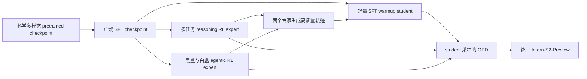

# E10 Intern-S2-Preview: Scientific Agentic Foundation Model：后训练与项目一精读

Intern-S2-Preview 从科学多模态预训练模型出发，先做广域 SFT，再从同一 SFT checkpoint 分别训练推理与 agentic 两个专家，最后经专家轨迹 SFT warmup 和 sampled-token OPD 汇合。报告最有用的披露是：推理 RL 的完整 REINFORCE 目标、逐 token 跨版本修正，以及黑白盒 harness 的语义轨迹与精确 token 双视图。它还覆盖科学生成、通用多模态、时序预测与独立 Memory Decoder 扩展。主要限制是数据消费漏斗、teacher/训练成本和 agentic 完整 loss 未给；397B 论文与脚注链接当前的 35B 模型卡也不能混用。

导航：[来源与全篇覆盖](#source) · [模型关系与 SFT](#pipeline) · [推理 RL 与系统](#reasoning) · [Agentic 数据、轨迹和评分](#agentic) · [OPD](#opd) · [评测、边界与项目映射](#evaluation)

## 1. 来源、版本与覆盖

- **原文**：Intern-S2-Preview Team, Shanghai AI Laboratory，《Intern-S2-Preview: Scientific Agentic Foundation Model》，[arXiv:2608.13505v1](https://arxiv.org/abs/2608.13505v1)，2026-08-13 17:31:28 UTC 提交；本次查阅日 2026-09-07。正式标题不含“训练配方”等目录说明。
- **定位口径**：[本地 PDF](../pdfs/E10_intern_s2_preview_2608.13505.pdf) 共 35 页，PDF 物理页与印刷页一致；第一页未印页码。下文 p.、Eq.、Fig.、Table 均指这一 PDF。正文 p.1–27，References p.28–35，**没有附录**。已从 TeX `main.tex` 的全部 `input` 到 `end{document}` 及 PDF 尾页核对，不把参考文献后的空白当成漏读附录。
- **交叉材料**：[官方 TeX 下载](https://arxiv.org/src/2608.13505v1)，已保存在 [E10 来源目录说明](sources/E10/README.md)，读了全部正文源文件；[文本提取](sources/E10/paper-layout.txt) 用于检索，公式、全部图表回本地 PDF 渲染页核对。下载的部分图形素材排版与本地 PDF 不同，本文页码、图示与数值以指定 PDF 为准，TeX 用于公式文字交叉核验；未重新编译或替换 PDF。
- **开放资产检查**：查阅论文脚注所指 [HF 模型卡](https://huggingface.co/internlm/Intern-S2-Preview/blob/4f57cab513689b089019fce4ad24e26520df183c/README.md)，revision `4f57cab513689b089019fce4ad24e26520df183c`；API 返回 lastModified `2026-05-29T07:30:04Z`。此卡介绍 **35B**、continued pretrained from Qwen3.5，而非论文主表的 397B。只用于识别资产与版本边界，未用其内容补写 397B 配方。
- **框架入口检查**：[InternLM/xtuner](https://github.com/InternLM/xtuner/tree/76e705134521eff867b409f3b3451df1c4d8dd36)，读取该 commit 的 `README.md`；只核公开入口和其披露状态，未将当前框架默认值认定为本论文配置，也未完成框架实现审计。
- **旧稿最后才读**：[旧摘要](../../../../knowledge/summary_intern_s2_preview.md)。另检查[配方矩阵](../agentic_rl_training_recipe_evidence_matrix.md)全文检索结果；该文件最近核验为 2026-08-03，本次没有找到 Intern-S2/E10 专属段落，不能假称已有对应配方行。

原文无目录页，下表由全部章节标题与 `main.tex` 输入结构独立建立，先于旧摘要阅读。

| 原文范围 | 深度与覆盖 | 本笔记位置 |
| --- | --- | --- |
| Abstract、§1 Introduction，p.1–2 | 全读；问题、阶段关系、科学 agent 目标 | §2–3 |
| §2.1 Memory Decoder，p.2–4，Fig.1、Eq.1–4 | 精读；独立扩展、retrieval teacher、冻结与训练参数 | §7 |
| §2.2.1 Encoder、§2.2.2 Generation，p.4–5，Fig.2 | 架构概要；影响训练/评测的输入压缩与数值预测完整记录 | §2、§7、§8 |
| §3.1 VP，p.5–6，Fig.3、Eq.5–9 | 预训练概要；冻结对象与联合目标已核 | §2 |
| §3.2 Interleaved Data、§3.3 Retrieval，p.7–8，Fig.4–5 | 预训练概要；OCR、PPL 筛选、长文拼接、图像召回 | §2 |
| §4.1 Framework、§4.2 SFT，p.8–9，Fig.6 | 精读；安全、科学生成、多模态、工具、长轨迹均覆盖 | §3 |
| §4.3.1 Partial Rollout，p.9–10，Fig.7、Eq.10–13 | 精读；pause/resume、IS、R3、精度、BKL | §4.1、§4.5 |
| §4.3.2 Length Regularization，p.10–12，Fig.8、Eq.14–17 | 精读；正 advantage 条件、质量保持、35B 消融 | §4.3、§8.3 |
| §4.3.3 Speculative Decoding，p.12–13，Eq.18–24 | 精读；在线 draft、KL/TV 混合、速度口径 | §4.6 |
| §4.3.4 GEPO、§4.3.5 Unified Objective，p.13–15，Eq.25–29 | 精读；组熵、不对称 shaping、LOO、分母与已知参数 | §4.2–4.4 |
| §4.4 总述、§4.4.1 Infra，p.15–17，Fig.9 | 精读；黑/白盒、三协议、TITO、PrefixTree、双视图 join | §5.1–5.2 |
| §4.4.2 Task Construction，p.17–18，Table 1、Fig.10 | 精读；七公开源、skill 合成、离线选择性模仿与反馈闭环 | §5.3–5.4 |
| §4.4.3 Training，p.18–20，Fig.11、Eq.30 | 精读；session advantage、过程反馈、verifier 防漏、训练曲线 | §5.5–5.6、§8.3 |
| §4.5 OPD，p.20–21，Eq.31–36 | 精读；两专家、warmup、reverse KL、prox/beh、通信量 | §6 |
| §5.1.1 Scientific、§5.1.2 General，p.22–24 | 全读各 benchmark 定义与已给 harness；非 SWE 全覆盖 | §8.1–8.2 |
| §5.2 Main Results、§5.3 Architecture，p.24–26，Table 2–5、Fig.12 | 全读所有表与雷达图；保留退化和不支持的排名说法 | §7–8 |
| §6 Conclusion、作者贡献，p.27；References，p.28–35 | 结论全读；参考文献检查到最后一条 [112]，不递归精读全部被引论文 | §9–10 |

## 2. 模型问题与预训练背景

**论文事实。** 科学任务既要理解图表、分子/生物序列、数值信号，也要生成结构、使用外部程序并在长流程里验证结果。主评测对象为 Intern-S2-Preview-397B；35B 在 Fig.8 的长度正则消融中单独出现，Memory Decoder 则是冻结 397B 主干的可选扩展。不能把三个对象的数字合并为一个实验（§1–2、§4.3.2、§5.3）。本报告未给 397B 完整配置表、激活参数量与精确 pretrained checkpoint ID。

三条预训练材料线为后训练提供科学表示，不能当成 SFT/RL 任务量：

1. **Visual Pre-training**：科学 PDF 渲染为页面；冻结视觉 encoder，保留前景 latent 并按 raster 顺序输入 LLM，预测下一个 latent。温度缩放余弦相似度形成 batch 内对比 loss，正确下一 latent 为正例，其余 target 为负例；联合目标为 `λ_text L_CE + λ_vis L_VP`，更新 LLM、输入投影、预测头，视觉 encoder 不更新。这条 VP 本身不需要 OCR/配对标注（§3.1，p.5–6，Eq.5–9，Fig.3）。
2. **交错图文长文**：另一条线使用 MinerU2.5-Pro 做 OCR 和布局解析，裁剪图片、行间公式、表格；按页面阅读顺序拼接，用 `PPL_text-only − PPL_interleaved` 衡量视觉增益，结合人工与分域阈值过滤，再按原页序构成长文。每 chunk 最多 256k token、重叠 512 token，重点生命科学、化学、材料学。这与“不需 OCR 的 VP”是两条机制，不能互相矛盾地概括（§3.2，p.7，Fig.4）。
3. **图像检索增强**：按图像 SHA256 去重，8B embedding 模型生成 1024 维向量，Milvus 分片 collection 支持数亿规模；文字直接召回，图像联合其 embedding 与 caption embedding 召回，再去重、rerank、质量过滤，提高高质量科学图片的采样比例。数亿是数据库规模描述，不是最终训练消费图像数（§3.3，p.7–8，Fig.5）。

## 3. 后训练依赖关系与 SFT

图中分支依据 §4.1/Fig.6 与 §4.5；原 Fig.6 简写了最终合并，warmup 由 p.20 文字补全。**同一 SFT 初始化分叉为两个专家**，不是先完成 reasoning RL 再在同一权重串行做 agentic RL；也不是每个 harness 对应一位 teacher。黑盒与白盒是 agent 控制循环的接入方式，不是对模型权重或 teacher 概率是否可见的区分。

SFT 混合包含：通用对话、instruction following、**safety alignment**、代码生成与推理、图文理解、视觉感知与空间 grounding、工具使用、专业科学任务、长 horizon agentic 轨迹。数据清洗、过滤、去重；显式推理任务由上一代 **Intern-S1-Pro** 与其他领先开源模型 rejection sampling 产生 CoT，随后由语言模型及人工领域专家验证事实、推理和格式。原文没有给各域数量/比例、接受率、其他模型名或 SFT 优化超参数（§4.2，p.8–9）。

多任务 RL 以可验证目标改善正确性、推理深度、科学生成、响应效率，范围为科学和通用任务（§4.3）；没有逐个给出分子、晶体、蛋白设计的 RL reward 和混合配方，不能从 §5 的评测列表倒推每项都作为某阶段训练集。安全后训练的明确落点是上述 SFT，以及 §4.4.2 不安全技能过滤和 verifier integrity；未单独披露 DPO/RLHF 安全阶段或安全评测表。

## 4. 推理 RL：目标、分母与 rollout 系统

### 4.1 共置 partial rollout 与逐 token IS

**论文事实**（§4.3.1，p.9–11，Fig.7）：XTuner 训练 + LMDeploy 推理共用 GPU 池。推理期间不断补入新请求；收集足够**完成**轨迹成 batch 后，未完成请求原位暂停，保留 prefix 与元数据；GPU 切到训练，更新后 offload 训练状态、同步新权重，再从保留 prefix 恢复。未完成前缀不单独进入当次 batch。它避免等全部长尾结束，但不是训推分离的 fully asynchronous 拓扑；图示 GPU 0–5 是机制示意，不能读成实训仅六卡。

同一轨迹可能跨多个行为版本，因此每个 sampled token 记录生成时 logprob 与版本。令 `s_{i,t}` 为生成第 i 条轨迹第 t 个 token 时的状态：

\[
\rho_{i,t}(\theta)=\frac{\pi_\theta(y_{i,t}\mid s_{i,t})}{\pi_{\mathrm{beh}(i,t)}(y_{i,t}\mid s_{i,t})},\qquad
\bar\rho_{i,t}=\operatorname{clip}(\rho_{i,t},1-\epsilon^{IS}_{low},1+\epsilon^{IS}_{high}).
\]

Eq.10–11（p.10）的分母是**该 token 真正的行为策略**，不是统一 rollout 起点版本或 teacher。`barρ` 在 loss 内 detach，只作常数权重；这是裁剪 IS 权重，不是 PPO 的 `min(ratio*A, clipped_ratio*A)` surrogate。它不会仅因 ratio 超界就将该 token 的梯度置零；但 BKL mask、零 advantage 仍可使贡献为零。裁剪控制方差，不代表消除了所有 off-policy 偏差。

若轨迹最老保留 segment 比当前 learner **早超过三次 policy update**，丢弃轨迹（p.10）。原文未把这一版本单位与后述 8 个 mini-batch step 精确对应，不能自行乘除换算；丢弃如何影响已组装组与补采亦未给。

### 4.2 奖励、LOO 与 GEPO

每 query 采 G 条 response，verifier 给序列 reward `R_i`。在线丢弃 reward 全相同的 query group 并补采新组；保留组计算 leave-one-out advantage（p.14，Eq.27）：

\[
A_i^{LOO}=R_i-\frac{1}{G-1}\sum_{j\ne i}R_j.
\]

这是不含 critic 的 REINFORCE 基线；公式没有除组内标准差，不能改称标准化 GRPO。G 数值未披露，8,192 条 response 也不是 8,192 个 query。

先做 **GEPO（按组熵调节 advantage）**，后做长度正则（Eq.28）。组熵的采样估计为（p.13，Eq.25）：

\[
H_g(x)=-\frac1K\sum_{i=1}^{K}\sum_{t=1}^{T_i}\log\pi_\theta(y_{i,t}\mid y_{i,<t},x).
\]

这里对 response 平均、对 token 求和，**没有每条除以 T_i**。它不是平均 token entropy，也不是逐位置全词表熵；K 是该式的组 response 数，不是 speculative decoding 的 K=4。低熵组的正 advantage 乘 `α_low`，高熵组的负 advantage 乘 `α_high`，其余保持不变，两系数均在 (0,1)（p.13–14，Eq.26）。目的为避免低熵组过度利用、高熵组过早压制探索；无需额外采样或显式任务标签，是作者给出的设计解释。

**原文疑点**：p.13 文字说低熵干预应较温和；p.14 却排印 `α_high ∈ (0,1) > α_low ∈ (0,1)`，该串式不是清晰的系数不等式。不能据此确认两系数大小关系，也不能自行“修正”后当成作者配置；本篇保留确定的分支条件和衰减方向。上下阈值的算法与数值均未给。

### 4.3 自适应长度正则

在 GEPO 后 advantage `Â_i` 上定义正集合 `P_q={i: Â_i>0}`，只当 `|P_q|≥τG` 激活。对其中 response：

\[
w_i=\alpha+(1-\alpha)\left(1-\frac{L_i-L^+_{min}}{L^+_{max}-L^+_{min}+\epsilon}\right)^\gamma,
\qquad
\widetilde A_i=\frac{\sum_{j\in P_q}\widehat A_j}{\sum_{j\in P_q}w_j\widehat A_j+\epsilon}w_i\widehat A_i.
\]

其余 `Ã_i=Â_i`。`L_i` 是 reasoning 长度，`L_min/max^+` 是正集合内极值，α 给长 response 最低权重，γ 控衰减形状，ε 稳定分母（p.11，Eq.14–17）。短正 response 权重大，长正 response 仍保留正号，且近似保持正 advantage 总和；**不修改 verifier reward，也不直接给失败轨迹加长度负奖**。

原文用 pass rate 解释激活条件，但精确定义是**正 advantage 比例**，不是一个独立成功标签；一般非二元 reward 下不能自动等同任务通过率。§4.3.2/Fig.8 的实证是 35B 两条训练曲线：正则后输出缩短、reward 接近，未给独立评测或统计区间，不能推成 397B 所有领域“无损压缩”。

### 4.4 完整 reasoning loss 与已披露配置

Eq.29（p.14）为：

\[
\mathcal L_{RL}=-\mathbb E_{(q,\{y_i\})\sim\mathcal B}
\left[\frac1G\sum_i\frac1{|y_i|}\sum_t
m^{BKL}_{i,t}\operatorname{sg}[\bar\rho_{i,t}]\widetilde A_i\log\pi_\theta(y_{i,t}\mid s_{i,t})\right].
\]

先对每 response 的 token 求和并除原长度，再对 G 条 response 平均，最外层对 buffer 的 query group 取期望；不是全 batch token 扁平平均。BKL 剔除 token 仍留在 `|y_i|` 分母，不按 mask 存活数重归一化。序列 advantage 共享给该 response 的 policy token。公式无额外 reference-model KL 或 entropy bonus；GEPO 是 advantage shaping，BKL 是数值 mask，均不是那种正则项。

| 配置 | 原文值与单位 | 限定 |
| --- | --- | --- |
| optimizer / LR / weight decay | Muon；1×10^-6；0.01 | §4.3.5，p.14；不外推为所有 SFT/OPD 参数 |
| rollout batch | 8,192 条**完成的 response** | 每 query 的 G 未给 |
| mini-batch 更新 | 每 rollout batch 8 次 update steps | 非“同一数据 8 epochs”的明确声明 |
| 最大生成长度 | 65,536 token | p.15，reasoning RL；不是所有 session/评测预算 |
| staleness | 最老 segment 超过 3 policy updates 则丢轨迹 | §4.3.1；版本发布单位未进一步解释 |
| IS clip、BKL φ、GEPO 与长度系数 | 有符号，没有数值 | 不用旧模型或框架默认值补齐 |

### 4.5 R3、精度与 BKL mask

LMDeploy 记录 MoE expert 路由，XTuner 对对应 token 重放，减少离散计算路径差异。专家线性层 FP8，其余层 BF16，但 `apply_rope`、RMSNorm、MoE router、Gated DeltaNet recurrent states、LM head 用 FP32（p.10）。这些是本文训练机制描述，不是硬件型号或完整混合精度配置表。

在**相同模型参数且路由已重放**下比较 training 与 rollout 的 sampled-token 概率 p、q，定义二元 KL（Eq.12–13）：

\[
D_{BKL}(p\Vert q)=p\log(p/q)+(1-p)\log((1-p)/(1-q)),\quad
m^{BKL}=\mathbf1[D_{BKL}(p\Vert q)\le\phi]\mathbf1[D_{BKL}(q\Vert p)\le\phi].
\]

这将单个 sampled token 与“其余 token 总质量”组成 Bernoulli 分布；不是全词表 KL。它筛数值离群点，不能用当前参数与老行为参数的差异冒充训推误差；IS 另处理策略更新差异。原文没给如何对跨版本片段重新取得 matched-parameter p/q、阈值、极端概率保护及额外计算成本。

### 4.6 在线 speculative decoding

轻量 draft 预测多个候选，当前 policy 以精确 rejection sampling 验证，因此在该采样前提下保持 policy 分布。每 RL iteration 用新 rollout 状态上的当前 policy 分布更新 draft，policy stop-gradient；两分布均处于 rollout sampling temperature（§4.3.3，p.12–13，Eq.18–24）。

以 `p=sg[π_θ]` 为 target、`q=π_draft`，forward KL 为 `Σ_v p_v log(p_v/q_v)`，TV 为 `½Σ_v|p_v−q_v|`；接受概率 `a=Σ_v min(p_v,q_v)=1−TV`。第 k 个 draft 位置使用：

\[
L_{LK}^{(t,k)}=\lambda_k KL(p\Vert q)+(1-\lambda_k)TV(p,q),\qquad
\lambda_k=e^{-\eta\operatorname{sg}[\bar a_k]},\quad
L_{draft}=\frac1K\sum_k\frac1{|\mathcal T_k|}\sum_{t\in\mathcal T_k}L_{LK}^{(t,k)}.
\]

`bar a_k` 跨序列和 batch 聚合；K=4 个未来位置，η=3。接受率低时以 KL 稳定对齐，接受率高时提高直接优化分布重叠的 TV 权重。此 draft 是加速器，不是最终能力合并的 reasoning/agentic teacher，也不是 Memory Decoder。

作者报告 rollout 生成约 **2×**、整体 RL pipeline **1.7×** 加速（p.13）；未给对应 GPU、基线绝对时间、工作负载、draft 规模或分项成本表。它们是不同测量范围，不能再相乘，亦不能作为共置优于 fully async 或八卡复现成本的证据。

## 5. Agentic：数据、harness、训练与 verifier

### 5.1 harness × task 的真实含义

Harness 决定实例化、驱动、观测、消息与工具循环；task 决定初始环境、可执行目标、verifier outcome。两者独立组合成统一 session（§4.4，p.15）。白盒 loop 可直接编排；黑盒经原生 CLI/SDK/model API 接入，保留其内部逻辑。列举的黑盒包括 OpenClaw、Claude Code、OpenCode、OpenHands、Mini-SWE；“黑盒”不等于闭源，白盒也未被限定为必须自研。

Agent Rollout Runner 接收 harness-task 对、准备环境、管理正常与异常终止。Judger Adapters 对同一 session 状态和执行工件做 outcome 与过程标注；Shared Sandbox Provider 抽象 local/remote/custom 环境创建、命令、隔离、错误处理和清理。原文并未给具体容器/网络权限、fresh grader 的进程拓扑或 sandbox TTL（§4.4.1，Fig.9）。

### 5.2 服务端 token 捕获与双视图

Model serving 接受 OpenAI Chat Completions、Responses、Anthropic Messages，支持普通与 streaming；native text/reasoning/tool-call 事件返回 harness。同时服务端捕获精确输入/输出 token IDs、rollout logprob、逐 token router experts，客户端不需要理解训练扩展。

**TITO**：Session Server 复用已记录 tokenized prefix，仅 tokenize 新增 context，把 token IDs 直接送 inference engine；生成 token 和统计来自交给 agent 的同一响应流。它不是先存可见文字再整段重分词。**R3** 再保留产生 token 的 MoE 路由（p.16）。

两类记录通过 session 与 segment join（p.16–17）：

| 记录 | 内容与用途 |
| --- | --- |
| Replay Buffer | 语义 action–observation 轨迹、最终 reward、过程标注、session 元数据 |
| Rollout Trace Store | token IDs、loss labels、behavior logprobs、router experts；每 session 的增量 PrefixTree |

PrefixTree 节点为 context delta 或 assistant response；最长前缀匹配复用稳定历史，只增新段；训练时物化 root-to-leaf。system/user/tool observation 不进 loss，eligible policy segments 保留 labels。树保留多轮与分支的 lineage 和调用边界，供消息→token span 对齐及过程 credit。

**证据边界**：这证明作者提出精确采样 token 的保存与拼接路径；不能从“树支持 branching”推出 compaction/rewrite 后被移除响应的训练覆盖、共享前缀跨 leaf 如何去重计权、子 agent 的 reward 归属或 teacher 上下文重建已公开解决。这些细则正文和图中没有给出。

### 5.3 Coding / terminal 公开来源：这是来源库存，不是消费漏斗

Table 1（p.17）列出用于构造任务的公开 collection；数字逐格照原表，不擅自将 environment 数校正成任务数：

| Provider / Collection | #Tasks | #Environments |
| --- | ---: | ---: |
| SWE-bench / SWE-smith | 59,136 | 222 |
| SWE-Gym / SWE-Gym | 2,438 | 2,401 |
| R2E-Gym / R2E-Gym-V1 | 7,480 | 8,101 |
| Nebius / SWE-rebench-V2 | 32,100 | 32,075 |
| AweAI-Team / Scale-SWE | 20,200 | 19,472 |
| NVIDIA / Nemotron-Terminal-Synthetic-Tasks | 80,000 | 8 |
| RUC-AIBOX / ClawGym-Task | 13,500 | 1 |

来源含真实 GitHub issue/PR/history 挖掘与程序化/合成任务，覆盖仓库修复、调试测试、软件安装、文件数据操作和 terminal 工作。归一化方法是 materialize base repo/container/assets、issue/instruction 转目标、原 tests/reward program 保留为 verifier，保持来源特有执行与 reward 语义（§4.4.2）。

原文没有逐源“原始候选→构建成功→gold 验证→当前模型可解→最终训练消费”的数量，也没给跨源重叠、最终采样比例、来源 revision/许可汇总、repo/time split、去重与污染评估。R2E 的 8,101 environments 大于 7,480 tasks 是**原表值**；未解释计数定义，不能拿它计算镜像复用率。公开源库存相加也不是独立训练题量。

### 5.4 社区 skill 合成、离线轨迹与自演化

Fig.10、§4.4.2（p.17–18）提供另一条通用 agent 任务线：

1. 收集 community skills，过滤不可执行、不安全、低质量、冗余项，包括不可得认证、外部交易和有毒内容；按领域平衡重采样。
2. 建 skill-state graph：节点是可观察环境状态，边是 skill 提取出的状态变换；仅组合输入/输出状态兼容的能力。抽不同路径长度，形成多种 horizon/复杂度。
3. 依次生成 environment、task instruction、verifier；每阶段都有 executable validator。规则检查结构、依赖和可执行性，rubric 检查语义质量和阶段一致性；失败就局部 repair/regenerate，验证后才下传。
4. 验证任务进入 online RL，也产生 reusable offline rollout。outcome 过滤后逐步标注正常进展、工具错误、重复失败、错误恢复、过早结束、协议违规、无依据假设、虚构观察。错误步骤保留在 context 中，但可标 `skip`，不进 **imitation loss**，后续正确动作仍能利用其因果上下文。
5. 按 skill domain 和合成阶段汇总失败与 verifier 反馈，更新采样权重、合成 skills、环境模板及 prompts，再生成下一批。Fig.10 明示 reusable supervision 可用于 SFT / replay-based RL，但正文没有后者的单独目标和具体运行比例。

此处未给合成器/solver/validator 模型 ID、teacher 预算、每题重复次数、repair 上限、技能/任务数量或消融。不能把有流程图写成“已证明自演化优于静态数据”，也不能把离线 `skip` 等同下一节在线 `adv_penalty`。

### 5.5 Session credit 与 process advantage

同 task 的 rollout group 中，每个完整 session 一个 outcome reward；计算 group-relative `A_i`，广播给该 session 的全部 eligible policy segments，**不把每次模型调用当独立 episode**（p.18–19）。此节引用组相对范式，却没有给标准差/LOO 的具体公式，因此 agentic 的 `A_i` 不能强填为 §4.3.5 的 reasoning LOO，也不能声称其一定是标准 GRPO。

过程 annotator 为确定性错误消息添加 `adv_penalty`，**不改 session reward，不改 token labels**。PrefixTree 将消息映到准确 token span；对 segment k 的可训 token t（p.19，Eq.30）：

\[
\widetilde A_{i,k,t}=\begin{cases}w_{i,k}A_i,&A_i>0,\\A_i,&A_i\le0,\end{cases}\qquad w_{i,k}\in[-1,1].
\]

非可训 token advantage 置零。过程权重可抑制甚至反转成功 session 中错误行为的正 credit；非正 advantage 原样保留。可标错误包括 parse/格式、工具名/参数、重复或失败工具调用、context/turn/session limit 终止。原文没有给每类 w 的值或标注规则实现；这不是单独训练出来的逐步 reward model。

失败处理须拆开：有定义的 session 失败保留非正学习信号；超限可得到过程惩罚；但各种超时/截断/解析错误是否进入 group reward 统计、是否整条/整组丢弃、是否重试补采，并无完整表。也没有 agentic 完整 scalar loss 的 token/segment/session 分母公式；Fig.9 的 “clipping · IS · process weights” 不能补出这些细节。

### 5.6 Verifier integrity：已做什么、未证明什么

§4.4.3（p.19–20）披露：

- gold patch、held-out tests、精确 scoring test IDs 不放入 rollout workspace，仅评分基础设施在执行后使用；Git history 清为单 baseline commit、删 remote refs，必要时去掉暴露 upstream issue 的 task ID。
- agent 停止后恢复/覆盖 canonical tests，并在 agent source change 上应用 gold test patch，防止 agent 修改可见测试直接改变评分。
- SWE 用 all-correct 语义，target-fix 与 regression checks 都必须通过；存在 canonical expected test-state map 的任务要求观测结果精确匹配。
- 缺 grading 工件、执行故障、无法解析 verifier 输出单独记账，与真实任务失败分离，避免基础设施错误被认成策略成功。

这些措施不是无条件防作弊证明。原文没有 no-op/gold/合法替代解验证数量、重复评分稳定性、误杀率、测试 plugin/config 控制面、网络隔离或成本。不能从“恢复测试”推成所有 evaluator 控制面都不可改，也不能从“错误单列”推成错误必然全部丢组或给固定 0 reward。

## 6. OPD：两专家、warmup 与 sampled-token 训练

### 6.1 专家与学生是谁

§4.5（p.20）明确两位教师来自**同一个 SFT checkpoint**：mixed reasoning RL expert 与黑白盒 agentic RL expert。先让两专家生成高质量轨迹，对**原 SFT 模型**做轻量 SFT warmup；warmup checkpoint 才是 OPD 初始 student。动机是缩小 student 与 teacher 行为差异，使 teacher 能对 student 生成的前缀提供可靠信号。

作者的 preliminary evaluation 认为，为很多细域分别训练专家会增加 RL/infra 成本，额外收益有限；这是**该设置的定性经验判断**，没有对照表或金额，不能概括成“明确否决所有多专家方案”。两专家并不意味着两个外部商用 API，也没有证明 teacher 总成本低。

每 query 归 reasoning 或 agentic 域，选择对应 teacher；不是每个 token 混两份 logits。student 自己产生 trajectory，teacher 在相同 student prefix 上评分。原文以固定专家策略描述 OPD，但未给 teacher refresh 日程、精确 checkpoint ID 或跨 tokenizer 对齐实现；同 SFT 起源支持行为相容的动机，不是 tokenizer 等价性的单独检验报告。

### 6.2 理想目标与实际 surrogate 分开

令 `d∈{rea,agt}`，域 prompt 分布 `D_d`，域权重 `λ_d`，teacher 为 `π_Td`，student 为 `π_θ`。p.20，Eq.31–32 的理想 fully on-policy 目标最大化：

\[
J_{OPD}=\sum_d\lambda_d\mathbb E_{q\sim D_d,y\sim\pi_\theta}
\left[\sum_{t=1}^{H}\big(\log\pi_{T_d}(y_t\mid s_t)-\log\pi_\theta(y_t\mid s_t)\big)\right],
\]

作者将其表述为在 student-induced states 最小化 **reverse KL `KL(student || teacher)`**。序列求和的理想目标与后面训练 surrogate 的按轨迹长度归一化并非完全同一个权重口径；不能说 Eq.36 是无需近似或修正的逐字等式实现。

实际只传 student sampled token 的 teacher logprob，通信 payload 从 full vocabulary `O(HV)` 或 top-k `O(Hk)` 降到 `O(H)`（p.20–21）。作者点名 top-64 在最长 **256K sequence** 上仍有较大负担。此数是 OPD 上下文的 maximum sequence length 描述，不等于每轮新生成 256K，更不是所有评测预算；`O(H)` 仅指传输 teacher 概率的载荷，不代表 teacher forward 计算降为常数或无需完整词表归一化。

p.21，Eq.33–36：

\[
\widehat A_{i,t}^{OPD}=\operatorname{sg}[\log\pi_{T_d}(y_{i,t}\mid s_{i,t})-\log\pi_{prox}(y_{i,t}\mid s_{i,t})],
\]
\[
\rho^{OPD}_{i,t}=\pi_\theta(y_{i,t}\mid s_{i,t})/\pi_{beh(i,t)}(y_{i,t}\mid s_{i,t}),
\]
\[
L_{OPD}=-\sum_d\lambda_d\mathbb E_{\mathcal B_d}
\left[\frac1{N_d}\sum_i\frac1{|\mathcal T_i|}\sum_{t\in\mathcal T_i}
m^{BKL}_{i,t}\operatorname{sg}[\bar\rho^{OPD}_{i,t}]\widehat A^{OPD}_{i,t}\log\pi_\theta(y_{i,t}\mid s_{i,t})\right].
\]

这里 `π_prox` 是构造蒸馏信号用的**冻结 proximal student**；`π_beh(i,t)` 是生成 token 的行为策略；当前 `π_θ` 更新。三者不能混成一个 old policy。teacher 与 prox 的差决定方向，current/behavior ratio 修正 partial rollout 与更新差异；IS clip 区间与 reasoning RL 相同，数值未公开。prox 多久刷新未给。

`T_i` 为 policy-generated token 集，排除 prompt、environment observation、tool output、padding；每条除 `|T_i|`，域内 N_d 条等权，再乘域权重。BKL mask 乘入分子，**没有将分母改为 BKL 存活 token 数**。OPD 有 R3/BKL，但不将 reasoning 的 LOO、GEPO、长度正则塞进 teacher-token advantage。它也没有显示使用 reward 全同组过滤；不能从 reasoning 动态采样推断 OPD 会丢弃全失败组。

teacher 的 GPU/评分吞吐、warmup 数据量、λ_d、prox 刷新、OPD optimizer/step/batch、特权上下文与失败/截断轨迹处置未给。最大长度和 payload 阶数不足以复现训练成本。

## 7. 非 SWE 后训练：Memory Decoder 与时序

### 7.1 独立 Memory Decoder 的训练完整链

这是附加到冻结主干的领域专长模块，不是 agent 的会话记忆，也不是最终 OPD 的第三个专家（§2.1，p.2–4，Fig.1）。

领域 SFT corpus `D_sft={(q,a)}` 的答案 token 位置形成 datastore：prefix `c_t=[q;y_<t]`，冻结特征函数 φ 得 key，value 为目标 token。近邻集合 `N(k_t)` 形成 retrieval teacher（Eq.1）：

\[
p_{ret}(y\mid c_t)\propto\sum_{(k_j,v_j)\in N(k_t)}\mathbf1[y=v_j]\exp[-d(k_t,k_j)/\tau].
\]

训练 Memory Decoder（Eq.2）：`L_mem=β KL(p_ret || p_mem)+(1−β)(−log p_mem(y_t|c_t))`。这里是 **retrieval teacher→memory 的 forward KL**，不同于 §6 student→expert reverse KL。β 在 [0,1]，距离、近邻数、温度和具体数据规模未给。

推理时冻结的 397B 主干与 memory 并行处理同 context，router 取双方 hidden states、confidence/entropy 特征，预测 `λ_t∈[0,1]`，输出 `(1−λ_t)p_S2+λ_t p_mem`（Eq.3）。训练 router 时双方模型都冻结，只训练 router，使用领域与通用指令混合数据，loss 为 fused CE 加 `α_s s_t λ_t`，其中领域 s_t<0、通用 s_t>0、α_s>0（Eq.4）。即鼓励领域调用 memory、通用例子减少调用；具体权重与混合比例未给。

实例 Intern-MemDec-4B 在 21 个 Biology-Instructions tasks 上把报告平均分 **56.92→60.32，+3.40 分**（约 +6.0% 相对变化）；不是 +6 个百分点。Fig.12a 全部子任务已核：14 个提高、7 个下降，下降为 DNA-tf-h 56.57→55.99、antibody-antigen 40.24→36.44、siRNA efficiency 63.05→60.63、Protein-FunctionEC 61.88→60.10、Solubility 68.60→68.00、Stability 69.67→67.80、Thermostability 58.44→53.97。较大增益有 promoter-enhancer interaction 22.46→38.47、CRISPROnTarget 6.61→17.18（p.26）。

Fig.12b 各类轴做 task-specific normalization，不能按图形面积计算整体增益；蛋白类别下降。Fig.12c 另外比较 MMLU Pro、Mol-Instructions、MMMU Pro、MicroVQA、IMO-Answer-Bench、SFE，作者描述与冻结主干接近，图未提供新一轮全部精确值/误差或完整 agentic 回归测试；“主干不更新”也不保证融合系统所有域行为不变。

### 7.2 Time-series 模块与结果

§2.2（p.4–5，Fig.2）：按时间 chunk，normalization 保留 channel mean/std，CNN 提局部特征，Q-Former 压缩 patch；动态 patching 控 token 长度，新增 channel-wise Transformer 学跨通道关系，再做全局时序 Transformer。输入上限由约 240,000 增到 300,000 time steps；最大长度处报告 encoder 推理 5–6× 更快、GPU memory 为原版约 20%，但无硬件/绝对时间。不是全模型 RL 加速。

数值 forecasting 独立分支从 LLM semantic context 与 encoder temporal representation 经 Q-Former 抽取、cross-attention 条件化 causal Transformer，horizon predictor 判断预测长度。避免将全部数值作为离散文本生成；本报告未给该分支 loss、训练数据配比、冻结策略或是否单独参与 RL。

Table 4（p.25）的 11 个 SciTS understanding task 报 F1：S2 依序为 ASU01 97.1、ASU03 91.0、BIU01 36.5、BIU03 98.3、EAU01 100.0、MEU01 81.8、NEU06 70.2、PHU01 66.9、PHU04 99.9、RAU01 88.4、RAU02 60.2。两模型共有九项中七项超 S1-Pro，ASU01 98.0→97.1、NEU06 71.3→70.2 退步；新增雷达两任务不能当旧模型原先 0 分。PHU01 为 36.8→66.9。

Table 5（p.27）预测结果为 **MAPE（成功率%）**：ENG02 60.2(100)、ENG03 7.1(100)、MEG03 32.8(100)、NEG03 59.2(100)、PHG02 72.2(100)、URG01 138.9(100)、URG05 60.6(100)。MAPE 越低越好，成功率另计，100% 不表示预测误差为零。原文归因 text/VL 方法低成功率于输出长度与格式失败；没有给失败如何进入 MAPE 分母的完整规则。

不可照抄“全部最低”：NEG03 Moirai-Large 为 59.1(100)，略优于 S2 的 59.2(100)；DeepSeek-V3 是 4.3(3.1)，其很低成功率使单看误差会误导。horizon predictor accuracy 99%，GIFT-Eval zero-shot MASE 0.785，是另外两个指标（p.26），不与表中 100% 混用。

## 8. 评测、消融与负结果

### 8.1 科学、多模态与通用覆盖

下表数值来自 **397B** 的 Table 2–3（p.24–25），benchmark 描述来自 §5.1（p.22–24）。这些是原报告的 score，不能全部改标 pass@1 或统一成功率；题库规模也不等于每项实际运行样本分母。

| 领域 / benchmark | S2 分数 | 原文任务与设置要点 |
| --- | ---: | --- |
| Biology-Instructions | 56.92 | 多组学生物序列；另有 §7 的 21 task memory 研究 |
| Mol-Instructions | 52.37 | 分子、蛋白、生物分子文本三类指令 |
| MolecularIQ | 61.49 | SMILES 图推理；5,111 问题、849 个结构 held-out 分子；计数、索引、约束生成 |
| SciReasoner | 63.97 | 九领域、149 concrete tasks、十子基准；选择/填空/程序协议 |
| TOMG-Bench | 65.66 | 编辑、属性优化、定制分子；各三子任务、每子任务 5,000 tests；有效性/约束/相似与新颖 |
| MP20 | 67.88 | ≤20 原子晶体条件生成；描述 27,136 train/9,046 test；§5.2 称实际采用 internal evaluation set |
| ProteinBinder-9 | 4.36 | 九靶点 binder 设计；多阶段结构/物化检验，涉及 RFdiffusion、AlphaFold 3；§5.2 同称 internal set |
| XLRS-Bench | 51.97 | 超高分辨率遥感；16 subtask，感知/推理 |
| MicroVQA | 68.81 | 1,042 专家显微 VQA；图像理解、假设、实验设计 |
| SFE | 61.67 | 830 VQA、66 task、五科学领域 |
| ObsCrisis-Bench | 26.07 | 4,202 VQA、127 events、八灾害类、61 国；多时刻观察与可选站点信息 |
| MMLU-Pro | 89.75 | 多学科知识推理 |
| SimpleQA-Verified | 69.90 | 1,000 人工核题；无检索，评分区分正确/错误/未尝试 |
| AdvancedIF | 74.44 | 1,645 prompt、最多 20 独立 rubric；全部适用约束满足才成功 |
| HMMT-2026 | 91.57 | 2026 年 2 月竞赛 33 题；具体重复次数未给 |
| MMMU-Pro | 80.46 | 专业多模态理解推理 |
| ChartQAPro | 69.65 | 1,341 图、1,948 问、99 来源；数理/视觉、对话、事实核查、假设 |

ProteinBinder-9 描述称应报告每靶点 passing count 与 fraction，但当前报告仅总表标量 4.36，未提供每靶点候选分母/成功数，不强解为“4.36% 已验证湿实验成功”。MP20 与 ProteinBinder 的 internal set 表述也限制公开复现。以上评测展示科学能力广度，但没有 SFT、两 expert、warmup、OPD 分阶段的同条件分数表。

### 8.2 Agentic 评测：模型、harness 与预算必须绑定

| Benchmark | S2 分数 | harness / 已披露设置 | 关键限制 |
| --- | ---: | --- | --- |
| SciCode | 49.11 | 80 main/338 subproblem、16 科学子域；可选背景/参考解/可执行 tests 的基准描述 | 是否启用背景、实际 split/harness 未给 |
| SGI-Bench | 49.37 | 1,263 专家样本、十领域、75 research directions；deep research/idea/dry-wet experiments/multimodal reasoning | 多维评分；非单一代码 pass@1 |
| ResearchClawBench | 18.44 | **ResearchHarness v0.0.49**；40 题/十领域，从原始数据与文献写报告，隐藏目标论文，专家多模态 rubric | 完整 run token/time/repeats 未给 |
| SkillsBench | 50.03 | **OpenClaw 2026.5.7**；87 task/八域，skills+deterministic verifier | 基准有 with/without skills 比较设计，但此表未列一对控制分数 |
| Terminal-Bench 2.1 | 67.42 | **Terminus 2**；89 task；2.0 中 28 题修订；部分结果来自 Artificial Analysis | 不应混成全部模型统一重跑；per-model预算未给 |
| SWE-Bench Pro | 61.56 | **Mini-SWE-Agent**；修改官方 eval image，防 git log 暴露 ground truth | 1,865题/41 repo 是总库描述，未写所用 split/实际分母/镜像 digest |
| SWE-bench Multilingual | 81.67 | **Mini-SWE-Agent**；300题/42 repo/九语言；F2P 和 P2P | agent version、采样与时间预算未给 |
| WildClawBench | 44.68 | 原生 CLI、中英多模态、真实工具与长流程 | 本实验具体 harness/version/预算未给 |

所有表中 comparator 为 Qwen3.5-397B-A17B、DeepSeek-V4-pro、Kimi-K2.7-Code、GLM-5.2、GPT-5.5、Gemini-3.1-Pro、Claude-Opus-4.8。它们不是统一底座或同训练成本的消融；本文不验证这些远端服务当前榜单。

对项目最相关的差距：TB2.1 67.42 vs GLM 77.90 / Claude 84.60；SWE Pro 61.56 vs 62.10 / 69.20；Multilingual 81.67 vs GLM 82.00（Table 3）。报告称科学 agentic “second only to GLM”不能逐项理解：SciCode 上 S2 49.11 低于三个闭源对照及 GLM；SGI 的 Kimi 50.63 也高于 S2 49.37（Table 2）。应保留数表，而非复述宽泛排名。

### 8.3 方法消融与证据强度

| 实验 / 原文 | 能支持什么 | 不能支持什么 |
| --- | --- | --- |
| Fig.8，p.12，35B 长度正则有/无 | 所示约 1,800 training steps 内，长度更短、reward 曲线接近 | 397B 或所有 test 上无退化；固定算力优势；图中淡色不是已定义置信区间 |
| Fig.11，p.19，160 optimization steps | SWE、General、Terminus 三面板及多个 harness 的代表性优化轨迹，有上升或回升 | 全部 RL 总步数、跨 harness 绝对 reward 可比、未见 harness 泛化或组件因果效应 |
| §4.3.3，p.13，2× / 1.7× | 作者报告在线 draft 系统的生成/端到端不同加速口径 | 绝对 GPU-hour、硬件迁移收益、partial rollout 独立加速比例 |
| Fig.12，p.26 | 冻结 backbone 后 memory 插件有领域平均增益，同时有七项退化 | backbone 不变即端到端能力完全不变 |
| Table 4–5，p.25/27 | 时序模块在多任务和不同成功率下的效果 | 单独由后训练带来的增益，或每项 MAPE 都最佳 |

Fig.11 已核全部曲线：SWE 有 Claude Code/Mini-SWE/OpenClaw/OpenCode/OpenHands，General 为 Claude Code/OpenClaw，terminal 面板含 Terminus。SWE/terminal 某些曲线先下降再恢复，不能删掉这种 transient 后写成单调稳定提升；图注明 local smoothing，没有 seed 数、方差或统一起点条件。

没有 OPD 相对 warmup/experts 的完整对照、GEPO/R3/BKL/两专家/技能反馈逐项消融，也没有训练数据泄漏审计的量化结果。§6 把系统称作 preview，并把长流程可靠性、更多领域 memories/任务环境、强化 verifier 与专用科学工具集成留作未来工作。

## 9. 成本、开放资产与未披露边界

### 9.1 成本与复现程度

数据生产/人工校验、teacher 轨迹与评分、RL learner/rollout、最终 eval 四类成本均没有 GPU型号×数量×时长或 API/CPU 金额。8,192 response/batch、65,536 generation、256K sequence、两个 teacher 是配置/结构信息，不是预算。没有公开最终任务消费清单、SFT/OPD数据、完整 launch 配方或论文实验对应代码 commit。

[XTuner README 固定版](https://github.com/InternLM/xtuner/blob/76e705134521eff867b409f3b3451df1c4d8dd36/README.md) 提供训练框架入口且列有 GRPO，但其 roadmap 将 Multi-turn Agentic RL 标为 Coming Soon。此处与论文指向框架链接形成**公开入口不等于论文完整实现已核实**的证据边界；README 可能落后于代码，不能仅据这一行断言实现绝对不存在。本次未逐文件验证全部 agentic 训练实现。

HF [固定版模型卡](https://huggingface.co/internlm/Intern-S2-Preview/blob/4f57cab513689b089019fce4ad24e26520df183c/README.md) 标 Apache-2.0，模型仓库 metadata 有权重文件条目，未下载权重。该卡对象为 35B；其“文本128K/多模态64K评测长度”和 `temperature=0.8, top_p=0.95, top_k=50` 推荐仅属该卡对象，**本文不用于补填397B论文**。论文指定链接不足以核实397B主表权重、两个expert、warmup student、MemDec均已公开可下载。源数据许可仍须逐来源检查，不能由模型/框架 Apache-2.0 推到所有训练数据。

### 9.2 未披露项与查阅范围

| 未回答的问题 | 已查原文 / 材料 | 为什么影响复用 |
| --- | --- | --- |
| SFT数量/混合、过滤阈值、全部teacher/validator名称 | §4.2、§4.4.2 | 不知道样本生产成本及质量控制分母 |
| RL具体任务reward/尺度、G、学习总量 | §4.3–4.5、全部图表 | 不能靠benchmark列表或batch反推训练配方 |
| IS上下界、BKL φ、GEPO阈值/系数、length τ/α/γ | §4.3.1–4.3.5、Eq.10–29 | 公式可理解，数值无法直接复现 |
| agentic完整loss/分母、group baseline、失败与截断统计和补采 | §4.4.1–4.4.3、Fig.9–11 | reward、组成员、梯度三者不能压成一布尔值 |
| compaction/rewrite、共享prefix分支计权、跨版本 matched BKL计算 | §4.3.1、§4.4.1、§4.5 | “精确存token”不自动解答完整训练投影 |
| teacher/prox版本与刷新、OPD特权context/tokenizer策略、warmup量/域权重 | §4.5、Eq.31–36 | sampled logprob 通信轻不等于调用/训练轻 |
| 训练与评测 GPU/并行/时长、temperature/top-p、session/工具wall-time | §4–5；35B模型卡只作版本对照 | 无法做matched budget对照或推算八卡成本 |
| env验证漏斗、去重split/污染、gold/no-op/替代解/flaky统计 | §4.4.2–3、Table 1、§5 | 公开库存与防漏原则不能替代数据有效性证据 |
| Memory/时序训练完整数据、scheduler、超参数 | §2、§5.3、Fig.12、Table 4–5 | 有机制和结果，不是完整专项训练recipe |

边界用语：公式/表格为**论文事实**；“同源更稳”“很多细域teacher收益有限”“harness引起不同训练动态”为**作者解释**；分母含义与不具控制条件的判断是**阅读者分析**；下节全部为**项目候选建议**，不是训练定案。

## 10. 对 RepoHarness 项目一的候选映射

映射日 2026-09-07；读取主资料 checkout 的 HEAD `ce2009f879cf38071d7898a1387e01d4e27741d6` 和实际 `reference/miles-rh2-integration` HEAD `98a0272e4158b2c20e3a34d210c79b50159af0f6`，不以隔离 worktree 默认分支冒充当前集成。背景为[当前简报](../../../agentic_RL/repo_harness_rh2_workstreams/CURRENT-STATE-BRIEF.md)（09-05）及[项目一建议](../../../agentic_RL/repo_harness_rh2_workstreams/project1_design_advice_20260907.md)（09-07，咨询而非定案）；后者指出黑盒上下文变化后的覆盖与消费仍须验证。此处只核必要模块，不作全仓审计或 GPU 状态声明。

| 候选借鉴 | 来源依据 | 归属与限制 | 最小可验证问题 |
| --- | --- | --- | --- |
| 精确token与语义轨迹分离后按调用拼接 | §4.4.1 TITO/PrefixTree | miles/SGLang已有token捕获/R3能力优先复用；rh2增量是实际harness rewrite/分支后的覆盖与计权 | 固定真实Claude Code请求序列，核生成动作→训练token、共享prefix重复率、logprob/版本对应 |
| 完整session计reward，按token计训练但保持execution权重 | §4.4.3；Eq.29/36有明确不同分母 | rh2需核当前契约；不得把论文未给的agentic分母补成我方规则 | 固定同一execution拆成不同segments/leaf后，正确参考计算是否保持预期loss/梯度 |
| Git历史清理、评分测试后置与故障分类 | §4.4.3 | rh2现有环境/评分责任，优先检查所选taskset；非新建通用平台 | gold/no-op/合法替代解及实际pytest控制面小例，报告错误归因与成本 |
| sampled-token teacher评分与warmup | §4.5 | 上游OPD能力应窄接；是否值得做由项目失败诊断与预算决定 | 小批学生轨迹核teacher/prox/beh三列与mask，分别量teacher成本和效果；不先造两专家 |
| clipped IS、GEPO、长度正则 | §4.3 | 外部算法对照，**不自动替换**faithful DIS或引入额外reward | 仅在现有正确基线后、有瓶颈假设时做一项固定预算对照 |
| Memory Decoder、数值时序、完整自演化skill平台 | §2、§4.4.2 | 当前SWE首版暂不适用；只保留领域参考 | 不加入首训完成条件 |

实际核过的项目代码定位（均为主 checkout 的读取状态，部分最新材料可能未提交）：

- `rh2/src/repoharness2/adapters/slime/capture_wire.py` 的 `install_capture_wire`/内层 `rh2_call_sglang_generate`：接收 prompt IDs，注入 routing/sampling-support 捕获并暂存。这能定位现有接线，但不证明所有 rewrite 的 PrefixTree 语义已满足。
- `rh2/src/repoharness2/adapters/miles/canonicalize.py` 的 `_convert_slime_sample`：复制 tokens、loss_mask、weight_versions、rollout_log_probs、teacher_log_probs。存在字段映射不等于 teacher 分数已经生产并消费。
- `rh2/src/repoharness2/adapters/miles/faithful_dis_loss.py` 的 `faithful_dis_loss_function` 及模块分母说明：当前为 execution provenance token 分母，区间外 DIS 权重置零；论文 Eq.11 是 ratio 裁到边界，**两者梯度语义不同**。不能把外部 clipped-IS成功当faithful DIS正确性验证。
- 集成 `reference/miles-rh2-integration/miles/rollout/fully_async_rollout.py` 已有 consume-time staleness 相关路径与说明；本篇共置方案的“3 updates”只作外部参数案例，不能替代当前N的项目决策。

这篇支持的简历叙事是“真实 harness 的动作、token、概率和评分之间有重要训练边界”，不支持“我方原创TITO/异步/OPD”或“已实现论文等级提升”。我方贡献必须以自身真实轨迹、目标GPU、正确基线、固定held-out及成本数据证明。

## 11. 对旧稿的更正与快速定位

旧摘要总体正确识别两专家分支、RLOO、TITO与sampled-token OPD；本次保留而非推翻这些内容。需要收紧或补充：

1. “正样本/pass rate”改为 Eq.14 的**正 advantage 集合及比例**；非二元reward不可随意等同正确/错误标签。
2. “明确否决 fine-grained 多teacher”改为本设置的 preliminary qualitative evaluation，未给一般性否决证据或定量成本。
3. “agentic按GRPO算advantage”只保留 group-relative 范式，具体baseline、标准差和loss分母未披露。
4. “框架随XTuner开源/权重链接”改为版本化入口检查；当前HF卡为35B、XTuner README的agentic roadmap仍标coming soon，未核完整397B复现资产。
5. 补全独立Memory训练公式与退化、时序任务负结果、科学/通用全部评测、LOO/OPD的精确归一化、两类mask与process权重差别，以及GEPO排印疑点。
6. 旧稿“同构/可直接进入资格标准”改为§10条件映射；本论文并不证明当前rh2实现或为项目修改训练语义授权。

检索入口：推理公式→§4/Eq.10–29；token捕获与重分词→§5.2/Fig.9；任务漏斗与验证→§5.3–5.6/Table 1；OPD与teacher预算→§6/Eq.31–36；全部评测/负结果→§7–8/Fig.8/11/12、Table 2–5。已存在的关联笔记：[miles工程精读](N11_miles_agentic_rollout.md)、[CalibForge](E2_calibforge.md)、[KAT-Coder-V2.5](N01_kat_coder_v2_5.md)。第二批关联来源 E7/E8/E9/E11/E12 仅保留编号，待各自交付后由主线程建立链接。

## 12. 独立检查与修订记录

初稿日期：2026-09-07。主阅读任务 ID `01a07827-1e43-76b3-a7b5-927d16ceab97`；实际会话配置已核 `gpt-6-astra` / `high`。派工来源任务 ID `01a077c4-9f0d-7ef0-a40a-688b42f1b294`。

固定初稿副本为 `sources/E10/E10_intern_s2_preview.initial-20260907.md`；交审后保持该副本与正文不变，收到审查结果才修改正文。审查范围为原文全部后训练与所有图表、非SWE领域、公式/预算/因果/未知项及项目映射，不以重点问题代替全篇。

独立审查尚待执行，当前不是完成稿。审查结果与逐项修订将记录在 `reviews/10_E10_review.md`。
