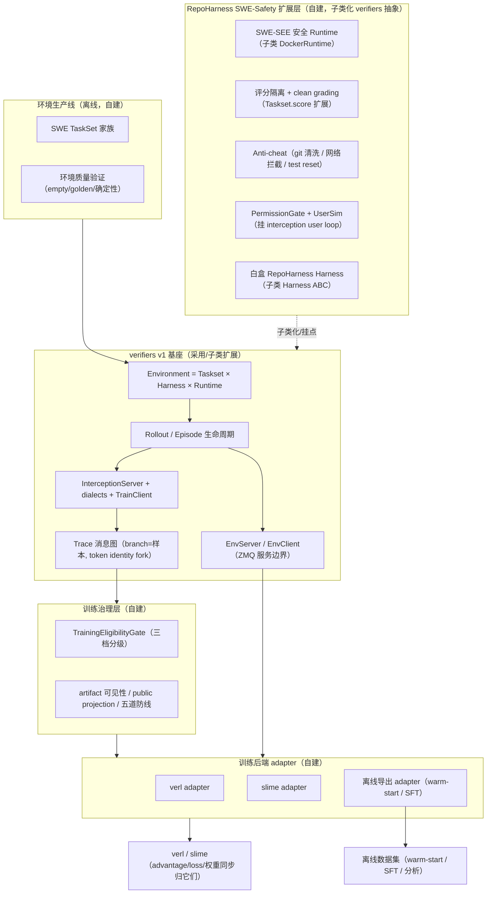

# 设计文档 2：基于 verifiers v1 的 RepoHarness 新架构设计

本文是 RepoHarness 的新主设计文档。它替代 `repo_harness_repositioning_after_polar.md` 成为架构主线；后者降级为"设计原则与硬边界来源"，其仍然成立的硬边界（尤其第 16 章）由本文显式继承引用，不再重复维护。

本文的目标不是敲定实现细节，而是把当前所有参考资料梳理清楚，说明**接下来要设计什么**，作为后续讨论定案的底稿。因此每一节都尽量写清楚三件事：需求是什么、现成参考做到什么程度、还有哪些开放选项留待决策。

---

## 0. 一句话结论

经过对 `reference/verifiers` v1 版本的逐源码盘点，可以确认一个改变全局的事实：

```text
PrimeIntellect verifiers v1（本地已是最新，约 15,436 行）已经实现了
"重定位文档"从零设计的大部分核心：可组合环境对象模型、token 保真的 Trace
消息图、模型边界拦截捕获、训练服务边界、以及包含完整 bash 工具的内置 harness。
```

这意味着 RepoHarness 不应该继续从零造这套基础设施，而应该：

```text
以 verifiers v1 为基座框架，
把工程精力集中在 verifiers 故意留薄、而恰好是 RepoHarness 差异化价值的
"SWE 安全与训练治理层"上：
安全沙箱、评分隔离、反作弊、SWE 任务生产、白盒 harness、
训练资格治理、以及 verl / slime / 离线导出三类训练后端 adapter。
```

同时确认一个次要但重要的事实：旧 RepoHarness 代码（`src/repo_harness`）的主要价值不在代码本身，而在它沉淀的**契约与不变量**（五道安全防线语义、policy_loss 守门条件、inspector fail-closed 范式、file mutation 原子语义）。这些契约恰好全部落在 verifiers 的能力缺口里，因此采用"绿地重写 + 契约继承"是合理的。

---


## 1. 背景与前提


### 1.1 定位演变

RepoHarness 的定位已经从"一个接入 verl 异步 RL 的白盒 SWE harness"，演进为"面向交互式软件工程智能体强化学习的可组合环境与 rollout 基础设施"。这个演变在重定位文档里已经论证过，本文不再重复，只承接结论。

### 1.2 旧实现的两个真实问题

必须诚实记录旧实现的两个已知问题，因为它们直接影响"是否重写"的判断：

1. **工具面能力不足**。旧 harness 没有给模型完整的 shell / bash 工具，主要依赖极窄的 `execute_bash`、结构化文件工具和无参数 `run_tests`。这会把模型训练成"评测 DSL 专家"而不是真实 SWE agent。这一点在 `bash_tool_advice.md` 里已经被微软 MAI-Thinking-1 报告佐证（真实 SWE agent 的工具面就是 `bash(command:string)` + string replace editor）。
2. **白盒单体绑定 verl**。旧实现是一个白盒 harness 直接接入 verl，环境语义、轨迹投影、训练桥接缠在一起，难以支持黑盒 harness、多训练后端、离线数据生成和评测复用。


### 1.3 verifiers v1 发现的意义

在探索参考库时发现：**verifiers v1 已经把上述基础设施做出来了，而且做得比重定位文档的草案更成熟**。最关键的是它的内置 `default` harness（bash + 默认 edit + 可选 search）直接解决了旧实现的第一个问题——它给模型的就是完整 shell 工具（详见第 3 章）。

一个必须纠正的前提性错误：`reference/verifiers/AGENTS.md` 描述的是 verifiers 的旧版结构（`runtime.py` / `sandbox.py` / `user.py` / `artifact.py` / `config.py`、`packages/tasksets`、`packages/harnesses`），这些文件在当前工作树里**已全部删除**。当前正确的导览是 `reference/verifiers/CLAUDE.md` 和 `reference/verifiers/verifiers/v1/ARCHITECTURE.md`。后续阅读一律以这两份为准。

### 1.4 本文档地位

- 本文是新主设计文档。
- 重定位文档 `repo_harness_repositioning_after_polar.md` 降级为"原则与硬边界来源"。它的第 16 章硬边界（训练资格三档门槛、artifact/visibility 安全平面、token provenance 一等字段、model proxy 局限、外部 harness 集成边界、reward attribution 规则、prefix merging 与 renderer bridge 边界、backend tensor 扩展）**仍然有效**，本文在相应章节以"继承 X"的方式引用，不重复展开。
- 本文假设采用"绿地重写 + 契约继承"处置旧代码（见第 7 章）。
- 配套文档：`repo_harness_final_review_before_implementation.md`（实施前最终检查）承载 R3~R12 参考核对台账（其 §2）、slime 范围重评、实现范围 P0/P1/P2 与生产线 backlog（其 §3）、D1~D7 与 GLM-5.2 增补定案（其 §5.1/§6）。本文各节标注"2026-07-06 定案"的内容均以该文档为准据来源。

继承自重定位文档的硬边界清单（本文各节据此约束设计）：

```text
H1 训练资格三档：online_policy_loss_eligible / offline_or_sft_candidate / audit_only_or_rejected
H2 token provenance：进 policy loss 的 token 必须来自行为策略真实采样
H3 logprob 对齐：缺逐 token logprob 不进 formal online RL
H4 loss mask 语义：只覆盖模型采样且角色允许训练的 token；资格走 batch 准入而非清零 mask
H5 hidden verifier 隔离 + clean grading replay
H6 反作弊：git 清洗 / 网络拦截 / test reset
H7 环境质量验证：empty patch 必失败 / golden patch 必通过 / 确定性
H8 reward attribution：session-level reward 不盲目广播到 per-request trace
H9 artifact 可见性：public projection 扫描、runtime-private 隔离、opaque ref
H10 训练后端边界：advantage / 归一化 / 权重同步归训练框架，RepoHarness 记录握手事实
```

### 1.5 当前项目状态与旧阶段线处置（2026-07 定案）

截至本文定稿，仓库的真实状态是：Stage 16G.2C 已完成并通过 inspector 验收；16G.3 停留在设计阶段未实施；`stage17b_real_data_freeze_allowed` / `stage20_warm_start_data_generation_allowed` / `stage21_formal_rl_allowed` 三个闸门均为 false。

据此做三条显式处置声明，避免后续接手线程按旧文档（尤其 AGENTS.md 的"当前任务是 16G.3"指引）继续推进：

1. **16G.3 ~ 16G.6 阶段线由本设计取代，不再执行。** 16G.3 要解决的"工具面不足"问题（bash 三件套 / SEE 等价底座）已被 verifiers 内置 `default` harness（bash + edit）与本文 5.1 的安全 Runtime 直接覆盖。AGENTS.md 与 README 的进度章节在 S0 启动时同步改写。
2. **17B / 20 / 21 闸门在新架构下按 S0~S5 重建，不做旧闸门到新阶段的逐项映射。** Stage 20（warm-start 数据生成）的语义由 5.7 新增的离线导出 adapter 承接；闸门重建的细化设计不在本文范围。
3. **evaluation worktree 的迁移显式搁置。** 方向先记一句：verifiers 的 EvalClient / eval 模式天然就是评测消费面，新架构下"评测 = 同一 Environment + EvalClient，训练 = 同一 Environment + TrainClient"，两个 worktree 长期不再需要各自维护一份 harness 语义。细化设计在新架构最小闭环（S1）跑通后单独一轮进行。

---


## 2. 参考体系角色地图

当前 `reference/` 下仓库很多，容易混淆。按在新架构中的角色归类如下。


| 参考                                         | 在新架构中的角色                     | 关键用途                                                                                                                                            |
| ------------------------------------------ | ---------------------------- | ----------------------------------------------------------------------------------------------------------------------------------------------- |
| **verifiers v1**                           | **基座框架**                     | 对象模型、Trace 图、interception、EnvServer、内置 harness、错误归因。直接采用 / 子类扩展                                                                                 |
| **prime-rl**                               | 官方训练后端蓝本                     | 它就是 verifiers 的一个 EnvClient。它的 `algo/`（advantage）、`trainer/rl/loss.py`（loss 三分量）、`watcher.py`（权重同步/staleness）是我们写 verl/slime adapter 的高质量蓝本     |
| **verl**                                   | 目标训练后端之一                     | HybridFlow / AgentLoop / FullyAsync；`TokenOutput` 已带 token_ids+log_probs                                                                        |
| **slime**                                  | 目标训练后端之一 + agentic rollout substrate | SGLang-native rollout；`custom_generate` 返回 Sample；天然 token-in/out。2026-07 快进到 `e848052a` 后新增 `slime/agent/`（Claude Code/Codex 黑盒 harness、Anthropic/OpenAI adapter、E2B sandbox 契约、TrajectoryManager token 保真轨迹树）与 `examples/coding_agent_rl` 端到端 SWE RL 示例。范围重评与项目必要性判断见 2.1 |
| **Polar / ProRL-Agent-Server**             | 黑盒训练概念印证                     | 它的核心价值（模型 API 边界捕获黑盒 harness）已被 verifiers 的 interception 覆盖。剩余可借鉴：gateway 三段隔离（INIT/RUN/POSTRUN）、prefix merging 的实证收益数据、evaluator prewarm       |
| **Claude Code / codex 源码**                 | 白盒 harness 写法参考              | 工具编排、权限/审批、事件审计、受控 patch。用于设计 RepoHarness 自己的白盒 harness                                                                                         |
| **ROCK**                                   | 沙箱服务化 + 黑盒 agent launcher 参考 | Runtime 契约的重量级生产实现；`RockAgentConfig` 配置化装 Claude Code/Cursor/qwen-code/SWE-agent；沙箱内 model proxy record/replay。补 verifiers Runtime 在"真容器编排"上的薄处 |
| **renderers**                              | token fidelity 专项            | 已经是 verifiers 的**核心依赖**（`renderers>=0.1.8`），TrainClient 直接调它。不需要自研                                                                              |
| **mini-swe-agent**                         | 极简 baseline                  | 对照"最小可用 agent"边界。verifiers 已内置 `mini_swe_agent` harness                                                                                         |
| **terminal-bench-pro**                     | 任务包格式与来源                     | 400 题 8 领域终端任务，公开/私有拆分、task.toml metadata。环境生产参考                                                                                                |
| **MAI-Thinking-1 / Nemotron-3 / Polar 论文** | 安全/环境生产/反作弊实践依据              | SEE 沙箱、time-traveled repo、双通道防泄漏、test reset、empty/golden patch 验证、失败归因                                                                          |


一句话概括这张地图：**verifiers 是骨架，prime-rl 教我们怎么接训练后端，ROCK 教我们怎么把沙箱做成服务并装黑盒 agent，Claude Code/codex 教我们怎么写白盒 harness，论文给安全和环境生产的实践底线。**

### 2.1 slime 范围扩张的重新评估与项目必要性判断（2026-07 定案）

slime 已快进到 `e848052a`。事实盘点：`slime/agent/` 新增了一个完整的 agentic rollout substrate——`harness/`（Claude Code / Codex 黑盒 CLI 生命周期：装 CLI、写配置、detached 启动、轮询完成标记）、`adapters/`（Anthropic / OpenAI 双协议 adapter，逐轮 tokenize 消息历史、记录 prompt/output token 快照、模型生成 token loss_mask=1、模板/observation token mask=0）、`sandbox.py`（最小 Sandbox Protocol + E2B 后端，每样本 fresh sandbox）、`trajectory.py`（TrajectoryManager：per-session 消息树，prompt 前缀分叉处理 sub-agent 派发与 auto-compaction，容忍 TITO 重分词漂移，叶链线性化为 loss-masked Sample）。`examples/coding_agent_rl` 用这些组件跑通了 Qwen3.6-35B-A3B 8 节点端到端 SWE RL，其 `swe.py` 还包含 fresh 第二沙箱评分（README 自述 "no test-cheating"）。

必须诚实承认：**"把 Claude Code 跑在沙箱里、产出 token 保真训练样本、外加干净评分"这条中段链路，工业界已有第一方实现，不再是本项目的差异化。**

但以下差异化仍然成立，且恰好是本文第 4/5 章的自建层（逐项对照 slime 源码确认）：

```text
slime agent substrate 没有的东西：
1. 任务/环境所有权：swe.py 是 examples/ 下的任务胶水，不是框架。无 Task 冻结
   契约、无环境包版本化/digest、无环境生产线（empty/golden patch 验证、确定性、
   任务质量门槛）。数据集以"预构建 JSONL + 预构建镜像"形式到达，
   生产过程完全在 slime 范围之外。
2. 训练后端解耦：整个 substrate 是 slime-native（TurnRecord 绑 sglang /generate
   快照、产出 slime Sample）。无服务边界、无多后端、无评测复用
   （评测 = 再跑一遍训练路径）。
3. 训练治理：无资格分级、无 artifact 可见性 / 公开投影 / 脱敏、无 fail-closed
   inspector。loss mask 正确性是代码行为，不是可审计契约。
4. anti-cheat 纵深：fresh 沙箱评分只覆盖评分期篡改；无 git 历史清洗、无网络
   拦截策略（沙箱反而必须开网络回连 adapter）、无 monkeypatch 检测、
   无环境级 fail-closed。
5. 权限/用户维度：Claude Code 以 --permission-mode bypassPermissions 运行，
   权限、审批、用户模拟维度为零；也没有白盒 harness。
```

**定案**：项目继续推进，但价值主张重心从"搭 rollout 捕获机器"（已被 slime / verifiers 双双商品化）明确转移到**"工业训练后端普遍缺失的环境与训练治理层"**——环境生产线、评分隔离语义、anti-cheat、训练资格治理、多后端解耦。verifiers 基座决策不变（slime substrate 不提供环境组合、服务边界与评测复用）。slime 的扩张对本项目是净利好：首个在线训练跑通的风险大幅下降，因为 slime 官方示例证明了这条路端到端可行，可直接作为对照基线。

对第 8 章决策 2 的影响：slime 后端现在有两条接入形态，S0 一并评估：

```text
形态 A（verifiers 中心，默认）：
  verifiers EnvServer / Environment + interception 产出 Trace，
  adapter 把 Trace.branches 投影成 slime Sample；推理走 vLLM 协议 shim。
  环境、评测、治理全在 verifiers 侧，多后端与评测复用成立。

形态 B（slime 原生，务实退路）：
  slime custom_generate 直调 RepoHarness 的 taskset / 评分 / 治理库，
  模型边界用 slime 自己的 AnthropicAdapter / TrajectoryManager。
  若 S0 发现协议 shim 无损透传受阻，第一条在线训练可以走 B 先跑通，
  代价是该路径绑定 slime、评测不复用。
  前提约束：治理层组件（SWEGradingManager / EligibilityGate / AntiCheat /
  环境生产线）必须保持 backend-neutral 设计，两条形态都能挂，
  否则 B 退路不成立。
```

---


## 3. verifiers v1 能力对照总表

这是本文核心之一。按"已完成可直接采用 / 部分完成需扩展 / 缺失需自建"三类逐项列出，每项标注证据文件（路径相对 `reference/verifiers/verifiers/v1/`）。

### 3.1 已完成，可直接采用


| 能力                      | verifiers 实现                                                                                            | 证据                                                                              |
| ----------------------- | ------------------------------------------------------------------------------------------------------- | ------------------------------------------------------------------------------- |
| 可组合对象模型                 | Taskset(数据+评分) / Harness(驱动模型) / Runtime(在哪跑) / Environment(组装) / Rollout(单轨迹) / Episode(一题 N 条+组评分)    | `taskset.py`、`harness.py`、`runtimes/base.py`、`env.py`、`rollout.py`、`episode.py` |
| Task 冻结契约               | 冻结 pydantic，`extra="forbid"`；子类加 typed 字段                                                               | `task.py:51`                                                                    |
| **token 保真 Trace 消息图**  | 每条 `Branch`(root→leaf)=一个训练样本；沿路径拼 `token_ids` 精确复原 `prompt_ids+completion_ids`                         | `graph.py`、`trace.py:73`                                                        |
| **token identity fork** | `commit` 把 message-hash 前缀收紧到 token 级，retokenization drift（BPE/丢 think/改写 tool call）处分叉带真实 token，杜绝静默污染 | `graph.py:460-475`                                                              |
| 模型边界拦截                  | InterceptionServer 按 bearer secret 路由到 RolloutSession；harness 只把 SDK 指向 localhost                       | `interception/server.py`                                                        |
| 多 wire dialect          | ChatDialect / ResponsesDialect / AnthropicDialect                                                       | `dialects/__init__.py:19`                                                       |
| eval vs train 客户端       | EvalClient 纯中继（provider token，不可训）；TrainClient 用 renderers 客户端分词 + 调推理端点拿精确 token_ids+logprobs（可训）      | `clients/eval.py`、`clients/train.py:96`                                         |
| RolloutLimits 预算        | max_turns / max_input_tokens / max_output_tokens / max_total_tokens，框架级对任意 harness 生效                   | `interception/server.py:88`                                                     |
| 训练服务边界                  | EnvServer(ZMQ ROUTER+msgpack)：health/info/run_rollout/run_group；EnvServerPool 弹性扩容                      | `serve/server.py`、`serve/pool.py`                                               |
| 内置 shell harness        | `default`（完整 `bash -c` + 默认开的 edit 字符串替换 + 可选 search）、`null`（纯 chat 无本地工具）                        | `harnesses/default/harness.py`、`harnesses/null/harness.py`（旧 `bash`/`bash_edit` 已于 `5885ab9c` 前后合并至此） |
| 黑盒 CLI harness 接入       | codex / mini_swe_agent / kimi_code / rlm / terminus_2，经 argv/env 注入 endpoint+secret                     | `harnesses/codex/harness.py:78` 等                                               |
| 错误归因                    | 扁平 RolloutError 层级，每故障归因到唯一边界，"bad rollout is data, not a crash"                                        | `errors.py`                                                                     |
| 整轨迹重试                   | `run_with_retry` 按 trace 末端错误类型重试                                                                       | `retries.py`                                                                    |
| 装饰器评分                   | `@reward` / `@metric` / `@group_reward` / `@stop` / `@tool`                                             | `decorators.py`                                                                 |
| judge 隔离计数              | judge 调用记 `extra_usage`，不污染 agent token 计数                                                              | `judge.py`、`trace.py`                                                           |
| renderers 集成            | 客户端分词、bridge_to_next_turn 避免重渲染历史                                                                       | `clients/train.py:277`（renderers 为核心依赖）                                         |
| v0 兼容桥                  | LegacyEnvServer 让旧 env 不改照跑                                                                             | `legacy.py`                                                                     |


**这一栏的含义**：这些是 RepoHarness 不该再造的东西。特别是 Trace 图 + token identity fork，它一个结构就解决了重定位文档纠结的三件事（per_request vs prefix_merging 二分、prefix preservation check、CompletionRecord/TrainTrace/TrainingView 三套映射）——采用它可以让新架构比重定位文档草案更薄更准。

### 3.2 部分完成，需扩展


| 能力                      | verifiers 现状                                                                                       | 需要扩展什么                                                                                  |
| ----------------------- | -------------------------------------------------------------------------------------------------- | --------------------------------------------------------------------------------------- |
| user simulator          | `User.respond` 单 hook，由 interception server 在模型回合间驱动多轮；`prompt=None` 可开场                           | 深度不足：并发 last-write-wins、仅 per-rollout 放置。RepoHarness 要做隐藏约束、审批口径、用户负担建模（见 5.5）          |
| validate hook           | `Taskset.validate(task,runtime)->bool` 模型无关 gold 检查；lean taskset 有实现                               | 缺 SWE 的 empty-patch/golden-patch 差分框架（见 5.4）                                            |
| docker runtime          | 能起容器、限 cpu/memory/gpu                                                                              | 安全严重不足：`--network host` + root + 无 seccomp/cap-drop/read-only/pids-limit（见 5.1）         |
| harbor taskset（最接近 SWE） | 下载 Terminal-Bench 数据；把 `tests/` 打 tar 进 runtime，`bash test.sh` **在 agent 编辑过的同一容器里跑**，读 reward.txt | 无评分隔离、无 clean checkout、无 test reset、无 hidden test 隔离、无 anti-cheat（见 5.2/5.3，harbor 作反例） |


### 3.3 缺失，RepoHarness 自建（差异化价值区）

这十项是 RepoHarness 真正要建的，也是它区别于"又一个环境框架"的地方。全部对应第 5 章的待设计清单。


| 缺口                     | verifiers 现状证据                                                                   | 对应本文小节 |
| ---------------------- | -------------------------------------------------------------------------------- | ------ |
| 安全沙箱策略                 | docker `--network host`+root，`runtimes/` 对 seccomp/cap-drop/--user/read-only 零命中 | 5.1    |
| hidden verifier 隔离     | 评分与 agent 同 runtime（harbor test.sh、lean 编译）                                      | 5.2    |
| clean grading checkout | 无 clean checkout / test reset                                                    | 5.2    |
| anti-cheat             | 无 git 清洗、无网络拦截（docker 反而 host 网络）、无 test reset；仅 lean 签名守卫（taskset 级单例）          | 5.3    |
| 环境质量验证                 | 有 validate hook 但无 empty/golden patch 差分框架                                       | 5.4    |
| permission/approval    | 框架级无；`disabled_tools` 仅透传给黑盒 CLI 自己的权限系统                                         | 5.5    |
| 训练资格分级                 | 有 token provenance 保护（token identity fork），但无一等 eligibility 分级字段                 | 5.6    |
| artifact 可见性/脱敏        | 有 info/state/extra_usage 分离，但无 public/private 投影、无 secret 脱敏                     | 5.6    |
| SWE 任务生产线              | 无 SWE-bench 类 taskset，无环境生产流水线                                                   | 5.4    |
| 多后端 adapter            | 仅 prime-rl 一个 EnvClient 消费者，无 verl/slime adapter                                 | 5.7    |


---


## 4. 新目标架构


### 4.1 核心公式

```text
RepoHarness =
    verifiers v1 基座
  + SWE-Safety 扩展层（安全沙箱 / 评分隔离 / 反作弊 / 权限）
  + 训练治理层（训练资格分级 / artifact 可见性）
  + 训练后端 adapter 层（verl / slime / 离线导出）
  + 环境生产线（SWE taskset / 质量验证）
```

RepoHarness 不再是"一个 harness"，也不是"整个环境框架"。它是**建立在 verifiers 之上的、面向 SWE agent RL 的安全与训练治理层 + 环境生产线**。

### 4.2 双拓扑在 verifiers 模式下的形态

重定位文档提出过"trainer_native / service_driven 双拓扑"。在 verifiers 模式下，这个区分变得更清晰，因为 verifiers 已经把关键事实定死了：**生成永远发生在环境侧**——harness 在 rollout 里调用一个推理端点，这个端点由训练框架提供。所以：

```text
两种拓扑的真正区别只是"谁持有 EnvServer 进程和推理端点"：

service_driven（verifiers 原生形态）：
  RepoHarness 起 EnvServer（加载 Environment + tasks）
  训练框架作为 EnvClient，按 task_idx 请求 run_rollout / run_group
  训练框架提供推理端点（其 base_url 通过 ClientConfig 传进环境）
  环境返回 Trace；训练框架消费 Trace.branches

trainer_native（in-process 形态）：
  训练框架进程内直接构造 Environment 并调 Episode.run()
  或在同机起 EnvClient
  推理端点是训练框架自己的 rollout engine
```

关键洞察：**两种拓扑共享完全相同的核心（Environment/Trace/interception/eligibility），区别只在进程边界。** 这比重定位文档"两套平面"的表述简单得多——因为 verifiers 的 EnvServer/EnvClient 已经把服务边界做成了一个窄接口（3 个方法），in-process 只是不走 ZMQ 而已。

### 4.3 架构图




---


## 5. RepoHarness 自建层——待设计清单

本章是核心之二。每节格式统一：**需求 / verifiers 现状与扩展点 / 继承的旧契约 / 参考资料 / 开放选项**。这里只说"要设计什么"，不锁定"怎么做"。

### 5.1 SWE-SEE 安全 Runtime

**需求**：每个 episode 一个隔离容器，默认断网、非 root、资源受限、权限最小化、用毕销毁。这是所有 SWE RL 训练的安全地基（MAI 的 SEE、Polar 的 per-session container 都在这一层）。

**verifiers 现状与扩展点**：`runtimes/docker.py:98` 起容器用的是 `docker run --detach --network host ... sleep infinity`——**网络完全不隔离、默认 root、无 seccomp/cap-drop/read-only/pids-limit**。Runtime 是抽象契约（`runtimes/base.py`），扩展点清晰：子类化 `DockerRuntime` 覆盖容器启动参数即可，不必碰核心。

**继承的旧契约**：无直接旧代码，但继承 H5/H6 的隔离要求；旧 `tasks/command_policy.py`（Stage 16A 安全最小命令策略）的威胁模型判断可作为参考。

**参考资料**：MAI SEE（每任务 fresh container、默认断网、缓存代理+域名白名单）；ROCK `DockerDeployment`（真实端口映射、资源限制、rocklet 启动——但注意 ROCK 默认可能带 `--privileged`，是反例）；Prime/Modal runtime 的 `network_access=False` / `vm=True` 选项。

**定案（2026-07-06）**：第一版走 (a) 子类化 verifiers DockerRuntime 加安全参数，但接口按"安全分档"设计（参考 DeepSeek DSec 的四执行基座统一 SDK：容器 / microVM 分档切换只改参数），后续可加 micro-VM 档而不改调用方。网络机制定案：**依赖预装进镜像为主 + 白名单透明出网代理为辅**（参考 Composer 2 Anygress：root CA 注入 + TCP 层透明重定向，防 agent 经环境变量察觉绕过；ROCK Rocklet 的 per-sandbox egress policy 同理）。Runtime 审计能力分两档：P1 做**轻量命令事件日志 + provenance**（它同时是谎报成功检测和在线 anti-cheat 拦截的证据底座，见 5.3），完整确定性重放（fast-forward、全量重放，DSec 形态）放 P2。

### 5.2 评分隔离与 clean grading

**需求**：hidden verifier / gold patch / hidden tests 绝不能进 rollout workspace 或模型可见上下文；最终评分在干净 checkout 里重放 cleaned final patch，而不是信任 agent 编辑过的工作区；评分前 reset 被 agent 改过的测试文件。

**verifiers 现状与扩展点**：harbor taskset 是**反例**——它把 `tests/` 打 tar 写进 agent 的同一 runtime、`bash test.sh` 在同容器里跑（`tasksets/harbor/taskset.py:304`），agent 有完整写权限可篡改。扩展点：`Taskset.score(trace, runtime)` 和 `Taskset.finalize` 是 hook，可以在这里起独立 grading runtime。但 verifiers 的 Rollout 生命周期默认只有一个 runtime，可能需要在 Taskset 层自己管理第二个评分 runtime。

**继承的旧契约**：重定位文档的 `GradingWorkspaceSpec`（clean_checkout_source_digest / patch_replay_policy / hidden_test_injection_policy=grader_only）和 `ScoringSandboxSpec`（hidden_asset_mount_policy / scoring_runtime_prewarm）。继承 H5。

**参考资料**：MAI（grading 前 reset tests、hidden test changes 仅评分时 apply、同容器但 reset）；Polar evaluator `refresh_runtime=true`（fresh eval runtime + patch replay）；SWE-bench 官方评分协议（F2P/P2P）。

**定案（2026-07，取代原开放选项 a/b）**：第一阶段采用**同生命周期评分 + 外层 SWEGradingManager**，不因 prewarm 预期 fork verifiers。

```text
1. 评分位置：Taskset.score(trace, runtime) 内完成，但评分动作全部委托给
   进程级单例 SWEGradingManager。grading runtime 经 verifiers 自己的
   Runtime 契约（make_runtime）创建，保持 sandbox backend
   （Docker / Prime / Modal / 未来 ROCK）无关。
2. manager 归属：与 5.6 的 TrainingEligibilityGate 同住 RepoHarness 的
   Episode 外层 wrapper。它不是为 prewarm 单独发明的层——治理层（5.6）
   已经要求这个 wrapper 存在，grading / prewarm / gate / artifact writer
   共用它。
3. 最小接口：prepare(task_id, trace_id)（可选预热，默认关闭）、
   grade(trace_id, cleaned_patch) -> GradingReport、gc(trace_id | ttl)。
4. 计时埋点从 S1 起强制：artifact 必须记录 grading_prep_seconds /
   grading_test_seconds / agent_seconds，外加 env_reset_seconds /
   image_pull_seconds（rollout 侧与评分侧都记）。prewarm 是否值得做、
   什么时候做，由这些数字驱动，不由预期驱动——prewarm 只能隐藏"准备"
   （起容器 / checkout 物化 / 依赖），永远藏不掉 test run 本身，
   收益上限就是 prep 占比。RollArt 生产实测（final review §2.1-M3）表明
   长尾主成本大概率在容器冷启动 / env.reset（占失败迭代 78% 时间）
   而非 test run，埋点要能验证这一点。
5. prewarm 的第一优化方向不是运行时预热，而是环境生产期（5.4）的
   预烤评分镜像 + prepared clean checkout snapshot（镜像层或 volume，
   copy-on-write clone 给每个 rollout）。prep 成本压到秒级后，
   运行时 prewarm 大概率不再需要。
```

**SWEGradingManager 必须处理的工程坑**（实施时逐条对照，验收时逐条检查）：

```text
P1  泄漏回收与故障域隔离：manager 创建的 grading runtime 不在 verifiers
    Rollout 的 finally 清理范围内。必须按 trace_id 记账 + TTL GC；进程
    启动时按容器 label / name 前缀清扫孤儿容器。故障域语义（RollArt §8）：
    评分沙箱崩溃不得连带失败 rollout（反之亦然）；崩溃的评分
    evict-and-reschedule 到健康节点重评，trace 不丢。
P2  资源翻倍：每题 16 rollouts 时，setup 期 prepare 会让并发容器数在
    agent 运行高峰恰好翻倍。prepare 必须 fire-and-forget + 有界信号量；
    prewarm 默认关闭，就是为了先量出 P4/埋点数字再决定这笔开销。
P3  超时账目：grade() 仍在 Rollout.scoring_timeout 内执行。策略：
    scoring_timeout 设宽松上限，manager 内部执行更严的分段 timeout
    （patch apply 与 test run 分开计），超时原因写进 GradingReport。
P4  失败归因三分与组修复信号：grading_failure_category 必须区分
    infra_failure（容器/镜像/网络故障）、patch_apply_failed、tests_failed。
    关键规则：infra_failure 绝不能落成 reward=0——那会给 GRPO 组注入
    假负样本；它应让该轨迹 eligibility 降级（audit_only 或重试）、
    reward 记缺失。该字段落在 EligibilityReport sidecar（5.6），
    不依赖改造 verifiers 的 RolloutError 分类。降级不是终点：降级信号
    必须在 group 组装前对训练后端可见，供后端做组修复（GLM-5 规则：
    有效样本 > 半组则 pad、否则整组丢弃；或 on-the-fly 从同初始态重采样）。
    组修复策略本身条件化——仅当后端声明组式算法（GRPO 类）时激活；
    PPO 单 rollout 形态下降级即单样本剔除（算法无关原则，见 5.7）。
P5  prepare/grade 竞态：grade() 到达时 prepare() 可能未完成或已失败。
    grade 必须能降级为冷启动路径（inline 重新准备），不能因预热缺失失败。
P6  共享 snapshot 只读：per-task prepared clean checkout 必须不可变 /
    copy-on-write。任何一次评分都不得改写共享底座，否则后续 rollout 会在
    被污染的 checkout 上评分——静默假信号，比崩溃更危险。
P7  接口 backend-neutral，实现先 per-worker：EnvServerPool 是多 worker
    进程池，第一版每 worker 一个 manager 实例 + per-worker 信号量 +
    全局容器 label 预算检查兜底。但接口必须按"可替换为独立弹性评分池 /
    serverless 后端"设计（RollArt 实证：reward 计算 stateless + bursty，
    同驻是资源争抢根因，独立故障域后利用率 6%→88%、单步减半）。
    跨进程统一池化 / 独立评分服务留到 S5。
P8  重试互动：verifiers run_with_retry 重试整条 rollout（新 trace_id）。
    旧 trace 的 prepared runtime 靠 P1 的 TTL 回收，不做跨 trace 复用。
P9  评分环境同等隔离：grading runtime 必须套用与 5.1 相同的断网 / 非 root
    规则，hidden test 只注入 grading runtime；若启用 prewarm，继承重定位
    文档的 prewarm 防泄漏约束（hidden verifier 的路径、文件名、测试数量、
    失败详情不得经任何 prewarm 通道进入 rollout 侧）。
P10 镜像并发拉取分档：同一评分镜像被几十个 rollout 同时首次拉取会打爆
    registry / 磁盘。第一档：评分镜像在 EnvServer 启动或节点置备时预拉取。
    多节点规模下预拉取不够（RollArt 实证），第二档：registry mirror +
    分布式镜像缓存层（留 S5）。
P11 评分队列反压：评分吞吐 < rollout 完成速率时队列会无界增长。评分
    队列必须有界（参照 RollArt SampleBuffer 的 O(α·E) 容量 + eager
    evict）；积压超阈值按策略处理（阻塞新 rollout 准入 / defer 评分 /
    降级 audit_only），反压事件写入 EligibilityReport。
```

原开放选项 (c)（是否所有 SWE 任务强制 clean checkout）由继承的 H5 / 重定位 §16.8 回答：按 `patch_validation_applicability` 分类，SWE patch 型任务默认 clean checkout，非 patch 型任务显式声明 not_applicable 及原因。

### 5.3 Anti-cheat

**需求**：阻断四类作弊——互联网搜答案、本地 git 历史找 solution commit、篡改测试（前三类为 Polar/MAI 归纳），以及**谎报成功**（deceptive success：声称完成/合规但实际未执行或伪造通过输出，Kimi K2 实践归纳）。

**verifiers 现状与扩展点**：几乎无。docker 反而是 host 网络。唯一相关是 lean taskset 的签名守卫（`tasksets/lean/taskset.py:198`，taskset 级单例）。扩展点：git 清洗放在 Taskset.setup / 环境物化阶段；网络拦截放在 5.1 的安全 Runtime；test reset 放在 5.2 的评分隔离。

**继承的旧契约**：重定位文档的 `AntiCheatSpec`（sanitize_git_history / scrub_future_refs / block_remote_git / block_github_http / reset_test_files_before_grading / detect_test_monkeypatch）。继承 H6。

**参考资料**：Nemotron SWE teacher 的双通道防泄漏（**物理删除** base commit 之后的 git 对象，连低层 recovery 都找不回 + 运行时命令过滤拦截 remote git 和 GitHub web/raw/Pages 下载）；MAI 的 time-traveled repo + LLM monitor；Qwen3-Coder-Next（RL 后期 agent 会学会用 git/network 恢复 ground truth）。

**定案（2026-07-06）**：

```text
1. git 清洗两者都要（Nemotron 双通道）：物化期 time-travel 净化 +
   运行期命令过滤，各自出报告回写 AntiCheatSpec。
2. 防线次序（纵深，从强到弱）：① 结构隔离优先——hidden verifier 资产
   根本不挂载进 rollout workspace（H5，比检测更强，GLM-5.2 需要在线拦
   截 cat .eval/secret_cases.json 正是因为其评测资产在 workspace 里）；
   ② 在线拦截——对结构上消不掉的通道（网络出口、git 残留、可疑命令），
   运行期检出即 block + 返回脱敏 dummy 观测 + rollout 继续，不中断轨迹
   （GLM-5.2 online guard：处理具体无效行为而非整轨迹拒绝，避免掐断
   rollout 导致训练不稳定）；③ 事后检测——评分期 test reset /
   monkeypatch 检测 / 谎报成功核对。
3. attempted vs executed 区分资格：被拦截的尝试 → 记 AntiCheatFinding
   + 可选 process penalty，轨迹仍可训练（agent 学到"此路不通"正是
   训练信号）；实际发生的泄漏（内容已进模型上下文）→ EligibilityGate
   降级，fail closed。
4. 检测形态：规则层在线同步（拦截必须实时）；LLM judge 意图复核异步
   后置，结果回写 finding 的 precision 字段，不阻塞 rollout。
   monkeypatch 检测与谎报成功检测第一版都用规则式。
5. 谎报成功检测不进 reward 主通道（最终 reward 唯一来源仍是 clean
   grading + verifier）：第一版做 evidence-backed claim checking——
   agent 的成功声明必须能在 5.1 命令事件日志中找到证据事件（真实跑过
   测试且 exit 0），找不到即记 finding；消费面为 SFT/warm-start 过滤、
   process reward 分量（§16.11 process-level 规则）、未来 judge 型
   reward 分量的防骗前置、审计与红队演示。
6. 泄漏面补充：会触发 bug 的测试文件必须从 agent 可见上下文排除
   （Qwen3-Coder-Next 实践）。
```

### 5.4 SWE TaskSet 家族与环境生产线

**需求**：把 SWE-bench / SWE-Gym / 真实仓库 PR 变成可执行、可评分、经质量验证的 taskset；建立离线环境生产流水线。

**verifiers 现状与扩展点**：无 SWE-bench 类 taskset（`tasksets/` 只有 harbor/lean/textarena），`environments/` 无 SWE 示例。扩展点：harbor taskset 是最好的**代码模板**（如何从数据集加载、构造 per-task image、在 runtime 里评分），照它的结构写一个隔离评分版的 SWE taskset。

**继承的旧契约**：重定位文档的 `TaskPackSpec` 和 `EnvironmentValidationReport`（empty_patch_must_fail / golden_patch_must_pass / determinism_check / verified_in_training_runtime / reward_profile_ref）。

**参考资料**：MAI 环境流水线（102M PR → 5.5% 通过验证的产出率、空 patch 必失败 + golden patch 必通过 + 确定性过滤）；terminal-bench-pro 的 task.toml metadata 格式（category/difficulty/tags/timeout/资源声明、公开私有拆分）；已有子文档 `environment_production_and_quality_pipeline_design.md`。

**定案（2026-07-06）**：第一批任务源为 **SWE-bench Verified 子集**（S0 用 5~10 个 smoke task，S1 冻结 20~50 题）；质量验证放离线生产阶段。`EnvironmentValidationReport` 在继承的三门（empty/golden/determinism）之上扩展三个字段：**gold patch 判据精化为 `F2P > 0 且 P2F = 0`**（修复有效且不引入回归，DeepSeek-V3.2 判据）；**假阳性解检测**（用已知错误 patch 验证测试套能拒——golden 能过不代表测试够强，Terminal-Bench-Pro 教训）；**非功能 verifier 检测**（过滤形同虚设不真正验证的测试，Qwen3-Coder-Next 实践）。生产线深度项（任务类型分化 reward、SWE-Test 反转、多语言日志解析、难度校准、合成任务流水线等）全部进 backlog B1~B7（见 final review §3.1），按 S1/S2 实测良率数据拉取，不进第一版。LLM rewrite 低质 problem statement 保持开放（并入 backlog 决策）。

### 5.5 白盒 RepoHarness Harness

**需求**：一个 RepoHarness 自己拥有的 harness，支持权限拦截、用户模拟、结构化审计——这是区别于黑盒 CLI 的差异化控制点。同时第一版就要解决旧实现"工具面不足"的问题。

**verifiers 现状与扩展点**：`Harness` 是 ABC（`harness.py`），扩展点非常干净——子类实现 `launch(ctx,trace,runtime,endpoint,secret,mcp_urls)`。内置 `default` harness（bash + 默认 edit）直接可用作第一版起点：bash 工具就是完整 `bash -c`，edit 默认开且 verifiers 源码注释明确"model 处理 edit 比手搓 sed/heredoc 更可靠"，直接修复旧能力缺陷。PermissionGate 和 UserSim 的挂点在 interception server 的 user loop（它在模型回合间驱动 user simulator）。注意 `5885ab9c` 起 `Taskset.setup` 签名为 `setup(task, trace, runtime)`（多了 trace 参数），并新增 config-level judges（`vf.ReferenceJudge` / `vf.RubricJudge`）——契约测试以此 commit 为准。

**继承的旧契约**：旧 `tools/file_mutation.py` 的原子语义（preflight→snapshot→apply→rollback）作为白盒 harness 结构化编辑工具的需求；旧 `tools/minimal.py` 的工具 dispatch 经验；旧 `stage16g_tool_profile.py` 的 4 档 profile + 27 能力作为 Harness 能力声明的扩展参考。

**参考资料**：Claude Code 源码（Read/Grep/Glob/Edit/Write/Bash 结构化工具分层、权限 deny/ask/allow、hook 生命周期）；codex 源码（apply_patch 受控补丁、approval/sandbox 编排、事件审计）；mini-swe-agent（极简 bash-only 对照）。

**开放选项**（重要决策点，见第 8 章）：第一版工具面是"直接用 verifiers 内置 `default` harness（bash+edit）"还是"写完整结构化工具集"。推荐前者起步（最快修复能力缺陷、最快跑通端到端），结构化工具和权限系统作为增量。

### 5.6 训练资格与 artifact 可见性层

**需求**：给每条轨迹一个可审计的训练资格分级；public projection 扫描防泄漏；把旧五道防线的语义落到新架构。

**verifiers 现状与扩展点**：有 token provenance 保护（graph.py 的 token identity fork）、info/state/extra_usage 分离，但**无一等 eligibility 分级字段、无 public/private 投影、无 secret 脱敏**。扩展点必须谨慎选择：`Trace.info` 是自由 dict，把资格字段直接塞进去会立即违反本文要继承的 inspector 范式（字段白名单严格枚举、未知字段一律拒）；子类化 Trace 加字段也不可靠——prime-rl 的 `Rollout` 继承 `vf.Trace` 后，自身扩展字段全部 `exclude=True`，不随 Trace 序列化传输，说明 Trace 的 wire 面是封闭的，改 wire schema 就等于触发 fork。

**载体与执行位置（推荐定案）**：

```text
1. 权威载体是独立的 typed sidecar artifact：EligibilityReport
   （pydantic，extra="forbid"，与 Trace 以 trace_id 同键存储）。
   不塞 Trace.info，不改 Trace 的 wire schema。
2. Trace.info 只允许写入两个白名单键作为派生视图：
   eligibility_report_ref 和 training_eligibility_class。
   inspector 必须互检派生视图与 sidecar 一致，不一致即 fail closed
   （继承重定位审核 R2 的"原始事实层 + 派生视图 + 互检"规则）。
3. TrainingEligibilityGate 是独立对象，挂在两种拓扑共享的必经位置：
   Episode / Rollout 完成之后、样本进入任何训练后端 adapter 之前的
   统一 finalize 关口。EnvServer 出站扫描只是 service_driven 拓扑的
   第二道防线，不是唯一防线。
4. 硬规则（继承重定位审核 N3）：trainer_native 进程内直接调
   Episode.run() 的路径，同样必须经过同一个 gate，并旁路写出
   （或可确定性重建）同等语义的 artifact。任何绕过 gate 直接把
   branch 交给训练后端的实现路径都视为违规。
```

**继承的旧契约**（这是旧代码价值最集中的地方）：

- 旧 `rl/visibility.py` 的 `FORBIDDEN_FIELD_MARKERS`（L4 出站扫描）→ public projection 扫描需求
- 旧 `evaluation/episode_projection.py` 的 `_scan_public_projection_for_leaks`（L5）+ policy_loss 守门员五处互检 → eligibility gate 的 fail-closed 范式
- 旧 `rl/episode.py` 的 `EpisodeVisibilityPolicy`（model_visible/trainer_tensor/audit_only/forbidden 五类字段分层）→ artifact 投影契约
- 旧 `rl/training_view.py` 的 `validate_formal_sample_token_provenance`（逐 span 比对 token）→ 校验语义保留为验收标准（实现已被 Trace 图取代）
- 继承 H1/H2/H3/H4/H8/H9

**参考资料**：重定位文档 §16.1（三档门槛）、§16.2（安全平面）、§16.11（reward attribution）；旧 AGENTS.md 的五道防线 L1-L5 描述。

**开放选项**：gate 形态已定案为独立对象（见上"载体与执行位置"），剩余开放的只是五道防线的落位细节（L1 schema→pydantic 已有、L2/L3 路径黑名单→安全 Runtime、L4→统一 gate 关口 + EnvServer 出站扫描作为第二道防线、L5→public projection）。

**补充的数据有效性不变量（2026-07-06 定案）**：

```text
1. 抢占/故障恢复必须从持久化 token 续解，不得从头重生——从头重生在
   数学上引入长度偏置（短回复更易在中断中"存活"，DeepSeek-V4 §5.2.3）。
   执行归训练后端（H10），但 gate 应校验恢复过的轨迹带有续解标记。
2. 多 agent 远期规则（引入并行子 agent 时生效，当前不实现）：按 PARL
   原则，子 agent 冻结、其轨迹排除出优化目标，只训 orchestrator——
   即 H4 loss mask 语义在多 agent 场景的延伸（Kimi K2.5）。
```

### 5.7 训练后端 adapter（verl / slime / 离线导出）

**需求**：把 verifiers Trace 接到 verl、slime 和离线导出（warm-start / SFT）三类后端，advantage/loss/权重同步留在训练框架。

**verifiers 现状与扩展点**：只有 prime-rl 一个消费者，但接口极窄——EnvClient 三方法（info/run_rollout/run_group）+ Trace over ZMQ。**核实结论**：verl 和 slime 都天然满足关键前提（token-in/out 推理端点）：

- verl 的 `TokenOutput`（`workers/rollout/replica.py:39`）已带 `token_ids` + `log_probs` + `routed_experts`，`LLMServer.generate` 走 token-in/out。
- slime 的 SGLang `/generate` 返回 `output_token_logprobs`（token id + logprob），天然满足。
- **一个必须纠正的耦合定位**：wire 协议耦合不在 prime-rl 侧，而在 verifiers 核心自身。`clients/train.py:181` 的 TrainClient 就是"渲染 prompt token 并调用 vLLM `/inference/v1/generate` 引擎"的客户端；且 `clients/config.py:86-88` 的 `ClientConfig` 是封闭 discriminated union（仅 `eval | train` 两型），`resolve_client`（`clients/config.py:115`）按 isinstance 分派。因此"为 slime/verl 各写一个 client"不是子类化扩展点——注册新 client 类型必须改 core，直接触发 fork。slime 的 SGLang `/generate` 与 vLLM `/inference/v1/generate` 只在语义层（token-in/out、逐 token logprob）等价，wire 层的请求/响应 schema 并不相同。

**接入方式（推荐定案）**：不改 verifiers core、不为各后端写新 client，而是在训练框架侧提供一个**协议 shim**——把 vLLM `/inference/v1/generate` 请求翻译成目标引擎原生接口（SGLang `/generate` 或 verl rollout replica 端点）的轻量 HTTP 适配服务，TrainClient 只需把 base_url 指向 shim。硬要求：shim 必须逐 token 无损透传 token ids 与 logprobs，不做任何重新 tokenize。只有当 S0 验证发现 shim 无法无损透传（例如目标引擎不回传 prompt token ids）时，才考虑 fork 后注册新 client 类型。

**MoE 透传前提与形态取舍（2026-07-06 定案，D3）**：训练目标定为 MoE 模型，RepoHarness 必须支持 MoE。slime 原生路径已逐项源码核实全覆盖：`Sample.rollout_routed_experts`（utils/types.py:126，从 SGLang meta_info 解码）、`rollout_log_probs`（types.py:121）、top-p mask 重放（megatron_utils/loss.py:35-47 的 `rollout_top_p_token_ids/offsets`）、训推失配校正（examples/train_infer_mismatch_helper）。因此 V4 的残余问题是：**routing / top-p tape 能否穿过所选接入形态**——形态 B（custom_generate 直调）天然成立；形态 A（TrainClient + vLLM 协议 shim）需要 shim 与 Trace 全程携带这些张量，而 vLLM `/inference/v1/generate` wire 协议没有 top-p ids 槽位。**MoE 训练显著加分形态 B，S0 评估两形态时按此加权。** 另外（M4）：rollout logprob 必须标注 `logprob_source`（引擎/版本/精度）——透传无损是必要非充分，同权重下推理引擎与训练引擎的分布仍系统性不同（ROME 实证），失配的 IS/TIS 校正归训练后端（H10），RepoHarness 只记录 serving 事实。

**算法无关原则（2026-07-06 定案，源自 GLM-5.2）**：RepoHarness 不得假设"一个 prompt 固定 n 条 rollout + GRPO 组内比较"。GLM-5.2 在长程任务上已因 compaction 导致的 trace 数量/长度失衡改用 critic-based PPO 从单条 rollout 学习。落实方式：verifiers 的 `run_rollout`（单条）与 `run_group`（n 条）都是一等路径，`num_samples=1` 的 PPO 形态必须可用；组语义相关机制（P4 组修复、group_id 握手、冗余 rollout）全部条件化，仅当后端声明组式算法时激活。天然契合点：GLM-5.2"所有 compaction sub-trace 都作为可训练轨迹"正是 verifiers Trace 图的 branch 语义，本设计无需为此改动。PPO vs GRPO 的选择归实验设计文档与训练后端。

**中立投影契约（2026-07-07 定案，治理层 backend-neutral 的落地形态，回应形态 B 兼容）**：这是本节最重要的一条结构决定。治理层（EligibilityGate / projection / reward facts）**不得直接消费 verifiers Trace.branches**——否则一旦形态 B（slime custom_generate 直调、产出 slime 原生 TrajectoryManager / Sample，不经 verifiers Trace）被采用，治理层就被绕过，项目最核心的差异化（训练资格治理 + 多后端解耦）在实际路径上失效。而 MoE 定案已让形态 B 加分，形态 B 很可能是主路而非退路，所以这不是可选兼容而是前提。

正确结构（prime-rl 的 `trace_to_samples` → `TrainingSample` 已验证此模式）：确立一个中立投影契约，各框架的轨迹对象各写一个 adapter 投影成它，治理层与所有下游 adapter 只消费中立契约：

```text
verifiers Trace     ─┐
slime Sample/树      ─┼─→ TrajectoryProjection（中立契约）─→ EligibilityGate / projection
（未来 verl 轨迹）   ─┘                                    └─→ 离线导出 / slime / verl adapter

TrajectoryProjection 至少含：
  BranchProjection（每条可训练分支）
  CompactedSubTraceLineage（compaction 分叉血缘，对齐 GLM-5.2 sub-trace 语义）
  TokenSpan / LossMaskSpan（token 归属与 mask，H4）
  LogprobProvenance（logprob_source：引擎/版本/精度，M4）
  RoutingTensorRef / SamplingMaskRef（MoE routing / top-p tape 引用，M1）
  RewardFacts（reward_scope / components / group 信号，§16.11）
```

范围控制：中立投影 schema 在 S1-1 落地，但 S1 只实现"verifiers Trace → 中立投影"这一个 adapter（S1 只接一个形态）；"slime 原生 → 中立投影"的 adapter 等形态 B 真正启用再写。关键是 schema 从第一天就中立，不让任一框架的字段漏进治理层。

**第三后端：离线导出 adapter**。项目 Stage 20 语义（warm-start 数据生成）与 H1 的 `offline_or_sft_candidate` 档位需要一个一等消费者：把合格的 Trace.branches 过滤、投影成 SFT / 离线分析数据集，对接 `docs/agentic_RL/training_design/warm_start_offline_data_filtering_design.md` 的 OfflineFilterReport / SFT 候选规则 / token_penalty_spans。它是三个后端中最容易先跑通的（无权重同步、无 staleness、无推理引擎协调），适合作为 S1 里最早的端到端验证路径：`Trace.branches → EligibilityGate → 过滤 → 离线样本` 这条链能把 token 保真、资格分级、投影扫描全部走一遍，且完全不依赖协议 shim（离线场景可用 EvalClient + 资格降级起步，或本地 vLLM + TrainClient）。

**继承的旧契约**：旧 verl 桥接经验（`rl/runtime.py`、`rl/gateway.py`、`rl/async_contracts.py`）作为 verl adapter 的参考；继承 H10。

**参考资料**（高质量蓝本）：prime-rl 的 `orchestrator/trajectories.py:67`（`trace_to_samples`：branch→TrainingSample）、`algo/grpo.py`（advantage=reward 减组均值）、`trainer/rl/loss.py`（loss 三分量 rl/ce/ref_kl）、`watcher.py`（WeightWatcher + staleness `off_policy_steps` + drop_group）。slime 的 `custom_generate` 返回 Sample/list[Sample] + `fan_out_sample_segments`。

**开放选项**（决策点）：首个在线后端（slime vs verl）在 S0 协议 shim 验证后定案（见第 8 章决策 2）；adapter 是"让训练框架当 EnvClient"（service_driven）还是"训练框架 in-process 调 Episode"（trainer_native）。client 问题已定案为协议 shim，不再为各后端写 verifiers client。

---


## 6. verifiers 引入方式：三方案对比

这是最重要的架构决策，本文给推荐但标注为**待讨论决策点**。

背景约束：

- verifiers 演化极快（近期三周内大量 commit，本地导览 AGENTS.md 已过时就是例证）。
- 核心依赖含 `prime-sandboxes` / `prime-tunnel` / `renderers`（Prime 生态耦合）。
- TrainClient 的 wire 协议（vLLM `/inference/v1/generate`）与 client 类型注册（封闭 discriminated union）都在 core：更换推理引擎协议只有"引擎侧协议 shim"或"fork 后注册新 client"两条路，不存在子类化中间态（见 5.7）。
- 安全缺口（5.1-5.3）大部分可通过**子类化 Runtime/Taskset/Harness** 解决，不必碰核心。
- 但若要改 interception / graph 这类核心行为，就必须 fork。


| 方案                            | 做法                                                               | 升级成本           | 安全补丁自由度     | Prime 依赖剥离             | 上游演化风险      |
| ----------------------------- | ---------------------------------------------------------------- | -------------- | ----------- | --------------------- | ----------- |
| **A 依赖 + 子类扩展**               | pip 依赖固定版本 verifiers，子类化 Runtime/Taskset/Harness 实现 SWE-Safety 层 | 低（跟版本升）        | 中（改不了 core） | 难（带着 prime-sandboxes） | 高（上游改接口就得跟） |
| **B fork 固定 commit 进 vendor** | fork 到 `reference/vendor` 或内部包，钉死 commit，自由打补丁                   | 中（手动 merge 上游） | 高（core 可改）  | 可（能删 prime 依赖）        | 低（自己控节奏）    |
| **C 只借鉴自研**                   | 读 verifiers 设计，自己重新实现                                            | 高（等于重造）        | 高           | 完全无                   | 无           |


**推荐：A 起步，为 B 预留退路。**

理由：第一版目标是最快跑通"SWE 环境 → verifiers rollout → verl/slime 训练"的端到端闭环，验证方向。方案 A 让我们立即站在 verifiers 的 15k 行成熟实现上，把精力全放在 SWE-Safety 差异化层（都能靠子类化实现，不碰 core）。当出现三种触发条件之一时切到 B：

```text
(1) 必须改 interception / graph 的核心行为；
(2) 必须剥离 prime-sandboxes / prime-tunnel 才能部署；
(3) 评分确需在 Rollout 生命周期之外完成（deferred / async grading），
    且 wrapper 层绕过 Taskset.score 的替代方案（score 变 no-op、reward 在
    wrapper 层事后回填）的代价——丢失 score_group 时序、丢失逐 rollout
    评分错误归因——经评估不可接受。
```

特别注意 (3) 的反面：**评分隔离与 prewarm 本身不是 fork 触发点**。独立 grading runtime、池化、共享 checkout、group 级评分管理、health 上报、独立失败归因，全部发生在 Taskset hook 我们这一侧或 Episode 外层 wrapper（见 5.2 定案与工程坑清单 P1~P11），不触碰 verifiers core；唯一真正触碰 verifiers 生命周期语义的，只有"评分超出 Rollout 生命周期"这一条。方案 C 只在 verifiers 被证明完全不契合时才考虑，目前证据完全不支持。

需要在讨论中定的子问题：固定哪个 verifiers commit；`prime-sandboxes` 在我们的部署环境能否用（决定 A 是否可行）；renderers 是否覆盖训练目标模型（见第 9 章）；目标训练引擎的协议 shim 能否无损透传 token ids 与 logprobs（S0 验证项，决定首个在线后端）。

---


## 7. 旧资产处置：绿地重写 + 契约继承

**前提声明**：新架构在一个新包里绿地重写，不在 `src/repo_harness` 上增量改造。旧代码归档保留（历史与 acceptance 价值），不迁移。理由：旧代码是"白盒单体绑定 verl"的形态，与"verifiers 基座 + 子类扩展"的新形态结构上不兼容；强行迁移的成本高于重写，且会把旧的单体耦合带进新架构。

**但旧代码的契约与不变量必须继承**——它们是 16G 系列真金白银验收过的成果，而且恰好落在 verifiers 的能力缺口里。精简映射表：


| 旧资产                                                              | 形态  | 新架构承接                                                                  |
| ---------------------------------------------------------------- | --- | ---------------------------------------------------------------------- |
| `rl/visibility.py` 五道防线 L1-L5                                    | 代码  | → 5.6 可见性层需求；L4/L5 扫描逻辑作为 EnvServer 出站扫描的验收标准                          |
| `episode_projection.py` policy_loss 守门员（五处互检）                    | 代码  | → 5.6 eligibility gate 的 fail-closed 范式（不迁代码，迁"任何一处不一致即 fail"的规则）      |
| `training_view.py` `validate_formal_sample_token_provenance`     | 代码  | → 校验语义保留为验收标准；实现被 verifiers Trace 图取代（graph.py token identity fork 更强） |
| `tools/file_mutation.py` 原子语义（preflight→snapshot→apply→rollback） | 代码  | → 5.5 白盒 harness 结构化编辑工具的需求规格                                          |
| `stage16g_tool_profile.py` 4 档 profile + 27 能力                   | 代码  | → 5.5 Harness 能力声明的扩展参考                                                |
| `rl/episode.py` `EpisodeVisibilityPolicy`                        | 代码  | → 5.6 artifact 投影契约（五类字段分层）                                            |
| `tasks/command_policy.py` 安全命令策略                                 | 代码  | → 5.1/5.3 的威胁模型参考                                                      |
| 16G 阶段 evidence JSON + inspector                                 | 证据  | 只归档，不迁移（source_digests 绑死旧代码；新架构建自己的 inspector 范式）                     |
| 旧 verl 桥接（runtime/gateway/async_contracts）                       | 代码  | → 5.7 verl adapter 的经验参考                                               |


原则：**迁契约不迁代码**。每一条旧不变量在新架构里都要有对应的落位和验收方式，但实现重写。

---


## 8. 关键决策点清单（供讨论）

每项给推荐 + 理由，实际定案在后续讨论。

1. **verifiers 引入方式**：推荐 A（依赖+子类）起步，预留 B（fork）。理由见第 6 章。
2. **首个训练后端**：推荐**离线导出 adapter 最先跑通；首个在线后端候选保持 slime，但在 S0 协议 shim 验证后定案**。原"slime 与 verifiers TrainClient 期望最接近"的理由只在语义层成立，wire 层不成立（见 5.7 的耦合定位纠正）：slime 与 verl 都需要一个 vLLM `/inference/v1/generate` 协议 shim，工作量相近。若 S0 发现 SGLang 侧 shim 无法无损透传 token ids / logprobs，而 verl rollout replica（`TokenOutput` 天然 token-in/out）更容易暴露 vLLM 兼容端点，则翻转为 verl 先行。2026-07 补充：slime 新增 agent substrate 后（见 2.1），slime 作为首个在线后端的理由进一步增强——官方 `examples/coding_agent_rl` 可直接作为端到端对照基线；且 S0 需要同时评估形态 A（verifiers 中心 + shim）与形态 B（slime 原生 custom_generate，务实退路）两条接入路径。2026-07-06 再补充：训练目标已定为 MoE（决策 8），routing/top-p tape 穿透问题使 **MoE 显著加分形态 B**（见 5.7"MoE 透传前提与形态取舍"）。
3. **白盒 harness 第一版工具面**：推荐**直接用 verifiers 内置 `default` harness（bash+edit）起步**。理由：立即修复旧能力缺陷、最快端到端；结构化工具 + 权限系统作为增量（5.5）。
4. **EnvServer 复用 vs 自建 rollout service**：推荐**复用 verifiers EnvServer**。理由：它已经是窄接口服务边界，重定位文档想要的 service_driven 拓扑它已实现；自建是重复劳动。
5. **Prime 依赖剥离时机**：推荐**第一版不剥离**（用 A 方案带着 prime-sandboxes 跑通），确认部署受阻或必须改 core 时再切 B 剥离。
6. **与现有 16G 闸门体系 / 双 worktree 的衔接**：已定案为**显式搁置**（见 1.5）——16G.3~16G.6 阶段线由本设计取代，不再执行；17B/20/21 闸门在新架构的 S0~S5 下重建（Stage 20 语义由 5.7 的离线导出 adapter 承接）；evaluation worktree 的迁移搁置，方向记录为"评测 = 同一 Environment + EvalClient"，细化设计在 S1 跑通后单独一轮进行。
7. **eligibility 载体与 gate 位置**：已定案为 typed sidecar `EligibilityReport` + 双拓扑共享的统一 gate 关口（见 5.6"载体与执行位置"），不塞 Trace.info、不改 Trace 的 wire schema。
8. **训练目标模型（2026-07-06 定案，D3）**：选 MoE 模型（具体型号在实验设计文档定），RepoHarness 必须支持 MoE——routing replay / top-p mask 透传为在线训练必备前提，S0 验证项 V4 核实穿透性（见 5.7）。
9. **仓库形态（2026-07-06 定案，D1）**：留在当前仓库开新模块（清晰边界的新包），不新建仓库；旧 `src/repo_harness` 冻结为 legacy/reference，不再沿旧 Stage 16G 堆叠。
10. **算法无关接口（2026-07-06 定案）**：不假设 GRPO 组语义，`num_samples=1` PPO 形态一等可用，组相关机制条件化（见 5.7"算法无关原则"）。
11. **anti-cheat 在线拦截语义（2026-07-06 定案）**：block + dummy 观测 + rollout 继续；attempted/executed 区分资格；谎报成功检测不进 reward 主通道（见 5.3 定案）。

---


## 9. 开放问题与风险

1. **上游演化风险**：verifiers 三周 236 commit 级别的演化速度，方案 A 下每次升级都可能破坏子类。缓解：钉版本、建 adapter 层隔离、关键路径加自己的测试。
2. **renderers 模型覆盖**：TrainClient 依赖 renderers 做客户端分词。如果训练目标模型（如某个 Qwen/GLM 变体）没有 hand-coded renderer，TrainClient 可能只能退回 DefaultRenderer（不能安全 bridge），影响 token 保真。需要在选定训练模型后核实其 renderer 支持。
3. **EnvServer 单机吞吐**：verifiers EnvServer 是单进程 asyncio + 弹性 worker pool。大规模并发 rollout 时的吞吐上限未知，可能需要 ROCK 式的分布式 sandbox service 补强（长期）。
4. **prime-sandboxes 可用性**：方案 A 的可行性直接取决于 prime-sandboxes/prime-tunnel 在我们部署环境能否用。若不能，A 直接不可行，必须走 B 剥离。这是第一个要验证的工程事实。
5. **MoE 张量透传（2026-07-06 已从"渐进接入"升级为硬前提）**：训练目标定为 MoE 后，routing replay 不再是可选项——DeepSeek（Keep Routing，"crucial"）、GLM-5（非确定 top-k 几步内崩溃）、Composer 2（router replay + 可信度阈值）三家一致证明它是 MoE RL 稳定性必需。Trace 的 MessageNode 已有 `routed_experts` 位（graph.py），slime 原生路径已全覆盖（见 5.7）；残余风险是张量能否穿过形态 A 的协议 shim（S0 V4 验证，MoE 加分形态 B）。多模态仍为远期渐进接入。
6. **评分吞吐与 prewarm 决策**：5.2 的独立 grading runtime 在每题 16 rollouts 下与 rollout 容器同量级。但 prewarm 只能隐藏"准备"（起容器 / checkout 物化 / 依赖安装），永远藏不掉 test run 本身——收益上限就是 prep 占比；per-task 预烤评分镜像 + prepared snapshot 之后，prep 很可能只剩秒级。因此定案为：S1 起强制埋点 grading_prep_seconds / grading_test_seconds / agent_seconds，prewarm 默认关闭、由数据触发（见 5.2 定案第 4/5 条）。残余风险两个：一是 prep 占比被实测证明居高不下且确需 deferred scoring，触发第 6 章 B 方案第 (3) 条；二是 prewarm 开启后的并发容器翻倍（P2）与共享 snapshot 污染（P6）。Nemotron §3.3.5（评分成本把 agentic 任务逼退化为单轮）仍是这条风险的实证警示。
7. **与 slime agent substrate 的重复建设风险**：slime 已第一方实现黑盒 coding-agent capture（见 2.1）。RepoHarness 不得再自研第三套黑盒捕获——verifiers interception 是环境侧标准，slime adapter 是后端侧能力，两者已经覆盖全部需求。同时治理层组件（SWEGradingManager / EligibilityGate / AntiCheat / 环境生产线）必须保持 backend-neutral：如果它们的实现绑死 verifiers Trace 的内部结构，2.1 形态 B 的务实退路就不成立，slime 官方示例路线也无法复用本项目的治理价值。缓解：治理层的输入契约定义在"cleaned patch + 评分请求 + token 事实摘要"这类中立对象上，Trace 与 slime Sample 都各自投影到该契约。

---


## 10. 里程碑草案

**明确声明：以下只是方向性排序，不绑定执行顺序。** 实际执行计划在本文讨论定案后单独制定，会按 RepoHarness 已完成阶段、现有测试、acceptance gate 和最小可验证增量重排。

```text
方向性阶段（非执行序）：

S0 可行性验证（退出条件含实验设计文档初稿，见 final review §6.3）
   V1 核实 prime-sandboxes 可用性（决定方案 A/B）；
   V2 核实训练目标模型的 renderer 支持；
   V3 核实 vLLM /inference/v1/generate 协议 shim 能否无损透传
      token ids 与 logprobs（决定首个在线后端与形态 A/B，见 5.7）；
   V4 核实 routing / top-p tape 能否穿过所选接入形态
      （MoE 已定为训练目标，此项为硬前提；MoE 加分形态 B）；
   跑通 verifiers `default` + `null` harness + 玩具 taskset 的 in-process rollout；
   物化 5~10 个 SWE-bench Verified smoke task；
   实验设计文档初稿（与以上并行，S1 冻结前完成）。

S1 端到端最小闭环
   冻结 20~50 题 SWE-bench Verified 子集 taskset（借 harbor 模板）
   + verifiers `default` harness
   + 离线导出 adapter（最早端到端闭环，验证 Trace→资格→样本全链）
   + 首个在线后端 adapter（slime，形态 A/B 由 S0 定）
   + 全套计时埋点与失败归因三分 + 双消费者 parity 对照，
   跑通"环境→rollout→训练样本"，先不要求安全隔离完备。

S2 SWE-Safety 层
   SWE-SEE 安全 Runtime（5.1，含轻量命令事件日志 + provenance）
   + 评分隔离（5.2，P1~P11 逐条验收）
   + anti-cheat（5.3，含在线拦截 block+dummy+继续、谎报成功规则版）
   + 红队环境包 / 作弊注入演示（D4），
   把 S1 的闭环加固到"训练信号可信"。

S3 训练治理层
   eligibility 三档分级 + public projection（5.6），继承五道防线契约；
   环境生产线最小版收尾（F2P>0∧P2F=0、假阳性解检测、非功能 verifier 检测）。

S4 环境生产线深化 + 白盒 harness
   SWE taskset 家族扩展 + backlog B1~B7 按实测良率拉取（5.4）；
   白盒 harness 加结构化工具和权限（5.5）。

S5 第二在线训练后端 + 服务化
   slime / verl 中未被 S1 选中的那个（5.7）；
   EnvServer 服务化 / 分布式 sandbox（如吞吐需要）：heartbeat 容错下线、
   PD 分离、多任务采样比治理、registry mirror + 分布式镜像缓存（P10 二档）、
   独立弹性评分池（P7 接口兑现）、完整沙箱确定性重放（D6 后半）。
```

---


## 附：本文事实依据

verifiers 能力论断来自对 `reference/verifiers/verifiers/v1/` 的逐源码盘点（15,436 行），关键路径已在第 3 章标注。prime-rl 论断来自对 `reference/prime-rl/src/` 的探索。verl token 端点论断来自 `reference/verl/verl/workers/rollout/replica.py:39`（`TokenOutput`）和 `llm_server.py`。三份论文（Polar / MAI-Thinking-1 / Nemotron-3 Ultra）结论来自本会话定向精读。ROLL 生态论断来自 `roll_ecosystem_reference_intake_analysis.md` 和 ROCK AGENTS.md。旧代码契约来自对 `src/repo_harness/rl/` 与 `tools/` 关键模块的核对。

一处需要注意的既有资料勘误：`external_paper_references/roll_ecosystem_reference_intake_analysis.md` §3 的 freshness 表把 verifiers 标为"落后 236 commit / 停在 a01ce52f"，但工作树已快进到 `5885ab9c`（2026-07 核实，含 pluggable config-level judges、`bash`/`bash_edit` → `default`/`null` 合并、`Taskset.setup` 增加 trace 参数等 v1 接口变化）。该表的 freshness 结论对 verifiers 一行不成立；本文引用的 verifiers 接口一律以 `5885ab9c` 为准（S0 pin 见实施计划 E3）。