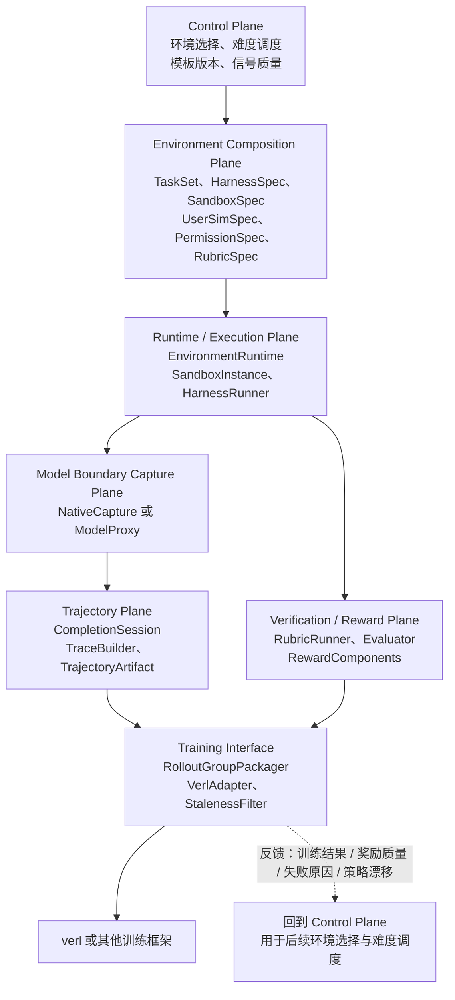
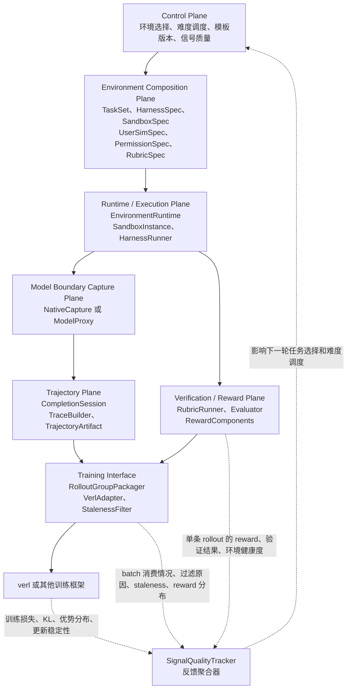
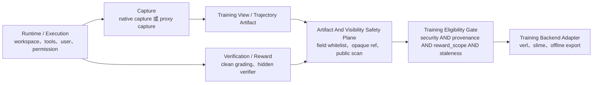

# RepoHarness 项目重新定位与目标架构设计

> **文档地位注记（2026-07）**：本文档已由设计文档 2（`docs/harness_improve/repo_harness_design_doc2_verifiers_based.md`）取代为主设计文档。本文保留为**设计原则与硬边界来源**：第 16 章的各项硬边界（训练资格三档门槛、artifact/visibility 安全平面、token provenance 一等字段、reward attribution 规则、反作弊边界等）仍然有效，并被设计文档 2 显式继承引用。本文其余章节（尤其 Trajectory Plane、Model Boundary Capture Plane、服务边界与数据契约草案）是在"不知道 verifiers v1 已实现大半"的前提下从零推导的，其中大部分已被 verifiers v1 的现成实现取代，阅读时以设计文档 2 的能力对照表（其第 3 章）为准。

本文基于以下材料重新思考 RepoHarness 的长期定位和目标架构：

- `docs/harness_improve/polar_advice.md`
- `docs/harness_improve/full_pull_advice.md`
- `docs/harness_improve/2605.24220v1.pdf`
- `docs/harness_improve/env_design.md`
- `docs/harness_improve/harness_design_advice.md`
- `reference/ProRL-Agent-Server`
- `reference/verifiers`
- `reference/research-environments`
- `reference/renderers`
- `reference/mini-swe-agent`

本文刻意先不讨论当前 Stage 16G.3 的具体实施计划，也不受当前代码目录和已有模块边界约束。它只回答一个更上层的问题：

```text
如果从长期个人项目、简历项目和真实 agentic RL 基础设施的角度重新定义 RepoHarness，
这个项目最终应该是什么？应该解决什么问题？目标架构应该如何设计？
```

## 1. 最终结论

我建议将 RepoHarness 的长期定位从：

```text
一个 SWE / Claude Code 风格 harness，加上 verl fully async RL 训练桥接
```

升级为：

```text
面向交互式软件工程智能体强化学习的可组合环境与异步 rollout 基础设施。
```

更完整地说：

```text
RepoHarness 是一个面向 interactive SWE Agent RL 的 composable environment
和 rollout infrastructure。它用 Prime-style 的 TaskSet / Harness / Sandbox /
User / Permission / Rubric 组合方式定义可执行环境，用 Polar-style 的
rollout-as-a-service、model API capture 和 trajectory builder 捕获真实
harness 执行轨迹，并通过一个与训练框架解耦的 verl adapter 输出异步 RL
可以消费的 token-faithful rollout groups。
```

这个定位里的关键词都很重要：

- `composable environment`：RepoHarness 不是一个固定任务 runner，而是一套可以组合任务、用户、权限、沙箱、工具和评分逻辑的环境工厂。
- `interactive SWE Agent RL`：项目重点不是单轮修 bug，而是多轮代码理解、测试、修改、权限请求、用户澄清、错误恢复和最终验证。
- `rollout infrastructure`：训练器不应该直接调用某个 Python 函数跑任务，而应该向 rollout 服务提交任务，异步获得带 lineage、reward、token 和 staleness metadata 的轨迹包。
- `token-faithful`：训练样本里的可训练 token 必须来自行为策略实际采样时的 token ids，不能只保存文本 transcript 然后训练前重新 tokenize。
- `trainer-decoupled`：RepoHarness 的核心环境和 rollout 服务不应该依赖 verl。verl 是第一个训练后端，但不是项目的核心抽象。

## 2. 为什么旧定位不够

旧定位可以概括为：

```text
RepoHarness task -> workspace -> tools -> agent loop -> trajectory -> verifier -> reward -> verl
```

这个闭环是正确的，但它容易把项目理解成一个“带训练导出的 SWE harness”。在早期阶段这样足够清楚，但结合 Polar、Prime Verifiers、Research Environments 和 Renderers 之后，可以看到更大的问题空间：

1. 真实 agent harness 已经很多：Codex-like、Claude-Code-like、OpenCode、Qwen Code、Pi、mini-swe-agent 等都有自己的 agent loop、工具协议、上下文策略和提交方式。如果为了 RL 把它们都重写成 RepoHarness 私有工具接口，会丢失真实 harness 的行为差异。

2. 长程 SWE 任务的训练对象不是单条 prompt，也不是单条最终 patch，而是一个可执行、可恢复、可验证、可版本化的 environment artifact，以及它产生的 rollout lineage。

3. 异步 RL 中，生成、执行、验证、训练不在同一个时钟上运行。一个 rollout 可能由 policy version 114 生成，验证完成时 trainer 已经更新到 policy version 121。因此轨迹必须携带 policy version、rollout step、group id、environment version、verifier version 和 staleness metadata。

4. 多轮工具调用训练不能只依赖文本 transcript。重新渲染历史消息可能改变 token 序列、工具调用格式、布尔值大小写、thinking 保留策略或 BPE 边界。训练样本必须尽量使用行为策略采样时产生的 token ids、logprobs 和 loss mask。

所以新定位不应该是“做一个更复杂的 SWE agent loop”，而应该是：

```text
做一个可以产生、运行、验证、存储并训练交互式 SWE 环境的基础设施。
```

## 3. 外部参考分别解决什么问题

### 3.1 Prime Verifiers：环境内部 ownership 如何拆分

`reference/verifiers/verifiers/v1/README.md` 给出的核心分层非常关键：

- `Taskset` 定义模型要尝试什么。
- `Harness` 定义模型或 agent 如何尝试。
- `Env` 把一个 `Taskset` 和一个 `Harness` 适配到评测或训练 worker API。
- `Task` 是冻结、可序列化的输入数据。
- `State` 是 rollout 过程中的可变输出和运行期句柄入口。

对 RepoHarness 来说，最重要的不是照搬 Verifiers 的类名，而是学习 ownership：

| 对象 | 应该拥有的内容 |
| --- | --- |
| `TaskSet` | 任务数据、任务加载、任务 prompt、任务自带工具、用户模拟、任务级 setup、任务级 metric、任务级 reward、停止条件 |
| `Harness` | rollout 执行协议、agent loop、模型调用、工具循环、外部命令 agent、endpoint interception、主要 sandbox placement、执行产物 |
| `Rubric` | 最终测试、隐藏测试、权限违规检查、用户负担评分、diff 范围检查、测试篡改检查、过程评分 |
| `Env` | 把一个 `TaskSet`、一个 `Harness`、一个 `SandboxSpec`、一个 `Rubric` 组合成训练和评测系统可运行的环境 |

一个简单判断规则是：

```text
如果某个逻辑定义了“这个任务是什么、成功条件是什么、允许观察什么”，它属于 TaskSet 或 Rubric。
如果某个逻辑定义了“一个 agent 如何尝试任意任务”，它属于 Harness。
如果某个逻辑只是把二者接到训练或评测 worker API，它属于 Env。
```

这能防止 RepoHarness 继续膨胀成一个单体对象。

### 3.2 Research Environments：同一 TaskSet 如何接不同 Harness

`reference/research-environments` 展示了 Prime 风格组合在真实环境里的用法。比如 SWE 任务可以通过 `ComposableEnv` 接到 RLM harness，OpenCode harness 或 mini-swe-agent-plus。它的重要启发是：

```text
同一个 SWE TaskSet 可以被不同 Harness 跑：
  SWETaskSet + RepoHarnessNativeHarness
  SWETaskSet + MiniSWEHarness
  SWETaskSet + OpenCodeHarness

同一个 Harness 也可以跑不同 TaskSet：
  RepoHarnessNativeHarness + SWEBenchTaskSet
  RepoHarnessNativeHarness + InteractiveRefactorTaskSet
  RepoHarnessNativeHarness + RepoPermissionTaskSet
```

这说明 RepoHarness 的核心价值不应该绑定在某一个固定 benchmark 上。更好的设计是把任务族、执行 harness、沙箱和 rubric 拆开，让它们可以交叉组合。

### 3.3 Polar / ProRL-Agent-Server：如何把任意已有 harness 接入 RL

Polar 论文和 `reference/ProRL-Agent-Server` 解决的是另一个问题：

```text
给定一个已经存在的 agent harness，如何尽量不改它，
却把它的真实执行轨迹变成 RL 可以训练的 token-level 样本？
```

Polar 的关键选择是把边界放在模型 API 处，而不是工具 API 处。它的基本流程是：

```text
trainer submit TaskRequest
  -> rollout server 展开 session
  -> gateway node 准备 runtime
  -> 执行 agent harness
  -> model API proxy 捕获 completion
  -> trajectory builder 重建 Trace
  -> evaluator 打分
  -> callback 或 trainer bridge 消费结果
```

本地代码中最值得参考的契约是：

- `reference/ProRL-Agent-Server/src/polar/rollout/models.py`：`TaskRequest`、`SessionDispatchRequest`、`SessionResult`、`SessionStatus`。
- `reference/ProRL-Agent-Server/src/polar/trajectory/models.py`：`CompletionRecord`、`CompletionSession`、`Trace`、`Trajectory`。
- `reference/ProRL-Agent-Server/src/polar/trajectory/builder/per_request.py`：每个 completion 变成一个 trace 的保守 builder。
- `reference/ProRL-Agent-Server/src/polar/trajectory/builder/prefix_merging.py`：把多个 completion 合并为更长 token stream 的 builder。
- `reference/ProRL-Agent-Server/src/slime_bridge`：训练框架桥接层如何留在核心 rollout 服务之外。

对 RepoHarness 的启发是：

```text
RepoHarness 自己拥有代码时，可以先做 native capture。
外部 harness 不应该被改写成 RepoHarness 私有工具协议，而应该通过 model proxy 低侵入捕获。
训练器不应该 import RepoHarness 内部对象，而应该消费 TrajectoryArtifact。
```

### 3.4 Renderers：为什么不能随便重新 tokenize transcript

`reference/renderers` 说明了多轮 agent RL 里非常容易被低估的问题：

```text
训练器看到的 token ids 必须和 sampler 当时看到、采样并返回的 token ids 一致。
```

如果只保存 messages，然后训练前用 `apply_chat_template` 重新渲染，可能出现：

- 布尔值从 `false` 变成 `False`。
- 工具调用 XML 或 JSON 的细节被 canonicalize。
- thinking 在历史 assistant 消息中被剥离。
- BPE 边界因为前后空白变化而漂移。
- agent scaffold 在下一轮前重写了历史工具调用。

所以 RepoHarness 的训练轨迹应该以 token ids、logprobs 和 loss mask 为第一等对象，而不是把它们当成后处理产物。

### 3.5 mini-swe-agent：极简 baseline，不是架构目标

`reference/mini-swe-agent` 的价值在于它足够简单：

- 只有 bash 风格动作。
- 历史基本线性追加。
- 每个 action 独立执行。
- 非常适合作为 SWE 修复任务的强 baseline。

RepoHarness 不应该把 mini-swe-agent 当作要复制的目标。更合理的定位是：

```text
mini-swe-agent 是简单 SWE 修复任务的 baseline。
RepoHarness 关注更复杂的 interactive、permissioned、user-aware、long-horizon SWE 环境。
```

## 4. 新项目目标

长期目标可以拆成六个层次。

### 4.1 环境组合目标

RepoHarness 要能定义和运行不同类型的 SWE 环境：

- 真实仓库 bug 修复。
- 多文件重构。
- API 兼容性迁移。
- 测试修复但不能篡改测试。
- 带用户澄清的需求实现。
- 带权限审批的受限修改。
- 带隐藏约束的长期任务。
- 带部分验证、恢复和重试的长程任务。

这些环境不应该硬编码在一个 runner 里，而应该由 `TaskSet`、`SandboxSpec`、`HarnessSpec`、`UserSimSpec`、`PermissionSpec` 和 `RubricSpec` 组合出来。

### 4.2 Harness-native RL 目标

模型不只应该在 RepoHarness 私有工具协议上训练，也应该能在不同 harness 的真实执行路径上训练：

- RepoHarness native harness。
- mini-swe-agent baseline harness。
- OpenCode-like harness。
- 未来可能的 Codex-like 或 Claude-Code-like shell adapter。

这样训练学到的是某个 harness 的真实 action protocol、context policy、patch submission style 和错误恢复方式，而不是一个为了训练临时设计的 DSL。

### 4.3 Token-faithful 训练轨迹目标

每条可训练 trace 应该至少包含：

```text
prompt_ids
response_ids
loss_mask
response_logprobs
prompt_messages
response_messages
tools
finish_reason
reward
metadata
```

这里最重要的是：`response_ids` 必须来自行为策略实际采样的 token，`loss_mask=1` 的位置必须只覆盖模型真正生成、并且允许训练的 token。工具结果、系统插入内容、用户消息、harness interstitial tokens 等都不能被误当作模型可训练输出。

### 4.4 用户与权限目标

RepoHarness 的差异化不应该只来自“能跑测试”，而应该来自更接近真实工程协作的约束：

- 用户可能表达不完整需求。
- 用户有隐藏偏好或隐藏约束。
- 某些修改需要用户批准。
- 某些路径、命令或网络访问被禁止。
- agent 需要在被拒绝后恢复，而不是硬绕过。
- 最终 reward 不只看 patch 是否通过测试，也看是否遵守权限、是否减少用户负担、是否避免无关修改。

这使 RepoHarness 比普通 SWE-Bench runner 更适合作为长期 agentic RL 项目。

### 4.5 异步 rollout 目标

RepoHarness 应该支持训练系统异步提交和消费 rollout：

```text
submit rollout task
  -> session queued
  -> runtime initialized
  -> agent running
  -> postrun building
  -> evaluating
  -> artifact stored
  -> trainer callback or polling
```

每个 rollout group 都应该携带：

```text
group_id
policy_version
rollout_step
task_id
taskset_id
env_id
harness_id
rubric_id
runtime_image_digest
tool_schema_version
verifier_digest
builder_strategy
started_at
completed_at
staleness
```

### 4.6 训练框架解耦目标

verl 是当前最重要的训练后端，但核心环境服务不应该依赖 verl。更好的边界是：

```text
RepoHarness Rollout Service
  -> TrajectoryArtifact
  -> VerlAdapter
  -> verl batch / rollout group
```

未来如果要接别的训练框架，应该新增 adapter，而不是修改核心环境和 rollout 服务。

## 5. 目标架构总览

建议的目标架构如下：



这张图里的反馈箭头很重要。训练结果、reward 质量、失败原因和策略漂移信息应该回到 control plane，用于后续环境选择和难度调度。

上图为了保持主路径清晰，把反馈路径画成了 Training Interface 回到 Control Plane。更精确地说，反馈不应该只有一条来源。`Verification / Reward Plane` 会产生单条 rollout 的验证结果、奖励结果和环境健康信息；`Training Interface` 会产生 batch 级别的训练消费结果、过滤原因、staleness 和 reward 分布；训练框架本身还可能产生优化过程指标。更完整的反馈关系可以补充为：



这张补充图不改变主链路的职责划分，只是把反馈来源拆得更清楚：`Verification / Reward Plane` 负责判断每条轨迹的结果是否可信、奖励是多少、环境和 verifier 是否健康；`Training Interface` 负责说明一批轨迹最终有多少被训练框架消费、哪些被过滤、staleness 是否严重；`SignalQualityTracker` 或类似的反馈聚合器再把这些信息汇总给 `Control Plane`，用于决定下一轮多采样哪些任务、减少哪些任务、暂停哪些环境模板，以及是否调整难度。

还需要明确的是，上面两张图画的是长期 `service_driven` 拓扑的主路径，不应该被误读成近期 `trainer_native` 接入也必须经过 Rollout Service、Gateway、Model Proxy 和 TrajectoryBuilder。更准确的长期设计是：两种拓扑共享同一个环境核心，但外层调度、模型调用和训练消费方式不同。

共享核心可以理解为：

```text
Environment Composition Plane
  -> Runtime / Execution Plane
  -> Model Boundary Capture Plane
  -> Verification / Reward Plane
  -> Artifact And Visibility Safety Plane
  -> Training Eligibility Gate
```

近期优先的 `trainer_native` 拓扑更像这样：

```text
verl FullyAsyncRollouter 或 slime RolloutManager
  -> RepoHarness trainer-native AgentLoop / custom_generate
  -> RepoHarness Runtime / Tool / Verifier / UserSim / Permission
  -> NativeCapture + TokenTapeBuilder
  -> GenerationRecord / TrainingView / AgentLoopOutput
  -> 训练框架自己的 queue、buffer、trainer 和权重同步系统
```

长期 `service_driven` 拓扑才是：

```text
RepoHarness Rollout Service
  -> Gateway / Runtime Worker
  -> NativeCapture 或 ModelProxy
  -> CompletionSession / TrajectoryBuilder / TrajectoryArtifact
  -> TrainingBackendAdapter
  -> verl、slime 或其他训练框架
```

也就是说，`RolloutServer`、`Gateway`、`ModelProxy`、`PerRequestBuilder` 和 `PrefixMergingBuilder` 是服务化路径的重要组件，但不是白盒 trainer-native 路径的必经环节。白盒路径里，RepoHarness 自己拥有 agent loop，应优先维护 append-only token tape 和逐轮 `GenerationRecord`，再投影成当前训练框架需要的 `AgentLoopOutput` 或等价样本。

`Artifact And Visibility Safety Plane` 是这两种拓扑都必须经过的横切平面：



这个安全平面不是新建一套与现有代码平行的机制，而应该继承并扩展当前已经验证过的资产：`src/repo_harness/rl/visibility.py` 的 forbidden marker 与字段可见性边界、`src/repo_harness/evaluation/episode_projection.py` 的公开投影扫描、以及 `src/repo_harness/rl/episode.py` 中 `EpisodeVisibilityPolicy` 对 model-visible、trainer tensor、trainer non-tensor、audit-only 和 forbidden 字段的分层。

## 6. 目标架构分层说明

### 6.1 Control Plane：决定生成和运行什么环境

职责：

- 选择 task family。
- 选择难度。
- 选择 harness。
- 控制同一个任务的 `num_samples`。
- 追踪 environment template version。
- 追踪 reward signal 是否健康。
- 决定哪些环境值得继续采样，哪些环境应该降权或废弃。

可能的核心对象：

```text
EnvRegistry
TaskSetRegistry
HarnessRegistry
RubricRegistry
CurriculumScheduler
DifficultyPolicy
SignalQualityTracker
PolicyVersionTracker
ExperimentPlan
```

这一层不直接执行工具，也不直接跑训练。它只决定“下一批应该生成或运行什么”。

### 6.2 Environment Composition Plane：定义环境由什么组成

职责：

- 定义 `Task` 和 `TaskSet`。
- 定义 sandbox 资源和隔离需求。
- 定义 agent/harness 如何被运行。
- 定义用户模拟和权限策略。
- 定义 rubric 和 reward components。
- 组合出一个可执行的 `ComposableEnvSpec`。

建议核心对象：

```text
Task
TaskSet
State
EnvironmentPackage
TaskPack
EnvConfig
SandboxSpec
HarnessSpec
UserSimSpec
PermissionSpec
RubricSpec
ArtifactSpec
ComposableEnvSpec
```

一个示例环境可以是：

```yaml
env_id: interactive_payments_refactor_v1
taskset:
  id: interactive_refactor
  task_id: payments_refactor_001
  repo_snapshot: payments_service@template_v3
  prompt: "帮我重构 payments 模块，旧的 PaymentClient 太乱了。"
  hidden_constraints:
    - "不要修改 refunds 模块"
    - "public API 必须保持兼容"
sandbox:
  image: repoharness/python-node-swe:2026-06
  cpu_cores: 4
  memory_gb: 8
  timeout_seconds: 5400
harness:
  id: repoharness_native_v1
  adapter: python_native
  capture: native
user_sim:
  persona: engineering_manager
  approval_style: scoped_and_cautious
permission:
  default: read_only
  edit:
    src/payments/**: require_approval
    src/refunds/**: deny
rubric:
  hidden_tests: hidden_tests/payments
  api_contract: checks/api_contract.py
  permission_checker: strict
  user_burden_weight: 0.15
```

这个例子里，任务、沙箱、harness、用户、权限和评分都是独立可替换的。

这里必须额外强调一个 Prime-style ownership hard contract，避免 `ComposableEnvSpec`
变成新的大而全对象：

```text
TaskSet owns:
  任务数据、初始 prompt、workspace 物化规则、任务侧工具、任务成功条件、
  任务指标、同题多采样 group 初始化，以及任务级隐藏约束。

Harness owns:
  agent loop、外部命令或框架 adapter、模型端点路由、执行协议、
  harness system prompt、执行侧 artifact 和主执行 sandbox placement。

Env owns:
  adapter 行为和组合清单。Env 把一个 TaskSet 和一个 Harness 连接到
  rollout / eval / training API，但不应该拥有任务领域逻辑。

UserSimSpec owns:
  可复用的对话用户行为引擎、追问策略、澄清策略、审批口径和用户负担建模。

TaskSet owns user-side task facts:
  某个具体任务里的用户 persona、隐藏偏好、隐藏约束、任务特定澄清答案和任务特定审批事实。
  这些是任务数据的一部分，不应该被全局 UserSim 引擎吞掉。

PermissionSpec owns:
  工具调用前的权限拦截、读写范围、审批策略、拒绝策略和违规标记。

Rubric / Reward Plane owns:
  hidden verification、clean grading、权限违规评分、测试篡改检查、
  reward component 聚合和 training eligibility 判定。

State owns:
  运行期可变输出、trajectory、metrics、reward、artifact、timing 和 runtime handles。
  runtime handles 必须在公开 artifact 导出前剥离。
```

`EnvironmentPackage` 或 `TaskPack` 也应该是一等概念。`research-environments`
的启发不是只有 `ComposableEnv`，而是每个环境包都应该像一个可复现的小产品：

```text
EnvironmentPackage:
  package_name
  package_version
  load_environment entrypoint
  default EnvConfig
  README / benchmark card
  smoke test
  taskset revision
  harness revision
  rubric revision
  sandbox image digest
  scoring image digest
  workspace materialization digest
```

这样设计的原因是：长期训练数据的可信度不仅取决于某次 rollout 是否成功，
还取决于同一个环境包在几周后、换一台机器后、换一个训练后端后，能不能用同样配置重新加载、短评测和回归检查。

`EnvConfig` 和 `ComposableEnvSpec` 也需要有清楚边界。`EnvConfig` 是可校验、可序列化、可计算 digest 的声明树；`ComposableEnvSpec` 是 loader 解析之后的组合清单和运行入口描述。二者不应该平行保存两份 harness、rubric、scoring 和 permission 规格。需要快速读取时，可以提供只读访问器，例如 `resolved.harness_spec` 或 `resolved.rubric_spec`，但持久化 artifact 里只应有一棵权威 spec 树和它的 section digests。

### 6.3 Runtime / Execution Plane：把环境物化成真实运行实例

职责：

- 创建或复用 sandbox。
- 准备 repo、依赖和环境变量。
- 暴露工具面。
- 启动 agent harness。
- 管理超时、取消、失败恢复和 artifact 收集。
- 保持 rollout workspace 和 scoring workspace 的边界。

建议核心对象：

```text
EnvironmentRuntime
SandboxInstance
RuntimePool
HarnessRunner
RepoHarnessNativeRunner
ExternalShellHarnessRunner
UserSimRunner
PermissionGate
ToolExecutionPolicy
TokenTapeBuilder
RendererBinding
PrepareRecipe
EvalPrepareRecipe
ScoringSandboxSpec
GradingWorkspaceSpec
SandboxLifecyclePolicy
EnvironmentQualityValidator
ScoringRuntimePrewarmer
RuntimeSnapshot
ExecutionEventLog
```

这一层要支持两种 harness：

```text
白盒 harness：
  RepoHarness 自己实现 agent loop，可以直接做 native capture。

黑盒或半黑盒 harness：
  外部命令或外部框架运行，模型调用通过 ModelProxy 捕获。
```

`UserSimRunner` 和 `PermissionGate` 必须是运行时的一等对象，而不是只写进日志的配置项。推荐的调用位置是：

```text
agent asks / tool call proposed
  -> PermissionGate 先判断是否允许、需要审批、还是拒绝
  -> 必要时 UserSimRunner 产生用户澄清、批准或拒绝
  -> ToolExecutor 执行被允许的操作
  -> TrainingEligibilityFact 记录权限、用户负担和拒绝恢复情况
```

第一版训练环境应优先使用确定性用户模拟和确定性审批策略。冻结的大模型用户模拟可以作为后续研究项，但在 GRPO 这类同题多采样训练中，非确定用户会给同一 rollout group 注入额外噪声，因此不能在没有噪声画像之前作为默认训练环境。

`TokenTapeBuilder` 或 `RendererBinding` 负责白盒路径里的 prompt token tape 续接、chat template 渲染、工具结果 token 对齐和 prefix preservation 检查。这个组件和 service-driven 路径里的 `TrajectoryBuilder` 不同：前者在 agent loop 内维护 append-only token tape，后者更多是在黑盒 proxy 捕获之后做事后重建。

`RuntimeSnapshot` 不需要发展成第二套 `RolloutCheckpoint` 对象。它应该承载 lineage 和恢复所需的最小引用，例如 `event_log_cursor`、`workspace_diff_ref`、`permission_state_ref`、`user_state_ref`、`conversation_state_ref` 和 `generation_record_refs`。在 `trainer_native` 路径下，token 级 partial rollout、KV cache 和权重同步仍由训练框架拥有；RepoHarness 只记录可审计恢复点。

运行时必须区分 rollout workspace 和 grader workspace：

```text
rollout workspace:
  agent 真正读写的候选工作区，允许产生中间文件、日志、patch 和失败状态。

grader workspace:
  verifier 使用的干净评分工作区，只接收 cleaned final patch、公开依赖和评分需要的隐藏资源。

prepare_recipe:
  负责把原始仓库、依赖、公开测试和任务输入物化成 rollout workspace。

eval_prepare_recipe:
  负责从原始仓库或干净 checkout 创建 grader workspace，再注入 hidden tests 或 grader-only assets。
```

SWE 类任务默认不应该只在 rollout workspace 中运行 hidden tests。
更稳的做法是让 `ScoringSandboxSpec` 或 `GradingWorkspaceSpec` 明确表示：
是否需要 clean checkout、是否需要 patch replay、哪些文件必须从评分环境删除、哪些 hidden verifier 资源只能在评分时挂载。
对于长程任务，评分环境还应该支持 prewarm。也就是 agent 仍在运行时，`ScoringRuntimePrewarmer` 可以提前准备依赖、干净 checkout 和 grader-only 资源，避免所有 rollout 结束后再集中初始化评分环境，导致训练吞吐被 sandbox 准备时间拖垮。
prewarm 只能提前准备评分 runtime，不能泄漏评分内容。它不得让 rollout workspace、agent 进程、模型可见工具结果、公开日志或错误输出获得 hidden verifier 的路径、文件名、挂载点、测试数量、失败详情或 grader-only 环境变量。任何 prewarm 失败也应该先写入 runtime-private artifact，再通过脱敏后的健康状态影响训练资格。

### 6.4 Model Boundary Capture Plane：捕获模型调用

这是 Polar 对 RepoHarness 最大的新增启发。

目标不是在工具层理解所有 agent 行为，而是在模型 API 边界捕获训练所需的 token 信息。

第一阶段可以有两种 capture：

```text
NativeCapture:
  RepoHarness 自己拥有模型调用代码，所以直接记录 prompt_ids、response_ids、logprobs、tools 和 messages。

OpenAICompatibleModelProxy:
  外部 harness 通过 OPENAI_BASE_URL 指向本地 proxy。
  proxy 转发请求到真实 inference backend，同时记录 completion。
```

未来再扩展：

```text
Anthropic Messages proxy
OpenAI Responses proxy
Google generateContent proxy
provider-specific token extraction
```

建议核心对象：

```text
CompletionRecord
CompletionSession
ProviderRequestNormalizer
ProviderResponseAdapter
TokenIdExtractor
ModelProxySessionRegistry
ModelProxySessionDiagnostics
CaptureStore
```

重要原则：

```text
能从 inference backend 拿到 prompt token ids 和 sampled token ids，就不要重新 tokenize。
能拿到 sampled token logprobs，就必须和 response_ids 逐位置对齐。
拿不到 token ids 的轨迹，可以用于调试、评测或 SFT 候选，但不应该默认进入 policy loss。
```

外部 harness 的 ModelProxy 还要记录 session 级诊断信息。它不仅要知道“这次请求和响应是什么”，还要尽量判断：

```text
session_id 是否稳定绑定到同一次 rollout
外部 harness 是否绕过 proxy
历史消息是否被重写
上下文是否被压缩
tool call 是否被 harness 修补
thinking / reasoning 字段是否被丢弃
streaming response 是否经过 synthetic stream 转换
```

这些诊断不一定都能在第一版完全实现，但它们必须进入 capture contract。
否则黑盒 harness 的轨迹很容易看起来有 request / response，却无法证明训练时的 prompt token tape 和行为策略输出是真实可追溯的。

### 6.5 Trajectory Plane：把 completion 和事件变成训练 artifact

职责：

- 把模型 completion 记录转成 trace。
- 对齐 token ids、logprobs 和 loss mask。
- 记录工具、消息、事件、workspace diff 和 verifier 输出。
- 生成 trainer-facing artifact。

建议核心对象：

```text
Trace
Trajectory
TrajectoryBuilder
PerRequestBuilder
PrefixMergingBuilder
TrajectoryArtifact
ArtifactStore
RendererBridgeMetadata
TrainingView
AgentLoopOutputProjection
```

对 `trainer_native` 白盒路径来说，`TrajectoryBuilder` 不是必经环节。RepoHarness 自己拥有 agent loop，因此应该在每轮模型调用时直接写入 `GenerationRecord`，由 `TokenTapeBuilder` 维护 append-only token tape，再投影成当前已经存在的 `TrainingView` 或训练框架需要的 `AgentLoopOutput`。这一条路径的关键是不事后重新构造历史，而是证明每个进入 loss 的 token 当时确实由行为策略采样。

对 `service_driven` 或黑盒 proxy 路径来说，才需要更接近 Polar 的 builder：

第一版建议先实现：

```text
PerRequestBuilder
```

它最保守，每个模型 completion 产生一个 trace，适合调试和建立数据契约。但必须注意：

```text
不要把最终 session-level reward 盲目广播到每个 per-request trace 后直接做 policy loss。
```

Polar 论文和建议文档都指出，长轨迹里这样做会造成 credit assignment 噪声，并可能带来 reward hacking。

第二版再实现：

```text
PrefixMergingBuilder
```

它把多个 completion 合并成更长序列：

```text
初始 prompt ids
  + sampled assistant response ids，loss_mask=1
  + harness/tool/user 插入内容，loss_mask=0
  + sampled assistant response ids，loss_mask=1
  + ...
```

这可以减少训练碎片化，提高长程 rollout 的样本效率。

但是 `PrefixMergingBuilder` 不能通过重新 tokenize 工具结果、用户消息或 transcript 来拼接轨迹。
renderer-style token fidelity 的硬要求是：

```text
1. 每次模型调用必须保存真实 prompt token tape。
2. 模型生成 token 必须来自 sampled response ids。
3. harness / tool / user 插入的非模型生成 token，
   必须来自下一轮真实 prompt token tape 中可验证的 token 子序列。
4. 如果 bridge_to_next_turn 失败、prompt prefix drift、或只能 full rerender，
   该 session 至少降级为 offline candidate，不能默认进入 formal online policy loss。
```

因此 `TrainTrace.loss_mask` 不应该被当作孤立字段手写。更准确的派生关系是：

```text
loss_mask = sampled_mask AND role_policy
```

其中 `sampled_mask` 表示 token 是否由模型采样，`role_policy` 表示该 token 所属角色是否允许训练，
训练资格不应该被折进 token mask。整条轨迹是否通过 token、logprob、reward、安全和 staleness 硬门槛，
应该由 `TrainingEligibilityGate` 控制 batch 准入、降级或拒绝；资格失败的轨迹不应该通过“把 mask 全部置 0”
伪装成一个可消费训练样本。
工具 observation 如果未来要做额外监督，也应该使用独立的 `tool_observation_sft_mask`，
不能混入 online RL 的 assistant policy loss。

为了避免三套 token 契约各自演化，文档层需要明确字段映射：

```text
GenerationRecord:
  单次模型调用的原始 native capture 事实。

TrainingView:
  RepoHarness 当前 trainer-native 投影，包含 response_ids、response_mask、
  response_logprobs、span attribution 和训练资格守门信息。

AgentLoopOutput:
  verl-facing transport object。它的 response_mask 应该和 TrainingView 的
  可训练 assistant token mask 对齐，extra_fields 只放白名单允许的训练辅助字段。

TrainTrace:
  后端中立 artifact view。它使用 loss_mask 命名，并把 reward_scope、
  credit_assignment_strategy、policy staleness 和 artifact visibility 写成可审计字段。
```

关键字段映射建议如下：

| 语义 | GenerationRecord | TrainingView | AgentLoopOutput | TrainTrace |
| --- | --- | --- | --- | --- |
| 模型输出 token | `output_token_ids` | `response_ids` | `response_ids` | `response_ids` |
| 可训练 mask | span attribution 派生 | `response_mask` | `response_mask` | `loss_mask` |
| 行为策略 logprob | `output_logprobs` | `response_logprobs` | `response_logprobs` | `response_logprobs` |
| token 归属 | generation span | `ResponseSpan.source_type` | backend extra fields 的白名单投影 | `loss_mask_policy_digest` 和 span refs |
| 后端专用张量 | 不直接拥有 | trainer tensor facts | `extra_fields` 白名单 | `backend_tensors` |
| 最终训练资格 | 原始事实之一 | route / provenance qualification | backend consume eligibility | `training_eligibility_class` |

`ResponseSpan.source_type` 应能区分 `assistant_generation`、`tool_observation`、`environment_observation`、`user_message` 和 `harness_interstitial`。用户模拟产生的中途消息不能长期混在宽泛的 environment observation 里，否则后续 loss mask、用户负担 reward 和权限审批 attribution 都会变得含糊。

### 6.6 Verification / Reward Plane：把结果和过程变成可信训练信号

职责：

- 运行 public tests。
- 运行 hidden tests。
- 检查 forbidden diff。
- 检查测试是否被篡改。
- 检查权限是否被绕过。
- 评估用户交互质量。
- 产出 reward components。
- 产出 reward、环境质量和训练资格事实。

建议核心对象：

```text
RubricRunner
EvaluatorRegistry
RewardComponent
RewardPolicy
TrainingEligibilityPolicy
TrainingEligibilityFact
CleanPatchReplayEvaluator
PermissionViolationChecker
UserBurdenScorer
AntiTamperChecker
ScoringSandboxRunner
CleanGradingReplayReport
EnvironmentQualityReport
```

reward 不应该只有一个 `resolved: true/false`。更适合 RepoHarness 的 reward components 是：

```yaml
reward_components:
  hidden_tests_passed: 1.0
  public_tests_preserved: 1.0
  forbidden_diff: 0.0
  permission_violation: 0.0
  test_tampering: 0.0
  user_burden: -0.1
  unnecessary_file_churn: -0.05
  final_reward: 0.85
training_eligibility:
  policy_loss_candidate: true
  invalid_for_training: false
  invalid_for_online_rl: false
  reason: null
```

这样可以把“修对代码”和“按真实工程约束修代码”同时纳入训练信号。
这一层不应该单独写最终 `training_eligibility_class`。它应该输出 reward facts、security facts、environment quality facts 和 verifier facts，最终由 `Training Interface` 里的单一 `TrainingEligibilityGate` 与 token provenance、staleness 等事实合成。

### 6.7 Training Interface：向 verl 输出异步 RL 可消费对象

职责：

- 把 trajectory artifacts 打包成 rollout groups。
- 标记 policy version、rollout step、group id。
- 根据 staleness 过滤或降权。
- 输出 raw reward、reward components、group id 和 reward attribution 信息。
- 合成最终 training eligibility。
- 转换成 verl 需要的数据结构。
- 保持核心 rollout 服务和 verl 解耦。

建议核心对象：

```text
RolloutGroupArtifact
RolloutGroupPackager
StalenessFilter
RewardSignalPackager
RewardNormalizationPolicyRef
TrainingEligibilityGate
VerlAdapter
SlimeAdapter
TrainingBackendAdapter
TrainingBatchProjection
```

这层可以直接借鉴 Polar 的训练框架 bridge 思路：核心服务只产出通用 trajectory，verl adapter 负责把它投影成 verl batch。
`RewardNormalizationPolicyRef` 只是记录“训练后端或离线导出 adapter 使用了哪套归一化策略”的引用，不代表 RepoHarness 核心服务自己执行 group normalization。默认情况下，advantage 计算和组内 reward 归一化仍由训练后端掌握。

但是 `Training Interface` 不应该只被理解成静态格式转换层。它至少要支持两种接入模式：

```text
trainer_native:
  训练框架拥有外层 rollout runtime。
  例如 verl FullyAsyncRollouter 调 RepoHarness agent loop；
  或 slime custom_generate 调 RepoHarness episode。
  训练框架负责 GPU 资源、推理服务、权重同步、队列或 buffer、staleness 和 partial rollout。
  RepoHarness 负责环境执行、trajectory、reward、安全边界和训练资格。

service_driven:
  RepoHarness Rollout Service 独立接收 rollout task，运行环境，写 TrajectoryArtifact。
  训练后端通过 artifact store、callback、polling、队列、Ray object ref
  或 TrainingBackendAdapter 消费合格样本。
```

近期接入 `verl` 时，更现实的第一优先级是 `trainer_native`：

```text
verl FullyAsyncRollouter
  -> RepoHarnessVerlAgentLoop
      -> RepoHarness episode / environment / tools / verifier
      -> 每次模型调用走 verl 管理的 vLLM / SGLang client
  -> AgentLoopOutput / RolloutSample
  -> verl MessageQueue
  -> verl FullyAsyncTrainer
  -> verl CheckpointEngineManager 同步权重
```

未来接入 `slime` 时，也应该优先让 `slime` 管训练运行时：

```text
slime train_async / RolloutManager
  -> custom_generate(args, sample, sampling_params)
      -> RepoHarness episode / environment / tools / verifier
      -> 调 slime / SGLang 管理的推理服务
      -> 生成 Sample 或 list[Sample]
  -> slime RolloutBatch
  -> slime trainer
```

也就是说，RepoHarness 不应该自己重写 `verl` 或 `slime` 已经拥有的 NCCL 权重同步、推理引擎暂停恢复、训练队列和参数版本更新系统。
RepoHarness 需要定义的是跨训练框架的样本资格、artifact、运行时握手字段和 adapter 边界。

reward 归一化不能默认放在 RepoHarness 核心服务里。GRPO 或类似算法的组内归一化依赖完整 rollout group、partial rollout 处理、staleness 丢弃和训练框架最终消费情况，而这些生命周期通常由 verl、slime 或其他训练后端掌握。RepoHarness 核心应该输出 raw reward、reward components、group_id、parent_rollout_id、reward_scope 和 credit_assignment_strategy；`VerlAdapter` 或 `SlimeAdapter` 可以把这些字段交给训练后端。只有在 service-driven offline export 场景中，并且已经确认完整 group 成员之后，adapter 才可以做可审计的可选归一化。

同理，group 级 pass-rate 过滤、early-exit、同题 rollout group 是否继续扩展，默认也不属于 RepoHarness 核心环境层。`trainer_native` 模式下，这些策略应由训练框架或训练驱动层拥有，例如 verl 的 group 展开与丢弃策略、slime 的动态采样过滤；`service_driven` 模式下，可以由 Rollout Service 的 group 管理器拥有。RepoHarness 的职责是及时浮出单 rollout 的 reward facts、failure facts、group_id、parent_rollout_id、rollout_loss_denominator 和后端过滤决定，并把 `backend_rejection_reason` 或等价字段写入 artifact。

`TrainingEligibilityGate` 是最终训练资格的唯一合成者。它接收各平面产出的事实：

```text
security_status
AND token_provenance_status
AND logprob_alignment_status
AND loss_mask_status
AND reward_scope_status
AND environment_quality_status
AND staleness_status
```

任何一个维度失败，都不能由其他平面直接绕过。`Verification / Reward Plane`、`Trajectory Plane` 和 `Training Runtime Coordination Plane` 可以记录自己的事实，但不应该分别写出互相冲突的最终 `training_eligibility_class`。

### 6.8 Training Runtime Coordination Plane：训练框架和环境服务之间的握手层

这是前面 `Training Interface` 的横切补充层。它不是让 RepoHarness 从零实现一个新的 fully async trainer，
而是让 RepoHarness 可以清楚表达“这条轨迹是在什么训练运行时状态下生成的，以及训练后端如何消费它”。

建议核心对象：

```text
TrainingRuntimeCoordinator
TrainingBackendAdapter
InferenceLease
PolicyVersionHandshake
BackendReceiveMechanism
RolloutBackpressureSignal
TrainerAckRecord
PartialRolloutPolicy
```

职责：

```text
1. 记录 behavior_policy_version。
2. 记录 inference engine 实际看到的 weight version。
3. 记录 rollout start / completion 时的参数版本。
4. 判断样本是否超过 staleness 阈值。
5. 处理 backend submission、backend receive、consumer ack、reject、buffer requeue。
6. 记录 partial rollout、abort、timeout 和 retry eligibility。
7. 把训练后端指标反馈给 Control Plane，而不把训练框架对象泄漏进核心环境层。
```

这层尤其要避免把 `MessageQueue` 写成唯一实现。`verl` 当前 fully async 使用 Ray actor 形态的 MessageQueue；
`slime` 更多使用 Ray future、data buffer、RolloutManager 和后台 fully async worker；
未来其他训练框架可能使用 artifact store、对象引用、HTTP callback 或本地文件轮询。
因此高层架构应该说 `backend_receive_mechanism`，而不是默认所有训练框架都有同一种消息队列。

## 7. 端到端数据流

目标数据流应该是：

```text
1. Trainer 或 ExperimentPlan 请求一组 rollout

2. Control Plane 选择任务、难度、harness 和 policy version

3. RolloutServer 接收 RolloutTaskRequest

4. GatewayWorker 创建多个 session

5. Runtime 初始化 sandbox 和 repo workspace

6. HarnessRunner 执行 RepoHarness native harness 或外部 harness

7. NativeCapture 或 ModelProxy 捕获每次模型调用

8. TrajectoryBuilder 构造 token-faithful Trace

9. RubricRunner 在 rollout workspace 或干净 scoring workspace 上验证

10. ArtifactStore 写入 TrajectoryArtifact、workspace diff、event log、score report

11. VerlAdapter 读取 eligible artifacts，生成 rollout group batch

12. Trainer 消费 batch，更新 policy

13. SignalQualityTracker 汇总训练反馈，影响下一轮环境选择
```

这条 13 步数据流描述的是长期 `service_driven` 拓扑。近期 `trainer_native` 接入时，外层的第 3、4、11、12 步会被训练框架自己的 rollouter、queue、buffer 和 trainer 替代：

```text
verl 或 slime 外层 rollouter
  -> RepoHarness trainer-native agent loop
  -> GenerationRecord / TrainingView / AgentLoopOutput
  -> 训练框架自己的异步消费机制
```

两条路径都必须经过相同的环境组合、运行时安全、token provenance、reward attribution、artifact visibility 和 training eligibility gate。差异只在谁拥有外层调度和训练运行时，而不是谁可以跳过安全和训练资格检查。

可以用一句话理解：

```text
Control Plane 决定跑什么，Environment Composition Plane 定义环境是什么，
Runtime Plane 把环境跑起来，Capture Plane 抓住模型真实 token，
Trajectory Plane 变成训练样本，Verification Plane 决定奖励和资格，
Training Interface 把结果交给 verl。
```

## 8. 核心数据契约草案

### 8.1 EnvironmentPackageSpec / TaskPackSpec / EnvConfig

```python
class EnvironmentValidationReport:
    patch_validation_applicability: Literal["required", "not_applicable"]
    patch_validation_not_applicable_reason: str | None
    empty_patch_must_fail: Literal["passed", "failed", "not_run"]
    golden_patch_must_pass: Literal["passed", "failed", "not_run"]
    determinism_check: Literal["passed", "failed", "not_run"]
    verified_in_training_runtime: bool
    reward_profile_ref: str | None
    task_quality_report_ref: str | None
    validation_run_count: int
    validator_ref: str


class EnvironmentPackageSpec:
    package_name: str
    package_version: str
    load_environment_entrypoint: str
    benchmark_card_ref: str | None
    smoke_test_command: list[str] | None
    validation_report: EnvironmentValidationReport | None
    taskset_revision: str
    harness_revision: str
    rubric_revision: str
    sandbox_image_digest: str
    scoring_image_digest: str | None
    workspace_materialization_digest: str
    config_digest: str
    anti_cheat_spec_ref: str | None
    swe_profile_ref: str | None


class TaskPackSpec:
    taskpack_name: str
    taskpack_version: str
    task_source_digest: str
    split_name: str
    task_schema_version: str
    materialization_recipe_digest: str
    default_taskset_config_digest: str
    license_ref: str | None
    benchmark_card_ref: str | None


class SWEEnvPackageProfile:
    base_commit: str
    repo_snapshot_ref: str
    expected_pre_fix_outcome: Literal["fail", "pass", "not_applicable"]
    expected_post_fix_outcome: Literal["pass", "not_applicable"]
    f2p_tests_ref: str | None
    p2p_tests_ref: str | None
    anti_cheat_spec_ref: str | None


class ConfigSection:
    schema_version: str
    owner: Literal[
        "taskset",
        "harness",
        "sandbox",
        "user_sim",
        "permission",
        "rubric",
        "scoring",
    ]
    config_digest: str
    validator_ref: str
    payload: dict


class TaskSetConfig(ConfigSection): ...
class HarnessConfig(ConfigSection): ...
class SandboxConfig(ConfigSection): ...
class UserSimConfig(ConfigSection): ...
class PermissionConfig(ConfigSection): ...
class RubricConfig(ConfigSection): ...
class ScoringConfig(ConfigSection): ...


class EnvConfig:
    config_schema_version: str
    config_digest: str
    taskset: TaskSetConfig
    harness: HarnessConfig
    sandbox: SandboxConfig
    user_sim: UserSimConfig | None
    permission: PermissionConfig | None
    rubric: RubricConfig
    scoring: ScoringConfig | None
```

这里的 `EnvConfig` 应该是可校验配置树，而不是自由字典。每个 namespace 都应该有自己的 schema、digest、owner 和 validator。
`ComposableEnvSpec` 可以引用它，但不应该把所有任务逻辑、运行时句柄和训练状态都放进自己身上。
`EnvironmentValidationReport` 是环境级训练资格的前置门槛。空 patch 必须失败、golden patch 必须通过、重复执行应该确定、并且最好在真实训练 runtime 中复验。没有通过这些检查的环境包，可以用于调试或人工分析，但不应该进入训练采样池。
但这条规则也需要保留任务类型语义。典型 SWE 修复、重构和补丁生成任务应该要求 `patch_validation_applicability="required"`；
解释代码、只做诊断、只做检索或不要求修改仓库的任务，可以显式标记为 `not_applicable`，并写明 `patch_validation_not_applicable_reason`。这样不会为了非 patch 型任务削弱 patch 型训练环境的质量门槛。
`task_quality_report_ref` 只是环境生产阶段质量评估的挂点，例如规格清晰度、测试公平性、泄漏风险和可解性；质量评估目录本身应放在环境生产与质量流水线子文档中演进，不在高层架构里冻结。
`SWEEnvPackageProfile` 是 `EnvironmentPackageSpec` 的领域扩展示例，不替代通用环境包规格。它用于表达 SWE patch 型任务在 grader 运行期必须知道的 base commit、pre/post-fix 期望结果、f2p/p2p 测试引用和反作弊规格引用。

### 8.2 RolloutTaskRequest

```python
class RolloutTaskRequest:
    task_id: str
    instruction: str
    num_samples: int
    timeout_seconds: float
    taskpack_ref: str
    environment_package_ref: str
    env_config_ref: str | None
    overrides: RolloutRequestOverrides
    callback_url: str | None
    metadata: RolloutMetadata


class ResolvedRolloutTaskRequest:
    request_id: str
    source_request: RolloutTaskRequest
    taskpack: TaskPackSpec
    environment_package: EnvironmentPackageSpec
    env_config: EnvConfig
    env: ComposableEnvSpec
    resolved_section_digests: dict[str, str]
    resolved_at: str
    resolved_spec_digest: str
```

外部调用方提交的 `RolloutTaskRequest` 不应该被迫携带所有 resolved spec。
更稳的边界是：请求只包含 task、环境包、配置引用和少量 override；RepoHarness
内部通过 registry 解析成冻结的 `ResolvedRolloutTaskRequest`，再交给 runtime 执行。
这样可以避免 `RolloutTaskRequest`、`EnvConfig`、`ComposableEnvSpec`、`HarnessSpec`
和 `EvaluatorSpec` 互相抢 ownership，也方便 inspector 对 resolved spec digest 做一致性检查。
解析后的请求只持久化一棵权威 spec 树。实现上可以提供 `resolved.harness_spec`、`resolved.rubric_spec`
或 `resolved.training_runtime_request` 这样的只读访问器，但这些访问器不应该变成额外持久化字段拷贝。

### 8.3 HarnessSpec

```python
class HarnessSpec:
    harness_id: str
    adapter: Literal["python_native", "shell_command", "external_service"]
    command: list[str] | None
    install_script: list[str] | None
    install_timeout_seconds: float | None
    run_command: list[str] | None
    instruction_path: str | None
    system_prompt_path: str | None
    log_path: str | None
    metrics_path: str | None
    upload_dir_mapping: dict[str, str]
    model_capture: Literal["native", "openai_proxy", "anthropic_proxy", "none"]
    model_name: str
    tool_surface: str
    provider_injection: dict[str, str]
    network_policy: str
    run_as_user: str | None
    resource_limits: dict
    env: dict[str, str]
    timeout_seconds: float
    artifacts: list[ArtifactSpec]
```

### 8.4 ScoringSandboxSpec / GradingWorkspaceSpec

```python
class AntiCheatSpec:
    sanitize_git_history: bool
    scrub_future_refs: bool
    remove_reflog: bool
    remove_remote_refs: bool
    block_remote_git: bool
    block_github_http: bool
    command_filter_policy_ref: str | None
    git_sanitizer_report_ref: str | None
    hide_test_diff_until_grading: bool
    reset_test_files_before_grading: bool
    detect_test_monkeypatch: bool
    detect_debug_artifacts: bool


class ScoringSandboxSpec:
    scoring_sandbox_id: str
    image_digest: str
    network_policy: Literal["disabled", "allowlisted", "unrestricted"]
    hidden_asset_mount_policy: Literal["grader_only", "never_mount", "public_only"]
    scoring_runtime_prewarm: Literal["during_agent_run", "on_demand", "disabled"]
    dependency_lock_digest: str | None
    resource_limits: dict
    timeout_seconds: float


class GradingWorkspaceSpec:
    clean_checkout_source_digest: str
    patch_replay_policy: Literal["cleaned_final_patch_only", "full_workspace_snapshot", "not_required"]
    hidden_test_injection_policy: Literal["grader_only", "none"]
    rollout_workspace_visible: bool
    scoring_output_redaction_policy: str
    grader_artifact_visibility: Literal["runtime_private", "public_projection"]
```

这两个对象的目的，是让“干净评分”可以被 inspector 逐项检查，而不是只在 evaluator 内部约定。
SWE 类任务默认应使用 `cleaned_final_patch_only` 和 `grader_only` hidden asset 挂载策略。
`AntiCheatSpec` 是环境物化和评分安全之间的横切规格。它不要求新增三个独立组件，但必须把两类边界写成可审计契约：物化期的 git 历史净化，例如删除 future refs、reflog 和 remote refs；运行期的外部信息通道拦截，例如阻止 remote git、GitHub raw、GitHub Pages 或等价路径下载未来答案。评分期的 test reset 和 hidden test 注入仍由 `ScoringSandboxSpec` / `GradingWorkspaceSpec` 表达。

### 8.5 CompletionRecord

```python
class CompletionRecord:
    session_id: str
    completion_id: str
    request_timestamp: str
    response_timestamp: str
    prompt_messages: list[dict]
    response_messages: list[dict]
    tools: list[dict] | None
    prompt_ids: list[int] | None
    response_ids: list[int] | None
    response_logprobs: list[float] | None
    finish_reason: str | None
    behavior_policy_version: str | int | None
    sampling_params: dict | None
    sampling_params_digest: str | None
    tokenization_source: Literal["native_capture", "proxy_capture", "renderer_bridge"]
    token_provenance_status: Literal[
        "behavior_policy_exact",
        "renderer_bridge_exact",
        "captured_text_only",
        "retokenized_ineligible",
        "missing_token_ids",
        "unknown",
    ]
    logprob_alignment_status: Literal[
        "aligned",
        "missing_logprobs",
        "length_mismatch",
        "not_applicable",
        "unknown",
    ]
    tokenizer_digest: str | None
    capture_extension: NativeCaptureExtension | ProxyCaptureExtension | RendererBridgeExtension
    metadata: dict


class NativeCaptureExtension:
    prompt_tape_digest: str
    prompt_ids_seen_by_backend: list[int]
    sampled_response_ids: list[int]
    inference_engine_version: str | None
    weight_version_seen_by_engine: str | int | None
    native_gateway_route: str


class ProxyCaptureExtension:
    provider_api: str
    model_requested: str
    model_used: str
    request_transform: str | None
    response_transform: str | None
    raw_request_ref: str
    raw_response_ref: str
    prompt_token_ids_available: bool
    response_token_ids_available: bool
    logprobs_available: bool
    history_rewrite_detected: bool | None
    context_compaction_detected: bool | None
    tool_call_repair_detected: bool | None


class RendererBridgeExtension:
    renderer_name: str
    renderer_version: str | None
    renderer_config_digest: str
    chat_template_digest: str | None
    prompt_tape_digest: str
    message_indices: list[int]
    sampled_mask: list[int]
    is_content: list[int]
    message_roles: list[str]
    message_tool_names: list[str | None]
    bridge_status: Literal[
        "not_needed",
        "bridged_exact",
        "fallback_full_rerender",
        "unsafe_or_unavailable",
    ]
    bridge_source_completion_id: str | None
    bridge_target_completion_id: str | None
    prefix_preservation_check: str
```

`CompletionRecord` 不应该继续膨胀成一个所有字段都可空的全能对象。核心字段只表达一次模型调用共有的事实；`capture_extension` 按 `tokenization_source` 选择一种扩展段。这样 inspector 可以表达“native capture 必须有 backend 看到的 prompt ids”“proxy capture 必须记录 request/response 原始引用”“renderer bridge 必须有 prefix preservation 检查”这类条件，而不是让每个消费者自己猜测哪些字段在当前模式下应该存在。
黑盒 proxy 可能只能捕获 request / response 文本，拿不到真实 `prompt_ids`、`response_ids` 或逐 token logprobs。此时仍然可以保留 `CompletionRecord` 作为 capture attempt 和审计材料，但 `token_provenance_status` 必须降级为 `captured_text_only`、`missing_token_ids` 或 `retokenized_ineligible`，并且不能进入 formal online policy loss。

### 8.6 TrainTrace

```python
class TensorRef:
    tensor_name: Literal[
        "routed_experts",
        "teacher_log_probs",
        "top_p_mask",
        "multimodal_train_inputs",
    ]
    shape: list[int]
    dtype: str
    alignment: Literal["response_token", "prompt_token", "sample", "external"]
    visibility_class: Literal["trainer_tensor", "runtime_private", "audit_only"]
    producer: str
    alignment_index_ref: str | None
    token_span_ref: str | None
    artifact_ref: str
    validator_ref: str


class TokenPenaltySpan:
    start: int
    end: int
    penalty_type: Literal[
        "malformed_tool_call",
        "invalid_reasoning_format",
        "repeated_denied_action",
        "timeout_related",
        "max_turns_reached",
        "edited_tests",
        "no_test_after_edit",
        "lost_in_exploration",
        "other",
    ]
    penalty_weight: float
    evidence_ref: str


class TrainingEligibilityReport:
    eligibility_gate_version: str
    eligibility_facts_digest: str
    source_fact_refs: list[str]
    offline_filter_report_ref: str | None
    synthesized_at: str
    final_class: Literal[
        "online_policy_loss_eligible",
        "offline_or_sft_candidate",
        "audit_only_or_rejected",
    ]
    rejection_reasons: list[str]


class TrainTrace:
    prompt_ids: list[int]
    response_ids: list[int]
    loss_mask: list[int]
    loss_mask_policy_digest: str
    response_logprobs: list[float] | None
    prompt_messages: list[dict]
    response_messages: list[dict]
    tools: list[dict] | None
    reward: float | None
    reward_components: dict[str, float]
    reward_event_refs: list[str]
    reward_scope: str
    credit_assignment_strategy: str
    parent_rollout_id: str | None
    segment_id: str | None
    segment_count: int | None
    rollout_loss_denominator: int | None
    training_eligibility_class: str
    training_rejection_reason: str | None
    token_penalty_spans: list[TokenPenaltySpan]
    eligibility_report_ref: str
    eligibility_gate_version: str
    eligibility_facts_digest: str
    backend_tensors: dict[str, TensorRef]
    metadata: dict
```

`backend_tensors` 用来承接训练框架已经需要、但不应该塞进松散 metadata 的张量事实。第一批注册项可以包括 MoE routing replay 的 `routed_experts`、蒸馏或 on-policy distillation 需要的 `teacher_log_probs`、采样约束复现需要的 `top_p_mask`，以及多模态样本需要的 `multimodal_train_inputs`。每个注册项都必须声明对齐粒度、可见性、生产者、token span 或 alignment index，以及校验器；无法证明与 `prompt_ids` 或 `response_ids` 对齐的张量，不应该进入正式训练样本。
`TrainingEligibilityReport` 是 `TrainingEligibilityGate` 的可审计输出。`TrainTrace.training_eligibility_class` 可以作为便于训练后端读取的派生字段，但必须能通过 `eligibility_report_ref`、`eligibility_gate_version` 和 `eligibility_facts_digest` 回到唯一合成报告，避免多个平面各写一份互相矛盾的资格结论。
`token_penalty_spans` 用于表达 process penalty 的 token attribution，例如 malformed tool call、重复执行被拒绝动作或不合规 reasoning 格式。它影响 reward / advantage 维度，不改变 `loss_mask`；penalty 类型目录和权重属于奖励设计或 warm-start 过滤子文档，不应在高层架构里冻结。
`offline_filter_report_ref` 是 offline / SFT 候选经过离线过滤之后的可空回链。在线 rollout 结束时生成的原始 `TrainingEligibilityReport` 可以先把它留空；后续 warm-start 数据处理作业可以通过 `OfflineDatasetManifest` 或补充版本的 `TrainingEligibilityReport` 记录过滤结果，但不应该静默改写原始在线资格报告。高层架构只要求过滤结果可追溯，具体启发式目录放在 warm-start / 离线数据过滤设计文档里演进。

### 8.7 TrajectoryArtifact

```python
class TrajectoryArtifact:
    artifact_id: str
    env_id: str
    task_id: str
    taskset_id: str
    harness_id: str
    rubric_id: str
    policy_version: int | str
    rollout_step: int
    group_id: str
    builder_strategy: str
    environment_package_name: str
    environment_package_version: str
    taskset_revision: str
    harness_revision: str
    rubric_revision: str
    sandbox_image_digest: str
    scoring_image_digest: str | None
    config_digest: str
    workspace_materialization_digest: str
    traces: list[TrainTrace]
    event_log_ref: str
    workspace_diff_ref: str | None
    score_report_ref: str
    clean_grading_replay_ref: str | None
    scoring_sandbox: ScoringSandboxSpec | None
    grading_workspace: GradingWorkspaceSpec | None
    runtime_metadata: dict
    training_runtime: TrainingRuntimeRecord
    training_eligibility: dict
    eligibility_report_ref: str
    eligibility_facts_digest: str
    environment_validation: EnvironmentValidationReport | None
```

### 8.8 TrainingRuntimeRecord

```python
class FailureRecord:
    failure_category: Literal[
        "generation_timeout",
        "model_backend_error",
        "sandbox_setup_error",
        "tool_execution_error",
        "verifier_timeout",
        "permission_denied",
        "invalid_task",
        "artifact_export_error",
        "trainer_adapter_error",
        "unknown",
    ]
    retryable: bool
    failed_component: str
    where_failed: Literal[
        "control",
        "composition",
        "runtime",
        "capture",
        "trajectory",
        "verification",
        "training_interface",
        "training_backend",
        "unknown",
    ]
    recovery_action: Literal["retry", "resume", "reject", "manual_inspection", "none"]
    evidence_ref: str | None


class TrainingRuntimeRecord:
    training_backend: Literal["verl", "slime", "offline", "other"]
    backend_integration_mode: Literal["trainer_native", "service_driven", "offline_export"]
    backend_receive_mechanism: Literal[
        "verl_message_queue",
        "slime_data_buffer",
        "artifact_store",
        "callback",
        "polling",
        "ray_object_ref",
        "local_file",
        "unknown",
    ]
    behavior_policy_version: str | int | None
    rollout_started_weight_version: str | int | None
    rollout_completed_weight_version: str | int | None
    weight_version_seen_by_engine: str | int | None
    min_global_steps: int | None
    max_global_steps: int | None
    staleness_status: Literal["fresh", "stale_downweight", "stale_reject", "unknown"]
    partial_rollout_status: Literal["not_partial", "partial_resumed", "partial_aborted", "unknown"]
    abort_reason: str | None
    timeout_reason: str | None
    failure_record: FailureRecord | None
    backend_submission_status: Literal["submitted", "not_submitted", "rejected", "unknown"]
    backend_receive_status: Literal["received", "buffered", "queued", "not_observed", "not_applicable"]
    consumed_by_policy_loss: bool | None
    consumer_ack_status: Literal["acked", "rejected", "not_observed", "not_applicable"]
    backend_rejection_reason: str | None
```

这些对象之间需要明确事实来源和派生方向，避免同一个结论在三处独立维护：

```text
原始事实层：
  CompletionRecord 记录模型调用和 token provenance 原始事实。
  EnvironmentValidationReport 记录环境包质量事实。
  RewardComponent / CleanGradingReplayReport 记录评分和安全事实。
  TrainingRuntimeRecord 记录训练运行时和 staleness 事实。
  FailureRecord 记录失败归因、是否可重试和失败组件。

派生视图层：
  TrainingView、AgentLoopOutput 和 TrainTrace 是面向不同消费者的投影视图。
  TrajectoryArtifact 是一次 rollout 或 rollout group 的持久化总账本。

最终合成层：
  TrainingEligibilityGate 读取上述事实，合成唯一的 training_eligibility_class。
  TrainingEligibilityReport 是唯一合成结果的审计实体。
```

如果某个事实在 `TrainingView`、`TrainTrace`、`TrajectoryArtifact` 或 manifest 中重复出现，必须有 inspector 重新计算并交叉检查。任何派生视图不一致时，都应该 fail closed，而不是让训练后端自行选择相信哪一份。

## 9. 应该借鉴什么，不应该照搬什么

### 9.1 从 Prime 借鉴

应该借鉴：

- `TaskSet` 和 `Harness` 的 ownership 分离。
- `Task` 作为冻结、可序列化输入。
- `State` 作为 rollout 输出和运行期句柄入口。
- `Env` 只负责适配一个 taskset/harness pair。
- Rubric 拥有 scoring，而不是让 harness 自己决定成功。
- 同一个 taskset 可接不同 harness，同一个 harness 可跑不同 taskset。

不应该照搬：

- 不必完全复制 Verifiers 的 package、registry、CLI 和发布流程。
- 不必立即迁移到它的所有基类和装饰器风格。
- 不必把 RepoHarness 的权限和用户模拟硬塞进它已有概念，而应该根据 SWE 权限训练目标设计自己的 `UserSimSpec` 和 `PermissionSpec`。

### 9.2 从 Polar 借鉴

应该借鉴：

- rollout-as-a-service 的服务边界。
- `TaskRequest -> Session -> Gateway -> Runtime -> Trajectory -> Evaluator -> Callback` 的 lifecycle。
- model API boundary capture，而不是强迫外部 harness 改工具协议。
- `Trace` 里的 `prompt_ids`、`response_ids`、`loss_mask`、`response_logprobs`。
- `group_id`、`policy_version`、`rollout_step` 等异步训练 metadata。
- 训练框架 bridge 放在核心服务之外。

不应该照搬：

- 不要一开始做完整分布式 gateway 集群。
- 不要一开始支持所有 provider API。
- 不要一开始做 dashboard。
- 不要直接采用“把 outcome reward 广播到每个 per-request trace”的默认训练策略。
- 不要把 Polar 当作环境组合模型。Polar 更偏 rollout substrate，不负责定义 SWE task ownership。

### 9.3 从 Renderers 借鉴

应该借鉴：

- 训练 token 必须来自采样时的真实 token ids。
- loss mask 应该区分 sampled assistant tokens 和 template/harness 插入 token。
- 多轮续上下文需要避免重新渲染已有 sampled history。
- renderer/tokenizer 版本应该进入 artifact metadata。

不应该照搬：

- 第一版不需要实现完整 renderer 库。
- 第一版可以先依赖 inference backend 或 proxy 返回的 token ids。
- 只有当要支持更复杂模型模板、tool call 或 prefix merging 时，再把 renderer bridge 作为核心实现。

### 9.4 从 mini-swe-agent 借鉴

应该借鉴：

- bash-only baseline 的简单性。
- 线性 history 易于调试和训练。
- 独立命令执行比长期 shell session 更稳定。

不应该照搬：

- 不要把项目目标降级为 bash-only SWE 修复器。
- 不要放弃用户模拟、权限系统、hidden constraints、长程 artifact 和异步训练 metadata。
- 不要把 baseline 的简洁性误认为最终架构的充分性。

## 10. 推荐里程碑

下面是暂时不受当前代码阶段约束的目标路线图。它不是现有 Stage 16G.3 的替代执行清单，而是确认新定位后可以反推的新阶段方向。
这些 milestone 应该带拓扑标签理解，不表示必须按数字顺序执行。近期最小可验证路径可以优先走 `trainer_native`，而 `service_driven` 相关 milestone 是长期服务化能力的设计目标。

### Milestone 1：写清楚新架构契约

产物：

- `EnvironmentPackageSpec` / `TaskPack` 草案。
- `EnvConfig` 草案。
- `ComposableEnvSpec` 草案。
- `HarnessSpec` 草案。
- `RubricSpec` 草案。
- `CompletionRecord` 草案。
- `TrainTrace` 草案。
- `TrajectoryArtifact` 草案。
- `TrainingRuntimeRecord` 草案。

完成标准：

```text
不看当前代码，也能解释一个 SWE 环境如何由 TaskSet、Harness、Sandbox、User、Permission、Rubric 组成。
同时能解释环境包如何被安装、加载、smoke test、版本化和回归检查。
```

### Milestone 2：实现最小 composable domain model

产物：

- `EnvironmentPackage`。
- `TaskPack`。
- `EnvConfig`。
- `Task`、`TaskSet`、`State`。
- `SandboxSpec`。
- `HarnessSpec`。
- `UserSimSpec`。
- `PermissionSpec`。
- `RubricSpec`。
- `ComposableEnvSpec`。

完成标准：

```text
同一个 TaskSet 可以换 Harness。
同一个 Harness 可以换 TaskSet。
Rubric 可以独立于 Harness 运行。
Env 只是组合 adapter，不拥有任务领域逻辑。
Task 输入冻结、可序列化，runtime handles 只存在 State。
```

### Milestone 3：RepoHarness native harness 作为第一个白盒 Harness（trainer_native 基础）

产物：

- `RepoHarnessNativeHarness`。
- native capture。
- 最小 `TrainTrace` 输出。
- hidden test rubric。
- permission/user reward components。

完成标准：

```text
RepoHarness 自己的 agent loop 能产出 token-faithful trace，
并且 trace 能说明哪些 token 可以进 policy loss。
```

### Milestone 4：单进程 Rollout Service（service_driven）

产物：

- `repo-rollout submit`。
- `repo-rollout status`。
- `repo-rollout worker`。
- 本地 artifact store。
- `prepare_recipe`。
- `eval_prepare_recipe`。
- `ScoringSandboxSpec`。
- `GradingWorkspaceSpec`。
- `SandboxLifecyclePolicy`。

完成标准：

```text
训练器或命令行可以提交 RolloutTaskRequest，
不需要直接 import RepoHarness 内部 runner。
rollout workspace 和 grader workspace 的物化、清理、评分边界可以被审计。
```

### Milestone 5：OpenAI-compatible Model Proxy（service_driven / 黑盒 harness）

产物：

- 支持 `/v1/chat/completions`。
- 支持 session id 绑定。
- 支持 request/response capture。
- 支持 prompt ids、response ids、logprobs 提取。

完成标准：

```text
至少一个外部 harness 可以通过 OPENAI_BASE_URL 指向 proxy，
并产生可审计 CompletionRecord。
```

### Milestone 6：TrajectoryBuilder v1（service_driven / 黑盒 harness）

产物：

- `PerRequestBuilder`。
- renderer-style token provenance validation。
- reward 不盲目广播的 eligibility policy。
- trace validation。
- artifact manifest。

完成标准：

```text
每次 completion 可以稳定变成 TrainTrace，
但只有满足 token provenance 和 reward policy 的 trace 才能进入 policy loss。
loss_mask 可以从 sampled_mask 和 role_policy 派生解释；
训练资格由 TrainingEligibilityGate 控制 batch 准入、降级或拒绝。
```

### Milestone 7：训练运行时协调契约 + verl trainer-native 接入

产物：

- `RolloutGroupPackager`。
- `StalenessFilter`。
- `RewardSignalPackager`。
- `TrainingEligibilityGate`。
- `TrainingRuntimeCoordinator`。
- `TrainingBackendAdapter`。
- `PolicyVersionHandshake`。
- `TrainerAckRecord`。
- `VerlAdapter`。

完成标准：

```text
verl FullyAsyncRollouter 可以通过 RepoHarnessVerlAgentLoop 运行 RepoHarness episode，
模型调用走 verl 管理的推理资源，
RepoHarness 不自己实现 verl 已有的权重同步、MessageQueue、staleness 和 partial rollout 机制。
TrajectoryArtifact 记录 behavior_policy_version、weight_version_seen_by_engine、
backend_submission_status、backend_receive_status、consumed_by_policy_loss 和 consumer_ack_status。
```

### Milestone 8：service-driven Rollout Service 和训练后端解耦

产物：

- `repo-rollout service`。
- artifact store consumer。
- backend receive mechanism abstraction。
- callback / polling / Ray object ref 至少一种非 verl MessageQueue 消费方式。
- training feedback summary。

完成标准：

```text
RepoHarness 可以独立运行 rollout service 并写 TrajectoryArtifact，
训练后端通过 adapter 消费合格 artifact。
但是权重同步和推理资源生命周期仍由具体训练框架负责，
RepoHarness 只记录和校验握手状态。
```

### Milestone 9：PrefixMergingBuilder 和长程训练优化

产物：

- prefix chain 检查。
- sampled assistant token 保真。
- interstitial token loss_mask=0。
- reconstruction stats。

完成标准：

```text
长程 SWE rollout 不再被碎片化成大量短 trace，
并且不会重新 tokenize 模型已经采样过的历史。
```

### Milestone 10：slime adapter 对照接入

产物：

- `SlimeAdapter`。
- `custom_generate` 示例。
- `TrajectoryArtifact -> slime.Sample` 投影。
- sibling `rollout_id` 和 `rollout_loss_denominator` 检查。
- slime data buffer / partial rollout 状态记录。

完成标准：

```text
同一批 RepoHarness 环境可以在 verl 和 slime 两种训练后端下产出可比较的训练样本。
slime 管训练运行时，RepoHarness 管环境、轨迹、评分和训练资格。
```

### Milestone 11：多 harness 对照实验

产物：

- RepoHarness native harness。
- MiniSWEHarness。
- OpenCode-like 或 shell harness。
- 相同 TaskSet 上的对照报告。

完成标准：

```text
可以回答“模型在不同 harness protocol 下学到了什么差异”。
```

## 11. 主要风险和设计防线

### 11.1 过早复刻 Polar 分布式系统

风险：

```text
还没有稳定的环境契约和 token trace，就先做 gateway 集群、dashboard、多 provider proxy。
```

防线：

```text
先做单进程 Polar-lite。确认 artifact、capture、rubric 和 adapter 都正确后，再扩展分布式能力。
```

### 11.2 TaskSet 和 Harness ownership 混乱

风险：

```text
任务 prompt、权限、用户模拟、hidden tests、agent loop、工具执行全部塞进一个对象。
```

防线：

```text
凡是定义任务成功条件的，放 TaskSet 或 Rubric。
凡是定义 agent 如何行动的，放 Harness。
Env 只组合，不拥有领域逻辑。
```

### 11.3 Retokenization drift

风险：

```text
只保存 transcript，训练前重新 tokenize，导致 sampled token 和训练 token 不一致。
```

防线：

```text
CompletionRecord 必须保存 prompt_ids、response_ids、response_logprobs。
无法证明 token provenance 的轨迹不能默认进入 policy loss。
```

### 11.4 Reward 广播导致 reward hacking

风险：

```text
一个长程 session 最终成功，就把 reward=1.0 广播到每个 request trace。
```

防线：

```text
第一版 per_request trace 主要用于 debug、SFT 候选和离线分析。
进入 online RL 前必须有 session-level reward policy、trace-level reward attribution 或 prefix merging。
```

### 11.5 用户和权限系统沦为日志字段

风险：

```text
权限审批、用户澄清和隐藏约束只被记录在 metadata 里，不影响 reward 和训练资格。
```

防线：

```text
UserSimSpec、PermissionSpec 和 RubricSpec 必须共同产出 reward components 与 training eligibility。
```

### 11.6 训练框架耦合过深

风险：

```text
核心环境服务直接 import verl，导致未来无法独立评测、复用或接别的 trainer。
```

防线：

```text
trainer_native 模式下，verl 或 slime 可以调用 RepoHarness agent loop，
但只能依赖明确的 adapter 契约、TrainingView / AgentLoopOutput 和训练资格字段。

service_driven 模式下，核心服务输出 TrajectoryArtifact，
训练后端通过 TrainingBackendAdapter 消费 artifact。

两种模式都不能让训练框架对象泄漏进 Task、EnvConfig、Rubric 或 public artifact。
```

### 11.7 ComposableEnvSpec 变成新的大对象

风险：

```text
把 task data、harness command、sandbox lease、runtime handles、user simulator、
permission state、reward、trainer metadata 全部塞进 ComposableEnvSpec。
```

防线：

```text
Env 只做组合和 adapter。
Task 输入冻结并可序列化。
State 承载运行期可变状态。
runtime handles 只存在 State 或 runtime-private metadata，不进入 Task / EnvConfig / public artifact。
```

### 11.8 误以为 RepoHarness 应该自己管理全部异步训练运行时

风险：

```text
因为需要 Training Runtime Coordination Plane，
误以为 RepoHarness 要从零实现权重同步、GPU 推理池、NCCL 参数更新、
trainer queue、partial rollout resume 和 fully async trainer。
```

防线：

```text
使用 verl 时，verl 管 FullyAsyncRollouter、MessageQueue、FullyAsyncTrainer、
CheckpointEngineManager 和 vLLM / SGLang 推理资源。

使用 slime 时，slime 管 train_async、RolloutManager、data buffer、
Megatron / SGLang 权重同步和 Sample -> RolloutBatch。

RepoHarness 只管理环境执行、轨迹、验证、安全、训练资格和跨后端握手字段。
```

### 11.9 把 MessageQueue 写成唯一训练后端接口

风险：

```text
verl 当前 fully async 使用 MessageQueue，
但 slime 使用 Ray future、data buffer 和 RolloutManager；
未来后端也可能使用 artifact store、callback、polling 或对象引用。
如果架构把 MessageQueue 写死，RepoHarness 会失去训练后端解耦能力。
```

防线：

```text
高层契约使用 backend_receive_mechanism。
VerlAdapter 可以实现 verl_message_queue。
SlimeAdapter 可以实现 slime_data_buffer / custom_generate。
Service-driven 模式可以实现 artifact_store / callback / polling。
```

### 11.10 混淆 trainer_native 和 service_driven 拓扑

风险：

```text
把长期服务化架构图当成近期 trainer_native 的强制路径，
导致白盒 RepoHarness agent loop 也被迫绕过 Rollout Service、Model Proxy 和 TrajectoryBuilder。
```

防线：

```text
明确两种拓扑共享环境核心和安全资格契约，但外层调度不同。
trainer_native 优先维护 GenerationRecord、TrainingView 和 AgentLoopOutput。
service_driven 才需要 RolloutServer、Gateway、ModelProxy 和黑盒轨迹重建。
```

### 11.11 环境质量验证缺失

风险：

```text
环境包没有证明 empty patch 必失败、golden patch 必通过、重复执行确定，
就进入训练采样池，导致 reward 信号本身不可信。
```

防线：

```text
EnvironmentValidationReport 必须成为训练资格前置条件。
没有通过环境验证的任务，只能用于调试、人工分析或离线候选，不能进入 formal online policy loss。
```

### 11.12 Reward 归一化越过训练框架边界

风险：

```text
RepoHarness 在看不到完整 rollout group、partial rollout 和 staleness 丢弃结果时，
提前做 group normalization，导致训练侧再归一化或优势计算错误。
```

防线：

```text
RepoHarness 核心只输出 raw reward、reward components、group id 和 attribution 字段。
组内归一化默认由训练后端负责；adapter 只有在确认完整 group 后才可做离线导出的可审计归一化。
```

### 11.13 后端专用张量落入松散 metadata

风险：

```text
MoE routing replay、teacher logprobs、top-p mask 或多模态输入被随手塞进 metadata，
训练后端无法证明它们和 token 序列对齐。
```

防线：

```text
TrainTrace 使用 backend_tensors 注册制扩展槽。
每个 TensorRef 必须声明 shape、dtype、alignment、artifact_ref 和 validator_ref。
```

### 11.14 评分环境准备成本拖垮吞吐

风险：

```text
clean grading checkout 和 hidden verifier 注入语义正确，
但每个长程 rollout 结束后才初始化评分环境，导致异步训练吞吐被 sandbox 生命周期压住。
```

防线：

```text
ScoringSandboxSpec / SandboxLifecyclePolicy 支持 scoring_runtime_prewarm。
长程任务可以在 agent 运行时预热评分 runtime，结束后只做 cleaned patch replay 和 verifier 执行。
```

## 12. 判断设计是否成功的验收问题

如果新架构方向是合理的，应该能回答以下问题：

1. 同一个 SWE TaskSet 能不能分别用 RepoHarness native harness 和 mini-swe-agent baseline 跑？

2. 同一个 RepoHarness native harness 能不能换不同 TaskSet，比如 SWE-Bench、交互式重构、权限约束任务？

3. 一个外部 harness 能不能不改工具 loop，只通过 model proxy 产出 CompletionRecord？

4. 每条进入 policy loss 的 trace 能不能证明 `response_ids` 来自行为策略真实采样？

5. loss mask 能不能明确区分模型生成 token、工具结果 token、用户 token 和 harness 插入 token？

6. Rubric 能不能独立运行，不依赖 harness 自己声明成功？

7. 用户模拟和权限系统能不能影响 reward 和训练资格，而不是只影响日志？

8. 在 `service_driven` 拓扑下，trainer 能不能只消费 TrajectoryArtifact，而不 import RepoHarness 内部 runner？在 `trainer_native` 拓扑下，训练框架调用 RepoHarness agent loop 时，能不能只依赖稳定 adapter 契约、`TrainingView` 或 `AgentLoopOutput`，而不依赖 Task / Rubric / Runtime 的内部实现细节？

9. artifact 能不能追踪 `taskset_id`、`harness_id`、`rubric_id`、`policy_version`、`rollout_step`、`builder_strategy` 和 verifier 版本？

10. 当 rollout 过旧、验证失败、token provenance 不完整或权限违规时，系统能不能 fail closed，拒绝进入 online policy loss？

11. 一个环境包能不能证明 empty patch 必失败、golden patch 必通过、重复执行确定、reward profile 已生成，并且这些检查是在训练同款 runtime 或可解释的等价 runtime 中完成的？

如果这些问题都能正面回答，RepoHarness 就不再只是一个 harness，而是一套可以长期演进的 agentic RL environment infrastructure。

## 13. 推荐的新项目叙事

面向简历、项目主页或长期设计文档，可以这样描述：

```text
RepoHarness is a composable rollout infrastructure for interactive software
engineering agent reinforcement learning. It factors SWE environments into
TaskSets, Harnesses, Sandbox specs, User simulators, Permission policies and
Rubrics, captures token-faithful model interactions through native agent loops
or model-call proxies, and exports auditable rollout groups to asynchronous RL
training backends such as verl.
```

中文版本：

```text
RepoHarness 是一个面向交互式软件工程智能体强化学习的可组合环境与 rollout
基础设施。它把 SWE 环境拆成任务族、执行 harness、沙箱、用户模拟、权限策略和
评分规则，通过白盒 agent loop 或 model-call proxy 捕获 token-faithful 模型交互轨迹，
最终导出给 verl 这类异步强化学习训练框架消费的可审计 rollout groups。
```

更短的版本：

```text
RepoHarness = Prime-style composable SWE environments
            + Polar-style rollout-as-a-service and model-call capture
            + permission-aware, user-aware, token-faithful RL artifacts
            + verl adapter
```

## 14. 下一步应该做什么

在确认这篇定位文档的方向没有明显问题之后，下一步才应该回到当前代码库，做一次“现有模块到新目标架构”的映射：

```text
当前哪些模块属于 TaskSet？
哪些模块属于 Harness？
哪些模块属于 Runtime？
哪些模块属于 Rubric？
哪些模块属于 Trajectory Plane？
哪些模块属于 Training Interface？
哪些模块只是旧阶段 acceptance 或 compatibility？
```

然后再决定重构顺序。这个顺序很重要，因为如果一边看当前代码一边定义新架构，很容易被已有模块边界拖住，继续强化旧的 monolithic harness 形态。

本轮从 MAI-Thinking-1 和 Nemotron 3 Ultra 建议中拆出的生产流程和启发式目录，不直接塞进本文主架构，而放入两份配套子文档：

```text
docs/harness_improve/environment_production_and_quality_pipeline_design.md
  环境生产、TaskIngestionPipeline、TaskQualityEvaluator、EnvironmentPackage freeze。

docs/agentic_RL/training_design/warm_start_offline_data_filtering_design.md
  offline_or_sft_candidate、TrajectoryHeuristicAnalyzer、SFTCandidateFilter、
  process penalty 和 token_penalty_spans 的离线使用方式。
```

## 15. 本文的设计判断

我的判断是：

```text
Prime-style composable environment
  + Polar-style rollout-as-a-service / model proxy
  + renderers-style token fidelity
  + verl adapter
```

这个方向是合理的，而且比“RepoHarness 接 verl”更适合作为长期项目定位。

原因是：

1. Prime-style composition 解决了“环境是什么、各部分谁负责”的问题。

2. Polar-style rollout 解决了“如何低侵入训练真实 harness”的问题。

3. Renderers-style token fidelity 解决了“训练 token 是否等于行为策略 token”的问题。

4. verl adapter 解决了“如何把这些轨迹接入当前训练后端”的问题。

5. RepoHarness 自己的用户模拟、权限系统、隐藏约束和 SWE 验证能力，提供了区别于普通 SWE-Bench runner 或 bash-only baseline 的研究价值。

因此，后续架构改造不应该只是继续给现有工具表面加能力，而应该围绕这条新主线推进：

```text
先把环境 ownership 拆清楚，
再把 token-faithful trajectory 和 artifact visibility 契约做实，
近期用 trainer_native 方式接入 verl / slime，
长期再把 service_driven rollout 服务边界立起来。
```

换句话说，verl 或 slime 可以在近期拥有外层 rollouter 和训练运行时，但不能反过来定义 RepoHarness 的环境对象、权限语义、评分语义和 artifact 安全边界。长期服务化后，训练框架则应主要通过 adapter 消费合格 artifact。

## 16. 审核后补充：必须写进架构的硬边界

独立设计复核线程和外部代码参考复核线程都认为，本文的长期方向不需要推翻，但有几类边界必须从“设计原则”升级为“数据契约和验收门槛”。这些内容不改变前面的总体架构，而是防止后续实现时把关键安全和训练资格约束弱化成普通 metadata。

### 16.1 训练资格硬门槛

任何进入 formal online policy loss 的轨迹，至少必须同时满足以下条件：

```text
1. token provenance 完整
   response_ids 来自行为策略真实采样、native capture、proxy capture
   或可证明安全的 renderer bridge。

2. logprob 对齐完整
   response_logprobs 与 response_ids 长度一致；
   缺失逐 token logprob 的轨迹不能默认进入 formal online RL。

3. loss mask 可解释
   loss_mask=1 的位置只能覆盖模型真实生成且允许训练的 assistant token；
   tool result、user message、system scaffold、harness interstitial 必须 loss_mask=0。

4. reward scope 清楚
   必须知道 reward 是 session-level、trace-level、group-level 还是 process-level；
   只有 outcome reward 且没有可靠 credit assignment 时，不能把 reward 盲目广播到每个 per-request trace。

5. hidden verifier 未泄漏
   hidden tests、gold patch、grader-only files、runtime-private audit 不得进入 rollout workspace 或 model-visible projection。

6. clean grading 成立
   最终评分必须能在 clean grader checkout 中重放 cleaned final patch，而不是信任 rollout workspace 的当前状态。

7. 权限和篡改检查通过
   permission violation、forbidden diff、test tampering、hidden artifact access 都必须直接影响 training eligibility。

8. policy staleness 在阈值内
   staleness 不能只记录不用；超过阈值时，轨迹应降级为离线分析、SFT 候选或完全拒绝训练。
```

对应的训练资格可以分成三档：

```text
online_policy_loss_eligible:
  token、logprob、loss mask、reward、security 和 staleness 都满足硬门槛。

offline_or_sft_candidate:
  轨迹有调试或 warm-start 价值，但缺少 formal online RL 所需的完整 provenance。

audit_only_or_rejected:
  轨迹只可用于审计、错误分析或完全丢弃，不能进入训练。
```

### 16.2 Artifact And Visibility Safety Plane

新架构应该把 artifact 和 visibility 作为独立安全平面，而不是把它们只当成 Rubric 的附属细节。

必须坚持的不可变边界：

```text
rollout workspace:
  agent 可以读写的 candidate workspace。

grader workspace:
  verifier 使用的 clean checkout，只接收 cleaned final patch。

runtime-private artifact:
  原始命令输出、完整审计日志、隐藏 verifier 细节、真实路径、调试 dump。

public projection:
  可以写入训练样本、报告或模型可见上下文的脱敏视图。

model-visible artifact:
  agent 在 rollout 中可以读取的工具结果或公开环境反馈。
```

新增或重构任何 artifact 流程时，都应该有以下检查：

```text
1. public projection 扫描本机路径、hidden marker、grader-only marker、secret-like value。
2. runtime-private artifact 只能通过 opaque ref 被公开文件引用。
3. hidden verifier 不挂载到 rollout workspace。
4. final patch 从 candidate workspace 导出后，在 clean checkout 中重放评分。
5. artifact manifest 记录 source digest、schema version、visibility class 和 producer。
6. inspector 重新计算 digest、验证字段白名单、扫描 forbidden marker，而不是只相信 summary status。
```

这一平面应继承现有实现，而不是平行重写。当前 `src/repo_harness/rl/visibility.py`、`src/repo_harness/evaluation/episode_projection.py` 和 `src/repo_harness/rl/episode.py` 已经分别提供了 forbidden marker、公开投影扫描和字段可见性分层；新架构应该把它们提升为统一安全平面的 seed implementation，再逐步扩展到外部 harness、service-driven artifact store 和训练后端 adapter。

### 16.3 Token provenance 字段应进入一等数据契约

前文的 `CompletionRecord`、`TrainTrace` 和 `TrajectoryArtifact` 草案应补充以下字段，避免后续实现把关键训练资格信息塞进松散 metadata。这里的重点不是让 `CompletionRecord` 继续变大，而是把字段放进按捕获来源区分的扩展段中。

`CompletionRecord` 的唯一权威 schema 是第 8.5 节，不应该在第 16.3 节重复定义同名的
`NativeCaptureExtension`、`ProxyCaptureExtension` 或 `RendererBridgeExtension`。这里的硬规则是：

```text
1. token_provenance_status 和 logprob_alignment_status 属于 CompletionRecord 核心字段，
   因为 native capture、proxy capture 和 renderer bridge 三种路径都需要它们。
2. NativeCaptureExtension 只保存 native 后端实际看到的 prompt ids、采样 response ids、
   推理引擎版本和权重版本等 native-only 事实。
3. ProxyCaptureExtension 只保存 provider API、request / response transform、
   原始请求响应引用、token/logprob 可得性和黑盒 harness 诊断事实。
4. RendererBridgeExtension 只保存 renderer、message attribution、sampled mask、
   bridge_status、bridge source/target 和 prefix preservation check 等 bridge-only 事实。
5. bridge_status 的权威枚举来自第 8.5 节，包含 not_needed、bridged_exact、
   fallback_full_rerender 和 unsafe_or_unavailable。
```

如果将来第 8.5 节 schema 需要扩展，只能改第 8.5 节的权威定义；第 16.3 节只说明训练资格和 inspector 必须检查哪些语义，不再复制类定义。

`TrainTrace` 建议增加：

```python
class TrainTrace:
    loss_mask_policy: str
    loss_mask_policy_digest: str
    reward_event_refs: list[str]
    reward_scope: Literal[
        "trace_level",
        "session_level",
        "group_level",
        "process_level",
        "none",
    ]
    credit_assignment_strategy: Literal[
        "direct_trace_reward",
        "prefix_merged_session_reward",
        "backend_group_normalized",
        "debug_only_no_policy_loss",
        "unknown",
    ]
    parent_rollout_id: str | None
    segment_id: str | None
    segment_count: int | None
    rollout_loss_denominator: int | None
    training_eligibility_class: Literal[
        "online_policy_loss_eligible",
        "offline_or_sft_candidate",
        "audit_only_or_rejected",
    ]
```

`TrajectoryArtifact` 建议增加：

```python
class TrajectoryArtifact:
    artifact_visibility_class: Literal[
        "public_projection",
        "model_visible",
        "runtime_private",
        "grader_only",
    ]
    public_projection_scan_status: Literal[
        "passed",
        "failed",
        "not_applicable",
    ]
    hidden_verifier_isolation_status: Literal[
        "isolated",
        "violation",
        "not_checked",
    ]
    clean_grading_replay_status: Literal[
        "passed",
        "failed",
        "not_run",
    ]
    policy_staleness_class: Literal[
        "fresh",
        "stale_downweight",
        "stale_reject",
        "unknown",
    ]
```

这些字段的目的不是让 schema 变漂亮，而是让 inspector 和 training eligibility 可以 fail closed。

### 16.4 Model Proxy 不是万能 token extractor

Polar-style model proxy 的价值是低侵入捕获外部 harness 的模型边界，但它不能自动保证所有轨迹可训练。

必须明确：

```text
1. proxy 可以捕获 request / response，不代表一定拿得到 prompt token ids。
2. proxy 可以捕获 sampled text，不代表一定拿得到 sampled response token ids。
3. proxy 可以要求 logprobs，不代表所有后端都会返回逐 token logprob。
4. proxy 看不到外部 harness 是否在下一轮前重写历史、压缩上下文、修补 tool call 或丢弃 thinking。
5. 捕获失败时，轨迹应降级为 debug / eval / offline candidate，不能默认进入 online policy loss。
```

因此，外部 harness 的 capture diagnostics 应该记录：

```text
provider_api
request_transform
response_transform
prompt_token_ids_available
response_token_ids_available
logprobs_available
history_rewrite_detected
context_compaction_detected
tool_call_repair_detected
training_eligibility_after_capture
```

如果 proxy 只能捕获文本 request / response，而拿不到真实 token ids 或逐 token logprobs，这条记录仍然可以保留为 capture attempt、调试材料或评测证据。但它必须通过 `token_provenance_status` 和 `logprob_alignment_status` 显式降级，不能伪装成可进入 formal online policy loss 的 token-faithful completion。

### 16.5 外部 harness 集成边界

长期项目可以研究 Codex-like、Claude-Code-like、OpenCode、mini-swe-agent 等 harness 的行为差异，但必须把“适配”和“复刻”分清楚。

设计边界建议如下：

```text
1. RepoHarness 可以提供 adapter、command runner、model proxy 和 artifact collector。
2. RepoHarness 不应复制闭源产品实现，也不应把第三方私有协议声明为自己的公共接口。
3. 对第三方开源 harness，应记录 license、commit、adapter version、local modifications 和 redistribution boundary。
4. 对闭源或商业工具，只应通过用户本地已安装命令、公开 API 或用户显式配置运行。
5. 文档中使用 Codex-like、Claude-Code-like 时，应表示协议风格或行为对照，不表示项目拥有这些产品实现。
6. proxy 日志必须脱敏，避免保存用户真实凭据、商业 provider key、私有 repo 内容或不可公开服务响应。
7. 外部 harness 产出的轨迹，默认先进入 audit / eval / offline candidate；只有 token provenance、许可边界和训练资格都满足时，才可进入 formal online RL。
```

这部分不是法律意见，而是工程设计中的安全边界。它能避免项目后续因为外部工具适配而把长期架构建立在不可复现、不可发布或不可训练的数据来源上。

### 16.6 Control Plane 的第一版范围

前文提到的 `CurriculumScheduler`、`DifficultyPolicy`、`SignalQualityTracker` 和 `ExperimentPlan` 是长期目标，不应该成为第一版重构的前置条件。

第一版只需要：

```text
静态 EnvRegistry
静态 TaskSetRegistry
静态 HarnessRegistry
手工选择 task family
基础 artifact eligibility report
基础 signal summary
```

等 native capture、artifact safety、rollout service 和 verl adapter 都跑通之后，再引入自动 curriculum 和 signal quality tracking。这样可以避免 control plane 抢在底层训练样本可信之前过度膨胀。

### 16.7 Training Runtime Coordination 的硬边界

`Training Runtime Coordination Plane` 的目标不是让 RepoHarness 取代训练框架，而是让 RepoHarness 和训练框架之间有清楚、可审计、可拒绝的握手契约。

必须写进数据和 inspector 的字段包括：

```text
training_backend
backend_integration_mode
backend_receive_mechanism
behavior_policy_version
rollout_started_weight_version
rollout_completed_weight_version
weight_version_seen_by_engine
min_global_steps
max_global_steps
staleness_status
partial_rollout_status
backend_submission_status
backend_receive_status
consumed_by_policy_loss
consumer_ack_status
backend_rejection_reason
```

使用 `verl` 时，默认边界应该是：

```text
verl owns:
  FullyAsyncRollouter
  MessageQueue
  FullyAsyncTrainer
  CheckpointEngineManager
  vLLM / SGLang rollout replicas
  staleness_threshold
  trigger_parameter_sync_step
  partial_rollout

RepoHarness owns:
  TaskSet / Harness / EnvConfig
  sandbox 和工具执行
  user simulation 和 permission
  native capture 或 proxy capture
  TrajectoryArtifact
  reward / verifier / training eligibility
  public projection 和 artifact safety
```

使用 `slime` 时，默认边界应该是：

```text
slime owns:
  train_async / RolloutManager
  SGLang engine lifecycle
  Megatron actor training
  data buffer
  Sample -> RolloutBatch
  actor weight update into rollout engine

RepoHarness owns:
  episode / environment / tool protocol
  token-faithful trajectory
  hidden verifier 和 clean grading
  TrajectoryArtifact -> slime.Sample 投影
  sibling rollout_id、loss_mask、reward 和 logprob 校验
```

如果某个训练后端不能返回或确认 `weight_version_seen_by_engine`、`response_logprobs`、
`sampled_response_ids` 或 `consumed_by_policy_loss`，该轨迹不应该默认进入 formal online policy loss。

### 16.8 EnvironmentPackage 和干净评分的硬边界

环境组合不能只停留在 `TaskSetRegistry` 和 `HarnessRegistry`。每个可训练环境都应该能回答：

```text
1. 这个环境包如何安装？
2. 入口 load_environment 在哪里？
3. 默认 EnvConfig 是什么？
4. taskset、harness、rubric、sandbox image 和 scoring image 的版本是什么？
5. 是否有最小 smoke test？
6. rollout workspace 如何物化？
7. grader workspace 如何物化？
8. hidden verifier 是否只在 grader workspace 可见？
9. cleaned final patch 是否能在 clean checkout 中重放？
10. empty patch 是否必然失败？
11. golden patch 是否必然通过？
12. 同一环境重复执行是否足够确定？
13. reward profile 是否已生成，并且是否暴露异常高通过率、异常低通过率或高度噪声？
14. 如果任务不是 patch 型任务，为什么 empty patch / golden patch 检查不适用？
```

`ScoringSandboxSpec` 和 `GradingWorkspaceSpec` 至少应该记录：

```text
scoring_network_policy
hidden_asset_mount_policy
scoring_output_redaction_policy
dependency_lock_digest
clean_checkout_source_digest
patch_replay_policy
grader_artifact_visibility
scoring_runtime_prewarm
```

SWE 类任务如果没有 clean grading checkout，训练资格应该默认降级，除非该任务类型明确声明不需要独立评分环境，并且 inspector 能验证这个声明。
同样，如果 `empty_patch_must_fail`、`golden_patch_must_pass`、`determinism_check` 或 `verified_in_training_runtime` 没有通过，环境包不应该进入训练采样池。它可以继续作为环境构建调试对象，但不能产生 formal online RL 样本。
对非 patch 型任务，环境包必须显式声明 `patch_validation_applicability="not_applicable"` 并给出原因。这个例外不能反过来削弱 SWE patch 型任务的质量门槛。

### 16.9 Prime-style ownership 的硬边界

为了防止后续实现重新长成一个“大而全 runtime”，应明确禁止以下设计：

```text
1. Task 对象持有 runtime handle、sandbox lease、provider client 或 secret ref。
2. EnvConfig 持有运行期 mutable state。
3. Harness 自己决定最终任务成功而绕过 Rubric / Reward Plane。
4. PermissionSpec 只写进日志，不参与工具执行前拦截和 training eligibility。
5. UserSimSpec 和 Harness 同时拥有同一个 active user，且没有冲突规则。
6. artifact 同名冲突时静默覆盖。
```

对应的正向约束是：

```text
Task 冻结、可序列化、可复现。
State 承载运行期变化。
Env 只负责组合和适配。
Rubric / Reward Plane 聚合评分、安全和训练资格。
Artifact 必须记录 owner、producer、visibility class、collection scope 和冲突处理。
```

### 16.10 Prefix merging 和 renderer bridge 的硬边界

`PrefixMergingBuilder` 进入 formal online RL 之前，必须至少满足：

```text
1. 每一轮 completion 的 prompt_ids_seen_by_backend 已保存。
2. sampled_response_ids 和 response_logprobs 逐 token 对齐。
3. 非模型生成 token 来自下一轮真实 prompt token tape 的可验证后缀。
4. message_indices、sampled_mask、is_content 和 role attribution 可解释。
5. prefix preservation check 通过。
6. bridge_to_next_turn 失败、prompt drift 或 full rerender 时，训练资格降级。
7. reconstruction stats 写入 artifact，例如 chains_total、chains_reconstructed_full、
   chains_reconstructed_truncated、completions_merged。
```

为了让 inspector 能证明这件事，相关 artifact 还应记录：

```text
prompt_tape_digest
bridge_source_completion_id
bridge_target_completion_id
loss_mask_policy_digest
reward_event_refs
```

这个边界比“不要重新 tokenize”更具体。它要求后续实现能证明每个进入 loss 的 token 当时确实是行为策略采样出来的 token，
也能证明每个 loss_mask=0 的工具、用户或模板 token 来自真实 prompt tape，而不是训练前临时拼出来的文本。
在白盒 trainer-native 路径中，这些检查应主要挂在 `TokenTapeBuilder` 或 `RendererBinding` 上，而不是强迫白盒路径也走 service-driven 的事后 `PrefixMergingBuilder`。白盒路径可以直接证明 append-only token tape 和每轮 `GenerationRecord` 的对应关系。

### 16.11 Reward attribution 的硬边界

session-level outcome reward 只有在满足明确分配规则时，才可以影响 formal online policy loss。
不能因为最终任务成功，就把同一个 reward 盲目广播给每个 per-request trace。

建议硬规则如下：

```text
1. trace-level reward:
   可以直接分配给对应 trace，但必须有 reward_event_refs 指向评分事件。

2. session-level reward:
   只有当该 TrainTrace 覆盖完整 session、或者 PrefixMergingBuilder 成功重建完整可训练片段时，
   才可以通过 prefix_merged_session_reward 或等价策略进入 policy loss。

3. group-level reward:
   必须记录 group_id、parent_rollout_id、segment_count 和 rollout_loss_denominator，
   防止一次 rollout fan-out 成多个训练样本后重复放大奖励或 loss。

4. process-level reward:
   例如权限违规、测试篡改、隐藏资源访问、用户负担等，应进入 reward_components
   和 training eligibility；除非有明确 token attribution，不应直接变成每个 token 的正奖励。

5. unknown reward scope:
   默认降级为 offline_or_sft_candidate 或 audit_only_or_rejected，
   不能进入 online_policy_loss_eligible。
```

实现时，`credit_assignment_strategy`、`reward_scope`、`reward_event_refs`、`reward_components`
和 `training_eligibility_class` 必须一起通过 inspector 校验。只要其中一个字段缺失或互相矛盾，
这条轨迹就应该 fail closed。
最终资格还应该有可审计的 `TrainingEligibilityReport`，记录 `eligibility_gate_version`、`eligibility_facts_digest` 和 source fact refs。`TrainTrace.training_eligibility_class` 和 `TrajectoryArtifact.training_eligibility` 只是便于消费的派生视图，必须能回到同一个 eligibility report。

reward 归一化的默认归属是训练后端，不是 RepoHarness 核心。RepoHarness 应输出 raw reward、components、group_id、parent_rollout_id、segment_count 和 attribution 字段；verl、slime 或其他训练框架在掌握完整 group 和最终消费状态后再计算 advantage 或 group normalization。只有离线导出并且完整 group 已确认时，adapter 才可以做可审计的可选归一化。

unfinished trajectory、timeout、max turns reached、malformed tool call、重复被拒绝动作等过程问题，应该通过 `token_penalty_spans`、`reward_components` 和 `TrainingEligibilityReport.rejection_reasons` 表达。unfinished trajectory 默认不进入 online policy loss；如果未来做 process penalty，它应该走 reward / advantage 维度，不应该反向修改 `loss_mask`。`loss_mask` 仍只表达 sampled assistant token 和 role policy。

### 16.12 Backend tensor 扩展的硬边界

`TrainTrace.metadata` 不能成为所有训练后端特殊张量的垃圾桶。以下信息如果进入训练，应使用 `backend_tensors: dict[str, TensorRef]` 这类注册制扩展槽：

```text
routed_experts:
  用于 MoE routing replay，至少声明 shape、dtype、visibility_class、producer、
  response token 对齐方式、alignment_index_ref 或 token_span_ref，以及 validator。

teacher_log_probs:
  用于蒸馏、on-policy distillation 或 warm-start，必须逐 token 对齐 response_ids，
  并记录 producer、alignment_index_ref 或 token_span_ref。

top_p_mask:
  用于复现采样约束或训练稳定性检查，必须声明与 prompt token 或 response token 的对齐方式、
  可见性和校验器。

multimodal_train_inputs:
  用于未来多模态 SWE 场景，必须通过 artifact_ref 指向受 visibility policy 管理的外部 payload。
```

未注册、未校验、visibility class 不合法，或不能解释对齐关系的 backend tensor，只能作为 audit-only artifact，不能影响正式训练。
MOPD、teacher scoring、proximal logprobs、behavior logprobs、top-p replay 和多模态训练输入都应该走这个注册制扩展槽。高层架构不预先冻结 `teacher_id`、`proximal_policy_version` 或具体 numerics 字段；只有当对应训练范式进入实现阶段，才把它们作为注册项补进 validator 和 adapter。

### 16.13 Anti-cheat 和信息泄漏防线

SWE 训练环境的反作弊不能只依赖 hidden verifier 隔离和 clean grading。环境物化期、运行期和评分期都必须有防线：

```text
环境物化期：
  time-traveled repo 必须删除 future refs、remote refs、reflog 和可恢复的未来 git 对象。
  如果无法证明 git 历史已净化，环境包不得进入训练采样池。

运行期：
  CommandFilter 或等价策略必须拦截 remote git、GitHub raw、GitHub Pages、
  release asset、gist 或其他可能下载未来答案的外部通道。
  如果任务明确允许网络，必须使用 allowlist 和 audit artifact 解释为什么允许。

评分期：
  hidden test diff 只在 grader workspace 可见；
  评分前必须 reset 或重建测试文件；
  test monkeypatch、debug artifact、grader-only 文件泄漏必须影响 training eligibility。
```

`AntiCheatSpec` 是这些防线的权威配置挂点，`GitSanitizer` 和 `CommandFilter` 只是它的可能实现。不要把反作弊实现拆成多个互相独立的第二套安全系统；它们都应该回写同一个 anti-cheat report，并被 `Artifact And Visibility Safety Plane` 和 `TrainingEligibilityGate` 消费。
