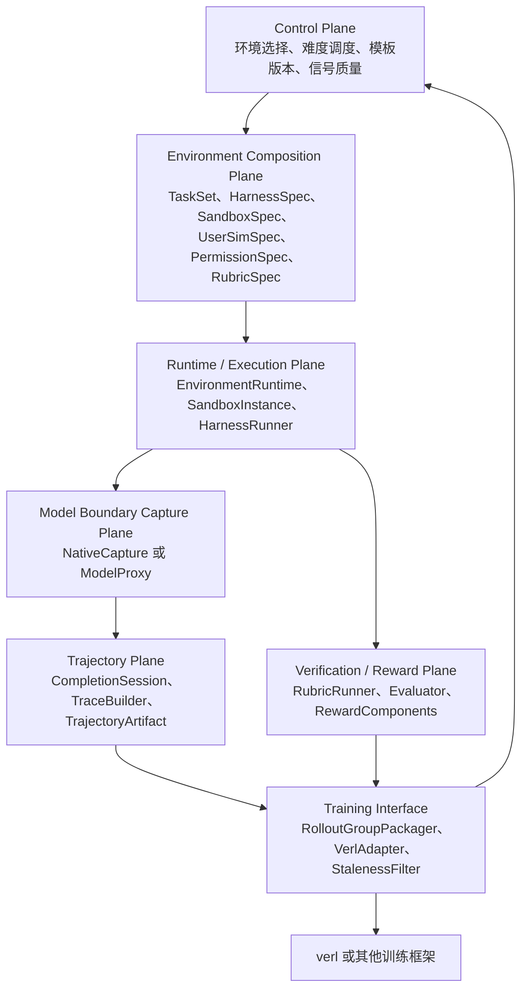

# RepoHarness 项目重新定位与目标架构设计

本文基于以下材料重新思考 RepoHarness 的长期定位和目标架构：

- `docs/harness_improve/polar_advice.md`
- `docs/harness_improve/full_pull_advice.md`
- `docs/harness_improve/2605.24220v1.pdf`
- `docs/harness_improve/env_design.md`
- `docs/harness_improve/harness_design_advice.md`
- `reference/ProRL-Agent-Server`
- `reference/verifiers`
- `reference/research-environments`
- `reference/renderers`
- `reference/mini-swe-agent`

本文刻意先不讨论当前 Stage 16G.3 的具体实施计划，也不受当前代码目录和已有模块边界约束。它只回答一个更上层的问题：

```text
如果从长期个人项目、简历项目和真实 agentic RL 基础设施的角度重新定义 RepoHarness，
这个项目最终应该是什么？应该解决什么问题？目标架构应该如何设计？
```

## 1. 最终结论

我建议将 RepoHarness 的长期定位从：

```text
一个 SWE / Claude Code 风格 harness，加上 verl fully async RL 训练桥接
```

升级为：

```text
面向交互式软件工程智能体强化学习的可组合环境与异步 rollout 基础设施。
```

更完整地说：

```text
RepoHarness 是一个面向 interactive SWE Agent RL 的 composable environment
和 rollout infrastructure。它用 Prime-style 的 TaskSet / Harness / Sandbox /
User / Permission / Rubric 组合方式定义可执行环境，用 Polar-style 的
rollout-as-a-service、model API capture 和 trajectory builder 捕获真实
harness 执行轨迹，并通过一个与训练框架解耦的 verl adapter 输出异步 RL
可以消费的 token-faithful rollout groups。
```

这个定位里的关键词都很重要：

- `composable environment`：RepoHarness 不是一个固定任务 runner，而是一套可以组合任务、用户、权限、沙箱、工具和评分逻辑的环境工厂。
- `interactive SWE Agent RL`：项目重点不是单轮修 bug，而是多轮代码理解、测试、修改、权限请求、用户澄清、错误恢复和最终验证。
- `rollout infrastructure`：训练器不应该直接调用某个 Python 函数跑任务，而应该向 rollout 服务提交任务，异步获得带 lineage、reward、token 和 staleness metadata 的轨迹包。
- `token-faithful`：训练样本里的可训练 token 必须来自行为策略实际采样时的 token ids，不能只保存文本 transcript 然后训练前重新 tokenize。
- `trainer-decoupled`：RepoHarness 的核心环境和 rollout 服务不应该依赖 verl。verl 是第一个训练后端，但不是项目的核心抽象。

## 2. 为什么旧定位不够

旧定位可以概括为：

```text
RepoHarness task -> workspace -> tools -> agent loop -> trajectory -> verifier -> reward -> verl
```

这个闭环是正确的，但它容易把项目理解成一个“带训练导出的 SWE harness”。在早期阶段这样足够清楚，但结合 Polar、Prime Verifiers、Research Environments 和 Renderers 之后，可以看到更大的问题空间：

1. 真实 agent harness 已经很多：Codex-like、Claude-Code-like、OpenCode、Qwen Code、Pi、mini-swe-agent 等都有自己的 agent loop、工具协议、上下文策略和提交方式。如果为了 RL 把它们都重写成 RepoHarness 私有工具接口，会丢失真实 harness 的行为差异。

2. 长程 SWE 任务的训练对象不是单条 prompt，也不是单条最终 patch，而是一个可执行、可恢复、可验证、可版本化的 environment artifact，以及它产生的 rollout lineage。

3. 异步 RL 中，生成、执行、验证、训练不在同一个时钟上运行。一个 rollout 可能由 policy version 114 生成，验证完成时 trainer 已经更新到 policy version 121。因此轨迹必须携带 policy version、rollout step、group id、environment version、verifier version 和 staleness metadata。

4. 多轮工具调用训练不能只依赖文本 transcript。重新渲染历史消息可能改变 token 序列、工具调用格式、布尔值大小写、thinking 保留策略或 BPE 边界。训练样本必须尽量使用行为策略采样时产生的 token ids、logprobs 和 loss mask。

所以新定位不应该是“做一个更复杂的 SWE agent loop”，而应该是：

```text
做一个可以产生、运行、验证、存储并训练交互式 SWE 环境的基础设施。
```

## 3. 外部参考分别解决什么问题

### 3.1 Prime Verifiers：环境内部 ownership 如何拆分

`reference/verifiers/verifiers/v1/README.md` 给出的核心分层非常关键：

- `Taskset` 定义模型要尝试什么。
- `Harness` 定义模型或 agent 如何尝试。
- `Env` 把一个 `Taskset` 和一个 `Harness` 适配到评测或训练 worker API。
- `Task` 是冻结、可序列化的输入数据。
- `State` 是 rollout 过程中的可变输出和运行期句柄入口。

对 RepoHarness 来说，最重要的不是照搬 Verifiers 的类名，而是学习 ownership：

| 对象 | 应该拥有的内容 |
| --- | --- |
| `TaskSet` | 任务数据、任务加载、任务 prompt、任务自带工具、用户模拟、任务级 setup、任务级 metric、任务级 reward、停止条件 |
| `Harness` | rollout 执行协议、agent loop、模型调用、工具循环、外部命令 agent、endpoint interception、主要 sandbox placement、执行产物 |
| `Rubric` | 最终测试、隐藏测试、权限违规检查、用户负担评分、diff 范围检查、测试篡改检查、过程评分 |
| `Env` | 把一个 `TaskSet`、一个 `Harness`、一个 `SandboxSpec`、一个 `Rubric` 组合成训练和评测系统可运行的环境 |

一个简单判断规则是：

```text
如果某个逻辑定义了“这个任务是什么、成功条件是什么、允许观察什么”，它属于 TaskSet 或 Rubric。
如果某个逻辑定义了“一个 agent 如何尝试任意任务”，它属于 Harness。
如果某个逻辑只是把二者接到训练或评测 worker API，它属于 Env。
```

这能防止 RepoHarness 继续膨胀成一个单体对象。

### 3.2 Research Environments：同一 TaskSet 如何接不同 Harness

`reference/research-environments` 展示了 Prime 风格组合在真实环境里的用法。比如 SWE 任务可以通过 `ComposableEnv` 接到 RLM harness，OpenCode harness 或 mini-swe-agent-plus。它的重要启发是：

```text
同一个 SWE TaskSet 可以被不同 Harness 跑：
  SWETaskSet + RepoHarnessNativeHarness
  SWETaskSet + MiniSWEHarness
  SWETaskSet + OpenCodeHarness

同一个 Harness 也可以跑不同 TaskSet：
  RepoHarnessNativeHarness + SWEBenchTaskSet
  RepoHarnessNativeHarness + InteractiveRefactorTaskSet
  RepoHarnessNativeHarness + RepoPermissionTaskSet
```

这说明 RepoHarness 的核心价值不应该绑定在某一个固定 benchmark 上。更好的设计是把任务族、执行 harness、沙箱和 rubric 拆开，让它们可以交叉组合。

### 3.3 Polar / ProRL-Agent-Server：如何把任意已有 harness 接入 RL

Polar 论文和 `reference/ProRL-Agent-Server` 解决的是另一个问题：

```text
给定一个已经存在的 agent harness，如何尽量不改它，
却把它的真实执行轨迹变成 RL 可以训练的 token-level 样本？
```

Polar 的关键选择是把边界放在模型 API 处，而不是工具 API 处。它的基本流程是：

```text
trainer submit TaskRequest
  -> rollout server 展开 session
  -> gateway node 准备 runtime
  -> 执行 agent harness
  -> model API proxy 捕获 completion
  -> trajectory builder 重建 Trace
  -> evaluator 打分
  -> callback 或 trainer bridge 消费结果
```

本地代码中最值得参考的契约是：

- `reference/ProRL-Agent-Server/src/polar/rollout/models.py`：`TaskRequest`、`SessionDispatchRequest`、`SessionResult`、`SessionStatus`。
- `reference/ProRL-Agent-Server/src/polar/trajectory/models.py`：`CompletionRecord`、`CompletionSession`、`Trace`、`Trajectory`。
- `reference/ProRL-Agent-Server/src/polar/trajectory/builder/per_request.py`：每个 completion 变成一个 trace 的保守 builder。
- `reference/ProRL-Agent-Server/src/polar/trajectory/builder/prefix_merging.py`：把多个 completion 合并为更长 token stream 的 builder。
- `reference/ProRL-Agent-Server/src/slime_bridge`：训练框架桥接层如何留在核心 rollout 服务之外。

对 RepoHarness 的启发是：

```text
RepoHarness 自己拥有代码时，可以先做 native capture。
外部 harness 不应该被改写成 RepoHarness 私有工具协议，而应该通过 model proxy 低侵入捕获。
训练器不应该 import RepoHarness 内部对象，而应该消费 TrajectoryArtifact。
```

### 3.4 Renderers：为什么不能随便重新 tokenize transcript

`reference/renderers` 说明了多轮 agent RL 里非常容易被低估的问题：

```text
训练器看到的 token ids 必须和 sampler 当时看到、采样并返回的 token ids 一致。
```

如果只保存 messages，然后训练前用 `apply_chat_template` 重新渲染，可能出现：

- 布尔值从 `false` 变成 `False`。
- 工具调用 XML 或 JSON 的细节被 canonicalize。
- thinking 在历史 assistant 消息中被剥离。
- BPE 边界因为前后空白变化而漂移。
- agent scaffold 在下一轮前重写了历史工具调用。

所以 RepoHarness 的训练轨迹应该以 token ids、logprobs 和 loss mask 为第一等对象，而不是把它们当成后处理产物。

### 3.5 mini-swe-agent：极简 baseline，不是架构目标

`reference/mini-swe-agent` 的价值在于它足够简单：

- 只有 bash 风格动作。
- 历史基本线性追加。
- 每个 action 独立执行。
- 非常适合作为 SWE 修复任务的强 baseline。

RepoHarness 不应该把 mini-swe-agent 当作要复制的目标。更合理的定位是：

```text
mini-swe-agent 是简单 SWE 修复任务的 baseline。
RepoHarness 关注更复杂的 interactive、permissioned、user-aware、long-horizon SWE 环境。
```

## 4. 新项目目标

长期目标可以拆成六个层次。

### 4.1 环境组合目标

RepoHarness 要能定义和运行不同类型的 SWE 环境：

- 真实仓库 bug 修复。
- 多文件重构。
- API 兼容性迁移。
- 测试修复但不能篡改测试。
- 带用户澄清的需求实现。
- 带权限审批的受限修改。
- 带隐藏约束的长期任务。
- 带部分验证、恢复和重试的长程任务。

这些环境不应该硬编码在一个 runner 里，而应该由 `TaskSet`、`SandboxSpec`、`HarnessSpec`、`UserSimSpec`、`PermissionSpec` 和 `RubricSpec` 组合出来。

### 4.2 Harness-native RL 目标

模型不只应该在 RepoHarness 私有工具协议上训练，也应该能在不同 harness 的真实执行路径上训练：

- RepoHarness native harness。
- mini-swe-agent baseline harness。
- OpenCode-like harness。
- 未来可能的 Codex-like 或 Claude-Code-like shell adapter。

这样训练学到的是某个 harness 的真实 action protocol、context policy、patch submission style 和错误恢复方式，而不是一个为了训练临时设计的 DSL。

### 4.3 Token-faithful 训练轨迹目标

每条可训练 trace 应该至少包含：

```text
prompt_ids
response_ids
loss_mask
response_logprobs
prompt_messages
response_messages
tools
finish_reason
reward
metadata
```

这里最重要的是：`response_ids` 必须来自行为策略实际采样的 token，`loss_mask=1` 的位置必须只覆盖模型真正生成、并且允许训练的 token。工具结果、系统插入内容、用户消息、harness interstitial tokens 等都不能被误当作模型可训练输出。

### 4.4 用户与权限目标

RepoHarness 的差异化不应该只来自“能跑测试”，而应该来自更接近真实工程协作的约束：

- 用户可能表达不完整需求。
- 用户有隐藏偏好或隐藏约束。
- 某些修改需要用户批准。
- 某些路径、命令或网络访问被禁止。
- agent 需要在被拒绝后恢复，而不是硬绕过。
- 最终 reward 不只看 patch 是否通过测试，也看是否遵守权限、是否减少用户负担、是否避免无关修改。

这使 RepoHarness 比普通 SWE-Bench runner 更适合作为长期 agentic RL 项目。

### 4.5 异步 rollout 目标

RepoHarness 应该支持训练系统异步提交和消费 rollout：

```text
submit rollout task
  -> session queued
  -> runtime initialized
  -> agent running
  -> postrun building
  -> evaluating
  -> artifact stored
  -> trainer callback or polling
```

每个 rollout group 都应该携带：

```text
group_id
policy_version
rollout_step
task_id
taskset_id
env_id
harness_id
rubric_id
runtime_image_digest
tool_schema_version
verifier_digest
builder_strategy
started_at
completed_at
staleness
```

### 4.6 训练框架解耦目标

verl 是当前最重要的训练后端，但核心环境服务不应该依赖 verl。更好的边界是：

```text
RepoHarness Rollout Service
  -> TrajectoryArtifact
  -> VerlAdapter
  -> verl batch / rollout group
```

未来如果要接别的训练框架，应该新增 adapter，而不是修改核心环境和 rollout 服务。

## 5. 目标架构总览

建议的目标架构如下：



这张图里的反馈箭头很重要。训练结果、reward 质量、失败原因和策略漂移信息应该回到 control plane，用于后续环境选择和难度调度。

## 6. 目标架构分层说明

### 6.1 Control Plane：决定生成和运行什么环境

职责：

- 选择 task family。
- 选择难度。
- 选择 harness。
- 控制同一个任务的 `num_samples`。
- 追踪 environment template version。
- 追踪 reward signal 是否健康。
- 决定哪些环境值得继续采样，哪些环境应该降权或废弃。

可能的核心对象：

```text
EnvRegistry
TaskSetRegistry
HarnessRegistry
RubricRegistry
CurriculumScheduler
DifficultyPolicy
SignalQualityTracker
PolicyVersionTracker
ExperimentPlan
```

这一层不直接执行工具，也不直接跑训练。它只决定“下一批应该生成或运行什么”。

### 6.2 Environment Composition Plane：定义环境由什么组成

职责：

- 定义 `Task` 和 `TaskSet`。
- 定义 sandbox 资源和隔离需求。
- 定义 agent/harness 如何被运行。
- 定义用户模拟和权限策略。
- 定义 rubric 和 reward components。
- 组合出一个可执行的 `ComposableEnvSpec`。

建议核心对象：

```text
Task
TaskSet
State
SandboxSpec
HarnessSpec
UserSimSpec
PermissionSpec
RubricSpec
ArtifactSpec
ComposableEnvSpec
```

一个示例环境可以是：

```yaml
env_id: interactive_payments_refactor_v1
taskset:
  id: interactive_refactor
  task_id: payments_refactor_001
  repo_snapshot: payments_service@template_v3
  prompt: "帮我重构 payments 模块，旧的 PaymentClient 太乱了。"
  hidden_constraints:
    - "不要修改 refunds 模块"
    - "public API 必须保持兼容"
sandbox:
  image: repoharness/python-node-swe:2026-06
  cpu_cores: 4
  memory_gb: 8
  timeout_seconds: 5400
harness:
  id: repoharness_native_v1
  adapter: python_native
  capture: native
user_sim:
  persona: engineering_manager
  approval_style: scoped_and_cautious
permission:
  default: read_only
  edit:
    src/payments/**: require_approval
    src/refunds/**: deny
rubric:
  hidden_tests: hidden_tests/payments
  api_contract: checks/api_contract.py
  permission_checker: strict
  user_burden_weight: 0.15
```

这个例子里，任务、沙箱、harness、用户、权限和评分都是独立可替换的。

### 6.3 Runtime / Execution Plane：把环境物化成真实运行实例

职责：

- 创建或复用 sandbox。
- 准备 repo、依赖和环境变量。
- 暴露工具面。
- 启动 agent harness。
- 管理超时、取消、失败恢复和 artifact 收集。
- 保持 rollout workspace 和 scoring workspace 的边界。

建议核心对象：

```text
EnvironmentRuntime
SandboxInstance
RuntimePool
HarnessRunner
RepoHarnessNativeRunner
ExternalShellHarnessRunner
RuntimeSnapshot
ExecutionEventLog
```

这一层要支持两种 harness：

```text
白盒 harness：
  RepoHarness 自己实现 agent loop，可以直接做 native capture。

黑盒或半黑盒 harness：
  外部命令或外部框架运行，模型调用通过 ModelProxy 捕获。
```

### 6.4 Model Boundary Capture Plane：捕获模型调用

这是 Polar 对 RepoHarness 最大的新增启发。

目标不是在工具层理解所有 agent 行为，而是在模型 API 边界捕获训练所需的 token 信息。

第一阶段可以有两种 capture：

```text
NativeCapture:
  RepoHarness 自己拥有模型调用代码，所以直接记录 prompt_ids、response_ids、logprobs、tools 和 messages。

OpenAICompatibleModelProxy:
  外部 harness 通过 OPENAI_BASE_URL 指向本地 proxy。
  proxy 转发请求到真实 inference backend，同时记录 completion。
```

未来再扩展：

```text
Anthropic Messages proxy
OpenAI Responses proxy
Google generateContent proxy
provider-specific token extraction
```

建议核心对象：

```text
CompletionRecord
CompletionSession
ProviderRequestNormalizer
ProviderResponseAdapter
TokenIdExtractor
ModelProxySessionRegistry
CaptureStore
```

重要原则：

```text
能从 inference backend 拿到 prompt token ids 和 sampled token ids，就不要重新 tokenize。
能拿到 sampled token logprobs，就必须和 response_ids 逐位置对齐。
拿不到 token ids 的轨迹，可以用于调试、评测或 SFT 候选，但不应该默认进入 policy loss。
```

### 6.5 Trajectory Plane：把 completion 和事件变成训练 artifact

职责：

- 把模型 completion 记录转成 trace。
- 对齐 token ids、logprobs 和 loss mask。
- 记录工具、消息、事件、workspace diff 和 verifier 输出。
- 生成 trainer-facing artifact。

建议核心对象：

```text
Trace
Trajectory
TrajectoryBuilder
PerRequestBuilder
PrefixMergingBuilder
TrajectoryArtifact
ArtifactStore
RendererBridgeMetadata
```

第一版建议先实现：

```text
PerRequestBuilder
```

它最保守，每个模型 completion 产生一个 trace，适合调试和建立数据契约。但必须注意：

```text
不要把最终 session-level reward 盲目广播到每个 per-request trace 后直接做 policy loss。
```

Polar 论文和建议文档都指出，长轨迹里这样做会造成 credit assignment 噪声，并可能带来 reward hacking。

第二版再实现：

```text
PrefixMergingBuilder
```

它把多个 completion 合并成更长序列：

```text
初始 prompt ids
  + sampled assistant response ids，loss_mask=1
  + harness/tool/user 插入内容，loss_mask=0
  + sampled assistant response ids，loss_mask=1
  + ...
```

这可以减少训练碎片化，提高长程 rollout 的样本效率。

### 6.6 Verification / Reward Plane：把结果和过程变成可信训练信号

职责：

- 运行 public tests。
- 运行 hidden tests。
- 检查 forbidden diff。
- 检查测试是否被篡改。
- 检查权限是否被绕过。
- 评估用户交互质量。
- 产出 reward components。
- 决定 trajectory 是否可用于训练。

建议核心对象：

```text
RubricRunner
EvaluatorRegistry
RewardComponent
RewardPolicy
TrainingEligibilityPolicy
CleanPatchReplayEvaluator
PermissionViolationChecker
UserBurdenScorer
AntiTamperChecker
```

reward 不应该只有一个 `resolved: true/false`。更适合 RepoHarness 的 reward components 是：

```yaml
reward_components:
  hidden_tests_passed: 1.0
  public_tests_preserved: 1.0
  forbidden_diff: 0.0
  permission_violation: 0.0
  test_tampering: 0.0
  user_burden: -0.1
  unnecessary_file_churn: -0.05
  final_reward: 0.85
training_eligibility:
  policy_loss_candidate: true
  invalid_for_training: false
  invalid_for_online_rl: false
  reason: null
```

这样可以把“修对代码”和“按真实工程约束修代码”同时纳入训练信号。

### 6.7 Training Interface：向 verl 输出异步 RL 可消费对象

职责：

- 把 trajectory artifacts 打包成 rollout groups。
- 标记 policy version、rollout step、group id。
- 根据 staleness 过滤或降权。
- 做 reward normalization。
- 转换成 verl 需要的数据结构。
- 保持核心 rollout 服务和 verl 解耦。

建议核心对象：

```text
RolloutGroupArtifact
RolloutGroupPackager
StalenessFilter
RewardNormalizer
VerlAdapter
TrainingBatchProjection
```

这层可以直接借鉴 Polar 的训练框架 bridge 思路：核心服务只产出通用 trajectory，verl adapter 负责把它投影成 verl batch。

## 7. 端到端数据流

目标数据流应该是：

```text
1. Trainer 或 ExperimentPlan 请求一组 rollout

2. Control Plane 选择任务、难度、harness 和 policy version

3. RolloutServer 接收 RolloutTaskRequest

4. GatewayWorker 创建多个 session

5. Runtime 初始化 sandbox 和 repo workspace

6. HarnessRunner 执行 RepoHarness native harness 或外部 harness

7. NativeCapture 或 ModelProxy 捕获每次模型调用

8. TrajectoryBuilder 构造 token-faithful Trace

9. RubricRunner 在 rollout workspace 或干净 scoring workspace 上验证

10. ArtifactStore 写入 TrajectoryArtifact、workspace diff、event log、score report

11. VerlAdapter 读取 eligible artifacts，生成 rollout group batch

12. Trainer 消费 batch，更新 policy

13. SignalQualityTracker 汇总训练反馈，影响下一轮环境选择
```

可以用一句话理解：

```text
Control Plane 决定跑什么，Environment Composition Plane 定义环境是什么，
Runtime Plane 把环境跑起来，Capture Plane 抓住模型真实 token，
Trajectory Plane 变成训练样本，Verification Plane 决定奖励和资格，
Training Interface 把结果交给 verl。
```

## 8. 核心数据契约草案

### 8.1 RolloutTaskRequest

```python
class RolloutTaskRequest:
    task_id: str
    instruction: str
    num_samples: int
    timeout_seconds: float
    env: ComposableEnvSpec
    harness: HarnessSpec
    builder: TrajectoryBuilderSpec
    evaluator: EvaluatorSpec
    callback_url: str | None
    metadata: RolloutMetadata
```

### 8.2 HarnessSpec

```python
class HarnessSpec:
    harness_id: str
    adapter: Literal["python_native", "shell_command", "external_service"]
    command: list[str] | None
    model_capture: Literal["native", "openai_proxy", "anthropic_proxy", "none"]
    model_name: str
    tool_surface: str
    env: dict[str, str]
    timeout_seconds: float
    artifacts: list[ArtifactSpec]
```

### 8.3 CompletionRecord

```python
class CompletionRecord:
    session_id: str
    completion_id: str
    request_timestamp: str
    response_timestamp: str
    provider_api: str
    model_requested: str
    model_used: str
    prompt_messages: list[dict]
    response_messages: list[dict]
    tools: list[dict] | None
    prompt_ids: list[int]
    response_ids: list[int]
    response_logprobs: list[float] | None
    finish_reason: str | None
    raw_request_ref: str
    raw_response_ref: str
    metadata: dict
```

### 8.4 TrainTrace

```python
class TrainTrace:
    prompt_ids: list[int]
    response_ids: list[int]
    loss_mask: list[int]
    response_logprobs: list[float] | None
    prompt_messages: list[dict]
    response_messages: list[dict]
    tools: list[dict] | None
    reward: float | None
    reward_components: dict[str, float]
    metadata: dict
```

### 8.5 TrajectoryArtifact

```python
class TrajectoryArtifact:
    artifact_id: str
    env_id: str
    task_id: str
    taskset_id: str
    harness_id: str
    rubric_id: str
    policy_version: int | str
    rollout_step: int
    group_id: str
    builder_strategy: str
    traces: list[TrainTrace]
    event_log_ref: str
    workspace_diff_ref: str | None
    score_report_ref: str
    runtime_metadata: dict
    training_eligibility: dict
```

## 9. 应该借鉴什么，不应该照搬什么

### 9.1 从 Prime 借鉴

应该借鉴：

- `TaskSet` 和 `Harness` 的 ownership 分离。
- `Task` 作为冻结、可序列化输入。
- `State` 作为 rollout 输出和运行期句柄入口。
- `Env` 只负责适配一个 taskset/harness pair。
- Rubric 拥有 scoring，而不是让 harness 自己决定成功。
- 同一个 taskset 可接不同 harness，同一个 harness 可跑不同 taskset。

不应该照搬：

- 不必完全复制 Verifiers 的 package、registry、CLI 和发布流程。
- 不必立即迁移到它的所有基类和装饰器风格。
- 不必把 RepoHarness 的权限和用户模拟硬塞进它已有概念，而应该根据 SWE 权限训练目标设计自己的 `UserSimSpec` 和 `PermissionSpec`。

### 9.2 从 Polar 借鉴

应该借鉴：

- rollout-as-a-service 的服务边界。
- `TaskRequest -> Session -> Gateway -> Runtime -> Trajectory -> Evaluator -> Callback` 的 lifecycle。
- model API boundary capture，而不是强迫外部 harness 改工具协议。
- `Trace` 里的 `prompt_ids`、`response_ids`、`loss_mask`、`response_logprobs`。
- `group_id`、`policy_version`、`rollout_step` 等异步训练 metadata。
- 训练框架 bridge 放在核心服务之外。

不应该照搬：

- 不要一开始做完整分布式 gateway 集群。
- 不要一开始支持所有 provider API。
- 不要一开始做 dashboard。
- 不要直接采用“把 outcome reward 广播到每个 per-request trace”的默认训练策略。
- 不要把 Polar 当作环境组合模型。Polar 更偏 rollout substrate，不负责定义 SWE task ownership。

### 9.3 从 Renderers 借鉴

应该借鉴：

- 训练 token 必须来自采样时的真实 token ids。
- loss mask 应该区分 sampled assistant tokens 和 template/harness 插入 token。
- 多轮续上下文需要避免重新渲染已有 sampled history。
- renderer/tokenizer 版本应该进入 artifact metadata。

不应该照搬：

- 第一版不需要实现完整 renderer 库。
- 第一版可以先依赖 inference backend 或 proxy 返回的 token ids。
- 只有当要支持更复杂模型模板、tool call 或 prefix merging 时，再把 renderer bridge 作为核心实现。

### 9.4 从 mini-swe-agent 借鉴

应该借鉴：

- bash-only baseline 的简单性。
- 线性 history 易于调试和训练。
- 独立命令执行比长期 shell session 更稳定。

不应该照搬：

- 不要把项目目标降级为 bash-only SWE 修复器。
- 不要放弃用户模拟、权限系统、hidden constraints、长程 artifact 和异步训练 metadata。
- 不要把 baseline 的简洁性误认为最终架构的充分性。

## 10. 推荐里程碑

下面是暂时不受当前代码阶段约束的目标路线图。它不是现有 Stage 16G.3 的替代执行清单，而是确认新定位后可以反推的新阶段方向。

### Milestone 1：写清楚新架构契约

产物：

- `ComposableEnvSpec` 草案。
- `HarnessSpec` 草案。
- `RubricSpec` 草案。
- `CompletionRecord` 草案。
- `TrainTrace` 草案。
- `TrajectoryArtifact` 草案。

完成标准：

```text
不看当前代码，也能解释一个 SWE 环境如何由 TaskSet、Harness、Sandbox、User、Permission、Rubric 组成。
```

### Milestone 2：实现最小 composable domain model

产物：

- `Task`、`TaskSet`、`State`。
- `SandboxSpec`。
- `HarnessSpec`。
- `UserSimSpec`。
- `PermissionSpec`。
- `RubricSpec`。
- `ComposableEnvSpec`。

完成标准：

```text
同一个 TaskSet 可以换 Harness。
同一个 Harness 可以换 TaskSet。
Rubric 可以独立于 Harness 运行。
```

### Milestone 3：RepoHarness native harness 作为第一个白盒 Harness

产物：

- `RepoHarnessNativeHarness`。
- native capture。
- 最小 `TrainTrace` 输出。
- hidden test rubric。
- permission/user reward components。

完成标准：

```text
RepoHarness 自己的 agent loop 能产出 token-faithful trace，
并且 trace 能说明哪些 token 可以进 policy loss。
```

### Milestone 4：单进程 Rollout Service

产物：

- `repo-rollout submit`。
- `repo-rollout status`。
- `repo-rollout worker`。
- 本地 artifact store。

完成标准：

```text
训练器或命令行可以提交 RolloutTaskRequest，
不需要直接 import RepoHarness 内部 runner。
```

### Milestone 5：OpenAI-compatible Model Proxy

产物：

- 支持 `/v1/chat/completions`。
- 支持 session id 绑定。
- 支持 request/response capture。
- 支持 prompt ids、response ids、logprobs 提取。

完成标准：

```text
至少一个外部 harness 可以通过 OPENAI_BASE_URL 指向 proxy，
并产生可审计 CompletionRecord。
```

### Milestone 6：TrajectoryBuilder v1

产物：

- `PerRequestBuilder`。
- reward 不盲目广播的 eligibility policy。
- trace validation。
- artifact manifest。

完成标准：

```text
每次 completion 可以稳定变成 TrainTrace，
但只有满足 token provenance 和 reward policy 的 trace 才能进入 policy loss。
```

### Milestone 7：verl adapter

产物：

- `RolloutGroupPackager`。
- `StalenessFilter`。
- `RewardNormalizer`。
- `VerlAdapter`。

完成标准：

```text
verl 只消费通用 TrajectoryArtifact，
不依赖 RepoHarness 内部对象。
```

### Milestone 8：PrefixMergingBuilder 和长程训练优化

产物：

- prefix chain 检查。
- sampled assistant token 保真。
- interstitial token loss_mask=0。
- reconstruction stats。

完成标准：

```text
长程 SWE rollout 不再被碎片化成大量短 trace，
并且不会重新 tokenize 模型已经采样过的历史。
```

### Milestone 9：多 harness 对照实验

产物：

- RepoHarness native harness。
- MiniSWEHarness。
- OpenCode-like 或 shell harness。
- 相同 TaskSet 上的对照报告。

完成标准：

```text
可以回答“模型在不同 harness protocol 下学到了什么差异”。
```

## 11. 主要风险和设计防线

### 11.1 过早复刻 Polar 分布式系统

风险：

```text
还没有稳定的环境契约和 token trace，就先做 gateway 集群、dashboard、多 provider proxy。
```

防线：

```text
先做单进程 Polar-lite。确认 artifact、capture、rubric 和 adapter 都正确后，再扩展分布式能力。
```

### 11.2 TaskSet 和 Harness ownership 混乱

风险：

```text
任务 prompt、权限、用户模拟、hidden tests、agent loop、工具执行全部塞进一个对象。
```

防线：

```text
凡是定义任务成功条件的，放 TaskSet 或 Rubric。
凡是定义 agent 如何行动的，放 Harness。
Env 只组合，不拥有领域逻辑。
```

### 11.3 Retokenization drift

风险：

```text
只保存 transcript，训练前重新 tokenize，导致 sampled token 和训练 token 不一致。
```

防线：

```text
CompletionRecord 必须保存 prompt_ids、response_ids、response_logprobs。
无法证明 token provenance 的轨迹不能默认进入 policy loss。
```

### 11.4 Reward 广播导致 reward hacking

风险：

```text
一个长程 session 最终成功，就把 reward=1.0 广播到每个 request trace。
```

防线：

```text
第一版 per_request trace 主要用于 debug、SFT 候选和离线分析。
进入 online RL 前必须有 session-level reward policy、trace-level reward attribution 或 prefix merging。
```

### 11.5 用户和权限系统沦为日志字段

风险：

```text
权限审批、用户澄清和隐藏约束只被记录在 metadata 里，不影响 reward 和训练资格。
```

防线：

```text
UserSimSpec、PermissionSpec 和 RubricSpec 必须共同产出 reward components 与 training eligibility。
```

### 11.6 训练框架耦合过深

风险：

```text
核心环境服务直接 import verl，导致未来无法独立评测、复用或接别的 trainer。
```

防线：

```text
核心服务输出 TrajectoryArtifact。
verl 只通过 VerlAdapter 消费 artifact。
```

## 12. 判断设计是否成功的验收问题

如果新架构方向是合理的，应该能回答以下问题：

1. 同一个 SWE TaskSet 能不能分别用 RepoHarness native harness 和 mini-swe-agent baseline 跑？

2. 同一个 RepoHarness native harness 能不能换不同 TaskSet，比如 SWE-Bench、交互式重构、权限约束任务？

3. 一个外部 harness 能不能不改工具 loop，只通过 model proxy 产出 CompletionRecord？

4. 每条进入 policy loss 的 trace 能不能证明 `response_ids` 来自行为策略真实采样？

5. loss mask 能不能明确区分模型生成 token、工具结果 token、用户 token 和 harness 插入 token？

6. Rubric 能不能独立运行，不依赖 harness 自己声明成功？

7. 用户模拟和权限系统能不能影响 reward 和训练资格，而不是只影响日志？

8. trainer 能不能只消费 TrajectoryArtifact，而不 import RepoHarness 内部 runner？

9. artifact 能不能追踪 `taskset_id`、`harness_id`、`rubric_id`、`policy_version`、`rollout_step`、`builder_strategy` 和 verifier 版本？

10. 当 rollout 过旧、验证失败、token provenance 不完整或权限违规时，系统能不能 fail closed，拒绝进入 online policy loss？

如果这些问题都能正面回答，RepoHarness 就不再只是一个 harness，而是一套可以长期演进的 agentic RL environment infrastructure。

## 13. 推荐的新项目叙事

面向简历、项目主页或长期设计文档，可以这样描述：

```text
RepoHarness is a composable rollout infrastructure for interactive software
engineering agent reinforcement learning. It factors SWE environments into
TaskSets, Harnesses, Sandbox specs, User simulators, Permission policies and
Rubrics, then runs them through a Polar-style rollout service that captures
token-faithful model interactions and exports asynchronous rollout groups to
verl.
```

中文版本：

```text
RepoHarness 是一个面向交互式软件工程智能体强化学习的可组合环境与 rollout
基础设施。它把 SWE 环境拆成任务族、执行 harness、沙箱、用户模拟、权限策略和
评分规则，并通过 Polar-style rollout 服务捕获真实 harness 的 token-faithful
模型交互轨迹，最终导出给 verl 这类异步强化学习训练框架消费的 rollout groups。
```

更短的版本：

```text
RepoHarness = Prime-style composable SWE environments
            + Polar-style rollout-as-a-service and model-call capture
            + permission-aware, user-aware, token-faithful RL artifacts
            + verl adapter
```

## 14. 下一步应该做什么

在确认这篇定位文档的方向没有明显问题之后，下一步才应该回到当前代码库，做一次“现有模块到新目标架构”的映射：

```text
当前哪些模块属于 TaskSet？
哪些模块属于 Harness？
哪些模块属于 Runtime？
哪些模块属于 Rubric？
哪些模块属于 Trajectory Plane？
哪些模块属于 Training Interface？
哪些模块只是旧阶段 acceptance 或 compatibility？
```

然后再决定重构顺序。这个顺序很重要，因为如果一边看当前代码一边定义新架构，很容易被已有模块边界拖住，继续强化旧的 monolithic harness 形态。

## 15. 本文的设计判断

我的判断是：

```text
Prime-style composable environment
  + Polar-style rollout-as-a-service / model proxy
  + renderers-style token fidelity
  + verl adapter
```

这个方向是合理的，而且比“RepoHarness 接 verl”更适合作为长期项目定位。

原因是：

1. Prime-style composition 解决了“环境是什么、各部分谁负责”的问题。

2. Polar-style rollout 解决了“如何低侵入训练真实 harness”的问题。

3. Renderers-style token fidelity 解决了“训练 token 是否等于行为策略 token”的问题。

4. verl adapter 解决了“如何把这些轨迹接入当前训练后端”的问题。

5. RepoHarness 自己的用户模拟、权限系统、隐藏约束和 SWE 验证能力，提供了区别于普通 SWE-Bench runner 或 bash-only baseline 的研究价值。

因此，后续架构改造不应该只是继续给现有工具表面加能力，而应该围绕这条新主线推进：

```text
先把环境 ownership 拆清楚，
再把 rollout 服务边界立起来，
再把 token-faithful trajectory 契约做实，
最后把 verl 作为 adapter 接入，而不是让 verl 反过来定义 RepoHarness。
```

## 16. 审核后补充：必须写进架构的硬边界

独立设计复核线程和外部代码参考复核线程都认为，本文的长期方向不需要推翻，但有几类边界必须从“设计原则”升级为“数据契约和验收门槛”。这些内容不改变前面的总体架构，而是防止后续实现时把关键安全和训练资格约束弱化成普通 metadata。

### 16.1 训练资格硬门槛

任何进入 formal online policy loss 的轨迹，至少必须同时满足以下条件：

```text
1. token provenance 完整
   response_ids 来自行为策略真实采样、native capture、proxy capture
   或可证明安全的 renderer bridge。

2. logprob 对齐完整
   response_logprobs 与 response_ids 长度一致；
   缺失逐 token logprob 的轨迹不能默认进入 formal online RL。

3. loss mask 可解释
   loss_mask=1 的位置只能覆盖模型真实生成且允许训练的 assistant token；
   tool result、user message、system scaffold、harness interstitial 必须 loss_mask=0。

4. reward scope 清楚
   必须知道 reward 是 session-level、trace-level、group-level 还是 process-level；
   只有 outcome reward 且没有可靠 credit assignment 时，不能把 reward 盲目广播到每个 per-request trace。

5. hidden verifier 未泄漏
   hidden tests、gold patch、grader-only files、runtime-private audit 不得进入 rollout workspace 或 model-visible projection。

6. clean grading 成立
   最终评分必须能在 clean grader checkout 中重放 cleaned final patch，而不是信任 rollout workspace 的当前状态。

7. 权限和篡改检查通过
   permission violation、forbidden diff、test tampering、hidden artifact access 都必须直接影响 training eligibility。

8. policy staleness 在阈值内
   staleness 不能只记录不用；超过阈值时，轨迹应降级为离线分析、SFT 候选或完全拒绝训练。
```

对应的训练资格可以分成三档：

```text
online_policy_loss_eligible:
  token、logprob、loss mask、reward、security 和 staleness 都满足硬门槛。

offline_or_sft_candidate:
  轨迹有调试或 warm-start 价值，但缺少 formal online RL 所需的完整 provenance。

audit_only_or_rejected:
  轨迹只可用于审计、错误分析或完全丢弃，不能进入训练。
```

### 16.2 Artifact And Visibility Safety Plane

新架构应该把 artifact 和 visibility 作为独立安全平面，而不是把它们只当成 Rubric 的附属细节。

必须坚持的不可变边界：

```text
rollout workspace:
  agent 可以读写的 candidate workspace。

grader workspace:
  verifier 使用的 clean checkout，只接收 cleaned final patch。

runtime-private artifact:
  原始命令输出、完整审计日志、隐藏 verifier 细节、真实路径、调试 dump。

public projection:
  可以写入训练样本、报告或模型可见上下文的脱敏视图。

model-visible artifact:
  agent 在 rollout 中可以读取的工具结果或公开环境反馈。
```

新增或重构任何 artifact 流程时，都应该有以下检查：

```text
1. public projection 扫描本机路径、hidden marker、grader-only marker、secret-like value。
2. runtime-private artifact 只能通过 opaque ref 被公开文件引用。
3. hidden verifier 不挂载到 rollout workspace。
4. final patch 从 candidate workspace 导出后，在 clean checkout 中重放评分。
5. artifact manifest 记录 source digest、schema version、visibility class 和 producer。
6. inspector 重新计算 digest、验证字段白名单、扫描 forbidden marker，而不是只相信 summary status。
```

### 16.3 Token provenance 字段应进入一等数据契约

前文的 `CompletionRecord`、`TrainTrace` 和 `TrajectoryArtifact` 草案应补充以下字段，避免后续实现把关键训练资格信息塞进松散 metadata。

`CompletionRecord` 建议增加：

```python
class CompletionRecord:
    tokenization_source: Literal[
        "native_capture",
        "proxy_capture",
        "renderer_bridge",
        "full_rerender",
        "unknown",
    ]
    tokenizer_name: str | None
    tokenizer_revision: str | None
    renderer_name: str | None
    renderer_version: str | None
    bridge_status: Literal[
        "not_needed",
        "bridged_exact",
        "fallback_full_rerender",
        "unsafe_or_unavailable",
    ]
    token_provenance_status: Literal[
        "behavior_policy_exact",
        "renderer_bridge_exact",
        "retokenized_ineligible",
        "missing_token_ids",
        "unknown",
    ]
    logprob_alignment_status: Literal[
        "aligned",
        "missing_logprobs",
        "length_mismatch",
        "unknown",
    ]
```

`TrainTrace` 建议增加：

```python
class TrainTrace:
    loss_mask_policy: str
    reward_scope: Literal[
        "trace_level",
        "session_level",
        "group_level",
        "process_level",
        "none",
    ]
    credit_assignment_strategy: Literal[
        "direct_trace_reward",
        "prefix_merged_session_reward",
        "group_normalized",
        "debug_only_no_policy_loss",
        "unknown",
    ]
    training_eligibility_class: Literal[
        "online_policy_loss_eligible",
        "offline_or_sft_candidate",
        "audit_only_or_rejected",
    ]
```

`TrajectoryArtifact` 建议增加：

```python
class TrajectoryArtifact:
    artifact_visibility_class: Literal[
        "public_projection",
        "model_visible",
        "runtime_private",
        "grader_only",
    ]
    public_projection_scan_status: Literal[
        "passed",
        "failed",
        "not_applicable",
    ]
    hidden_verifier_isolation_status: Literal[
        "isolated",
        "violation",
        "not_checked",
    ]
    clean_grading_replay_status: Literal[
        "passed",
        "failed",
        "not_run",
    ]
    policy_staleness_class: Literal[
        "fresh",
        "stale_downweight",
        "stale_reject",
        "unknown",
    ]
```

这些字段的目的不是让 schema 变漂亮，而是让 inspector 和 training eligibility 可以 fail closed。

### 16.4 Model Proxy 不是万能 token extractor

Polar-style model proxy 的价值是低侵入捕获外部 harness 的模型边界，但它不能自动保证所有轨迹可训练。

必须明确：

```text
1. proxy 可以捕获 request / response，不代表一定拿得到 prompt token ids。
2. proxy 可以捕获 sampled text，不代表一定拿得到 sampled response token ids。
3. proxy 可以要求 logprobs，不代表所有后端都会返回逐 token logprob。
4. proxy 看不到外部 harness 是否在下一轮前重写历史、压缩上下文、修补 tool call 或丢弃 thinking。
5. 捕获失败时，轨迹应降级为 debug / eval / offline candidate，不能默认进入 online policy loss。
```

因此，外部 harness 的 capture diagnostics 应该记录：

```text
provider_api
request_transform
response_transform
prompt_token_ids_available
response_token_ids_available
logprobs_available
history_rewrite_detected
context_compaction_detected
tool_call_repair_detected
training_eligibility_after_capture
```

### 16.5 外部 harness 集成边界

长期项目可以研究 Codex-like、Claude-Code-like、OpenCode、mini-swe-agent 等 harness 的行为差异，但必须把“适配”和“复刻”分清楚。

设计边界建议如下：

```text
1. RepoHarness 可以提供 adapter、command runner、model proxy 和 artifact collector。
2. RepoHarness 不应复制闭源产品实现，也不应把第三方私有协议声明为自己的公共接口。
3. 对第三方开源 harness，应记录 license、commit、adapter version、local modifications 和 redistribution boundary。
4. 对闭源或商业工具，只应通过用户本地已安装命令、公开 API 或用户显式配置运行。
5. 文档中使用 Codex-like、Claude-Code-like 时，应表示协议风格或行为对照，不表示项目拥有这些产品实现。
6. proxy 日志必须脱敏，避免保存用户真实凭据、商业 provider key、私有 repo 内容或不可公开服务响应。
7. 外部 harness 产出的轨迹，默认先进入 audit / eval / offline candidate；只有 token provenance、许可边界和训练资格都满足时，才可进入 formal online RL。
```

这部分不是法律意见，而是工程设计中的安全边界。它能避免项目后续因为外部工具适配而把长期架构建立在不可复现、不可发布或不可训练的数据来源上。

### 16.6 Control Plane 的第一版范围

前文提到的 `CurriculumScheduler`、`DifficultyPolicy`、`SignalQualityTracker` 和 `ExperimentPlan` 是长期目标，不应该成为第一版重构的前置条件。

第一版只需要：

```text
静态 EnvRegistry
静态 TaskSetRegistry
静态 HarnessRegistry
手工选择 task family
基础 artifact eligibility report
基础 signal summary
```

等 native capture、artifact safety、rollout service 和 verl adapter 都跑通之后，再引入自动 curriculum 和 signal quality tracking。这样可以避免 control plane 抢在底层训练样本可信之前过度膨胀。
