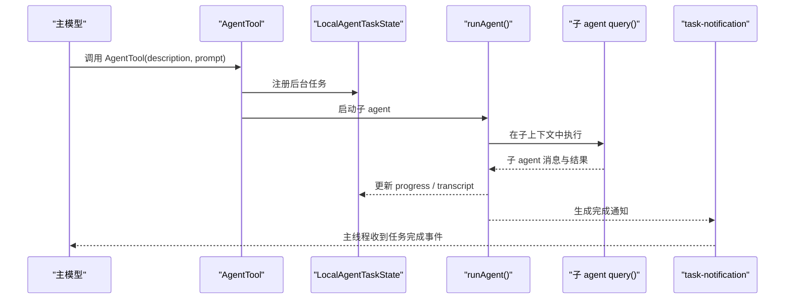
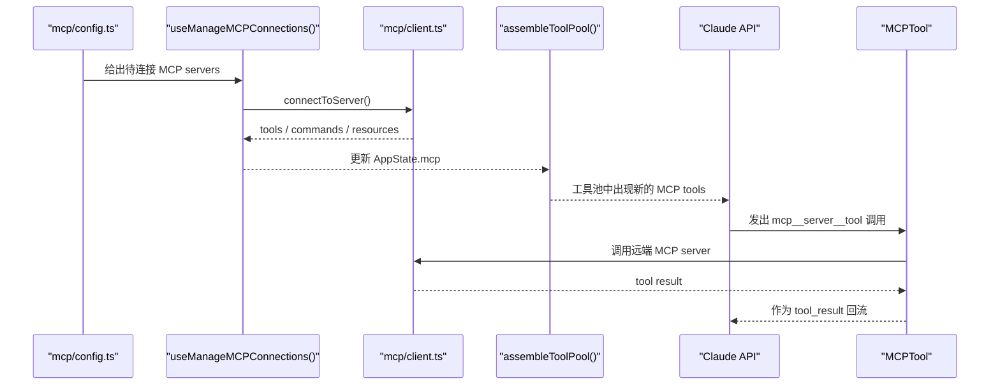

# 端到端 AI 时序

## 这篇解决什么问题

前面几篇是按模块拆解。

这一篇反过来做：不再按目录讲，而是按真实运行场景讲。

目标是把你前面看到的这些模块：

- `main.tsx`
- `QueryEngine`
- `query()`
- `Tool`
- 权限系统
- `AgentTool`
- MCP runtime

重新串成 4 条完整时序。

## 核心类型与职责

| 类型 | 作用 |
| --- | --- |
| `QueryParams` | 一轮 query 的输入 |
| `ToolUseContext` | query 与工具共享的运行时上下文 |
| `ToolPermissionContext` | 权限模式与规则集合 |
| `LocalAgentTaskState` | 本地后台 agent 的状态承载 |
| `ScopedMcpServerConfig` | MCP server 的来源化配置 |

## 场景一：普通 prompt 到模型响应

### 这条链想说明什么

这一条链展示 Claude Code 在没有工具调用时，最纯粹的一次模型回合是怎么跑的。

### 简化时序

```mermaid
sequenceDiagram
    participant User as "User"
    participant Entry as "main.tsx / QueryEngine"
    participant Input as "processUserInput()"
    participant Loop as "query()"
    participant Model as "Claude API"

    User->>Entry: 输入 prompt
    Entry->>Input: 预处理输入
    Input-->>Entry: messages / shouldQuery
    Entry->>Loop: QueryParams
    Loop->>Model: systemPrompt + messages + tools
    Model-->>Loop: assistant text
    Loop-->>Entry: assistant message
    Entry-->>User: 响应输出
```

### 控制流分步讲解

1. 启动层已经决定本次会话是 interactive 还是 headless。
2. 用户输入进入 `processUserInput()`。
3. 输入被转成统一消息，并决定 `shouldQuery`。
4. `fetchSystemPromptParts()` 生成稳定前缀。
5. `QueryEngine` 或 REPL 将这些内容装成 `QueryParams`。
6. `query()` 调用模型 API。
7. 如果输出只有 text，没有 `tool_use`，本轮直接结束。

### 关键源码

- `src/utils/processUserInput/processUserInput.ts`
- `src/utils/queryContext.ts`
- `src/QueryEngine.ts`
- `src/query.ts`

### 容易忽略的点

- 用户输入不是直接喂给模型，而是先进入消息系统。
- `QueryEngine` 不负责推理本身，只负责会话宿主工作。
- `query()` 只有在 `shouldQuery` 为真时才真正运行。

## 场景二：一次 `tool_use` 往返

### 这条链想说明什么

这一条链展示 Claude Code 的核心 agent loop：

`assistant -> tool_use -> tool_result -> assistant`

### 简化时序

```mermaid
sequenceDiagram
    participant User as "User"
    participant Loop as "query()"
    participant Model as "Claude API"
    participant Perm as "permissions.ts"
    participant ToolExec as "toolExecution.ts"
    participant Tool as "具体 Tool"

    User->>Loop: 新一轮输入已准备好
    Loop->>Model: 发送 messages + tools
    Model-->>Loop: assistant + tool_use
    Loop->>Perm: canUseTool()
    Perm-->>Loop: allow / ask / deny
    Loop->>ToolExec: runToolUse()
    ToolExec->>Tool: call()
    Tool-->>ToolExec: output
    ToolExec-->>Loop: tool_result message
    Loop->>Model: 下一轮带 tool_result 的 messages
    Model-->>Loop: assistant follow-up
```

### 控制流分步讲解

1. `query()` 流式接收 assistant 输出。
2. 一旦发现 `tool_use`，进入工具执行路径。
3. 若启用 streaming executor，则尽早启动工具。
4. 否则，收集完 tool_use blocks 再交给 `runTools()`。
5. `toolExecution.ts` 负责 schema 校验、hooks、权限、真正执行、结果映射。
6. 工具结果会被封装成 `tool_result` 用户消息。
7. 这些消息再经 `normalizeMessagesForAPI()` 进入下一轮。

### 关键源码

- `src/query.ts`
- `src/services/tools/StreamingToolExecutor.ts`
- `src/services/tools/toolOrchestration.ts`
- `src/services/tools/toolExecution.ts`
- `src/utils/permissions/permissions.ts`

### 这条链最重要的理解

- 工具结果不是旁路输出，而是下一轮模型上下文。
- 权限判断发生在真正执行之前，不是执行之后补救。
- 并发能力不是系统统一开关，而是工具自己声明。

## 场景三：`AgentTool` 启动本地后台 agent

### 这条链想说明什么

这一条链展示 Claude Code 怎么把“再开一个 agent 去做事”实现成真实系统行为，而不是抽象概念。

### 简化时序



### 控制流分步讲解

1. 主模型通过 `AgentTool` 选择 agent 类型与运行方式。
2. 如果是 async local path，会先注册 `LocalAgentTaskState`。
3. `runAgent()` 创建子 agent id、上下文、模型、权限模式与可用工具。
4. 子 agent 内部仍然调用同一套 `query()`。
5. 生命周期管理器持续更新 progress。
6. 完成后生成 `task-notification`，而不是直接把整段 transcript 粘回主线程。
7. 主线程在后续 turn 中消费这条结构化通知。

### 关键源码

- `src/tools/AgentTool/AgentTool.tsx`
- `src/tools/AgentTool/runAgent.ts`
- `src/tasks/LocalAgentTask/LocalAgentTask.tsx`
- `src/tools/SendMessageTool/SendMessageTool.ts`

### 这条链最重要的理解

- `AgentTool` 是编排入口，不是执行器本身。
- 子 agent 仍然复用 `query()`。
- task system 让后台 agent 变成可继续、可恢复、可追踪的 actor。

## 场景四：MCP server 提供新工具并进入一次对话

### 这条链想说明什么

这一条链展示 Claude Code 的扩展面不是“预定义好工具再调用”，而是 runtime 可以接入新工具面。

### 简化时序



### 控制流分步讲解

1. `config.ts` 汇总多来源 MCP 配置。
2. `useManageMCPConnections()` 计算需要连接的 servers。
3. `client.ts` 建立连接并拉取 tools/commands/resources。
4. 这些能力写入 `AppState.mcp`。
5. `assembleToolPool()` 把内建 tools 与 MCP tools 合并。
6. 模型在下一轮看到新增的 `mcp__...` 工具。
7. 远端执行结果经 `MCPTool` 包装后回流成标准 `tool_result`。

### 关键源码

- `src/services/mcp/config.ts`
- `src/services/mcp/useManageMCPConnections.ts`
- `src/services/mcp/client.ts`
- `src/tools/MCPTool/MCPTool.ts`
- `src/tools.ts`

### 这条链最重要的理解

- MCP tool 并不是特殊执行面，而是被归一化进统一 tool 抽象。
- MCP resource 也不是旁路数据，而是同样被接进统一 runtime。
- 新工具的出现是 runtime 装配结果，不是硬编码在主模型 prompt 里。

## 四条时序的共同不变量

把前面四条链压缩后，会看到 Claude Code 有几个非常稳定的不变量：

1. 一切最终都汇入统一消息系统。
2. 一切真正执行都围绕 `query()` 这条主循环展开。
3. 工具不是副作用旁路，而是模型循环中的正式节点。
4. 子 agent 不是另一套推理器，而是另一套宿主上下文里的同一个推理器。
5. 扩展能力必须先归一化为内部对象，才允许进入模型执行面。

## 关键设计权衡

### 1. 所有复杂度最终都回收到统一主链

Claude Code 没有为普通回复、tool use、子 agent、MCP 各写一套独立推理器，而是尽量把它们都回收到：

- 统一消息流
- 统一 query loop
- 统一 tool 抽象

### 2. 长期状态与单轮执行严格分层

`QueryEngine`、task state、remote task mirror 管长期状态；
`query()`、`runToolUse()` 管单轮执行。

### 3. 扩展能力必须先归一化再暴露

这让 MCP、plugin、skill 虽然来源不同，但进入模型世界前都有共同治理边界。

## 易错点与误解

### 误解 1：四条时序对应四套完全独立系统

不是。它们共享大量底层机制，只是在入口和宿主边界上不同。

### 误解 2：后台 agent 和远程 agent 是同一件事

不对。后台 agent 是本地宿主里的长期任务；远程 agent 是远端会话在本地侧的镜像任务。

### 误解 3：MCP 进入对话时会绕过工具系统

不会。MCP 能力在模型真正看到之前，已经被包装进统一 tool/resource 体系。

## 如何用这篇反向阅读源码

如果你已经读完前面五篇，建议再回到源码时按这四条时序逆向跟：

1. 从 `main.tsx` 跟到 `query()`，看普通回复路径。
2. 从 `query.ts` 跟到 `toolExecution.ts`，看一次工具往返。
3. 从 `AgentTool.tsx` 跟到 `runAgent.ts` 与 `LocalAgentTask.tsx`，看后台 agent。
4. 从 `useManageMCPConnections.ts` 跟到 `client.ts` 与 `tools.ts`，看 MCP 能力注入。

## 快照缺口说明

本篇引用的四条主链都能在当前快照中成立。

仍需保留的缺口说明是：

- MCP skills 的完整实现文件未在快照中出现，因此这里只展示“新 MCP tool 进入对话”的完整链，不把 MCP skill 细节写成已验证事实。
- bridge 某些跨 session 发送细节同样只确认接线，不延伸猜测。

## 继续阅读建议

这组文档到这里完成第一轮闭环。

如果你想继续往下挖，最自然的第二轮专题会是：

- `query.ts` 的 compact / continuation / budget 细化版
- `runAgent()` 的 subagent context 与 transcript sidechain 细化版
- `services/mcp/*` 的 transport / auth / resource 细化版
- `permissions.ts` 与 shell sandbox 的安全细化版
